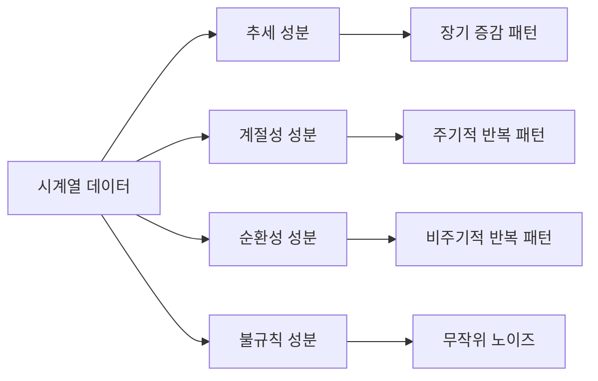
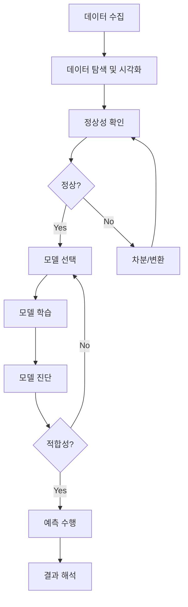

## 🚀 TL;DR


## 📦 사용하는 python package

- 
- 

## 📓 실습 Jupyter Notebook

- 

## 시계열 데이터와 순차적 데이터


## 시계열 데이터의 구성 성분

### 규칙 성분(또는 체계적 성분 , Systematic or Regular Component)


### 불규칙 성분


## 시계열 데이터의 특성

### 기술적 분석(Descriptive Analysis)


### 예측적 분석(Predictive Analysis)


### 독립 항등 분포(IID, Independent and Identically Distributed)


### 자기 상관(Autocorrelation)


### 마르코프 속성(Markov Property)


### 정상성(Stationarity)


## 시계열 데이터의 분석과정


## 시계열의 진동수를 활용한 분석


## 시간에 따른 변화를 분석


## 시계열 데이터의 성분 분해


## 이동 평균 모델(Moving Average Model)


## 자기 회귀 모델(Auto-Regressive Model)


---

## 📊 시계열 데이터의 특성

### 📈 시계열 데이터와 순차적 데이터

**시계열 데이터(Time-series data)**는 **시간 순서로 관측된 일련의 데이터**이다. 일반적으로 동일한 시간 간격마다 측정된 값들의 시퀀스를 말한다.

```python
import pandas as pd
import numpy as np

# 시계열 데이터 생성 예제
dates = pd.date_range(start='2020-01-01', periods=365, freq='D')
values = np.random.randn(365).cumsum()
time_series = pd.Series(values, index=dates)

print(f"시계열 데이터 첫 5개 값:\n{time_series.head()}")
# 출력:
# 2020-01-01   -0.152389
# 2020-01-02   -0.896142
# 2020-01-03   -0.527841
# 2020-01-04   -0.128342
# 2020-01-05    0.275849
```

대표적인 시계열 데이터:

- 시간별 기온
- 음성 데이터
- 연도별 전세계 총 인구수
- 일별 교통사고 건수
- 주식의 가격 데이터

**순차적 데이터(Sequential data)**는 어떠한 순서를 가지는 데이터로, 순서가 바뀌면 의미를 잃는다. 시계열 데이터는 순차적 데이터의 부분집합이다.

```python
# 순차적 데이터 예제 - DNA 시퀀스
dna_sequence = "ATCGATCG"
shuffled_dna = "AGTGTCAC"  # 순서가 바뀌면 다른 의미가 됨

# 시간적 순서를 가진 데이터
text = "시계열 데이터는 시간의 흐름에 따라 발생한다"
```

{: .w-75 .center}

### 🧩 시계열 데이터의 구성성분

시계열 데이터는 규칙(체계적) 성분과 불규칙 성분의 두 부분으로 나눌 수 있다.

#### 1. 규칙 성분(Systematic Component)

시간에 따른 데이터의 변동 중에서, 시간에 따라 보이는 데이터의 패턴이나 경향성에 의해 설명될 수 있는 예측 가능한 변동 성분이다.

**추세(Trend)**

- 데이터가 장기적으로 증가하거나 감소하는 방향성
- 예: 인구 증가, 기술 발전에 따른 생산성 향상

```python
# 추세 분석 예제
from scipy import signal

# 추세가 있는 데이터 생성
t = np.linspace(0, 10, 1000)
trend = 2 * t + 5
seasonal = 10 * np.sin(2 * np.pi * t)
noise = np.random.randn(1000)
data = trend + seasonal + noise

# 이동평균으로 추세 추출
window_size = 30
moving_average = pd.Series(data).rolling(window=window_size).mean()
```

**계절성(Seasonality)**

- 일정한 주기로 규칙적으로 반복되는 패턴
- 예: 계절별 기온 변화, 주중/주말 매출 차이

```python
# 계절성 분석 예제
import matplotlib.pyplot as plt

# 계절성 시각화
months = pd.date_range('2010-01-01', '2020-12-31', freq='M')
seasonal_component = np.sin(2 * np.pi * np.arange(len(months)) / 12)
```

**순환성(Cycle)**

- 불규칙한 주기로 발생하는 변동
- 예: 경제 주기, 태양 흑점 활동

#### 2. 불규칙 성분(Irregular Component)

시간에 따른 규칙적인 움직임과 무관한, 랜덤한 원인에 의한 변동으로 예측이 불가능한 노이즈 성분이다.

```python
# 불규칙 성분 분리 예제
from statsmodels.tsa.seasonal import seasonal_decompose

# 데이터 분해
result = seasonal_decompose(time_series, model='additive', period=30)
trend = result.trend
seasonal = result.seasonal
residual = result.resid

plt.figure(figsize=(12, 8))
plt.subplot(411)
plt.plot(time_series)
plt.title('Original Data')
plt.subplot(412)
plt.plot(trend)
plt.title('Trend')
plt.subplot(413)
plt.plot(seasonal)
plt.title('Seasonal')
plt.subplot(414)
plt.plot(residual)
plt.title('Residual (Irregular)')
plt.tight_layout()
```

### 🔄 시계열 데이터의 특성

#### 1. 독립항등분포(IID) 가정의 한계

머신러닝에서 다루는 대부분의 모델은 IID(Independent and Identically Distributed) 가정을 전제로 한다. 하지만 시계열 데이터는 이 가정을 만족하지 못한다.

```python
# 주사위 예제 - IID 성질을 가짐
dice_rolls = np.random.randint(1, 7, size=1000)
print(f"주사위 첫 10회 결과: {dice_rolls[:10]}")

# 시계열 데이터 - IID 가정 불성립
stock_prices = pd.Series(np.random.randn(1000).cumsum())
print(f"주식 가격 변화 첫 10개: {stock_prices[:10]}")
```

과거 값이 미래 값에 영향을 주는 자기상관(Autocorrelation) 때문에 시계열 데이터는 독립성을 만족하지 않는다.

#### 2. 자기상관(Autocorrelation)

한 시계열 내에서 자기자신과 다른 시점과의 상관관계를 나타낸다.

$$\text{Corr}(x_t, x_{t+k})$$

```python
# 자기상관 분석
from statsmodels.graphics.tsaplots import plot_acf

# 자기상관 시각화
fig, ax = plt.subplots(figsize=(12, 6))
plot_acf(time_series, lags=40, ax=ax)
ax.set_title('Autocorrelation Function')
```

- 시차 1의 자기상관이 높으면: 오늘의 데이터는 어제의 데이터가 가장 잘 설명
- 시차 12의 자기상관이 높으면: 한 달 전 데이터와 강한 상관관계

#### 3. 마르코프 속성(Markov Property)

현재 상태가 오직 직전 상태에만 의존하는 성질이다.

$$p(x_N|x_{N-1}, \ldots, x_1) = p(x_N|x_{N-1})$$

```python
# 마르코프 체인 예제
import networkx as nx

# 날씨 상태 전이 모델
weather_transitions = {
    'sunny': {'sunny': 0.7, 'rainy': 0.3},
    'rainy': {'sunny': 0.5, 'rainy': 0.5}
}

# 마르코프 체인 시뮬레이션
def simulate_weather(days, initial_state='sunny'):
    states = [initial_state]
    current = initial_state
    
    for _ in range(days-1):
        next_state = np.random.choice(
            list(weather_transitions[current].keys()),
            p=list(weather_transitions[current].values())
        )
        states.append(next_state)
        current = next_state
    
    return states

weather_sequence = simulate_weather(30)
print(f"30일간 날씨 시퀀스: {weather_sequence}")
```

#### 4. 정상성(Stationarity)

정상성은 시계열 분석에서 가장 중요한 개념 중 하나이다.

- **강정상성**: 모든 시점에서의 결합 확률분포가 동일
- **약정상성**: 평균과 분산이 시간에 따라 일정, 공분산이 시차에만 의존

```python
# 정상성 테스트
from statsmodels.tsa.stattools import adfuller

def check_stationarity(timeseries):
    # ADF 테스트 수행
    result = adfuller(timeseries)
    print('ADF Statistic:', result[0])
    print('p-value:', result[1])
    print('Critical Values:')
    for key, value in result[4].items():
        print(f'\t{key}: {value}')
    
    # 결과 해석
    if result[1] <= 0.05:
        print("데이터는 정상적(stationary)")
    else:
        print("데이터는 비정상적(non-stationary)")

# 비정상성 데이터
non_stationary = pd.Series(np.random.randn(1000).cumsum())
check_stationarity(non_stationary)

# 차분으로 정상성 확보
differenced = non_stationary.diff().dropna()
check_stationarity(differenced)
```

비정상성 데이터는 다음과 같은 방법으로 정상화할 수 있다:

- 차분(Differencing): $y_t = x_t - x_{t-1}$
- 로그 변환: $y_t = \log(x_t)$
- 계절차분: $y_t = x_t - x_{t-s}$

## 🛠️ 시계열 데이터 모델링 방법론

### 📑 시계열 데이터의 분석방법

시계열 데이터 분석은 크게 두 가지 접근법으로 나눌 수 있다:

1. **시계열의 진동수를 활용한 분석**
    
    - 푸리에(Fourier) 분석
    - 스펙트럼 밀도(Spectrum Density) 분석
    - 웨이브렛(Wavelet) 분석
2. **시간에 따른 변화를 분석**
    
    - 자기회귀모델(Autoregressive model)
    - 이동평균(Moving Average)
    - 추세(trend)분석
    - 성분분해(decomposition)

```python
# 푸리에 변환 예제
from scipy.fft import fft, fftfreq

# 주파수 성분 분석
n = len(time_series)
yf = fft(time_series)
xf = fftfreq(n, 1 / n)  # 샘플링 주파수 가정

plt.figure(figsize=(12, 6))
plt.plot(xf[:n//2], 2.0/n * np.abs(yf[:n//2]))
plt.xlabel('Frequency')
plt.ylabel('Amplitude')
plt.title('Frequency Spectrum')
```

### 🔬 시계열 데이터의 분해

시계열 데이터를 각 성분으로 분해하여 예측이나 계절성에 따른 변화를 조정하는데 활용한다.

```python
# 계절성 분해 예제
from statsmodels.tsa.seasonal import seasonal_decompose

# 가법 모델 분해
additive_decomposition = seasonal_decompose(time_series, 
                                           model='additive', 
                                           period=30)

# 곱셈 모델 분해  
multiplicative_decomposition = seasonal_decompose(time_series,
                                                  model='multiplicative',
                                                  period=30)

# 시각화
fig, (ax1, ax2, ax3, ax4) = plt.subplots(4, 1, figsize=(12, 16))
ax1.plot(time_series)
ax1.set_title('Original')
ax2.plot(additive_decomposition.trend)
ax2.set_title('Trend')
ax3.plot(additive_decomposition.seasonal)
ax3.set_title('Seasonal')
ax4.plot(additive_decomposition.resid)
ax4.set_title('Residual')
```

### 📊 이동평균과 자기회귀 모델

#### 이동평균 모델 (Moving Average Model)

이동평균은 시계열 데이터에서 단기적인 변동을 smoothing하여 제거하고, 장기적인 추세를 더 잘 확인할 수 있게 한다.

```python
# 이동평균 계산
def calculate_moving_average(data, window):
    return data.rolling(window=window).mean()

# 여러 윈도우 크기로 이동평균 계산
data = pd.Series(np.random.randn(100).cumsum())
ma_5 = calculate_moving_average(data, 5)
ma_20 = calculate_moving_average(data, 20)

# 시각화
plt.figure(figsize=(12, 6))
plt.plot(data.index, data, label='Original', alpha=0.5)
plt.plot(data.index, ma_5, label='MA(5)', linewidth=2)
plt.plot(data.index, ma_20, label='MA(20)', linewidth=2)
plt.legend()
plt.title('Moving Average Comparison')
```

#### 자기회귀 모델 (Autoregressive Model)

AR 모델은 과거의 값들을 이용해 현재의 값을 예측하는 모델이다.

$$x_t = \phi_1 x_{t-1} + \phi_2 x_{t-2} + ... + \phi_p x_{t-p} + \epsilon_t$$

```python
# AR 모델 구현
from statsmodels.tsa.ar_model import AutoReg

# AR 모델 학습
model = AutoReg(time_series, lags=5)
model_fitted = model.fit()

# 예측
predictions = model_fitted.predict(start=len(time_series), 
                                  end=len(time_series)+10)

# 모델 평가
print(model_fitted.summary())
```

#### ARIMA 모델

ARIMA는 AR, I(통합), MA를 결합한 모델로 비정상성 시계열 데이터에 적용할 수 있다.

```python
# ARIMA 모델 구현
from statsmodels.tsa.arima.model import ARIMA

# 모델 선택을 위한 AIC 비교
best_aic = float('inf')
best_order = None
best_model = None

for p in range(0, 3):
    for d in range(0, 3):
        for q in range(0, 3):
            try:
                model = ARIMA(time_series, order=(p,d,q))
                model_fit = model.fit()
                if model_fit.aic < best_aic:
                    best_aic = model_fit.aic
                    best_order = (p,d,q)
                    best_model = model_fit
            except:
                continue

print(f"Best ARIMA{best_order} with AIC: {best_aic}")

# 예측
forecast = best_model.forecast(steps=30)
```

## 💡 실무 활용 사례

### 1. 주식 가격 예측

```python
# 주식 데이터로드 및 전처리
import yfinance as yf

# 데이터 다운로드
stock = yf.download('AAPL', start='2020-01-01', end='2023-12-31')

# 기술적 지표 계산
stock['MA50'] = stock['Close'].rolling(window=50).mean()
stock['MA200'] = stock['Close'].rolling(window=200).mean()
stock['RSI'] = calculate_rsi(stock['Close'], 14)

# 예측 모델 구축
X = stock[['MA50', 'MA200', 'RSI']].dropna()
y = stock['Close'].shift(-1).dropna()
```

### 2. 웹 트래픽 예측

```python
# 웹 트래픽 데이터 분석
web_traffic = pd.read_csv('web_traffic.csv', parse_dates=['date'])
web_traffic.set_index('date', inplace=True)

# 계절성 패턴 분석
hourly_pattern = web_traffic.groupby(web_traffic.index.hour).mean()
weekly_pattern = web_traffic.groupby(web_traffic.index.dayofweek).mean()

# Prophet 모델 적용
from prophet import Prophet

prophet_data = web_traffic.reset_index()
prophet_data.columns = ['ds', 'y']

model = Prophet(yearly_seasonality=True,
                weekly_seasonality=True,
                daily_seasonality=True)
model.fit(prophet_data)

# 예측
future = model.make_future_dataframe(periods=30*24, freq='H')
forecast = model.predict(future)
```

### 3. 이상 탐지 (Anomaly Detection)

```python
# 시계열 이상 탐지
from sklearn.ensemble import IsolationForest

# 특성 추출
features = pd.DataFrame({
    'value': time_series,
    'rolling_mean': time_series.rolling(window=24).mean(),
    'rolling_std': time_series.rolling(window=24).std(),
    'hour': time_series.index.hour,
    'dayofweek': time_series.index.dayofweek
}).dropna()

# 이상 탐지 모델
iso_forest = IsolationForest(contamination=0.05, random_state=42)
anomalies = iso_forest.fit_predict(features)

# 이상치 시각화
plt.figure(figsize=(12, 6))
plt.plot(time_series.index, time_series, label='Time Series')
plt.scatter(time_series.index[anomalies == -1], 
           time_series[anomalies == -1],
           color='red', label='Anomalies')
plt.legend()
plt.title('Anomaly Detection in Time Series')
```


---

## 📈 시계열 데이터와 순차적 데이터

**시계열 데이터**란 시간의 흐름에 따라 순서대로 기록된 관측값들의 집합이다. 주가 변동, 기온 변화, 인구 증가 등이 대표적인 사례다. 이러한 데이터는 시간 순서가 중요한 의미를 가지며, 이를 무시하고 단순히 섞어버리면 중요한 정보를 잃게 된다.

[시계열 데이터 구조 시각화]

### 주요 특징

- **시간 의존성**: 하나의 관측값이 앞뒤 관측값과 연관이 있다
- **순서성**: 데이터의 순서가 바뀌면 의미가 변할 수 있다
- **패턴 존재**: 추세, 계절성, 주기성 등 반복되는 패턴이 나타난다

```python
import pandas as pd
import numpy as np
import matplotlib.pyplot as plt

# 시계열 데이터 생성 예제
dates = pd.date_range(start='2020-01-01', end='2020-12-31', freq='D')
time_series = pd.Series(np.random.randn(len(dates)), index=dates)

# 시각화
plt.figure(figsize=(12, 6))
plt.plot(time_series.index, time_series.values)
plt.title('시계열 데이터 예제')
plt.xlabel('날짜')
plt.ylabel('값')
# 출력: 2020년 연중 랜덤 시계열 데이터 그래프
```

## 🔄 시계열 데이터의 구성 성분

### 규칙 성분(Systematic Component)

**규칙 성분**은 예측 가능한 패턴을 의미하며, 다음과 같이 분류된다:

1. **추세(Trend)**: 장기적인 증가 또는 감소 경향
2. **계절성(Seasonality)**: 규칙적인 주기로 반복되는 패턴
3. **순환성(Cyclical)**: 불규칙한 주기로 반복되는 패턴



> 시계열의 규칙 성분은 데이터의 전반적인 구조를 이해하고 예측하는 데 핵심적인 역할을 한다. 이러한 성분들을 정확히 파악해야 효과적인 예측 모델을 구축할 수 있다. {: .prompt-tip}

### 불규칙 성분(Irregular Component)

**불규칙 성분**은 예측 불가능한 무작위 변동을 의미한다. 이는 다음과 같은 특징을 가진다:

- 예측할 수 없는 무작위성
- 평균이 0인 특성
- 외부 충격(shock) 또는 노이즈로 인해 발생

```python
# 시계열 성분 분해 실습
from statsmodels.tsa.seasonal import seasonal_decompose

# 주가 데이터 생성 (ARIMA 모델 활용)
np.random.seed(42)
n_points = 365
t = np.arange(n_points)
trend = 0.02 * t + 50
seasonal = 10 * np.sin(2 * np.pi * t / 30)
noise = np.random.normal(0, 2, n_points)
stock_price = trend + seasonal + noise

# pandas 시계열로 변환
stock_ts = pd.Series(stock_price, index=pd.date_range('2020-01-01', periods=n_points))

# 성분 분해
decomposition = seasonal_decompose(stock_ts, model='additive', period=30)

# 시각화
fig, (ax1, ax2, ax3, ax4) = plt.subplots(4, 1, figsize=(12, 10))
decomposition.observed.plot(ax=ax1)
ax1.set_title('원본 데이터')
decomposition.trend.plot(ax=ax2)
ax2.set_title('추세 성분')
decomposition.seasonal.plot(ax=ax3)
ax3.set_title('계절성 성분')
decomposition.resid.plot(ax=ax4)
ax4.set_title('불규칙 성분')
# 출력: 주가 데이터의 4가지 성분 시각화
```

## 📊 시계열 데이터의 특성

### 기술적 분석(Descriptive Analysis)

**기술적 분석**은 시계열 데이터의 과거 패턴을 파악하는 방법이다. 주로 금융 시장에서 기술적 지표를 통해 매매 시점을 결정하는 데 사용된다.

주요 분석 방법:

- 이동 평균선(Moving Average)
- 볼린저 밴드(Bollinger Bands)
- RSI(Relative Strength Index)
- MACD(Moving Average Convergence Divergence)

```python
# 기술적 분석 예제
import ta

# 주가 데이터 생성
stock_data = pd.DataFrame({
    'Close': stock_ts,
    'High': stock_ts * 1.02,
    'Low': stock_ts * 0.98,
    'Volume': np.random.randint(1000, 5000, n_points)
})

# 이동 평균 계산
stock_data['MA20'] = stock_data['Close'].rolling(window=20).mean()
stock_data['MA50'] = stock_data['Close'].rolling(window=50).mean()

# RSI 계산
stock_data['RSI'] = ta.momentum.RSIIndicator(stock_data['Close']).rsi()

# 시각화
fig, (ax1, ax2) = plt.subplots(2, 1, figsize=(12, 8))
stock_data[['Close', 'MA20', 'MA50']].plot(ax=ax1)
ax1.set_title('주가와 이동 평균선')
stock_data['RSI'].plot(ax=ax2)
ax2.set_title('RSI 지표')
# 출력: 주가 차트와 기술적 지표 시각화
```

### 예측적 분석(Predictive Analysis)

**예측적 분석**은 과거 데이터를 바탕으로 미래를 예측하는 방법이다. 시계열 예측에는 다양한 모델이 사용된다:

1. **통계 모델**: ARIMA, SARIMA, 지수 평활법
2. **머신러닝 모델**: XGBoost, Random Forest, LSTM
3. **하이브리드 모델**: 여러 모델을 조합한 앙상블 방법

```python
# ARIMA 모델을 이용한 예측 예제
from pmdarima import auto_arima

# 자동 ARIMA 모델 적합
model = auto_arima(stock_ts, seasonal=True, m=30, trace=True)

# 미래 30일 예측
forecast = model.predict(n_periods=30)
forecast_index = pd.date_range(start=stock_ts.index[-1], periods=31, freq='D')[1:]

# 시각화
plt.figure(figsize=(12, 6))
plt.plot(stock_ts.index[-90:], stock_ts.values[-90:], label='실제 데이터')
plt.plot(forecast_index, forecast, label='예측값', color='red')
plt.title('ARIMA 모델 주가 예측')
plt.legend()
# 출력: 실제 주가와 ARIMA 예측값 비교 그래프
```

### 독립 항등 분포(IID)

**IID**는 데이터가 서로 독립적이고 동일한 분포를 따른다는 가정이다.

$$ X_1, X_2, ..., X_n \sim IID(F) $$

여기서:

- 독립성: $P(X_i | X_j) = P(X_i)$ for all $i \neq j$
- 항등성: $X_i \sim F$ for all $i$

> 시계열 데이터는 일반적으로 IID 가정을 위반한다. 자기 상관으로 인해 데이터 포인트들이 서로 의존적이기 때문이다. 이는 전통적인 통계 방법 대신 시계열 전용 분석 방법을 사용해야 하는 이유이다. {: .prompt-warning}

### 자기 상관(Autocorrelation)

**자기 상관**은 시계열의 현재 값이 과거 값과 얼마나 관련이 있는지를 측정하는 지표이다.

ACF(Autocorrelation Function): $$ \rho_k = \frac{Cov(Y_t, Y_{t-k})}{Var(Y_t)} $$

```python
# 자기상관함수 분석
from statsmodels.graphics.tsaplots import plot_acf, plot_pacf

fig, (ax1, ax2) = plt.subplots(2, 1, figsize=(12, 8))

# ACF 플롯
plot_acf(stock_ts, lags=40, ax=ax1)
ax1.set_title('Autocorrelation Function (ACF)')

# PACF 플롯
plot_pacf(stock_ts, lags=40, ax=ax2)
ax2.set_title('Partial Autocorrelation Function (PACF)')
# 출력: ACF와 PACF 플롯
```

### 마르코프 속성(Markov Property)

**마르코프 속성**은 미래 상태가 현재 상태에만 의존하고 과거 상태에는 직접적으로 의존하지 않는다는 개념이다.

$$ P(X_{t+1} | X_t, X_{t-1}, ..., X_1) = P(X_{t+1} | X_t) $$

이는 시계열 모델링에서 매우 중요한 가정으로, 많은 예측 모델의 기초가 된다.

### 정상성(Stationarity)

**정상 시계열**은 시간에 따라 통계적 특성이 변하지 않는 시계열을 의미한다. 강정상성과 약정상성으로 구분된다.

**약정상성 조건**:

1. 평균이 시간에 무관: $E[Y_t] = \mu$ (상수)
2. 분산이 시간에 무관: $Var[Y_t] = \sigma^2$ (상수)
3. 공분산이 시차에만 의존: $Cov[Y_t, Y_{t-k}] = \gamma_k$

> 시계열 분석의 많은 모델들은 정상성을 가정한다. 비정상 시계열의 경우 차분(differencing)이나 변환을 통해 정상화시켜야 한다. {: .prompt-tip}

```python
# 정상성 검정
from statsmodels.tsa.stattools import adfuller

# Augmented Dickey-Fuller 테스트
result = adfuller(stock_ts)
print(f'ADF Statistic: {result[0]}')
print(f'p-value: {result[1]}')
print('Critical Values:')
for key, value in result[4].items():
    print(f'\t{key}: {value}')

# 차분을 통한 정상화
diff_ts = stock_ts.diff().dropna()

# 정상화 후 재검정
result_diff = adfuller(diff_ts)
print(f'\n차분 후 ADF Statistic: {result_diff[0]}')
print(f'차분 후 p-value: {result_diff[1]}')
# 출력: 정상성 검정 결과와 차분 후 검정 결과
```

## 🔍 시계열 데이터의 분석과정

시계열 데이터 분석은 체계적인 과정을 따른다:



### 1단계: 데이터 탐색

- 데이터의 시간 범위 확인
- 누락값, 이상치 처리
- 기본 통계량 분석

### 2단계: 시각화

- 시계열 플롯으로 전반적인 패턴 파악
- ACF/PACF 플롯으로 자기상관 분석
- 계절-추세 분해 플롯

### 3단계: 전처리

- 정상성 확보를 위한 차분
- 계절성 조정
- 로그 변환 등 안정화 변환

### 4단계: 모델링

- 적절한 모델 선택 (ARIMA, SARIMA 등)
- 파라미터 최적화
- 모델 진단 및 검증

### 5단계: 예측과 평가

- 예측 수행
- 신뢰구간 계산
- 예측 성능 평가 (MAE, RMSE, MAPE)

## 🌊 시계열의 진동수를 활용한 분석

**푸리에 변환(Fourier Transform)**을 통해 시계열의 주파수 성분을 분석할 수 있다. 이는 주기성이 강한 신호 분석에 특히 유용하다.

$$ X(f) = \int_{-\infty}^{\infty} x(t) e^{-j2\pi ft} dt $$

```python
# 주파수 도메인 분석
from scipy.fft import fft, fftfreq

# FFT 수행
n = len(stock_ts)
yf = fft(stock_ts)
freq = fftfreq(n, 1)  # 일별 데이터

# 파워 스펙트럼 플롯
plt.figure(figsize=(12, 6))
plt.plot(freq[:n//2], np.abs(yf[:n//2]))
plt.title('파워 스펙트럼')
plt.xlabel('주파수')
plt.ylabel('진폭')
# 출력: 주파수 도메인에서의 시계열 분석
```

## ⏳ 시간에 따른 변화를 분석

### 점진적 변화 분석

- **선형 추세 분석**: 회귀 분석을 통한 장기 추세 파악
- **로그 선형 모델**: 기하급수적 성장 패턴 분석
- **구간별 추세 분석**: 시계열 구간 분할 후 각 구간의 특성 분석

```python
# 추세 분석 예제
import statsmodels.api as sm

# 시간 변수 생성
t = np.arange(len(stock_ts))
X = sm.add_constant(t)

# 선형 회귀 모델
model = sm.OLS(stock_ts, X).fit()
print(model.summary())

# 추세선 시각화
plt.figure(figsize=(12, 6))
plt.scatter(t, stock_ts, alpha=0.5, label='실제 데이터')
plt.plot(t, model.predict(X), 'r-', label='추세선')
plt.title('선형 추세 분석')
plt.legend()
# 출력: 주가 데이터의 선형 추세선
```

## 🔬 시계열 데이터의 성분 분해

### 가법 모델 (Additive Model)

$$ Y_t = T_t + S_t + R_t $$

여기서:

- $Y_t$: 관측값
- $T_t$: 추세 성분
- $S_t$: 계절성 성분
- $R_t$: 잔차(불규칙) 성분

### 승법 모델 (Multiplicative Model)

$$ Y_t = T_t \times S_t \times R_t $$

```python
# 성분 분해 비교
from statsmodels.tsa.seasonal import seasonal_decompose

# 가법 모델
additive = seasonal_decompose(stock_ts, model='additive', period=30)

# 승법 모델 (양수 값만 있는 경우)
positive_ts = stock_ts + abs(stock_ts.min()) + 1
multiplicative = seasonal_decompose(positive_ts, model='multiplicative', period=30)

# 비교 시각화
fig, axes = plt.subplots(2, 2, figsize=(15, 10))
additive.trend.plot(ax=axes[0,0], title='가법 모델 - 추세')
additive.seasonal.plot(ax=axes[0,1], title='가법 모델 - 계절성')
multiplicative.trend.plot(ax=axes[1,0], title='승법 모델 - 추세')
multiplicative.seasonal.plot(ax=axes[1,1], title='승법 모델 - 계절성')
# 출력: 가법 모델과 승법 모델 비교
```

## 📈 이동 평균 모델(MA)

**이동 평균 모델**은 과거의 오차(noise)를 이용해 현재값을 예측하는 모델이다.

MA(q) 모델: $$ Y_t = \mu + \epsilon_t + \theta_1\epsilon_{t-1} + ... + \theta_q\epsilon_{t-q} $$

여기서 $\epsilon_t$는 백색 잡음(white noise)이다.

### MA 모델의 특징

- 메모리가 제한적 (최대 q 시점까지만 영향)
- ACF가 q차수에서 급격히 감소
- 유한한 기억력 (Finite memory)

```python
# MA 모델 예제
from statsmodels.tsa.arima.model import ARIMA

# MA(2) 모델 적합
ma_model = ARIMA(stock_ts, order=(0, 0, 2))
ma_result = ma_model.fit()

# 모델 진단
print(ma_result.summary())

# 잔차 분석
plt.figure(figsize=(12, 6))
ma_result.resid.plot()
plt.title('MA(2) 모델 잔차')
plt.xlabel('날짜')
plt.ylabel('잔차')
# 출력: MA 모델의 잔차 플롯
```

## 🔄 자기 회귀 모델(AR)

**자기 회귀 모델**은 과거의 값을 이용해 현재값을 예측하는 모델이다.

AR(p) 모델: $$ Y_t = c + \phi_1Y_{t-1} + \phi_2Y_{t-2} + ... + \phi_pY_{t-p} + \epsilon_t $$

여기서:

- $c$: 상수항
- $\phi_i$: 자기 회귀 계수
- $\epsilon_t$: 백색 잡음

### AR 모델의 특징

- PACF가 p차수에서 급격히 감소
- 무한한 기억력 (Infinite memory)
- 안정성을 위해 $|\phi| < 1$ 조건 필요

```python
# AR 모델 예제
# AR(2) 모델 적합
ar_model = ARIMA(stock_ts, order=(2, 0, 0))
ar_result = ar_model.fit()

# 모델 요약
print(ar_result.summary())

# 예측
forecast_ar = ar_result.forecast(steps=30)

# 시각화
plt.figure(figsize=(12, 6))
plt.plot(stock_ts.index[-90:], stock_ts.values[-90:], label='실제 데이터')
plt.plot(forecast_index, forecast_ar, label='AR(2) 예측', color='green')
plt.title('AR 모델 예측')
plt.legend()
# 출력: AR 모델 예측 결과
```

## 🚀 실무 적용 사례

### 1. 소매업 수요 예측

시계열 분석을 통해 제품 수요를 예측하여 재고를 최적화할 수 있다:

```python
# 소매업 수요 예측 예제
from sklearn.metrics import mean_absolute_error, mean_squared_error

# 주간 판매 데이터 생성
weekly_sales = stock_ts.resample('W').sum().asfreq('W', method='pad')

# 계절적 ARIMA 모델
sarima_model = ARIMA(weekly_sales, order=(1,1,1), seasonal_order=(1,1,1,52))
sarima_result = sarima_model.fit()

# 예측 수행
forecast_weekly = sarima_result.forecast(steps=12)

# 예측 성능 평가
if len(weekly_sales) > 12:
    actual = weekly_sales[-12:]
    predicted = forecast_weekly[:12]
    
    mae = mean_absolute_error(actual, predicted)
    rmse = np.sqrt(mean_squared_error(actual, predicted))
    
    print(f'Mean Absolute Error: {mae:.2f}')
    print(f'Root Mean Square Error: {rmse:.2f}')
# 출력: 수요 예측 성능 지표
```

### 2. 금융 리스크 관리

시계열 분석을 통해 Value at Risk (VaR) 계산:

```python
# VaR 계산 예제
def calculate_var(returns, confidence_level=0.95):
    """
    Value at Risk 계산
    """
    # 수익률 계산
    daily_returns = returns.pct_change().dropna()
    
    # GARCH 모델로 변동성 예측
    from arch import arch_model
    
    garch_model = arch_model(daily_returns * 100, vol='GARCH', p=1, q=1)
    garch_result = garch_model.fit(disp='off')
    
    # 조건부 변동성 예측
    forecast = garch_result.forecast(horizon=1)
    volatility = forecast.variance.values[-1] ** 0.5
    
    # VaR 계산
    from scipy.stats import norm
    var = norm.ppf(1 - confidence_level) * volatility
    
    return var

var_95 = calculate_var(stock_ts)
print(f'95% VaR: {var_95:.4f}')
# 출력: 일일 95% 신뢰수준의 VaR 값
```

### 3. 웹 트래픽 예측

웹사이트 트래픽 패턴 분석과 예측:

```python
# 웹 트래픽 분석 예제
# 시간대별 트래픽 패턴 생성
hourly_traffic = pd.DataFrame({
    'hour': range(24),
    'weekday_avg': [100, 80, 60, 40, 30, 40, 80, 120, 150, 160, 
                    155, 160, 165, 170, 175, 180, 185, 190, 180, 170, 
                    160, 140, 120, 110],
    'weekend_avg': [80, 70, 60, 50, 40, 40, 50, 60, 70, 80, 
                    90, 100, 110, 120, 120, 120, 115, 110, 100, 90, 
                    80, 75, 70, 75]
})

# 시각화
plt.figure(figsize=(12, 6))
plt.plot(hourly_traffic['hour'], hourly_traffic['weekday_avg'], 
         label='주중 평균', marker='o')
plt.plot(hourly_traffic['hour'], hourly_traffic['weekend_avg'], 
         label='주말 평균', marker='s')
plt.title('시간대별 웹 트래픽 패턴')
plt.xlabel('시간')
plt.ylabel('방문자 수')
plt.xticks(range(0, 24, 2))
plt.legend()
plt.grid(True, alpha=0.3)
# 출력: 평일과 주말의 시간대별 트래픽 패턴
```
