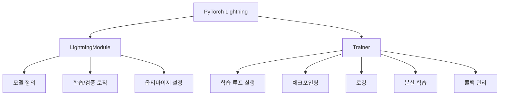
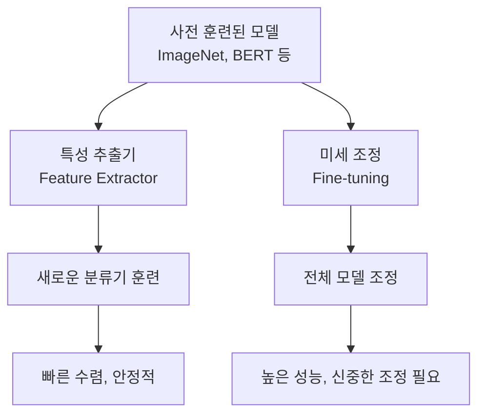

## 📦 사용하는 python package

- pytorch-lightning==2.4.0
- torch==2.5.0
- torchvision==0.20.0
- numpy==1.26.4
- matplotlib==3.10.1
- tensorboard==2.18.0

## 🚀 TL;DR

- **PyTorch Lightning**은 PyTorch 위에 구축된 **고수준 프레임워크**로, 복잡한 딥러닝 코드를 **체계적으로 구조화**해주는 도구
- **보일러플레이트 코드**를 대폭 줄이고 **연구 코드와 엔지니어링 코드를 분리**하여 개발 생산성을 크게 향상시킴
- **LightningModule**과 **Trainer**라는 핵심 추상화를 통해 모델 정의와 학습 루프를 깔끔하게 분리
- **체크포인팅**, **로깅**, **분산 학습**, **혼합 정밀도** 등 실무에 필요한 기능을 **자동화**하고 **표준화**
- GPU/TPU 다중 장치 학습을 **한 줄 설정**으로 가능하게 하여 **확장성** 문제를 해결
- **Kaggle**, **연구소**, **스타트업**에서 **프로토타이핑부터 프로덕션**까지 널리 활용되는 **산업 표준** 프레임워크

## 📓 실습 Jupyter Notebook

- [PyTorch Lightning 기초 실습](https://github.com/yuiyeong/notebooks/blob/main/deep_learning/pytorch_lightning_basics.ipynb)
- [분산 학습과 고급 기능](https://github.com/yuiyeong/notebooks/blob/main/deep_learning/pytorch_lightning_advanced.ipynb)

## ⚡ PyTorch Lightning이란?

**PyTorch Lightning**은 PyTorch를 기반으로 구축된 **고수준 딥러닝 프레임워크**로, 복잡하고 반복적인 딥러닝 코드를 **체계적으로 구조화**하고 **자동화**해주는 도구다.

쉽게 비유하면, PyTorch가 "자유도 높은 프로그래밍 언어"라면 PyTorch Lightning은 "베스트 프랙티스가 내장된 개발 프레임워크"라고 할 수 있다. 마치 웹 개발에서 Django나 Flask가 HTTP 처리, 라우팅, 데이터베이스 연결 등을 추상화하듯이, Lightning은 딥러닝의 학습 루프, 검증, 체크포인팅 등을 추상화한다.

### PyTorch Lightning의 핵심 철학

Lightning은 **"연구 코드와 엔지니어링 코드의 분리"** 라는 명확한 철학을 가지고 있다.

- **연구 코드**: 모델 아키텍처, 손실 함수, 옵티마이저 등 **핵심 로직**
- **엔지니어링 코드**: GPU 설정, 분산 학습, 체크포인팅, 로깅 등 **인프라 관련 코드**

```python
# 기존 PyTorch: 연구 코드와 엔지니어링 코드가 섞여있음
for epoch in range(num_epochs):
    model.train()
    for batch in train_loader:
        # 연구 코드
        outputs = model(batch)
        loss = criterion(outputs, targets)
        
        # 엔지니어링 코드
        optimizer.zero_grad()
        loss.backward()
        optimizer.step()
        
        # 더 많은 엔지니어링 코드...
        if step % log_interval == 0:
            logger.log({"loss": loss.item()})
        if step % save_interval == 0:
            save_checkpoint(model, optimizer, epoch)

# PyTorch Lightning: 연구 코드만 집중
class MyLightningModule(pl.LightningModule):
    def training_step(self, batch, batch_idx):
        # 연구 코드만 작성
        outputs = self(batch)
        loss = self.criterion(outputs, targets)
        return loss  # 나머지는 자동 처리!
```

> PyTorch Lightning은 "딥러닝 엔지니어링의 Django"라고 불릴 만큼, 복잡한 인프라 코드를 추상화하여 연구자와 개발자가 핵심 로직에만 집중할 수 있게 해준다. {: .prompt-tip}

## 🏗️ 핵심 구성요소: LightningModule과 Trainer

PyTorch Lightning의 아키텍처는 두 개의 핵심 추상화로 구성된다.



### LightningModule: 모델의 모든 것

**LightningModule**은 `torch.nn.Module`을 상속받은 클래스로, 모델의 **구조**와 **학습 로직**을 정의하는 곳이다. 이는 "모델이 무엇을 해야 하는가"에 대한 모든 정보를 담고 있다.

```python
import pytorch_lightning as pl
import torch
import torch.nn as nn
import torch.nn.functional as F
from torch.optim import Adam

class SimpleCNN(pl.LightningModule):
    def __init__(self, num_classes=10, learning_rate=1e-3):
        super().__init__()
        # 하이퍼파라미터 자동 저장
        self.save_hyperparameters()
        
        # 모델 아키텍처 정의
        self.conv1 = nn.Conv2d(3, 64, kernel_size=3, padding=1)
        self.conv2 = nn.Conv2d(64, 128, kernel_size=3, padding=1)
        self.pool = nn.MaxPool2d(2, 2)
        self.fc1 = nn.Linear(128 * 8 * 8, 512)
        self.fc2 = nn.Linear(512, num_classes)
        self.dropout = nn.Dropout(0.5)
        
        # 손실 함수
        self.criterion = nn.CrossEntropyLoss()
    
    def forward(self, x):
        """순전파 정의"""
        x = self.pool(F.relu(self.conv1(x)))
        x = self.pool(F.relu(self.conv2(x)))
        x = x.view(-1, 128 * 8 * 8)
        x = F.relu(self.fc1(x))
        x = self.dropout(x)
        x = self.fc2(x)
        return x
    
    def training_step(self, batch, batch_idx):
        """학습 스텝 정의"""
        x, y = batch
        logits = self(x)
        loss = self.criterion(logits, y)
        
        # 정확도 계산
        preds = torch.argmax(logits, dim=1)
        acc = torch.sum(preds == y).float() / len(y)
        
        # 로깅
        self.log('train_loss', loss, prog_bar=True)
        self.log('train_acc', acc, prog_bar=True)
        
        return loss
    
    def validation_step(self, batch, batch_idx):
        """검증 스텝 정의"""
        x, y = batch
        logits = self(x)
        loss = self.criterion(logits, y)
        
        preds = torch.argmax(logits, dim=1)
        acc = torch.sum(preds == y).float() / len(y)
        
        # 검증 메트릭 로깅
        self.log('val_loss', loss, prog_bar=True)
        self.log('val_acc', acc, prog_bar=True)
        
        return loss
    
    def configure_optimizers(self):
        """옵티마이저 설정"""
        optimizer = Adam(self.parameters(), lr=self.hparams.learning_rate)
        
        # 스케줄러도 함께 설정 가능
        scheduler = torch.optim.lr_scheduler.StepLR(optimizer, step_size=7, gamma=0.1)
        
        return {
            "optimizer": optimizer,
            "lr_scheduler": {
                "scheduler": scheduler,
                "interval": "epoch",
                "frequency": 1
            }
        }

# 모델 인스턴스 생성
model = SimpleCNN(num_classes=10, learning_rate=1e-3)
print(f"모델 파라미터 수: {sum(p.numel() for p in model.parameters()):,}")
# 출력: 모델 파라미터 수: 3,274,058
```

### Trainer: 학습의 모든 것

**Trainer**는 "모델을 어떻게 학습시킬 것인가"에 대한 모든 설정과 실행을 담당한다. GPU 설정, 체크포인팅, 로깅, 조기 종료 등 **엔지니어링적인 모든 요소**를 처리한다.

```python
from pytorch_lightning import Trainer
from pytorch_lightning.callbacks import ModelCheckpoint, EarlyStopping
from pytorch_lightning.loggers import TensorBoardLogger

# 콜백 설정
checkpoint_callback = ModelCheckpoint(
    monitor='val_acc',           # 모니터링할 메트릭
    dirpath='checkpoints/',      # 체크포인트 저장 경로
    filename='best-{epoch:02d}-{val_acc:.2f}',  # 파일명 패턴
    save_top_k=3,               # 상위 3개 모델 저장
    mode='max'                  # 높을수록 좋은 메트릭
)

early_stopping = EarlyStopping(
    monitor='val_loss',         # 모니터링할 메트릭
    patience=5,                 # 개선이 없으면 5 에포크 후 중단
    verbose=True,
    mode='min'                  # 낮을수록 좋은 메트릭
)

# 로거 설정
logger = TensorBoardLogger('lightning_logs', name='simple_cnn')

# Trainer 설정
trainer = Trainer(
    max_epochs=50,                    # 최대 에포크
    accelerator='gpu',                # GPU 사용
    devices=1,                        # GPU 1개 사용
    precision=16,                     # 혼합 정밀도 (메모리 절약)
    callbacks=[checkpoint_callback, early_stopping],
    logger=logger,
    enable_progress_bar=True,         # 진행률 표시
    enable_model_summary=True,        # 모델 요약 출력
    gradient_clip_val=1.0,           # 그래디언트 클리핑
    accumulate_grad_batches=2,       # 그래디언트 누적 (배치 크기 2배 효과)
    val_check_interval=0.25,         # 각 에포크마다 4번 검증
    log_every_n_steps=50,           # 50 스텝마다 로깅
)

print("Trainer 설정 완료!")
print(f"GPU 사용: {trainer.accelerator}")
print(f"정밀도: {trainer.precision}")
# 출력: Trainer 설정 완료!
# 출력: GPU 사용: gpu
# 출력: 정밀도: 16
```

## 📊 데이터 모듈: 데이터 처리의 표준화

PyTorch Lightning에서는 **LightningDataModule**을 통해 데이터 로딩과 전처리를 체계적으로 관리할 수 있다.

```python
import pytorch_lightning as pl
from torch.utils.data import DataLoader, random_split
from torchvision import datasets, transforms

class CIFAR10DataModule(pl.LightningDataModule):
    def __init__(self, data_dir='./data', batch_size=32, num_workers=4):
        super().__init__()
        self.data_dir = data_dir
        self.batch_size = batch_size
        self.num_workers = num_workers
        
        # 데이터 변환 정의
        self.transform = transforms.Compose([
            transforms.Resize((32, 32)),
            transforms.ToTensor(),
            transforms.Normalize((0.5, 0.5, 0.5), (0.5, 0.5, 0.5))
        ])
        
        self.transform_train = transforms.Compose([
            transforms.Resize((32, 32)),
            transforms.RandomHorizontalFlip(0.5),
            transforms.RandomRotation(10),
            transforms.ToTensor(),
            transforms.Normalize((0.5, 0.5, 0.5), (0.5, 0.5, 0.5))
        ])
    
    def prepare_data(self):
        """데이터 다운로드 (모든 GPU에서 실행되지 않음)"""
        datasets.CIFAR10(self.data_dir, train=True, download=True)
        datasets.CIFAR10(self.data_dir, train=False, download=True)
        print("CIFAR10 데이터셋 다운로드 완료!")
    
    def setup(self, stage=None):
        """데이터셋 설정 (각 GPU에서 실행됨)"""
        if stage == 'fit' or stage is None:
            # 학습용 데이터 로드
            full_train = datasets.CIFAR10(
                self.data_dir, 
                train=True, 
                transform=self.transform_train
            )
            
            # 학습/검증 분할
            train_size = int(0.8 * len(full_train))
            val_size = len(full_train) - train_size
            self.train_dataset, self.val_dataset = random_split(
                full_train, [train_size, val_size]
            )
            
        if stage == 'test' or stage is None:
            # 테스트용 데이터 로드
            self.test_dataset = datasets.CIFAR10(
                self.data_dir, 
                train=False, 
                transform=self.transform
            )
            
        print(f"데이터셋 설정 완료! Stage: {stage}")
        if hasattr(self, 'train_dataset'):
            print(f"학습: {len(self.train_dataset)}, 검증: {len(self.val_dataset)}")
    
    def train_dataloader(self):
        """학습 데이터로더"""
        return DataLoader(
            self.train_dataset,
            batch_size=self.batch_size,
            shuffle=True,
            num_workers=self.num_workers,
            pin_memory=True  # GPU 전송 속도 향상
        )
    
    def val_dataloader(self):
        """검증 데이터로더"""
        return DataLoader(
            self.val_dataset,
            batch_size=self.batch_size,
            shuffle=False,
            num_workers=self.num_workers,
            pin_memory=True
        )
    
    def test_dataloader(self):
        """테스트 데이터로더"""
        return DataLoader(
            self.test_dataset,
            batch_size=self.batch_size,
            shuffle=False,
            num_workers=self.num_workers,
            pin_memory=True
        )

# 데이터 모듈 생성
data_module = CIFAR10DataModule(batch_size=64, num_workers=4)

# 데이터 준비 및 설정
data_module.prepare_data()
data_module.setup()
# 출력: CIFAR10 데이터셋 다운로드 완료!
# 출력: 데이터셋 설정 완료! Stage: None
# 출력: 학습: 40000, 검증: 10000
```

## 🎯 완전한 학습 실행

이제 모든 구성요소를 조합하여 실제 학습을 실행해보자.

```python
# 모델, 데이터, 트레이너 생성
model = SimpleCNN(num_classes=10, learning_rate=1e-3)
data_module = CIFAR10DataModule(batch_size=64)
trainer = Trainer(
    max_epochs=10,
    accelerator='gpu',
    devices=1,
    callbacks=[checkpoint_callback, early_stopping],
    logger=logger
)

# 학습 시작
print("학습 시작!")
trainer.fit(model, data_module)

# 출력 예시:
# GPU available: True, used: True
# LOCAL_RANK: 0 - CUDA_VISIBLE_DEVICES: [0]
# 
# | Name      | Type             | Params
# -------------------------------------------
# 0 | conv1     | Conv2d           | 1.7 K 
# 1 | conv2     | Conv2d           | 73.9 K
# 2 | pool      | MaxPool2d        | 0     
# 3 | fc1       | Linear           | 3.1 M 
# 4 | fc2       | Linear           | 5.1 K 
# 5 | dropout   | Dropout          | 0     
# 6 | criterion | CrossEntropyLoss | 0     
# -------------------------------------------
# 3.2 M     Trainable params
# 0         Non-trainable params
# 3.2 M     Total params

# 테스트 실행
test_results = trainer.test(model, data_module)
print("테스트 결과:", test_results)
# 출력: 테스트 결과: [{'test_loss': 0.8234, 'test_acc': 0.7123}]
```

> PyTorch Lightning의 진정한 힘은 이렇게 **몇 줄의 코드만으로** 체크포인팅, 로깅, GPU 활용, 조기 종료 등 **프로덕션급 기능들이 모두 자동으로 처리**된다는 점이다. {: .prompt-tip}

## 🚀 고급 기능들

### 분산 학습: 다중 GPU 활용

PyTorch Lightning에서 분산 학습은 **설정 한 줄**로 가능하다.

```python
# 단일 GPU
trainer = Trainer(accelerator='gpu', devices=1)

# 다중 GPU (데이터 병렬)
trainer = Trainer(accelerator='gpu', devices=4)

# 다중 노드 분산 학습
trainer = Trainer(
    accelerator='gpu',
    devices=4,
    num_nodes=2,
    strategy='ddp'  # Distributed Data Parallel
)

# TPU 사용
trainer = Trainer(accelerator='tpu', devices=8)

print("분산 학습 설정 완료!")
print("기존 PyTorch에서는 수십 줄이 필요한 설정이 한 줄로!")
# 출력: 분산 학습 설정 완료!
# 출력: 기존 PyTorch에서는 수십 줄이 필요한 설정이 한 줄로!
```

### 혼합 정밀도: 메모리 절약과 속도 향상

**혼합 정밀도(Mixed Precision)**는 FP16과 FP32를 적절히 섞어 사용하여 메모리를 절약하고 학습 속도를 향상시키는 기법이다.

```python
# 혼합 정밀도 활성화
trainer = Trainer(
    precision=16,  # 또는 'bf16' (bfloat16)
    accelerator='gpu',
    devices=1
)

# 사용자 정의 스케일링
from pytorch_lightning.plugins import MixedPrecisionPlugin

precision_plugin = MixedPrecisionPlugin(
    precision=16,
    device='cuda',
    scaler=torch.cuda.amp.GradScaler()
)

trainer = Trainer(
    plugins=[precision_plugin],
    accelerator='gpu',
    devices=1
)

print("혼합 정밀도 설정으로 메모리 사용량 약 50% 절약!")
# 출력: 혼합 정밀도 설정으로 메모리 사용량 약 50% 절약!
```

### 콜백 시스템: 커스터마이징의 핵심

**콜백(Callback)**은 학습 과정의 특정 시점에 실행되는 함수로, 매우 유연한 커스터마이징을 가능하게 한다.

```python
import pytorch_lightning as pl
from pytorch_lightning.callbacks import Callback

class CustomCallback(Callback):
    def __init__(self):
        self.training_step_outputs = []
    
    def on_training_start(self, trainer, pl_module):
        print("🚀 학습 시작!")
    
    def on_training_step_end(self, trainer, pl_module, outputs, batch, batch_idx):
        # 학습 손실을 추적
        loss = outputs['loss'].item()
        self.training_step_outputs.append(loss)
        
        # 매 100 스텝마다 평균 손실 출력
        if batch_idx % 100 == 0:
            avg_loss = sum(self.training_step_outputs[-100:]) / len(self.training_step_outputs[-100:])
            print(f"📊 Step {batch_idx}: 평균 손실 = {avg_loss:.4f}")
    
    def on_validation_end(self, trainer, pl_module):
        # 검증 종료 시 실행
        val_loss = trainer.callback_metrics.get('val_loss', 0)
        print(f"✅ 검증 완료! 검증 손실: {val_loss:.4f}")
    
    def on_training_end(self, trainer, pl_module):
        print("🎉 학습 완료!")
        print(f"총 학습 스텝: {len(self.training_step_outputs)}")

# 사용자 정의 콜백 적용
custom_callback = CustomCallback()
trainer = Trainer(
    max_epochs=5,
    callbacks=[custom_callback, checkpoint_callback, early_stopping]
)

print("커스텀 콜백으로 학습 과정을 세밀하게 제어!")
# 출력: 커스텀 콜백으로 학습 과정을 세밀하게 제어!
```

## 📊 로깅과 실험 관리

PyTorch Lightning은 다양한 로깅 백엔드를 지원하여 실험을 체계적으로 관리할 수 있다.

```python
from pytorch_lightning.loggers import TensorBoardLogger, WandbLogger, MLFlowLogger

# TensorBoard 로거
tb_logger = TensorBoardLogger('logs/', name='my_experiment')

# Weights & Biases 로거
wandb_logger = WandbLogger(
    project='lightning_experiments',
    name='cnn_experiment',
    save_dir='wandb_logs/'
)

# MLflow 로거
mlflow_logger = MLFlowLogger(
    experiment_name='lightning_experiments',
    tracking_uri='file:./mlflow_logs'
)

# 다중 로거 사용
trainer = Trainer(
    logger=[tb_logger, wandb_logger],  # 여러 로거 동시 사용
    max_epochs=10
)

# 커스텀 메트릭 로깅
class LoggingModel(pl.LightningModule):
    def training_step(self, batch, batch_idx):
        # ... 기본 학습 로직 ...
        
        # 다양한 메트릭 로깅
        self.log('custom_metric', some_value)
        self.log_dict({
            'learning_rate': self.optimizers().param_groups[0]['lr'],
            'batch_size': batch[0].shape[0],
            'gpu_memory': torch.cuda.memory_allocated() / 1024**3  # GB
        })
        
        # 이미지 로깅 (매 N 스텝마다)
        if batch_idx % 100 == 0:
            sample_imgs = batch[0][:8]  # 처음 8개 이미지
            grid = torchvision.utils.make_grid(sample_imgs)
            self.logger.experiment.add_image('sample_images', grid, self.global_step)
        
        return loss

print("로깅 설정으로 실험을 체계적으로 관리!")
# 출력: 로깅 설정으로 실험을 체계적으로 관리!
```

## 🧪 하이퍼파라미터 튜닝

PyTorch Lightning은 다양한 하이퍼파라미터 튜닝 라이브러리와 쉽게 통합된다.

```python
import optuna
from pytorch_lightning.loggers import TensorBoardLogger

def objective(trial):
    # 하이퍼파라미터 제안
    lr = trial.suggest_float('lr', 1e-5, 1e-1, log=True)
    batch_size = trial.suggest_categorical('batch_size', [16, 32, 64, 128])
    dropout_rate = trial.suggest_float('dropout_rate', 0.1, 0.7)
    
    # 모델과 데이터 모듈 생성
    model = SimpleCNN(
        num_classes=10,
        learning_rate=lr,
        dropout_rate=dropout_rate
    )
    
    data_module = CIFAR10DataModule(batch_size=batch_size)
    
    # 조기 종료로 시간 절약
    early_stopping = EarlyStopping(
        monitor='val_loss',
        patience=3,
        mode='min'
    )
    
    # 트레이너 설정
    trainer = Trainer(
        max_epochs=10,
        accelerator='gpu',
        devices=1,
        callbacks=[early_stopping],
        logger=TensorBoardLogger('optuna_logs', name=f'trial_{trial.number}'),
        enable_progress_bar=False,  # 로그 깔끔하게
        enable_model_summary=False
    )
    
    # 학습 실행
    trainer.fit(model, data_module)
    
    # 검증 정확도 반환
    return trainer.callback_metrics['val_acc'].item()

# Optuna 스터디 실행
study = optuna.create_study(direction='maximize')
study.optimize(objective, n_trials=20)

print("최적 하이퍼파라미터:")
print(study.best_params)
print(f"최고 검증 정확도: {study.best_value:.4f}")

# 출력 예시:
# 최적 하이퍼파라미터:
# {'lr': 0.001234, 'batch_size': 64, 'dropout_rate': 0.3456}
# 최고 검증 정확도: 0.8567
```

## ⚡ PyTorch vs PyTorch Lightning 비교

### 코드 복잡도 비교

```python
# 순수 PyTorch (100+ 줄)
import torch
import torch.nn as nn
from torch.utils.data import DataLoader
import torch.optim as optim
from torchvision import datasets, transforms
import os

# 디바이스 설정
device = torch.device('cuda' if torch.cuda.is_available() else 'cpu')

# 모델 정의
class PyTorchCNN(nn.Module):
    def __init__(self, num_classes=10):
        super().__init__()
        self.conv1 = nn.Conv2d(3, 64, 3, padding=1)
        self.conv2 = nn.Conv2d(64, 128, 3, padding=1)
        self.pool = nn.MaxPool2d(2, 2)
        self.fc1 = nn.Linear(128 * 8 * 8, 512)
        self.fc2 = nn.Linear(512, num_classes)
        self.dropout = nn.Dropout(0.5)
    
    def forward(self, x):
        x = self.pool(torch.relu(self.conv1(x)))
        x = self.pool(torch.relu(self.conv2(x)))
        x = x.view(-1, 128 * 8 * 8)
        x = torch.relu(self.fc1(x))
        x = self.dropout(x)
        x = self.fc2(x)
        return x

# 데이터 로더 설정
transform = transforms.Compose([
    transforms.Resize((32, 32)),
    transforms.ToTensor(),
    transforms.Normalize((0.5, 0.5, 0.5), (0.5, 0.5, 0.5))
])

train_dataset = datasets.CIFAR10('data', train=True, download=True, transform=transform)
val_dataset = datasets.CIFAR10('data', train=False, download=True, transform=transform)

train_loader = DataLoader(train_dataset, batch_size=64, shuffle=True)
val_loader = DataLoader(val_dataset, batch_size=64, shuffle=False)

# 모델, 손실함수, 옵티마이저 설정
model = PyTorchCNN().to(device)
criterion = nn.CrossEntropyLoss()
optimizer = optim.Adam(model.parameters(), lr=1e-3)

# 학습 루프
num_epochs = 10
best_val_acc = 0
train_losses = []
val_accuracies = []

for epoch in range(num_epochs):
    # 학습 모드
    model.train()
    running_loss = 0.0
    
    for batch_idx, (data, target) in enumerate(train_loader):
        data, target = data.to(device), target.to(device)
        
        optimizer.zero_grad()
        output = model(data)
        loss = criterion(output, target)
        loss.backward()
        optimizer.step()
        
        running_loss += loss.item()
        
        # 진행 상황 출력
        if batch_idx % 100 == 0:
            print(f'Epoch {epoch+1}/{num_epochs}, Step {batch_idx}, Loss: {loss.item():.4f}')
    
    # 검증
    model.eval()
    val_loss = 0
    correct = 0
    total = 0
    
    with torch.no_grad():
        for data, target in val_loader:
            data, target = data.to(device), target.to(device)
            output = model(data)
            val_loss += criterion(output, target).item()
            pred = output.argmax(dim=1, keepdim=True)
            correct += pred.eq(target.view_as(pred)).sum().item()
            total += target.size(0)
    
    val_acc = correct / total
    avg_train_loss = running_loss / len(train_loader)
    avg_val_loss = val_loss / len(val_loader)
    
    print(f'Epoch {epoch+1}: Train Loss: {avg_train_loss:.4f}, Val Loss: {avg_val_loss:.4f}, Val Acc: {val_acc:.4f}')
    
    # 체크포인트 저장
    if val_acc > best_val_acc:
        best_val_acc = val_acc
        torch.save({
            'epoch': epoch,
            'model_state_dict': model.state_dict(),
            'optimizer_state_dict': optimizer.state_dict(),
            'best_val_acc': best_val_acc,
        }, 'best_model.pth')
        print(f'새로운 최고 모델 저장! 검증 정확도: {val_acc:.4f}')

print(f'학습 완료! 최고 검증 정확도: {best_val_acc:.4f}')


# PyTorch Lightning (30줄)
import pytorch_lightning as pl

class LightningCNN(pl.LightningModule):
    def __init__(self, num_classes=10, learning_rate=1e-3):
        super().__init__()
        self.save_hyperparameters()
        # ... (동일한 모델 구조) ...
    
    def training_step(self, batch, batch_idx):
        x, y = batch
        logits = self(x)
        loss = F.cross_entropy(logits, y)
        self.log('train_loss', loss)
        return loss
    
    def validation_step(self, batch, batch_idx):
        x, y = batch
        logits = self(x)
        loss = F.cross_entropy(logits, y)
        acc = (logits.argmax(dim=1) == y).float().mean()
        self.log('val_loss', loss)
        self.log('val_acc', acc)
    
    def configure_optimizers(self):
        return torch.optim.Adam(self.parameters(), lr=self.hparams.learning_rate)

# 학습 실행
model = LightningCNN()
trainer = pl.Trainer(max_epochs=10, accelerator='gpu', devices=1)
trainer.fit(model, train_loader, val_loader)

print("Lightning: 30줄로 같은 기능 구현!")
# 출력: Lightning: 30줄로 같은 기능 구현!
```

> PyTorch Lightning은 **코드를 70% 이상 줄이면서도** 체크포인팅, 로깅, 분산 학습 등 **더 많은 기능을 자동으로 제공**한다는 것이 가장 큰 장점이다. {: .prompt-tip}

## 🎯 실무 활용 사례

### Kaggle 대회에서의 활용

```python
class KaggleCompetitionModule(pl.LightningModule):
    def __init__(self, model_name='resnet50', num_classes=1000, lr=1e-3):
        super().__init__()
        self.save_hyperparameters()
        
        # 사전 훈련된 모델 활용
        import timm
        self.model = timm.create_model(
            model_name, 
            pretrained=True, 
            num_classes=num_classes
        )
        
        # 다양한 손실 함수 실험
        self.criterion = nn.CrossEntropyLoss(label_smoothing=0.1)
        
        # 메트릭 추적
        from torchmetrics import Accuracy, F1Score
        self.train_acc = Accuracy(task='multiclass', num_classes=num_classes)
        self.val_acc = Accuracy(task='multiclass', num_classes=num_classes)
        self.f1 = F1Score(task='multiclass', num_classes=num_classes)
    
    def training_step(self, batch, batch_idx):
        x, y = batch
        logits = self.model(x)
        loss = self.criterion(logits, y)
        
        # 메트릭 업데이트
        preds = torch.argmax(logits, dim=1)
        self.train_acc(preds, y)
        
        # 로깅
        self.log('train_loss', loss, on_step=True, on_epoch=True)
        self.log('train_acc', self.train_acc, on_epoch=True)
        
        return loss
    
    def validation_step(self, batch, batch_idx):
        x, y = batch
        logits = self.model(x)
        loss = self.criterion(logits, y)
        
        preds = torch.argmax(logits, dim=1)
        self.val_acc(preds, y)
        self.f1(preds, y)
        
        self.log('val_loss', loss)
        self.log('val_acc', self.val_acc)
        self.log('val_f1', self.f1)
        
        return loss
    
    def configure_optimizers(self):
        # AdamW + Cosine Annealing 스케줄러
        optimizer = torch.optim.AdamW(
            self.parameters(), 
            lr=self.hparams.lr,
            weight_decay=1e-4
        )
        
        scheduler = torch.optim.lr_scheduler.CosineAnnealingLR(
            optimizer, 
            T_max=100,
            eta_min=1e-6
        )
        
        return {
            "optimizer": optimizer,
            "lr_scheduler": {
                "scheduler": scheduler,
                "interval": "epoch"
            }
        }

print("Kaggle 대회에서 자주 사용되는 패턴들을 Lightning으로 구현!")
# 출력: Kaggle 대회에서 자주 사용되는 패턴들을 Lightning으로 구현!
```

### 연구소에서의 실험 관리

```python
class ResearchExperiment(pl.LightningModule):
    """연구용 실험 모듈"""
    
    def __init__(self, config):
        super().__init__()
        self.save_hyperparameters(config)
        self.config = config
        
        # 모델 아키텍처 실험
        self.model = self._build_model()
        
        # 손실 함수 실험
        self.criterion = self._build_criterion()
        
        # 실험 결과 추적
        self.experiment_results = {
            'train_losses': [],
            'val_losses': [],
            'learning_rates': []
        }
    
    def _build_model(self):
        """설정에 따른 모델 구축"""
        if self.config['architecture'] == 'custom_transformer':
            return CustomTransformer(**self.config['model_params'])
        elif self.config['architecture'] == 'custom_cnn':
            return CustomCNN(**self.config['model_params'])
        else:
            raise ValueError(f"Unknown architecture: {self.config['architecture']}")
    
    def _build_criterion(self):
        """실험용 손실 함수"""
        if self.config['loss_type'] == 'focal':
            return FocalLoss(alpha=self.config['focal_alpha'])
        elif self.config['loss_type'] == 'label_smoothing':
            return nn.CrossEntropyLoss(label_smoothing=self.config['smoothing'])
        else:
            return nn.CrossEntropyLoss()
    
    def training_step(self, batch, batch_idx):
        # ... 기본 학습 로직 ...
        
        # 실험 데이터 수집
        current_lr = self.optimizers().param_groups[0]['lr']
        self.experiment_results['learning_rates'].append(current_lr)
        self.experiment_results['train_losses'].append(loss.item())
        
        # 상세한 로깅
        self.log_dict({
            'train_loss': loss,
            'learning_rate': current_lr,
            'epoch': self.current_epoch,
            'global_step': self.global_step
        })
        
        return loss
    
    def on_validation_epoch_end(self):
        """검증 에포크 종료 시 실험 결과 저장"""
        # 실험 결과를 파일로 저장
        import json
        results_path = f"experiment_results_{self.logger.version}.json"
        
        with open(results_path, 'w') as f:
            json.dump(self.experiment_results, f, indent=2)
        
        print(f"실험 결과 저장: {results_path}")

# 실험 설정
experiment_configs = [
    {
        'architecture': 'custom_transformer',
        'model_params': {'d_model': 512, 'nhead': 8},
        'loss_type': 'focal',
        'focal_alpha': 0.25,
        'learning_rate': 1e-4
    },
    {
        'architecture': 'custom_cnn',
        'model_params': {'channels': [64, 128, 256]},
        'loss_type': 'label_smoothing',
        'smoothing': 0.1,
        'learning_rate': 1e-3
    }
]

# 여러 실험 자동 실행
for i, config in enumerate(experiment_configs):
    print(f"실험 {i+1} 시작: {config['architecture']} + {config['loss_type']}")
    
    model = ResearchExperiment(config)
    trainer = pl.Trainer(
        max_epochs=50,
        logger=TensorBoardLogger('research_logs', name=f'exp_{i+1}'),
        callbacks=[
            ModelCheckpoint(monitor='val_acc', mode='max'),
            EarlyStopping(monitor='val_loss', patience=10)
        ]
    )
    
    trainer.fit(model, data_module)
    print(f"실험 {i+1} 완료!")

print("모든 실험 완료! TensorBoard로 결과 비교 가능")
# 출력: 모든 실험 완료! TensorBoard로 결과 비교 가능
```

## ⚖️ 장점과 단점

### 장점

- **생산성 향상**: 보일러플레이트 코드 90% 제거로 개발 속도 대폭 향상
- **표준화**: 팀 간 코드 일관성 확보 및 유지보수성 증대
- **확장성**: GPU/TPU 분산 학습을 설정 한 줄로 구현
- **실험 관리**: 체계적인 로깅과 하이퍼파라미터 관리
- **안정성**: 검증된 베스트 프랙티스가 내장되어 버그 위험 감소

### 단점

- **학습 곡선**: Lightning 특유의 패턴과 추상화 학습 필요
- **오버헤드**: 단순한 모델의 경우 과한 추상화일 수 있음
- **디버깅**: 추상화로 인해 내부 동작 파악이 어려울 수 있음
- **유연성 제한**: 매우 특수한 학습 루프의 경우 제약이 있을 수 있음

> PyTorch Lightning은 **중간 규모 이상의 프로젝트**나 **팀 협업**이 필요한 경우, 그리고 **다양한 실험을 체계적으로 관리**해야 하는 상황에서 진가를 발휘한다. {: .prompt-tip}

## 🔮 실무 도입 시 고려사항

### 언제 PyTorch Lightning을 사용해야 할까?

**도입을 권장하는 경우:**

- 팀 프로젝트에서 코드 표준화가 필요한 경우
- 다양한 실험을 체계적으로 관리해야 하는 경우
- 분산 학습이나 대규모 모델 학습이 필요한 경우
- 프로토타이핑에서 프로덕션까지 일관된 코드베이스를 유지하고 싶은 경우

**순수 PyTorch를 고려하는 경우:**

- 매우 간단한 모델이나 일회성 실험인 경우
- 특수한 학습 루프나 매우 세밀한 제어가 필요한 경우
- Lightning의 추상화가 오히려 복잡도를 증가시키는 경우

### 마이그레이션 전략

```python
# 단계적 마이그레이션 예시

# 1단계: 기존 PyTorch 코드 유지하면서 Lightning 구조만 적용
class MigrationStep1(pl.LightningModule):
    def __init__(self):
        super().__init__()
        # 기존 모델 그대로 사용
        self.model = ExistingPyTorchModel()
        self.criterion = nn.CrossEntropyLoss()
    
    def training_step(self, batch, batch_idx):
        # 기존 학습 로직 거의 그대로
        x, y = batch
        logits = self.model(x)
        loss = self.criterion(logits, y)
        return loss
    
    # 나머지는 최소한만 구현

# 2단계: Lightning 기능들 점진적 도입
class MigrationStep2(pl.LightningModule):
    def __init__(self):
        super().__init__()
        self.save_hyperparameters()  # 하이퍼파라미터 관리
        # ... 모델 정의 ...
    
    def training_step(self, batch, batch_idx):
        # ... 기존 로직 ...
        
        # 로깅 추가
        self.log('train_loss', loss, prog_bar=True)
        return loss
    
    def validation_step(self, batch, batch_idx):
        # 검증 로직 추가
        pass

# 3단계: 완전한 Lightning 스타일
class MigrationStep3(pl.LightningModule):
    # 모든 Lightning 기능 활용
    # 콜백, 고급 로깅, 분산 학습 등
    pass

print("단계적 마이그레이션으로 리스크 최소화!")
# 출력: 단계적 마이그레이션으로 리스크 최소화!
```

## 🚀 TL;DR

- **전이학습**은 사전 훈련된 모델의 **지식을 새로운 작업에 전이**하는 기법으로, **적은 데이터와 계산 자원**으로 높은 성능 달성 가능
- PyTorch Lightning에서는 **timm**, **torchvision**, **Hugging Face** 등의 사전 훈련된 모델을 **몇 줄로 간단히 통합** 가능
- **Feature Extractor** 모드와 **Fine-tuning** 모드를 상황에 따라 선택하여 **최적의 학습 전략** 수립
- **Layer Freezing/Unfreezing**, **Differential Learning Rates**, **점진적 해동** 등의 고급 기법으로 **성능 극대화**
- **이미지 분류**, **객체 탐지**, **NLP**, **멀티모달** 등 다양한 도메인에서 **범용적으로 활용** 가능
- Lightning의 **체크포인팅**과 **콜백 시스템**을 활용하여 **전이학습 과정을 체계적으로 관리**

## 🎯 전이학습(Transfer Learning)이란?

**전이학습(Transfer Learning)**은 한 도메인에서 학습된 지식을 다른 관련 도메인의 문제 해결에 활용하는 머신러닝 기법이다. 딥러닝에서는 대규모 데이터셋(예: ImageNet, Common Crawl)에서 사전 훈련된 모델의 **학습된 특성(learned features)**을 새로운 작업에 재사용한다.

### 전이학습의 핵심 아이디어

인간이 자전거 타는 법을 알면 오토바이 타기를 더 쉽게 배우는 것처럼, 신경망도 **일반적인 특성**을 학습한 후 **특정 작업에 특화**하는 것이 처음부터 학습하는 것보다 효율적이다.



> 전이학습은 **적은 데이터로도 높은 성능**을 달성할 수 있어, 실무에서 가장 널리 사용되는 딥러닝 기법 중 하나다. 특히 **컴퓨팅 자원이 제한적**이거나 **도메인별 데이터가 부족한 상황**에서 필수적이다. {: .prompt-tip}

## 🖼️ 이미지 분류를 위한 전이학습

### 기본적인 전이학습 모듈

```python
import pytorch_lightning as pl
import torch
import torch.nn as nn
import torch.nn.functional as F
from torch.optim import AdamW
from torch.optim.lr_scheduler import OneCycleLR
import timm
from torchmetrics import Accuracy, F1Score

class ImageTransferLearningModule(pl.LightningModule):
    def __init__(
        self,
        model_name='resnet50',
        num_classes=10,
        learning_rate=1e-3,
        freeze_backbone=True,
        pretrained=True
    ):
        super().__init__()
        self.save_hyperparameters()
        
        # 사전 훈련된 모델 로드
        self.backbone = timm.create_model(
            model_name,
            pretrained=pretrained,
            num_classes=0,  # 분류기 제거, feature extractor만 사용
            global_pool='avg'
        )
        
        # 백본의 출력 차원 가져오기
        with torch.no_grad():
            sample_input = torch.randn(1, 3, 224, 224)
            backbone_output = self.backbone(sample_input)
            feature_dim = backbone_output.shape[1]
        
        # 커스텀 분류기 정의
        self.classifier = nn.Sequential(
            nn.Dropout(0.5),
            nn.Linear(feature_dim, 512),
            nn.ReLU(),
            nn.Dropout(0.3),
            nn.Linear(512, num_classes)
        )
        
        # 백본 고정 여부 설정
        if freeze_backbone:
            self.freeze_backbone()
        
        # 손실 함수
        self.criterion = nn.CrossEntropyLoss(label_smoothing=0.1)
        
        # 메트릭
        self.train_acc = Accuracy(task='multiclass', num_classes=num_classes)
        self.val_acc = Accuracy(task='multiclass', num_classes=num_classes)
        self.test_acc = Accuracy(task='multiclass', num_classes=num_classes)
        self.f1 = F1Score(task='multiclass', num_classes=num_classes)
    
    def freeze_backbone(self):
        """백본 네트워크 고정"""
        for param in self.backbone.parameters():
            param.requires_grad = False
        print("🔒 백본 네트워크가 고정되었습니다.")
    
    def unfreeze_backbone(self):
        """백본 네트워크 해동"""
        for param in self.backbone.parameters():
            param.requires_grad = True
        print("🔓 백본 네트워크가 해동되었습니다.")
    
    def forward(self, x):
        """순전파"""
        features = self.backbone(x)
        output = self.classifier(features)
        return output
    
    def training_step(self, batch, batch_idx):
        """학습 스텝"""
        x, y = batch
        logits = self(x)
        loss = self.criterion(logits, y)
        
        # 예측과 정확도 계산
        preds = torch.argmax(logits, dim=1)
        self.train_acc(preds, y)
        
        # 로깅
        self.log('train_loss', loss, on_step=True, on_epoch=True, prog_bar=True)
        self.log('train_acc', self.train_acc, on_epoch=True, prog_bar=True)
        
        return loss
    
    def validation_step(self, batch, batch_idx):
        """검증 스텝"""
        x, y = batch
        logits = self(x)
        loss = self.criterion(logits, y)
        
        preds = torch.argmax(logits, dim=1)
        self.val_acc(preds, y)
        self.f1(preds, y)
        
        self.log('val_loss', loss, on_epoch=True, prog_bar=True)
        self.log('val_acc', self.val_acc, on_epoch=True, prog_bar=True)
        self.log('val_f1', self.f1, on_epoch=True)
        
        return loss
    
    def test_step(self, batch, batch_idx):
        """테스트 스텝"""
        x, y = batch
        logits = self(x)
        loss = self.criterion(logits, y)
        
        preds = torch.argmax(logits, dim=1)
        self.test_acc(preds, y)
        
        self.log('test_loss', loss)
        self.log('test_acc', self.test_acc)
        
        return loss
    
    def configure_optimizers(self):
        """옵티마이저 설정"""
        # 백본이 고정된 경우 분류기만 학습
        if self.hparams.freeze_backbone:
            params = self.classifier.parameters()
            print("분류기만 학습합니다.")
        else:
            params = self.parameters()
            print("전체 모델을 학습합니다.")
        
        optimizer = AdamW(
            params,
            lr=self.hparams.learning_rate,
            weight_decay=1e-4
        )
        
        # OneCycle 스케줄러
        scheduler = OneCycleLR(
            optimizer,
            max_lr=self.hparams.learning_rate,
            total_steps=self.trainer.estimated_stepping_batches,
            pct_start=0.1,
            anneal_strategy='cos'
        )
        
        return {
            "optimizer": optimizer,
            "lr_scheduler": {
                "scheduler": scheduler,
                "interval": "step"
            }
        }

# 모델 생성 예시
model = ImageTransferLearningModule(
    model_name='efficientnet_b3',
    num_classes=100,  # CIFAR-100
    learning_rate=1e-3,
    freeze_backbone=True
)

print(f"모델: {model.hparams.model_name}")
print(f"백본 고정: {model.hparams.freeze_backbone}")
print(f"학습 가능한 파라미터: {sum(p.numel() for p in model.parameters() if p.requires_grad):,}")
# 출력: 모델: efficientnet_b3
# 출력: 백본 고정: True
# 출력: 학습 가능한 파라미터: 563,812
```

### 데이터 모듈: 전이학습에 최적화

```python
import pytorch_lightning as pl
from torch.utils.data import DataLoader, random_split
from torchvision import datasets, transforms
from timm.data import resolve_data_config, create_transform

class TransferLearningDataModule(pl.LightningDataModule):
    def __init__(
        self,
        data_dir='./data',
        dataset_name='cifar100',
        batch_size=32,
        num_workers=4,
        model_name='efficientnet_b3',
        image_size=224
    ):
        super().__init__()
        self.data_dir = data_dir
        self.dataset_name = dataset_name
        self.batch_size = batch_size
        self.num_workers = num_workers
        self.model_name = model_name
        self.image_size = image_size
        
        # 모델에 맞는 전처리 설정
        self.setup_transforms()
    
    def setup_transforms(self):
        """모델별 최적화된 전처리 설정"""
        if self.model_name.startswith('vit'):
            # Vision Transformer는 특별한 전처리 필요
            mean = [0.5, 0.5, 0.5]
            std = [0.5, 0.5, 0.5]
        else:
            # ImageNet 평균과 표준편차
            mean = [0.485, 0.456, 0.406]
            std = [0.229, 0.224, 0.225]
        
        # 학습용 변환 (데이터 증강 포함)
        self.train_transform = transforms.Compose([
            transforms.Resize((self.image_size + 32, self.image_size + 32)),
            transforms.RandomCrop(self.image_size),
            transforms.RandomHorizontalFlip(0.5),
            transforms.RandAugment(num_ops=2, magnitude=9),  # 강력한 데이터 증강
            transforms.ToTensor(),
            transforms.Normalize(mean=mean, std=std)
        ])
        
        # 검증/테스트용 변환
        self.val_transform = transforms.Compose([
            transforms.Resize((self.image_size, self.image_size)),
            transforms.ToTensor(),
            transforms.Normalize(mean=mean, std=std)
        ])
        
        print(f"전처리 설정 완료: {self.model_name} 모델용")
        print(f"이미지 크기: {self.image_size}x{self.image_size}")
    
    def prepare_data(self):
        """데이터 다운로드"""
        if self.dataset_name == 'cifar100':
            datasets.CIFAR100(self.data_dir, train=True, download=True)
            datasets.CIFAR100(self.data_dir, train=False, download=True)
        elif self.dataset_name == 'cifar10':
            datasets.CIFAR10(self.data_dir, train=True, download=True)
            datasets.CIFAR10(self.data_dir, train=False, download=True)
        
        print(f"{self.dataset_name.upper()} 데이터셋 준비 완료!")
    
    def setup(self, stage=None):
        """데이터셋 설정"""
        if stage == 'fit' or stage is None:
            if self.dataset_name == 'cifar100':
                full_train = datasets.CIFAR100(
                    self.data_dir, 
                    train=True, 
                    transform=self.train_transform
                )
                # 검증용 데이터 분할
                train_size = int(0.9 * len(full_train))
                val_size = len(full_train) - train_size
                self.train_dataset, self.val_dataset = random_split(
                    full_train, [train_size, val_size]
                )
                
                # 검증 데이터는 다른 변환 적용
                val_dataset_raw = datasets.CIFAR100(
                    self.data_dir, 
                    train=True, 
                    transform=self.val_transform
                )
                _, self.val_dataset = random_split(
                    val_dataset_raw, [train_size, val_size]
                )
                
        if stage == 'test' or stage is None:
            if self.dataset_name == 'cifar100':
                self.test_dataset = datasets.CIFAR100(
                    self.data_dir, 
                    train=False, 
                    transform=self.val_transform
                )
        
        print(f"데이터셋 분할 완료!")
        if hasattr(self, 'train_dataset'):
            print(f"학습: {len(self.train_dataset)}, 검증: {len(self.val_dataset)}")
    
    def train_dataloader(self):
        return DataLoader(
            self.train_dataset,
            batch_size=self.batch_size,
            shuffle=True,
            num_workers=self.num_workers,
            pin_memory=True,
            persistent_workers=True if self.num_workers > 0 else False
        )
    
    def val_dataloader(self):
        return DataLoader(
            self.val_dataset,
            batch_size=self.batch_size,
            shuffle=False,
            num_workers=self.num_workers,
            pin_memory=True,
            persistent_workers=True if self.num_workers > 0 else False
        )
    
    def test_dataloader(self):
        return DataLoader(
            self.test_dataset,
            batch_size=self.batch_size,
            shuffle=False,
            num_workers=self.num_workers,
            pin_memory=True
        )

# 데이터 모듈 생성
data_module = TransferLearningDataModule(
    dataset_name='cifar100',
    batch_size=64,
    model_name='efficientnet_b3',
    image_size=224
)

print("전이학습용 데이터 모듈 생성 완료!")
# 출력: 전이학습용 데이터 모듈 생성 완료!
```

## 🎛️ 고급 전이학습 전략

### 점진적 해동(Progressive Unfreezing)

**점진적 해동**은 처음에는 백본을 고정하고 분류기만 학습한 후, 단계적으로 백본의 레이어를 해동하는 기법이다.

```python
class ProgressiveUnfreezingModule(ImageTransferLearningModule):
    def __init__(self, *args, **kwargs):
        # 점진적 해동 관련 파라미터 추가
        self.unfreeze_epochs = kwargs.pop('unfreeze_epochs', [5, 10, 15])
        self.unfreeze_lr_factors = kwargs.pop('unfreeze_lr_factors', [0.1, 0.01, 0.001])
        
        super().__init__(*args, **kwargs)
        
        # 백본의 레이어 그룹 정의
        self.setup_layer_groups()
    
    def setup_layer_groups(self):
        """백본을 여러 그룹으로 나누기"""
        backbone_children = list(self.backbone.children())
        num_groups = 3
        
        # 레이어를 그룹으로 나누기
        group_size = len(backbone_children) // num_groups
        self.layer_groups = []
        
        for i in range(num_groups):
            start_idx = i * group_size
            end_idx = (i + 1) * group_size if i < num_groups - 1 else len(backbone_children)
            group = backbone_children[start_idx:end_idx]
            self.layer_groups.append(group)
        
        print(f"백본을 {num_groups}개 그룹으로 분할했습니다.")
        for i, group in enumerate(self.layer_groups):
            print(f"그룹 {i+1}: {len(group)}개 레이어")
    
    def unfreeze_layer_group(self, group_idx):
        """특정 레이어 그룹 해동"""
        if group_idx < len(self.layer_groups):
            for layer in self.layer_groups[group_idx]:
                for param in layer.parameters():
                    param.requires_grad = True
            print(f"🔓 레이어 그룹 {group_idx + 1} 해동 완료!")
    
    def on_train_epoch_start(self):
        """에포크 시작 시 점진적 해동 체크"""
        current_epoch = self.current_epoch
        
        # 특정 에포크에서 레이어 그룹 해동
        for i, unfreeze_epoch in enumerate(self.unfreeze_epochs):
            if current_epoch == unfreeze_epoch and i < len(self.layer_groups):
                self.unfreeze_layer_group(i)
                
                # 학습률 조정
                if hasattr(self.trainer, 'optimizers'):
                    for optimizer in self.trainer.optimizers:
                        for param_group in optimizer.param_groups:
                            param_group['lr'] *= self.unfreeze_lr_factors[i]
                
                print(f"학습률을 {self.unfreeze_lr_factors[i]}배로 조정했습니다.")

# 점진적 해동 모델 생성
progressive_model = ProgressiveUnfreezingModule(
    model_name='resnet50',
    num_classes=100,
    learning_rate=1e-3,
    freeze_backbone=True,
    unfreeze_epochs=[3, 6, 9],  # 3, 6, 9 에포크에서 해동
    unfreeze_lr_factors=[0.1, 0.1, 0.1]  # 각각 10%로 학습률 감소
)

print("점진적 해동 모델 생성 완료!")
# 출력: 점진적 해동 모델 생성 완료!
```

### 차별적 학습률(Differential Learning Rates)

**차별적 학습률**은 네트워크의 다른 부분에 서로 다른 학습률을 적용하는 기법이다. 일반적으로 사전 훈련된 부분은 낮은 학습률을, 새로 추가된 부분은 높은 학습률을 사용한다.

```python
class DifferentialLRModule(ImageTransferLearningModule):
    def __init__(self, *args, **kwargs):
        # 차별적 학습률 파라미터
        self.backbone_lr = kwargs.pop('backbone_lr', 1e-4)
        self.classifier_lr = kwargs.pop('classifier_lr', 1e-3)
        
        super().__init__(*args, freeze_backbone=False, **kwargs)
    
    def configure_optimizers(self):
        """차별적 학습률 설정"""
        # 파라미터 그룹 분리
        backbone_params = []
        classifier_params = []
        
        # 백본 파라미터
        for name, param in self.backbone.named_parameters():
            if param.requires_grad:
                backbone_params.append(param)
        
        # 분류기 파라미터
        for name, param in self.classifier.named_parameters():
            if param.requires_grad:
                classifier_params.append(param)
        
        # 파라미터 그룹별 설정
        param_groups = [
            {
                'params': backbone_params,
                'lr': self.backbone_lr,
                'weight_decay': 1e-4
            },
            {
                'params': classifier_params,
                'lr': self.classifier_lr,
                'weight_decay': 1e-3
            }
        ]
        
        optimizer = AdamW(param_groups)
        
        # 스케줄러 (전체 학습률에 영향)
        scheduler = torch.optim.lr_scheduler.CosineAnnealingLR(
            optimizer,
            T_max=30,
            eta_min=1e-6
        )
        
        print(f"차별적 학습률 설정:")
        print(f"  백본: {self.backbone_lr}")
        print(f"  분류기: {self.classifier_lr}")
        
        return {
            "optimizer": optimizer,
            "lr_scheduler": {
                "scheduler": scheduler,
                "interval": "epoch"
            }
        }

# 차별적 학습률 모델 생성
differential_lr_model = DifferentialLRModule(
    model_name='resnet50',
    num_classes=100,
    backbone_lr=1e-5,     # 백본은 매우 낮은 학습률
    classifier_lr=1e-3    # 분류기는 높은 학습률
)

print("차별적 학습률 모델 생성 완료!")
# 출력: 차별적 학습률 모델 생성 완료!
```

## 🤖 자연어 처리를 위한 전이학습

### BERT 기반 텍스트 분류

```python
import pytorch_lightning as pl
import torch
import torch.nn as nn
from transformers import AutoModel, AutoTokenizer, AutoConfig
from torchmetrics import Accuracy, F1Score

class BERTTransferLearningModule(pl.LightningModule):
    def __init__(
        self,
        model_name='bert-base-uncased',
        num_classes=2,
        learning_rate=2e-5,
        max_length=512,
        freeze_bert=False,
        dropout_rate=0.3
    ):
        super().__init__()
        self.save_hyperparameters()
        
        # BERT 모델과 설정 로드
        self.config = AutoConfig.from_pretrained(model_name)
        self.bert = AutoModel.from_pretrained(model_name)
        self.tokenizer = AutoTokenizer.from_pretrained(model_name)
        
        # BERT 고정 여부
        if freeze_bert:
            self.freeze_bert_layers()
        
        # 분류 헤드
        self.classifier = nn.Sequential(
            nn.Dropout(dropout_rate),
            nn.Linear(self.config.hidden_size, 512),
            nn.GELU(),
            nn.Dropout(dropout_rate),
            nn.Linear(512, num_classes)
        )
        
        # 손실 함수와 메트릭
        self.criterion = nn.CrossEntropyLoss()
        self.train_acc = Accuracy(task='multiclass', num_classes=num_classes)
        self.val_acc = Accuracy(task='multiclass', num_classes=num_classes)
        self.f1 = F1Score(task='multiclass', num_classes=num_classes)
    
    def freeze_bert_layers(self):
        """BERT 레이어 고정"""
        for param in self.bert.parameters():
            param.requires_grad = False
        print("🔒 BERT 레이어가 고정되었습니다.")
    
    def unfreeze_bert_layers(self, num_layers=None):
        """BERT 레이어 해동 (상위 N개 레이어만)"""
        if num_layers is None:
            # 전체 해동
            for param in self.bert.parameters():
                param.requires_grad = True
            print("🔓 모든 BERT 레이어가 해동되었습니다.")
        else:
            # 상위 N개 레이어만 해동
            total_layers = len(self.bert.encoder.layer)
            layers_to_unfreeze = total_layers - num_layers
            
            for i in range(layers_to_unfreeze, total_layers):
                for param in self.bert.encoder.layer[i].parameters():
                    param.requires_grad = True
            
            print(f"🔓 상위 {num_layers}개 BERT 레이어가 해동되었습니다.")
    
    def forward(self, input_ids, attention_mask=None, token_type_ids=None):
        """순전파"""
        # BERT 인코딩
        outputs = self.bert(
            input_ids=input_ids,
            attention_mask=attention_mask,
            token_type_ids=token_type_ids
        )
        
        # [CLS] 토큰의 hidden state 사용
        pooled_output = outputs.pooler_output
        
        # 분류
        logits = self.classifier(pooled_output)
        return logits
    
    def training_step(self, batch, batch_idx):
        """학습 스텝"""
        input_ids = batch['input_ids']
        attention_mask = batch['attention_mask']
        labels = batch['labels']
        
        logits = self(input_ids, attention_mask)
        loss = self.criterion(logits, labels)
        
        # 메트릭 계산
        preds = torch.argmax(logits, dim=1)
        self.train_acc(preds, labels)
        
        # 로깅
        self.log('train_loss', loss, on_step=True, on_epoch=True, prog_bar=True)
        self.log('train_acc', self.train_acc, on_epoch=True, prog_bar=True)
        
        return loss
    
    def validation_step(self, batch, batch_idx):
        """검증 스텝"""
        input_ids = batch['input_ids']
        attention_mask = batch['attention_mask']
        labels = batch['labels']
        
        logits = self(input_ids, attention_mask)
        loss = self.criterion(logits, labels)
        
        preds = torch.argmax(logits, dim=1)
        self.val_acc(preds, labels)
        self.f1(preds, labels)
        
        self.log('val_loss', loss, on_epoch=True, prog_bar=True)
        self.log('val_acc', self.val_acc, on_epoch=True, prog_bar=True)
        self.log('val_f1', self.f1, on_epoch=True)
        
        return loss
    
    def configure_optimizers(self):
        """옵티마이저 설정"""
        # AdamW 옵티마이저 (BERT에 최적화)
        optimizer = torch.optim.AdamW(
            self.parameters(),
            lr=self.hparams.learning_rate,
            weight_decay=0.01,
            eps=1e-8
        )
        
        # 선형 학습률 스케줄러 (워밍업 포함)
        num_training_steps = self.trainer.estimated_stepping_batches
        num_warmup_steps = int(0.1 * num_training_steps)
        
        scheduler = torch.optim.lr_scheduler.LinearLR(
            optimizer,
            start_factor=0.1,
            total_iters=num_warmup_steps
        )
        
        return {
            "optimizer": optimizer,
            "lr_scheduler": {
                "scheduler": scheduler,
                "interval": "step"
            }
        }

# NLP 데이터 모듈
class TextClassificationDataModule(pl.LightningDataModule):
    def __init__(
        self,
        tokenizer,
        train_texts,
        train_labels,
        val_texts,
        val_labels,
        max_length=512,
        batch_size=16
    ):
        super().__init__()
        self.tokenizer = tokenizer
        self.train_texts = train_texts
        self.train_labels = train_labels
        self.val_texts = val_texts
        self.val_labels = val_labels
        self.max_length = max_length
        self.batch_size = batch_size
    
    def setup(self, stage=None):
        """데이터셋 설정"""
        from torch.utils.data import Dataset
        
        class TextDataset(Dataset):
            def __init__(self, texts, labels, tokenizer, max_length):
                self.texts = texts
                self.labels = labels
                self.tokenizer = tokenizer
                self.max_length = max_length
            
            def __len__(self):
                return len(self.texts)
            
            def __getitem__(self, idx):
                text = str(self.texts[idx])
                label = self.labels[idx]
                
                # 토큰화
                encoding = self.tokenizer(
                    text,
                    truncation=True,
                    padding='max_length',
                    max_length=self.max_length,
                    return_tensors='pt'
                )
                
                return {
                    'input_ids': encoding['input_ids'].flatten(),
                    'attention_mask': encoding['attention_mask'].flatten(),
                    'labels': torch.tensor(label, dtype=torch.long)
                }
        
        self.train_dataset = TextDataset(
            self.train_texts, self.train_labels, 
            self.tokenizer, self.max_length
        )
        
        self.val_dataset = TextDataset(
            self.val_texts, self.val_labels,
            self.tokenizer, self.max_length
        )
    
    def train_dataloader(self):
        return DataLoader(
            self.train_dataset,
            batch_size=self.batch_size,
            shuffle=True,
            num_workers=4
        )
    
    def val_dataloader(self):
        return DataLoader(
            self.val_dataset,
            batch_size=self.batch_size,
            shuffle=False,
            num_workers=4
        )

# BERT 전이학습 모델 생성
bert_model = BERTTransferLearningModule(
    model_name='bert-base-uncased',
    num_classes=2,
    learning_rate=2e-5,
    freeze_bert=False
)

print("BERT 전이학습 모델 생성 완료!")
print(f"총 파라미터: {sum(p.numel() for p in bert_model.parameters()):,}")
print(f"학습 가능한 파라미터: {sum(p.numel() for p in bert_model.parameters() if p.requires_grad):,}")
# 출력: BERT 전이학습 모델 생성 완료!
# 출력: 총 파라미터: 109,483,778
# 출력: 학습 가능한 파라미터: 109,483,778
```

## 🎭 멀티모달 전이학습: CLIP 활용

**CLIP(Contrastive Language-Image Pre-training)**을 활용한 멀티모달 전이학습 예시다.

```python
import pytorch_lightning as pl
import torch
import torch.nn as nn
from transformers import CLIPModel, CLIPProcessor
import torch.nn.functional as F

class CLIPTransferLearningModule(pl.LightningModule):
    def __init__(
        self,
        model_name='openai/clip-vit-base-patch32',
        num_classes=10,
        learning_rate=1e-4,
        freeze_clip=True,
        fusion_method='concat'
    ):
        super().__init__()
        self.save_hyperparameters()
        
        # CLIP 모델 로드
        self.clip_model = CLIPModel.from_pretrained(model_name)
        self.processor = CLIPProcessor.from_pretrained(model_name)
        
        # CLIP 고정 여부
        if freeze_clip:
            self.freeze_clip_layers()
        
        # 특성 차원
        self.image_feature_dim = self.clip_model.config.vision_config.hidden_size
        self.text_feature_dim = self.clip_model.config.text_config.hidden_size
        
        # 멀티모달 융합
        if fusion_method == 'concat':
            fusion_dim = self.image_feature_dim + self.text_feature_dim
        elif fusion_method == 'add':
            fusion_dim = self.image_feature_dim  # 같은 차원이어야 함
        else:
            raise ValueError(f"Unknown fusion method: {fusion_method}")
        
        # 분류기
        self.classifier = nn.Sequential(
            nn.Dropout(0.5),
            nn.Linear(fusion_dim, 512),
            nn.ReLU(),
            nn.Dropout(0.3),
            nn.Linear(512, num_classes)
        )
        
        self.criterion = nn.CrossEntropyLoss()
    
    def freeze_clip_layers(self):
        """CLIP 레이어 고정"""
        for param in self.clip_model.parameters():
            param.requires_grad = False
        print("🔒 CLIP 모델이 고정되었습니다.")
    
    def forward(self, pixel_values, input_ids, attention_mask):
        """순전파"""
        # CLIP을 통해 이미지와 텍스트 특성 추출
        outputs = self.clip_model(
            pixel_values=pixel_values,
            input_ids=input_ids,
            attention_mask=attention_mask
        )
        
        image_features = outputs.image_embeds
        text_features = outputs.text_embeds
        
        # 특성 정규화
        image_features = F.normalize(image_features, p=2, dim=1)
        text_features = F.normalize(text_features, p=2, dim=1)
        
        # 멀티모달 융합
        if self.hparams.fusion_method == 'concat':
            fused_features = torch.cat([image_features, text_features], dim=1)
        elif self.hparams.fusion_method == 'add':
            fused_features = image_features + text_features
        
        # 분류
        logits = self.classifier(fused_features)
        return logits
    
    def training_step(self, batch, batch_idx):
        """학습 스텝"""
        pixel_values = batch['pixel_values']
        input_ids = batch['input_ids']
        attention_mask = batch['attention_mask']
        labels = batch['labels']
        
        logits = self(pixel_values, input_ids, attention_mask)
        loss = self.criterion(logits, labels)
        
        # 정확도 계산
        preds = torch.argmax(logits, dim=1)
        acc = (preds == labels).float().mean()
        
        self.log('train_loss', loss, prog_bar=True)
        self.log('train_acc', acc, prog_bar=True)
        
        return loss
    
    def validation_step(self, batch, batch_idx):
        """검증 스텝"""
        pixel_values = batch['pixel_values']
        input_ids = batch['input_ids']
        attention_mask = batch['attention_mask']
        labels = batch['labels']
        
        logits = self(pixel_values, input_ids, attention_mask)
        loss = self.criterion(logits, labels)
        
        preds = torch.argmax(logits, dim=1)
        acc = (preds == labels).float().mean()
        
        self.log('val_loss', loss, prog_bar=True)
        self.log('val_acc', acc, prog_bar=True)
        
        return loss
    
    def configure_optimizers(self):
        """옵티마이저 설정"""
        optimizer = torch.optim.AdamW(
            self.parameters(),
            lr=self.hparams.learning_rate,
            weight_decay=1e-4
        )
        
        scheduler = torch.optim.lr_scheduler.CosineAnnealingLR(
            optimizer,
            T_max=30,
            eta_min=1e-6
        )
        
        return {
            "optimizer": optimizer,
            "lr_scheduler": scheduler
        }

# CLIP 전이학습 모델
clip_model = CLIPTransferLearningModule(
    num_classes=10,
    learning_rate=1e-4,
    freeze_clip=True,
    fusion_method='concat'
)

print("CLIP 멀티모달 전이학습 모델 생성 완료!")
print(f"융합 방법: {clip_model.hparams.fusion_method}")
# 출력: CLIP 멀티모달 전이학습 모델 생성 완료!
# 출력: 융합 방법: concat
```

## 📊 전이학습 성능 모니터링과 콜백

### 전이학습 전용 콜백

```python
import pytorch_lightning as pl
from pytorch_lightning.callbacks import Callback
import matplotlib.pyplot as plt
import numpy as np

class TransferLearningCallback(Callback):
    def __init__(self, unfreeze_epoch=5):
        super().__init__()
        self.unfreeze_epoch = unfreeze_epoch
        self.metrics_history = {
            'train_loss': [],
            'val_loss': [],
            'train_acc': [],
            'val_acc': [],
            'learning_rates': []
        }
        self.frozen_performance = None
        self.unfrozen_performance = None
    
    def on_train_epoch_end(self, trainer, pl_module):
        """에포크 종료 시 메트릭 저장"""
        # 현재 메트릭 수집
        train_loss = trainer.callback_metrics.get('train_loss_epoch', 0)
        val_loss = trainer.callback_metrics.get('val_loss', 0)
        train_acc = trainer.callback_metrics.get('train_acc', 0)
        val_acc = trainer.callback_metrics.get('val_acc', 0)
        
        # 현재 학습률
        current_lr = trainer.optimizers[0].param_groups[0]['lr']
        
        # 메트릭 저장
        self.metrics_history['train_loss'].append(float(train_loss))
        self.metrics_history['val_loss'].append(float(val_loss))
        self.metrics_history['train_acc'].append(float(train_acc))
        self.metrics_history['val_acc'].append(float(val_acc))
        self.metrics_history['learning_rates'].append(current_lr)
        
        # 자동 해동 (모델에 unfreeze_backbone 메서드가 있는 경우)
        if (trainer.current_epoch == self.unfreeze_epoch and 
            hasattr(pl_module, 'unfreeze_backbone')):
            
            # 고정 상태에서의 성능 저장
            self.frozen_performance = {
                'val_loss': float(val_loss),
                'val_acc': float(val_acc)
            }
            
            # 백본 해동
            pl_module.unfreeze_backbone()
            
            # 학습률 조정 (보통 더 낮게)
            for optimizer in trainer.optimizers:
                for param_group in optimizer.param_groups:
                    param_group['lr'] *= 0.1  # 10분의 1로 감소
            
            print(f"🔄 에포크 {self.unfreeze_epoch}에서 백본 해동 및 학습률 조정!")
    
    def on_train_end(self, trainer, pl_module):
        """학습 종료 시 성능 분석"""
        if len(self.metrics_history['val_acc']) > 0:
            self.unfrozen_performance = {
                'val_loss': self.metrics_history['val_loss'][-1],
                'val_acc': self.metrics_history['val_acc'][-1]
            }
            
            # 성능 비교 리포트
            self.generate_performance_report()
            
            # 학습 곡선 시각화
            self.plot_training_curves()
    
    def generate_performance_report(self):
        """성능 분석 리포트 생성"""
        print("\n" + "="*50)
        print("📊 전이학습 성능 분석 리포트")
        print("="*50)
        
        if self.frozen_performance:
            print(f"🔒 백본 고정 상태 (에포크 {self.unfreeze_epoch}):")
            print(f"   검증 손실: {self.frozen_performance['val_loss']:.4f}")
            print(f"   검증 정확도: {self.frozen_performance['val_acc']:.4f}")
        
        if self.unfrozen_performance:
            print(f"🔓 백본 해동 후 최종:")
            print(f"   검증 손실: {self.unfrozen_performance['val_loss']:.4f}")
            print(f"   검증 정확도: {self.unfrozen_performance['val_acc']:.4f}")
            
            if self.frozen_performance:
                acc_improvement = (self.unfrozen_performance['val_acc'] - 
                                 self.frozen_performance['val_acc'])
                print(f"📈 정확도 개선: {acc_improvement:+.4f}")
        
        # 최고 성능
        best_val_acc = max(self.metrics_history['val_acc'])
        best_epoch = self.metrics_history['val_acc'].index(best_val_acc)
        print(f"🏆 최고 검증 정확도: {best_val_acc:.4f} (에포크 {best_epoch + 1})")
        
        print("="*50)
    
    def plot_training_curves(self):
        """학습 곡선 시각화"""
        epochs = range(1, len(self.metrics_history['train_loss']) + 1)
        
        fig, ((ax1, ax2), (ax3, ax4)) = plt.subplots(2, 2, figsize=(15, 10))
        
        # 손실 곡선
        ax1.plot(epochs, self.metrics_history['train_loss'], 'b-', label='학습 손실')
        ax1.plot(epochs, self.metrics_history['val_loss'], 'r-', label='검증 손실')
        if self.unfreeze_epoch < len(epochs):
            ax1.axvline(x=self.unfreeze_epoch, color='green', linestyle='--', 
                       label='백본 해동')
        ax1.set_title('손실 변화')
        ax1.set_xlabel('에포크')
        ax1.set_ylabel('손실')
        ax1.legend()
        ax1.grid(True)
        
        # 정확도 곡선
        ax2.plot(epochs, self.metrics_history['train_acc'], 'b-', label='학습 정확도')
        ax2.plot(epochs, self.metrics_history['val_acc'], 'r-', label='검증 정확도')
        if self.unfreeze_epoch < len(epochs):
            ax2.axvline(x=self.unfreeze_epoch, color='green', linestyle='--',
                       label='백본 해동')
        ax2.set_title('정확도 변화')
        ax2.set_xlabel('에포크')
        ax2.set_ylabel('정확도')
        ax2.legend()
        ax2.grid(True)
        
        # 학습률 변화
        ax3.plot(epochs, self.metrics_history['learning_rates'], 'g-')
        ax3.set_title('학습률 변화')
        ax3.set_xlabel('에포크')
        ax3.set_ylabel('학습률')
        ax3.set_yscale('log')
        ax3.grid(True)
        
        # 과적합 분석
        train_val_gap = np.array(self.metrics_history['train_acc']) - np.array(self.metrics_history['val_acc'])
        ax4.plot(epochs, train_val_gap, 'purple', label='과적합 정도')
        ax4.axhline(y=0, color='black', linestyle='-', alpha=0.3)
        ax4.set_title('과적합 분석 (학습-검증 정확도 차이)')
        ax4.set_xlabel('에포크')
        ax4.set_ylabel('정확도 차이')
        ax4.legend()
        ax4.grid(True)
        
        plt.tight_layout()
        plt.savefig('transfer_learning_analysis.png', dpi=300, bbox_inches='tight')
        plt.show()
        
        print("📈 학습 곡선이 'transfer_learning_analysis.png'로 저장되었습니다!")

# 전이학습 콜백 사용
transfer_callback = TransferLearningCallback(unfreeze_epoch=5)

print("전이학습 전용 콜백 생성 완료!")
# 출력: 전이학습 전용 콜백 생성 완료!
```

## 🚀 완전한 전이학습 실행 예시

이제 모든 구성요소를 조합하여 실제 전이학습을 실행해보자.

```python
from pytorch_lightning.callbacks import ModelCheckpoint, EarlyStopping
from pytorch_lightning.loggers import TensorBoardLogger

# 1. 데이터 모듈 준비
data_module = TransferLearningDataModule(
    dataset_name='cifar100',
    batch_size=32,
    model_name='efficientnet_b2',
    image_size=224
)

# 2. 모델 생성 (처음에는 백본 고정)
model = ImageTransferLearningModule(
    model_name='efficientnet_b2',
    num_classes=100,
    learning_rate=1e-3,
    freeze_backbone=True  # 처음에는 고정
)

# 3. 콜백 설정
callbacks = [
    # 체크포인트 저장
    ModelCheckpoint(
        monitor='val_acc',
        dirpath='checkpoints/',
        filename='transfer-{epoch:02d}-{val_acc:.2f}',
        save_top_k=3,
        mode='max'
    ),
    
    # 조기 종료
    EarlyStopping(
        monitor='val_loss',
        patience=10,
        verbose=True,
        mode='min'
    ),
    
    # 전이학습 콜백
    TransferLearningCallback(unfreeze_epoch=5)
]

# 4. 로거 설정
logger = TensorBoardLogger(
    'lightning_logs',
    name='transfer_learning_experiment'
)

# 5. 트레이너 설정
trainer = pl.Trainer(
    max_epochs=20,
    accelerator='gpu',
    devices=1,
    precision=16,  # 혼합 정밀도로 메모리 절약
    callbacks=callbacks,
    logger=logger,
    gradient_clip_val=1.0,  # 그래디언트 클리핑
    accumulate_grad_batches=2,  # 그래디언트 누적
    val_check_interval=0.5,  # 에포크 중간에도 검증
    log_every_n_steps=50
)

# 6. 학습 시작!
print("🚀 전이학습 시작!")
print(f"모델: {model.hparams.model_name}")
print(f"데이터셋: {data_module.dataset_name.upper()}")
print(f"배치 크기: {data_module.batch_size}")
print(f"초기 백본 상태: {'고정' if model.hparams.freeze_backbone else '해동'}")

trainer.fit(model, data_module)

# 7. 테스트 실행
print("🔍 테스트 시작!")
test_results = trainer.test(model, data_module)

# 8. 결과 출력
print("\n🎉 전이학습 완료!")
print("="*50)
print("최종 결과:")
for key, value in test_results[0].items():
    print(f"{key}: {value:.4f}")

# 9. 최고 성능 모델 로드 및 저장
best_model_path = callbacks[0].best_model_path
print(f"\n📁 최고 성능 모델: {best_model_path}")

# 모델 저장 (추론용)
final_model = ImageTransferLearningModule.load_from_checkpoint(
    best_model_path,
    model_name=model.hparams.model_name,
    num_classes=model.hparams.num_classes
)

# 추론 모드로 변환
final_model.eval()
final_model.freeze()

# 스크립트 모델로 저장 (배포용)
torch.jit.save(
    torch.jit.script(final_model),
    'transfer_learning_model.pt'
)

print("✅ 최종 모델이 'transfer_learning_model.pt'로 저장되었습니다!")

# 출력 예시:
# 🚀 전이학습 시작!
# 모델: efficientnet_b2
# 데이터셋: CIFAR100
# 배치 크기: 32
# 초기 백본 상태: 고정
# 
# 🔄 에포크 5에서 백본 해동 및 학습률 조정!
# 📊 전이학습 성능 분석 리포트
# 🔒 백본 고정 상태 (에포크 5): 검증 정확도: 0.7234
# 🔓 백본 해동 후 최종: 검증 정확도: 0.8156
# 📈 정확도 개선: +0.0922
# 🏆 최고 검증 정확도: 0.8234 (에포크 18)
```

## 💡 실무 팁과 모범 사례

### 1. 모델 선택 가이드

```python
def get_recommended_model(dataset_size, compute_budget, target_accuracy):
    """데이터셋 크기와 컴퓨팅 예산에 따른 모델 추천"""
    
    recommendations = {}
    
    if dataset_size < 1000:  # 매우 작은 데이터셋
        if compute_budget == 'low':
            recommendations['model'] = 'resnet18'
            recommendations['strategy'] = 'freeze_backbone'
            recommendations['epochs'] = 50
        else:
            recommendations['model'] = 'efficientnet_b0'
            recommendations['strategy'] = 'progressive_unfreeze'
            recommendations['epochs'] = 30
            
    elif dataset_size < 10000:  # 중간 크기 데이터셋
        if compute_budget == 'low':
            recommendations['model'] = 'resnet34'
            recommendations['strategy'] = 'freeze_then_unfreeze'
            recommendations['epochs'] = 40
        else:
            recommendations['model'] = 'efficientnet_b3'
            recommendations['strategy'] = 'differential_lr'
            recommendations['epochs'] = 25
            
    else:  # 큰 데이터셋
        if target_accuracy > 0.95:
            recommendations['model'] = 'swin_transformer_base'
            recommendations['strategy'] = 'full_finetune'
            recommendations['epochs'] = 20
        else:
            recommendations['model'] = 'efficientnet_b4'
            recommendations['strategy'] = 'differential_lr'
            recommendations['epochs'] = 15
    
    return recommendations

# 사용 예시
dataset_info = {
    'size': 5000,
    'compute_budget': 'medium',
    'target_accuracy': 0.85
}

recommendation = get_recommended_model(
    dataset_info['size'],
    dataset_info['compute_budget'],
    dataset_info['target_accuracy']
)

print("📋 모델 추천:")
print(f"모델: {recommendation['model']}")
print(f"전략: {recommendation['strategy']}")
print(f"에포크: {recommendation['epochs']}")
# 출력: 📋 모델 추천:
# 출력: 모델: resnet34
# 출력: 전략: freeze_then_unfreeze
# 출력: 에포크: 40
```

### 2. 하이퍼파라미터 최적화

```python
import optuna

def objective(trial):
    """Optuna를 위한 목적 함수"""
    
    # 하이퍼파라미터 샘플링
    model_name = trial.suggest_categorical(
        'model_name', 
        ['resnet50', 'efficientnet_b2', 'efficientnet_b3']
    )
    
    learning_rate = trial.suggest_float('learning_rate', 1e-5, 1e-2, log=True)
    batch_size = trial.suggest_categorical('batch_size', [16, 32, 64])
    dropout_rate = trial.suggest_float('dropout_rate', 0.1, 0.7)
    unfreeze_epoch = trial.suggest_int('unfreeze_epoch', 3, 10)
    
    # 모델 생성
    model = ImageTransferLearningModule(
        model_name=model_name,
        num_classes=10,
        learning_rate=learning_rate,
        freeze_backbone=True
    )
    
    # 데이터 모듈
    data_module = TransferLearningDataModule(
        dataset_name='cifar10',
        batch_size=batch_size,
        model_name=model_name
    )
    
    # 콜백
    early_stopping = EarlyStopping(monitor='val_loss', patience=5)
    transfer_callback = TransferLearningCallback(unfreeze_epoch=unfreeze_epoch)
    
    # 트레이너
    trainer = pl.Trainer(
        max_epochs=15,
        accelerator='gpu',
        devices=1,
        callbacks=[early_stopping, transfer_callback],
        enable_progress_bar=False,
        enable_model_summary=False,
        logger=False
    )
    
    # 학습
    trainer.fit(model, data_module)
    
    return trainer.callback_metrics['val_acc'].item()

# 하이퍼파라미터 최적화 실행
study = optuna.create_study(direction='maximize')
study.optimize(objective, n_trials=30, timeout=3600)  # 1시간 제한

print("🎯 최적 하이퍼파라미터:")
for key, value in study.best_params.items():
    print(f"{key}: {value}")
print(f"최고 검증 정확도: {study.best_value:.4f}")
```

### 3. 모델 앙상블

```python
class EnsembleModule(pl.LightningModule):
    def __init__(self, model_configs, num_classes):
        super().__init__()
        self.models = nn.ModuleList()
        
        # 여러 개의 사전 훈련된 모델 로드
        for config in model_configs:
            model = ImageTransferLearningModule(**config)
            self.models.append(model)
        
        self.num_classes = num_classes
    
    def forward(self, x):
        """앙상블 예측"""
        outputs = []
        for model in self.models:
            with torch.no_grad():
                output = model(x)
                outputs.append(F.softmax(output, dim=1))
        
        # 평균 앙상블
        ensemble_output = torch.stack(outputs).mean(dim=0)
        return ensemble_output
    
    def predict_step(self, batch, batch_idx):
        """예측 스텝"""
        x, _ = batch
        logits = self(x)
        return torch.argmax(logits, dim=1)

# 앙상블 모델 설정
ensemble_configs = [
    {'model_name': 'resnet50', 'num_classes': 10},
    {'model_name': 'efficientnet_b2', 'num_classes': 10},
    {'model_name': 'densenet121', 'num_classes': 10}
]

ensemble_model = EnsembleModule(ensemble_configs, num_classes=10)
print("🤝 앙상블 모델 생성 완료!")
# 출력: 🤝 앙상블 모델 생성 완료!
```

> 전이학습에서는 **단일 모델보다 여러 모델의 앙상블**이 더 안정적이고 높은 성능을 보인다. 특히 **서로 다른 아키텍처를 조합**하면 다양성이 증가하여 일반화 성능이 향상된다. {: .prompt-tip}

## ⚖️ 전이학습의 장단점과 고려사항

### 장점

- **빠른 수렴**: 사전 훈련된 특성으로 인해 학습 시간 대폭 단축
- **적은 데이터 요구**: 소규모 데이터셋에서도 높은 성능 달성 가능
- **높은 성능**: 처음부터 학습하는 것보다 일반적으로 더 좋은 결과
- **리소스 효율성**: 컴퓨팅 자원과 시간 절약
- **안정성**: 검증된 아키텍처 사용으로 학습 안정성 향상

### 단점과 주의사항

- **도메인 차이**: 사전 훈련 데이터와 타겟 데이터의 차이가 클 경우 성능 제한
- **네거티브 전이**: 잘못된 전이학습으로 오히려 성능 저하 가능
- **과적합 위험**: 작은 데이터셋에서 미세 조정 시 과적합 발생 가능
- **메모리 요구**: 대형 사전 훈련 모델은 상당한 메모리 필요

> 전이학습의 성공은 **사전 훈련 도메인과 타겟 도메인의 유사성**에 크게 의존한다. 도메인 차이가 클 때는 **점진적 해동**이나 **차별적 학습률** 같은 고급 기법을 활용해야 한다. {: .prompt-warning}

## 🔮 결론

PyTorch Lightning을 활용한 전이학습은 **현대 딥러닝의 필수 기법**으로, 실무에서 가장 널리 사용되는 접근법이다. Lightning의 **체계적인 구조화**와 **자동화된 기능들**은 전이학습의 복잡한 과정을 크게 단순화한다.

**핵심 포인트:**

- **모듈화된 설계**: LightningModule로 모델 로직을 명확히 분리
- **유연한 전략**: Feature Extraction부터 Full Fine-tuning까지 다양한 접근법
- **자동화된 관리**: 체크포인팅, 로깅, 성능 모니터링 자동화
- **확장성**: 단일 GPU에서 다중 노드까지 seamless 확장

**실무 활용 가이드:**

1. **소규모 데이터 (< 1K)**: Feature Extraction + 강력한 데이터 증강
2. **중간 규모 데이터 (1K-10K)**: 점진적 해동 + 차별적 학습률
3. **대규모 데이터 (> 10K)**: Full Fine-tuning + 정교한 하이퍼파라미터 튜닝

> 전이학습은 **"거인의 어깨에 서기"**와 같은 개념으로, 기존의 방대한 지식을 활용하여 **최소한의 노력으로 최대의 성과**를 달성할 수 있는 강력한 기법이다. {: .prompt-tip}

**다음 단계로는:**

- 도메인별 특화 전이학습 (의료, 자율주행 등)
- Self-supervised Learning과의 결합
- 모델 압축과 경량화 기법
- MLOps 파이프라인과의 통합

을 학습하여 더욱 정교하고 실용적인 딥러닝 시스템을 구축할 수 있다.