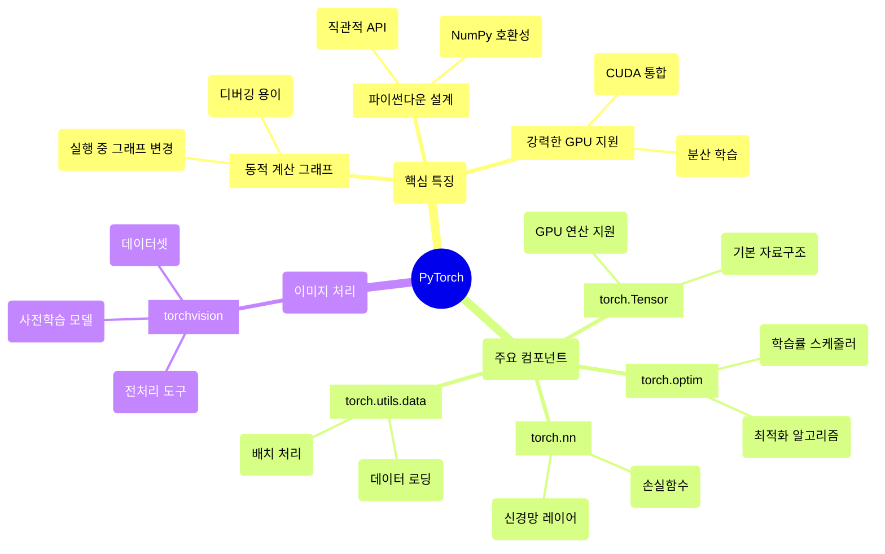

## 📦 사용하는 python package

- torch==2.1.0+cu118
- torchvision==0.16.0+cu118
- numpy==1.24.3
- matplotlib==3.7.1
- PIL==10.0.0
- tqdm==4.65.0

## 🚀 TL;DR

- **PyTorch**는 동적 계산 그래프와 직관적인 API로 딥러닝 연구와 개발에 최적화된 프레임워크다
- **텐서(Tensor)**는 PyTorch의 핵심 자료구조로, NumPy 배열과 유사하지만 GPU 가속과 자동 미분을 지원한다
- **Autograd**는 자동 미분 시스템으로 역전파 알고리즘을 자동으로 처리해 모델 학습을 간편하게 만든다
- **nn.Module**을 상속받아 신경망 모델을 정의하고, **DataLoader**로 효율적인 데이터 처리 파이프라인을 구축한다
- **이미지 데이터**는 torchvision의 transforms로 전처리하고, CNN 아키텍처로 분류/인식 작업을 수행한다
- 실제 프로젝트에서는 **전이학습(Transfer Learning)**과 **데이터 증강(Data Augmentation)**을 활용해 성능을 향상시킨다

## 📓 실습 Jupyter Notebook

- [PyTorch 기초와 이미지 모델링](https://github.com/yuiyeong/notebooks/blob/main/deep_learning/pytorch_fundamentals_image_modeling.ipynb)

## 🔥 PyTorch란?

**PyTorch**는 페이스북(현 Meta)에서 개발한 오픈소스 딥러닝 프레임워크로, 연구와 프로덕션 환경 모두에서 널리 사용되고 있다.

PyTorch의 핵심 철학은 **"연구자 친화적"**이다. 복잡한 모델도 직관적으로 구현할 수 있고, 디버깅이 쉬우며, 동적으로 네트워크를 변경할 수 있다는 장점이 있다.



> PyTorch는 **동적 계산 그래프(Dynamic Computation Graph)**를 사용하여 모델을 실행하면서 그래프를 구성한다. 이는 TensorFlow 1.x의 정적 그래프와 달리 더 유연하고 직관적인 개발을 가능하게 한다. {: .prompt-tip}

## 📊 텐서(Tensor): PyTorch의 핵심

**텐서(Tensor)**는 PyTorch의 가장 기본적인 자료구조로, NumPy의 `ndarray`와 매우 유사하지만 GPU에서 연산할 수 있고 자동 미분을 지원한다는 차이점이 있다.

### 텐서의 기본 개념

텐서는 다차원 배열을 의미하며, 스칼라(0차원), 벡터(1차원), 행렬(2차원), 그리고 더 높은 차원의 데이터를 통합적으로 표현한다.

```python
import torch
import numpy as np

# 다양한 방법으로 텐서 생성
# 1. 직접 생성
tensor_direct = torch.tensor([1, 2, 3, 4])
print(f"직접 생성: {tensor_direct}")
# 출력: 직접 생성: tensor([1, 2, 3, 4])

# 2. NumPy 배열에서 변환
numpy_array = np.array([1, 2, 3, 4])
tensor_from_numpy = torch.from_numpy(numpy_array)
print(f"NumPy에서 변환: {tensor_from_numpy}")
# 출력: NumPy에서 변환: tensor([1, 2, 3, 4], dtype=torch.int64)

# 3. 특수 텐서 생성
zeros_tensor = torch.zeros(3, 4)  # 0으로 채워진 3x4 텐서
ones_tensor = torch.ones(2, 3)   # 1로 채워진 2x3 텐서
random_tensor = torch.randn(2, 3) # 정규분포 난수로 채워진 2x3 텐서

print(f"0 텐서 크기: {zeros_tensor.shape}")  
# 출력: 0 텐서 크기: torch.Size([3, 4])
print(f"난수 텐서:\n{random_tensor}")
# 출력: 난수 텐서:
# tensor([[-0.2947,  0.8459, -1.0341],
#         [ 0.5896, -0.4741,  1.0491]])
```

### 텐서의 주요 속성과 연산

```python
# 텐서의 기본 속성
tensor = torch.randn(3, 4, 5)
print(f"텐서 모양: {tensor.shape}")        # torch.Size([3, 4, 5])
print(f"텐서 차원: {tensor.dim()}")         # 3
print(f"데이터 타입: {tensor.dtype}")       # torch.float32
print(f"저장 장치: {tensor.device}")       # cpu

# 기본 연산
a = torch.tensor([1, 2, 3])
b = torch.tensor([4, 5, 6])

# 요소별 연산
print(f"덧셈: {a + b}")                    # tensor([5, 7, 9])
print(f"곱셈: {a * b}")                    # tensor([4, 10, 18])

# 행렬 연산
matrix_a = torch.randn(3, 4)
matrix_b = torch.randn(4, 2)
matrix_mult = torch.matmul(matrix_a, matrix_b)  # 또는 matrix_a @ matrix_b
print(f"행렬 곱셈 결과 크기: {matrix_mult.shape}")  
# 출력: 행렬 곱셈 결과 크기: torch.Size([3, 2])
```

### GPU 활용

```python
# GPU 사용 가능 여부 확인
device = torch.device("cuda" if torch.cuda.is_available() else "cpu")
print(f"사용 장치: {device}")

# CPU 텐서를 GPU로 이동
if torch.cuda.is_available():
    tensor_cpu = torch.randn(1000, 1000)
    tensor_gpu = tensor_cpu.to(device)  # 또는 tensor_cpu.cuda()
    print(f"GPU 텐서 장치: {tensor_gpu.device}")
    # 출력: GPU 텐서 장치: cuda:0
    
    # GPU에서 연산 수행
    result = torch.matmul(tensor_gpu, tensor_gpu.T)
    print(f"GPU 연산 결과 크기: {result.shape}")
```

> 텐서를 GPU로 이동시킬 때는 `.to(device)` 메서드를 사용하는 것이 권장된다. 이는 장치에 관계없이 일관된 코드를 작성할 수 있게 해준다. {: .prompt-tip}

## ⚡ Autograd: 자동 미분의 마법

**Autograd**는 PyTorch의 자동 미분 시스템으로, 텐서의 모든 연산을 추적하여 자동으로 그래디언트를 계산한다. 이는 딥러닝의 핵심인 역전파(Backpropagation) 알고리즘을 자동으로 처리해준다.

### 계산 그래프와 그래디언트

```python
import torch

# requires_grad=True로 그래디언트 추적 활성화
x = torch.tensor([2.0], requires_grad=True)
y = torch.tensor([3.0], requires_grad=True)

# 순전파 계산
z = x * y + x**2
loss = z.sum()

print(f"x: {x}")           # tensor([2.], requires_grad=True)
print(f"y: {y}")           # tensor([3.], requires_grad=True)
print(f"z: {z}")           # tensor([10.], grad_fn=<AddBackward0>)
print(f"loss: {loss}")     # tensor(10., grad_fn=<SumBackward0>)

# 역전파 수행
loss.backward()

# 그래디언트 확인
print(f"x의 그래디언트: {x.grad}")  # tensor([7.]) = dy/dx = y + 2*x = 3 + 2*2
print(f"y의 그래디언트: {y.grad}")  # tensor([2.]) = dy/dy = x = 2
```

### 실제 신경망에서의 활용

```python
import torch
import torch.nn as nn

# 간단한 선형 회귀 예제
# 데이터 준비
x_data = torch.randn(100, 1)
y_data = 3 * x_data + 2 + torch.randn(100, 1) * 0.1  # y = 3x + 2 + noise

# 모델 정의
model = nn.Linear(1, 1)  # 입력 1개, 출력 1개
criterion = nn.MSELoss()
optimizer = torch.optim.SGD(model.parameters(), lr=0.01)

# 학습 과정
for epoch in range(100):
    # 순전파
    y_pred = model(x_data)
    loss = criterion(y_pred, y_data)
    
    # 역전파
    optimizer.zero_grad()  # 그래디언트 초기화
    loss.backward()        # 그래디언트 계산
    optimizer.step()       # 파라미터 업데이트
    
    if epoch % 20 == 0:
        print(f"Epoch {epoch}, Loss: {loss.item():.4f}")

# 학습된 파라미터 확인
print(f"학습된 가중치: {model.weight.item():.4f}")  # 약 3에 가까운 값
print(f"학습된 편향: {model.bias.item():.4f}")     # 약 2에 가까운 값
```

> `optimizer.zero_grad()`는 매우 중요하다. PyTorch는 기본적으로 그래디언트를 누적하므로, 각 배치마다 그래디언트를 초기화해야 올바른 학습이 가능하다. {: .prompt-warning}

## 🧠 torch.nn: 신경망 구축의 핵심

**torch.nn** 모듈은 신경망 레이어, 활성화 함수, 손실 함수 등 딥러닝 모델 구축에 필요한 모든 구성 요소를 제공한다.

### nn.Module: 모든 모델의 기반

모든 PyTorch 모델은 `nn.Module`을 상속받아 구현한다. 이는 파라미터 관리, GPU 이동, 저장/로딩 등의 기능을 자동으로 제공한다.

```python
import torch
import torch.nn as nn
import torch.nn.functional as F

class SimpleNet(nn.Module):
    def __init__(self, input_size, hidden_size, output_size):
        super(SimpleNet, self).__init__()
        self.fc1 = nn.Linear(input_size, hidden_size)
        self.fc2 = nn.Linear(hidden_size, hidden_size)
        self.fc3 = nn.Linear(hidden_size, output_size)
        self.dropout = nn.Dropout(0.2)
        
    def forward(self, x):
        x = F.relu(self.fc1(x))
        x = self.dropout(x)
        x = F.relu(self.fc2(x))
        x = self.dropout(x)
        x = self.fc3(x)
        return x

# 모델 인스턴스 생성
model = SimpleNet(input_size=784, hidden_size=128, output_size=10)

# 모델 정보 확인
print(f"모델 구조:\n{model}")
print(f"전체 파라미터 수: {sum(p.numel() for p in model.parameters())}")
# 출력: 전체 파라미터 수: 101770

# 순전파 테스트
sample_input = torch.randn(32, 784)  # 배치 크기 32, 입력 차원 784
output = model(sample_input)
print(f"출력 크기: {output.shape}")  # torch.Size([32, 10])
```

### 주요 레이어와 활성화 함수

```python
# 다양한 레이어 예시
conv_layer = nn.Conv2d(in_channels=3, out_channels=64, kernel_size=3, padding=1)
pool_layer = nn.MaxPool2d(kernel_size=2, stride=2)
batch_norm = nn.BatchNorm2d(64)
linear_layer = nn.Linear(512, 256)

# 활성화 함수
relu = nn.ReLU()
sigmoid = nn.Sigmoid()
tanh = nn.Tanh()
leaky_relu = nn.LeakyReLU(0.2)

# 정규화 레이어
dropout = nn.Dropout(0.5)
layer_norm = nn.LayerNorm(256)

# 손실 함수
mse_loss = nn.MSELoss()                    # 회귀용
cross_entropy = nn.CrossEntropyLoss()      # 분류용
bce_loss = nn.BCEWithLogitsLoss()          # 이진 분류용

print("주요 컴포넌트들이 성공적으로 생성되었습니다.")
```

### Sequential을 활용한 간단한 모델 정의

```python
# Sequential을 사용한 간단한 모델 정의
simple_model = nn.Sequential(
    nn.Linear(784, 256),
    nn.ReLU(),
    nn.Dropout(0.2),
    nn.Linear(256, 128),
    nn.ReLU(),
    nn.Dropout(0.2),
    nn.Linear(128, 10)
)

print(f"Sequential 모델:\n{simple_model}")

# 파라미터 확인
for name, param in simple_model.named_parameters():
    print(f"{name}: {param.shape}")
# 출력 예시:
# 0.weight: torch.Size([256, 784])
# 0.bias: torch.Size([256])
# 3.weight: torch.Size([128, 256])
# ...
```

## 🎯 torch.optim: 최적화의 핵심

**torch.optim** 모듈은 다양한 최적화 알고리즘을 제공하여 모델의 파라미터를 효율적으로 업데이트한다.

### 주요 최적화 알고리즘

```python
import torch.optim as optim

# 모델 정의 (앞서 정의한 SimpleNet 사용)
model = SimpleNet(784, 128, 10)

# 다양한 최적화 알고리즘
sgd_optimizer = optim.SGD(model.parameters(), lr=0.01, momentum=0.9)
adam_optimizer = optim.Adam(model.parameters(), lr=0.001, betas=(0.9, 0.999))
rmsprop_optimizer = optim.RMSprop(model.parameters(), lr=0.01)
adamw_optimizer = optim.AdamW(model.parameters(), lr=0.001, weight_decay=0.01)

print("다양한 최적화 알고리즘이 준비되었습니다.")

# 학습률 스케줄러
scheduler = optim.lr_scheduler.StepLR(adam_optimizer, step_size=10, gamma=0.1)
cosine_scheduler = optim.lr_scheduler.CosineAnnealingLR(adam_optimizer, T_max=50)

# 학습률 변화 확인
for epoch in range(5):
    print(f"Epoch {epoch}: 학습률 = {adam_optimizer.param_groups[0]['lr']:.6f}")
    scheduler.step()
# 출력:
# Epoch 0: 학습률 = 0.001000
# Epoch 1: 학습률 = 0.001000
# ...
```

## 📁 torch.utils.data: 효율적인 데이터 처리

**torch.utils.data** 모듈은 대용량 데이터를 효율적으로 처리하기 위한 도구들을 제공한다.

### Dataset과 DataLoader

```python
import torch
from torch.utils.data import Dataset, DataLoader
import numpy as np

# 커스텀 데이터셋 정의
class CustomDataset(Dataset):
    def __init__(self, data, labels, transform=None):
        self.data = data
        self.labels = labels
        self.transform = transform
    
    def __len__(self):
        return len(self.data)
    
    def __getitem__(self, idx):
        sample = self.data[idx]
        label = self.labels[idx]
        
        if self.transform:
            sample = self.transform(sample)
            
        return sample, label

# 예시 데이터 생성
data = np.random.randn(1000, 784)
labels = np.random.randint(0, 10, 1000)

# 데이터셋과 데이터로더 생성
dataset = CustomDataset(data, labels)
dataloader = DataLoader(
    dataset, 
    batch_size=32, 
    shuffle=True, 
    num_workers=2,  # 멀티프로세싱
    pin_memory=True  # GPU 사용 시 성능 향상
)

print(f"데이터셋 크기: {len(dataset)}")
print(f"배치 수: {len(dataloader)}")

# 데이터로더 사용 예시
for batch_idx, (data, target) in enumerate(dataloader):
    print(f"배치 {batch_idx}: 데이터 크기 {data.shape}, 레이블 크기 {target.shape}")
    if batch_idx >= 2:  # 처음 3개 배치만 확인
        break
# 출력:
# 배치 0: 데이터 크기 torch.Size([32, 784]), 레이블 크기 torch.Size([32])
# 배치 1: 데이터 크기 torch.Size([32, 784]), 레이블 크기 torch.Size([32])
# 배치 2: 데이터 크기 torch.Size([32, 784]), 레이블 크기 torch.Size([32])
```

## 🖼️ 이미지 데이터 처리: torchvision의 활용

**torchvision**은 컴퓨터 비전 작업을 위한 도구들을 제공하는 PyTorch의 확장 패키지다. 이미지 전처리, 데이터 증강, 사전 훈련된 모델 등을 포함한다.

### 이미지 전처리와 데이터 증강

```python
import torchvision.transforms as transforms
from torchvision import datasets
from PIL import Image
import matplotlib.pyplot as plt

# 기본 전처리 파이프라인
basic_transform = transforms.Compose([
    transforms.Resize((224, 224)),          # 크기 조정
    transforms.ToTensor(),                  # PIL Image를 텐서로 변환
    transforms.Normalize(                   # 정규화
        mean=[0.485, 0.456, 0.406],        # ImageNet 평균
        std=[0.229, 0.224, 0.225]          # ImageNet 표준편차
    )
])

# 데이터 증강을 포함한 전처리 (훈련용)
train_transform = transforms.Compose([
    transforms.Resize((256, 256)),
    transforms.RandomCrop(224),             # 랜덤 크롭
    transforms.RandomHorizontalFlip(p=0.5), # 50% 확률로 좌우 반전
    transforms.RandomRotation(10),          # ±10도 랜덤 회전
    transforms.ColorJitter(                 # 색상 변화
        brightness=0.2, 
        contrast=0.2, 
        saturation=0.2, 
        hue=0.1
    ),
    transforms.ToTensor(),
    transforms.Normalize(
        mean=[0.485, 0.456, 0.406],
        std=[0.229, 0.224, 0.225]
    )
])

# 테스트용 전처리 (증강 없음)
test_transform = transforms.Compose([
    transforms.Resize((224, 224)),
    transforms.ToTensor(),
    transforms.Normalize(
        mean=[0.485, 0.456, 0.406],
        std=[0.229, 0.224, 0.225]
    )
])

print("이미지 전처리 파이프라인이 준비되었습니다.")
```

### 내장 데이터셋 활용

```python
from torchvision import datasets
import os

# 데이터 저장 경로
data_dir = './data'

# CIFAR-10 데이터셋 로딩
train_dataset = datasets.CIFAR10(
    root=data_dir,
    train=True,
    download=True,
    transform=train_transform
)

test_dataset = datasets.CIFAR10(
    root=data_dir,
    train=False,
    download=False,
    transform=test_transform
)

# 데이터로더 생성
train_loader = DataLoader(
    train_dataset,
    batch_size=64,
    shuffle=True,
    num_workers=4,
    pin_memory=True
)

test_loader = DataLoader(
    test_dataset,
    batch_size=64,
    shuffle=False,
    num_workers=4,
    pin_memory=True
)

print(f"훈련 데이터: {len(train_dataset)}개")
print(f"테스트 데이터: {len(test_dataset)}개")
print(f"클래스 수: {len(train_dataset.classes)}")
print(f"클래스 이름: {train_dataset.classes}")

# 샘플 데이터 확인
sample_data, sample_label = train_dataset[0]
print(f"샘플 이미지 크기: {sample_data.shape}")
print(f"샘플 레이블: {sample_label} ({train_dataset.classes[sample_label]})")
```

## 🏗️ CNN 모델 구현: 이미지 분류의 핵심

**합성곱 신경망(Convolutional Neural Network, CNN)**은 이미지 데이터 처리에 특화된 딥러닝 아키텍처다.

### 기본 CNN 모델 구현

```python
import torch
import torch.nn as nn
import torch.nn.functional as F

class BasicCNN(nn.Module):
    def __init__(self, num_classes=10):
        super(BasicCNN, self).__init__()
        
        # 합성곱 레이어들
        self.conv1 = nn.Conv2d(3, 32, kernel_size=3, padding=1)   # 32x32x3 -> 32x32x32
        self.conv2 = nn.Conv2d(32, 64, kernel_size=3, padding=1)  # 32x32x32 -> 32x32x64
        self.conv3 = nn.Conv2d(64, 128, kernel_size=3, padding=1) # 16x16x64 -> 16x16x128
        
        # 배치 정규화
        self.bn1 = nn.BatchNorm2d(32)
        self.bn2 = nn.BatchNorm2d(64)
        self.bn3 = nn.BatchNorm2d(128)
        
        # 풀링 레이어
        self.pool = nn.MaxPool2d(2, 2)  # 크기를 절반으로 축소
        
        # 완전연결 레이어들
        self.fc1 = nn.Linear(128 * 8 * 8, 512)  # 8x8x128 = 8192
        self.fc2 = nn.Linear(512, num_classes)
        
        # 드롭아웃
        self.dropout = nn.Dropout(0.5)
        
    def forward(self, x):
        # 첫 번째 합성곱 블록
        x = self.pool(F.relu(self.bn1(self.conv1(x))))  # 32x32x32 -> 16x16x32
        
        # 두 번째 합성곱 블록  
        x = self.pool(F.relu(self.bn2(self.conv2(x))))  # 16x16x64 -> 8x8x64
        
        # 세 번째 합성곱 블록
        x = F.relu(self.bn3(self.conv3(x)))             # 8x8x128
        
        # 평탄화 (Flatten)
        x = x.view(x.size(0), -1)  # (batch_size, 8*8*128)
        
        # 완전연결 레이어들
        x = F.relu(self.fc1(x))
        x = self.dropout(x)
        x = self.fc2(x)
        
        return x

# 모델 생성 및 정보 확인
model = BasicCNN(num_classes=10)
print(f"모델 구조:\n{model}")

# 파라미터 수 계산
total_params = sum(p.numel() for p in model.parameters())
trainable_params = sum(p.numel() for p in model.parameters() if p.requires_grad)
print(f"전체 파라미터 수: {total_params:,}")
print(f"훈련 가능한 파라미터 수: {trainable_params:,}")

# 순전파 테스트
sample_input = torch.randn(4, 3, 32, 32)  # CIFAR-10 크기
output = model(sample_input)
print(f"입력 크기: {sample_input.shape}")
print(f"출력 크기: {output.shape}")
```

### 고급 CNN 아키텍처: ResNet 스타일 블록

```python
class ResidualBlock(nn.Module):
    """ResNet의 기본 블록"""
    def __init__(self, in_channels, out_channels, stride=1):
        super(ResidualBlock, self).__init__()
        
        self.conv1 = nn.Conv2d(in_channels, out_channels, 
                              kernel_size=3, stride=stride, padding=1, bias=False)
        self.bn1 = nn.BatchNorm2d(out_channels)
        
        self.conv2 = nn.Conv2d(out_channels, out_channels, 
                              kernel_size=3, stride=1, padding=1, bias=False)
        self.bn2 = nn.BatchNorm2d(out_channels)
        
        # 스킵 연결을 위한 다운샘플링
        self.downsample = None
        if stride != 1 or in_channels != out_channels:
            self.downsample = nn.Sequential(
                nn.Conv2d(in_channels, out_channels, 
                         kernel_size=1, stride=stride, bias=False),
                nn.BatchNorm2d(out_channels)
            )
    
    def forward(self, x):
        identity = x
        
        out = F.relu(self.bn1(self.conv1(x)))
        out = self.bn2(self.conv2(out))
        
        if self.downsample is not None:
            identity = self.downsample(x)
        
        out += identity  # 스킵 연결
        out = F.relu(out)
        
        return out

class ResNet(nn.Module):
    def __init__(self, num_classes=10):
        super(ResNet, self).__init__()
        
        self.in_channels = 64
        
        # 초기 합성곱 레이어
        self.conv1 = nn.Conv2d(3, 64, kernel_size=3, padding=1, bias=False)
        self.bn1 = nn.BatchNorm2d(64)
        
        # ResNet 블록들
        self.layer1 = self._make_layer(64, 2, stride=1)
        self.layer2 = self._make_layer(128, 2, stride=2)
        self.layer3 = self._make_layer(256, 2, stride=2)
        
        # 전역 평균 풀링과 분류기
        self.avg_pool = nn.AdaptiveAvgPool2d((1, 1))
        self.fc = nn.Linear(256, num_classes)
        
    def _make_layer(self, out_channels, num_blocks, stride):
        layers = []
        layers.append(ResidualBlock(self.in_channels, out_channels, stride))
        self.in_channels = out_channels
        
        for _ in range(1, num_blocks):
            layers.append(ResidualBlock(out_channels, out_channels))
            
        return nn.Sequential(*layers)
    
    def forward(self, x):
        x = F.relu(self.bn1(self.conv1(x)))
        
        x = self.layer1(x)
        x = self.layer2(x)  
        x = self.layer3(x)
        
        x = self.avg_pool(x)
        x = x.view(x.size(0), -1)
        x = self.fc(x)
        
        return x

# ResNet 모델 생성
resnet_model = ResNet(num_classes=10)
print(f"ResNet 파라미터 수: {sum(p.numel() for p in resnet_model.parameters()):,}")
```

## 🎯 완전한 이미지 분류 학습 파이프라인

실제 이미지 분류 모델의 학습 과정을 완전히 구현해보자.

### 학습 및 평가 함수

```python
import torch
import torch.nn as nn
from torch.utils.data import DataLoader
from tqdm import tqdm
import time

def train_model(model, train_loader, test_loader, criterion, optimizer, 
                device, num_epochs=10, scheduler=None):
    """완전한 모델 학습 함수"""
    
    model.to(device)
    train_losses = []
    train_accuracies = []
    test_accuracies = []
    
    for epoch in range(num_epochs):
        # 훈련 모드
        model.train()
        running_loss = 0.0
        correct_train = 0
        total_train = 0
        
        # 진행률 표시
        train_pbar = tqdm(train_loader, desc=f'Epoch {epoch+1}/{num_epochs}')
        
        for batch_idx, (data, target) in enumerate(train_pbar):
            data, target = data.to(device), target.to(device)
            
            # 순전파
            optimizer.zero_grad()
            output = model(data)
            loss = criterion(output, target)
            
            # 역전파
            loss.backward()
            optimizer.step()
            
            # 통계 계산
            running_loss += loss.item()
            _, predicted = torch.max(output.data, 1)
            total_train += target.size(0)
            correct_train += (predicted == target).sum().item()
            
            # 진행률 업데이트
            train_pbar.set_postfix({
                'Loss': f'{loss.item():.4f}',
                'Acc': f'{100.*correct_train/total_train:.2f}%'
            })
        
        # 에포크별 통계
        epoch_loss = running_loss / len(train_loader)
        epoch_acc = 100. * correct_train / total_train
        train_losses.append(epoch_loss)
        train_accuracies.append(epoch_acc)
        
        # 테스트 평가
        test_acc = evaluate_model(model, test_loader, device)
        test_accuracies.append(test_acc)
        
        print(f'Epoch {epoch+1}: Train Loss: {epoch_loss:.4f}, '
              f'Train Acc: {epoch_acc:.2f}%, Test Acc: {test_acc:.2f}%')
        
        # 학습률 스케줄링
        if scheduler:
            scheduler.step()
    
    return train_losses, train_accuracies, test_accuracies

def evaluate_model(model, test_loader, device):
    """모델 평가 함수"""
    model.eval()
    correct = 0
    total = 0
    
    with torch.no_grad():
        for data, target in test_loader:
            data, target = data.to(device), target.to(device)
            output = model(data)
            _, predicted = torch.max(output.data, 1)
            total += target.size(0)
            correct += (predicted == target).sum().item()
    
    accuracy = 100. * correct / total
    return accuracy

# 실제 학습 실행
if torch.cuda.is_available():
    device = torch.device('cuda')
    print(f"GPU 사용: {torch.cuda.get_device_name(0)}")
else:
    device = torch.device('cpu')
    print("CPU 사용")

# 모델, 손실함수, 최적화기 설정
model = BasicCNN(num_classes=10)
criterion = nn.CrossEntropyLoss()
optimizer = torch.optim.Adam(model.parameters(), lr=0.001, weight_decay=1e-4)
scheduler = torch.optim.lr_scheduler.StepLR(optimizer, step_size=5, gamma=0.5)

# 학습 실행 (실제로는 데이터로더가 준비되어야 함)
print("학습 시작...")
# train_losses, train_accs, test_accs = train_model(
#     model, train_loader, test_loader, criterion, optimizer, 
#     device, num_epochs=10, scheduler=scheduler
# )
```

### 학습 결과 시각화

```python
import matplotlib.pyplot as plt

def plot_training_results(train_losses, train_accuracies, test_accuracies):
    """학습 결과 시각화"""
    
    fig, (ax1, ax2) = plt.subplots(1, 2, figsize=(12, 4))
    
    # 손실 그래프
    ax1.plot(train_losses, 'b-', label='Training Loss')
    ax1.set_title('Training Loss')
    ax1.set_xlabel('Epoch')
    ax1.set_ylabel('Loss')
    ax1.legend()
    ax1.grid(True)
    
    # 정확도 그래프
    ax2.plot(train_accuracies, 'b-', label='Training Accuracy')
    ax2.plot(test_accuracies, 'r-', label='Test Accuracy')
    ax2.set_title('Model Accuracy')
    ax2.set_xlabel('Epoch')
    ax2.set_ylabel('Accuracy (%)')
    ax2.legend()
    ax2.grid(True)
    
    plt.tight_layout()
    plt.show()

# 예시 데이터로 시각화 (실제 학습 후에는 실제 데이터 사용)
# plot_training_results(train_losses, train_accs, test_accs)
```

## 🔄 전이학습(Transfer Learning) 활용

**전이학습**은 사전 훈련된 모델을 활용하여 새로운 작업에 적용하는 기법이다. 이는 적은 데이터로도 높은 성능을 달성할 수 있게 해준다.

### 사전 훈련된 모델 활용

```python
import torchvision.models as models
from torchvision.models import ResNet18_Weights

# 사전 훈련된 ResNet18 모델 로딩
pretrained_model = models.resnet18(weights=ResNet18_Weights.IMAGENET1K_V1)

# 분류기 부분만 교체 (CIFAR-10은 10개 클래스)
num_features = pretrained_model.fc.in_features
pretrained_model.fc = nn.Linear(num_features, 10)

# 특성 추출기로만 사용 (특성 추출 레이어 고정)
class TransferLearningModel(nn.Module):
    def __init__(self, num_classes=10, freeze_features=True):
        super(TransferLearningModel, self).__init__()
        
        # 사전 훈련된 ResNet18
        self.backbone = models.resnet18(weights=ResNet18_Weights.IMAGENET1K_V1)
        
        # 특성 추출 레이어 고정
        if freeze_features:
            for param in self.backbone.parameters():
                param.requires_grad = False
        
        # 분류기만 새로 정의
        num_features = self.backbone.fc.in_features
        self.backbone.fc = nn.Linear(num_features, num_classes)
        
        # 분류기는 항상 학습 가능
        for param in self.backbone.fc.parameters():
            param.requires_grad = True
    
    def forward(self, x):
        return self.backbone(x)

# 전이학습 모델 생성
transfer_model = TransferLearningModel(num_classes=10, freeze_features=True)

# 학습 가능한 파라미터 확인
trainable_params = sum(p.numel() for p in transfer_model.parameters() if p.requires_grad)
total_params = sum(p.numel() for p in transfer_model.parameters())

print(f"전체 파라미터: {total_params:,}")
print(f"학습 가능한 파라미터: {trainable_params:,} ({100*trainable_params/total_params:.1f}%)")

# 전이학습을 위한 서로 다른 학습률 설정
backbone_params = []
classifier_params = []

for name, param in transfer_model.named_parameters():
    if param.requires_grad:
        if 'fc' in name:  # 분류기 파라미터
            classifier_params.append(param)
        else:  # 백본 파라미터
            backbone_params.append(param)

# 서로 다른 학습률로 최적화기 설정
optimizer = torch.optim.Adam([
    {'params': backbone_params, 'lr': 1e-4},      # 백본은 낮은 학습률
    {'params': classifier_params, 'lr': 1e-3}     # 분류기는 높은 학습률
], weight_decay=1e-4)

print("전이학습 설정이 완료되었습니다.")
```

## 💡 실무에서의 모범 사례

### 모델 저장과 로딩

```python
import os

def save_checkpoint(model, optimizer, epoch, loss, filepath):
    """체크포인트 저장"""
    torch.save({
        'epoch': epoch,
        'model_state_dict': model.state_dict(),
        'optimizer_state_dict': optimizer.state_dict(),
        'loss': loss,
    }, filepath)
    print(f"체크포인트 저장: {filepath}")

def load_checkpoint(model, optimizer, filepath):
    """체크포인트 로딩"""
    checkpoint = torch.load(filepath)
    model.load_state_dict(checkpoint['model_state_dict'])
    optimizer.load_state_dict(checkpoint['optimizer_state_dict'])
    epoch = checkpoint['epoch']
    loss = checkpoint['loss']
    
    print(f"체크포인트 로딩: epoch {epoch}, loss {loss:.4f}")
    return epoch, loss

# 사용 예시
# save_checkpoint(model, optimizer, epoch, loss, 'best_model.pth')
# epoch, loss = load_checkpoint(model, optimizer, 'best_model.pth')
```

### 성능 모니터링

```python
class AverageMeter:
    """평균값 계산을 위한 유틸리티 클래스"""
    def __init__(self):
        self.reset()
    
    def reset(self):
        self.val = 0
        self.avg = 0
        self.sum = 0
        self.count = 0
    
    def update(self, val, n=1):
        self.val = val
        self.sum += val * n
        self.count += n
        self.avg = self.sum / self.count

def calculate_accuracy(output, target, topk=(1,)):
    """Top-k 정확도 계산"""
    with torch.no_grad():
        maxk = max(topk)
        batch_size = target.size(0)
        
        _, pred = output.topk(maxk, 1, True, True)
        pred = pred.t()
        correct = pred.eq(target.view(1, -1).expand_as(pred))
        
        res = []
        for k in topk:
            correct_k = correct[:k].reshape(-1).float().sum(0, keepdim=True)
            res.append(correct_k.mul_(100.0 / batch_size))
        return res

# 사용 예시 (학습 루프 내에서)
# losses = AverageMeter()
# top1 = AverageMeter()
# 
# for data, target in train_loader:
#     output = model(data)
#     loss = criterion(output, target)
#     acc1 = calculate_accuracy(output, target, topk=(1,))[0]
#     
#     losses.update(loss.item(), data.size(0))
#     top1.update(acc1.item(), data.size(0))
```

> PyTorch를 활용한 이미지 분류는 **데이터 전처리**, **모델 설계**, **학습 최적화**, **성능 평가**의 단계를 체계적으로 수행하는 것이 중요하다. 특히 전이학습을 활용하면 적은 데이터로도 뛰어난 성능을 달성할 수 있다. {: .prompt-tip}

PyTorch는 연구용 프로토타이핑부터 대규모 프로덕션 배포까지 모든 단계에서 활용할 수 있는 강력한 프레임워크다. 이미지 처리 영역에서는 torchvision과 함께 사용하여 최신 컴퓨터 비전 기법들을 쉽게 구현할 수 있으며, 활발한 커뮤니티와 풍부한 생태계를 통해 지속적으로 발전하고 있다.