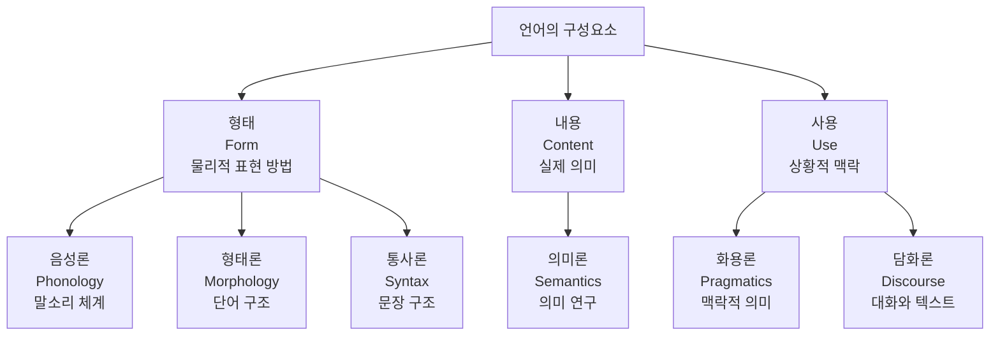

## 📦 사용하는 기술 및 개념

- 언어학 (Linguistics)
- 전산언어학 (Computational Linguistics)
- 자연어처리 (Natural Language Processing)
- 형태소 분석 (Morphological Analysis)
- 구문 분석 (Syntactic Analysis)
- 의미 분석 (Semantic Analysis)
- 화용론 (Pragmatics)
- 담화 분석 (Discourse Analysis)

## 🚀 TL;DR

- **언어학**은 인간 언어의 과학적 연구이며, **전산언어학**은 컴퓨터를 이용한 언어 자동 처리 학문이다
- 언어학은 **형태론**, **통사론**, **의미론**, **화용론**, **담화론**의 5개 주요 분야로 구성된다
- 각 언어학 분야는 NLP의 핵심 기술들과 직접 연결된다: **형태소 분석**, **구문 분석**, **의미 분석** 등
- **딥러닝 시대**에도 언어학 지식은 여전히 중요하며, **BERT** 등 최신 모델 분석에도 활용된다
- 언어학적 지식은 **데이터 구축**, **모델 해석**, **성능 향상**에 핵심적인 역할을 한다
- NLP 전문가가 되려면 언어학의 기본 개념과 원리를 이해하는 것이 필수적이다

## 🔬 언어학과 전산언어학의 만남

### 언어학(Linguistics)이란?

언어학은 **인간의 고유한 정신적 능력인 언어를 과학적으로 연구하는 학문 분야**다. 단순히 언어를 배우는 것이 아니라, 인간의 언어 행태 전반을 체계적으로 분석하고 이해하려는 학문이다.

언어학에는 여러 분야가 있지만, 결국 **인간의 언어 행태를 연구하는 학문**이라고 정의할 수 있다.

### 전산언어학(Computational Linguistics)의 등장

전산언어학은 **컴퓨터를 이용해서 언어를 자동으로 분석하며, 언어 자료의 자동 처리에서 나타나는 언어학적 문제를 연구하는 학문**이다.

> 자연어처리(NLP)는 컴퓨터 공학 관점의 용어이고, 전산언어학(Computational Linguistics)은 언어학 관점의 용어다. 같은 분야를 다른 관점에서 바라본 것이다.
{: .prompt-tip}

- **컴퓨터 공학 분야**: Natural Language Processing (자연어처리)
- **언어학 분야**: Computational Linguistics (전산언어학)

### 언어학 접근 방법의 진화

언어학적 접근 방법은 시대에 따라 세 가지로 발전해왔다.

**1. 규칙 기반 접근(Rule-based Approach)**

- 이론 언어학 연구를 통해 얻어진 형식화된 문법 규칙 활용
- 인간이 설정한 룰을 기반으로 언어학 처리
- 예시: 문법 규칙, 구문 분석 규칙

**2. 통계 기반 접근(Statistical Approach)**

- 대용량 코퍼스 분석을 통한 언어 단위의 분포와 빈도 정보 활용
- 많은 데이터에서 공통적으로 일어나는 확률 분포 활용
- 전자화된 대용량 텍스트의 분석이 핵심

**3. 딥러닝 기반 접근(Deep Learning Approach)**

- 인공신경망을 통해 많은 양의 자료로부터 학습한 결과 활용
- 자동으로 산출되는 규칙 정보들을 활용

## 🧩 언어의 구성요소와 기본 용어들

### 핵심 용어 정리

자연어처리를 이해하기 위해서는 먼저 기본 용어들을 정확히 알아야 한다.

**음절(Syllable)**

- 언어를 말하고 들을 때 하나의 덩어리로 여겨지는 **가장 작은 말소리의 단위**
- 한국어: 하나의 글자가 보통 한 음절 (예: "박찬주" = 3음절)
- 영어: 모음이 포함된 최소 음성 단위

**형태소(Morpheme)**

- 언어에서 **의미를 가지는 가장 작은 단위**
- 형태소를 쪼개면 의미가 없어짐
- 한국어 자연어처리에서 기본 토큰으로 많이 활용

**어절**

- 한 개 이상의 형태소가 모여 구성된 단위
- **띄어쓰기 단위**라고도 함
- 자연언어는 보통 어절 단위로 띄어쓰기되어 표기됨

**품사(Part of Speech)**

- 단어를 **문법상의 의미, 형태, 기능에 따라 분류한 종별**
- 명사, 동사, 형용사 등으로 분류
- 영어의 8품사, 한국어의 9품사

```python
# 형태소 분석기 결과 예시
sentence = "생선을 먹는 아이"
# 결과: 생선/NNG + 을/JKO + 먹/VV + 는/ETM + 아이/NNG
```

## 🏗️ 언어의 구성요소 체계

언어는 크게 **형태**, **내용**, **사용**의 세 가지 구성요소로 이루어져 있다.



**형태(Form)**

- 실체의 의미를 물리적으로 표현할 수 있는 방법
- 음성론: 말소리를 표현
- 형태론: 단어 단위의 형태소를 표현
- 통사론: 문장 단위의 구조를 표현

**내용(Content)**

- 언어가 의미하는 실제 의미
- 의미론이 대표적인 분야

**사용(Use)**

- 언어를 사용하는 상황과 물리적 문맥
- 화용론과 담화론이 해당

## 📝 형태론(Morphology): 의미의 최소 단위 연구

### 형태론과 자연어처리의 연결

형태론은 자연어처리에서 **형태소 분석기(Morphological Analyzer)** 구현의 이론적 기반이 된다. 형태론에서는 주로 **품사 태깅(POS Tagging)** 을 수행한다.

```python
# 형태소 분석 예시
input_sentence = "생선을 먹는 아이"
result = morphological_analyzer(input_sentence)
# 출력: [('생선', 'NNG'), ('을', 'JKO'), ('먹', 'VV'), ('는', 'ETM'), ('아이', 'NNG')]
```

### 형태소의 정의와 특성

**형태소(Morpheme)** 는 언어에서 의미를 갖는 **가장 기본적인 단위**이며, 동시에 **형태소 간의 상관관계**를 규명하는 것이 형태론의 목표다.

형태소는 **의미적 또는 문법적 기능의 최소 단위**이기도 하다. 여기서 주목할 점은 `-er`, `-ed`, `-ing` 같은 접사들도 문법적 기능을 담당하기 때문에 형태소로 취급된다는 것이다.

**영어 예시**

- `Talks` = `Talk` (의미 형태소) + `s` (문법 형태소)
- `Talker` = `Talk` (의미 형태소) + `er` (문법 형태소)
- `Talked` = `Talk` (의미 형태소) + `ed` (문법 형태소)
- `Talking` = `Talk` (의미 형태소) + `ing` (문법 형태소)

### 형태소의 체계적 분류

형태소는 두 가지 기준으로 분류할 수 있다.

#### 자립성에 따른 분류

**자립형태소(Free Morpheme)**

- 홀로 자립하여 쓸 수 있는 형태소
- 예시: 사과, 우리, 엄청, 우와

**의존형태소(Bound Morpheme)**

- 홀로 자립하여 쓸 수 없고, 다른 형태소에 붙어야 의미가 있는 형태소
- 조사, 어간, 어미 등 문법적 기능을 하는 것들
- 예시: -이, -가, 먹-, -시 (이들은 자립형태소에 붙어야 완전한 의미)

#### 의미에 따른 분류

**실질형태소(Lexical Morpheme) = 어휘형태소**

- 실질적인 의미를 가지고 구체적인 대상이나 동작을 표시
- 예시)
    - `뛰-`: 실제 "뛰다"의 의미가 담겨 있음 (의존형태소이지만 실질적 의미 보유)
    - `칠-`: "칠하다"의 실질적 의미
    - `예쁘-`: "예쁘다"의 실질적 의미

**형식형태소(Grammatical Morpheme) = 문법형태소**

- 실질형태소와 결합하여 문법적 관계를 형식적으로 표현
- 예시: -다, -히, -갔, -을률 (조사, 접사, 어미)

### 형태(Allomorph)의 개념

한 형태소에 대해서 **여러 개의 변이 형태**를 가질 수 있는 현상을 형태라고 한다.

**복수형의 형태 변이**

- `cat` → `cats` (s 첨가)
- `bus` → `buses` (es 첨가)
- `man` → `men` (내부 모음 변화)

**과거형의 형태 변이**

- `work` → `worked` (ed 첨가)
- `help` → `helped` (ed 첨가)
- `go` → `went` (완전히 다른 형태)

이러한 형태적 변이는 자연어처리를 어렵게 하는 요인 중 하나이며, 전통적으로는 규칙으로 처리되었다.

## 🌳 통사론(Syntax): 문장 구조의 규칙

### 통사론과 자연어처리의 연결

통사론은 자연어처리에서 **구문 분석(Parsing)** 의 이론적 토대가 된다. 형태론이 **태깅(Tagging)** 을 한다면, 통사론은 **파싱(Parsing)** 을 수행한다.

- **형태론**: 품사 태깅 (`이것/DT + 은/JX + 명사/NNG`)
- **통사론**: 파스 트리(Parse Tree) 생성, 나무 형태의 그래프 구조

### 통사론의 정의

통사론(Syntax)은 **단어가 결합해서 구나 문장을 형성하는 규칙 혹은 방법을 연구하는 학문**이다.

- 그리스어 'syntax': "함께 배열하다"라는 뜻
- 언어에서 **문장 형성 규칙 및 방법**을 연구
- 전통적으로는 문장을 선형 구조상에서 구성 요소의 연속도로 나열된 **배열 순서**에 관한 분석에 노력

### 문법 규칙(Grammar Rules)

통사론에서 문법 규칙은 다음과 같은 역할을 한다:

1. **언어의 올바른 어순 결정**
2. **단어와 그룹의 의미와 단어 사이 배열의 관계 정의**
    - `I mean what I say` vs `I say what I mean` (서로 다른 의미)
3. **주어, 목적어 같은 문장 내 문법적 관계 명시**
4. **문장이나 구문이 모호할 때 단어 결합이 의미에 어떻게 연관되는지 설명**

### 심층 구조와 표층 구조

통사론의 중요한 개념 중 하나는 **심층 구조(Deep Structure)** 와 **표층 구조(Surface Structure)** 의 구분이다.

**심층 구조(Deep Structure)**

- 화자가 문장에 대해 갖는 **추상적인 정보를 담은 구조**
- 진짜 의미적 정보를 담은 기저 구조

**표층 구조(Surface Structure)**

- 실생활에서 사용하는 **단어들의 규칙적인 구조**
- 하나의 심층 구조가 여러 표층 구조로 표현 가능

**예시)**

- `Charlie broke the window` (능동형)
- `The window was broken by Charlie` (수동형)

→ 두 문장은 **표층 구조**는 다르지만 **심층 구조**는 동일함

### 구조적 모호성(Structural Ambiguity)

구조적 모호성은 자연어처리를 어렵게 하는 근본적인 원인이다.

**1. 서로 다른 심층 구조의 양산**

```
"Annie bombed into a man with an umbrella"

해석1: Annie는 우산을 갖고 있어서 그것으로 남자를 때렸다
해석2: Annie는 남자를 때렸는데, 그 남자가 우산을 갖고 있었다
```

**2. 동일한 표층 구조, 다른 심층 구조**

```
"John saw Mary in the park"

해석1: John이 공원에서 Mary를 봤다 (John이 공원에 있음)
해석2: John이 Mary를 봤는데, Mary가 공원에 있었다 (Mary가 공원에 있음)
```

이러한 구조적 모호성 때문에 같은 문장도 다른 파스 트리로 분석될 수 있다.

### 반복(Recursion)의 특성

문법 규칙은 **반복(Recursion)** 이라는 중요한 속성을 가진다.

**전치사구의 반복적 생성**

```
"The gun was on the table"
→ "The gun was on the table near the window"  
→ "The gun was on the table near the window in the bedroom"
```

**문장 내 문장 삽입**

```
"Mary helped George"
→ "Kathy knew that Mary helped George"
→ "I believe that Kathy knew that Mary helped George"
```

이러한 반복 특성 때문에 언어는 **무한정 생성**이 가능하며, 이는 딥러닝에서 긴 문장 처리를 어렵게 하는 근본 원인이기도 하다.

### 구 구조 규칙(Phrase Structure Rules)

구구조 규칙은 **특정 구의 구조가 하나 또는 특정된 순서로 늘어선 여러 개의 구성 요소들로 이루어진다는 점을 표현**한다.

```
S → NP VP (문장은 명사구 + 동사구)
NP → (Det) (Adj) N (명사구는 관사, 형용사, 명사)  
VP → V (NP) (Adv) (동사구는 동사, 명사구, 부사)
```

이러한 규칙들이 결합되어 파스 트리를 만들고, 매우 많은 수의 문장을 생성할 수 있다.

### 어휘 규칙(Lexical Rules)

구구조 규칙이 구조를 생성한다면, 어휘 규칙은 **각 품사에 어떤 단어들이 올 수 있는지**를 정의한다.

```
N → girl, dog, boy (명사에는 이런 단어들이 올 수 있다)
V → follow, help, see (동사에는 이런 단어들이 올 수 있다)
```

### 변형 규칙(Transformational Rules)

구구조 규칙만으로는 설명할 수 없는 문장들을 위한 **예외 규칙**이다.

```
"Mary saw George recently" (기본 어순)
"Recently, Mary saw George" (부사가 앞으로 이동)
```

구구조 규칙에 따르면 두 번째 문장은 비문이 되지만, 변형 규칙을 통해 구성 요소를 이동시켜 올바른 문장으로 처리할 수 있다.

## 🎯 의미론(Semantics): 언어의 진짜 의미

### 의미론의 정의와 범위

의미론(Semantics)은 **단어, 구, 그리고 문장의 의미를 연구하는 분야**다. 형태론과 통사론으로는 문법적으로 올바른 문장이지만 의미적으로는 어색한 경우를 해결한다.

**의미론이 필요한 이유**

```
"사람이 하늘을 난다" 
→ 형태소 분석: 정상, 구문 분석: 정상, 의미 분석: 비정상

"The hamburger ate the boy"
→ 구문 구조: 정상, 의미: 어색함
```

### 두 가지 의미 유형

**개념적 의미(Conceptual Meaning)**

- 단어가 사용될 때 전달되는 **기본적, 본질적 의미**
- 예시: "바늘" → 가늘다, 뾰족하다, 강철 도구

**연상적 의미(Associational Meaning/Connotation)**

- 단어에서 **연상되거나 함축되는 의미**
- 예시: "바늘" → 아프다, 병원, 바느질
- 사람마다 다르게 느껴질 수 있음

### 의미 자질(Semantic Features)

의미 자질은 **단어를 의미 성분을 담고 있는 그릇으로 보는 관점**이다. 단어의 의미를 자질들의 나열로 표현하는 방법이다.

**의미 자질 표현**

```
        animate  human  female  adult
boy       +        +      -       -
man       +        +      -       +  
girl      +        +      +       -
woman     +        +      +       +
table     -        -      -       -
horse     +        -      -       +
```

단어의 의미를 **플러스(+)와 마이너스(-) 기호의 조합**으로 표현하여, 단어들 간의 의미적 차이를 체계적으로 분석할 수 있다.

### 의미역(Semantic Roles)

의미역은 **문장에서 각 단어의 의미적 역할을 분석**하는 것이다.

**주요 의미역**

- **행위자(Agent)**: 특정 행위를 하는 주체 (주어와는 다른 개념)
- **대상(Theme)**: 행위를 당하는 개체 (목적어와는 다른 개념)

**예시**

```
"The boy kicked the ball"
- Agent: the boy (행위를 하는 주체)
- Theme: the ball (행위를 당하는 대상)

"The wind blew the ball away"  
- Agent: the wind (행위를 하는 주체)
- Theme: the ball (행위를 당하는 대상)
```

**기타 의미역**

- **경험자(Experiencer)**: 심리적 상태를 경험하는 개체
- **위치(Location)**: 행위가 일어나는 장소
- **출발점(Source)**: 행위의 시작점
- **목표(Goal)**: 행위의 도달점

### 단어 간의 의미 관계

**동의관계(Synonymy)**

- 의미가 같거나 비슷한 관계
- 예시: big ↔ huge, smart ↔ intelligent

**반의관계(Antonymy)**

- 의미가 반대인 관계
- 예시: big ↔ small, fast ↔ slow, tall ↔ short

**상하관계(Hyponymy)**

- 상위어와 하위어의 관계
- 예시: living thing → plant → tree → pine

**동음이의어(Homonymy)**

- 동일한 형태이지만 전혀 관련성이 없는 서로 다른 단어
- 예시
    - `bat`: 박쥐 vs 야구 배트
    - `bank`: 은행 vs 강둑
    - `pupil`: 학생 vs 눈동자

**다의어(Polysemy)**

- 하나의 단어가 여러 뜻을 갖고 있는 경우
- 의미들 사이에 어느 정도 관련성이 있음

**연어(Collocation)**

- 문장이나 문서에서 **두 단어가 함께 출현하는 빈도가 높은 경우**
- 예시: fish and chips, take a photo
- 코퍼스 언어학에서 중요하게 다뤄짐

## 💬 화용론(Pragmatics): 맥락이 만드는 의미

### 화용론의 핵심 개념

화용론(Pragmatics)은 **보이지 않는 의미 또는 실제로 말하거나 쓰지 않았을지라도 화자가 의미하는 바에 대한 연구**다.

**화용론의 특징**

- 텍스트에 명시적으로 드러나지 않는 의미 처리
- **화자, 청자, 시간, 장소** 등으로 구성된 대화 문맥 고려
- 물리적 상황과 맥락을 넘어서는 의미 분석

**예시**

```
"날씨가 왜 이리 더워?"

표면적 의미: 날씨가 덥다는 진술
화용적 의미: 
- 에어컨 좀 틀자
- 문을 좀 열어
- 외식하러 나가자  
- 시원한 데 놀러가자
- 냉수 한 잔 줘
```

### 문맥(Context)의 두 가지 유형

**물리적 문맥(Physical Context)**

- 단어를 만나게 되는 **물리적 시간, 장소**
- 예시: 숲을 걷다가 "Bank"라는 단어를 보면 강둑으로 이해
- 화용론에서 주로 관심을 갖는 문맥

**언어적 문맥(Linguistic Context)**

- 어떤 단어가 포함된 구 또는 문장에서 사용된 **다른 단어들의 집합**
- 예시:
    - "Bank" + "withdraw, cash" → 은행
    - "Bank" + "steep, river" → 강둑

### 직시 표현(Deixis)

직시 표현은 **화자의 물리적 문맥을 알아야 해석할 수 있는 표현들**이다. 바로 **문맥에 의존해서 사물을 지시하는 표현**이다.

**직시 표현의 예시**

```
"저게 뭐야?"
→ 화자가 무엇을 가리키는지 물리적으로 봐야 알 수 있음

"You will have to bring it back tomorrow because she isn't here today"
→ You, it, tomorrow, she, here, today가 모두 직시 표현
→ 구체적 대상이나 시간을 물리적 맥락 없이는 알 수 없음
```

**직시의 유형**

- **인칭 직시**: me, you, we
- **공간 직시**: here, there, this place
- **시간 직시**: now, tomorrow, yesterday
- **사물 직시**: this, that, it

**비직시 표현 (Non-deictic Expression)**

- 화자의 물리적 문맥에 의존하지 않는 명확한 표현
- 예시: "2024년 2월 15일 서울시 강남구 테헤란로 123번지에 가져와야 한다"

### 지시(Reference)

지시는 **화자가 청자로 하여금 무언가를 알아채도록 언어를 사용하는 행위**다.

**지시를 위한 언어적 도구**

- **고유명사**: John, Seoul, Apple Inc.
- **명사구**: a writer, the tall man
- **지시어**: this, that, these
- **대명사**: he, she, it

**지시가 명확하지 않을 때의 해결책**

- 묘사적 표현: "the blue things", "the icy stuff"
- 새로운 명칭 생성: "미스터 카와사키" (동네에서 모터사이클 잘 타는 아저씨)

### 추론(Inference)

추론은 **발화된 내용과 그것의 의미를 연결시키기 위해 청자가 부가적인 정보를 이용해서 해석하는 과정**이다.

**추론의 예시**

```
"Can I look at your Chomsky?"

추론 과정:
1. Chomsky = 언어학자 이름
2. 작가의 이름으로 그가 쓴 책을 지칭할 수 있다
3. 따라서 "Chomsky가 쓴 책을 보여달라"는 의미
```

이러한 추론 능력은 현대 대형 언어모델(LLM)에서 **reasoning(추론)** 이 중요한 이유와 직접적으로 연결된다.

### 대용어(Anaphora)

대용어는 **이미 소개된 실체에 뒤따르는 지시**를 말한다.

**대용어 예시**

```
"We saw a funny home video about a boy washing a puppy in a small basin"

- a boy → the boy (대용어)
- a puppy → the puppy (대용어)  
- a small basin → the basin (대용어)
```

**추론이 필요한 대용어**

```
"I called a bus and asked the driver if it went near the downtown area"

- a bus → the driver (버스에는 운전기사가 있다는 추론 지식 필요)
```

### 전제(Presupposition)

전제는 **화자가 가정하는 것이 진리이거나 청자가 알고 있는 것이 사실**이라는 것이다.

**전제의 예시**

```
"당신 오빠가 밖에서 기다리고 있어요"
→ 전제: 너에게는 오빠가 있다

"왜 늦게 왔어?"  
→ 전제: 늦게 도착했다는 사실
```

### 화행(Speech Acts)

화행은 **언어를 통해서 이루어지는 행위**로, 화자의 발화와 함께 취해지는 행위를 말한다.

**화행의 예시**

- "거기 6시까지 갈게" → **약속**
- "I apologize" → **사과**
- "I advise you to..." → **충고**

**직접 화행**: 화행을 직접적으로 표시

```
"Can you ride a bicycle?" → 질문(Question)
```

**간접 화행**: 공손함을 기반으로 간접적으로 표현

```
"Can you pass the salt?" 
→ 표면: 질문(Question)
→ 실제: 요청(Request)

"You left the door open"
→ 표면: 진술(Statement)  
→ 실제: 요청(Request) - 문을 닫아달라
```

**간접 화행 이해 실패 시**

```
질문: "아저씨, 우체국이 어딘지 아세요?"
적절한 답변: 우체국 위치 설명
부적절한 답변: "네, 알고 있어요" (문자 그대로 해석)
```

## 🗨️ 담화론(Discourse): 대화의 흐름과 일관성

### 담화론의 정의

담화론은 **한 문장의 범위를 넘어서는 언어, 즉 대화 또는 여러 문장으로 이루어진 텍스트를 연구하는 학문**이다.

담화론은 현대 자연어처리에서 **대화 시스템(Chatbot)** 구축의 이론적 기반이 된다.

### 인간의 담화 이해 능력

인간은 문법적으로 틀린 문장이나 비정형적인 문서도 이해할 수 있는 능력이 있다.

**인간의 담화 처리 특징**

- 비문법적 문서의 내용을 단순히 거부하지 않고 **의미를 이해하려고 노력**
- 맞춤법 오류가 많은 신문기사도 읽고 이해 가능
- 작가의 **의도를 파악하려는 추론** 과정을 거침

**예시)**

```
"Trains collide, two die"
→ 기차가 충돌했고, 두 명이 사망했다
→ 앞부분의 일(충돌)이 뒷부분의 원인(사망)이라는 것을 자연스럽게 추론

"No shoes, no service"  
→ 신발을 신지 않으면 서비스를 받을 수 없다
```

### 결속성(Cohesion)

결속성은 **텍스트 사이의 의미적 연결성을 표현하는 언어적 요소**다.

**결속성의 역할**

- 단어나 개체 간의 의미적 연결을 제공
- 대명사 지칭, 접속사, 반복 등을 통해 구현
- 결속이 많은 텍스트는 이해하기 쉬움 (단, 과도하면 오히려 복잡)

### 일관성(Coherence)

일관성은 **단어나 문장 구조로 표현되지 않았지만, 사물이나 사건 간의 논리적 연결성**을 찾는 인간의 능력이다.

**일관성의 특징**

- 표면적으로 드러나지 않는 의미 관계
- 세상에 대한 경험과 지식을 바탕으로 해석
- 지속적인 대화 참여를 통해 발견

**일관성이 부족한 대화 예시**

```
A: "That's the telephone"  
B: "I'm in the bed"
A: "OK"

→ 연결성이 명확하지 않아 이해하기 어려움
```

**일관성 있는 해석**

```
화행(Speech Acts) 관점에서 분석:
1. A: 전화를 받아달라는 요청
2. B: 요청을 거절하는 이유 제시  
3. A: 거절을 수용
```

### 대화 분석(Conversation Analysis)

대화 분석은 **둘 또는 그 이상의 사람들이 돌아가면서 말하는 것**을 체계적으로 분석한다.

**대화 분석의 주요 요소**

- **대화 종료점**: 언제 대화가 끝나는가? 침묵이 종료를 의미하는가?
- **차례 얻기(Turn-taking)**: 누가 언제 말할 차례인가?

**차례 얻기의 사회적 규칙**

- **끼어들기**: 다른 사람 말을 끊으면 **무례함**
- **수줍음**: 말할 기회를 기다리지만 쉽게 하지 못하면 **수줍음**

### 협조의 원칙(Cooperative Principle)

Grice의 협조 원칙은 효과적인 대화를 위한 네 가지 격률을 제시한다:

**1. 양의 격률(Quantity Maxim)**

- 필요한 만큼의 정보를 제공하라
- 너무 많지도, 너무 적지도 않게

**2. 질의 격률(Quality Maxim)**

- 참인 정보만 제공하라
- 거짓이나 추측을 사실처럼 말하지 마라

**3. 관련성의 격률(Relation Maxim)**

- 주제와 관련있는 정보만 제공하라
- 화제에서 벗어나지 마라

**4. 방법의 격률(Manner Maxim)**

- 명확하고 간결하게 표현하라
- 모호함과 중의성을 피하라

### 함의(Implicature)

함의는 **협조의 원칙을 바탕으로 화자가 무엇인가를 암시하고 있다고 청자가 추론하는 것**이다.

**함의의 예시**

```
A: "Are you coming to the party tonight?"
B: "I've got an exam tomorrow"

→ B는 직접 "아니오"라고 답하지 않았지만
→ "시험이 있어서 파티에 갈 수 없다"는 의미를 함의
```

이러한 함의는 직접적인 대답보다 더 예의바르고 맥락적인 대화를 가능하게 한다.

## 🛠️ 언어학의 NLP 실무 적용

### 전통적 NLP 파이프라인

전통적인 자연어처리는 언어학의 각 분야에 대응하는 단계별 파이프라인으로 구성되었다.

```
입력 문장
    ↓
전처리 (Preprocessing)
    ↓  
토큰화 (Tokenization)
    ↓
형태소 분석 (Morphological Analysis) ← 형태론
    ↓
청킹 (Chunking)  
    ↓
구문 분석 (Parsing) ← 통사론
    ↓
개체명 인식 (Named Entity Recognition)
    ↓
의미 분석 (Semantic Analysis) ← 의미론
    ↓
화용 분석 (Pragmatic Analysis) ← 화용론
    ↓
담화 분석 (Discourse Analysis) ← 담화론
```

### 구체적 적용 사례들

**1. 키워드 분석**

- 형태소 단위의 분석을 통한 중요 단어 추출
- 워드 클라우드 생성
- 텍스트 마이닝의 기초

**2. 토큰화(Tokenization)**

- 음절 단위 vs 어절 단위 vs 형태소 단위 vs 서브워드 단위
- 토큰화 단위 선택이 후속 NLP 성능에 큰 영향

**3. 품사 태깅(POS Tagging)**

- 형태소 분석 + 품사 부착
- 언어학의 형태론이 직접 적용된 분야

**4. 구문 분석(Parsing)**

- 구구조 규칙에 따른 파스 트리 생성
- 의존 구문 분석(Dependency Parsing)

**5. 개체명 인식(NER)**

- 인명, 지명, 기관명 등을 규칙과 패턴으로 인식
- 언어학적 지식 기반 규칙 설계

**6. 문법 오류 교정(Grammar Error Correction)**

- 문법 규칙에 맞지 않는 부분을 교정
- 통사론적 지식 활용

**7. 의존 구문 분석(Dependency Parsing)**

- Transition-based: 두 단어의 의존 여부를 순서대로 결정
- Graph-based: 가능한 모든 의존관계를 고려하여 최적 트리 선정

### 토큰화 전략의 언어학적 고려사항

```python
# 언어학적 지식을 반영한 토큰화 전략 선택
text = "자연어처리는 재미있다"

# 언어학적 단위별 토큰화 옵션
tokenization_options = {
    'syllable': ["자", "연", "어", "처", "리", "는", "재", "미", "있", "다"],
    'morpheme': ["자연어", "처리", "는", "재미있", "다"], 
    'eojeol': ["자연어처리는", "재미있다"],
    'subword': ["자연어", "##처리", "##는", "재미", "##있다"]
}

# 작업에 따른 최적 선택
def choose_tokenization(task_type, language):
    if task_type == "sentiment_analysis" and language == "korean":
        return "morpheme"  # 감정 분석에는 형태소 단위가 효과적
    elif task_type == "machine_translation":
        return "subword"  # 번역에는 서브워드가 효과적
    elif task_type == "information_retrieval":
        return "eojeol"  # 정보 검색에는 어절 단위가 효과적
```

### 언어학 기반 데이터 품질 관리

```python
# 협조의 원칙을 적용한 대화 데이터 검증
def validate_dialogue_quality(dialogue):
    scores = {}
    
    # 양의 격률: 적절한 정보량
    info_density = calculate_information_density(dialogue)
    scores['quantity'] = 1.0 if 0.3 <= info_density <= 0.8 else 0.0
    
    # 질의 격률: 사실성 검증  
    factual_accuracy = check_factual_consistency(dialogue)
    scores['quality'] = factual_accuracy
    
    # 관련성 격률: 주제 일관성
    topic_coherence = measure_topic_coherence(dialogue)
    scores['relevance'] = topic_coherence
    
    # 방법의 격률: 명확성
    clarity_score = assess_clarity(dialogue)
    scores['manner'] = clarity_score
    
    overall_quality = sum(scores.values()) / len(scores)
    return overall_quality >= 0.75, scores
```

## 🔬 현대 딥러닝 시대의 언어학

### BERT와 언어학적 분석

최신 연구들은 대형 언어모델이 어떻게 언어학적 지식을 학습하는지 분석하고 있다.

**"What does BERT learn about the structure of language?" 연구**

- **하위 레이어**: 형태소와 품사 정보 (표면적 특징)
- **중간 레이어**: 구문적 구조 정보 (구문적 특징)
- **상위 레이어**: 의미론적 특징 (의미적 특징)

```python
# BERT의 언어학적 지식 분석 (개념적 구현)
import torch
from transformers import BertModel, BertTokenizer

def analyze_bert_linguistic_knowledge(sentence):
    model = BertModel.from_pretrained('bert-base-uncased')
    tokenizer = BertTokenizer.from_pretrained('bert-base-uncased')
    
    # 입력 문장 토큰화
    inputs = tokenizer(sentence, return_tensors='pt')
    
    # 모든 레이어의 출력 가져오기
    with torch.no_grad():
        outputs = model(**inputs, output_hidden_states=True)
    
    linguistic_analysis = {}
    
    # 각 레이어별 언어학적 특성 분석
    for layer_idx, hidden_state in enumerate(outputs.hidden_states):
        if layer_idx <= 4:  # 하위 레이어
            linguistic_analysis[f'layer_{layer_idx}'] = 'morphological_features'
        elif layer_idx <= 8:  # 중간 레이어  
            linguistic_analysis[f'layer_{layer_idx}'] = 'syntactic_features'
        else:  # 상위 레이어
            linguistic_analysis[f'layer_{layer_idx}'] = 'semantic_features'
    
    return linguistic_analysis

# 분석 실행
sentence = "The cat sat on the mat"
analysis = analyze_bert_linguistic_knowledge(sentence)
print(analysis)
```

### 언어학 정보 주입 연구들

**1. LinguaBERT (Linguistics-informed BERT)**

- 다중 과제 학습을 통해 언어학적 지식을 BERT에 통합
- 형태론, 통사론, 의미론 정보를 명시적으로 학습

**2. GiBERT (Gated injection BERT)**

- 게이트 메커니즘을 통한 경량화된 언어학적 지식 주입
- 기존 모델에 최소한의 변경으로 언어학적 지식 추가

**3. 구문 정보 활용 연구**

- 의존 구문 분석 정보를 Attention 메커니즘에 통합
- 구문 트리 구조를 그래프 신경망으로 모델링

```python
# 언어학적 지식을 활용한 모델 개선 (개념적 구현)
class LinguisticallyInformedBERT(torch.nn.Module):
    def __init__(self, base_model, linguistic_features):
        super().__init__()
        self.base_model = base_model
        self.linguistic_features = linguistic_features
        
        # 언어학적 지식 게이트
        self.morphology_gate = torch.nn.Linear(768, 768)
        self.syntax_gate = torch.nn.Linear(768, 768) 
        self.semantics_gate = torch.nn.Linear(768, 768)
    
    def forward(self, input_ids, linguistic_info=None):
        # 기본 BERT 출력
        bert_output = self.base_model(input_ids)
        
        if linguistic_info is not None:
            # 형태론적 정보 주입
            if 'morphology' in linguistic_info:
                morph_gate = torch.sigmoid(self.morphology_gate(bert_output.last_hidden_state))
                bert_output.last_hidden_state += morph_gate * linguistic_info['morphology']
            
            # 통사론적 정보 주입
            if 'syntax' in linguistic_info:
                syntax_gate = torch.sigmoid(self.syntax_gate(bert_output.last_hidden_state))
                bert_output.last_hidden_state += syntax_gate * linguistic_info['syntax']
        
        return bert_output
```

### 다국어 처리와 언어학

언어학적 지식은 다국어 모델 설계에서 특히 중요하다:

```python
# 언어별 특성을 고려한 다국어 처리
class MultilingualProcessor:
    def __init__(self):
        self.language_configs = {
            'korean': {
                'tokenization': 'morpheme',
                'agglutinative': True,  # 교착어 특성
                'word_order': 'SOV',
                'postposition': True    # 후치사 사용
            },
            'english': {
                'tokenization': 'subword', 
                'agglutinative': False,  # 굴절어 특성
                'word_order': 'SVO',
                'postposition': False   # 전치사 사용
            },
            'chinese': {
                'tokenization': 'character',
                'agglutinative': False,  # 고립어 특성  
                'word_order': 'SVO',
                'tonal': True          # 성조어
            }
        }
    
    def process_by_language(self, text, language):
        config = self.language_configs[language]
        
        # 언어별 토큰화 전략
        if config['tokenization'] == 'morpheme':
            tokens = morpheme_tokenize(text)
        elif config['tokenization'] == 'subword':
            tokens = subword_tokenize(text)
        else:
            tokens = character_tokenize(text)
        
        # 언어별 구문 분석 전략
        if config['word_order'] == 'SOV':
            parser = sov_parser()
        else:
            parser = svo_parser()
            
        return parser.parse(tokens)
```

## 🎯 데이터 구축에서의 언어학 활용

### 고품질 학습 데이터 설계 원칙

언어학의 화용론에서 제시하는 협조의 원칙은 AI 학습 데이터 구축에 직접 적용할 수 있다.

```python
class DataQualityManager:
    def __init__(self):
        self.grice_maxims = {
            'quantity': self.check_quantity_maxim,
            'quality': self.check_quality_maxim, 
            'relevance': self.check_relevance_maxim,
            'manner': self.check_manner_maxim
        }
    
    def check_quantity_maxim(self, dialogue):
        """양의 격률: 필요한 만큼의 정보 제공"""
        total_length = sum(len(turn) for turn in dialogue)
        avg_turn_length = total_length / len(dialogue)
        
        # 너무 짧지도 길지도 않은 적절한 길이
        return 10 <= avg_turn_length <= 100
    
    def check_quality_maxim(self, dialogue):
        """질의 격률: 참인 정보만 제공"""
        # 사실 확인 가능한 내용에 대한 검증
        factual_claims = extract_factual_claims(dialogue)
        verified_claims = [verify_fact(claim) for claim in factual_claims]
        
        return sum(verified_claims) / len(verified_claims) >= 0.8
    
    def check_relevance_maxim(self, dialogue):
        """관련성 격률: 주제와 관련있는 정보만 제공"""
        topic_coherence_score = calculate_topic_coherence(dialogue)
        return topic_coherence_score >= 0.7
    
    def check_manner_maxim(self, dialogue):
        """방법의 격률: 명확하고 간결하게 표현"""
        clarity_score = 0
        
        for turn in dialogue:
            # 문법적 정확성 체크
            grammar_score = check_grammar(turn)
            # 명확성 체크  
            ambiguity_score = check_ambiguity(turn)
            # 간결성 체크
            conciseness_score = check_conciseness(turn)
            
            turn_clarity = (grammar_score + ambiguity_score + conciseness_score) / 3
            clarity_score += turn_clarity
        
        return clarity_score / len(dialogue) >= 0.75
```

### 의미역 레이블링을 활용한 데이터 검증

```python
class SemanticRoleValidator:
    def __init__(self):
        self.semantic_roles = ['Agent', 'Theme', 'Experiencer', 'Location', 'Goal', 'Source']
    
    def validate_sentence_completeness(self, sentence):
        """의미역 분석을 통한 문장 완성도 검증"""
        semantic_roles = self.extract_semantic_roles(sentence)
        
        # 필수 의미역 체크
        has_agent = 'Agent' in semantic_roles
        has_predicate = self.has_predicate(sentence)
        
        completeness_score = 0
        if has_agent:
            completeness_score += 0.4
        if has_predicate:
            completeness_score += 0.4
        if len(semantic_roles) >= 2:  # 최소 2개 이상의 의미역
            completeness_score += 0.2
            
        return completeness_score >= 0.6
    
    def extract_semantic_roles(self, sentence):
        """문장에서 의미역 추출"""
        # 의존 구문 분석 수행
        dependency_parse = self.dependency_parser(sentence)
        
        semantic_roles = {}
        for token in dependency_parse:
            if token.dep_ == 'nsubj':  # 주어
                semantic_roles['Agent'] = token.text
            elif token.dep_ == 'dobj':  # 직접목적어
                semantic_roles['Theme'] = token.text
            elif token.dep_ == 'prep':  # 전치사구 (위치, 목표 등)
                if token.text in ['in', 'at', 'on']:
                    semantic_roles['Location'] = token.head.text
                elif token.text in ['to', 'toward']:
                    semantic_roles['Goal'] = token.head.text
                    
        return semantic_roles
```

## 🔮 언어학과 NLP의 미래 전망

### 설명 가능한 AI와 언어학

AI의 투명성과 신뢰성이 중요해지면서, 언어학적 분석을 통한 모델 해석이 주목받고 있다.

```python
class LinguisticModelInterpreter:
    def __init__(self, model):
        self.model = model
        self.linguistic_analyzers = {
            'morphology': MorphologicalAnalyzer(),
            'syntax': SyntacticAnalyzer(), 
            'semantics': SemanticAnalyzer(),
            'pragmatics': PragmaticAnalyzer()
        }
    
    def interpret_prediction(self, input_text, prediction):
        """언어학적 관점에서 모델 예측 해석"""
        interpretation = {
            'input_analysis': {},
            'attention_analysis': {},
            'prediction_rationale': {}
        }
        
        # 입력 텍스트의 언어학적 분석
        for level, analyzer in self.linguistic_analyzers.items():
            interpretation['input_analysis'][level] = analyzer.analyze(input_text)
        
        # 모델의 어텐션 패턴 분석
        attention_weights = self.model.get_attention_weights(input_text)
        interpretation['attention_analysis'] = self.analyze_attention_patterns(
            attention_weights, input_text
        )
        
        # 예측 근거의 언어학적 설명
        interpretation['prediction_rationale'] = self.explain_prediction_linguistically(
            input_text, prediction, attention_weights
        )
        
        return interpretation
    
    def analyze_attention_patterns(self, attention_weights, input_text):
        """어텐션 패턴의 언어학적 해석"""
        tokens = self.tokenize(input_text)
        linguistic_patterns = {}
        
        # 형태론적 패턴: 어근과 접사 간의 어텐션
        morphological_attention = self.find_morphological_attention(attention_weights, tokens)
        linguistic_patterns['morphological'] = morphological_attention
        
        # 통사론적 패턴: 구문 구조에 따른 어텐션  
        syntactic_attention = self.find_syntactic_attention(attention_weights, tokens)
        linguistic_patterns['syntactic'] = syntactic_attention
        
        # 의미론적 패턴: 의미적으로 관련된 단어 간 어텐션
        semantic_attention = self.find_semantic_attention(attention_weights, tokens)
        linguistic_patterns['semantic'] = semantic_attention
        
        return linguistic_patterns
```

### 대화형 AI에서의 화용론 활용

ChatGPT와 같은 대화형 AI에서 화용론적 이해가 더욱 중요해지고 있다.

```python
class PragmaticDialogueManager:
    def __init__(self):
        self.context_manager = ContextManager()
        self.speech_act_classifier = SpeechActClassifier()
        self.implicature_detector = ImplicatureDetector()
    
    def process_user_utterance(self, utterance, dialogue_history):
        """화용론적 분석을 통한 사용자 발화 처리"""
        
        # 1. 직시 표현 해결
        resolved_utterance = self.resolve_deixis(utterance, dialogue_history)
        
        # 2. 화행 분류 (직접/간접 화행 구분)
        speech_act = self.speech_act_classifier.classify(resolved_utterance)
        
        # 3. 함의 탐지 (말하지 않은 의미 추론)
        implied_meaning = self.implicature_detector.detect(
            resolved_utterance, dialogue_history
        )
        
        # 4. 적절한 응답 생성
        response_strategy = self.determine_response_strategy(
            speech_act, implied_meaning
        )
        
        return {
            'resolved_utterance': resolved_utterance,
            'speech_act': speech_act,
            'implied_meaning': implied_meaning, 
            'response_strategy': response_strategy
        }
    
    def resolve_deixis(self, utterance, context):
        """직시 표현을 구체적 지시 대상으로 변환"""
        resolved = utterance
        
        # 인칭 직시 해결
        resolved = resolved.replace('나', context.get('speaker_name', '사용자'))
        resolved = resolved.replace('너', context.get('system_name', '어시스턴트'))
        
        # 시간 직시 해결  
        current_time = context.get('current_time')
        if '오늘' in resolved and current_time:
            today = current_time.strftime('%Y년 %m월 %d일')
            resolved = resolved.replace('오늘', today)
        
        # 공간 직시 해결
        current_location = context.get('location')
        if '여기' in resolved and current_location:
            resolved = resolved.replace('여기', current_location)
            
        return resolved
```

### 언어학 지식 기반 Few-shot Learning

언어학적 구조를 활용한 효율적 학습 방법론:

```python
class LinguisticFewShotLearner:
    def __init__(self):
        self.morphological_analyzer = MorphologicalAnalyzer()
        self.syntactic_parser = SyntacticParser()
        self.semantic_analyzer = SemanticAnalyzer()
    
    def learn_from_few_examples(self, examples, task_type):
        """언어학적 패턴을 활용한 Few-shot 학습"""
        
        # 1. 예시에서 언어학적 패턴 추출
        linguistic_patterns = self.extract_linguistic_patterns(examples)
        
        # 2. 패턴 기반 템플릿 생성
        templates = self.generate_templates(linguistic_patterns, task_type)
        
        # 3. 새로운 입력에 템플릿 적용
        def predict(new_input):
            best_template = self.find_best_template(new_input, templates)
            return self.apply_template(new_input, best_template)
        
        return predict
    
    def extract_linguistic_patterns(self, examples):
        """예시에서 언어학적 패턴 추출"""
        patterns = {
            'morphological': [],
            'syntactic': [],
            'semantic': []
        }
        
        for example in examples:
            input_text, output_label = example
            
            # 형태론적 패턴
            morphemes = self.morphological_analyzer.analyze(input_text)
            patterns['morphological'].append((morphemes, output_label))
            
            # 통사론적 패턴  
            syntax_tree = self.syntactic_parser.parse(input_text)
            patterns['syntactic'].append((syntax_tree, output_label))
            
            # 의미론적 패턴
            semantic_roles = self.semantic_analyzer.get_roles(input_text)
            patterns['semantic'].append((semantic_roles, output_label))
        
        return patterns
```

## 📚 NLP 전문가를 위한 언어학 학습 로드맵

### 필수 언어학 개념 체크리스트

**기초 개념 (Foundation)**

- [ ] 음절, 형태소, 어절, 품사의 정확한 이해
- [ ] 자립/의존 형태소, 실질/형식 형태소 구분
- [ ] 구구조 규칙과 파스 트리 이해
- [ ] 의미역과 의미 관계 이해

**중급 개념 (Intermediate)**

- [ ] 구조적 모호성과 해결 방법
- [ ] 심층 구조와 표층 구조 구분
- [ ] 직시 표현과 대용어 해결
- [ ] 화행과 함의 이해

**고급 개념 (Advanced)**

- [ ] 담화 일관성과 결속성 분석
- [ ] 협조의 원칙과 대화 분석
- [ ] 다국어 언어학적 특성 비교
- [ ] 언어학과 딥러닝 모델의 연결점

### 실무 적용 연습 프로젝트

**1. 형태소 분석기 평가 프로젝트**

```python
def evaluate_morphological_analyzer(analyzer, test_data):
    """언어학적 지식을 바탕으로 형태소 분석기 평가"""
    
    error_types = {
        'unknown_word': 0,      # 미등록어 처리 오류
        'ambiguity': 0,         # 중의성 해결 오류  
        'compound_word': 0,     # 복합어 분석 오류
        'irregular_form': 0     # 불규칙 활용 오류
    }
    
    for sentence, gold_standard in test_data:
        predicted = analyzer.analyze(sentence)
        errors = find_analysis_errors(predicted, gold_standard)
        
        for error in errors:
            if error.type in error_types:
                error_types[error.type] += 1
    
    return error_types
```

**2. 의미 유사도 측정 시스템**

```python
class SemanticSimilarityMeasurer:
    def __init__(self):
        self.wordnet = load_wordnet()
        self.word2vec = load_word2vec_model()
    
    def measure_similarity(self, word1, word2):
        """다양한 언어학적 관점에서 의미 유사도 측정"""
        
        similarities = {}
        
        # 1. 상하관계 기반 유사도
        similarities['hypernymy'] = self.hypernymy_similarity(word1, word2)
        
        # 2. 동의/반의 관계 기반 유사도  
        similarities['synonymy'] = self.synonymy_similarity(word1, word2)
        
        # 3. 분포 기반 유사도 (Word2Vec)
        similarities['distributional'] = self.distributional_similarity(word1, word2)
        
        # 4. 종합 유사도
        total_similarity = sum(similarities.values()) / len(similarities)
        
        return total_similarity, similarities
```

**3. 대화 시스템 평가 도구**

```python
class DialogueSystemEvaluator:
    def __init__(self):
        self.pragmatic_evaluator = PragmaticEvaluator()
        self.discourse_evaluator = DiscourseEvaluator()
    
    def evaluate_dialogue_quality(self, system_responses, human_responses):
        """언어학적 관점에서 대화 시스템 평가"""
        
        evaluation_results = {}
        
        # 1. 화용론적 적절성 평가
        pragmatic_score = self.pragmatic_evaluator.evaluate(
            system_responses, human_responses
        )
        evaluation_results['pragmatic_appropriateness'] = pragmatic_score
        
        # 2. 담화 일관성 평가
        coherence_score = self.discourse_evaluator.evaluate_coherence(
            system_responses
        )
        evaluation_results['discourse_coherence'] = coherence_score
        
        # 3. 화행 적절성 평가
        speech_act_score = self.evaluate_speech_acts(
            system_responses, human_responses  
        )
        evaluation_results['speech_act_appropriateness'] = speech_act_score
        
        return evaluation_results
```

## 🎯 결론: 언어학이 NLP 전문가에게 주는 가치

> 언어학 지식을 아는 사람과 모르는 사람이 자연어처리를 하는 것은 정말 하늘과 땅 차이다. 언어학은 NLP의 근본적인 토대이며, 이를 이해해야 제대로 된 모델링이 가능하다. {: .prompt-tip}

### 언어학 지식의 실무적 가치

**1. 문제 정의 능력**

- 언어 현상을 체계적으로 분석하고 모델링 가능한 형태로 정의
- 복잡한 언어 문제를 언어학적 관점에서 분해하여 접근

**2. 적절한 기법 선택**

- 문제의 언어학적 특성에 맞는 최적의 알고리즘과 아키텍처 선택
- 언어별, 도메인별 특성을 고려한 기술 전략 수립

**3. 오류 분석과 디버깅**

- 모델의 실패 원인을 언어학적으로 분석하고 해결책 도출
- 체계적인 오류 분류와 개선 방향 제시

**4. 데이터 품질 관리**

- 언어학적 원리에 기반한 고품질 학습 데이터 구축
- 효과적인 데이터 검증과 품질 관리 시스템 설계

**5. 모델 해석과 설명**

- 딥러닝 모델의 동작을 언어학적으로 해석하고 설명
- 모델의 언어학적 지식 획득 과정 분석

### 미래의 NLP와 언어학

언어학과 NLP의 융합은 계속 진화하고 있다:

- **다모달 언어 이해**: 텍스트, 음성, 이미지를 통합한 언어 처리
- **인간-AI 협업**: 인간의 언어학적 직관과 AI의 계산 능력 결합
- **개인화된 언어 모델**: 개별 사용자의 언어 사용 패턴 학습
- **창발적 언어 현상**: AI 시스템에서 나타나는 새로운 언어 현상 분석

### 지속적 학습을 위한 권장사항

**1. 언어학 전공서적 학습**

- 형태론, 통사론, 의미론, 화용론 각 분야의 심화 학습
- 다양한 언어의 비교언어학적 특성 이해

**2. 최신 연구 동향 파악**

- 언어학과 NLP의 교차 연구 논문 지속적 학습
- 새로운 언어학적 발견의 NLP 적용 가능성 탐색

**3. 실무 프로젝트 경험**

- 언어학 지식을 직접 적용한 NLP 시스템 구축
- 다양한 언어와 도메인에서의 실험과 검증

언어학은 단순히 NLP의 배경 지식이 아니라, 더 나은 AI 시스템을 구축하기 위한 핵심적인 도구다. 딥러닝 시대에도 언어학적 통찰은 모델의 성능 향상과 해석 가능성 증대에 중요한 역할을 계속하고 있으며, NLP 전문가라면 반드시 갖춰야 할 기본 소양이다.

앞으로도 언어학과 인공지능의 융합은 더욱 가속화될 것이며, 이 두 분야의 깊은 이해를 바탕으로 한 전문가들이 차세대 AI 기술의 혁신을 이끌어갈 것이다.