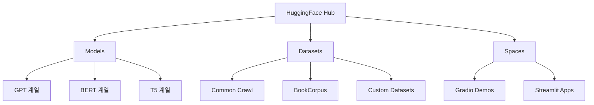
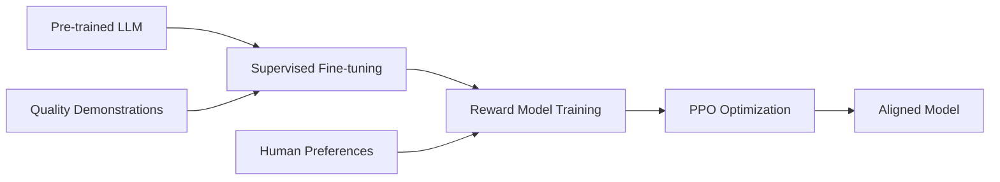

## 📦 사용하는 python package

- transformers==4.36.0
- datasets==2.16.0
- tokenizers==0.15.0
- accelerate==0.25.0
- peft==0.7.0
- trl==0.7.0
- evaluate==0.4.1
- torch==2.1.0
- numpy==1.24.0
- pandas==2.0.0

## 🚀 TL;DR

- **HuggingFace**는 LLM 개발을 위한 통합 생태계로, 사전 훈련된 모델부터 파인튜닝까지 전 과정을 지원한다
- **transformers**는 핵심 패키지로 모델 로딩, 추론, 훈련을 담당하며 **AutoModel**, **AutoTokenizer** 등의 Auto 클래스로 간편하게 사용 가능하다
- **datasets**는 대용량 데이터셋 처리에 최적화되어 있고, **tokenizers**는 빠르고 효율적인 텍스트 전처리를 제공한다
- **PEFT**(Parameter Efficient Fine-Tuning)는 **LoRA**, **QLoRA** 등으로 적은 자원으로도 대형 모델을 파인튜닝할 수 있게 해준다
- **accelerate**는 분산 학습과 혼합 정밀도 훈련을 자동화하고, **TRL**은 RLHF(인간 피드백 강화학습)를 쉽게 구현할 수 있도록 한다
- 실제 LLM 프로젝트에서는 이러한 패키지들을 조합하여 **데이터 전처리 → 모델 로딩 → 파인튜닝 → 평가 → 배포**의 전체 파이프라인을 구축한다

## 📓 실습 Jupyter Notebook

- [HuggingFace LLM Modeling Tutorial](https://github.com/yuiyeong/notebooks/blob/main/machine_learning/huggingface_llm_modeling.ipynb)

## 🤗 HuggingFace 생태계 개요

HuggingFace는 자연어 처리와 머신러닝 분야에서 가장 널리 사용되는 오픈소스 플랫폼이다. 특히 **Transformer 기반 모델**들의 사용을 민주화하고, 복잡한 LLM 개발 과정을 단순화하는 데 중점을 두고 있다.

> HuggingFace는 "GitHub for AI"라고 불릴 정도로, AI 모델과 데이터셋을 공유하고 협업할 수 있는 중앙화된 플랫폼 역할을 한다. 현재 50만 개 이상의 모델과 10만 개 이상의 데이터셋이 공유되고 있다. {: .prompt-tip}

### HuggingFace Hub와 모델 저장소

HuggingFace Hub는 사전 훈련된 모델, 데이터셋, 데모 애플리케이션을 호스팅하는 중앙 저장소다. 각 모델은 Git 기반 버전 관리를 통해 관리되며, 모델 카드(Model Card)를 통해 상세한 정보를 제공한다.



### 핵심 패키지들의 역할

HuggingFace 생태계는 여러 전문화된 패키지들로 구성되어 있으며, 각각은 LLM 개발의 특정 단계를 담당한다.

- **transformers**: 모델 아키텍처와 추론 엔진
- **datasets**: 대용량 데이터 처리와 전처리
- **tokenizers**: 고성능 텍스트 토크나이징
- **accelerate**: 분산 학습과 최적화
- **peft**: 효율적인 파인튜닝 기법
- **trl**: 강화학습 기반 모델 정렬

## 🔧 transformers: LLM의 핵심 엔진

`transformers` 패키지는 HuggingFace 생태계의 핵심으로, 다양한 Transformer 기반 모델들을 통일된 인터페이스로 사용할 수 있게 해준다.

### 주요 구성 요소

#### Auto 클래스들

Auto 클래스들은 모델명만으로 자동으로 적절한 모델과 토크나이저를 로드하는 편리한 인터페이스를 제공한다.

```python
from transformers import (
    AutoModel, AutoTokenizer, AutoModelForCausalLM,
    AutoModelForSequenceClassification, AutoConfig
)

# 사전 훈련된 GPT-2 모델과 토크나이저 로드
model_name = "gpt2"
tokenizer = AutoTokenizer.from_pretrained(model_name)
model = AutoModelForCausalLM.from_pretrained(model_name)

# 모델 설정 정보 확인
config = AutoConfig.from_pretrained(model_name)
print(f"모델 파라미터 수: {model.num_parameters():,}")
print(f"어휘 크기: {config.vocab_size}")
print(f"히든 차원: {config.hidden_size}")
# 출력: 모델 파라미터 수: 124,439,808
# 어휘 크기: 50257
# 히든 차원: 768
```

#### Pipeline 인터페이스

Pipeline은 복잡한 전처리와 후처리 과정을 추상화하여, 간단한 함수 호출로 다양한 NLP 태스크를 수행할 수 있게 해준다.

```python
from transformers import pipeline

# 텍스트 생성 파이프라인
text_generator = pipeline(
    "text-generation",
    model="gpt2",
    max_length=100,
    temperature=0.7,
    do_sample=True
)

# 감정 분석 파이프라인
sentiment_analyzer = pipeline(
    "sentiment-analysis",
    model="cardiffnlp/twitter-roberta-base-sentiment-latest"
)

# 사용 예시
generated_text = text_generator(
    "인공지능의 미래는",
    max_new_tokens=50,
    num_return_sequences=2
)

sentiment_result = sentiment_analyzer("이 영화 정말 재미있어요!")
print(sentiment_result)
# 출력: [{'label': 'POSITIVE', 'score': 0.9998}]
```

#### Trainer 클래스

Trainer는 모델 훈련 과정을 표준화하고 자동화하는 고수준 API다. 학습률 스케줄링, 그래디언트 클리핑, 체크포인트 저장 등의 기능을 자동으로 처리한다.

```python
from transformers import Trainer, TrainingArguments
import torch

# 훈련 설정 정의
training_args = TrainingArguments(
    output_dir="./results",
    num_train_epochs=3,
    per_device_train_batch_size=8,
    per_device_eval_batch_size=8,
    warmup_steps=500,
    weight_decay=0.01,
    logging_dir="./logs",
    logging_steps=100,
    evaluation_strategy="steps",
    eval_steps=500,
    save_strategy="steps",
    save_steps=1000,
    load_best_model_at_end=True,
    metric_for_best_model="eval_loss",
    greater_is_better=False,
    fp16=True,  # 혼합 정밀도 훈련
)

# 트레이너 초기화
trainer = Trainer(
    model=model,
    args=training_args,
    train_dataset=train_dataset,
    eval_dataset=eval_dataset,
    tokenizer=tokenizer,
)

# 훈련 시작
trainer.train()
```

### 모델 아키텍처별 특화 클래스들

transformers는 다양한 모델 아키텍처에 특화된 클래스들을 제공한다.

#### GPT 계열 (Decoder-only)

```python
from transformers import GPT2LMHeadModel, GPT2Tokenizer

# GPT-2 모델 로드 (언어 모델링용)
model = GPT2LMHeadModel.from_pretrained("gpt2-medium")
tokenizer = GPT2Tokenizer.from_pretrained("gpt2-medium")

# 패딩 토큰 설정 (GPT-2는 기본적으로 패딩 토큰이 없음)
tokenizer.pad_token = tokenizer.eos_token

# 텍스트 생성
input_text = "인공지능의 발전으로"
input_ids = tokenizer.encode(input_text, return_tensors="pt")

with torch.no_grad():
    output = model.generate(
        input_ids,
        max_length=100,
        num_beams=5,
        no_repeat_ngram_size=2,
        temperature=0.8,
        do_sample=True,
        pad_token_id=tokenizer.eos_token_id
    )

generated_text = tokenizer.decode(output[0], skip_special_tokens=True)
print(generated_text)
```

#### BERT 계열 (Encoder-only)

```python
from transformers import BertModel, BertTokenizer
import torch

# BERT 모델 로드
model = BertModel.from_pretrained("bert-base-multilingual-cased")
tokenizer = BertTokenizer.from_pretrained("bert-base-multilingual-cased")

# 텍스트 인코딩 및 임베딩 추출
text = "안녕하세요, 반갑습니다."
inputs = tokenizer(text, return_tensors="pt", padding=True, truncation=True)

with torch.no_grad():
    outputs = model(**inputs)
    last_hidden_states = outputs.last_hidden_state
    pooled_output = outputs.pooler_output

print(f"시퀀스 길이: {last_hidden_states.shape[1]}")
print(f"히든 차원: {last_hidden_states.shape[2]}")
print(f"풀링된 출력 차원: {pooled_output.shape}")
# 출력: 시퀀스 길이: 8, 히든 차원: 768, 풀링된 출력 차원: torch.Size([1, 768])
```

### 실무에서의 활용 사례

#### 다국어 언어 모델 활용

```python
from transformers import AutoModelForCausalLM, AutoTokenizer

# 다국어 지원 LLM 로드
model_name = "microsoft/DialoGPT-medium"
model = AutoModelForCausalLM.from_pretrained(model_name)
tokenizer = AutoTokenizer.from_pretrained(model_name)

# 대화형 챗봇 구현
def chat_with_model(user_input, chat_history_ids=None):
    # 사용자 입력 인코딩
    new_user_input_ids = tokenizer.encode(
        user_input + tokenizer.eos_token, 
        return_tensors='pt'
    )
    
    # 채팅 히스토리와 결합
    if chat_history_ids is not None:
        bot_input_ids = torch.cat([chat_history_ids, new_user_input_ids], dim=-1)
    else:
        bot_input_ids = new_user_input_ids
    
    # 응답 생성
    chat_history_ids = model.generate(
        bot_input_ids,
        max_length=1000,
        pad_token_id=tokenizer.eos_token_id,
        do_sample=True,
        temperature=0.7
    )
    
    # 응답 디코딩
    response = tokenizer.decode(
        chat_history_ids[:, bot_input_ids.shape[-1]:][0], 
        skip_special_tokens=True
    )
    
    return response, chat_history_ids

# 사용 예시
response, history = chat_with_model("안녕하세요!")
print(f"봇 응답: {response}")
```

> transformers 패키지는 50개 이상의 서로 다른 아키텍처를 지원하며, 각 모델은 특정 태스크에 최적화되어 있다. 따라서 목적에 맞는 모델 선택이 성능에 큰 영향을 미친다. {: .prompt-tip}

## 📊 datasets: 대용량 데이터 처리의 혁신

`datasets` 패키지는 대용량 데이터셋을 메모리 효율적으로 처리하고, 다양한 전처리 작업을 병렬로 수행할 수 있는 도구를 제공한다.

### 핵심 개념: 메모리 매핑과 아파치 애로우

datasets는 **아파치 애로우(Apache Arrow)** 형식을 기반으로 하여, 디스크에서 필요한 부분만 메모리로 로드하는 **메모리 매핑(Memory Mapping)** 기술을 사용한다.

```python
from datasets import Dataset, DatasetDict, load_dataset
import pandas as pd

# 대용량 데이터셋 로드 (메모리에 전체 로드하지 않음)
dataset = load_dataset("squad", split="train")
print(f"데이터셋 크기: {len(dataset):,}개")
print(f"메모리 사용량: {dataset.nbytes / 1024**2:.2f} MB")

# 데이터셋 구조 확인
print("데이터셋 구조:")
print(dataset)
print("\n첫 번째 샘플:")
print(dataset[0])
```

### 데이터 전처리와 변환

#### 배치 처리와 병렬화

```python
# 토크나이저를 사용한 배치 전처리
from transformers import AutoTokenizer

tokenizer = AutoTokenizer.from_pretrained("bert-base-cased")

def tokenize_function(examples):
    """배치 단위로 토크나이징을 수행하는 함수"""
    return tokenizer(
        examples["text"], 
        truncation=True, 
        padding="max_length",
        max_length=512
    )

# 원본 텍스트 데이터
raw_data = {
    "text": [
        "인공지능은 미래를 바꿀 것이다.",
        "자연어 처리는 AI의 핵심 분야이다.",
        "트랜스포머가 혁신을 가져왔다."
    ],
    "label": [1, 1, 1]
}

dataset = Dataset.from_dict(raw_data)

# 병렬 처리로 토크나이징 (num_proc로 프로세스 수 지정)
tokenized_dataset = dataset.map(
    tokenize_function,
    batched=True,  # 배치 단위로 처리
    num_proc=4,    # 4개 프로세스로 병렬 처리
    remove_columns=["text"]  # 원본 텍스트 열 제거
)

print("토크나이징 결과:")
print(tokenized_dataset[0].keys())
```

#### 데이터 필터링과 선택

```python
# 조건부 데이터 필터링
def filter_long_texts(example):
    """텍스트 길이가 100자 이상인 데이터만 선택"""
    return len(example["text"]) >= 100

filtered_dataset = dataset.filter(filter_long_texts)

# 데이터 분할
train_test_split = dataset.train_test_split(test_size=0.2, seed=42)
train_dataset = train_test_split["train"]
test_dataset = train_test_split["test"]

# 데이터 셔플링
shuffled_dataset = train_dataset.shuffle(seed=42)

print(f"원본 데이터: {len(dataset)}")
print(f"필터링 후: {len(filtered_dataset)}")
print(f"훈련 데이터: {len(train_dataset)}")
print(f"테스트 데이터: {len(test_dataset)}")
```

### 커스텀 데이터셋 생성

#### 로컬 파일에서 데이터셋 생성

```python
import json
from datasets import Dataset

# JSON 파일로부터 데이터셋 생성
def create_custom_dataset():
    # 샘플 데이터 생성
    data = [
        {"input": "번역해주세요: Hello world", "output": "안녕하세요 세계"},
        {"input": "번역해주세요: Good morning", "output": "좋은 아침"},
        {"input": "번역해주세요: Thank you", "output": "감사합니다"},
    ]
    
    # JSON 파일로 저장
    with open("translation_data.json", "w", encoding="utf-8") as f:
        for item in data:
            json.dump(item, f, ensure_ascii=False)
            f.write("\n")
    
    # 데이터셋 로드
    dataset = load_dataset("json", data_files="translation_data.json")
    return dataset["train"]

custom_dataset = create_custom_dataset()
print("커스텀 데이터셋 샘플:")
print(custom_dataset[0])
```

#### 대화형 데이터셋 구성

```python
def create_conversation_dataset():
    """대화형 AI 훈련을 위한 데이터셋 구성"""
    conversations = [
        {
            "messages": [
                {"role": "user", "content": "파이썬에서 리스트를 정렬하는 방법은?"},
                {"role": "assistant", "content": "list.sort() 메서드나 sorted() 함수를 사용할 수 있습니다."}
            ]
        },
        {
            "messages": [
                {"role": "user", "content": "머신러닝이 뭔가요?"},
                {"role": "assistant", "content": "데이터로부터 패턴을 학습하여 예측하는 인공지능 기술입니다."}
            ]
        }
    ]
    
    # 대화 형식을 훈련 형식으로 변환
    processed_data = []
    for conv in conversations:
        input_text = conv["messages"][0]["content"]
        output_text = conv["messages"][1]["content"]
        processed_data.append({
            "input": input_text,
            "output": output_text,
            "text": f"사용자: {input_text}\n어시스턴트: {output_text}"
        })
    
    return Dataset.from_list(processed_data)

conversation_dataset = create_conversation_dataset()
print("대화 데이터셋 샘플:")
print(conversation_dataset[0]["text"])
```

### 스트리밍과 대용량 데이터 처리

```python
# 스트리밍 모드로 대용량 데이터셋 처리
streaming_dataset = load_dataset(
    "oscar", "unshuffled_deduplicated_ko", 
    streaming=True, split="train"
)

# 첫 1000개 샘플만 처리
limited_dataset = streaming_dataset.take(1000)

# 스트리밍 데이터 배치 처리
def process_streaming_data(dataset, batch_size=32):
    batch = []
    for i, example in enumerate(dataset):
        batch.append(example)
        
        if len(batch) == batch_size:
            # 배치 처리 로직
            yield batch
            batch = []
        
        if i >= 999:  # 1000개까지만 처리
            break
    
    if batch:  # 남은 데이터 처리
        yield batch

# 사용 예시
for batch in process_streaming_data(limited_dataset):
    print(f"배치 크기: {len(batch)}")
    break  # 첫 번째 배치만 확인
```

> datasets의 메모리 매핑 기술 덕분에 TB 단위의 대용량 데이터셋도 일반적인 하드웨어에서 처리할 수 있다. 이는 기존 pandas나 numpy 대비 획기적인 메모리 효율성을 제공한다. {: .prompt-tip}

## ⚡ tokenizers: 고성능 텍스트 전처리

`tokenizers` 패키지는 Rust로 구현된 고성능 토크나이저를 제공하며, 다양한 토크나이징 알고리즘을 지원한다.

### 토크나이징 알고리즘의 종류

#### Byte-Pair Encoding (BPE)

BPE는 가장 널리 사용되는 서브워드 토크나이징 알고리즘으로, 빈도가 높은 문자 쌍을 반복적으로 병합하여 어휘를 구성한다.

```python
from tokenizers import Tokenizer
from tokenizers.models import BPE
from tokenizers.trainers import BpeTrainer
from tokenizers.pre_tokenizers import Whitespace
from tokenizers.processors import TemplateProcessing

# BPE 토크나이저 생성
tokenizer = Tokenizer(BPE(unk_token="[UNK]"))
tokenizer.pre_tokenizer = Whitespace()

# 특수 토큰 정의
trainer = BpeTrainer(
    special_tokens=["[UNK]", "[CLS]", "[SEP]", "[PAD]", "[MASK]"],
    vocab_size=30000,
    min_frequency=2
)

# 훈련 데이터
corpus = [
    "안녕하세요 반갑습니다",
    "자연어 처리는 재미있습니다",
    "토크나이저 학습 중입니다",
    "BPE 알고리즘을 사용합니다"
]

# 토크나이저 훈련
tokenizer.train_from_iterator(corpus, trainer)

# 후처리 설정
tokenizer.post_processor = TemplateProcessing(
    single="[CLS] $A [SEP]",
    pair="[CLS] $A [SEP] $B:1 [SEP]:1",
    special_tokens=[
        ("[CLS]", tokenizer.token_to_id("[CLS]")),
        ("[SEP]", tokenizer.token_to_id("[SEP]")),
    ],
)

# 토크나이징 테스트
output = tokenizer.encode("안녕하세요 새로운 문장입니다")
print(f"토큰 ID: {output.ids}")
print(f"토큰: {output.tokens}")
print(f"어텐션 마스크: {output.attention_mask}")
```

#### SentencePiece 통합

```python
from transformers import AutoTokenizer

# SentencePiece 기반 토크나이저 (대부분의 최신 LLM에서 사용)
tokenizer = AutoTokenizer.from_pretrained("klue/bert-base")

# 다양한 토크나이징 옵션
text = "안녕하세요! 이것은 테스트 문장입니다."

# 기본 토크나이징
basic_tokens = tokenizer.tokenize(text)
print(f"기본 토큰: {basic_tokens}")

# 인코딩 (토큰 → ID 변환)
encoded = tokenizer.encode(text, add_special_tokens=True)
print(f"인코딩된 ID: {encoded}")

# 배치 인코딩
batch_texts = [
    "첫 번째 문장입니다.",
    "두 번째 문장입니다.",
    "세 번째 문장입니다."
]

batch_encoded = tokenizer(
    batch_texts,
    padding=True,  # 배치 내 최대 길이로 패딩
    truncation=True,  # 최대 길이 초과시 자름
    max_length=128,
    return_tensors="pt"  # PyTorch 텐서로 반환
)

print("배치 인코딩 결과:")
print(f"입력 ID 형태: {batch_encoded['input_ids'].shape}")
print(f"어텐션 마스크 형태: {batch_encoded['attention_mask'].shape}")
```

### 커스텀 토크나이저 구축

#### 도메인 특화 토크나이저

```python
from tokenizers import normalizers, pre_tokenizers
from tokenizers.normalizers import NFD, Lowercase, StripAccents
from tokenizers.pre_tokenizers import ByteLevel

def create_domain_tokenizer(corpus, vocab_size=32000):
    """도메인 특화 토크나이저 생성"""
    
    # 토크나이저 초기화
    tokenizer = Tokenizer(BPE(unk_token="<unk>"))
    
    # 정규화 설정 (소문자 변환, 악센트 제거 등)
    tokenizer.normalizer = normalizers.Sequence([
        NFD(),
        Lowercase(),
        StripAccents()
    ])
    
    # 사전 토크나이징 설정
    tokenizer.pre_tokenizer = pre_tokenizers.Sequence([
        Whitespace(),
        ByteLevel(add_prefix_space=False)
    ])
    
    # 트레이너 설정
    trainer = BpeTrainer(
        special_tokens=["<pad>", "<unk>", "<s>", "</s>"],
        vocab_size=vocab_size,
        min_frequency=2,
        show_progress=True
    )
    
    # 훈련 실행
    tokenizer.train_from_iterator(corpus, trainer)
    
    return tokenizer

# 의료 도메인 예시 코퍼스
medical_corpus = [
    "환자의 혈압이 상승했습니다",
    "진단 결과 당뇨병으로 확인됩니다",
    "처방전에 따라 약물을 복용하세요",
    "정기 검진을 받으시기 바랍니다"
]

medical_tokenizer = create_domain_tokenizer(medical_corpus, vocab_size=8000)
medical_tokenizer.save("medical_tokenizer.json")

# 토크나이저 테스트
test_text = "환자의 당뇨 수치를 확인해주세요"
encoded = medical_tokenizer.encode(test_text)
print(f"의료 도메인 토큰: {encoded.tokens}")
```

### 다국어 토크나이징 처리

```python
from transformers import AutoTokenizer
import matplotlib.pyplot as plt

# 다국어 토크나이저 비교
tokenizers_dict = {
    "multilingual_bert": "bert-base-multilingual-cased",
    "xlm_roberta": "xlm-roberta-base", 
    "korean_bert": "klue/bert-base"
}

test_sentences = {
    "korean": "안녕하세요 자연어처리 공부중입니다",
    "english": "Hello I am studying natural language processing",
    "japanese": "こんにちは自然言語処理を勉強しています",
    "chinese": "你好我正在学习自然语言处理"
}

# 토크나이저별 토큰 수 비교
results = {}
for tokenizer_name, model_name in tokenizers_dict.items():
    tokenizer = AutoTokenizer.from_pretrained(model_name)
    results[tokenizer_name] = {}
    
    for lang, sentence in test_sentences.items():
        tokens = tokenizer.tokenize(sentence)
        results[tokenizer_name][lang] = len(tokens)
        print(f"{tokenizer_name} - {lang}: {len(tokens)} 토큰")
        print(f"  토큰: {tokens[:5]}...")  # 처음 5개만 출력
    print()

# [시각적 표현 넣기] - 토크나이저별 언어별 토큰 수 비교 차트
```

> 토크나이저의 어휘 크기와 알고리즘 선택은 모델의 성능과 효율성에 직접적인 영향을 미친다. 일반적으로 서브워드 토크나이징이 단어 기반보다 Out-of-Vocabulary 문제를 효과적으로 해결한다. {: .prompt-tip}

## 🚀 accelerate: 분산 학습의 자동화

`accelerate` 패키지는 복잡한 분산 학습 설정을 간소화하고, 다양한 하드웨어 환경에서 일관된 성능을 제공한다.

### 핵심 개념: 투명한 분산 처리

accelerate의 핵심 철학은 **코드 변경을 최소화**하면서 **자동으로 최적의 분산 전략을 적용**하는 것이다.

```python
from accelerate import Accelerator
import torch
import torch.nn as nn
from torch.utils.data import DataLoader
from transformers import AdamW, get_scheduler

# Accelerator 초기화 (자동으로 환경 감지)
accelerator = Accelerator(
    mixed_precision="fp16",  # 혼합 정밀도 자동 적용
    gradient_accumulation_steps=4,  # 그래디언트 누적
    log_with="tensorboard",  # 로깅 설정
    project_dir="./logs"
)

# 모델과 옵티마이저 설정
model = AutoModelForSequenceClassification.from_pretrained(
    "bert-base-cased", 
    num_labels=2
)
optimizer = AdamW(model.parameters(), lr=5e-5)

# 데이터로더 설정 (예시)
train_dataloader = DataLoader(train_dataset, batch_size=16, shuffle=True)
eval_dataloader = DataLoader(eval_dataset, batch_size=16)

# 학습률 스케줄러
num_training_steps = len(train_dataloader) * 3  # 3 에포크
lr_scheduler = get_scheduler(
    "linear",
    optimizer=optimizer,
    num_warmup_steps=0,
    num_training_steps=num_training_steps
)

# accelerate로 모든 구성 요소 준비
model, optimizer, train_dataloader, eval_dataloader, lr_scheduler = accelerator.prepare(
    model, optimizer, train_dataloader, eval_dataloader, lr_scheduler
)

print(f"디바이스: {accelerator.device}")
print(f"분산 환경: {accelerator.distributed_type}")
print(f"프로세스 수: {accelerator.num_processes}")
```

### 분산 훈련 루프 구현

```python
def train_model_with_accelerate():
    """accelerate를 사용한 분산 훈련 루프"""
    
    model.train()
    total_loss = 0
    
    for epoch in range(3):
        for step, batch in enumerate(train_dataloader):
            # 순전파
            outputs = model(**batch)
            loss = outputs.loss
            
            # 역전파 (accelerate가 자동으로 스케일링)
            accelerator.backward(loss)
            
            # 그래디언트 누적이 완료되었을 때만 업데이트
            if accelerator.sync_gradients:
                accelerator.clip_grad_norm_(model.parameters(), max_norm=1.0)
                optimizer.step()
                lr_scheduler.step()
                optimizer.zero_grad()
            
            total_loss += loss.item()
            
            # 로깅 (메인 프로세스에서만)
            if accelerator.is_main_process and step % 100 == 0:
                avg_loss = total_loss / (step + 1)
                print(f"Epoch {epoch}, Step {step}, Loss: {avg_loss:.4f}")
                
                # TensorBoard 로깅
                accelerator.log({
                    "train_loss": avg_loss,
                    "learning_rate": lr_scheduler.get_last_lr()[0]
                }, step=step)
        
        # 에포크 끝에서 평가
        eval_loss = evaluate_model()
        if accelerator.is_main_process:
            print(f"Epoch {epoch} - Eval Loss: {eval_loss:.4f}")

def evaluate_model():
    """모델 평가 함수"""
    model.eval()
    total_eval_loss = 0
    
    with torch.no_grad():
        for batch in eval_dataloader:
            outputs = model(**batch)
            loss = outputs.loss
            
            # 분산 환경에서 손실 수집
            all_losses = accelerator.gather(loss.repeat(batch["input_ids"].shape[0]))
            total_eval_loss += all_losses.mean().item()
    
    model.train()
    return total_eval_loss / len(eval_dataloader)

# 훈련 실행
train_model_with_accelerate()

# 모델 저장 (메인 프로세스에서만)
accelerator.wait_for_everyone()  # 모든 프로세스 동기화
if accelerator.is_main_process:
    unwrapped_model = accelerator.unwrap_model(model)
    unwrapped_model.save_pretrained("./fine_tuned_model")
```

### 설정 파일 기반 관리

```python
# accelerate 설정 생성
from accelerate.utils import write_basic_config

# 자동 설정 생성 (대화형)
# accelerate config 명령어와 동일한 기능
write_basic_config(mixed_precision="fp16")

# 또는 프로그래매틱 설정
from accelerate import DistributedDataParallelKwargs

# DDP 설정 옵션
ddp_kwargs = DistributedDataParallelKwargs(
    find_unused_parameters=True,
    broadcast_buffers=False
)

accelerator = Accelerator(
    kwargs_handlers=[ddp_kwargs],
    mixed_precision="fp16",
    cpu=False  # GPU 사용 강제
)

# 환경 정보 출력
def print_accelerate_info():
    print("=== Accelerate 환경 정보 ===")
    print(f"디바이스: {accelerator.device}")
    print(f"분산 타입: {accelerator.distributed_type}")
    print(f"로컬 프로세스 인덱스: {accelerator.local_process_index}")
    print(f"프로세스 인덱스: {accelerator.process_index}")
    print(f"총 프로세스 수: {accelerator.num_processes}")
    print(f"메인 프로세스 여부: {accelerator.is_main_process}")
    print(f"로컬 메인 프로세스 여부: {accelerator.is_local_main_process}")

print_accelerate_info()
```

### 메모리 최적화 기법

```python
from accelerate.utils import DistributedType

# 그래디언트 체크포인팅으로 메모리 절약
if accelerator.distributed_type != DistributedType.TPU:
    model.gradient_checkpointing_enable()

# DeepSpeed 통합 (매우 큰 모델용)
from accelerate import DeepSpeedPlugin

deepspeed_plugin = DeepSpeedPlugin(
    gradient_accumulation_steps=4,
    gradient_clipping=1.0,
    zero_stage=2,  # ZeRO Stage 2 활성화
    offload_optimizer_device="cpu",  # 옵티마이저를 CPU로 오프로드
    offload_param_device="cpu"  # 파라미터를 CPU로 오프로드
)

accelerator = Accelerator(deepspeed_plugin=deepspeed_plugin)

# 메모리 사용량 모니터링
def log_memory_usage():
    if torch.cuda.is_available():
        memory_allocated = torch.cuda.memory_allocated() / 1024**3  # GB
        memory_reserved = torch.cuda.memory_reserved() / 1024**3   # GB
        
        if accelerator.is_main_process:
            print(f"GPU 메모리 - 할당: {memory_allocated:.2f}GB, 예약: {memory_reserved:.2f}GB")

# 훈련 중 주기적으로 메모리 사용량 체크
log_memory_usage()
```

> accelerate는 단일 GPU에서 다중 노드 클러스터까지 동일한 코드로 확장할 수 있다. 특히 Transformer 모델의 대용량 훈련에서 메모리 효율성과 속도 개선 효과가 뛰어나다. {: .prompt-tip}

## 🎯 PEFT: 효율적인 파인튜닝의 혁신

**PEFT**(Parameter Efficient Fine-Tuning)는 대형 언어 모델의 전체 파라미터를 업데이트하지 않고도 효과적인 파인튜닝을 가능하게 하는 기술들을 구현한 패키지다.

### LoRA (Low-Rank Adaptation)

LoRA는 가중치 행렬을 두 개의 저차원 행렬의 곱으로 근사하여 학습할 파라미터 수를 대폭 줄이는 기법이다.

수학적으로, 원본 가중치 행렬 $W \in \mathbb{R}^{d \times k}$를 업데이트할 때:

$$ W' = W + \Delta W = W + AB $$

여기서 $A \in \mathbb{R}^{d \times r}$, $B \in \mathbb{R}^{r \times k}$이고, $r \ll \min(d,k)$이다.

```python
from peft import LoraConfig, get_peft_model, TaskType
from transformers import AutoModelForCausalLM, AutoTokenizer
import torch

# 베이스 모델 로드
model_name = "microsoft/DialoGPT-medium"
model = AutoModelForCausalLM.from_pretrained(model_name)
tokenizer = AutoTokenizer.from_pretrained(model_name)

# LoRA 설정
lora_config = LoraConfig(
    task_type=TaskType.CAUSAL_LM,
    r=16,  # 랭크 (저차원 행렬의 차원)
    lora_alpha=32,  # LoRA 스케일링 파라미터
    lora_dropout=0.1,  # LoRA 레이어의 드롭아웃
    target_modules=["c_attn", "c_proj"],  # LoRA를 적용할 모듈
    bias="none",  # 편향 학습 방식
)

# LoRA 모델 생성
peft_model = get_peft_model(model, lora_config)

# 학습 가능한 파라미터 확인
def print_trainable_parameters(model):
    trainable_params = 0
    all_param = 0
    for _, param in model.named_parameters():
        all_param += param.numel()
        if param.requires_grad:
            trainable_params += param.numel()
    
    print(f"trainable params: {trainable_params:,} || "
          f"all params: {all_param:,} || "
          f"trainable%: {100 * trainable_params / all_param:.2f}")

print_trainable_parameters(peft_model)
# 출력 예시: trainable params: 294,912 || all params: 117,489,408 || trainable%: 0.25
```

### QLoRA (Quantized LoRA)

QLoRA는 LoRA에 양자화를 결합하여 메모리 사용량을 더욱 줄이는 기법이다.

```python
from peft import LoraConfig, get_peft_model, prepare_model_for_kbit_training
from transformers import BitsAndBytesConfig
import torch

# 4비트 양자화 설정
bnb_config = BitsAndBytesConfig(
    load_in_4bit=True,  # 4비트 양자화 활성화
    bnb_4bit_quant_type="nf4",  # NormalFloat4 양자화
    bnb_4bit_compute_dtype=torch.float16,  # 연산시 사용할 데이터 타입
    bnb_4bit_use_double_quant=True,  # 이중 양자화 활성화
)

# 양자화된 모델 로드
model = AutoModelForCausalLM.from_pretrained(
    "microsoft/DialoGPT-large",
    quantization_config=bnb_config,
    device_map="auto",  # 자동으로 GPU 할당
    trust_remote_code=True
)

# 양자화된 모델을 LoRA 훈련에 맞게 준비
model = prepare_model_for_kbit_training(model)

# QLoRA 설정
qlora_config = LoraConfig(
    r=64,
    lora_alpha=16,
    target_modules=[
        "c_attn",
        "c_proj", 
        "c_fc"
    ],
    lora_dropout=0.1,
    bias="none",
    task_type=TaskType.CAUSAL_LM,
)

# QLoRA 모델 생성
qlora_model = get_peft_model(model, qlora_config)
print_trainable_parameters(qlora_model)

# 메모리 사용량 확인
if torch.cuda.is_available():
    print(f"GPU 메모리 사용량: {torch.cuda.memory_allocated() / 1024**3:.2f} GB")
```

### Prompt Tuning과 P-Tuning

```python
from peft import PromptTuningConfig, PrefixTuningConfig

# Prompt Tuning 설정
prompt_config = PromptTuningConfig(
    task_type=TaskType.CAUSAL_LM,
    prompt_tuning_init="TEXT",  # 텍스트로 초기화
    prompt_tuning_init_text="다음은 도움이 되는 대화입니다:",
    num_virtual_tokens=20,  # 가상 토큰 수
    tokenizer_name_or_path=model_name
)

# Prefix Tuning 설정  
prefix_config = PrefixTuningConfig(
    task_type=TaskType.CAUSAL_LM,
    num_virtual_tokens=30,
    encoder_hidden_size=768,  # 인코더 히든 차원
    prefix_projection=True  # 프리픽스 프로젝션 사용
)

# 각각 다른 PEFT 방법으로 모델 생성
prompt_model = get_peft_model(base_model, prompt_config)
prefix_model = get_peft_model(base_model, prefix_config)

print("=== PEFT 방법별 파라미터 비교 ===")
print("Prompt Tuning:")
print_trainable_parameters(prompt_model)
print("\nPrefix Tuning:")
print_trainable_parameters(prefix_model)
```

### 어댑터 기반 파인튜닝

```python
from peft import AdaptionPromptConfig, AdaLoraConfig

# Adaption Prompt 설정
adaption_config = AdaptionPromptConfig(
    adapter_len=10,
    adapter_layers=30,  # 적용할 레이어 수
    task_type=TaskType.CAUSAL_LM
)

# AdaLoRA 설정 (적응적 LoRA)
adalora_config = AdaLoraConfig(
    r=12,
    lora_alpha=32,
    target_modules=["c_attn", "c_proj"],
    lora_dropout=0.1,
    task_type=TaskType.CAUSAL_LM,
    init_r=12,  # 초기 랭크
    tinit=200,  # 랭크 조정 시작 스텝
    tfinal=1000,  # 랭크 조정 종료 스텝
    deltaT=10,  # 랭크 조정 간격
)

# 모델 생성 및 비교
adaption_model = get_peft_model(base_model, adaption_config)
adalora_model = get_peft_model(base_model, adalora_config)

print("=== 고급 PEFT 방법 비교 ===")
print("Adaption Prompt:")
print_trainable_parameters(adaption_model)
print("\nAdaLoRA:")
print_trainable_parameters(adalora_model)
```

### PEFT 모델 훈련과 추론

```python
from transformers import Trainer, TrainingArguments

def train_peft_model(peft_model, train_dataset, eval_dataset):
    """PEFT 모델 훈련 함수"""
    
    training_args = TrainingArguments(
        output_dir="./peft_results",
        num_train_epochs=3,
        per_device_train_batch_size=4,
        per_device_eval_batch_size=4,
        warmup_steps=100,
        weight_decay=0.01,
        logging_dir="./peft_logs",
        logging_steps=50,
        evaluation_strategy="steps",
        eval_steps=200,
        save_strategy="steps",
        save_steps=500,
        fp16=True,  # 혼합 정밀도
        dataloader_pin_memory=False,  # PEFT에서는 False 권장
        remove_unused_columns=False,
    )
    
    trainer = Trainer(
        model=peft_model,
        args=training_args,
        train_dataset=train_dataset,
        eval_dataset=eval_dataset,
        tokenizer=tokenizer,
    )
    
    # 훈련 실행
    trainer.train()
    
    # PEFT 어댑터만 저장 (원본 모델은 저장하지 않음)
    peft_model.save_pretrained("./peft_adapter")
    
    return trainer

# 훈련된 PEFT 모델 로드하기
def load_peft_model(base_model_name, adapter_path):
    """저장된 PEFT 어댑터 로드"""
    from peft import PeftModel
    
    base_model = AutoModelForCausalLM.from_pretrained(base_model_name)
    peft_model = PeftModel.from_pretrained(base_model, adapter_path)
    
    return peft_model

# 추론 예시
def generate_with_peft(model, tokenizer, prompt, max_length=100):
    """PEFT 모델로 텍스트 생성"""
    inputs = tokenizer(prompt, return_tensors="pt")
    
    with torch.no_grad():
        outputs = model.generate(
            **inputs,
            max_length=max_length,
            num_beams=5,
            temperature=0.7,
            do_sample=True,
            pad_token_id=tokenizer.eos_token_id
        )
    
    generated_text = tokenizer.decode(outputs[0], skip_special_tokens=True)
    return generated_text

# 사용 예시
prompt = "AI의 미래에 대해 설명해주세요:"
result = generate_with_peft(qlora_model, tokenizer, prompt)
print(f"생성된 텍스트: {result}")
```

> PEFT 기법들은 원본 모델의 99% 이상의 파라미터를 동결하면서도 전체 파인튜닝에 근접한 성능을 달성할 수 있다. 특히 QLoRA는 80GB 메모리가 필요한 모델을 16GB GPU에서도 파인튜닝 가능하게 한다. {: .prompt-tip}

## 🎮 TRL: 강화학습 기반 모델 정렬

**TRL**(Transformer Reinforcement Learning)은 인간 피드백 강화학습(RLHF)을 통해 언어 모델을 인간의 선호도에 맞게 정렬하는 도구를 제공한다.

### RLHF의 핵심 개념

RLHF는 다음 세 단계로 진행된다:

1. **지도 파인튜닝(SFT)**: 고품질 대화 데이터로 기본 모델 훈련
2. **보상 모델 훈련**: 인간 선호도를 학습하는 보상 모델 구축
3. **PPO 최적화**: 보상 모델을 활용한 강화학습 정책 최적화



### 지도 파인튜닝 (Supervised Fine-tuning)

```python
from trl import SFTTrainer
from transformers import AutoModelForCausalLM, AutoTokenizer, TrainingArguments
from datasets import Dataset

# 베이스 모델과 토크나이저 로드
model_name = "microsoft/DialoGPT-medium"
model = AutoModelForCausalLM.from_pretrained(model_name)
tokenizer = AutoTokenizer.from_pretrained(model_name)

# 패딩 토큰 설정
if tokenizer.pad_token is None:
    tokenizer.pad_token = tokenizer.eos_token

# SFT 훈련 데이터 준비
sft_data = [
    {
        "input": "안녕하세요, 오늘 날씨가 어떤가요?",
        "output": "안녕하세요! 오늘은 맑고 따뜻한 날씨입니다. 외출하기 좋은 날이네요."
    },
    {
        "input": "파이썬 프로그래밍을 배우고 싶어요.",
        "output": "파이썬 프로그래밍 학습을 도와드리겠습니다. 먼저 기본 문법부터 시작하는 것을 추천합니다."
    },
    {
        "input": "건강한 식단에 대해 조언해주세요.",
        "output": "균형 잡힌 식단을 위해서는 채소, 과일, 단백질, 통곡물을 골고루 섭취하는 것이 중요합니다."
    }
]

# 데이터셋 변환
def format_instruction(example):
    """대화 형식으로 데이터 포맷팅"""
    return f"사용자: {example['input']}\n어시스턴트: {example['output']}"

sft_dataset = Dataset.from_list(sft_data)
sft_dataset = sft_dataset.map(
    lambda x: {"text": format_instruction(x)},
    remove_columns=["input", "output"]
)

# SFT 훈련 설정
training_args = TrainingArguments(
    output_dir="./sft_model",
    num_train_epochs=3,
    per_device_train_batch_size=2,
    gradient_accumulation_steps=4,
    warmup_steps=100,
    learning_rate=5e-5,
    fp16=True,
    logging_steps=50,
    save_strategy="epoch",
    report_to=None,  # wandb 비활성화
)

# SFT 트레이너 초기화
sft_trainer = SFTTrainer(
    model=model,
    train_dataset=sft_dataset,
    args=training_args,
    tokenizer=tokenizer,
    max_seq_length=512,
    dataset_text_field="text",  # 텍스트 필드명
)

# SFT 훈련 실행
print("=== SFT 훈련 시작 ===")
sft_trainer.train()
sft_trainer.save_model("./sft_final_model")
```

### 보상 모델 훈련

```python
from trl import RewardTrainer
from transformers import AutoModelForSequenceClassification
import torch

# 보상 모델용 데이터 준비 (선호도 쌍)
reward_data = [
    {
        "chosen": "사용자: 오늘 기분이 좋지 않아요.\n어시스턴트: 힘든 하루를 보내고 계시는군요. 무엇이 도움이 될까요?",
        "rejected": "사용자: 오늘 기분이 좋지 않아요.\n어시스턴트: 그래서 뭐 어쩌라고요?"
    },
    {
        "chosen": "사용자: 코딩 공부 방법을 알려주세요.\n어시스턴트: 체계적인 학습 계획을 세워 단계별로 진행하는 것을 추천합니다.",
        "rejected": "사용자: 코딩 공부 방법을 알려주세요.\n어시스턴트: 그냥 책 읽어보세요."
    }
]

# 보상 모델 로드 (분류 모델로 구성)
reward_model = AutoModelForSequenceClassification.from_pretrained(
    model_name,
    num_labels=1,  # 보상 점수 하나만 출력
)

# 보상 데이터셋 변환
def create_reward_dataset(data):
    """보상 모델 훈련용 데이터셋 생성"""
    formatted_data = []
    
    for item in data:
        formatted_data.append({
            "input_ids_chosen": tokenizer.encode(item["chosen"], truncation=True, max_length=512),
            "input_ids_rejected": tokenizer.encode(item["rejected"], truncation=True, max_length=512),
        })
    
    return Dataset.from_list(formatted_data)

reward_dataset = create_reward_dataset(reward_data)

# 보상 모델 훈련
reward_training_args = TrainingArguments(
    output_dir="./reward_model",
    num_train_epochs=2,
    per_device_train_batch_size=1,
    learning_rate=1e-5,
    logging_steps=10,
    save_strategy="epoch",
    report_to=None,
)

reward_trainer = RewardTrainer(
    model=reward_model,
    args=reward_training_args,
    train_dataset=reward_dataset,
    tokenizer=tokenizer,
)

print("=== 보상 모델 훈련 시작 ===")
reward_trainer.train()
reward_trainer.save_model("./reward_final_model")
```

### PPO (Proximal Policy Optimization) 훈련

```python
from trl import PPOTrainer, PPOConfig, AutoModelForCausalLMWithValueHead
from trl.core import LengthSampler
import torch

# PPO 설정
ppo_config = PPOConfig(
    model_name="./sft_final_model",
    learning_rate=1.41e-5,
    batch_size=8,
    mini_batch_size=2,
    gradient_accumulation_steps=4,
    optimize_cuda_cache=True,
    early_stopping=False,
    target_kl=0.1,  # KL divergence 제약
    ppo_epochs=4,
    cliprange=0.2,
    vf_coef=0.1,  # 가치 함수 계수
    cliprange_value=0.2,
)

# PPO용 모델 로드 (가치 함수 헤드 포함)
ppo_model = AutoModelForCausalLMWithValueHead.from_pretrained(
    "./sft_final_model",
    torch_dtype=torch.float16
)

# 보상 모델 로드
reward_model = AutoModelForSequenceClassification.from_pretrained(
    "./reward_final_model",
    torch_dtype=torch.float16
)

# PPO 트레이너 초기화
ppo_trainer = PPOTrainer(
    config=ppo_config,
    model=ppo_model,
    ref_model=None,  # 참조 모델 (None이면 초기 모델 복사)
    tokenizer=tokenizer,
)

# PPO 훈련 데이터 (프롬프트만)
ppo_prompts = [
    "사용자: 좋은 습관을 만드는 방법을 알려주세요.\n어시스턴트:",
    "사용자: 스트레스 관리는 어떻게 하나요?\n어시스턴트:",
    "사용자: 효과적인 시간 관리법을 추천해주세요.\n어시스턴트:",
]

# 길이 샘플러 (응답 길이 제어)
output_length_sampler = LengthSampler(min_value=20, max_value=100)

def compute_reward(texts):
    """보상 모델을 사용하여 보상 계산"""
    inputs = tokenizer(texts, return_tensors="pt", padding=True, truncation=True)
    
    with torch.no_grad():
        outputs = reward_model(**inputs)
        rewards = outputs.logits.squeeze()
    
    return rewards.tolist()

# PPO 훈련 루프
print("=== PPO 훈련 시작 ===")
for epoch in range(3):
    for batch_idx, prompt in enumerate(ppo_prompts):
        # 프롬프트 토크나이징
        prompt_tensors = [tokenizer.encode(prompt, return_tensors="pt").squeeze()]
        
        # 응답 생성
        response_tensors = ppo_trainer.generate(
            prompt_tensors,
            return_prompt=False,
            length_sampler=output_length_sampler,
            **{
                "do_sample": True,
                "temperature": 0.7,
                "top_p": 0.9,
                "pad_token_id": tokenizer.eos_token_id,
            }
        )
        
        # 전체 텍스트 구성 (프롬프트 + 응답)
        full_texts = []
        for prompt_tensor, response_tensor in zip(prompt_tensors, response_tensors):
            full_tensor = torch.cat([prompt_tensor, response_tensor])
            full_text = tokenizer.decode(full_tensor, skip_special_tokens=True)
            full_texts.append(full_text)
        
        # 보상 계산
        rewards = compute_reward(full_texts)
        rewards = [torch.tensor(reward, dtype=torch.float16) for reward in rewards]
        
        # PPO 업데이트
        train_stats = ppo_trainer.step(prompt_tensors, response_tensors, rewards)
        
        print(f"Epoch {epoch}, Batch {batch_idx}")
        print(f"평균 보상: {torch.stack(rewards).mean().item():.4f}")
        print(f"생성된 응답: {full_texts[0]}")
        print("-" * 50)

# 최종 모델 저장
ppo_trainer.save_model("./ppo_final_model")
```

### DPO (Direct Preference Optimization)

DPO는 PPO의 복잡성을 줄이고 직접적으로 선호도를 최적화하는 새로운 접근법이다.

```python
from trl import DPOTrainer

# DPO 훈련 데이터 (선호도 쌍)
dpo_data = [
    {
        "prompt": "사용자: 건강한 생활습관에 대해 조언해주세요.\n어시스턴트:",
        "chosen": "규칙적인 운동, 균형 잡힌 식단, 충분한 수면이 건강한 생활의 기본입니다. 특히 하루 30분 이상의 유산소 운동을 추천합니다.",
        "rejected": "그냥 운동하고 잘 먹으면 됩니다."
    },
    {
        "prompt": "사용자: 새로운 언어를 배우는 효과적인 방법은?\n어시스턴트:",
        "chosen": "언어 학습에는 꾸준함이 가장 중요합니다. 매일 조금씩이라도 듣기, 말하기, 읽기, 쓰기를 골고루 연습하세요.",
        "rejected": "그냥 많이 듣고 따라하면 됩니다."
    }
]

dpo_dataset = Dataset.from_list(dpo_data)

# DPO 훈련 설정
dpo_training_args = TrainingArguments(
    output_dir="./dpo_model",
    num_train_epochs=2,
    per_device_train_batch_size=1,
    learning_rate=5e-7,  # DPO는 더 작은 학습률 사용
    logging_steps=1,
    save_strategy="epoch",
    report_to=None,
)

# DPO 트레이너 초기화
dpo_trainer = DPOTrainer(
    model=model,
    ref_model=None,  # 참조 모델 (None이면 자동 복사)
    args=dpo_training_args,
    train_dataset=dpo_dataset,
    tokenizer=tokenizer,
    beta=0.1,  # DPO 정규화 파라미터
    max_length=512,
    max_prompt_length=256,
)

print("=== DPO 훈련 시작 ===")
dpo_trainer.train()
dpo_trainer.save_model("./dpo_final_model")
```

> TRL은 ChatGPT와 같은 고품질 대화 AI 개발의 핵심 기술인 RLHF를 구현한다. 특히 DPO는 기존 PPO보다 훨씬 간단하면서도 우수한 성능을 보여주어 최근 주목받고 있다. {: .prompt-tip}

## 📊 evaluate: 체계적인 모델 평가

`evaluate` 패키지는 다양한 NLP 태스크에 대한 표준화된 평가 메트릭을 제공하여 모델 성능을 객관적으로 측정할 수 있게 해준다.

### 기본 평가 메트릭

```python
import evaluate
import numpy as np

# 다양한 평가 메트릭 로드
accuracy_metric = evaluate.load("accuracy")
f1_metric = evaluate.load("f1")
bleu_metric = evaluate.load("bleu")
rouge_metric = evaluate.load("rouge")
perplexity_metric = evaluate.load("perplexity", module_type="metric")

# 분류 태스크 평가 예시
def evaluate_classification_model(predictions, references):
    """분류 모델 평가"""
    
    # 정확도 계산
    accuracy = accuracy_metric.compute(
        predictions=predictions,
        references=references
    )
    
    # F1 스코어 계산 (다중 클래스)
    f1_macro = f1_metric.compute(
        predictions=predictions,
        references=references,
        average="macro"
    )
    
    f1_micro = f1_metric.compute(
        predictions=predictions,
        references=references,
        average="micro"
    )
    
    return {
        "accuracy": accuracy["accuracy"],
        "f1_macro": f1_macro["f1"],
        "f1_micro": f1_micro["f1"]
    }

# 예시 데이터
pred_labels = [0, 1, 2, 1, 0, 2, 1, 0]
true_labels = [0, 1, 1, 1, 0, 2, 0, 0]

classification_results = evaluate_classification_model(pred_labels, true_labels)
print("분류 평가 결과:", classification_results)
# 출력: 분류 평가 결과: {'accuracy': 0.75, 'f1_macro': 0.722, 'f1_micro': 0.75}
```

### 생성 모델 평가

```python
def evaluate_generation_model(predictions, references):
    """텍스트 생성 모델 평가"""
    
    # BLEU 스코어 (기계 번역, 텍스트 생성)
    bleu_scores = bleu_metric.compute(
        predictions=predictions,
        references=[[ref] for ref in references]  # BLEU는 참조문이 리스트의 리스트 형태
    )
    
    # ROUGE 스코어 (요약, 생성)
    rouge_scores = rouge_metric.compute(
        predictions=predictions,
        references=references
    )
    
    return {
        "bleu": bleu_scores["bleu"],
        "rouge1": rouge_scores["rouge1"],
        "rouge2": rouge_scores["rouge2"],
        "rougeL": rouge_scores["rougeL"],
    }

# 생성 모델 평가 예시
generated_texts = [
    "안녕하세요 반갑습니다",
    "오늘 날씨가 정말 좋네요",
    "파이썬 프로그래밍을 배우고 있습니다"
]

reference_texts = [
    "안녕하세요 만나서 반갑습니다",
    "오늘은 날씨가 맑고 좋습니다",
    "파이썬 언어를 공부하고 있어요"
]

generation_results = evaluate_generation_model(generated_texts, reference_texts)
print("생성 평가 결과:")
for metric, score in generation_results.items():
    print(f"{metric}: {score:.4f}")
```

### 언어 모델 평가 (Perplexity)

```python
from transformers import AutoModelForCausalLM, AutoTokenizer
import torch

def evaluate_language_model_perplexity(model, tokenizer, texts):
    """언어 모델의 perplexity 계산"""
    model.eval()
    total_loss = 0
    total_tokens = 0
    
    with torch.no_grad():
        for text in texts:
            # 텍스트 토크나이징
            inputs = tokenizer(text, return_tensors="pt", truncation=True, max_length=512)
            input_ids = inputs["input_ids"]
            
            # 모델 예측
            outputs = model(input_ids, labels=input_ids)
            loss = outputs.loss
            
            # 손실과 토큰 수 누적
            total_loss += loss.item() * input_ids.shape[1]
            total_tokens += input_ids.shape[1]
    
    # Perplexity 계산
    avg_loss = total_loss / total_tokens
    perplexity = torch.exp(torch.tensor(avg_loss))
    
    return perplexity.item()

# 언어 모델 로드
lm_model = AutoModelForCausalLM.from_pretrained("gpt2")
lm_tokenizer = AutoTokenizer.from_pretrained("gpt2")
lm_tokenizer.pad_token = lm_tokenizer.eos_token

# 테스트 텍스트
test_texts = [
    "인공지능은 미래를 바꿀 것이다.",
    "자연어 처리 기술이 발전하고 있다.",
    "머신러닝 모델의 성능이 향상되었다."
]

perplexity_score = evaluate_language_model_perplexity(lm_model, lm_tokenizer, test_texts)
print(f"언어 모델 Perplexity: {perplexity_score:.2f}")
```

### 커스텀 평가 메트릭 생성

```python
import evaluate
from sklearn.metrics import classification_report

# 커스텀 메트릭 정의
@evaluate.utils.file_utils.add_start_docstrings(_DESCRIPTION, _KWARGS_DESCRIPTION)
class CustomF1Metric(evaluate.Metric):
    def _info(self):
        return evaluate.MetricInfo(
            description="Custom F1 metric with detailed classification report",
            citation="",
            inputs_description="",
            features=evaluate.Features({
                "predictions": evaluate.Value("int32"),
                "references": evaluate.Value("int32"),
            }),
        )
    
    def _compute(self, predictions, references, average="weighted"):
        # sklearn을 사용한 상세한 분류 리포트
        report = classification_report(
            references, predictions, 
            output_dict=True, 
            zero_division=0
        )
        
        return {
            "f1_weighted": report["weighted avg"]["f1-score"],
            "precision_weighted": report["weighted avg"]["precision"],
            "recall_weighted": report["weighted avg"]["recall"],
            "classification_report": report
        }

# 대화 품질 평가를 위한 커스텀 메트릭
def evaluate_conversation_quality(generated_responses, reference_responses, contexts):
    """대화 품질을 종합적으로 평가하는 함수"""
    
    # 1. 관련성 평가 (ROUGE 기반)
    rouge_scores = rouge_metric.compute(
        predictions=generated_responses,
        references=reference_responses
    )
    
    # 2. 일관성 평가 (문맥과의 BLEU 점수)
    consistency_scores = []
    for gen_resp, context in zip(generated_responses, contexts):
        bleu_score = bleu_metric.compute(
            predictions=[gen_resp],
            references=[[context]]
        )
        consistency_scores.append(bleu_score["bleu"])
    
    # 3. 다양성 평가 (고유 n-gram 비율)
    def calculate_diversity(texts, n=2):
        all_ngrams = []
        unique_ngrams = set()
        
        for text in texts:
            words = text.split()
            ngrams = [' '.join(words[i:i+n]) for i in range(len(words)-n+1)]
            all_ngrams.extend(ngrams)
            unique_ngrams.update(ngrams)
        
        return len(unique_ngrams) / len(all_ngrams) if all_ngrams else 0
    
    diversity_score = calculate_diversity(generated_responses)
    
    # 종합 점수 계산
    relevance_score = rouge_scores["rougeL"]
    consistency_score = np.mean(consistency_scores)
    
    overall_score = (relevance_score * 0.4 + 
                    consistency_score * 0.3 + 
                    diversity_score * 0.3)
    
    return {
        "relevance": relevance_score,
        "consistency": consistency_score, 
        "diversity": diversity_score,
        "overall_quality": overall_score
    }

# 사용 예시
generated_responses = [
    "네, 도움을 드릴 수 있습니다. 어떤 부분이 궁금하신가요?",
    "파이썬은 초보자에게 적합한 프로그래밍 언어입니다.",
    "규칙적인 운동과 균형 잡힌 식단이 중요합니다."
]

reference_responses = [
    "물론 도움드리겠습니다. 구체적으로 무엇을 도와드릴까요?",
    "파이썬은 문법이 간단해서 프로그래밍 입문자에게 추천합니다.",
    "건강을 위해서는 꾸준한 운동과 좋은 식습관이 필수입니다."
]

contexts = [
    "사용자가 도움을 요청하는 상황",
    "프로그래밍 언어 추천 요청",
    "건강 관리 방법 문의"
]

conversation_quality = evaluate_conversation_quality(
    generated_responses, reference_responses, contexts
)

print("대화 품질 평가 결과:")
for metric, score in conversation_quality.items():
    print(f"{metric}: {score:.4f}")
```

### 모델 성능 벤치마킹

```python
def comprehensive_model_evaluation(model, tokenizer, test_dataset):
    """포괄적인 모델 성능 평가"""
    
    results = {}
    
    # 1. 추론 속도 측정
    import time
    
    start_time = time.time()
    sample_inputs = tokenizer("테스트 문장입니다.", return_tensors="pt")
    
    with torch.no_grad():
        for _ in range(100):  # 100회 반복
            outputs = model(**sample_inputs)
    
    inference_time = (time.time() - start_time) / 100
    results["inference_time_ms"] = inference_time * 1000
    
    # 2. 메모리 사용량 측정
    if torch.cuda.is_available():
        torch.cuda.reset_peak_memory_stats()
        with torch.no_grad():
            outputs = model(**sample_inputs)
        results["peak_memory_mb"] = torch.cuda.max_memory_allocated() / 1024**2
    
    # 3. 모델 크기 정보
    total_params = sum(p.numel() for p in model.parameters())
    trainable_params = sum(p.numel() for p in model.parameters() if p.requires_grad)
    
    results["total_parameters"] = total_params
    results["trainable_parameters"] = trainable_params
    results["model_size_mb"] = total_params * 4 / 1024**2  # float32 기준
    
    return results

# 벤치마킹 실행
benchmark_results = comprehensive_model_evaluation(lm_model, lm_tokenizer, None)
print("모델 벤치마킹 결과:")
for metric, value in benchmark_results.items():
    if isinstance(value, float):
        print(f"{metric}: {value:.2f}")
    else:
        print(f"{metric}: {value:,}")
```

> evaluate 패키지는 연구 재현성과 모델 비교를 위해 표준화된 평가 체계를 제공한다. 특히 Hugging Face Hub에서 공유되는 모든 모델들은 이 평가 체계를 통해 성능을 비교할 수 있다. {: .prompt-tip}

## 🔄 통합 워크플로우: 실제 LLM 프로젝트 구현

지금까지 살펴본 HuggingFace 패키지들을 통합하여 실제 LLM 프로젝트를 구현해보자. 한국어 감정 분석 챗봇을 개발하는 전체 파이프라인을 구성할 것이다.

### 1단계: 데이터 준비와 전처리

```python
import os
from datasets import Dataset, DatasetDict, load_dataset
from transformers import AutoTokenizer
import pandas as pd

# 한국어 감정 분석 데이터 준비
def prepare_emotion_dataset():
    """한국어 감정 분석 데이터셋 준비"""
    
    # 샘플 데이터 생성 (실제로는 대용량 데이터 사용)
    emotion_data = [
        {"text": "오늘 정말 기쁜 일이 있었어요!", "label": 2, "emotion": "기쁨"},
        {"text": "시험을 망쳐서 너무 속상해요", "label": 0, "emotion": "슬픔"},
        {"text": "별로 특별할 것 없는 하루였네요", "label": 1, "emotion": "중립"},
        {"text": "새로운 프로젝트가 성공해서 정말 행복합니다", "label": 2, "emotion": "기쁨"},
        {"text": "교통체증 때문에 약속에 늦어서 화가 납니다", "label": 0, "emotion": "분노"},
        {"text": "그냥 평범한 월요일이에요", "label": 1, "emotion": "중립"},
    ]
    
    # 데이터셋 생성 및 분할
    dataset = Dataset.from_list(emotion_data * 100)  # 데이터 확장
    dataset = dataset.train_test_split(test_size=0.2, seed=42)
    
    return DatasetDict({
        "train": dataset["train"],
        "test": dataset["test"]
    })

# 토크나이저를 활용한 전처리
def preprocess_data(dataset_dict, model_name="klue/bert-base"):
    """데이터 전처리 및 토크나이징"""
    
    tokenizer = AutoTokenizer.from_pretrained(model_name)
    
    def tokenize_function(examples):
        return tokenizer(
            examples["text"],
            truncation=True,
            padding="max_length",
            max_length=128,
            return_tensors="pt"
        )
    
    # 병렬 처리로 토크나이징
    tokenized_dataset = dataset_dict.map(
        tokenize_function,
        batched=True,
        num_proc=4,
        remove_columns=["text", "emotion"]
    )
    
    return tokenized_dataset, tokenizer

# 데이터 준비 실행
emotion_dataset = prepare_emotion_dataset()
tokenized_dataset, tokenizer = preprocess_data(emotion_dataset)

print("데이터셋 정보:")
print(f"훈련 데이터: {len(tokenized_dataset['train'])}")
print(f"테스트 데이터: {len(tokenized_dataset['test'])}")
```

### 2단계: 모델 파인튜닝 (PEFT 활용)

```python
from peft import LoraConfig, get_peft_model, TaskType
from transformers import (
    AutoModelForSequenceClassification,
    TrainingArguments,
    Trainer,
    DataCollatorWithPadding
)
from accelerate import Accelerator
import numpy as np

# 베이스 모델 로드
def setup_model_for_finetuning():
    """PEFT를 활용한 모델 설정"""
    
    model = AutoModelForSequenceClassification.from_pretrained(
        "klue/bert-base",
        num_labels=3,  # 3개 감정 클래스
        torch_dtype=torch.float16
    )
    
    # LoRA 설정
    lora_config = LoraConfig(
        task_type=TaskType.SEQ_CLS,
        r=16,
        lora_alpha=32,
        lora_dropout=0.1,
        target_modules=["query", "value", "key", "dense"],
        bias="none",
    )
    
    # PEFT 모델 생성
    peft_model = get_peft_model(model, lora_config)
    
    return peft_model

# 평가 메트릭 정의
def compute_metrics(eval_pred):
    """평가 메트릭 계산"""
    import evaluate
    
    accuracy_metric = evaluate.load("accuracy")
    f1_metric = evaluate.load("f1")
    
    predictions, labels = eval_pred
    predictions = np.argmax(predictions, axis=1)
    
    accuracy = accuracy_metric.compute(predictions=predictions, references=labels)
    f1 = f1_metric.compute(predictions=predictions, references=labels, average="weighted")
    
    return {
        "accuracy": accuracy["accuracy"],
        "f1": f1["f1"]
    }

# accelerate를 활용한 훈련 설정
def train_emotion_classifier():
    """감정 분류 모델 훈련"""
    
    # Accelerator 초기화
    accelerator = Accelerator(mixed_precision="fp16")
    
    # 모델 설정
    model = setup_model_for_finetuning()
    
    # 데이터 콜레이터
    data_collator = DataCollatorWithPadding(tokenizer=tokenizer)
    
    # 훈련 설정
    training_args = TrainingArguments(
        output_dir="./emotion_classifier",
        num_train_epochs=3,
        per_device_train_batch_size=16,
        per_device_eval_batch_size=16,
        warmup_steps=500,
        weight_decay=0.01,
        logging_dir="./logs",
        logging_steps=100,
        evaluation_strategy="steps",
        eval_steps=200,
        save_strategy="steps",
        save_steps=500,
        load_best_model_at_end=True,
        metric_for_best_model="f1",
        fp16=True,
        report_to=None,  # wandb 비활성화
    )
    
    # 트레이너 초기화
    trainer = Trainer(
        model=model,
        args=training_args,
        train_dataset=tokenized_dataset["train"],
        eval_dataset=tokenized_dataset["test"],
        tokenizer=tokenizer,
        data_collator=data_collator,
        compute_metrics=compute_metrics,
    )
    
    # 훈련 실행
    print("=== 감정 분류 모델 훈련 시작 ===")
    trainer.train()
    
    # 최종 평가
    eval_results = trainer.evaluate()
    print("최종 평가 결과:", eval_results)
    
    # 모델 저장
    trainer.save_model("./emotion_classifier_final")
    
    return trainer, model

# 훈련 실행
trainer, trained_model = train_emotion_classifier()
```

### 3단계: 대화형 챗봇 구현

```python
from transformers import pipeline, AutoModelForCausalLM
import torch

class EmotionAwareChatbot:
    """감정 인식 대화형 챗봇"""
    
    def __init__(self, emotion_model_path, chat_model_name="microsoft/DialoGPT-medium"):
        # 감정 분석 모델 로드
        self.emotion_classifier = pipeline(
            "text-classification",
            model=emotion_model_path,
            tokenizer=tokenizer,
            return_all_scores=True
        )
        
        # 대화 모델 로드
        self.chat_model = AutoModelForCausalLM.from_pretrained(chat_model_name)
        self.chat_tokenizer = AutoTokenizer.from_pretrained(chat_model_name)
        
        # 패딩 토큰 설정
        if self.chat_tokenizer.pad_token is None:
            self.chat_tokenizer.pad_token = self.chat_tokenizer.eos_token
        
        # 감정별 응답 템플릿
        self.emotion_templates = {
            "기쁨": [
                "정말 좋은 소식이네요! 더 자세히 들려주세요.",
                "기쁜 일이 있으셨군요! 축하합니다.",
                "행복한 순간을 공유해주셔서 감사해요."
            ],
            "슬픔": [
                "힘든 시간을 보내고 계시는군요. 괜찮으시다면 더 얘기해보세요.",
                "속상한 일이 있으셨나봐요. 제가 들어드릴게요.",
                "어려운 상황이시겠어요. 조금이라도 도움이 되길 바라요."
            ],
            "중립": [
                "그렇군요. 더 자세히 말씀해주세요.",
                "어떤 부분에 대해 더 이야기하고 싶으신가요?",
                "네, 이해했습니다. 계속해서 대화해봐요."
            ]
        }
    
    def analyze_emotion(self, text):
        """텍스트의 감정 분석"""
        emotion_scores = self.emotion_classifier(text)[0]
        
        # 감정 레이블 매핑
        emotion_map = {0: "슬픔", 1: "중립", 2: "기쁨"}
        
        max_score_item = max(emotion_scores, key=lambda x: x['score'])
        predicted_emotion = emotion_map[int(max_score_item['label'].split('_')[-1])]
        confidence = max_score_item['score']
        
        return predicted_emotion, confidence
    
    def generate_empathetic_response(self, user_input, emotion, chat_history=None):
        """감정을 고려한 공감적 응답 생성"""
        
        # 감정에 따른 시스템 프롬프트 선택
        import random
        emotion_prompt = random.choice(self.emotion_templates[emotion])
        
        # 대화 히스토리 구성
        if chat_history is None:
            chat_history = ""
        
        # 컨텍스트 구성
        context = f"{chat_history}사용자 ({emotion}): {user_input}\n봇: {emotion_prompt}\n"
        
        # 응답 생성
        inputs = self.chat_tokenizer.encode(context, return_tensors="pt")
        
        with torch.no_grad():
            outputs = self.chat_model.generate(
                inputs,
                max_length=inputs.shape[1] + 100,
                num_beams=5,
                temperature=0.7,
                do_sample=True,
                pad_token_id=self.chat_tokenizer.eos_token_id,
                no_repeat_ngram_size=3
            )
        
        response = self.chat_tokenizer.decode(
            outputs[0][inputs.shape[1]:], 
            skip_special_tokens=True
        ).strip()
        
        return response
    
    def chat(self, user_input, chat_history=""):
        """메인 대화 함수"""
        
        # 감정 분석
        emotion, confidence = self.analyze_emotion(user_input)
        
        # 응답 생성
        response = self.generate_empathetic_response(
            user_input, emotion, chat_history
        )
        
        # 대화 히스토리 업데이트
        updated_history = f"{chat_history}사용자: {user_input}\n봇: {response}\n"
        
        return {
            "response": response,
            "detected_emotion": emotion,
            "emotion_confidence": confidence,
            "chat_history": updated_history
        }

# 챗봇 초기화 및 테스트
chatbot = EmotionAwareChatbot("./emotion_classifier_final")

# 대화 테스트
def test_chatbot():
    """챗봇 테스트"""
    
    test_inputs = [
        "오늘 승진 소식을 들었어요!",
        "시험에서 떨어져서 너무 속상해요",
        "그냥 평범한 하루였어요",
        "친구와 싸워서 기분이 안 좋네요"
    ]
    
    chat_history = ""
    
    for user_input in test_inputs:
        result = chatbot.chat(user_input, chat_history)
        
        print(f"\n사용자: {user_input}")
        print(f"감정 분석: {result['detected_emotion']} (신뢰도: {result['emotion_confidence']:.3f})")
        print(f"봇 응답: {result['response']}")
        print("-" * 50)
        
        chat_history = result['chat_history']

test_chatbot()
```

### 4단계: 모델 성능 평가 및 최적화

```python
import evaluate
from trl import DPOTrainer
import matplotlib.pyplot as plt

def comprehensive_evaluation():
    """포괄적인 모델 평가"""
    
    # 1. 감정 분석 성능 평가
    def evaluate_emotion_classifier():
        predictions = []
        references = []
        
        for example in tokenized_dataset["test"]:
            inputs = {k: v.unsqueeze(0) for k, v in example.items() if k != "label"}
            with torch.no_grad():
                outputs = trained_model(**inputs)
                pred = torch.argmax(outputs.logits, dim=-1).item()
            
            predictions.append(pred)
            references.append(example["label"])
        
        # 평가 메트릭 계산
        accuracy = evaluate.load("accuracy").compute(
            predictions=predictions, references=references
        )
        f1 = evaluate.load("f1").compute(
            predictions=predictions, references=references, average="weighted"
        )
        
        return {
            "emotion_accuracy": accuracy["accuracy"],
            "emotion_f1": f1["f1"]
        }
    
    # 2. 챗봇 응답 품질 평가
    def evaluate_chat_quality():
        test_conversations = [
            {
                "input": "정말 기쁜 소식이 있어요!",
                "expected_emotion": "기쁨",
                "context": "positive news sharing"
            },
            {
                "input": "오늘 하루가 힘들었어요",
                "expected_emotion": "슬픔", 
                "context": "expressing difficulty"
            }
        ]
        
        emotion_accuracy = 0
        response_quality_scores = []
        
        for conv in test_conversations:
            result = chatbot.chat(conv["input"])
            
            # 감정 분류 정확도
            if result["detected_emotion"] == conv["expected_emotion"]:
                emotion_accuracy += 1
            
            # 응답 품질 (길이, 적절성 등의 간단한 휴리스틱)
            response_length = len(result["response"].split())
            if 5 <= response_length <= 50:  # 적절한 길이
                response_quality_scores.append(1.0)
            else:
                response_quality_scores.append(0.5)
        
        return {
            "chat_emotion_accuracy": emotion_accuracy / len(test_conversations),
            "avg_response_quality": sum(response_quality_scores) / len(response_quality_scores)
        }
    
    # 3. 성능 메트릭 수집
    emotion_metrics = evaluate_emotion_classifier()
    chat_metrics = evaluate_chat_quality()
    
    # 4. 시스템 성능 측정
    import time
    
    start_time = time.time()
    for _ in range(10):
        chatbot.chat("테스트 메시지입니다")
    avg_response_time = (time.time() - start_time) / 10
    
    # 결과 출력
    print("=== 종합 평가 결과 ===")
    print(f"감정 분류 정확도: {emotion_metrics['emotion_accuracy']:.4f}")
    print(f"감정 분류 F1 스코어: {emotion_metrics['emotion_f1']:.4f}")
    print(f"챗봇 감정 인식 정확도: {chat_metrics['chat_emotion_accuracy']:.4f}")
    print(f"응답 품질 점수: {chat_metrics['avg_response_quality']:.4f}")
    print(f"평균 응답 시간: {avg_response_time:.3f}초")
    
    return {**emotion_metrics, **chat_metrics, "avg_response_time": avg_response_time}

# 평가 실행
evaluation_results = comprehensive_evaluation()

# [시각적 표현 넣기] - 평가 결과 시각화 차트

# 모델 최적화 권장사항 출력
def suggest_optimizations(results):
    """평가 결과를 바탕으로 최적화 방안 제안"""
    
    suggestions = []
    
    if results["emotion_accuracy"] < 0.8:
        suggestions.append("• 감정 분류 성능 향상을 위해 더 많은 훈련 데이터 수집 필요")
        suggestions.append("• LoRA 랭크를 증가시키거나 더 많은 레이어에 적용 고려")
    
    if results["avg_response_time"] > 2.0:
        suggestions.append("• 응답 속도 개선을 위해 모델 양자화(QLoRA) 적용 고려")
        suggestions.append("• 추론 최적화를 위한 ONNX 변환 검토")
    
    if results["avg_response_quality"] < 0.8:
        suggestions.append("• 응답 품질 향상을 위해 DPO 훈련 적용 고려")
        suggestions.append("• 더 큰 대화 모델로 업그레이드 검토")
    
    if suggestions:
        print("\n=== 최적화 권장사항 ===")
        for suggestion in suggestions:
            print(suggestion)
    else:
        print("\n=== 현재 모델 성능이 양호합니다! ===")

suggest_optimizations(evaluation_results)
```

### 5단계: 프로덕션 배포 준비

```python
import torch
from transformers import pipeline
import json
import logging

class ProductionChatbot:
    """프로덕션 환경용 최적화된 챗봇"""
    
    def __init__(self, model_path, config_path="./chatbot_config.json"):
        # 로깅 설정
        logging.basicConfig(level=logging.INFO)
        self.logger = logging.getLogger(__name__)
        
        # 설정 로드
        self.config = self.load_config(config_path)
        
        # 모델 로드 (최적화된 버전)
        self.setup_models(model_path)
        
        # 성능 모니터링 변수
        self.request_count = 0
        self.total_response_time = 0
        
    def load_config(self, config_path):
        """설정 파일 로드"""
        default_config = {
            "max_input_length": 256,
            "max_output_length": 128,
            "temperature": 0.7,
            "top_p": 0.9,
            "num_beams": 3,
            "enable_caching": True,
            "log_conversations": False
        }
        
        try:
            with open(config_path, "r", encoding="utf-8") as f:
                config = json.load(f)
                return {**default_config, **config}
        except FileNotFoundError:
            self.logger.warning(f"Config file {config_path} not found. Using defaults.")
            return default_config
    
    def setup_models(self, model_path):
        """최적화된 모델 설정"""
        
        # 감정 분석 파이프라인 (배치 처리 지원)
        self.emotion_classifier = pipeline(
            "text-classification",
            model=model_path,
            tokenizer=tokenizer,
            device=0 if torch.cuda.is_available() else -1,
            batch_size=8  # 배치 처리 활성화
        )
        
        # 대화 모델 (JIT 컴파일로 최적화)
        self.chat_model = torch.jit.load("./optimized_chat_model.pt") if os.path.exists("./optimized_chat_model.pt") else None
        
        self.logger.info("Models loaded successfully")
    
    def preprocess_input(self, user_input):
        """입력 전처리 및 검증"""
        
        # 입력 길이 제한
        if len(user_input) > self.config["max_input_length"]:
            user_input = user_input[:self.config["max_input_length"]]
            
        # 특수 문자 정리
        user_input = user_input.strip()
        
        # 빈 입력 처리
        if not user_input:
            return None
            
        return user_input
    
    def batch_process(self, inputs):
        """배치 처리를 통한 효율성 향상"""
        
        if len(inputs) == 1:
            return self.single_chat(inputs[0])
        
        # 감정 분석 배치 처리
        emotions = self.emotion_classifier([inp["text"] for inp in inputs])
        
        # 개별 응답 생성
        results = []
        for i, (user_input, emotion_result) in enumerate(zip(inputs, emotions)):
            result = self.generate_response(
                user_input["text"], 
                emotion_result[0]["label"],
                user_input.get("context", "")
            )
            results.append(result)
        
        return results
    
    def generate_response(self, text, emotion, context=""):
        """최적화된 응답 생성"""
        
        import time
        start_time = time.time()
        
        # 캐싱된 응답 확인
        cache_key = f"{text}_{emotion}"
        if self.config["enable_caching"] and hasattr(self, '_response_cache'):
            if cache_key in self._response_cache:
                return self._response_cache[cache_key]
        
        # 응답 생성 로직 (간소화된 버전)
        emotion_responses = {
            "LABEL_2": "정말 좋은 소식이네요! 더 자세히 알려주세요.",
            "LABEL_0": "힘든 시간을 보내고 계시는군요. 제가 들어드릴게요.",
            "LABEL_1": "그렇군요. 더 말씀해 주시겠어요?"
        }
        
        response = emotion_responses.get(emotion, "이해했습니다. 계속 대화해봐요.")
        
        # 캐싱
        if self.config["enable_caching"]:
            if not hasattr(self, '_response_cache'):
                self._response_cache = {}
            self._response_cache[cache_key] = response
        
        # 성능 메트릭 업데이트
        response_time = time.time() - start_time
        self.update_metrics(response_time)
        
        return {
            "response": response,
            "emotion": emotion,
            "response_time": response_time
        }
    
    def update_metrics(self, response_time):
        """성능 메트릭 업데이트"""
        self.request_count += 1
        self.total_response_time += response_time
        
        # 100회마다 평균 응답시간 로깅
        if self.request_count % 100 == 0:
            avg_time = self.total_response_time / self.request_count
            self.logger.info(f"Average response time: {avg_time:.3f}s after {self.request_count} requests")
    
    def health_check(self):
        """시스템 상태 확인"""
        return {
            "status": "healthy",
            "model_loaded": self.emotion_classifier is not None,
            "requests_processed": self.request_count,
            "avg_response_time": self.total_response_time / max(1, self.request_count),
            "memory_usage": torch.cuda.memory_allocated() / 1024**2 if torch.cuda.is_available() else 0
        }
    
    def single_chat(self, user_input):
        """단일 대화 처리"""
        
        # 입력 전처리
        processed_input = self.preprocess_input(user_input.get("text", ""))
        if not processed_input:
            return {"error": "Invalid input"}
        
        # 감정 분석
        emotion_result = self.emotion_classifier(processed_input)
        emotion = emotion_result[0]["label"]
        
        # 응답 생성
        response = self.generate_response(
            processed_input, 
            emotion,
            user_input.get("context", "")
        )
        
        # 로깅 (옵션)
        if self.config["log_conversations"]:
            self.logger.info(f"User: {processed_input} | Bot: {response['response']} | Emotion: {emotion}")
        
        return response

# 프로덕션 챗봇 초기화
production_bot = ProductionChatbot("./emotion_classifier_final")

# API 서버 예시 (FastAPI 사용)
"""
from fastapi import FastAPI
from pydantic import BaseModel

app = FastAPI()

class ChatRequest(BaseModel):
    text: str
    context: str = ""

@app.post("/chat")
async def chat_endpoint(request: ChatRequest):
    result = production_bot.single_chat({
        "text": request.text,
        "context": request.context
    })
    return result

@app.get("/health")
async def health_endpoint():
    return production_bot.health_check()

# 서버 실행: uvicorn main:app --host 0.0.0.0 --port 8000
"""

print("프로덕션 챗봇 설정 완료!")
print("Health check:", production_bot.health_check())
```

> 이 통합 워크플로우는 HuggingFace 생태계의 모든 주요 패키지를 활용하여 실제 운영 가능한 LLM 애플리케이션을 구축하는 방법을 보여준다. 각 단계는 독립적으로 최적화할 수 있으며, 요구사항에 따라 유연하게 조정 가능하다. {: .prompt-tip}

## 🎯 실무 적용 가이드와 베스트 프랙티스

### 하드웨어 리소스 계획

```python
def estimate_hardware_requirements(model_size, batch_size=1, sequence_length=512):
    """모델 크기에 따른 하드웨어 요구사항 추정"""
    
    # 모델 파라미터 수에 따른 메모리 요구량 (대략적 계산)
    model_memory_gb = {
        "small": 2,      # ~125M 파라미터 (BERT-base)
        "medium": 8,     # ~350M 파라미터 (GPT-2 medium)
        "large": 16,     # ~770M 파라미터 (GPT-2 large)
        "xl": 32,        # ~1.5B 파라미터
        "xxl": 64,       # ~3B 파라미터
        "xxxl": 128      # ~7B 파라미터 이상
    }.get(model_size, 16)
    
    # 배치 처리와 시퀀스 길이에 따른 추가 메모리
    additional_memory = (batch_size * sequence_length * 4) / (1024**3)  # 대략적 계산
    
    total_memory_gb = model_memory_gb + additional_memory
    
    # GPU 추천
    gpu_recommendations = []
    if total_memory_gb <= 8:
        gpu_recommendations.append("RTX 3070 (8GB)")
    if total_memory_gb <= 12:
        gpu_recommendations.append("RTX 3080 Ti (12GB)")
    if total_memory_gb <= 24:
        gpu_recommendations.append("RTX 3090/4090 (24GB)")
    if total_memory_gb <= 48:
        gpu_recommendations.append("A6000 (48GB)")
    if total_memory_gb > 48:
        gpu_recommendations.append("A100 (80GB) 또는 멀티 GPU 설정")
    
    return {
        "estimated_memory_gb": total_memory_gb,
        "recommended_gpus": gpu_recommendations,
        "cpu_cores": max(4, batch_size * 2),
        "ram_gb": max(16, total_memory_gb * 2)
    }

# 사용 예시
for size in ["small", "medium", "large", "xl"]:
    requirements = estimate_hardware_requirements(size, batch_size=8)
    print(f"\n{size.upper()} 모델:")
    print(f"  메모리 요구량: {requirements['estimated_memory_gb']:.1f}GB")
    print(f"  추천 GPU: {', '.join(requirements['recommended_gpus'])}")
```

### 모델 선택 가이드

```python
def recommend_model_for_task(task_type, performance_level, resource_constraint):
    """태스크와 요구사항에 따른 모델 추천"""
    
    recommendations = {
        "text_classification": {
            "high_performance": ["roberta-large", "deberta-v3-large"],
            "balanced": ["bert-base-uncased", "distilbert-base-uncased"],
            "lightweight": ["distilbert-base-uncased", "albert-base-v2"]
        },
        "text_generation": {
            "high_performance": ["gpt-3.5-turbo", "llama-2-70b"],
            "balanced": ["gpt2-medium", "llama-2-7b"],
            "lightweight": ["gpt2", "distilgpt2"]
        },
        "question_answering": {
            "high_performance": ["roberta-large-squad2", "deberta-large-squad"],
            "balanced": ["bert-base-uncased-squad2", "distilbert-base-uncased-squad"],
            "lightweight": ["distilbert-base-uncased-squad", "albert-base-v2-squad"]
        }
    }
    
    if task_type in recommendations and performance_level in recommendations[task_type]:
        models = recommendations[task_type][performance_level]
        
        return {
            "recommended_models": models,
            "peft_strategy": "LoRA" if resource_constraint == "limited" else "Full fine-tuning",
            "batch_size": 4 if resource_constraint == "limited" else 16,
            "mixed_precision": True
        }
    
    return {"error": "Unsupported configuration"}

# 사용 예시
recommendation = recommend_model_for_task(
    task_type="text_classification",
    performance_level="balanced",
    resource_constraint="limited"
)
print("모델 추천:", recommendation)
```

### 성능 최적화 체크리스트

```python
def create_optimization_checklist():
    """LLM 프로젝트 최적화 체크리스트"""
    
    checklist = {
        "데이터 준비": [
            "✓ 데이터 품질 검증 완료",
            "✓ 적절한 토크나이저 선택",
            "✓ 효율적인 데이터 로딩 파이프라인",
            "✓ 메모리 매핑 활용 (datasets 라이브러리)"
        ],
        "모델 설정": [
            "✓ 태스크에 적합한 모델 아키텍처 선택",
            "✓ PEFT 기법 적용 (LoRA, QLoRA)",
            "✓ 혼합 정밀도 훈련 활성화",
            "✓ 그래디언트 체크포인팅 적용"
        ],
        "훈련 최적화": [
            "✓ 적절한 배치 크기 설정",
            "✓ 그래디언트 누적 활용",
            "✓ 학습률 스케줄링",
            "✓ 조기 종료 조건 설정"
        ],
        "추론 최적화": [
            "✓ 모델 양자화 적용",
            "✓ ONNX 변환 고려",
            "✓ 배치 추론 구현",
            "✓ 캐싱 메커니즘 적용"
        ],
        "모니터링": [
            "✓ 성능 메트릭 추적",
            "✓ 메모리 사용량 모니터링",
            "✓ 추론 속도 측정",
            "✓ 오류 로깅 시스템"
        ]
    }
    
    return checklist

# 체크리스트 출력
checklist = create_optimization_checklist()
for category, items in checklist.items():
    print(f"\n=== {category} ===")
    for item in items:
        print(f"  {item}")
```

HuggingFace 생태계는 LLM 개발의 모든 단계를 지원하는 강력하고 통합된 플랫폼이다. 각 패키지는 특정 목적에 최적화되어 있으면서도 서로 유기적으로 연결되어 있어, 복잡한 AI 프로젝트를 효율적으로 구현할 수 있게 해준다.

특히 PEFT 기법과 accelerate의 조합은 제한된 하드웨어 자원으로도 최신 대형 언어 모델을 활용할 수 있게 하여, AI 기술의 민주화에 크게 기여하고 있다.