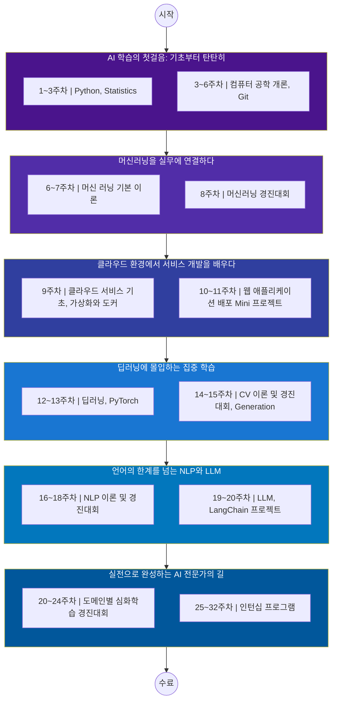

## 🤔 계획을 작성하기 전에…

AI 공부를 제대로 하고 싶다라고 생각하던 중, 찾은 부트캠프가 커널 아카데미(a.k.a 패스트 캠퍼스)에서 진행하는 인공지능(AI) 부트캠프(w. Upstage)였다. 솔직히 한국에서 AI 스타트업으로
유명한 **Upstage** 와 함께한다고 되어있어서 눈길을 끌었다.

커리큘럼을 살펴보니, 들입다 LLM(혹은 Langchain) 부터 시작하는 것이 아니라, CS 이론, 기초 대수학 및 기초 통계부터 시작해서 머신러닝과 NLP 그리고 Computer Vision, 그리고 LLM 까지
다 다루고 있었다.

거기다 경진 대회까지..! (걱정과 기대가 동시에 드는 커리큘럼이다.)

매우 긴 기간(대략 7개월)동안 진행하는 과정이 부담이 되긴했지만, 오히려 좋았다. 매우 깊게 공부할 수 있을 것 같았기 때문이다. 그 동안 겉핥기식으로 AI 를 얕게 공부했었다. 그래서 깊이 있는 공부에 대한
갈증이 있었는데, 이 부트캠프가 그 갈증을 해소해주기를 바란다.

## ❓ 어떻게 학습해야할까?

이 부트캠프는 모든 과정이 ZOOM 을 이용한 온라인으로 이뤄진다. 강의는 크게 특강, 온라인 강의, 실시간 강의 이렇게 3가지 형태로 제공된다. 각 형태마다 학습 방식과 집중해야 할 포인트가 다를 것이다.

### 부트캠프가 끝났을 때의 내 모습

한마디로 정리하자면, **_AI 라는 도구를 잘 사용할 수 있는 개발자_**라고 정리할 수 있을 것 같다.

지금은 백엔드 개발자로 살고 있지만, 사실은 소프트웨어 엔지니어에 가깝다. 즉 스스로를 개발자라고 정체화하고 있고, 개발자란 Software 를 만드는 사람이라고 생각한다. 그래서 어떤 Software(이하 서비스)
를 만든다고 하면, 도구는 문제가 되지 않아야한다고 생각한다.

그래서 내가 구현하고자 하는 어떤 아이디어가 있다면, 그 아이디어를 구현할 때, 어떤 데이터를 수집해야하는 것이며, 데이터를 어떻게 저장하는 것이 효율적이고, 어떤 AI Model 을 사용하는 것이 좋은 것인지,
AI Model 을 수정하고자 한다면 어떻게 하면 되는 것 인지 등등에 대해 조금의 감이 생긴 개발자가 되고 싶다.

### 그 모습을 만드려면?

학습 일정을 간략히 표현해보자면 아래와 같다

이러한 긴 학습 일정 속에서 효율적으로 진행하기 위해 전략이 필요하다. 과정들 중에서 내가 알고 있던 지식들과 겹치는 부분이 꽤 많다. 그 이점을 충분히 활용해야 한다고 생각하고 있다.

기존의 알던 지식은 온라인 강의를 빠르게 들으면서 알고 있는 지식과 같은지를 확인하는 것으로 마쳐서 시간을 확보하는 전략이 좋지 않을까?

그리고 OT에서든, 특강에서든, 강사분들 모두 기초를 매우 강조하셨다.

기초 통계와 같은 수학과 관련된 부분에서 시간을 충분히 들여 깊이 있게 공부하는 것이 좋을 것 같다.

이 부트캠프에서는 필수로 들어야 하는 온라인 강의가 있고, 권장으로 제공해준 온라인 강의가 있다.

낯선 부분들은, 이 권장 온라인 강의도 학습을 해서 익숙해질 수 있도록 할 생각이다.

(권장 온라인 강의도 양이 매우 많다…😜)

## 🧐 OT 를 듣고 나서…

국가 지원 부트캠프에 대해서 그 동안 안 좋은 쪽으로 편견이 있었다. 7개월이라면 길고 짧다면 짧은 기간 동안, 소화하기 힘들 정도의 공부할 양을 쏟아넣어 이도저도 안 된 사람으로 만들어진다라는 편견.

확실히 공부할 양이 많다. 그리고 시간은 짧다.

아무리 좋은 자료라도 내가 소화하지 못하면 의미가 없다라는 생각을 했다.

OT에서는 열심히 하는 것을 전제로 이야기를 해주셨다.

'열심히'라는 것이 사람마다 정의가 다를 것인데, 난 효율적으로 공부를 해서, 내가 원하는 목표에 최대한 가까이 갈 수 있도록 하는 것이 열심히 임하는 것이라고 생각한다.

어떤 파트에서 힘을 더 쏟고 어떤 파트에서 힘을 빼야 할지 전략을 짜야겠다고 느꼈고, 나만의 전략을 짰다.

아직까지는 걱정보다 기대가 많이 된다.

충분히 할 수 있겠지..?

 

