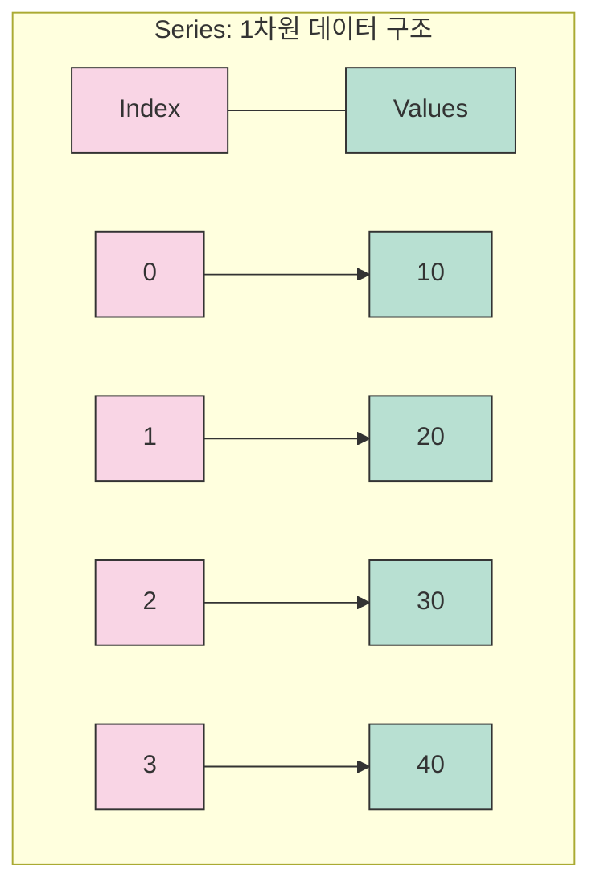

> 💡 `import pandas as pd` 
>
> 위 구문으로 [Pandas](https://pandas.pydata.org/docs/) 를 사용한다고 전제한다.

## ⚡TL;DR

> 💡 이 글은 Python 기초 지식이 있다라고 가정하고 진행한다.

- 기본 개념 - Pandas 의 핵심 데이터 구조인 Series 와 DataFrame 에 대한 이해

- 데이터 다루기 - CSV, Excel, JSON 등 다양한 형식의 데이터 불러오기와 저장하기

- 데이터 탐색 - head(), tail(), info(), describe() 등으로 데이터 살펴보기

- 데이터 선택 - 행과 열 선택하기, loc 와 iloc 활용법

- 데이터 필터링 - 조건에 맞는 데이터 추출하기, Boolean 인덱싱

- 결측값 처리 - 결측값 확인, 제거, 대체 방법

- 데이터 변형 - 타입 변환, 데이터 이동, 결합하기

- 통계 분석 - 기본 통계 함수, 그룹별 통계, 피벗 테이블

## 📓 실습 Jupyter Notebook

- [https://github.com/yuiyeong/notebooks/blob/main/data_analysis/pandas_marathon.ipynb](https://github.com/yuiyeong/notebooks/blob/main/data_analysis/pandas_marathon.ipynb)

## 🛠️ 설치 및 환경

- 가상환경은 [pyenv](https://github.com/pyenv/pyenv) 와 `pyenv` 의 [virtualenv](https://github.com/pyenv/pyenv-virtualenv) 플러그인을 사용해서 만들었다.

	- `pyenv` 설치 및 사용법은 이 [문서](https://wikidocs.net/10936#pyenv)를 참고하는 것이 좋다.

- Python: 3.12.7

- Pandas: 2.2.3

아래의 명령어를 사용해서 panas 를 설치하고 실습을 진행했다.


```shell
pip install pandas==2.2.3
```

## 📊 Pandas의 기본 데이터 구조

### 📈 Series: 1차원 데이터의 강력한 표현




- 데이터가 순차적으로 나열된 1차원 배열 형태

- 인덱스(index)와 값(value)이 일대일로 대응되는 구조

- pandas 에서 사용하는 일종의 리스트

- dict 로 만들기

	
```python
import pandas as pd
data = {'a': 1, 'b': 2, 'c': 3}
series = pd.Series(data)
```

- list 로 만들기

	
```python
import pandas as pd
data = [1, 2, 3, 4, 5]
series = pd.Series(data)
```

- 인덱스를 지정하지 않으면 자동으로 0부터 시작하는 정수 인덱스가 부여됨(그것을 RangeIndex 라고 함)

- 인덱스 지정 예: `series = pd.Series(data, index=['a', 'b', 'c', 'd', 'e'])`

- 자주 사용하는 속성 값

	
```python
import numpy as np
import pandas as pd

se = pd.Series(np.arange(10)**2, name="Number")

# 형태 확인
se.shape # (10,)

# 인데스 확인
se.index. # RangeIndex(start=0, stop=10, step=1)d

# 이름 확인
se.name # "Number"

# 데이터의 타입 확인
se.dtypes  # dtype('int64')

# 데이터 확인
se.values  # array([ 0,  1,  4,  9, 16, 25, 36, 49, 64, 81])
```

### 📑 DataFrame: 표 형태의 2차원 데이터 처리


- 행(row)과 열(column)로 구성된 2차원 배열 형태

- 여러 개의 Series가 모여 표 형태를 이룸 (각 열이 하나의 Series 객체)

- dict 로 만들기

	
```python
import pandas as pd
df = pd.DataFrame({
    "이름": ["홍길동", "김철수", "이영희"],
    "나이": [20, 25, 30],
    "성별": ["남", "남", "여"]
})
```

- list 로 만들기

	- ❗ 각 행의 데이터 길이가 동일해야 함 (길이가 다르면 에러 발생)

	
```python
import pandas as pd
df = pd.DataFrame([
    ["홍길동", 20, "남"],
    ["김철수", 25, "남"],
    ["이영희", 21, "여"],
], columns=["이름", "나이", "성별"])
```

- Series 로 만들기

	
```python
import pandas as pd
names = pd.Series(["홍길동", "김철수", "이영희"])
ages = pd.Series([20, 25, 21])
gender = pd.Series(["남", "남", "여"])
df = pd.DataFrame({
    "이름": names, "나이": ages, "성별": gender
})
```

- 자주 사용하는 속성 값

	
```python
import pandas as pd

df = pd.DataFrame({
    "이름": ["홍길동", "김철수", "이영희"],
    "나이": [20, 25, 30],
    "성별": ["남", "남", "여"]
})

# 형태 확인
df.shape # (3,3)

# 인데스 확인
df.index  # RangeIndex(start=0, stop=3, step=1)

# 컬럼 확인
df.columns  # Index(['이름', '나이', '성별'], dtype='object')

# 데이터의 타입 확인
df.dtypes
# 이름    object
# 나이     int64
# 성별    object
# dtype: object

# 데이터 확인
df.values
# array([['홍길동', 20, '남'],
#        ['김철수', 25, '남'],
#        ['이영희', 30, '여']], dtype=object)
```

## 🔄 다양한 방법으로 DataFrame 만들기

- Pandas 는 다양한 형태의 외부 파일을 읽어와서 DataFrame 을 생성하는 함수를 제공

 | **File Format** | **Reader** | **Writer** | 
 | ---- | ---- | ---- | 
 | CSV | `read_csv("data.csv", sep=",", header=0, encoding="utf-8")` | `to_csv("output.csv", index=False, encoding="utf-8")` | 
 | Excel | `read_excel("data.xlsx", sheet_name="Sheet1", usecols="A:C")` | `to_excel("output.xlsx", sheet_name="Results", index=False)` | 
 | JSON | `read_json("data.json", orient="records", lines=True)` | `to_json("output.json", orient="records", date_format="iso")` | 
 | SQL | `read_sql("SELECT * FROM table", conn, index_col="id")` | `to_sql("table_name", conn, if_exists="replace")` | 
 | HTML | `read_html("https://example.com/table.html", header=0)` | `to_html("output.html", index=False, classes="table")`  | 

### CSV 예시


```python
# 읽기
df= pd.read_csv('sales.csv',# 파일 경로
                 sep=',',# 구분자(쉼표)
                 header=0,# 첫 번째 행을 열 이름으로 사용
                 encoding='utf-8',# 파일 인코딩 형식
                 skiprows=1,# 첫 번째 행을 건너뜀(헤더 다음부터 데이터 시작)
                 na_values=['N/A', 'NULL'])# 'N/A'와 'NULL' 문자열을 NaN으로 처리# 쓰기
df.to_csv('sales_report.csv',# 저장할 파일 경로
          index=False,# 인덱스 제외하고 저장
          header=True,# 열 이름 포함
          encoding='utf-8')# 파일 인코딩 형식
```

### Excel 예시


```python
# 읽기
df= pd.read_excel('report.xlsx',# 파일 경로
                   sheet_name='2023',# '2023'이라는 이름의 시트에서 데이터 읽기
                   header=0,# 첫 번째 행을 열 이름으로 사용
                   usecols='A:E',# A열부터 E열까지만 읽기
                   skiprows=2)# 처음 2개 행을 건너뜀# 쓰기
df.to_excel('summary.xlsx',# 저장할 파일 경로
            sheet_name='Q1_Results',# 시트 이름 지정
            index=False,# 인덱스 제외하고 저장
            startrow=1,# 1행부터 데이터 쓰기 시작(0-based, 즉 두 번째 행)
            startcol=0)# 0열부터 데이터 쓰기 시작(첫 번째 열)
```

### JSON 예시


```python
# 읽기
df= pd.read_json('users.json',# 파일 경로
                  orient='records',# 레코드 형식의 JSON 구조({'field': value})
                  lines=False,# 한 줄에 하나의 JSON 객체가 아님
                  encoding='utf-8')# 파일 인코딩 형식# 쓰기
df.to_json('users_export.json',# 저장할 파일 경로
           orient='records',# 각 행을 레코드 형식으로 저장
           date_format='iso')# 날짜를 ISO 형식으로 저장(YYYY-MM-DD)
```

### SQL 예시


```python
# DB 연결 설정from sqlalchemyimport create_engine
engine= create_engine('sqlite:///mydatabase.db')# SQLite DB 연결 문자열# 읽기
df= pd.read_sql('SELECT * FROM customers WHERE region="East"',# SQL 쿼리문
                 con=engine,# 데이터베이스 연결 객체
                 index_col='customer_id')# 'customer_id' 열을 DataFrame의 인덱스로 사용# 쓰기
df.to_sql('customers_summary',# 저장할 테이블 이름
          con=engine,# 데이터베이스 연결 객체
          if_exists='replace',# 테이블이 있으면 덮어쓰기
          index=False)# 인덱스 제외하고 저장
```

### HTML 예시

- 한글이 깨져서 나올경우 encoding 을 `utf-8/cp949`로 설정하면 해결됨


```python
# 읽기
tables= pd.read_html('https://en.wikipedia.org/wiki/List_of_countries',# 웹 페이지 URL
                      match='GDP',# 'GDP'가 포함된 테이블만 가져오기
                      header=0)# 첫 번째 행을 열 이름으로 사용
df= tables[0]# 첫 번째 일치하는 테이블# 쓰기
df.to_html('countries.html',# 저장할 파일 경로
           index=False,# 인덱스 제외하고 저장
           classes='table table-striped',# CSS 클래스 적용(부트스트랩 스타일)
           escape=False)# HTML 태그를 이스케이프하지 않음(HTML 태그 허용)
```

## 🔍 데이터 탐색하기

### head(행의 갯수)

- 데이터의 상단 (행의 갯수)개 행 출력

- 행의 갯수를 적지 않으면, default 로 5개 행을 보여줌


```python
# 예시 DataFrame 생성
import pandas as pd
import numpy as np

# 샘플 데이터 생성
data = {
    "이름": ["김철수", "이영희", "박민수", "정지영", "최현우", "한미나", "강준호"],
    "나이": [25, 30, 28, 32, 45, 23, 37],
    "성별": ["남", "여", "남", "여", "남", "여", "남"],
    "급여": [3500000, 4200000, 3800000, 5100000, 6500000, 3200000, 4800000]
}

df = pd.DataFrame(data)

# head() 함수 사용 - 기본값(5개 행)
print("# head() 기본 사용:")
print(df.head())

# head(3) 함수 사용 - 상위 3개 행만 보기
print("\n# head(3) 사용:")
print(df.head(3))

# 결과:
# head() 기본 사용:
#     이름  나이 성별      급여
# 0  김철수  25  남  3500000
# 1  이영희  30  여  4200000
# 2  박민수  28  남  3800000
# 3  정지영  32  여  5100000
# 4  최현우  45  남  6500000

# head(3) 사용:
#     이름  나이 성별      급여
# 0  김철수  25  남  3500000
# 1  이영희  30  여  4200000
# 2  박민수  28  남  3800000
```

### tail(행의 갯수)

- 데이터의 하단 (행의 갯수)개 행 출력

- 행의 갯수를 적지 않으면, default 로 5개 행을 보여줌


```python
# 위에서 만든 DataFrame 사용

# tail() 함수 사용 - 기본값(5개 행)
print("# tail() 기본 사용:")
print(df.tail())

# tail(2) 함수 사용 - 하위 2개 행만 보기
print("\n# tail(2) 사용:")
print(df.tail(2))

# 결과:
# tail() 기본 사용:
#     이름  나이 성별      급여
# 2  박민수  28  남  3800000
# 3  정지영  32  여  5100000
# 4  최현우  45  남  6500000
# 5  한미나  23  여  3200000
# 6  강준호  37  남  4800000

# tail(2) 사용:
#     이름  나이 성별      급여
# 5  한미나  23  여  3200000
# 6  강준호  37  남  4800000
```

### info()

- 전체 행의 갯수, 컬럼 정보, 결측치, 데이터 타입과 같이 데이터에 대한 전반적인 정보 제공


```python
# 결측치가 있는 DataFrame 생성
data_with_na = {
    "이름": ["김철수", "이영희", "박민수", "정지영", None],
    "나이": [25, 30, None, 32, 45],
    "성별": ["남", "여", "남", None, "남"],
    "급여": [3500000, None, 3800000, 5100000, 6500000]
}

df_with_na = pd.DataFrame(data_with_na)

# info() 함수 사용
print("# info() 사용:")
df_with_na.info()

# 결과:
# info() 사용:
# <class 'pandas.core.frame.DataFrame'>
# RangeIndex: 5 entries, 0 to 4
# Data columns (total 4 columns):
#  #   Column  Non-Null Count  Dtype
# ---  ------  --------------  -----
#  0   이름      4 non-null      object
#  1   나이      4 non-null      float64
#  2   성별      4 non-null      object
#  3   급여      4 non-null      float64
# dtypes: float64(2), object(2)
# memory usage: 288.0+ bytes
```

### describe()

- 컬럼별 값의 갯수, 평균, 표준편차, 최솟값, 최댓값, 사분위수를 보여줍니다.


```python
# 위에서 만든 DataFrame 사용

# describe() 함수 사용 - 수치형 데이터에 대한 통계 요약
print("# describe() 기본 사용 (수치형 데이터만):")
print(df.describe())

# describe(include='all') - 모든 컬럼에 대한 통계 요약
print("\n# describe(include='all') 사용:")
print(df.describe(include='all'))

# 결과:
# describe() 기본 사용 (수치형 데이터만):
#               나이          급여
# count   7.000000     7.000000
# mean   31.428571  4442857.142857
# std     7.479431  1184373.721177
# min    23.000000  3200000.000000
# 25%    26.500000  3650000.000000
# 50%    30.000000  4200000.000000
# 75%    34.500000  4950000.000000
# max    45.000000  6500000.000000

# describe(include='all') 사용:
#          이름         나이   성별          급여
# count     7  7.000000    7     7.000000
# unique    7       NaN    2          NaN
# top     김철수       NaN   남          NaN
# freq      1       NaN    4          NaN
# mean    NaN  31.428571  NaN  4442857.142857
# std     NaN   7.479431  NaN  1184373.721177
# min     NaN  23.000000  NaN  3200000.000000
# 25%     NaN  26.500000  NaN  3650000.000000
# 50%     NaN  30.000000  NaN  4200000.000000
# 75%     NaN  34.500000  NaN  4950000.000000
# max     NaN  45.000000  NaN  6500000.000000
```

## 📋 행과 열 다루기

### column(열) 선택하기

- column 을 1개 선택 → Series 객체 반환

	- 대괄호(`[]`) 안에 column 이름을 따옴표(`""`)와 함께 입력(`데이터프레임[컬럼명]`)

	- 도트(`.`) 다음에 column 이름을 입력(`데이터프레임.컬럼명`)


```python
# DataFrame 생성
import pandas as pd
df = pd.DataFrame({
    "이름": ["홍길동", "김철수", "이영희"],
    "나이": [20, 25, 30],
    "성별": ["남", "남", "여"]
})

# 방법 1: 대괄호 사용
age_series = df["나이"]
print("대괄호 사용:")
print(age_series)
# 대괄호 사용:
# 0    20
# 1    25
# 2    30
# Name: 나이, dtype: int64

# 방법 2: 도트 표기법 사용
age_series2 = df.나이
print("\n도트 표기법 사용:")
print(age_series2)
# 도트 표기법 사용:
# 0    20
# 1    25
# 2    30
# Name: 나이, dtype: int64

```

- column 여러 개 선택 → DataFrame 객체 반환

	- 2중 대괄호(`[[]]`) 안에 column 이름을 입력(`데이터프레임[[컬럼명1, 컬럼명2, ...]]`)

	- 만약, column 1개를  DataFrame 객체로 추출하려면 2중 대괄호안에 그 column 이름을 str 로 입력


```python
# 여러 열 선택
name_gender_df = df[["이름", "성별"]]
print("여러 열 선택:")
print(name_gender_df)
# 여러 열 선택:
#     이름 성별
# 0  홍길동  남
# 1  김철수  남
# 2  이영희  여

# 열 1개를 데이터프레임으로 선택
age_df = df[["나이"]]
print("\n열 1개를 데이터프레임으로 선택:")
print(age_df)
# 열 1개를 데이터프레임으로 선택:
#    나이
# 0  20
# 1  25
# 2  30

```

### row(행) 선택하기

- 한 개: `데이터프레임명[인덱스:인덱스+1]`

- 여러 개: `데이터프레임명[시작인덱스:끝인덱스+1]`


```python
# 행 한 개 선택
row_one = df[1:2]
print("행 한 개 선택:")
print(row_one)
# 행 한 개 선택:
#     이름  나이 성별
# 1  김철수  25  남

# 행 여러 개 선택
multiple_rows = df[0:2]
print("\n행 여러 개 선택:")
print(multiple_rows)
# 행 여러 개 선택:
#     이름  나이 성별
# 0  홍길동  20  남
# 1  김철수  25  남

```

### loc와 iloc 활용하기

- loc: 레이블을 사용하여 조회(이름을 사용해서 조회)

	- `데이터프레임명.loc[행조건,열조건]`

	- 열만 조회할 때는 행조건에 `:`를 입력

- iloc: 위치 인덱스를 사용하여 조회

	- `데이터프레임명.iloc[행인덱스조건,열인덱스조건]`


```python
# loc 사용
print("loc를 사용한 특정 행과 열 선택:")
print(df.loc[1, "이름"])  # 특정 행과 열 선택
# loc를 사용한 특정 행과 열 선택:
# 김철수

# 모든 행의 특정 열 선택
print("\nloc를 사용한 모든 행의 특정 열 선택:")
print(df.loc[:, "나이"])
# loc를 사용한 모든 행의 특정 열 선택:
# 0    20
# 1    25
# 2    30
# Name: 나이, dtype: int64

# iloc 사용
print("\niloc를 사용한 특정 행과 열 선택:")
print(df.iloc[1, 0])  # 1행, 0열 선택
# iloc를 사용한 특정 행과 열 선택:
# 김철수

# 특정 범위의 행과 열 선택
print("\niloc를 사용한 특정 범위의 행과 열 선택:")
print(df.iloc[0:2, 1:3])
# iloc를 사용한 특정 범위의 행과 열 선택:
#    나이 성별
# 0  20  남
# 1  25  남
```

## 🧪 데이터 필터링과 조건부 선택

### 데이터 정렬하기

- `데이터프레임명.sort_values(정렬기준컬럼)`

- 내림차순으로 정렬: `ascending=False` 조건 사용


```python
# 나이 기준 오름차순 정렬
sorted_df = df.sort_values("나이")
print("나이 기준 오름차순 정렬:")
print(sorted_df)
# 나이 기준 오름차순 정렬:
#     이름  나이 성별
# 0  홍길동  20  남
# 1  김철수  25  남
# 2  이영희  30  여

# 나이 기준 내림차순 정렬
sorted_df_desc = df.sort_values("나이", ascending=False)
print("\n나이 기준 내림차순 정렬:")
print(sorted_df_desc)
# 나이 기준 내림차순 정렬:
#     이름  나이 성별
# 2  이영희  30  여
# 1  김철수  25  남
# 0  홍길동  20  남

```

### 조건에 맞는 데이터 필터링하기

- `데이터프레임명[조건식]`

- `데이터프레임명.query('조건식')`


```python
# 나이가 25세 이상인 데이터 추출
filtered_df = df[df["나이"] >= 25]
print("나이가 25세 이상인 데이터:")
print(filtered_df)
# 나이가 25세 이상인 데이터:
#     이름  나이 성별
# 1  김철수  25  남
# 2  이영희  30  여

# query 함수 사용
query_df = df.query("나이 >= 25")
print("\nquery로 나이가 25세 이상인 데이터:")
print(query_df)
# query로 나이가 25세 이상인 데이터:
#     이름  나이 성별
# 1  김철수  25  남
# 2  이영희  30  여

```

### Boolean Indexing 과 isin 활용하기

- 불리언(Boolean) 인덱싱: bool 데이터 타입을 가진 Series 를 사용해서 인덱싱하는 기법

	- ❗ 이 Boolean Series 의 인덱스는 인덱싱하려는 DataFrame 의 인덱스와 반드시 일치해야 함

- `.isin()`: 각각의 요소가 DataFrame 또는 Series 에 존재하는지 파악하여 Boolean Series 반환

- `불리언 인덱싱 + .isin()`: 데이터의 특정 범위만 추출


```python
# 불리언 인덱싱 활용
male_df = df[df["성별"] == "남"]
print("성별이 남자인 데이터:")
print(male_df)
# 성별이 남자인 데이터:
#     이름  나이 성별
# 0  홍길동  20  남
# 1  김철수  25  남

# isin 활용
names_to_find = ["홍길동", "이영희"]
selected_names_df = df[df["이름"].isin(names_to_find)]
print("\n특정 이름 목록에 있는 데이터:")
print(selected_names_df)
# 특정 이름 목록에 있는 데이터:
#     이름  나이 성별
# 0  홍길동  20  남
# 2  이영희  30  여
```

## ⚠️ 결측값 처리하기

### 결측값 확인하기

- `isna()`: 결측 값은 True 반환, 그 외에는 False 반환

- `notna()`: 결측 값은 False 반환, 그 외에는 True 반환


```python
# 결측치가 있는 DataFrame 생성
data_with_na = {
    "이름": ["김철수", "이영희", "박민수", "정지영", None],
    "나이": [25, 30, None, 32, 45],
    "성별": ["남", "여", "남", None, "남"],
    "급여": [3500000, None, 3800000, 5100000, 6500000]
}

df_with_na = pd.DataFrame(data_with_na)

# 결측값 확인
print("결측값 확인(isna):")
print(df_with_na.isna())
# 결측값 확인(isna):
#      이름     나이     성별     급여
# 0  False  False  False  False
# 1  False  False  False   True
# 2  False   True  False  False
# 3  False  False   True  False
# 4   True  False  False  False

# 결측값 합계 확인
print("\n결측값 합계:")
print(df_with_na.isna().sum())
# 결측값 합계:
# 이름    1
# 나이    1
# 성별    1
# 급여    1
# dtype: int64

```

### 결측값 제거하기

- `데이터명.dropna(axis=0, how='any', subset=None)`

	- axis: {0: index / 1: columns}

	- how: {'any': 존재하면 제거 / 'all': 모두 결측치면 제거}

	- subset: 행/열의 이름을 지정


```python
# 결측값이 있는 행 제거
df_drop_rows = df_with_na.dropna()
print("결측값이 있는 행 제거:")
print(df_drop_rows)
# 결측값이 있는 행 제거:
#     이름  나이 성별      급여
# 0  김철수  25  남  3500000

# 결측값이 있는 열 제거
df_drop_columns = df_with_na.dropna(axis=1)
print("\n결측값이 있는 열 제거:")
print(df_drop_columns)
# 결측값이 있는 열 제거:
# Empty DataFrame
# Columns: []
# Index: [0, 1, 2, 3, 4]

# 특정 열에서만 결측값 있는 행 제거
df_drop_subset = df_with_na.dropna(subset=["이름", "성별"])
print("\n이름과 성별에 결측값이 있는 행만 제거:")
print(df_drop_subset)
# 이름과 성별에 결측값이 있는 행만 제거:
#     이름    나이 성별      급여
# 0  김철수  25.0  남  3500000.0
# 1  이영희  30.0  여        NaN
# 2  박민수   NaN  남  3800000.0

```

### 결측값 대치하기

- 데이터 전체의 결측값을 특정 값으로 변경: `데이터명.fillna(대치할값)`

- 특정 컬럼의 결측값을 특정 값으로 변경: `데이터명[컬럼명].fillna(대치할값)`

- 결측값을 바로 위의 값과 동일하게 변경: `데이터명.fillna(method='ffill')` 

	- 위 함수가 곧 deprecated 될 것이기 때문에, `ffill()` 함수를 권장

- 결측값을 바로 아래의 값과 동일하게 변경: `데이터명.fillna(method='bfill')`

	- 위 함수가 곧 deprecated 될 것이기 때문에, `bfill()` 함수를 권장


```python
# 모든 결측값 0으로 대치
df_fill_all = df_with_na.fillna(0)
print("모든 결측값 0으로 대치:")
print(df_fill_all)
# 모든 결측값 0으로 대치:
#     이름    나이  성별      급여
# 0  김철수  25.0  남  3500000.0
# 1  이영희  30.0  여        0.0
# 2  박민수   0.0  남  3800000.0
# 3  정지영  32.0  0  5100000.0
# 4      0  45.0  남  6500000.0

# 나이 컬럼의 결측값만 평균값으로 대치
age_mean = df_with_na["나이"].mean()
df_with_na_copy = df_with_na.copy()
df_with_na_copy["나이"] = df_with_na_copy["나이"].fillna(age_mean)
print("\n나이 컬럼의 결측값만 평균값으로 대치:")
print(df_with_na_copy)
# 나이 컬럼의 결측값만 평균값으로 대치:
#     이름        나이    성별      급여
# 0  김철수  25.000000    남  3500000.0
# 1  이영희  30.000000    여        NaN
# 2  박민수  33.000000    남  3800000.0
# 3  정지영  32.000000  None  5100000.0
# 4   None  45.000000    남  6500000.0

# 앞의 값으로 결측값 채우기
df_ffill = df_with_na.fillna(method="ffill")
print("\n앞의 값으로 결측값 채우기:")
print(df_ffill)
# 앞의 값으로 결측값 채우기:
#     이름    나이    성별      급여
# 0  김철수  25.0    남  3500000.0
# 1  이영희  30.0    여  3500000.0
# 2  박민수  30.0    남  3800000.0
# 3  정지영  32.0    남  5100000.0
# 4  정지영  45.0    남  6500000.0

```

## 🔀 타입 변환

### 타입 확인하기

- `.dtypes`: 열의 타입을 시리즈로 반환

- 특정 타입을 가진 컬럼만 추출: `데이터명.select_dtypes(타입)`


```python
# 타입 확인
print("각 열의 데이터 타입:")
print(df.dtypes)
# 각 열의 데이터 타입:
# 이름    object
# 나이     int64
# 성별    object
# dtype: object

# 특정 타입 컬럼만 추출
numeric_columns = df.select_dtypes(include="number")
print("\n숫자형 컬럼만 추출:")
print(numeric_columns)
# 숫자형 컬럼만 추출:
#    나이
# 0  20
# 1  25
# 2  30

```

### 타입 변환하기

- `데이터명[컬럼명].astype(타입)`


```python
# 나이를 문자열로 변환
df["나이_문자열"] = df["나이"].astype(str)
print("나이를 문자열로 변환:")
print(df[["나이", "나이_문자열"]])
# 나이를 문자열로 변환:
#    나이 나이_문자열
# 0  20      20
# 1  25      25
# 2  30      30

print("\n변환 후 타입 확인:")
print(df["나이_문자열"].dtype)
# 변환 후 타입 확인:
# dtype('O')
```

## 📊 DataFrame 과 데이터 통계

### 기본 통계 함수

- `.mean()`: 평균값

- `.median()`: 중앙값

- `.describe()`: 다양한 통계량 요약

- `.min()`: 최솟값

- `.max()`: 최댓값

- `.std()`: 표준편차

- `.var()`: 분산

- `.quantile()`: 사분위수

- `.corr()`: 상관계수


```python
# 기본 통계 함수 예시 데이터
stats_df = pd.DataFrame({
    "점수": [85, 92, 78, 90, 87],
    "나이": [22, 20, 25, 23, 21],
    "경력": [1, 0, 3, 2, 1]
})

# 평균값
print("평균값:")
print(stats_df.mean())
# 평균값:
# 점수    86.4
# 나이    22.2
# 경력     1.4
# dtype: float64

# 중앙값
print("\n중앙값:")
print(stats_df.median())
# 중앙값:
# 점수    87.0
# 나이    22.0
# 경력     1.0
# dtype: float64

# 기술통계량 요약
print("\n기술통계량 요약:")
print(stats_df.describe())
# 기술통계량 요약:
#             점수        나이        경력
# count   5.00000   5.00000   5.00000
# mean   86.40000  22.20000   1.40000
# std     5.41295   1.92354   1.14018
# min    78.00000  20.00000   0.00000
# 25%    85.00000  21.00000   1.00000
# 50%    87.00000  22.00000   1.00000
# 75%    90.00000  23.00000   2.00000
# max    92.00000  25.00000   3.00000

# 최댓값과 최솟값
print("\n최댓값:")
print(stats_df.max())
# 최댓값:
# 점수    92
# 나이    25
# 경력     3
# dtype: int64

print("\n최솟값:")
print(stats_df.min())
# 최솟값:
# 점수    78
# 나이    20
# 경력     0
# dtype: int64

# 표준편차
print("\n표준편차:")
print(stats_df.std())
# 표준편차:
# 점수    5.412947
# 나이    1.923538
# 경력    1.140175
# dtype: float64

# 특정 분위수
print("\n75% 분위수:")
print(stats_df.quantile(0.75))
# 75% 분위수:
# 점수    90.0
# 나이    23.0
# 경력     2.0
# dtype: float64

# 상관계수
print("\n상관계수:")
print(stats_df.corr())
# 상관계수:
#           점수        나이        경력
# 점수  1.000000 -0.747018 -0.677525
# 나이 -0.747018  1.000000  0.901388
# 경력 -0.677525  0.901388  1.000000

```

### 그룹별 통계

- `.groupby()`: 그룹별 집계하여 통계 계산

- `.groupby()` 한 뒤에 통계관련 함수를 적용할 수 있다.


```python
# 그룹별 통계 예시 데이터
group_df = pd.DataFrame({
    "부서": ["영업", "개발", "영업", "마케팅", "개발", "영업", "마케팅"],
    "성별": ["남", "여", "여", "남", "남", "남", "여"],
    "급여": [350, 480, 320, 400, 520, 380, 450],
    "보너스": [50, 70, 40, 60, 80, 60, 70]
})

# 부서별 평균 급여
dept_salary_mean = group_df.groupby("부서")["급여"].mean()
print("부서별 평균 급여:")
print(dept_salary_mean)
# 부서별 평균 급여:
# 부서
# 개발      500.0
# 마케팅     425.0
# 영업      350.0
# Name: 급여, dtype: float64

# 부서 및 성별로 그룹화하여 여러 통계량 계산
multi_group = group_df.groupby(["부서", "성별"]).agg({
    "급여": ["mean", "min", "max"],
    "보너스": ["mean", "sum"]
})
print("\n부서 및 성별 그룹별 통계:")
print(multi_group)
# 부서 및 성별 그룹별 통계:
#             급여                보너스
#            mean  min  max      mean sum
# 부서  성별
# 개발  남    520  520  520      80.0  80
#     여    480  480  480      70.0  70
# 마케팅 남    400  400  400      60.0  60
#     여    450  450  450      70.0  70
# 영업  남    365  350  380      55.0 110
#     여    320  320  320      40.0  40

# 그룹화 후 필터링 (급여 평균이 400 이상인 부서만)
high_salary_dept = group_df.groupby("부서").filter(lambda x: x["급여"].mean() >= 400)
print("\n평균 급여가 400 이상인 부서 데이터:")
print(high_salary_dept)
# 평균 급여가 400 이상인 부서 데이터:
#    부서 성별  급여 보너스
# 1  개발  여  480   70
# 3  마케팅  남  400   60
# 4  개발  남  520   80
# 6  마케팅  여  450   70

```

### 값 개수 집계

- `.value_counts()`를 이용하여, column 별 개수 집계


```python
# 값 개수 집계 예시 데이터
count_df = pd.DataFrame({
    "과일": ["사과", "바나나", "사과", "딸기", "바나나", "사과", "딸기", "사과"],
    "크기": ["중", "대", "소", "중", "중", "대", "소", "중"]
})

# 과일 종류별 개수 집계
fruit_counts = count_df["과일"].value_counts()
print("과일 종류별 개수:")
print(fruit_counts)
# 과일 종류별 개수:
# 사과      4
# 바나나     2
# 딸기      2
# Name: count, dtype: int64

# 크기별 개수 집계 (비율 포함)
size_counts = count_df["크기"].value_counts(normalize=True)
print("\n크기별 개수 (비율):")
print(size_counts)
# 크기별 개수 (비율):
# 중    0.5
# 소    0.25
# 대    0.25
# Name: 크기, dtype: float64

# 두 컬럼의 조합 개수 집계
combination_counts = count_df.value_counts()
print("\n과일과 크기 조합 개수:")
print(combination_counts)
# 과일과 크기 조합 개수:
# 과일   크기
# 사과   중     3
# 딸기   소     1
# 사과   대     1
# 사과   소     1
# 딸기   중     1
# 바나나  대     1
# 바나나  중     1
# dtype: int64

# 결측치 포함하여 개수 집계
count_df_with_na = count_df.copy()
count_df_with_na.loc[0, "크기"] = None
na_counts = count_df_with_na["크기"].value_counts(dropna=False)
print("\n결측치 포함 크기별 개수:")
print(na_counts)
# 결측치 포함 크기별 개수:
# 중       3
# 소       2
# 대       2
# NaN     1
# Name: 크기, dtype: int64
```

## 🧩 고급 데이터 조작 기법

### agg 함수 활용하기

- `.agg()`: 여러 함수를 동시에 적용하여 집계

- 열별로 다른 함수 적용 가능

- 사용자 정의 함수와 내장 함수 혼합 사용 가능


```python
# agg 함수 예시 데이터
agg_df = pd.DataFrame({
    "이름": ["김철수", "이영희", "박지훈", "정미나", "최재윤"],
    "나이": [25, 30, 28, 22, 35],
    "급여": [2800000, 3500000, 3200000, 2500000, 4000000],
    "근무일수": [22, 20, 21, 19, 23]
})

# 단일 컬럼에 여러 함수 적용
print("급여 통계:")
print(agg_df["급여"].agg(["min", "max", "mean", "median"]))
# 급여 통계:
# min       2500000
# max       4000000
# mean      3200000
# median    3200000
# Name: 급여, dtype: int64

# 여러 컬럼에 다양한 함수 적용
aggregated = agg_df.agg({
    "나이": ["min", "max", "mean"],
    "급여": ["mean", "std"],
    "근무일수": ["sum", "mean"]
})
print("\n여러 컬럼에 다양한 함수 적용:")
print(aggregated)
# 여러 컬럼에 다양한 함수 적용:
#              나이          급여      근무일수
#             min max      mean       std  sum mean
# 0           22  35  3200000.0  568330.95  105   21

# 사용자 정의 함수와 내장 함수 혼합
def range_diff(x):
    return x.max() - x.min()

def top_n_mean(x, n=2):
    return x.nlargest(n).mean()

mixed_agg = agg_df.agg({
    "나이": ["mean", range_diff],
    "급여": ["mean", lambda x: top_n_mean(x, 2)]
})
print("\n사용자 정의 함수 포함 집계:")
print(mixed_agg)
# 사용자 정의 함수 포함 집계:
#              나이         급여
#            mean range_diff      mean <lambda>
# 0           28         13  3200000  3750000

```

### datetime 다루기

- 문자형을 날짜형으로 변경: `pd.to_datetime(컬럼, format='날짜 형식')`


```python
# 날짜 데이터 예시
date_df = pd.DataFrame({
    "날짜": ["2023-01-15", "2023-02-20", "2023-03-25"]
})

# 문자열을 날짜로 변환
date_df["날짜_datetime"] = pd.to_datetime(date_df["날짜"])
print("문자열을 날짜로 변환:")
print(date_df)
# 문자열을 날짜로 변환:
#          날짜   날짜_datetime
# 0  2023-01-15   2023-01-15
# 1  2023-02-20   2023-02-20
# 2  2023-03-25   2023-03-25

# 날짜 형식 지정하여 변환
custom_dates = pd.DataFrame({
    "날짜": ["15/01/2023", "20/02/2023", "25/03/2023"]
})
custom_dates["날짜_datetime"] = pd.to_datetime(custom_dates["날짜"], format="%d/%m/%Y")
print("\\n특정 형식의 문자열을 날짜로 변환:")
print(custom_dates)
# 특정 형식의 문자열을 날짜로 변환:
#           날짜 날짜_datetime
# 0  15/01/2023   2023-01-15
# 1  20/02/2023   2023-02-20
# 2  25/03/2023   2023-03-25


```

- 날짜를 원하는 형식으로 변경: `데이터컬럼.dt.strftime(날짜형식)`

- dt 연산자 활용: year, month, day, dayofweek, day_name()


```python
# 날짜 형식 변경
date_df["년월일"] = date_df["날짜_datetime"].dt.strftime("%Y년 %m월 %d일")
print("날짜 형식 변경:")
print(date_df)
# 날짜 형식 변경:
#          날짜 날짜_datetime          년월일
# 0  2023-01-15   2023-01-15  2023년 01월 15일
# 1  2023-02-20   2023-02-20  2023년 02월 20일
# 2  2023-03-25   2023-03-25  2023년 03월 25일

# dt 연산자 활용
date_df["연도"] = date_df["날짜_datetime"].dt.year
date_df["월"] = date_df["날짜_datetime"].dt.month
date_df["요일"] = date_df["날짜_datetime"].dt.day_name()
print("\\ndt 연산자 활용:")
print(date_df[["날짜_datetime", "연도", "월", "요일"]])
# dt 연산자 활용:
#   날짜_datetime  연도  월      요일
# 0   2023-01-15  2023  1  Sunday
# 1   2023-02-20  2023  2  Monday
# 2   2023-03-25  2023  3  Saturday


```

- 날짜 계산

	- day 연산: `pd.Timedelta(days=숫자)`

	- month 연산: `pd.DateOffset(months=숫자)`

	- year 연산: `pd.DateOffset(years=숫자)`


```python
# 날짜 계산
date_df["7일_후"] = date_df["날짜_datetime"] + pd.Timedelta(days=7)
date_df["1개월_후"] = date_df["날짜_datetime"] + pd.DateOffset(months=1)
date_df["1년_전"] = date_df["날짜_datetime"] - pd.DateOffset(years=1)
print("날짜 계산:")
print(date_df[["날짜_datetime", "7일_후", "1개월_후", "1년_전"]])
# 날짜 계산:
#   날짜_datetime      7일_후    1개월_후      1년_전
# 0   2023-01-15 2023-01-22 2023-02-15 2022-01-15
# 1   2023-02-20 2023-02-27 2023-03-20 2022-02-20
# 2   2023-03-25 2023-04-01 2023-04-25 2022-03-25


```

### 문자열 다루기

- `.str.contains(문자열)`: 문자열을 포함하고 있는지 유무

- `.str.replace(기존문자열, 대치문자열)`: 문자열 대치

- `.str.split(문자열, expand=True/False, n=개수)`: 특정 문자열을 기준으로 쪼개기

- `.str.lower()`: 소문자로 바꾸기

- `.str.upper()`: 대문자로 바꾸기


```python
# 문자열 예시 데이터
text_df = pd.DataFrame({
    "텍스트": ["Python 3.9", "Data Analysis", "pandas library", "PYTHON EXAMPLE"]
})

# 특정 문자열 포함 여부
contains_python = text_df["텍스트"].str.contains("Python")
print("'Python' 포함 여부:")
print(contains_python)
# 'Python' 포함 여부:
# 0     True
# 1    False
# 2    False
# 3    False
# Name: 텍스트, dtype: bool

# 문자열 대치
replaced_text = text_df["텍스트"].str.replace("Python", "Python 3.12")
print("\\n문자열 대치:")
print(replaced_text)
# 문자열 대치:
# 0        Python 3.12 3.9
# 1         Data Analysis
# 2         pandas library
# 3         PYTHON EXAMPLE
# Name: 텍스트, dtype: object

# 문자열 분할
split_text = text_df["텍스트"].str.split(" ", expand=True)
print("\\n문자열 분할:")
print(split_text)
# 문자열 분할:
#         0         1        2
# 0  Python       3.9     None
# 1    Data  Analysis     None
# 2  pandas   library     None
# 3  PYTHON   EXAMPLE     None

# 대소문자 변환
lower_text = text_df["텍스트"].str.lower()
upper_text = text_df["텍스트"].str.upper()
print("\\n소문자 변환:")
print(lower_text)
# 소문자 변환:
# 0        python 3.9
# 1     data analysis
# 2     pandas library
# 3     python example
# Name: 텍스트, dtype: object

print("\\n대문자 변환:")
print(upper_text)
# 대문자 변환:
# 0        PYTHON 3.9
# 1     DATA ANALYSIS
# 2     PANDAS LIBRARY
# 3     PYTHON EXAMPLE
# Name: 텍스트, dtype: object


```

### 데이터 이동시키기 - rolling

- `.rolling(window=윈도우크기)`: 지정된 윈도우 크기만큼 데이터를 묶어 연산

- 주로 시계열 데이터의 이동평균, 누적합 등을 계산할 때 사용

- 주요 옵션

	- `window`: 윈도우 크기 지정

	- `min_periods`: 연산에 필요한 최소 데이터 수

	- `center`: 결과를 윈도우 중앙에 위치시킬지 여부


```python
# 롤링 함수 예시 데이터
import numpy as np
rolling_df = pd.DataFrame({
    "날짜": pd.date_range(start="2023-01-01", periods=10, freq="D"),
    "매출": [120, 135, 140, 155, 165, 150, 145, 160, 175, 190]
})
rolling_df.set_index("날짜", inplace=True)

# 3일 이동평균
rolling_mean = rolling_df["매출"].rolling(window=3).mean()
print("3일 이동평균:")
print(rolling_mean)
# 3일 이동평균:
# 날짜
# 2023-01-01         NaN
# 2023-01-02         NaN
# 2023-01-03    131.6667
# 2023-01-04    143.3333
# 2023-01-05    153.3333
# 2023-01-06    156.6667
# 2023-01-07    153.3333
# 2023-01-08    151.6667
# 2023-01-09    160.0000
# 2023-01-10    175.0000
# Name: 매출, dtype: float64

# 여러 통계량 계산
rolling_stats = rolling_df["매출"].rolling(window=4).agg(["min", "max", "mean", "std"])
print("\n4일 롤링 통계량:")
print(rolling_stats)
# 4일 롤링 통계량:
#                  min   max        mean        std
# 날짜
# 2023-01-01       NaN   NaN         NaN        NaN
# 2023-01-02       NaN   NaN         NaN        NaN
# 2023-01-03       NaN   NaN         NaN        NaN
# 2023-01-04     120.0  155.0  137.500000  14.434877
# 2023-01-05     135.0  165.0  148.750000  13.150080
# 2023-01-06     140.0  165.0  152.500000  10.308300
# 2023-01-07     145.0  165.0  153.750000   8.539126
# 2023-01-08     145.0  165.0  155.000000   8.164966
# 2023-01-09     145.0  175.0  157.500000  13.227954
# 2023-01-10     145.0  190.0  167.500000  19.364917

# 중앙에 값 위치시키기
centered_rolling = rolling_df["매출"].rolling(window=3, center=True).mean()
print("\n중앙 위치 3일 이동평균:")
print(centered_rolling)
# 중앙 위치 3일 이동평균:
# 날짜
# 2023-01-01         NaN
# 2023-01-02    131.6667
# 2023-01-03    143.3333
# 2023-01-04    153.3333
# 2023-01-05    156.6667
# 2023-01-06    153.3333
# 2023-01-07    151.6667
# 2023-01-08    160.0000
# 2023-01-09    175.0000
# 2023-01-10         NaN
# Name: 매출, dtype: float64
```

### 데이터 이동시키기 - shift

- `.shift(periods=n)`: 데이터를 n만큼 이동시킴 (양수: 아래로, 음수: 위로)

- 주로 시계열 데이터에서 전일 대비 증감, 성장률 등을 계산할 때 활용

- 날짜 또는 시간 인덱스가 있는 경우 `freq` 매개변수로 시간 단위 지정 가능


```python
# 시프트 함수 예시 데이터
shift_df = pd.DataFrame({
    "날짜": pd.date_range(start="2023-01-01", periods=5, freq="D"),
    "매출": [100, 120, 115, 130, 145]
})
shift_df.set_index("날짜", inplace=True)

# 데이터 한 행 아래로 이동
print("한 행 아래로 이동:")
print(shift_df["매출"].shift(1))
# 한 행 아래로 이동:
# 날짜
# 2023-01-01      NaN
# 2023-01-02    100.0
# 2023-01-03    120.0
# 2023-01-04    115.0
# 2023-01-05    130.0
# Name: 매출, dtype: float64

# 데이터 한 행 위로 이동
print("\n한 행 위로 이동:")
print(shift_df["매출"].shift(-1))
# 한 행 위로 이동:
# 날짜
# 2023-01-01    120.0
# 2023-01-02    115.0
# 2023-01-03    130.0
# 2023-01-04    145.0
# 2023-01-05      NaN
# Name: 매출, dtype: float64

# 전일 대비 증감 계산
shift_df["전일대비증감"] = shift_df["매출"] - shift_df["매출"].shift(1)
print("\n전일 대비 증감:")
print(shift_df)
# 전일 대비 증감:
#             매출  전일대비증감
# 날짜
# 2023-01-01  100        NaN
# 2023-01-02  120       20.0
# 2023-01-03  115       -5.0
# 2023-01-04  130       15.0
# 2023-01-05  145       15.0

# 성장률 계산
shift_df["성장률"] = (shift_df["매출"] / shift_df["매출"].shift(1) - 1) * 100
print("\n성장률(%):")
print(shift_df[["매출", "성장률"]])
# 성장률(%):
#             매출        성장률
# 날짜
# 2023-01-01  100         NaN
# 2023-01-02  120  20.000000
# 2023-01-03  115  -4.166667
# 2023-01-04  130  13.043478
# 2023-01-05  145  11.538462
```

### 데이터 결합하기 - concat

- `pd.concat([데이터1, 데이터2, ...], axis=0/1)`: 여러 데이터프레임을 행/열 방향으로 연결

- 주요 옵션:

	- `axis`: 연결 방향 (0: 행 방향, 1: 열 방향)

	- `join`: 조인 방식 ('inner', 'outer')

	- `ignore_index`: 기존 인덱스 무시 여부


```python
# concat 함수 예시 데이터
df1 = pd.DataFrame({
    "A": [1, 2, 3],
    "B": [10, 20, 30]
})

df2 = pd.DataFrame({
    "A": [4, 5, 6],
    "B": [40, 50, 60]
})

df3 = pd.DataFrame({
    "C": [100, 200, 300],
    "D": [1000, 2000, 3000]
})

# 행 방향 연결 (위아래로)
vertical_concat = pd.concat([df1, df2], axis=0)
print("행 방향으로 연결:")
print(vertical_concat)
# 행 방향으로 연결:
#    A   B
# 0  1  10
# 1  2  20
# 2  3  30
# 0  4  40
# 1  5  50
# 2  6  60

# 인덱스 재설정
vertical_concat_reset = pd.concat([df1, df2], axis=0, ignore_index=True)
print("\n인덱스 재설정 후 행 방향 연결:")
print(vertical_concat_reset)
# 인덱스 재설정 후 행 방향 연결:
#    A   B
# 0  1  10
# 1  2  20
# 2  3  30
# 3  4  40
# 4  5  50
# 5  6  60

# 열 방향 연결 (좌우로)
horizontal_concat = pd.concat([df1, df3], axis=1)
print("\n열 방향으로 연결:")
print(horizontal_concat)
# 열 방향으로 연결:
#    A   B    C     D
# 0  1  10  100  1000
# 1  2  20  200  2000
# 2  3  30  300  3000

# inner join으로 연결 (공통 인덱스만)
df4 = pd.DataFrame({
    "E": [7, 8, 9]
}, index=[2, 3, 4])

inner_concat = pd.concat([df1, df4], axis=1, join="inner")
print("\n공통 인덱스만 inner join으로 연결:")
print(inner_concat)
# 공통 인덱스만 inner join으로 연결:
#    A   B  E
# 2  3  30  7
```

### 데이터 결합하기 - merge

- `pd.merge(데이터1, 데이터2, on=기준컬럼, how=결합방법)`

- 두 데이터의 기준 컬럼명이 다를 경우: `pd.merge(데이터1, 데이터2, left_on=데이터1의 기준컬럼, right_on=데이터2의 기준컬럼, how=결합방법)`


```python
# 예시 데이터 생성
employees = pd.DataFrame({
    "사원번호": [101, 102, 103, 104],
    "이름": ["김영수", "이미나", "박지훈", "정수연"],
    "부서번호": [1, 2, 1, 3]
})

departments = pd.DataFrame({
    "부서번호": [1, 2, 3],
    "부서명": ["인사팀", "개발팀", "마케팅팀"]
})

# 내부 조인 (inner join)
inner_join = pd.merge(employees, departments, on="부서번호")
print("내부 조인 결과:")
print(inner_join)
# 내부 조인 결과:
#    사원번호   이름  부서번호   부서명
# 0    101  김영수     1   인사팀
# 1    103  박지훈     1   인사팀
# 2    102  이미나     2   개발팀
# 3    104  정수연     3  마케팅팀

# 왼쪽 조인 (left join)
left_join = pd.merge(employees, departments, on="부서번호", how="left")
print("\n왼쪽 조인 결과:")
print(left_join)
# 왼쪽 조인 결과:
#    사원번호   이름  부서번호   부서명
# 0    101  김영수     1   인사팀
# 1    103  박지훈     1   인사팀
# 2    102  이미나     2   개발팀
# 3    104  정수연     3  마케팅팀

# 컬럼명이 다른 경우
employees2 = pd.DataFrame({
    "사원번호": [101, 102, 103, 104],
    "이름": ["김영수", "이미나", "박지훈", "정수연"],
    "dept_id": [1, 2, 1, 3]
})

merge_diff_cols = pd.merge(
    employees2, departments,
    left_on="dept_id",
    right_on="부서번호"
)
print("\n컬럼명이 다른 경우 조인 결과:")
print(merge_diff_cols)
# 컬럼명이 다른 경우 조인 결과:
#    사원번호   이름  dept_id  부서번호   부서명
# 0    101  김영수        1      1   인사팀
# 1    103  박지훈        1      1   인사팀
# 2    102  이미나        2      2   개발팀
# 3    104  정수연        3      3  마케팅팀
```

### crosstab 함수 활용하기

- `pd.crosstab()`: 범주형 변수 간의 빈도표 작성

- 주요 옵션:

	- `index`, `columns`: 행과 열에 사용할 변수

	- `values`: 집계할 값

	- `aggfunc`: 집계 함수

	- `margins`: 합계 표시 여


```python
# crosstab 예시 데이터
cross_df = pd.DataFrame({
    "부서": ["영업", "개발", "인사", "영업", "개발", "인사", "영업", "개발"],
    "성별": ["남", "남", "여", "여", "여", "남", "남", "남"],
    "직급": ["사원", "대리", "과장", "대리", "사원", "부장", "과장", "사원"],
    "실적": [90, 85, 95, 88, 92, 97, 93, 89]
})

# 기본 crosstab - 부서와 성별의 빈도
basic_cross = pd.crosstab(cross_df["부서"], cross_df["성별"])
print("부서별 성별 빈도:")
print(basic_cross)
# 부서별 성별 빈도:
# 성별  남  여
# 부서
# 개발  2  1
# 영업  2  1
# 인사  1  1

# 다중 인덱스 crosstab
multi_cross = pd.crosstab(
    [cross_df["부서"], cross_df["직급"]],
    cross_df["성별"]
)
print("\n부서 및 직급별 성별 빈도:")
print(multi_cross)
# 부서 및 직급별 성별 빈도:
# 성별       남  여
# 부서 직급
# 개발 대리    1  0
#    사원    1  1
# 영업 과장    1  0
#    대리    0  1
#    사원    1  0
# 인사 과장    0  1
#    부장    1  0

# 값을 집계하는 crosstab
value_cross = pd.crosstab(
    cross_df["부서"],
    cross_df["성별"],
    values=cross_df["실적"],
    aggfunc="mean"
)
print("\n부서별 성별 평균 실적:")
print(value_cross)
# 부서별 성별 평균 실적:
# 성별        남     여
# 부서
# 개발   87.000000  92.0
# 영업   91.500000  88.0
# 인사   97.000000  95.0

# 합계를 포함한 crosstab
margins_cross = pd.crosstab(
    cross_df["부서"],
    cross_df["성별"],
    margins=True,
    margins_name="전체"
)
print("\n합계를 포함한 빈도표:")
print(margins_cross)
# 합계를 포함한 빈도표:
# 성별   남  여  전체
# 부서
# 개발   2  1    3
# 영업   2  1    3
# 인사   1  1    2
# 전체   5  3    8

```

### pivot_table 함수 활용하기

- `pd.pivot_table()`: 데이터를 재구성하여 요약 테이블 생성

- 주요 옵션:

	- `index`, `columns`: 행과 열로 사용할 변수

	- `values`: 집계할 값

	- `aggfunc`: 집계 함수 (기본값: 'mean')

	- `fill_value`: 결측치 대체값


```python
# pivot_table 예시 데이터
pivot_df = pd.DataFrame({
    "날짜": ["2023-01-01", "2023-01-01", "2023-01-02", "2023-01-02",
             "2023-01-03", "2023-01-03", "2023-01-04", "2023-01-04"],
    "지역": ["서울", "부산", "서울", "부산", "서울", "부산", "서울", "부산"],
    "상품": ["A", "B", "B", "A", "A", "A", "B", "B"],
    "판매량": [100, 80, 90, 110, 120, 90, 85, 95],
    "매출": [1000, 2000, 1800, 2200, 2400, 1800, 1700, 2850]
})

# 기본 pivot_table
basic_pivot = pd.pivot_table(
    pivot_df,
    index="지역",
    columns="상품",
    values="판매량"
)
print("지역별 상품별 평균 판매량:")
print(basic_pivot)
# 지역별 상품별 평균 판매량:
# 상품      A      B
# 지역
# 부산   100.0   87.5
# 서울   110.0   87.5

# 다중 인덱스 pivot_table
multi_pivot = pd.pivot_table(
    pivot_df,
    index=["지역", "날짜"],
    columns="상품",
    values=["판매량", "매출"]
)
print("\n지역 및 날짜별 상품별 판매량/매출:")
print(multi_pivot)
# 지역 및 날짜별 상품별 판매량/매출:
#            판매량          매출
# 상품           A     B      A     B
# 지역 날짜
# 부산 2023-01-01  NaN  80.0    NaN  2000
#    2023-01-02  110.0  NaN  2200.0   NaN
#    2023-01-03   90.0  NaN  1800.0   NaN
#    2023-01-04   NaN  95.0    NaN  2850
# 서울 2023-01-01  100.0  NaN  1000.0   NaN
#    2023-01-02   NaN  90.0    NaN  1800
#    2023-01-03  120.0  NaN  2400.0   NaN
#    2023-01-04   NaN  85.0    NaN  1700

# 여러 집계 함수를 적용한 pivot_table
agg_pivot = pd.pivot_table(
    pivot_df,
    index="지역",
    columns="상품",
    values="판매량",
    aggfunc=["mean", "sum", "count"]
)
print("\n여러 집계 함수 적용:")
print(agg_pivot)
# 여러 집계 함수 적용:
#        mean         sum      count
# 상품      A     B     A    B     A    B
# 지역
# 부산  100.0  87.5  200  175     2    2
# 서울  110.0  87.5  220  175     2    2

# 결측치 대체
fill_pivot = pd.pivot_table(
    pivot_df,
    index="날짜",
    columns="지역",
    values="매출",
    fill_value=0
)
print("\n결측치를 0으로 대체한 pivot_table:")
print(fill_pivot)
# 결측치를 0으로 대체한 pivot_table:
# 지역       부산    서울
# 날짜
# 2023-01-01  2000  1000
# 2023-01-02  2200  1800
# 2023-01-03  1800  2400
# 2023-01-04  2850  1700

```

- pivot_table의 `margins=True` 옵션: 행과 열의 합계를 추가

- margins_name 옵션으로 합계 레이블 지정 가능

- 합계 계산은 집계 함수(aggfunc)에 따라 다름


```python
# margins 예시 데이터
margins_df = pd.DataFrame({
    "부서": ["영업", "영업", "개발", "개발", "인사", "인사"],
    "분기": ["Q1", "Q2", "Q1", "Q2", "Q1", "Q2"],
    "매출": [150, 170, 120, 140, 90, 110],
    "비용": [100, 110, 80, 90, 70, 80]
})

# margins 기본 사용
basic_margins = pd.pivot_table(
    margins_df,
    index="부서",
    columns="분기",
    values="매출",
    margins=True,
    margins_name="합계"
)
print("부서별 분기별 매출 합계:")
print(basic_margins)
# 부서별 분기별 매출 합계:
# 분기     Q1    Q2    합계
# 부서
# 개발   120.0  140.0  130.0
# 영업   150.0  170.0  160.0
# 인사    90.0  110.0  100.0
# 합계   120.0  140.0  130.0

# 여러 값과 함수에 margins 적용
multi_margins = pd.pivot_table(
    margins_df,
    index="부서",
    columns="분기",
    values=["매출", "비용"],
    aggfunc={"매출": "sum", "비용": "mean"},
    margins=True
)
print("\n여러 값과 함수에 margins 적용:")
print(multi_margins)
# 여러 값과 함수에 margins 적용:
#        매출         비용
# 분기     Q1   Q2  All   Q1   Q2  All
# 부서
# 개발    120  140  260  80.0  90.0  85.0
# 영업    150  170  320  100.0 110.0 105.0
# 인사     90  110  200  70.0  80.0  75.0
# All    360  420  780  83.33  93.33  88.33

# crosstab에서 margins 사용
cross_margins = pd.crosstab(
    margins_df["부서"],
    margins_df["분기"],
    values=margins_df["매출"],
    aggfunc="sum",
    margins=True,
    margins_name="총합"
)
print("\ncrosstab에서 margins 사용:")
print(cross_margins)
# crosstab에서 margins 사용:
# 분기      Q1    Q2    총합
# 부서
# 개발    120.0  140.0  260.0
# 영업    150.0  170.0  320.0
# 인사     90.0  110.0  200.0
# 총합    360.0  420.0  780.0

# 비율 계산을 위한 margins 활용
def normalize(x):
    return x / x.sum()

norm_margins = pd.pivot_table(
    margins_df,
    index="부서",
    columns="분기",
    values="매출",
    aggfunc=normalize,
    margins=True
)
print("\n전체 대비 비율:")
print(norm_margins)
# 전체 대비 비율:
# 분기         Q1        Q2       All
# 부서
# 개발    0.333333  0.333333  0.333333
# 영업    0.416667  0.404762  0.410256
# 인사    0.250000  0.261905  0.256410
# All    1.000000  1.000000  1.000000
```

<br/>

