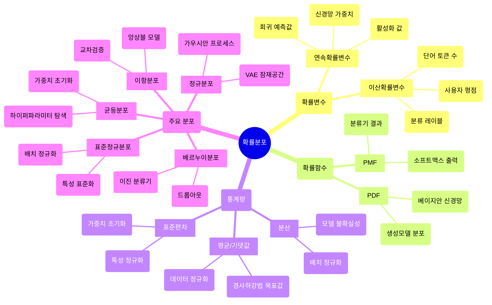

## 📦 사용하는 python package

- torch==2.6.0

- numpy==1.26.4

- scipy==1.15.2

- matplotlib==3.10.1

## 🚀 TL;DR

- 확률분포 개념은 ML/DL의 핵심 수학적 기반입니다. 

- 이산/연속 확률변수, PMF/PDF, 평균/분산과 같은 통계량, 그리고 균등/정규/베르누이/이항 분포 등이 신경망 가중치 초기화, 데이터 정규화, 분류 모델링, 앙상블 학습 등 다양한 ML/DL 작업에 활용됩니다.




## 📓 실습 Jupyter Notebook

- [https://github.com/yuiyeong/notebooks/blob/main/math/probability_distribution.ipynb](https://github.com/yuiyeong/notebooks/blob/main/math/probability_distribution.ipynb)

## 🎲 확률 변수(Random Variable)

- 확률 변수는 실험이나 관측의 결과를 수치로 매핑해주는 함수이다. 

- 확률변수는 이 비수치적 결과를 수치로 변환해주는 함수 역할을 하는 것이다!

- 머신러닝에서는, 우리가 *예측하려는 대상*이나 *데이터의 특성*을 확률 변수로 모델링한다.

### 확률변수가 왜 '매핑 함수'인가?

확률변수가 왜 '매핑 함수'인지 이해하기 위해서는, 실험이나 관찰의 결과가 항상 수치로 나오는 것은 아니라는 점을 고려해야 한다. 많은 실험 결과는 원래 수치가 아닌 형태이다.

- 예시 1) 동전 던지기

	- 실험: 동전을 던짐

	- 관찰 결과: "앞면" 또는 "뒷면" (이는 수치가 아님)

	- 확률변수 X: "앞면"→1, "뒷면"→0 으로 매핑

	- 이 경우, 관찰 결과인 "앞면"과 "뒷면"은 수치가 아닌 범주형 결과이다. 

- 예시 2) 날씨 관찰

	- 실험: 오늘의 날씨 관찰

	- 관찰 결과: "맑음", "흐림", "비", "눈" (수치가 아님)

	- 확률변수 Y: "맑음"→0, "흐림"→1, "비"→2, "눈"→3으로 매핑

- 예시 3) 카드 뽑기

	- 실험: 52장의 카드에서 한 장 뽑기

	- 관찰 결과: "하트 에이스", "스페이드 킹" 등 (수치가 아님)

	- 확률변수 Z: 각 카드에 1부터 52까지 번호 부여

- 주사위 던지기와 같이 결과가 이미 수치인 경우, 확률변수는 그 수치를 그대로 사용하거나 다른 방식으로 변환할 수 있다.

	- 실험: 주사위 던지기

	- 관찰 결과: 1, 2, 3, 4, 5, 6 (이미 수치임)

	- 확률변수 W: 그대로 1, 2, 3, 4, 5, 6 사용

	- 또는 다른 매핑도 가능: 예를 들어 짝수면 1, 홀수면 0으로 매핑하는 확률변수를 정의할 수도 있음

### Python Code 로 개념 확인


```python
# 예시 1: 동전 던지기
coin_results = ["앞면", "뒷면", "앞면", "앞면", "뒷면", "앞면"]

# 확률변수 X: 앞면->1, 뒷면->0으로 매핑하는 함수
def coin_mapping(result):
    return 1 if result == "앞면" else 0

# 매핑 적용
X_values = [coin_mapping(result) for result in coin_results]
print("원래 결과:", coin_results)
print("확률변수 X 값:", X_values)
# 원래 결과: ['앞면', '뒷면', '앞면', '앞면', '뒷면', '앞면']
# 확률변수 X 값: [1, 0, 1, 1, 0, 1]


# 예시 2: 날씨 관찰
weather_results = ["맑음", "비", "흐림", "맑음", "눈", "비"]

# 확률변수 Y: 날씨를 수치로 매핑하는 함수
weather_to_number = {"맑음": 0, "흐림": 1, "비": 2, "눈": 3}
def weather_mapping(result):
    return weather_to_number[result]

# 매핑 적용
Y_values = [weather_mapping(result) for result in weather_results]
print("원래 결과:", weather_results)
print("확률변수 Y 값:", Y_values)
# 원래 결과: ['맑음', '비', '흐림', '맑음', '눈', '비']
# 확률변수 Y 값: [0, 2, 1, 0, 3, 2]


# 예시 3: 주사위 던지기 (이미 수치인 경우)
dice_results = [4, 2, 6, 1, 3, 5, 2]

# 확률변수 Z1: 그대로 사용 (항등함수)
Z1_values = dice_results  # 그대로 사용

# 확률변수 Z2: 짝수면 1, 홀수면 0
def parity_mapping(result):
    return 1 if result % 2 == 0 else 0

Z2_values = [parity_mapping(result) for result in dice_results]

print("원래 결과:", dice_results)
print("확률변수 Z1 값 (그대로):", Z1_values)
print("확률변수 Z2 값 (홀짝 매핑):", Z2_values)
# 원래 결과: [4, 2, 6, 1, 3, 5, 2]
# 확률변수 Z1 값 (그대로): [4, 2, 6, 1, 3, 5, 2]
# 확률변수 Z2 값 (홀짝 매핑): [1, 1, 1, 0, 0, 0, 1]
```

### 이산 확률 변수 (Discrete Random Variable)

- 유한하거나 셀 수 있는 값들만 가질 수 있는 확률 변수

- 예시)

	- 주사위 눈금 (1, 2, 3, 4, 5, 6)

	- 동전 던지기 결과 (앞면, 뒷면)

	- 가족의 자녀 수 (0, 1, 2, 3, ...)

	- 스팸 메일 여부 (0=정상, 1=스팸)

- 머신러닝에서 이산 확률 변수를 다음과 같이 활용한다.

	- 분류 문제의 클래스 레이블

	- 자연어 처리에서 단어 등장 횟수

	- 추천 시스템에서 사용자 평점

### 연속 확률 변수 (Continuous Random Variable)

- 연속 확률 변수는 실수 범위 내의 어떤 값이든 가질 수 있는 확률 변수

- 예시)

	- 사람의 키

	- 주식 가격

	- 온도

	- 시험 성적

- 머신러닝에서 연속 확률 변수를 다음과 같이 활용한다.

	- 회귀 문제의 예측 값 (집 가격, 온도 등)

	- 딥러닝 모델의 가중치

	- 데이터 정규화에 필요한 평균과 표준편차

	- 베이지안 모델의 파라미터

## 🕹️ 확률 함수 (Probability Function)

확률 함수는 확률 변수가 가질 수 있는 각 값 또는 구간에 확률을 할당하는 함수다. 

확률 함수는 확률 변수의 유형(이산 또는 연속)에 따라 달라진다.

### 확률질량함수 (Probability Mass Function, PMF)

- 이산 확률 변수에 대해 각 값이 발생할 확률을 직접 제공한다.

- 정의: 이산 확률 변수 X 에 대해, PMF P(x)는 다음 조건을 만족한다.

	- P(x) ≥ 0 (모든 확률은 0 이상)

	- P(x) = P(X = x) (X 가 값 x 를 가질 확률)

	- 모든 확률의 합은 1

$$ \sum_{x} P(x) = 1 $$

### 확률밀도함수 (Probability Density Function, PDF)

- 연속 확률 변수에 대해 특정 구간에서의 확률 밀도를 제공한다. 

- PDF 자체는** 확률이 아니라 확률 밀도**임에 주의해야 한다. 그래서 PDF는 특정 값에서의 확률을 직접적으로 구할 수는 없고, **특정 구간에서의 확률을 적분하여 계산**한다.

- 정의: 연속 확률 변수 X 에 대한 PDF f(x) 는 다음 조건을 만족한다.

	- f(x) ≥ 0 (모든 지점에서 음수가 아님)

	$$ \int_{-\infty}^{\infty} f(x) dx = 1 $$

	- 확률 계산

	$$ P(a \leq X \leq b) = \int_{a}^{b} f(x) dx $$

- 왜 '밀도'라는 개념이 필요한가?

	- 연속 확률변수의 특징은 무한히 많은 가능한 값을 가질 수 있다는 점이다.

	- 그래서 연속 확률변수에서는 특정 '정확한 값'을 가질 확률이 항상 0이다.

	- 예를 들어, 키가 정확히 170.000000...cm일 확률은 0이다.

	- 확률은 *구간에 대해서만* 의미가 있습니다 (예: 키가 169cm와 171cm 사이일 확률)

	⇒ 이런 특성 때문에 연속 확률변수에 대해서는 이산 확률변수와는 다른 접근 방식이 필요했고, 그것이 바로 '확률밀도' 개념이다.

- '밀도'의 의미

	- 물리학에서의 밀도 개념을 생각해보면, `물리적 밀도 = 질량/부피`

	- 즉, 확률밀도함수는 단위 구간당 확률이 얼마나 집중되어 있는지를 나타낸다. 값이 클수록 해당 지점 근처에 확률이 더 많이 '*밀집*'되어 있다는 의미이다.

	- `확률밀도 = 확률/구간 길이`

- 수학적 의미로는, 확률밀도함수 f(x)가 있을 때

	- f(x) 자체는 확률이 아니다.

	- f(x)dx는 x 주변의 작은 구간 dx에서의 확률을 근사한다.

	- 특정 구간 [a, b]에서의 확률은 ∫[a, b] f(x)dx로 계산된다.

	- 모든 가능한 값에 대한 전체 확률은 1이다; `∫[-∞, ∞] f(x)dx = 1`

## 🔄 사건, 확률, 확률 변수, 확률 함수의 관계

- `사건(Event)`: 확률적 실험의 가능한 결과나 결과들의 집합

	- 예: 주사위를 던져서 짝수가 나오는 사건 = {2, 4, 6}

- `확률(Probability)`: 사건이 발생할 가능성의 수치적 측정

	- 예: P(주사위에서 짝수) = 3/6 = 0.5

- `확률 변수(Random Variable)`: 확률적 실험의 결과를 수치로 매핑하는 함수

	- 예: X = 주사위의 눈금, Y = 동전 던지기(앞면=0, 뒷면=1)

- `확률 함수(Probability Function)`: 확률 변수의 가능한 값에 확률을 할당하는 함수

	- 이산 확률 변수 → 확률질량함수(PMF)

	- 연속 확률 변수 → 확률밀도함수(PDF)


**사건 → 확률**: 확률은 사건에 할당되는 숫자. 사건이 먼저 정의되고, 그 사건에 확률이 부여된다.

**사건 → 확률변수**: 확률변수는 사건의 결과를 숫자로 매핑한다.

**확률변수 → 확률함수**: 확률함수는 확률변수의 분포를 설명한다. 확률변수가 특정 값을 가질 확률(이산) 또는 확률밀도(연속)를 제공하게 된다.

**확률함수 → 확률**: 확률함수를 통해 확률변수와 관련된 사건의 확률을 계산할 수 있다.

	- 이산

	$$ P(X = x) = PMF(x) $$

	- 연속

	$$ P(a ≤ X ≤ b) = ∫_a^b PDF(x)dx $$

### 구체적인 예시를 통한 관계 이해

주사위 던지기 실험을 예시로 보겠다.

- 표본공간 (Sample Space)

	- Ω = {1, 2, 3, 4, 5, 6} (가능한 모든 결과의 집합)

- 사건 (Event)

	- A = "짝수가 나오는 사건" = {2, 4, 6}

	- B = "3보다 큰 수가 나오는 사건" = {4, 5, 6}

	- C = "소수가 나오는 사건" = {2, 3, 5}

- 확률 (Probability)

	- P(A) = 3/6 = 1/2 (짝수가 나올 확률)

	- P(B) = 3/6 = 1/2 (3보다 큰 수가 나올 확률)

- 확률변수 (Random Variable)

	- X = 주사위의 눈금 (X는 1부터 6까지의 값을 가짐)

	- Y = 주사위 눈금이 짝수면 1, 홀수면 0 (Y는 0 또는 1의 값을 가짐)

- 확률함수 (Probability Function)

	- 확률함수는 확률변수가 특정 값을 가질 확률. 사건과 직접 연결되는 것이 아니라 확률변수와 연결된다.

	- 확률변수 X의 PMF

		- P(X=1) = 1/6 : 주사위 눈금이 1일 확률

		- P(X=2) = 1/6 : 주사위 눈금이 2일 확률

		- ...

		- P(X=6) = 1/6 : 주사위 눈금이 6일 확률

	- 확률변수 Y의 PMF

		- P(Y=0) = 1/2 : 주사위 눈금이 홀수일 확률

		- P(Y=1) = 1/2 : 주사위 눈금이 짝수일 확률

> ❗확률함수는 확률변수에 대해 정의된다, 사건에 대해 직접 정의되는 것이 아니다.

	각 확률변수에 대한 확률함수(PMF or PDF)에서 "X=k"와 같은 표현은 그 자체로 하나의 사건이다.

### 머신러닝에서 이러한 관계의 활용

- 분류 문제,

	- 사건: 데이터 포인트가 특정 클래스에 속함

	- 확률 변수: 클래스 레이블 (0, 1, ...)

	- 확률 함수: 모델이 출력하는 각 클래스에 대한 확률 (소프트맥스 출력)

- 회귀 문제,

	- 사건: 타겟 변수가 특정 값 범위에 있음

	- 확률 변수: 타겟 값 (연속 값)

	- 확률 함수: 예측 분포의 PDF (예: 가우시안 프로세스의 출력)

- 생성 모델,

	- 사건: 특정 데이터 포인트가 생성됨

	- 확률 변수: 생성된 데이터의 특성

	- 확률 함수: 데이터 공간의 분포(GAN, VAE 등이 학습)

## 🙏 확률 변수의 평균 (Mean/Expected Value)

> 💡 평균(Mean)은 통계학에서 더 일반적으로 사용되는 용어로, 데이터 집합의 중심 경향을 나타낸다. 보통 표본 평균은 데이터 값들의 합을 데이터 개수로 나눈 값을 말한다.

	머신러닝과 통계학에서,

	- 모집단에 대해 말할 때는 주로 '기댓값'이라는 용어를 사용하고

	- 표본에 대해 말할 때는 주로 '평균'이라는 용어를 사용한다.

	하지만 실제로는 두 용어가 상호 교환적으로 사용되는 경우가 많다. 특히 머신러닝에서는 확률 분포의 평균값을 기댓값이라고 부르며, 이것이 분포의 중심 위치를 나타낸다.

	결론적으로, 두 용어는 같은 수학적 개념을 지칭하지만 사용 맥락이 조금 다르다. 머신러닝에서는 이 두 용어를 거의 구분 없이 사용하는 경우가 많다!

- `확률 변수의 평균 == 기댓값` 

	- 쉽게 말해서, 장기적으로 여러 번 실험을 반복했을 때 평균적으로 얻게 될 X 의 값

- 평균은 확률 변수의 중심 위치를 나타낸다.

### 이산 확률 변수 X 의 평균

- 각 값과 해당 값의 발생 확률을 곱한 총합

$$ E[X] = \sum_{i=1}^n x_i P(X = x_i) $$

### 연속 확률 변수 X의 평균

$$ E[X] = \int_{-\infty}^{\infty} x f(x) dx,\ 여기서\ f(x)=확률밀도함수 $$

### 확률변수의 평균의 성질

$$ 𝑐, 𝑑\ 가\ 상수,\ 𝑋, 𝑌\ 가\ 확률변수\ 이고,\ 
X, Y가\ 확률적으로\ 독립일\ 때, $$

$$ E(c) = c\\
E(cX) = cE(X)\\
E(cX + d) = cE(X) + d\\
E(cX + dY) = cE(X) + dE(Y)\\
E(XY) = E(X)E(Y) $$


```python
import numpy as np

# 예시: 주사위 던지기
values = np.array([1, 2, 3, 4, 5, 6])  # 가능한 값들
probabilities = np.array([1/6, 1/6, 1/6, 1/6, 1/6, 1/6])  # 각 값의 확률

# 수식을 직접 구현
mean_formula = np.sum(values * probabilities)
print(f"수식 직접 구현 - 기댓값: {mean_formula}") # 수식 직접 구현 - 기댓값: 3.5

# 참고: 실제 데이터 샘플이 아닌 확률 분포에서는 이 방법은 적합하지 않음
# 시뮬레이션을 통해 샘플을 생성한 후 사용해야 함
dice_samples = np.random.choice(values, size=100000, p=probabilities)
mean_np = np.mean(dice_samples)
print(f"np 함수 사용 (시뮬레이션) - 기댓값: {mean_np}") # np 함수 사용 (시뮬레이션) - 기댓값: 3.49813
```

### 머신러닝에서 평균의 활용

- 데이터 정규화(표준화)를 위한 기준점

- 모델 파라미터 초기화

- 예측 오차의 분석(평균 제곱 오차)

- 앙상블 모델에서 여러 예측의 종합

> 💡 평균은 데이터의 중심 경향을 파악하고, 모델의 예측 성능을 평가하는 데 기본이 되는 통계량이다. 특히 회귀 문제에서는 평균 제곱 오차(MSE)가 손실 함수로 자주 사용된다.

## 🌌 확률 변수의 분산 (Variance)

- 분산은 확률 변수의 값들이 평균으로부터 얼마나 퍼져 있는지를 측정하는 값

- 즉, 기대값과 어느정도 차이가 있는지를 나타냄

- 분산이 클수록 데이터가 넓게 분포되어 있음을 의미

$$ Var(X) = E[(X - E[X])^2] = E[X^2] - (E[X])^2=\sum_{i=1}^n(x_i - \mu)^2P(x_i) $$


```python
import numpy as np

# 예시: 주사위 던지기
values = np.array([1, 2, 3, 4, 5, 6])  # 가능한 값들
probabilities = np.array([1/6, 1/6, 1/6, 1/6, 1/6, 1/6])  # 각 값의 확률

# 수식을 직접 구현
variance_formula = np.sum((values - mean_formula)**2 * probabilities)

print(f"수식 직접 구현 - 분산: {variance_formula}") # 수식 직접 구현 - 분산: 2.9166666666666665

# 참고: 실제 데이터 샘플이 아닌 확률 분포에서는 이 방법은 적합하지 않음
# 시뮬레이션을 통해 샘플을 생성한 후 사용해야 함
dice_samples = np.random.choice(values, size=100000, p=probabilities)
variance_np = np.var(dice_samples)  # 기본적으로 ddof=0 (모집단 분산)

print(f"np 함수 사용 (시뮬레이션) - 분산: {variance_np}") # np 함수 사용 (시뮬레이션) - 분산: 2.9014569375
```

### 확률변수 분산의 성질

$$ a, b가\ 상수,\ 𝑋가\ 확률변수일 때,\\
V(a)=0\\
V(aX + b) = a^2V(X) $$

### 머신러닝에서 분산의 활용

- 특성 스케일링과 정규화

- 모델의 불확실성 측정

- 주성분 분석(PCA)에서 분산 최대화 방향 선택

- 배치 정규화(Batch Normalization)에서 분산 계산

- 과적합 방지를 위한 정규화 기법 설계

## 📊 확률 변수의 표준편차 (Standard Deviation)

표준편차는 분산의 제곱근으로, 분산과 같이 데이터의 퍼짐 정도를 나타내지만 원래 데이터와 같은 단위를 가진다.

$$ \sigma_X = \sqrt{Var(X)} = \sqrt{E[(X - E[X])^2]} = \sqrt{\sum_{i=1}^n(x_i - \mu)^2P(x_i)} $$


```python
import numpy as np

# 이산 확률 변수의 표준편차 계산
data = [1, 2, 3, 4, 5]
weights = [0.1, 0.2, 0.4, 0.2, 0.1]
mean = sum(x * w for x, w in zip(data, weights))
variance = sum((x - mean)**2 * w for x, w in zip(data, weights))
std_dev = np.sqrt(variance)
print(f"이산 확률 변수의 표준편차: {std_dev:.4f}")

# 실제 데이터의 표준편차
sample_data = np.random.normal(loc=50, scale=10, size=1000)
sample_std = np.std(sample_data)
print(f"표본 표준편차: {sample_std:.2f}")

```

### 머신러닝에서 표준편차의 활용

- Z-점수 정규화 (표준화)

$$ \frac{(x - \mu)}{\sigma} $$

- 이상치 탐지 (평균으로부터 몇 표준편차 떨어져 있는지)

- 가우시안 프로세스와 같은 확률적 모델에서 불확실성 측정

- 신경망의 가중치 초기화 (표준편차 기반 초기화)

- 경사 하강법에서 학습률 조정

## 🎲 확률 분포 (Probability Distributions)

- 확률 분포는 확률 변수가 가질 수 있는 모든 가능한 값과 그 값들이 발생할 확률을 나타낸다.

- 일반적으로 확률분포는 표나 그래프 표상으로 나타낸다.

- 머신러닝에서는 데이터를 모델링하고 불확실성을 표현하는 데 필수적이다!

### 균등 분포 (Uniform Distribution)

- 균등 분포는 모든 가능한 결과가 동일한 확률을 가지는 분포

- 변수의 특성에 따라서, *이산 균등분포*와 *역속 균등분포*로 구분할 수 있다.

- 예시) 주사위를 던지거나 동전을 던지는 경우

- 머신러닝에서는,

	- 초기 가중치 설정: 신경망의 가중치를 초기화할 때 작은 범위의 균등 분포를 사용한다.

	- 하이퍼파라미터 튜닝: 랜덤 서치에서 하이퍼파라미터의 탐색 범위를 정의할 때 사용된다.

	- 드롭아웃: 일부 뉴런을 무작위로 비활성화하는 정규화 기법에서 활용된다.

### 이산 균등분포 (Discrete Uniform Distribution)


- 유한한 개수의 값들이 모두 동일한 확률로 발생하는 분포

$$ 확률변수가 \ x_1, x_2,\ ...,\ x_n, 으로 n개일\ 때,\ x_i의\ 확률은 \frac{1}{n} $$

$$ 확률변수\ X의\ 확률함수는\ f(x)=\frac{1}{n} $$

- 예시) 주사위 던지기


```python
import numpy as np
import matplotlib.pyplot as plt

# 이산 균등분포 예시 (주사위)
dice_values = np.random.randint(1, 7, size=10000)  # 1에서 6까지 균등하게 샘플링

# 시각화
plt.hist(dice_values, bins=20, alpha=0.7)
plt.title("Discrete Uniform Distribution")
plt.xlabel("X")
plt.ylabel("Frequency")
plt.show()
```

- 머신러닝에서는,

	- 랜덤 포레스트에서 특성 선택: 각 결정 트리에서 사용할 특성을 무작위로 선택할 때 활용

	- 클래스 불균형 문제: 언더샘플링 시 각 클래스에서 동일한 확률로 샘플을 선택

### 연속 균등분포 (Continuous Uniform Distribution)


- 연속 확률 변수가 특정 구간 내에서 동일한 확률 함수를 가지는 분포

$$ 확률변수\ X가\ a와b\ 구간에서\ 균등분포를\ 가질\ 때, $$

$$ f_X(x)=\frac{1}{b-a}\ (a\leq x \leq b) $$


```python
import numpy as np
import matplotlib.pyplot as plt
import scipy.stats as stats

# 연속 균등분포 시각화
a, b = 2, 6  # 범위 [2, 6]
x = np.linspace(0, 8, 1000)
uniform_pdf = stats.uniform.pdf(x, loc=a, scale=b-a)

plt.plot(x, uniform_pdf)
plt.fill_between(x, uniform_pdf, where=[(a <= i <= b) for i in x], alpha=0.3)
plt.title("Continuous Uniform Distribution")
plt.xlabel("X")
plt.ylabel("Probability density")
plt.show()
```

- 머신러닝에서는,

	- 강화학습의 입실론-그리디 알고리즘: 탐색(exploration)과 활용(exploitation) 사이의 균형을 맞출 때 활용

	- 데이터 증강(Data Augmentation): 이미지 회전이나 이동 범위를 균등 분포에서 샘플링

## 🔔 정규 분포 (Normal Distribution)


- 정규 분포는 자연계에서 가장 흔하게 관찰되는 확률 분포

- 평균(m)과 표준편차(σ)로 특징지어진다.

- 평균에 대해서 좌우대칭, 평균에서 최대값, 종 모양의 곡선이 그려진다는 특징이 있다.

- 즉, 정규 분포는 평균과 표준편차에 의해 결정된다.


$$ f_X(x) = \frac{1}{\sqrt{2\pi}\sigma}e^{-\frac{(x-m)^2}{2\sigma^2}},\ (-\infty < x < \infty) $$

$$ 확률변수\ X가\ m일\ 때,\ 최댓값\ \frac{1}{\sqrt{2\pi}\sigma}\ 을\ 가진다. $$

### 정규 분포의 성질

- 어떤 실수 x에 대해 f(x) > 0

- 분포곡선은 평균 m 을 기준으로 좌우대칭

- 곡선과 x 축 사이의 넓이는 1

- 곡선 내 임의의 a, b 가 a < b 일 때, a 와 b 에 속할 확률 P(a ≤ x ≤ b) 는 a, b 와 곡선 사이의 넓이와 같다.

### 중심극한 정리

- 표본의 크기가 커질수록 표본 평균의 분포는 모집단의 분포 모양과는 관계없이 정규분포에 가까워진다.

- 쉽게 말해서, 어떤 사건이 일어나는 빈도를 계산하여 그래프로 나타내면 중심(평균)을 기준으로 좌우가 대칭되는 분포가 그려진다는 말이다.

- 표본 평균의 평균은 모집단의 모평균과 같고, 표본 평균의 표준 편차는 모집단의 모 표준 편차를 표본 크기의 제곱근으로 나눈 것과 같다.


```python
import numpy as np
import matplotlib.pyplot as plt
import scipy.stats as stats

# 정규 분포 시각화
mu, sigma = 0, 1  # 평균 0, 표준편차 1
x = np.linspace(-4, 4, 1000)
normal_pdf = stats.norm.pdf(x, mu, sigma)

plt.plot(x, normal_pdf)
plt.fill_between(x, normal_pdf, alpha=0.3)
plt.title("Normal Distribution")
plt.xlabel("X")
plt.ylabel("Probability Density")
plt.grid(True, alpha=0.3)
plt.show()
```

- 머신러닝에서는,

	- 신경망 가중치 초기화: Xavier, He 초기화 등은 정규 분포를 사용한다.

	- 가우시안 프로세스: 확률적 모델링에 활용된다.

	- VAE(Variational Autoencoder): 잠재 공간이 정규 분포를 따르도록 학습한다.

	- 노이즈 추가: 모델 견고성을 높이기 위해 데이터에 정규 분포 노이즈를 추가한다.

> 💡** 정규 분포가 중요한 이유**❗**
**중심극한정리에 의해 많은 자연현상과 데이터가 정규 분포를 따르고, 계산이 편리하고 수학적으로 다루기 쉽다. 또한 다양한 통계적 검정의 기반이 된다.

## 📊 표준 정규 분포 (Standard Normal Distribution)

> 💡 일반적으로 정규 분포를 활용하여 결과를 도출하는 것에는 문제가 없지만, 대다수의 연구나 조사에서는 복잡한 관계를 분석하는 경우가 대부분이다. 이렇게 여러가지 특성에 대한 분석 결과들을 서로 비교할 수 있도록 만드는 과정이 필요하다. 즉, 서로 다른 정규 분포들을 비교하기 위해 평균이 0, 표준 편자는 1을 기준으로 각각의 정규 분포들을 표준화한 표준 정규 분포를 사용하게 된 것이다.

- 표준 정규 분포는 `평균이 0 이고 표준편차가 1`인 특별한 정규 분포

- 모든 정규 분포는 표준 정규 분포로 변환할 수 있다.

	- 정규 분포 → 표준화 → 표준 정규 분포

### 정규화

확률 변수 X가 정규분포를 따를 때, 새로운 확률 변수 Z 로 변환하면, 표준 정규 분포에 대한 확률 함수를 다음과 같이 표현할 수 있다.

$$ X \sim N(\mu, \sigma^2)이고,\ Z = \frac{X-\mu}{\sigma} 일\ 때,\ f_Z(z) = \frac{1}{\sqrt{2\pi}}e^{-\frac{z^2}{2}},\ (-\infty < z < \infty) $$

$$ N(\mu, \sigma^2) \rightarrow 정규화(Z = \frac{X-\mu}{\sigma}) \rightarrow N(0,1) $$


```python
import numpy as np
import matplotlib.pyplot as plt
import scipy.stats as stats

# 여러 정규 분포와 표준 정규 분포 비교
x = np.linspace(-5, 5, 1000)
plt.figure(figsize=(10, 5))
plt.plot(
    x, stats.norm.pdf(x, 0, 1), "r-", label="Standard Normal Distribution (μ=0, σ=1)"
)
plt.plot(x, stats.norm.pdf(x, 0, 0.5), "g--", label="Normal Distribution (μ=0, σ=0.5)")
plt.plot(x, stats.norm.pdf(x, 0, 2), "b-.", label="Normal Distribution (μ=0, σ=2)")
plt.plot(x, stats.norm.pdf(x, -2, 1), "m:", label="Normal Distribution (μ=-2, σ=1)")

plt.title("Comparison of Normal Distributions")
plt.xlabel("X")
plt.ylabel("Probability Density")
plt.legend()
plt.grid(True, alpha=0.3)
plt.show()
```

- 표준화(Standardization)는 데이터를 표준 정규 분포 형태로 변환하는 과정


```python
# 데이터 표준화 예시
import numpy as np
import matplotlib.pyplot as plt

# 정규 분포
data = np.random.normal(loc=10, scale=2.5, size=1000)  # 평균 10, 표준편차 2.5인 데이터

# 표준화
standardized_data = (data - np.mean(data)) / np.std(data)

# 시각화
plt.figure(figsize=(12, 5))
plt.subplot(1, 2, 1)
plt.hist(data, bins=30, alpha=0.7)
plt.title("Original Data")
plt.xlim(-5, 20)
plt.ylim(0, 100)

plt.subplot(1, 2, 2)
plt.hist(standardized_data, bins=30, alpha=0.7)
plt.title("Standardized Data")
plt.xlim(-5, 5)
plt.ylim(0, 100)

plt.tight_layout()
plt.show()
```

- 머신러닝에서는,

	- 데이터 전처리: 특성 스케일링의 대표적인 방법으로, 서로 다른 스케일의 특성들을 표준화합니다

	- 이상치 탐지: z-점수를 사용하여 이상치를 식별합니다

	- 딥러닝에서 배치 정규화(Batch Normalization): 각 레이어의 입력을 정규화하여 학습 속도 향상과 과적합 방지에 사용됩니다

## 🎯 베르누이 분포 (Bernoulli Distribution)

### 베르누이 시행 (Bernoulli Trial)

- *반드시 두 가지만 존재하며 동시에 일어나지 않는 배타적인 사건*을 반복적으로 실험 하는 것을 의미한다.

- 즉, 성공과 실패만 있으며, 성공할 확률이 p 라면 실패할 확률은 1 - p 로 고정되고, 각 실험이 독립적이며 동일한 확률 가진다.

- 단일 이진 실험이라고도 한다.

- 예시) 동전 던지기, 환자의 생존/사망, 이메일이 스팸인지 아닌지 등

### 베르누이 분포

- 성공 확률이 p인 단일 이진 실험의 결과를 모델링하는 확률 분포


```python
import numpy as np
import matplotlib.pyplot as plt
import scipy.stats as stats

# 베르누이 분포 시각화
p_success = 0.7  # 성공 확률
x = np.array([0, 1])
bernoulli_pmf = stats.bernoulli.pmf(x, p_success)

plt.bar(x, bernoulli_pmf, width=0.4)
plt.xticks([0, 1], ['실패 (0)', '성공 (1)'])
plt.ylabel('확률')
plt.title(f'베르누이 분포 (p={p_success})')
plt.ylim(0, 1)
plt.show()'
```

### 머신러닝에서의 활용

- 이진 분류 문제: 로지스틱 회귀, 이진 분류기의 출력은 베르누이 분포로 모델링된다.

- 드롭아웃 정규화: 각 뉴런을 유지할지 제거할지를 베르누이 확률로 결정한다.

## 📈 이항 분포 (Binomial Distribution)

- 성공 확률이 p인 n번의 독립적인 베르누이 시행에서, 성공 횟수의 확률 분포이다.

- 확률을 구하는 수식은 다음과 같다.(n 번 중 r 번 성공하는 조합을 계산하는 것)

$$ P(X=r)=\frac{n!}{r!(n-r!)}p^r(1-p)^{(n-r)} $$


```python
import numpy as np
import matplotlib.pyplot as plt
import scipy.stats as stats

n_trials = 100  # 시행 횟수
success_probs = [0.2, 0.5, 0.8]  # 다양한 성공 확률
x = np.arange(0, n_trials + 1)

plt.figure(figsize=(12, 6))
for p in success_probs:
    binomial_pmf = stats.binom.pmf(x, n_trials, p)
    plt.plot(x, binomial_pmf, 'o-', label=f'p={p}')

plt.title(f"Binomial Distribution (n={n_trials})")
plt.xlabel("Number of Success")
plt.ylabel("Probability")
plt.legend()
plt.grid(True, alpha=0.3)
plt.show()
```

### 평균 (Mean)

$$ \mu = np $$

- 이항 분포의 평균(기댓값)은 n번의 시행에서 예상되는 평균 성공 횟수를 나타낸다.

### 분산 (Variance)

$$ \sigma^2=np(1-p) $$

- 성공 횟수의 변동성을 나타낸다.


```python
import numpy as np

# 이항 분포의 평균과 분산 계산 예시
n = 20
p = 0.3

mean = n * p
variance = n * p * (1-p)
std_dev = np.sqrt(variance)

print(f"시행 횟수 n={n}, 성공 확률 p={p}")
print(f"평균(기댓값): {mean}")
print(f"분산: {variance}")
print(f"표준편차: {std_dev}")
# 시행 횟수 n=20, 성공 확률 p=0.3
# 평균(기댓값): 6.0
# 분산: 4.199999999999999
# 표준편차: 2.0493901531919194

# 시뮬레이션을 통한 검증
simulations = np.random.binomial(n, p, size=10000)
print(f"시뮬레이션 결과:")
print(f"평균: {np.mean(simulations)}")
print(f"분산: {np.var(simulations)}")
print(f"표준편차: {np.std(simulations)}")
# 시뮬레이션 결과:
# 평균: 5.9829
# 분산: 4.16620759
# 표준편차: 2.041128998863129
```

### 머신러닝에서의 활용

- 교차 검증: k-fold 교차 검증에서 특정 모델 성능의 변동성 예측

- 앙상블 모델: 여러 분류기의 투표 결과 모델링

- 클래스 불균형 문제: 희소한 이벤트의 발생 확률 모델링

## 🌱 기저 분포 (Base Distribution)

- 기저 분포는 다른 복잡한 분포를 생성하거나 변환하는 데 사용되는 기본 확률 분포다.

- 머신러닝에서는 특히 생성 모델에서 중요한 역할을 한다.


```python
# 기저 분포(정규 분포)에서 비선형 변환을 통한 새로운 분포 생성 예시
import matplotlib.pyplot as plt
import torch
import torch.distributions as distributions

# 기저 분포로 정규 분포 사용
base_dist = distributions.Normal(loc=torch.tensor(0.), scale=torch.tensor(1.))

# 비선형 변환 함수
def nonlinear_transform(x):
    return torch.exp(x)  # 로그 정규 분포로 변환

# 변환된 샘플 생성
base_samples = base_dist.sample((1000,))
transformed_samples = nonlinear_transform(base_samples)

# 시각화
plt.figure(figsize=(12, 5))
plt.subplot(1, 2, 1)
plt.hist(base_samples.numpy(), bins=30, alpha=0.7)
plt.title("Base Distribution (Normal Distribution)")
plt.subplot(1, 2, 2)
plt.hist(transformed_samples.numpy(), bins=30, alpha=0.7)
plt.title("Transformed Distribution (Log Normal Distribution)")
plt.tight_layout()
plt.show()
```

### 머신러닝에서의 활용

- VAE: 잠재 공간에서 정규 분포를 기저 분포로 사용한다.

- 정규화 흐름(Normalizing Flows): 단순한 기저 분포에서 복잡한 분포로 변환한다.

- GAN: 생성자가 잠재 공간의 기저 분포에서 샘플링하여 데이터 분포로 매핑한다.

- 베이지안 신경망: 가중치의 사전 분포로 기저 분포를 사용한다.

## 📉 표집 분포 (Sampling Distribution)

- 표집 분포는 모집단에서 추출한 표본 통계량(평균, 분산 등)의 확률 분포

- 이는 통계적 추론의 기반이 된다.


```python
import numpy as np
import matplotlib.pyplot as plt

# 표본 평균의 표집 분포 시뮬레이션
population = np.random.normal(loc=50, scale=10, size=100000)  # 모집단
sample_sizes = [5, 30, 100]
n_samples = 1000

plt.figure(figsize=(15, 5))
for i, size in enumerate(sample_sizes):
    sample_means = [
        np.mean(np.random.choice(population, size=size)) for _ in range(n_samples)
    ]

    plt.subplot(1, 3, i + 1)
    plt.hist(sample_means, bins=30, alpha=0.7)
    plt.axvline(
        np.mean(population), color="r", linestyle="--", label="mean of population"
    )
    plt.title(f"Size of Sample: {size}")
    plt.xlabel("Sample Mean")
    plt.ylabel("Frequency")
    plt.legend()

plt.tight_layout()
plt.suptitle("Sampling Distributions", y=1.05)
plt.show()
```

### 언어적 표현 (Linguistic Expression)

- 표집 분포는 "표본 통계량의 분포", "표본 평균의 분포" 등으로 표현할 수 있다. 

- 이는 모집단에서 여러 번 표본을 추출할 때, 각 표본에서 계산된 통계량(예: 평균)의 분포를 의미한다.

### 그래프 표현 (Graphical Representation)

- 표집 분포는 히스토그램이나 확률 밀도 함수 그래프로 시각화할 수 있다. 

- 표본 크기가 커질수록 표집 분포는 정규 분포에 가까워진다.(by 중심극한정리)

### 특징 (Characteristics)

- 중심극한정리: 표본 크기가 충분히 크면, 표본 평균의 분포는 정규 분포에 근사한다.

- 표본 크기가 커질수록 표준 오차(표준편차)가 감소한다.

- 표본 크기가 커질수록 모집단 모수에 대한 추정의 정확도가 높아진다.

### 머신러닝에서의 활용

- 배치 학습: 미니배치의 크기가 모델 학습 변동성에 미치는 영향 이해

- 부트스트랩: 모델 성능 추정 및 신뢰구간 계산

- 앙상블 학습: 여러 모델의 예측 결과 분포 분석

- 베이지안 학습: 파라미터 사후 분포 추정

### 표집 분포가 중요한 이유

- 모델 성능의 통계적 유의성 평가에 필수적이다.

- 교차 검증 결과의 변동성을 이해하는 데 도움이 된다.

- 표본 크기 결정과 실험 설계에 중요한 역할을 한다.

- 모델 예측의 불확실성 정량화에 사용된다.

