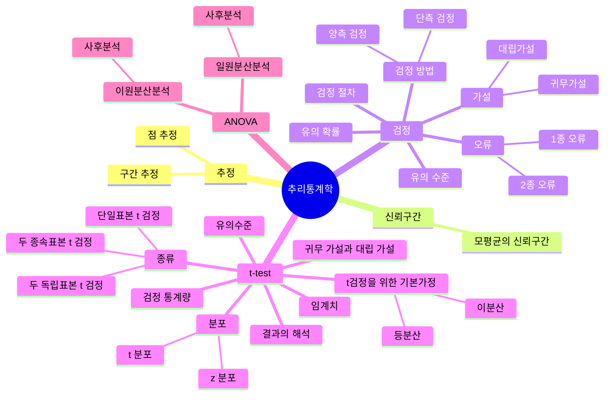

## 📊 추정 (Estimation)

- 추리통계란, 분석된 자료를 근거로 *모집단의 특성을 추론하는 것이 목적*인 통계를 말한다.
- 즉, 추정은 표본 데이터를 바탕으로 모집단의 특성을 예측하는 과정
- 머신러닝에서는, 제한된 데이터로부터 모델의 매개변수를 찾는 핵심 과정으로 볼 수 있다.

### 점 추정 (Point Estimation)

- 표본 데이터를 사용하여, 모집단 매개변수의 단일 값(특정 수치)을 추정하는 방법
- 예시)
    - 학교 시험에서 획득할 평균 점수를 80점, 90점과 같이 측정 수치로 표현
    - 표본 평균으로 모집단의 평균이나 표본 분산으로 모집단 분산을 추정하기

 

❗점 추정은 특정 값을 추정하는 것이라서, 오차를 수반할 수 밖에 없다는 약점이 있다!

> 지금까지 학교 시험에서 평균 85점, 90점, 95점을 받았고, 다음 시험의 평균읠 90점으로 추정했다면?
>
> 실제로 90점이라면 정확한 추정이겠지만, 1점 혹은 0.1점이라도 틀렸다면, 그것은 옳지 않은 추정이된다!

그럼 오차를 최소환 하는 것이 바람직한 추정이라고 할 수 있을 것이다.

하지만 그 오차를 최소화 할 수 있는 기준을 아무리 만족시키더라도, 오차의 범위가 매우 클 수 밖에 없다.

⇒ 그래서 **보통 구간 추정을 많이 사용한다.**

> 💡 모든 머신러닝 모델이 실제로는 데이터로부터 파라미터를 추정하는 과정이기 때문에, 이러한 개념을 이해하고 있는 것이 좋다.

### 구간 추정 (Interval Estimation)

- 점 추정은 명확한 수치를 제공하지만, 오차가 매우 커지는 문제가 있다.

  ⇒ 오차를 줄이기 위하여, *신뢰도를 제공하면서 상한값과 하한값으로 모수를 추정하는 방법*을 고안

- 구간 추정은 **모수가 포함될 것으로 예상되는 범위**를 제공하여, *추정의 불확실성을 표현*한다.
    - 예시) "모집단 평균은 95% 확률로 23.1에서 26.9 사이에 있다."

- 구간 추정은 단순히 값을 추정하는 것을 넘어, 그 불확실성까지 고려할 수 있게 해주므로 의사결정을 하는데에 중요한 역할을 한다.
- 신뢰도: 모수를 포함할 확률

## 🔍 신뢰구간 (Confidence Interval)

- 모수를 포함할 것으로 예상되는 구간(상한값 ~ 하한값)을, 반복적인 표본 추출에서 해당 비율만큼, 모수를 포함할 구간을 제공한다.

- 점 추정량을 기준으로 상한과 하한을 설정 ⇒ 그 구간 안에 모수가 포함될 확률을 *신뢰 수준*으로 나타냄

- **신뢰 수준**: 여러 번 표본을 추출했을 때, 계산된 신뢰구간 충 참된 모수를 포함할 확률을 의미

- **표준 오차**: 표본 평균의 표준 편차

    - 여러 번의 표본 추출로 계산된 *표본 평균들이 모평균으로부터 얼마나 떨어져 있는지*를 나타내는 값

- 모평균을 추정하고자 할 때,

$$ 표본 평균=\bar{x},\ 표준오차=SE $$

- 모집단 평균에 대한 신뢰구간은, (여기서 z 는 표준정규분포(Z 분포)에서의 임계값(critical value))

    - 90% 신뢰수준 이라면, z 값은 1.64

    - 95% 신뢰수준 이라면, z 값은 1.96

    - 99% 신뢰수준 이라면, z 값은 2.58

    - 99.9% 신뢰수준 이라면, z 값은 3.30

$$ \bar{x} - z \cdot SE \leq \mu \leq \bar{x} + z \cdot SE $$

노경섭(2021), 제대로시작하는기초통계학2 판 , 서울 : 한빛아카데미 ㈜.

### 그런데 표준 오차가 있다는 것은 모평균을 안 다는 것 아닌가?

*❗모평균을 알아야, 그 차이가 얼마인지를 알 수 있을텐데??????*

⇒ 실제로 표준오차(SE)의 이론적 정의는 "표본 평균들의 표준편차"로, 이를 정확히 알기 위해서는 모평균을 알고 여러 표본을 추출해야 한다. 그런데 신뢰구간을 구하는 목적 자체가 모평균을 추정하는 것이니, 이는
모순처럼 보인다.

이 모순을 해결하는 방법은, **모표준편차(σ)를 몰라서 표본 표준편차(s)로 대체**하는 것이다.

- 이론적 표준 오차 공식 대신에,

$$ SE = \frac{\sigma}{\sqrt n},\ 여기서 \sigma 는\ 모집단의\ 표준편차 $$

- 다음 공식을 사용한다.

$$ SE = \frac{s}{\sqrt n},\ 여기서\ s는\ 표본의\ 표준편차 $$

### 실제 표준 오차 계산 예시

- 전국 학생들의 평균 키(μ)를 알고 싶을 때,

- 100명의 학생 표본을 추출해 평균 키와 표준편차를 계산한다.

$$ 100명의\ 평균\ 키=\bar{x},\ 표준편차=s $$

- 이 표본 표준편차(s)를 사용해 표준오차를 추정

$$ SE \approx \frac{s}{\sqrt {100}} $$

- 추정된 표준오차로 신뢰구간을 계산!

    - 95% 신뢰수준을 보통 선택 → z 는 1.96 사용

    - 예를 들어, 평균이 165 cm, 표본 표준편차 가 8 cm 라고 했을 때 신뢰 구간

        - 표준오차 = 0.8 cm

        - 신뢰구간 = 165 ± 1.96 × 0.8 ⇒ [163.43cm, 166.57cm]

### 표준오차에 대한 두 가지 관점

- **이론적 관점**: 여러 표본들에서 계산된 표본 평균의 분포에서의 표준편차

- **실용적 관점**: 표본 데이터로부터 추정한 "표본 평균의 불확실성 측정치"

- 결론적으로, 표준오차는 표본 통계치(표본 표준편차)로부터 추정되며, 이 추정의 불확실성 때문에 우리는 점 추정 대신 신뢰구간을 사용한다. 그리고 이것이 바로 추정통계학의 핵심 개념이다.

### 모평균의 신뢰구간 (Confidence Interval for Population Mean)

- 모평균에 대한 신뢰구간은 표본 평균을 중심으로 계산된다.

- 대체로 90%, 95%, 99%, 99.9% 에 해당하는 신뢰구간을 많이 사용

- 신뢰구간에 속하지 않는 10%, 5%, 1%, 0.1% 를 𝛼 라고 할 때, 신뢰구간을 `1 - 𝛼` 로 표현하기도 함

$$ 100(1-\alpha)\% = P(-z\frac{\alpha}{2} \leq Z \leq z\frac{\alpha}{2}) $$

노경섭(2021), 제대로시작하는기초통계학2 판 , 서울 : 한빛아카데미 ㈜.

$$ 모집단의 분산=\sigma^2, 평균=\mu, 표준오차=\frac{\sigma}{\sqrt n} 일\ 때,\\
\bar{x} - z \frac{\alpha}{2} \cdot \frac{\sigma}{\sqrt n} \leq \mu \leq \bar{x} + z \frac{\alpha}{2} \cdot \frac{\sigma}{\sqrt n} $$
