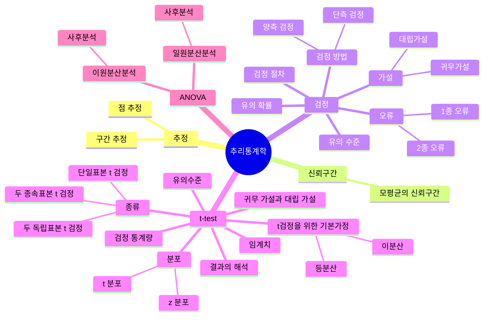

```mermaid
mindmap
  root((추리통계학))
    추정
      점 추정
      구간 추정
    신뢰구간
      모평균의 신뢰구간
    검정
      가설
        귀무가설
        대립가설
      오류
        1종 오류
        2종 오류
      유의 수준
      유의 확률
      검정 방법
        양측 검정
        단측 검정
      검정 절차
    t-test
      귀무 가설과 대립 가설
      검정 통계량
      임계치
      유의수준
      결과의 해석
      분포
        z 분포
        t 분포
      t검정을 위한 기본가정
        등분산
        이분산
      종류
        단일표본 t 검정
        두 종속표본 t 검정
        두 독립표본 t 검정
    ANOVA
      일원분산분석
        사후분석
      이원분산분석
        사후분석
```
