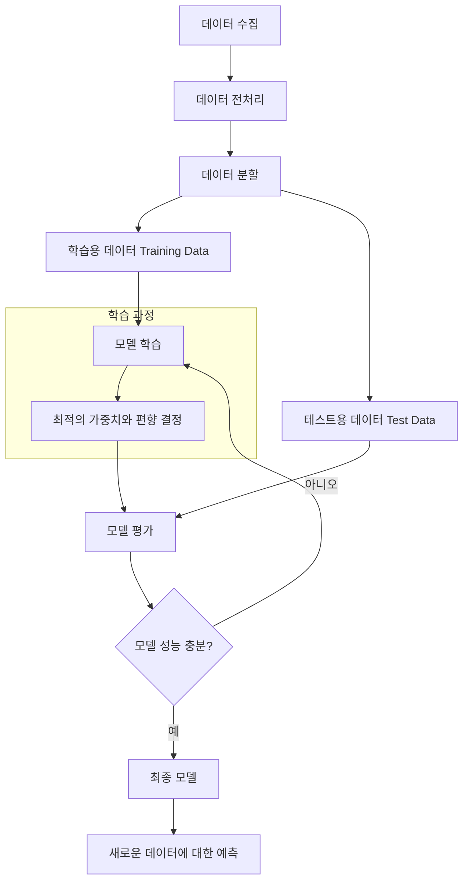
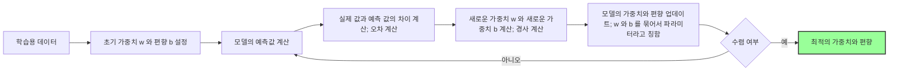

## 📦 사용하는 python package

- numpy==1.26.4

- scikit-learn==1.6.1

- matplotlib==3.10.1

- seaborn==0.13.2

## 📓 실습 Jupyter Notebook

- [https://github.com/yuiyeong/notebooks/blob/main/machine_learning/linear_regression.ipynb](https://github.com/yuiyeong/notebooks/blob/main/machine_learning/linear_regression.ipynb)

## 📊 상관 분석 (Correlation Analysis)

- 특징 변수(feature variable)와 목표 변수(target variable) 간의 연관성을 파악하기 위한 연구법

- 상관 관계의 정도를 나타내는 지수인, 상관 계수를 통해 분석

> 💡 머신러닝 및 딥러닝에서는 독립 변수를 특징 변수라고 칭하고, 종속 변수를 목표 변수라고 칭한다.

### 피어슨 상관 계수 (Pearson Correlation Coefficient)

- *표본 상관 계수*라고도 한다.

- X, Y 와 함께 변하는 정도를 X 와 Y 가 각각 변하는 정도로 나눈 것

- 수식으로는 다음과 같다.

$$ r = \frac{\sum_{i=1}^{n}(x_i - \bar{x})(y_i - \bar{y})}{\sqrt{\sum_{i=1}^{n}(x_i - \bar{x})^2 \sum_{i=1}^{n}(y_i - \bar{y})^2}} $$

- 상관계수 범위: -1 ≤ r ≤ 1

    - `r = 1`: 완벽한 양의 선형 관계

    - `r = -1`: 완벽한 음의 선형 관계

    - `r = 0`: 선형 관계 없음


김도연 (2020), 모두의R 데이터분석 , ㈜도서출판길벗.


### 추세선(Trend Line)

- 두 데이터의 상관 관계를 바탕으로, 경향성을 나타내는 직선을 말한다.

$$ f(x)=ax+b $$

### Python Code

```python
import numpy as np
import matplotlib.pyplot as plt

# 데이터 생성 (예: 공부 시간과 시험 점수)
hours_studied = np.array([1, 2, 3, 4, 5, 6, 7, 8])
exam_scores = np.array([65, 70, 75, 80, 85, 85, 90, 95])

correlation_matrix = np.corrcoef(hours_studied, exam_scores)
correlation = correlation_matrix[0][1]

# 데이터 분포 시각화
plt.scatter(hours_studied, exam_scores)

slope, intercept = np.polyfit(hours_studied, exam_scores, 1)
trend_line = slope * hours_studied + intercept  # 추세선 식
# 추세선 시각화
plt.plot(hours_studied, trend_line, 'r-', label=f'y = {slope:.2f}x + {intercept:.2f}')

plt.xlabel("Hours to Study")
plt.ylabel("Scores")
plt.title(f"Correlation Between Scores and Hours to Study(r = {correlation})")
plt.legend()
plt.grid(True)
plt.show()
```


### Glimps of Machine Learning

- 목표 변수와 특징 변수 간의 상관 계수를 계산해봄으로써, 목표 변수에 영향을 많이 끼치는 특징 변수를 찾는다.

```python
from sklearn.datasets import fetch_openml

boston = fetch_openml(name="boston", version=1, as_frame=True)
df = boston.frame

# 상관관계 행렬 계산
correlation_matrix = df.corr()
print("가격과 각 특성 간의 상관관계:")
print(correlation_matrix["MEDV"].sort_values(ascending=False))

# 히트맵으로 시각화
plt.figure(figsize=(12, 10))
sns.heatmap(correlation_matrix, annot=True, cmap="coolwarm", fmt=".2f")
plt.title("Boston Housing Price Correlation Heatmap")
plt.show()
```

### 상관 분석을 통해 얻을 수 있는 정보 (Information from Correlation Analysis)

> ❗상관 관계가 높다고 해서, 그것이 인과 관계를 뜻하는 것은 아니다! 예시) 아이스크림이 팔리는 빈도와 우산이 팔리는 빈도에 상관 관계가 있다고 해서, 서로 인과 관계인 것은 아닌 것처럼

- 두 변수 간의 선형관계를 파악

- 그 관계가 양의 관계인지 또는 음의 관계인지 파악

- 높은 상관 관계를 가지는 특징 변수들을 파악(for 다중선형회귀모델)

- 특성 선택(Feature Selection)에 활용: 상관관계가 높은 변수들을 선택하여 모델 성능 향상

- 다중공선성(Multicollinearity) 탐지: 독립변수들 간에 높은 상관관계가 있으면 모델이 불안정해질 수 있음

- 현업 활용

    - 마케팅: 어떤 마케팅 채널이 매출과 가장 상관관계가 높은지 분석

    - 의료: 다양한 생체 지표와 특정 질병 발생률 간의 상관관계 분석

    - 금융: 다양한 경제 지표와 주가 움직임 간의 상관관계 분석

## 🤖 머신러닝 (Machine Learning)

### 인공지능 (Artificial Intelligence)

- 인공지능(AI)은 인간의 지능을 모방하는 시스템을 만드는 학문적 분야

- 크게 약인공지능(Weak AI)과 강인공지능(Strong AI)으로 구분

    - 약인공지능: 특정 작업을 수행하도록 설계된 AI (예: 음성인식, 번역)

    - 강인공지능: 인간 수준의 의식과 사고능력을 갖춘 AI (아직 이론 단계)

### 인공지능과 머신러닝과 딥러닝의 관계 (Relationship between AI, ML, and Deep Learning)


- 머신러닝의 주요 유형

    - (요즘은 이렇게 나누는 것이 맞지 않다고 이야기가 나오고 있음)

    - 지도학습(Supervised Learning): 레이블이 있는 데이터로 학습

    - 비지도학습(Unsupervised Learning): 레이블 없이 데이터의 패턴 발견

    - 강화학습(Reinforcement Learning): 환경과 상호작용하며 보상을 통해 학습

### 세계 석학의 AI에 대한 설명 (AI Explanations by World Scholars)

- **요슈아 벤지오(Yoshua Bengio)**: 딥러닝의 3대 권위자 중 한 명, 신경망 기반 언어 모델 연구

    - 주요 공헌: 인공신경망의 학습 알고리즘 개발 및 자연어 처리 발전

    - [AI 에 대한 설명 영상](https://www.kmooc.kr/view/course/detail/10883?tm=20250411212151)

- **제프리 힌튼(Geoffrey Hinton)**: "딥러닝의 대부"로 불리며, 역전파 알고리즘 대중화

    - 주요 공헌: 역전파 알고리즘, RBM(Restricted Boltzmann Machines), 캡슐 네트워크

    - [AI 에 대한 설명 영상](https://www.youtube.com/watch?v=SN-BISKo2lE)

- **얀 르쿤(Yann LeCun)**: CNN(합성곱 신경망) 개발, 컴퓨터 비전 분야 혁신

    - 주요 공헌: LeNet 아키텍처, CNN을 통한 이미지 인식 발전

> 💡 이들 석학의 연구는 현대 딥러닝 프레임워크(TensorFlow, PyTorch 등)의 이론적 기반을 제공했으며, 컴퓨터 비전, 자연어 처리, 음성 인식 등 다양한 분야의 발전에 기여했습니다.

## 📈 선형 회귀 (Linear Regression)

### 아이디어 (Idea of Linear Regression)

선형 회귀는,

트레이닝 데이터를 사용하여 데이터의 특성과 상관 관계를 분석(1)하고,

이를 기반으로 학습을 시켜 모델을 만든(2) 뒤,

트레이닝 데이터에 포함되지 않은 새로운 데이터(즉, 훈련 데이터)를 모델이 잘 예측하는지 검증(3) 한다.

만약, 만든 모델이 훈련용 데이터에 대해서, 잘 예측하지 못한다면 (1) 로 돌아가거나 (2) 돌아가서 다시 위 과정을 반복하는 것이다!

### 선형 회귀의 기본 개념

- 입력 변수(특징 변수)와 출력 변수(목표 변수) 사이의 선형적 관계를 모델링하여 새로운 데이터에 대한 예측 수행

- "선형"의 의미: 모델이 입력 변수들의 선형 결합(가중합)으로 표현된다는 것

- 핵심 요소

    - 목표 변수(Target Variable): 예측하고자 하는 값 (y)

    - 특징 변수(Feature Variable): 예측에 사용되는 값 (x)

    - 가중치(Weight): 각 특징 변수의 중요도 (w)

    - 편향(Bias): 모든 특징 변수가 0일 때의 기본 예측값 (b)

### 수학적 표현

- **단순 선형 회귀**: 하나의 특징 변수를 사용

$$ y = wx + b $$

- **다중 선형 회귀**: 여러 개의 특징 변수를 사용

$$ y = w_1x_1 + w_2x_2 + ... + w_nx_n + b $$

### 데이터 준비

- **데이터 수집**: **예측하고자 하는 값(목표 변수)**과 **예측에 사용되는 값(특징 변수)**가 모두 포함된 데이터셋 확보

    - 목표 변수는 'label'이라고도 부름 (문제의 답에 해당)

- **데이터 분할**: 전체 데이터를 다음과 같이 나눔 (일반적으로 8:2 비율)

    - **학습용 데이터(Training Data)**: 모델 학습에 사용

    - **테스트용 데이터(Test Data)**: 모델 성능 평가에 사용

  > ❗ 이 분할은 매우 중요합니다. 테스트 데이터를 학습에 사용한다면, 이미 답을 알고 있는 상태에서 시험을 보는 것과 다름없기 때문입니다.

### 선형 회귀 모델 만드는 과정



### 학습하는 법 (How to Learn)

- 목표: **실제 값과 예측 값의 차이(오차)를 최소화하는 가중치(w)와 편향(b) 찾기**



## ↔️ 오차 (Error)

- 모델의 예측값과 실제값의 차이

- 이 차이가 작을 수록, 미래 값 예측도 정확할 것이다!

- 즉, 우리는 이 오차를 최소로 하는 파마리터(가중치 w 와 편차 b) 를 구하는 것

### 오차 지표(Error Metrics)

- **목적**: 모델의 성능을 평가하고 해석하는 데 사용되는 측정 기준

- **특징**

    - 미분 가능성이 필수가 아님

    - 직관적인 해석이 가능해야 함

    - 다른 모델과의 성능 비교에 사용

- 주로 모델 평가 단계(검증 및 테스트)에서 사용한다.

- 주요 오차 지표로는, MAE, MSE, RMSE, R2 가 있다.

### 평균 절대 오차(MAE, Mean Absolute Error)

$$ \frac{1}{n}\sum_{i=1}^{n}|y_i - \hat{y}_i| $$

- 평균 절대 편차 라고도 함

- 사용하기 적합한 상황

    - 이상치(outlier)에 덜 민감한 평가가 필요할 때

    - 오차를 원래 변수와 동일한 단위로 해석하고 싶을 때

    - 모든 오차에 동일한 가중치를 부여하고 싶을 때

- 사용 예시

    - 주택 가격 예측: "우리 모델의 평균 절대 오차는 25,000달러입니다"

    - 온도 예측: "이 날씨 모델의 평균 절대 오차는 2.3°C입니다"

### 평균 제곱 오차(MSE, Mean Squared Error)

$$ \frac{1}{n}\sum_{i=1}^{n}(y_i - \hat{y}_i)^2 $$

- 손실 함수로도 사용

- 적합한 상황

    - 큰 오차에 더 강한 패널티를 주고 싶을 때

    - 미분 가능한 손실 함수가 필요할 때 (경사 하강법 사용 시)

    - 통계적 분석에 기반한 모델 평가 시

- 사용 예시

    - "모델의 평균 제곱 오차는 4,225입니다" (단위는 원래 변수 단위의 제곱)

    - 일반적으로 MSE는 중간 계산 값으로 사용되며, 최종 보고에는 RMSE로 변환하여 표현하는 경우가 많음

### 평균 제곱근 오차(RMSE, Root Mean Squared Error)

$$ \sqrt{\frac{1}{n}\sum_{i=1}^{n}(y_i - \hat{y}_i)^2} $$

- 적합한 상황

    - MSE 처럼 큰 오차에 민감하게 반응하면서, 원래 변수와 같은 단위로 결과를 해석하고 싶을 때

    - 예측 모델의 정확도를 직관적으로 이해하고 싶을 때

    - 다른 모델과의 성능 비교 시

- 사용 예시

    - "이 예측 모델의 평균 제곱근 오차는 65달러입니다"

    - "두 모델 중, A 모델의 RMSE가 12.3으로 B 모델의 15.7보다 낮아 더 정확합니다"

### 결정 계수(R²)

$$ 1 - \frac{\sum_{i=1}^{n}(y_i - \hat{y}i)^2}{\sum{i=1}^{n}(y_i - \bar{y})^2} $$

- 적합한 상황

    - 모델이 데이터의 변동성을 얼마나 잘 설명하는지 평가할 때

    - 서로 다른 스케일의 데이터셋에서 모델 성능을 비교할 때

    - 비전문가에게도 이해하기 쉬운 성능 지표가 필요할 때

- 사용 예시

    - "이 회귀 모델의 결정 계수는 0.85로, 종속 변수 변동의 85%를 설명합니다"

    - "개선된 모델의 R²가 0.72에서 0.78로 증가했습니다"

### 언제 어떤 오차 지표를 사용하는 것이 좋을까?

- 이상치가 많은 데이터

    - MAE 선호 (이상치에 덜 민감)

- 정밀도가 중요한 분야

    - RMSE 선호 (큰 오차에 더 민감하게 반응)

- 설명력이 중요한 경우

    - R² 선호 (모델의 설명력을 직관적으로 이해 가능)

- 다양한 척도의 종합 평가

    - 여러 지표 함께 사용 (예: RMSE와 R²)

- 분야별 관행

    - 금융/투자: RMSE와 MAE 모두 사용

    - 날씨 예측: MAE 자주 사용

    - 사회과학 연구: R² 선호

    - 공학/제조: RMSE 선호

- 데이터 분포

    - 정규 분포: RMSE 적합

    - 비대칭 분포: MAE 더 적합할 수 있음

> 💡 대부분의 실무에서는 한 가지 지표만 단독으로 사용하기보다는, 여러 오차 지표를 함께 사용하여 모델 성능을 다각도로 평가하는 것이 좋다.

```python
import numpy as np
from sklearn.metrics import mean_absolute_error, mean_squared_error, r2_score

# 테스트 용으로 가짜 예측 값
y_pred = np.arange(1, 11)
# 테스트 용으로 가짜 훈련용 데이터 값
y_test = np.linspace(1, 12, 10)

# 오차 계산
mae = mean_absolute_error(y_test, y_pred)
mse = mean_squared_error(y_test, y_pred)
rmse = np.sqrt(mse)
r2 = r2_score(y_test, y_pred)

print(f"MAE: {mae}")  # MAE: 1.0000000000000004
print(f"MSE: {mse}")  # MSE: 1.4074074074074086
print(f"RMSE: {rmse}")  # RMSE: 1.1863420280034795
print(f"R²: {r2}")  # R²: 0.8858001502629601
```

## ƒ 손실 함수 (Loss Function)

> 💡 오차 지표와 손실 함수의 차이 💡
>
> 용도
> - 손실 함수: 모델 학습 과정의 최적화 목표
> - 오차 지표: 모델 성능 평가 및 해석 도구
>
> 적용 단계
> - 손실 함수: 훈련 데이터에 적용하여 모델 파라미터 조정
> - 오차 지표: 검증/테스트 데이터에 적용하여 일반화 성능 평가
>
> 중복 가능성
> - 일부 함수(예: MSE)는 손실 함수와 오차 지표 모두로 사용 가능
> - 모든 오차 지표가 손실 함수로 적합한 것은 아님 (예: R²는 손실 함수로 잘 사용되지 않음)
>

> 💡 선형 회귀에서는 보통 MSE를 손실 함수로 사용하여 학습하고, MAE, RMSE, R² 등을 오차 지표로 사용하여 모델 성능을 평가한다.

- 모델이 얼마나 잘 예측하는지를 학습 단계(훈련 단계)에서 평가하는 함수

- 특징

    - 미분 가능해야 함 (경사 하강법에서 기울기 계산 필요)

    - 모델을 업데이트하는 알고리즘의 직접적인 입력으로 사용

    - 학습 과정에서 최소화하려는 대상

- 목표

$$ J(w,b)\text{ 를 최소화하는 }w, b\text{를 찾는 것} $$

- 손실 함수 종류 예시)

    - **MSE(Mean Squared Error): 선형 회귀에서 주로 사용**

    - 로그 손실(Log Loss): 분류 문제에서 사용

    - Huber Loss: 이상치에 덜 민감한 회귀 손실 함수

- 현업 활용

    - 부동산: 집값 예측(면적, 방 개수, 위치 등 기반)

    - 금융: 주가 예측, 신용 점수 예측

    - 마케팅: 광고 지출과 매출 간의 관계 분석

    - 의료: 환자 데이터 기반 질병 진행 예측

## ❓ 손실 함수를 미분한 방정식 = 0 이 되는 가중치와 편향을 찾으면 끝?!

*오차, 그러니까 손실이 0 이라는 것은 정답을 맞췄다는 말이다. *

*그리고 우리는 이미 손실 함수를 알고 있다. *

*그렇다면, 손실 함수를 미분한 식의 해를 바로 찾으면 되지 않을까?*

<br/>

이론적으로는 손실 함수를 미분한 방정식이 0 이 되는 지점을 찾으면, 그것이 최적의 가중치가 된다.

이것을 "해석적 방법(analytical solution)"이라고 한다.

**하지만** 머신러닝에서 경사 하강법을 사용하는 이유는 다음과 같다.

- 복잡성: 대부분의 머신러닝 모델(특히 딥러닝)은 수백만 개의 파라미터를 가지고 있어서 미분 방정식 = 0을 직접 풀기가 계산적으로 불가능

- 비선형성: 많은 모델은 비선형 함수를 사용해서, 해석적 해결책이 없다.

- 비볼록 함수: 일부 손실 함수는 볼록(convex)하지 않아서 여러 지역 최소값이 있을 수 있다. 이런 경우 미분 = 0인 지점이 여러 개 존재한다!!

<br/>

**하지만** 선형 회귀에서는 실제로 해석적 방법을 사용할 수 있다.

선형 회귀에서 MSE를 손실 함수로 사용할 때, 해석적 해법을 구할 수 있는데, 이 방법을 "정규 방정식(Normal Equation)" 또는 "최소제곱법(Ordinary Least Squares, OLS)"이라고
한다.

선형 회귀 모델에서 MSE 손실 함수를 미분하여 0으로 놓고 풀면 다음과 같은 해를 얻는다.

$$ \beta=(X^TX)^{-1}X^Ty\text{, 여기서}X=\text{가중치 행렬} $$

따라서 선형 회귀는 경사하강법을 사용하지 않고도 직접 해결할 수 있다.

❓*그럼 왜 선형 회귀에서도 경사하강법을 사용하는 것일까?*

- 데이터가 매우 크면, 행렬 계산을 하는 것이 비효율적일 수 있다. (역행렬 계산은 O(n³) 시간 복잡도)

- 한정된 메모리; 대규모 데이터셋은 전체 데이터를 메모리에 올려놓고 한 번에 계산하기 어려울 수 있고, 결국 작은 데이터 청크를 만들어 학습하도록 하게된다.

- 데이터가 계속 들어오는 경우: 온라인 학습 상황에서는 경사 하강법이 더 적합하다!

- 특정 데이터에서는 (X^T X)가 특이(singular)하거나 조건수(condition number)가 나빠 수치적으로 불안정할 수 있다.

- 경사 하강법을 사용하면, 다른 머신러닝 모델과 동일한 방법론을 사용하여 코드 및 이론적 일관성을 유지할 수 있다.

<br/>

⇒ 선형 회귀에서는 해석적 해법을 사용할 수 있지만, 실제 상황에서의 계산 효율성과 확장성 때문에 경사 하강법을 사용하는 것이 좋다!

## ⛰️ 경사 하강법 (Gradient Descent)

### 연쇄 법칙 (Chain Rule)

- 미적분학의 연쇄 법칙(Chain Rule)은 합성 함수의 미분을 계산하는 방법

$$ h(x)=f(g(x))\text{가 있을 때, } h(x)\text{의 도함수는}\\
\frac{d}{dx}h(x)=\frac{d}{dg}f(g(x)) \cdot \frac{d}{dx}g(x) $$

$$ \text{즉, }h'(x)=f'(g(x)) \cdot g'(x) $$

- 직관적 이해: 연쇄 법칙은 "변화율의 곱"으로 생각할 수 있다.

    - 최종 출력이 중간 변수에 대해 얼마나 빠르게 변하는지

    - 중간 변수가 입력에 대해 얼마나 빠르게 변하는지

    - 이 두 변화율을 곱하면 *입력 변화에 따른 최종 출력의 변화율*을 얻을 수 있다.

- 딥러닝에서 역전파(Backpropagation) 알고리즘의 핵심 원리

    - 경사 하강법은 손실 함수를 최소화하기 위해, 각 파라미터에 대한 손실 함수의 기울기를 계산하고, 그 반대 방향으로 파라미터를 조정한다. 이때 연쇄 법칙이 중요한 역할을 한다!

    - 경사 하강법에서 연쇄 법칙이 중요한 이유

        - 복잡한 손실 함수의 파라미터에 대한 기울기 계산이 가능

        - 다층 신경망에서 각 층의 가중치를 효율적으로 업데이트 가능

### 비유로 보는 경사 하강법


마치 산에서 가장 낮은 곳(계곡)을 찾아가는 것과 비슷하다.

여러분이 안개가 자욱한 산에 있다고 상상해 보자.

우리의 목표는 산의 가장 낮은 지점(계곡)을 찾는 것입니다.

하지만 안개 때문에 멀리 볼 수 없어서 다음과 같이 계곡을 찾아가게 된다.

- 현재 서 있는 곳의 경사(slope)를 살펴본다.

- 경사가 내려가는 방향으로 한 걸음 내딛는다.

- 새로운 위치에 도착하면 다시 경사를 살펴보고 또 한 걸음 내딛는다.

- 이 과정을 계속 반복하면 결국 가장 낮은 지점에 도달하게 된다!

이것이 바로 머신러닝에서 경사 하강법이 작동하는 방식이다.

다만, 머신러닝에서는 "계곡"이 아니라 "오차(error)가 가장 적은 지점"을 찾는 것이다.

### 경사하강법 알고리즘 (Gradient Descent Algorithm)

- 손실 함수의 최소값을 찾기 위해 기울기의 반대 방향으로 반복적으로 이동하는 최적화 알고리즘

<br/>

다음과 같은 선형 회귀 모델과 손실 함수가 있을 때, 경사 하강법 알고리즘을 적용해자면.

$$ \hat{y} = wx + b, L = \frac{1}{2}(y - \hat{y})^2 $$

**가중치에 대한 손실의 그래디언트 계산**

$$ \frac{\partial L}{\partial w} = \frac{\partial L}{\partial \hat{y}} \cdot \frac{\partial \hat{y}}{\partial w} $$

- 각 항의 미분과

$$ \frac{\partial L}{\partial \hat{y}} = -(y - \hat{y}) \text{ (손실 함수를 예측값으로 미분)} \\
\frac{\partial \hat{y}}{\partial w} = x \text{ (예측 함수를 가중치로 미분)} $$

- 연쇄 법칙을 적용하면,

$$ \frac{\partial L}{\partial w} = -(y - \hat{y}) \cdot x = x(\hat{y} - y) $$

<br/>

**편향 b에 대한 손실의 그래디언트 계산**

$$ \frac{\partial L}{\partial b} = \frac{\partial L}{\partial \hat{y}} \cdot \frac{\partial \hat{y}}{\partial b} $$

$$ \frac{\partial \hat{y}}{\partial b} = 1 \text{ 이므로,} \\
\frac{\partial L}{\partial b} = -(y - \hat{y}) \cdot 1 = (\hat{y} - y) $$

<br/>

이렇게 계산된 그래디언트를 사용하여 파라미터를 업데이트

$$ \alpha = \text{학습률(learning rate)} \\
w_{new} = w_{old} - \alpha \cdot \frac{\partial L}{\partial w} $$

$$ b_{new} = b_{old} - \alpha \cdot \frac{\partial L}{\partial b} $$

### Python 코드로 경사 하강법 구현해보기

```python
import numpy as np

# 데이터
X = np.array([1, 2, 3, 4, 5])
y = np.array([2, 4, 6, 8, 10])

# 초기 파라미터
w = 0.0
b = 0.0

# 하이퍼파라미터
learning_rate = 0.01
iterations = 1000

# 경사하강법 구현
for i in range(iterations):
    # 예측값 계산
    y_pred = w * X + b

    # 연쇄 법칙을 적용한 그래디언트 계산
    # ∂L/∂w = ∂L/∂y_pred * ∂y_pred/∂w
    dw = np.mean(X * (y_pred - y))

    # ∂L/∂b = ∂L/∂y_pred * ∂y_pred/∂b
    db = np.mean(y_pred - y)

    # 파라미터 업데이트
    w = w - learning_rate * dw
    b = b - learning_rate * db

    # 손실 계산
    loss = np.mean((y - y_pred) ** 2) / 2

    if i % 100 == 0:
        print(f"반복 {i}, 손실: {loss:.4f}, w: {w:.4f}, b: {b:.4f}")

print(f"최종 결과: w: {w:.4f}, b: {b:.4f}")
```

### 확률적 경사하강법 (Stochastic Gradient Descent)

- 일반 경사하강법(Batch GD)은 모든 데이터를 사용하여 업데이트

- 확률적 경사하강법(SGD)은 매 반복마다 하나의 랜덤 샘플만 사용

- 미니배치 경사하강법(Mini-batch GD)은 일부 샘플(배치)를 사용

```python
import numpy as np
import matplotlib.pyplot as plt


# SGD 구현 예제
def stochastic_gradient_descent(X, y, learning_rate=0.01, iterations=1000):
    m = len(y)
    w = np.zeros((X.shape[1], 1))
    b = 0
    losses = []

    for i in range(iterations):
        # 랜덤 샘플 선택
        random_idx = np.random.randint(0, m)
        xi = X[random_idx:random_idx + 1]
        yi = y[random_idx:random_idx + 1]

        # 예측 및 그래디언트 계산
        y_pred = xi.dot(w) + b
        dw = xi.T.dot(y_pred - yi)
        db = np.sum(y_pred - yi)

        # 파라미터 업데이트
        w = w - learning_rate * dw
        b = b - learning_rate * db

        # 전체 손실 계산 (모니터링용)
        if i % 50 == 0:
            y_pred_all = X.dot(w) + b
            loss = (1 / (2 * m)) * np.sum((y_pred_all - y) ** 2)
            losses.append(loss)
            if i % 200 == 0:
                print(f"반복 {i}: 손실 = {loss:.4f}")

    return w, b, losses


# SGD 실행
w_sgd, b_sgd, losses_sgd = stochastic_gradient_descent(X_norm, y, learning_rate=0.05, iterations=5000)
print(f"SGD 결과 - 가중치: {w_sgd[0][0]:.3f}, 편향: {b_sgd:.3f}")

# 시각화
plt.figure(figsize=(10, 6))
plt.plot(range(0, 5000, 50), losses_sgd)
plt.xlabel('반복 횟수')
plt.ylabel('손실')
plt.title('SGD 학습 과정')
plt.show()

```

- 현업 활용

    - 대용량 데이터셋 처리: SGD는 대규모 데이터셋에서 효율적으로 학습 가능

    - 딥러닝 학습: 거의 모든 딥러닝 프레임워크에서 기본 최적화 알고리즘으로 사용

    - 온라인 학습: 데이터가 지속적으로 들어오는 환경에서 모델 실시간 업데이트

- 경사하강법의 발전된 형태

    - 모멘텀(Momentum): 이전 업데이트 방향을 기억하여 진동 감소

    - AdaGrad: 적응적 학습률로 파라미터마다 다른 학습률 적용

    - RMSProp: AdaGrad의 변형으로 최근 기울기에 더 가중치

    - Adam: 모멘텀과 RMSProp의 장점을 결합한 방법

## 🏁 다중 선형회귀분석 (Multiple Linear Regression)

- 여러 원인이 존재하는 경우에 대해 여러 독립 변수를 준비하고, 종속 변수 y를 설명하는 회귀 방정식을 만들어야 한다.

- 다중 회귀분석은 하나의 결과를 여러 원인으로 설명하기 위한 분석 방법이다.

- 각 독립변수의 계수를 결정해야 한다.

$$ y \text{: 종속 변수}\\
x_1, x_2, ..., x_n \text{: 독립 변수들}\\
\beta_0 \text{: 절편(intercept)}\\
\beta_1, \beta_2, ..., \beta_n \text{: 각 독립 변수의 회귀 계수}\\
\epsilon \text{: 오차항일 때,}\\
y = \beta_0 + \beta_1x_1 + \beta_2x_2 + ... + \beta_nx_n + \epsilon $$

```python
import numpy as np
import pandas as pd
from sklearn.linear_model import LinearRegression
from sklearn.model_selection import train_test_split
from sklearn.metrics import mean_squared_error, r2_score

# 예시 데이터
X = df[['feature1', 'feature2', 'feature3']]  # 여러 독립 변수
y = df['target']  # 종속 변수

# 모델 학습
model = LinearRegression()
model.fit(X, y)

# 계수 확인
print("절편:", model.intercept_)
print("계수:", model.coef_)

```

## 용어 정리

- 독립변수 (Independent Variable): 영향을 미칠 것으로 생각되는 변수, 특징 변수(feature variable)라고도 함. 모델의 입력으로 사용되는 변수로, 다른 변수를 예측하는 데 사용됨

- 종속변수 (Dependent Variable): 영향을 받을 것으로 생각되는 변수, 목표 변수(target variable)라고도 함. 모델이 예측하고자 하는 대상 변수

- 회귀계수 (Regression Coefficients): 선형 회귀 모델에서 독립변수가 종속변수에 미치는 영향의 크기를 나타내는 계수. 단순 선형 회귀에서는 기울기(slope)와 절편(intercept)을
  의미하며, 다중 선형 회귀에서는 각 독립변수의 가중치를 의미함

- SSE (Sum of Squared Errors): 관측값과 예측값 차이(잔차)의 제곱 합. 모델 오차의 크기를 측정하는 데 사용됨

$$ y_i=\text{실제 관측값}, \hat{y}_i=\text{모델 예측값일 때,}\\
SSE = \sum_{i=1}^{n} (y_i - \hat{y}_i)^2 $$

- SSR (Sum of Squares Regression): 회귀로 설명되는 변동량. 예측값과 종속변수 평균의 차이 제곱 합

$$ \hat{y}_i=모델\ 예측값,\ \bar{y}=관측값의\ 평균일\ 때, \\
SSR = \sum_{i=1}^{n} (\hat{y}_i - \bar{y})^2 $$

- SST (Total Sum of Squares): 종속변수의 총 변동량. 관측값과 관측값 평균의 차이 제곱 합

$$ y_i=실제\ 관측값,\ \bar{y}=\ 관측값의\ 평균일\ 때,\\
SST = \sum_{i=1}^{n} (y_i - \bar{y})^2 $$

$$ SST = SSR + SSE\\
(총 변동량 = 회귀로 설명되는 변동량 + 설명되지 않는 변동량) $$

- 오차(Error): 통계학적으로 실제 관측값과 이론적인 참값(population parameter) 사이의 차이. 오차는 일반적으로 관측할 수 없는 이론적 개념으로, 모집단 수준에서의 차이를 의미함. 데이터
  수집, 측정 오류 등에서 발생할 수 있음

- 잔차(Residual): 실제 관측값과 모델이 예측한 값의 차이. 모델의 성능을 평가하는 데 사용되며 계산식은 다음과 같음

$$ y_i=\text{실제 관측값, }\hat{y}_i=\text{모델 예측값일 때,}\\
\text{잔차} = y_i - \hat{y}_i $$

- 결정계수(R²): 회귀 모델이 데이터의 변동성을 얼마나 잘 설명하는지를 나타내는 지표. 0~1 사이의 값을 가지며, 1에 가까울수록 모델의 설명력이 높음

$$ R^2 = 1 - \frac{SSE}{SST} = \frac{SSR}{SST} $$

- 과적합(Overfitting): 모델이 훈련 데이터에 너무 맞춰져서 새로운 데이터에 대한 일반화 성능이 떨어지는 현상. 복잡한 모델이나 훈련 데이터가 적을 때 발생하기 쉬움

- 과소적합(Underfitting): 모델이 데이터의 패턴을 충분히 학습하지 못해 훈련 데이터에서도 성능이 좋지 않은 현상. 너무 단순한 모델을 사용하거나 충분히 학습하지 않았을 때 발생

- 정규화(Regularization): 과적합을 방지하기 위해 모델의 복잡도에 페널티를 부여하는 기법. 대표적으로 L1 정규화(Lasso), L2 정규화(Ridge) 등이 있음

- 교차 검증(Cross Validation): 모델의 일반화 성능을 평가하기 위해 데이터를 여러 부분으로 나누어 번갈아가며 훈련과 검증을 수행하는 기법. k-fold 교차 검증이 대표적

- 편향-분산 트레이드오프(Bias-Variance Tradeoff): 모델의 편향(bias)을 줄이면 분산(variance)이 증가하고, 분산을 줄이면 편향이 증가하는 상충 관계. 최적의 모델은 이 둘 사이의
  균형을 찾는 것
