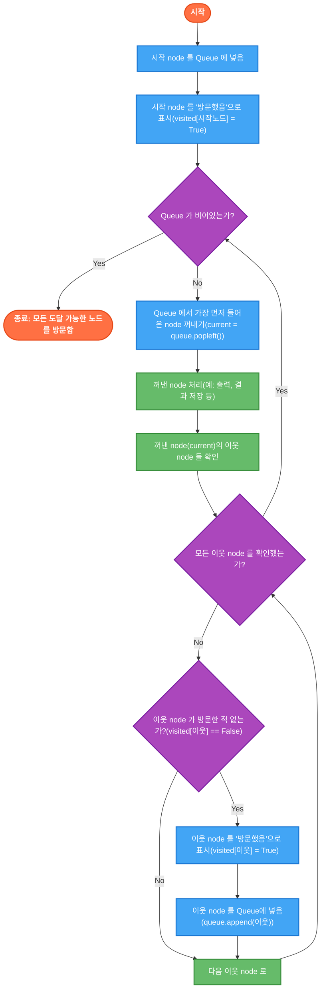
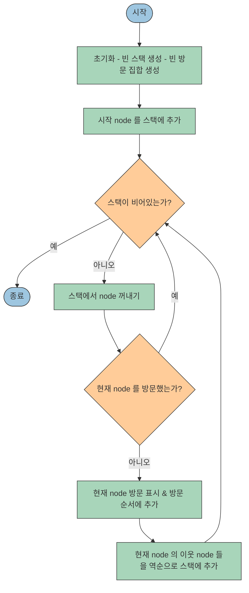

## 🚀 TL;DR

- 그래프는 **정점(Node)** 과 **간선(Edge)** 으로 구성된 관계 중심 데이터 구조로, 소셜 네트워크부터 지도 내비게이션까지 복잡한 연결 관계를 표현
- 그래프는 **방향성**(무방향/방향)과 **가중치**(없음/있음)에 따라 분류되며, Python에서는 `dict` 를 활용한 인접 리스트로 쉽게 구현 가능
- **BFS(너비 우선 탐색)** 는 **큐(Queue)** 자료구조를 사용해 가까운 노드부터 탐색하며, 최단 경로 보장(가중치 없는 그래프)
- **DFS(깊이 우선 탐색)** 는 **스택(Stack)** 또는 **재귀**를 사용해 한 방향으로 깊게 탐색하며, 경로 존재 확인과 사이클 탐지에 효과적
- BFS 는 **최단 거리 계산**, **레벨별 탐색**에 유리하고, DFS는 **경로 존재 여부**, **사이클 탐지**, **위상 정렬**에 적합
- 그래프 탐색은 미로 찾기, 소셜 네트워크 분석, 추천 시스템, 최적 경로 계산 등 다양한 실제 문제에 응용 가능
- AI 분야에서는 이미지 세그멘테이션, 추천 시스템, 게임 트리 탐색, 자율 주행 경로 계획 등에 그래프 탐색 알고리즘 활발히 활용

| 특징         | BFS (너비 우선 탐색)     | DFS (깊이 우선 탐색)                      |
| ---------- | ------------------ | ----------------------------------- |
| **탐색 방식**  | 가까운(넓은) 순서 (레벨별)   | 한 방향으로 최대한 깊게 탐색 후 백트래킹             |
| **자료구조**   | 큐 (Queue) - FIFO   | 스택 (Stack) 또는 재귀 (Recursion) - LIFO |
| **최단 경로**  | 보장 (가중치 없는 그래프)    | 보장 안 함                              |
| **메모리 사용** | 넓은 그래프에서 메모리 많이 사용 | 깊은 그래프에서 메모리 효율적                    |
| **주요 활용**  | 최단 경로, 레벨별 탐색      | 경로 존재 확인, 사이클 탐지, 위상 정렬             |
{: .table-responsive .w-100}

## 📓 실습 Jupyter Notebook

- [기본 적인 그래프 자료구조 실습](https://github.com/yuiyeong/notebooks/blob/main/graph/basic_graph.ipynb)
- [여러 그래프 탐색 실습](https://github.com/yuiyeong/notebooks/blob/main/graph/diverse_graph_example.ipynb)

## 🌐 그래프 (Graph) 란?

- 여러 개의 **점(정점 Vertex 또는 노드 Node)** 들이 서로 **선(간선 Edge 또는 링크 Link)** 으로 연결된 관계를 표현하는 자료구조
- 데이터들이 순서대로 나열된 리스트와 달리, 그래프는 **데이터 간의 관계 중심**으로 얽혀있는 비선형 구조

### 그래프의 구성 요소

- **정점 (Vertex / Node)**: 데이터를 나타내는 '점'
    - 예: 사람, 도시, 웹페이지 등
- **간선 (Edge / Link)**: 정점 사이의 '관계'를 나타내는 '선'
    - 예: 친구 관계, 도로, 웹 링크 등


### 왜 그래프를 사용할까?

세상의 많은 것들이 **서로 연결된 관계**를 가지고 있다. 이런 복잡한 연결 구조를 표현하고 분석하는 데 그래프가 아주 유용하다!
- **소셜 네트워크**: 카카오톡 친구 목록, 페이스북 인맥 관계
- **지도 및 네비게이션**: 지하철 노선도, 도로망, GPS 내비게이션의 경로 탐색
- **웹**: 인터넷 웹페이지 간의 하이퍼링크 연결
- **추천 시스템**: 사용자-상품 관계 분석을 통한 추천 알고리즘

> 그래프는 관계를 중심으로 데이터를 표현하기 때문에, 연결 패턴을 분석하거나 최단 경로를 찾는 등의 작업에 최적화된 자료구조이다.
{: .prompt-tip}

## 🔍 그래프의 종류

### 방향성에 따른 분류

- **무방향 그래프 (Undirected Graph)**
    - 간선에 방향이 없다.
    - A와 B가 연결되면, B도 A와 연결됨
    - 예: 친구 관계 (A가 B의 친구면, B도 A의 친구)
- **방향 그래프 (Directed Graph)**
    - 간선에 화살표처럼 방향이 있다.
    - A에서 B로 가는 간선이 있다고 해서, B에서 A로 가는 간선이 있는 것은 아님
    - 예: 웹페이지 링크 (A가 B를 링크해도, B가 A를 링크할 필요는 없음)


### 가중치 유무에 따른 분류

- **가중치 그래프 (Weighted Graph)**
    - 간선마다 숫자 값(가중치/비용)이 있음
    - 예: 도시 간 거리, 도로 통행료, 네트워크 대역폭

- **비가중치 그래프 (Unweighted Graph)**
    - 간선에 별도 값이 없음 (모든 연결이 동일한 중요도)
    - 예: 단순 친구 관계망 (연결 여부만 중요)


> 참고! 방향이 있으면서, 가중치가 있을 수 있다. 즉, 방향성 유무와 가중치 유무가 겹칠 수 있다.
{: .prompt-tip}

## 📝 그래프를 코드로 표현하는 방법: 인접 리스트(Adjacency List)!


- 그래프의 연결 정보를 컴퓨터가 처리할 수 있도록 저장하는데 여러 방법이 있지만, 가장 많이 사용되는 **인접 리스트(Adjacency List)** 방식

### 인접 리스트 (Adjacency List) - dict 활용

- **아이디어**: "각 정점마다, 그 정점과 직접 연결된 이웃(인접 정점)들의 목록을 유지하자!"
- **파이썬 구현**: **dict**를 사용하는 것이 가장 편리함
    - **Key**: 각 정점 (예: 'A', 'B', 0, 1 등)
    - **Value**: 해당 정점과 직접 연결된 **이웃 정점들의 리스트 (또는 세트)**

아래 그래프는,

```
  A -- B
  |    |
  C -- D

```
다음과 같은 인접 리스트로 표현할 수 있다.
```python
graph = {
    "A": ["B", "C"],
    "B": ["A", "D"],
    "C": ["A", "D"],
    "D": ["B", "C"]
}
```

이렇게 표현하면 'A'의 이웃은 'B'와 'C'라는 것을 바로 알 수 있다!

### 인접 리스트의 장점
- **메모리 효율**: 딱 필요한 연결 정보만 저장해서, 특히 연결선(간선)이 많지 않은 **희소 그래프(Sparse Graph)** 에 좋음
- **이웃 찾기 빠름**: 특정 정점의 이웃들을 바로 리스트에서 꺼내볼 수 있음
- **구현 간단**: 파이썬 딕셔너리를 사용하면 직관적으로 구현 가능

> 인접 행렬(Adjacency Matrix)이라는 표(2차원 배열)를 이용하는 방법도 있지만, 연결이 적은 그래프에서는 메모리 낭비가 심해서 인접 리스트를 더 많이 사용한다.
> {: .w-75 .center}
{: .prompt-tip}

### 파이썬 구현 예시 (defaultdict 활용)

```python
from collections import defaultdict

# 무방향 그래프 생성 함수
def create_undirected_graph():
    """
    그래프 형태
	    A -> ['B', 'C']
		B -> ['A', 'D']
		C -> ['A', 'D']
		D -> ['B', 'C']
    """
    graph = defaultdict(list)

    # 간선 추가 함수
    def add_edge(u, v):
        graph[u].append(v)
        graph[v].append(u)  # 무방향이므로 양쪽에 추가

    # 간선 정보 추가
	add_edge("A", "B")
	add_edge("A", "C")
	add_edge("B", "D")
	add_edge("C", "D")

    return graph

# 방향 그래프 생성 함수
def create_directed_graph():
    """
    그래프 형태
	    A -> ['B', 'C']
		B -> ['D']
		C -> ['D']
    """
    graph = defaultdict(list)

    # 간선 추가 함수 (단방향)
    def add_edge(u, v):
        graph[u].append(v)  # u에서 v로 가는 간선만 추가

    # 간선 정보 추가
	add_edge("A", "B")
	add_edge("A", "C")
	add_edge("B", "D")
	add_edge("C", "D")

    return graph

# 가중치 그래프 생성 함수
def create_weighted_graph():
    """
    그래프 형태
	    A -> [('B', 10), ('C', 5)]
		B -> [('A', 10), ('D', 7)]
		C -> [('A', 5), ('D', 15)]
		D -> [('B', 7), ('C', 15)]
    """
    graph = defaultdict(list)

    # 가중치 간선 추가 함수
    def add_edge(u, v, weight):
        # (목적지, 가중치) 튜플 저장
        graph[u].append((v, weight))
        graph[v].append((u, weight))

    # 간선 정보 추가
	add_edge("A", "B", 10)
	add_edge("A", "C", 5)
	add_edge("B", "D", 7)
	add_edge("C", "D", 15)

    return graph
```

## 🔄 그래프 탐색 기본: BFS vs DFS

이렇게 만들어진 다양한 종류의 그래프는 그 데이터를 어떻게 읽어야(탐색) 할까?


### BFS (너비 우선 탐색, Breadth-First Search)

- **핵심 컨셉**: "가까운 곳부터 차근차근, 옆으로 넓게!"
- **동작 방식**
    - 시작점에서 가까운 순서(레벨 1 -> 레벨 2 -> ...)대로 탐색
    - 마치 물결이 퍼져나가는 모습과 같음
- **구현**: 큐(Queue) 자료구조 사용
- **주요 용도**: **최단 거리** 찾기에 유리
### DFS (깊이 우선 탐색, Depth-First Search)

- **핵심 컨셉**: "한 길로 끝까지 파고들어 보자!"
- **동작 방식**
    - 한 방향으로 갈 수 있는 데까지 깊숙이 들어갔다가, 막히면 돌아나와 다른 길로 탐색
    - 마치 미로 찾기 할 때 한쪽 벽만 따라가는 느낌
- **구현**: 스택(Stack) 또는 재귀 함수 사용
- **주요 용도**: **경로의 존재 여부** 확인 등에 활용
## 🌊 너비 우선 탐색 (BFS) 란?

너비 우선 탐색(Breadth-First Search, BFS)은 그래프 탐색 알고리즘 중 하나로, 시작 정점(노드)에서 **가까운 정점부터** 순서대로, 즉 **넓게(너비 우선)** 탐색하는 방법입니다.

### 핵심 아이디어
BFS는 시작 노드에서 출발하여 **거리가 1인 이웃**들을 모두 방문하고, 그 다음 **거리가 2인 이웃**들을 모두 방문하는 방식으로, 마치 물결이 퍼져나가듯 탐색을 진행합니다.


### 주요 특징
- **큐(Queue)** 자료구조를 사용하여 구현 (FIFO: First-In, First-Out)
- **최단 경로 보장** (가중치 없는 그래프): 시작 노드에서 특정 노드까지의 가장 적은 간선 수를 거치는 경로를 찾을 수 있다.
- 재귀적으로 동작하지 않음 (반복문과 queue 사용)

> BFS 는 마치 연못에 돌을 던졌을 때 물결이 동심원으로 퍼져나가는 것처럼, 시작점으로부터 거리가 가까운 순서대로 노드들을 방문한다.
{: .prompt-tip}

## ⚙️ BFS 동작 원리: 큐(Queue)가 핵심!
- BFS가 레벨 별 탐색을 할 수 있는 비결은 바로 **큐(Queue)** 자료구조를 사용하기 때문이다. 
- 바로, Queue 의 **먼저 들어온 것이 먼저 나가는(FIFO)** 특징이 그 핵심이다.
### 알고리즘
1. **시작**
    - 탐색 **시작 node**를 **Queue** 에 넣는다.
    - "이미 방문했다"는 표시를 남긴다. (`visited` 데이터) => 재방문을 하지 않기위해
2. **탐색 (Queue 가 빌 때까지 반복)**:
    - Queue 에서 **가장 먼저 들어왔던 노드**를 꺼낸다. (`popleft`)
    - 꺼낸 노드를 **처리**한다 (예: 화면에 출력)
    - 꺼낸 노드의 **연결된 이웃 노드**들을 살펴본다.
    - 이웃 노드 중 **아직 방문 안 한 노드**가 있다면,
        - "방문했다"고 **표시**하고,
        - **Queue 에 넣는다.** (다음 레벨 탐색 대상)
3. **종료**: Queue 가 비면, 시작 node 에서 갈 수 있는 모든 node 를 방문한 것이다!



> 핵심: queue 에 먼저 들어간 node (가까운 node )가 먼저 나오고, 그 이웃들이 queue 의 뒤쪽에 추가된다. 따라서 자연스럽게 같은 레벨부터 탐색하게 되는 것이다!
{: .prompt-tip}

## ⏱️ BFS 시간 및 공간 복잡도
### 시간 복잡도: O(V + E)

- V: 노드(정점) 개수, E: 간선 개수
- 모든 노드를 정확히 한 번씩 방문: O(V)
- 모든 간선을 한 번씩 검사: O(E)라
- 인접 리스트 사용 시 위 두 작업이 주요 비용이므로 총 O(V + E)

### 공간 복잡도: O(V)

- 큐에 최악의 경우 모든 노드가 동시에 들어갈 수 있음: O(V)
- 방문 기록(`visited`)도 모든 노드 정보를 저장: O(V)

> 💡 BFS는 그래프의 크기에 비례하는 매우 효율적인 알고리즘이다. 특히 간선보다 노드가 훨씬 많은 희소 그래프에서도 좋은 성능을 보인다.
{: .prompt-tip}

## 🗺️ BFS Python Code 예시

### BFS 기본 구현

- 그래프를 인접 리스트로 만든다.
```python
graph = {
    "A": ["B", "C"],
    "B": ["A", "D", "E"],
    "C": ["A", "F"],
    "D": ["B"],
    "E": ["B", "F"],
    "F": ["C", "E"],
}
```
- `collections.deque` 를 사용하는 이유 
	- **양쪽에서 효율적인 삽입과 삭제**를 지원하기 때문이다. 
	- 일반 list 로 queue 를 구현하면 pop(0) 가 O(n) 시간 복잡도를 가져 비효율적

```python
from collections import deque

def bfs(graph: dict, start: str) -> list[str]:  
    visited = set()  # 방문 기록용 set  
    visited.add(start)  # 시작 node 에 방문 표시  
    queue = deque([start])  # queue 생성 및 시작 node 추가  
  
    traversal_order = []  # 탐색 순서 리스트  
  
    while queue:  
        # node 꺼냄  
        node = queue.popleft()  
  
        # node 처리  
        traversal_order.append(node)  
  
        # node 의 이웃 처리  
        for neighbor in graph[node]:  
            # 방문하지 않은 이웃일 때만!  
            if neighbor not in visited:  
                # 방문 처리 및 queue 에 추가  
                visited.add(neighbor)  
                queue.append(neighbor)  
    return traversal_order

print("traversal order:", bfs(ex_graph, "A"))
traversal order: ['A', 'B', 'C', 'D', 'E', 'F']
```
### 최단 경로 찾기

> BFS 가 최단 경로를 찾을 수 있는 경우는, 모든 간선의 가중치가 동일한 경우(보통 가중치가 모두 1인 경우)에 한정된다. 이것은 BFS 가 node 를 "레벨" 별로 탐색하기 때문이다. 즉, 시작 node 로부터 거리가 1인 모든 node, 그 다음 거리가 2인 모든 node... 이런 식으로 진행된다.
>
> 가중치가 다양한 그래프에서 최단 경로를 찾으려면 다음과 같은 알고리즘을 사용해야 한다.
> 
>`다익스트라(Dijkstra) 알고리즘`
> 	- 음이 아닌 가중치가 있는 그래프에서 최단 경로를 찾는 알고리즘
> 	- 우선순위 큐를 사용하여 현재까지 알려진 가장 짧은 경로를 가진 노드부터 처리
> 
>`벨만-포드(Bellman-Ford) 알고리즘`
> 	- 음의 가중치가 있는 그래프에서도 최단 경로를 찾을 수 있음
> 	- 다익스트라보다 느리지만 음의 가중치와 음의 사이클을 처리할 수 있음
>
>`A* 알고리즘`
> 	- 휴리스틱을 사용하여 다익스트라 알고리즘을 개선한 것
> 	- 목표 노드까지의 예상 거리를 고려하여 탐색 방향을 유도
> 
> 예를 들어, 도시 간 거리가 다른 도로 네트워크에서 최단 거리를 찾을 때는 BFS 대신 다익스트라 알고리즘을 사용해야 한다. BFS는 단순히 "거쳐가는 도시 수"만 최소화할 수 있으며, 실제 거리(km)를 최소화하지는 못한다.
{: .prompt-tip}

- 앞선 기본 구현의 bfs 를 응용
- 이것은 오직 **가중치 없는 그래프**에서만 가능!

```python
from collections import deque

def find_shortest_path(graph: dict, start: str, end: str) -> list[str]:  
    if start not in graph or end not in graph:  
        return []  
  
    if start == end:  
        return [start]  
  
    visited = {start}  
    # queue 에 node 와 이 node 까지 온 경로를 저장  
    queue = deque([(start, [start])])  # (node, 경로)  
  
    while queue:  
        node, path = queue.popleft()  
  
        for neighbor in graph.get(node, []):  
            if neighbor == end:  # 목표 도달!  
                return path + [neighbor]  
  
            if neighbor not in visited:  
                visited.add(neighbor)  
                # 현재까지의 경로에 이웃을 추가  
                queue.append((neighbor, path + [neighbor]))  
    # 경로를 찾을 수 없음  
    return []  

print("A 에서 F 까지 최단 경로:", find_shortest_path(ex_graph, "A", "F"))
# A 에서 F 까지 최단 경로: ['A', 'C', 'F']
```
> 이 구현에서는 각 node 에 도달하는 경로를 queue 에 함께 저장하여, 목표 node 에 도달했을 때 바로 경로를 반환할 수 있도록 했다.
{: .prompt-tip}

### 노드 간 최단 거리 계산
- 앞선 최단 경로 찾기를 응용
- 노드 간의 최단 거리(간선 수)만 필요한 경우, 다음과 같이 구현할 수 있다.

```python
def find_shortest_distance(graph: dict, start: str, end: str) -> int:  
    if start not in graph or end not in graph:  
        return 0  
  
    if start == end:  
        return 0  
  
    distances = {start: 0}  # 방문 node 와 그 node 까지의 거리를 저장  
    queue = deque([start])  
  
    while queue:  
        node = queue.popleft()  
        current_distance = distances.get(node, 0)  
  
        for neighbor in graph.get(node, []):  
            if neighbor == end:  # 목표 도달!  
                return current_distance + 1  
  
            if neighbor not in distances:  
                distances[neighbor] = current_distance + 1  
                queue.append(neighbor)  
    return -1

print("A 에서 F 까지의 최단거리:", find_shortest_distance(ex_graph, "A", "F"))
# A 에서 F 까지의 최단거리: 2
```

> 이 구현에서는 distances dict 가 방문 여부 체크와 거리 저장의 두 가지 역할을 동시에 수행한다.
{: .prompt-tip}

### 최단 경로 찾기 예시 +
> 미로 찾기, 퍼즐 게임의 최소 이동 횟수, 소셜 네트워크에서 "몇 다리 건너" 관계 찾기 등의 코딩 테스트 문제로 나온다.
{: .prompt-tip}

{: .w-50 .center}

- 미로에서 S(0, 0) 부터 E(4, 4) 까지의 최단 경로 찾기
- 여기서 0 은 이동 가능한 경로, 1 은 벽이다.
- 텍스트로 표현하면 아래와 같다(보통 이런 문제들은 input 도 2D array 로 넘겨준다.)
```
0 1 0 0 0
0 1 0 1 0
0 0 0 1 0
1 1 0 1 0
0 0 0 0 0
```

- 이 미로를 그래프 구조로 생각해본다면, 
	- 노드(vertex): 미로의 각 칸 (row, column)
	- 간선(edge): *상하좌우*로 인접한 칸 사이의 연결 (이동 가능한 경우에만)
	- 가중치(weight): 모든 간선의 가중치는 1 (한 칸 이동은 거리 1)

{: .w-75 .center}

우선, input 으로 들어온 2D array 로 부터 인접 리스트를 만든다.

```python
from collections import deque, defaultdict  
  
graph = defaultdict(list)  
for i, row in enumerate(maze):  
    for j, _ in enumerate(row):  
        node = (i, j)  
        neighbors = []  
        for direction in [(0, 1), (0, -1), (1, 0), (-1, 0)]: # 이웃 찾기  
            # 이웃 노드  
            neighbor = (i + direction[0], j + direction[1])  
            if neighbor[0] < 0 or neighbor[0] >= len(maze): # 좌표 밖이라서 무시  
                continue  
  
            if neighbor[1] < 0 or neighbor[1] >= len(maze[0]): # 좌표 밖이라서 무시  
                continue  
  
            value = maze[neighbor[0]][neighbor[1]]  
            if value == 0: # value 가 0 이면 진짜 이웃, 1 이면 이웃이 아님  
                neighbors.append(neighbor)  
        graph[node] = neighbors
```

위 코드 진행 후 graph 를 출력해보면 아래와 같다.

```
(0, 0) => [(1, 0)]
(0, 1) => [(0, 2), (0, 0)]
(0, 2) => [(0, 3), (1, 2)]
(0, 3) => [(0, 4), (0, 2)]
(0, 4) => [(0, 3), (1, 4)]
(1, 0) => [(2, 0), (0, 0)]
(1, 1) => [(1, 2), (1, 0), (2, 1)]
(1, 2) => [(2, 2), (0, 2)]
(1, 3) => [(1, 4), (1, 2), (0, 3)]
(1, 4) => [(2, 4), (0, 4)]
(2, 0) => [(2, 1), (1, 0)]
(2, 1) => [(2, 2), (2, 0)]
(2, 2) => [(2, 1), (3, 2), (1, 2)]
(2, 3) => [(2, 4), (2, 2)]
(2, 4) => [(3, 4), (1, 4)]
(3, 0) => [(4, 0), (2, 0)]
(3, 1) => [(3, 2), (4, 1), (2, 1)]
(3, 2) => [(4, 2), (2, 2)]
(3, 3) => [(3, 4), (3, 2), (4, 3)]
(3, 4) => [(4, 4), (2, 4)]
(4, 0) => [(4, 1)]
(4, 1) => [(4, 2), (4, 0)]
(4, 2) => [(4, 3), (4, 1), (3, 2)]
(4, 3) => [(4, 4), (4, 2)]
(4, 4) => [(4, 3), (3, 4)]
```

이렇게 인접 리스트를 만들었으므로, 이전의 최단 경로 알고리즘과 같이 진행하면 된다.

```python
def find_shortest_path_in_maze(maze_graph: defaultdict, start: tuple[int, int], end: tuple[int, int]) -> list:
    # 앞에서 작성했었던, 최단 경로 코드와 같다.
    visited = set(start)  
    queue = deque([(start, [start])])  
  
    while queue:  
        node, path = queue.popleft()  
  
        for neighbor in maze_graph.get(node, []):  
            if neighbor == end:  
                return path + [neighbor]  
  
            if neighbor not in visited:  
                visited.add(neighbor)  
                queue.append((neighbor, path + [neighbor]))  
    return []

print("(0, 0) -> (4, 4) 까지의 경로:", find_shortest_path_in_maze(graph, (0, 0), (4, 4)))
# (0, 0) -> (4, 4) 까지의 경로: [(0, 0), (1, 0), (2, 0), (2, 1), (2, 2), (3, 2), (4, 2), (4, 3), (4, 4)]
```

위와 같이 input 으로 들어온 2D array 를 인접 리스트로 변경한 뒤에, bfs 를 진행할 수도 있지만 이 두 과정을 하나의 프로세스로 진행하는 것이 보통이다.

```python
def solve_maze(  
        maze: list[list[int]], start: tuple[int, int], end: tuple[int, int]  
) -> list:  
    len_row, len_col = len(maze), len(maze[0])  
    directions = [(0, -1), (0, 1), (-1, 0), (1, 0)]  # 상, 하, 좌, 우  
  
    visited = set(start)  
    queue = deque([(start, [start])])  # node 와, node 까지의 경로  
    while queue:  
        (row, col), path = queue.popleft()  
        if (row, col) == end:  
            return path  
  
        for direction in directions:  # 내 이웃을 순회하는 것!  
            neighbor = (row + direction[0], col + direction[1])  
            if neighbor[0] < 0 or len_row <= neighbor[0]:  
                continue  # 좌표 밖은 무시  
  
            if neighbor[1] < 0 or len_col <= neighbor[1]:  
                continue  # 좌표 밖은 무시  
  
            if maze[neighbor[0]][neighbor[1]] == 0:  # 0 일 때만 진짜 이웃  
                if neighbor not in visited:  
                    visited.add(neighbor)  
                    queue.append((neighbor, path + [neighbor]))  
    return [] # 경로 없음  
  
  
print("(0, 0) -> (4, 4):", solve_maze(input_maze, (0, 0), (4, 4)))
# (0, 0) -> (4, 4): [(0, 0), (1, 0), (2, 0), (2, 1), (2, 2), (3, 2), (4, 2), (4, 3), (4, 4)]
```

- 가는 경로를 표현하고자 할 때는 아래와 같이 작성할 수도 있다.
	- 경로를 다 찾았을 때(`node == end`), 간 경로를 시각화한다.

```python
def solve_maze_with_visualization(  
    maze: list[list[int]], start: tuple[int, int], end: tuple[int, int]  
) -> list:  
    len_row, len_col = len(maze), len(maze[0])  
    directions = [(0, -1), (0, 1), (-1, 0), (1, 0)]  
  
    visited = set(start)  
    queue = deque([(start, [start])])  
  
    while queue:  
        node, path = queue.popleft()  
        if node == end:  
            # 경로 찾았으므로, 경로 보여주고(1), 그 경로 반환(2)  
  
            visual_board = [row[:] for row in maze]  # 보여주기 위해서 미로판을 복사  
            visual_board[start[0]][start[1]] = "S"  # 시작점 표시  
            visual_board[end[0]][end[1]] = "E"  # 도착점 표시  
  
            for neighbor in path[1:]:  
                visual_board[neighbor[0]][neighbor[1]] = "*"  
  
            # 시각화를 위한 보드판 출력  
            for visual_row in visual_board:  
                print(" ".join([str(cell) for cell in visual_row]))  
  
            return path  
  
        for direction in directions:  
            neighbor = (node[0] + direction[0], node[1] + direction[1])  
  
            if neighbor[0] < 0 or len_row <= neighbor[0]:  
                continue  
  
            if neighbor[1] < 0 or len_col <= neighbor[1]:  
                continue  
  
            if maze[neighbor[0]][neighbor[1]] == 0:  
                visited.add(neighbor)  
                queue.append((neighbor, path + [neighbor]))  
    return []  
  
  
print("경로:", solve_maze_with_visualization(input_maze, (0, 0), (4, 4)))

# S 1 0 0 0
# * 1 0 1 0
# * * * 1 0
# 1 1 * 1 0
# 0 0 * * *
# 
# (0, 0) -> (4, 4): [(0, 0), (1, 0), (2, 0), (2, 1), (2, 2), (3, 2), (4, 2), (4, 3), (4, 4)]
```

### 연결 요소 (Connected Components) 찾기

> DFS 로도 가능!
{: .prompt-tip}

연결 요소란 그래프 내에서 서로 연결된 node 들의 집합이다. 무방향 그래프에서는 모든 node 쌍 사이에 경로가 존재하는 **부분 그래프**를 의미합니다.


{: .w-75 .center}

- 위 그래프는 아래와 같은 인접 리스트로 표현할 수 있다.

```python
graph = {  
    "A": ["B"],  
    "B": ["A", "C", "D"],  
    "C": ["B", "D"],  
    "D": ["B", "C"],  
    "E": ["F", "G"],  
    "F": ["E"],  
    "G": ["E"],  
    "H": [],  
}
```

- 무방향 그래프에서 서로 연결된 노드 집합들을 식별을 아래와 같이 할 수 있다.

```python
from collections import deque  
  
def find_connected_components(graph: dict):  
    components = []  
    visited = set()  
  
    for node in graph:  
        if node not in visited: # 첫 방문 즉, 새로운 component 발견  
            component = []  
  
            # 여기서 부터는 기존의 bfs 와 같음  
            queue = deque([node])  
            visited.add(node)  
            while queue:  
                current = queue.popleft()  
  
                component.append(current) # node 처리  
  
                for neighbor in graph.get(current, []):  
                    if neighbor not in visited:  
                        visited.add(neighbor)  
                        queue.append(neighbor)  
            components.append(component)  
    return components  
  
find_connected_components(new_graph)
# [['A', 'B', 'C', 'D'], ['E', 'F', 'G'], ['H']]
```

### 이분 그래프 (Bipartite Graph) 검사

> DFS 로도 가능!
{: .prompt-tip}

이분 그래프는 **node 를 두 개의 독립적인 집합**으로 나눌 수 있고, **같은 집합에 속한 node 끼리는 인접하지 않는 그래프**를 말한다. BFS 를 사용해서, 그래프가 이분 그래프인지를 판별할 수 있다.
다시 말해서,
- node 는 집합 A와 집합 B로 나뉜다.
- A에 속한 어떤 node 도 A의 다른 node 와 연결되지 않는다.
- B에 속한 어떤 node 도 B의 다른 node 와 연결되지 않는다.
- 모든 간선은 A의 node 와 B의 node 를 연결한다.

이것을 정리해서 표현하자면, 아래와 같다.
- **집합 분할 조건**: 그래프의 모든 node 를 두 집합으로 분할할 수 있어야 함
- **간선 조건**: 모든 간선은 서로 다른 집합에 속한 node 를 연결해야 함
- **같은 집합 내 간선 금지**: 같은 집합에 속한 node 들 사이에는 간선이 존재하지 않아야 함

> 또한 이분 그래프 판별하는 데 사용할 수 있는 또 다른 조건들로 다음 내용이 있다.
> - **홀수 길이 사이클 부재**: 그래프에 홀수 길이의 사이클(cycle)이 없어야 함
 >   - 즉, 모든 사이클의 길이는 짝수여야 함
 >   - 이는 이분 그래프의 가장 중요한 특성 중 하나
> - **이색 칠하기 가능**: 그래프의 모든 node 를 두 가지 색으로 칠할 수 있어, 인접한 node 는 항상 다른 색을 가져야 함
>   - 인접했다는 것은 간선으로 연결되어 있다는 것이고,  연결은 다른 집합끼리만 가능한데,  색이 같다는 것은 같은 집합이라는 말이므로 모순이 된다!
>   - 이 조건은 BFS 나 DFS 를 이용한 알고리즘에서 주로 활용

{: .w-75 .center}

- 위 그래프는 아래와 같은 인접 리스트로 표현할 수 있다.

```python
graph = {  
    "A": ["C"],  
    "B": ["D"],  
    "C": ["A", "E", "H"],  
    "D": ["B", "F"],  
    "E": ["C", "G"],  
    "F": ["D"],  
    "G": ["E", "H"],  
    "H": ["C", "G"],  
}
```

- 이분 그래프 판별은 아래와 같은 코드로 확인할 수 있다.

```python
def is_bipartite(graph: dict) -> bool:
    """
    그래프의 모든 node 를 두 가지 색으로 칠할 수 있어야한다는
    조건을 바탕으로 만든 판별 코드
    """
    # 노드별 색상 저장 (0: 미방문, 1: 집합1, -1: 집합2)
    colors = {} # 색 집합이면서, 방문 체크
  
    for start_node in graph:  
        if start_node not in colors:  
            colors[start_node] = 1  # 방문 표시 및 속하는 집합 번호 표시  
  
            # bfs 시작
            queue = deque([start_node])  
            while queue:  
                node = queue.popleft()  
                current_color = colors[node]  
  
                # 이웃 처리  
                for neighbor in graph.get(node, []):  
                    if neighbor not in colors:  # 방문하지 않았다면,  
                        # 현재 색과 부호를 반대로 함으로써, 다른 집합임을 표현  
                        colors[neighbor] = -current_color  # 더불어 방문 표시  
                        queue.append(neighbor)  
                    elif colors[neighbor] == current_color:  
                        # 방문한 적이 있어 집합이 설정이 되었는데,
                        # 그 집합이 현재 집합과 같다!
                        # => 인접한 node 가 같은 색상이므로, 이분 그래프가 아니다.
                        return False
    return True

is_bipartite(graph)
# True
```

- 이분 그래프일 때, 나눠지는 그 2개의 집합을 받고 싶다면 아래와 같이 수정하면 된다.

```python
def is_bipartite(graph: dict) -> tuple[bool, set | None, set | None]:
    colors = {}  
  
    for start_node in graph:
        if start_node not in colors:  
            colors[start_node] = 1

            queue = deque([start_node])  
            while queue:  
                node = queue.popleft()  
                current_color = colors[node]  
  
                for neighbor in graph.get(node, []):  
                    if neighbor not in colors:
                        colors[neighbor] = -current_color
                        queue.append(neighbor)  
                    elif colors[neighbor] == current_color:
                        return False, None, None
    # 집합 2개로 나누는 부분만 추가 됨
    set1 = set()
    set2 = set()
    for node, color in colors.items():  
        if color == 1:  
            set1.add(node)  
        else:  
            set2.add(node)  
    return True, set1, set2  
  
is_bipartite(ex_graph02)
# (True, {'A', 'B', 'E', 'F', 'H'}, {'C', 'D', 'G'})
```

> 그래프가 이분 그래프인지 판별하는 것은 문제의 본질적인 구조를 파악하는 과정이다. 만약 그래프가 이분 그래프라면, 모든 node 를 두 집합으로 분할할 수 있고, 같은 집합 내의 node 들끼리는 절대 연결되지 않는다. 
> 이는 다음과 같은 몇 가지 중요한 의미를 갖는다.
> 
> - **자원 할당 가능성**: 이분 그래프라면 서로 충돌하는 요소들을 두 그룹으로 깔끔하게 분리할 수 있다는 뜻이다. 예를 들어, 시간표 작성 문제에서 서로 충돌하는 수업들을 오전/오후 두 타임으로 분리할 수 있는지 판단할 수 있다.
> - **최적화 가능성**: 이분 그래프 구조는 최대 매칭, 최소 버텍스 커버 같은 최적화 알고리즘을 적용할 수 있게 해준다. 이런 알고리즘들은 일반 그래프보다 이분 그래프에서 더 효율적으로 작동한다.
> - **문제 단순화**: 복잡한 관계 네트워크가 이분 그래프라면, 문제를 두 집합 간의 관계로 단순화할 수 있어 해결 방법이 더 명확해진다.
>
> 반면, 그래프가 이분 그래프가 아니라면,
> 
> - 더 복잡한 방법(예: 3-색칠 이상)이 필요하다는 신호
> - 단순한 이분법적 접근으로는 문제를 해결할 수 없다는 의미
> - 다른 알고리즘이나 접근 방식을 고려해야 함
> 
> 즉, 이분 그래프 판별은 "이 문제가 두 그룹으로 깔끔하게 나눌 수 있는 구조인가?"라는 근본적인 질문에 답하는 과정이며, 이는 효율적인 해결책 선택의 첫 단계가 된다. BFS가 이 판별을 효율적으로 할 수 있기 때문에 그래프 알고리즘에서 중요한 응용 사례로 꼽힌다.
{: .prompt-tip}

### 레벨별 순회 (Level Order Traversal)

시작 node 를 level 0 으로 시작하고, 이웃을 level 1, 그 이웃의 이웃들을 level 2, ... 하는 식으로 모든 연결된 node 를 탐색하는 방법
{: .w-75 .center}

- 위 그래프는 아래와 같은 인접 리스트로 표현할 수 있다.

```python
graph = {  
    "A": ["C"],  
    "B": ["D"],  
    "C": ["A", "E", "H"],  
    "D": ["B", "F"],  
    "E": ["C", "G"],  
    "F": ["D"],  
    "G": ["E", "H"],  
    "H": ["C", "G"],  
}
```

- 기존 bfs 방식에서 level 별로 그룹 짓는 로직을 추가한다.

```python
def traverse_on_level_order(graph: dict, start: str) -> list:  
    result = []  
  
    # 기본 bfs 와 같은데, 레벨만 같이 넣어준다.  
    visited = set(start)  
    queue = deque([(start, 0)])  # root node 는 level 이 0  
    while queue:  
        node, level = queue.popleft()  
  
        # 새 레벨 시작  
        if level == len(result):  
            result.append([])  # 새 레벨 그룹용 list 추가  
  
        # 현재 노드를 레벨 그룹 list 에 추가  
        result[level].append(node)  
  
        # 이제 이웃 처리  
        for neighbor in graph.get(node, []):  
            if neighbor not in visited:  
                visited.add(neighbor)  
                queue.append((neighbor, level + 1))  
  
    return result

traverse_on_level_order(graph, "A")
# [['A'], ['C'], ['E', 'H'], ['G']]
# 여기서 중요한 점은, B-D-F 는 연결되어있지 않기 때문에(다른 components
# A 에서 시작한 순회에 포함되지 않는다.
```

## 📊 성능 최적화 팁

대규모 그래프에서 BFS를 사용할 때, 고려할 최적화 기법 종류
- **양방향 BFS (Bidirectional BFS)**: 시작점과 목표점 양쪽에서 동시에 BFS를 실행하여 중간에서 만나면 종료
- **휴리스틱 BFS** (A* 알고리즘): 목표까지의 예상 거리를 고려하여 탐색 방향을 가이드
- **메모리 최적화**: node 를 객체 대신 간단한 ID 로 표현하여 메모리 사용량 감소
- **방문 노드 기록 최적화**: 큰 그래프에서는 세트 대신 비트벡터나 해시 테이블 사용 고려

## 🌲 깊이 우선 탐색 (DFS) 이란?

깊이 우선 탐색(Depth-First Search, DFS)은 그래프 탐색 알고리즘 중 하나로, 시작 정점에서 출발하여 **한 방향으로 갈 수 있을 때까지 최대한 깊게** 들어간 후, 더 이상 갈 곳이 없으면 **되돌아 나와(backtrack)** 다른 방향으로 탐색을 계속하는 방법이다.

### 핵심 아이디어

DFS는 현재 경로에서 갈 수 있는 가장 깊은 곳까지 우선적으로 탐색하고, 막히면 이전 갈림길로 돌아와 다른 경로를 시도합니다. 이 과정을 모든 노드를 방문할 때까지 반복한다.


### 특징
- **스택(Stack)** 자료구조 또는 **재귀 함수(Recursion)** 를 사용하여 구현 (LIFO: Last-In, First-Out)
- *최단 경로를 보장하지 않음 (BFS와의 주요 차이점)*
- 메모리 사용이 BFS에 비해 효율적일 수 있음 (특히 깊은 그래프에서)

> DFS는 미로 찾기에 비유할 수 있다. 한쪽 길을 계속 따라가다가 막다른 길에 도달하면, 마지막 갈림길로 돌아와 다른 길을 시도하는 방식과 유사하다.
{: .prompt-tip}

## ⚙️ DFS 동작 과정

DFS는 스택 또는 재귀를 사용하여 구현할 수 있다. 두 가지 방식 모두 본질적으로 같은 과정을 따르지만, 구현 방법이 다르다.

{: .w-75 .center}

- 위 그래프를 인접 리스트로 표현하면 다음과 같다.

```python
graph = {  
    "A": ["B", "C"],  
    "B": ["A", "D", "E"],  
    "C": ["A", "F", "G"],  
    "D": ["B"],  
    "E": ["B"],  
    "F": ["C"],  
    "G": ["C"],  
}
```

### 스택(Stack) 기반 반복적(Iterative) DFS

stack 을 활용한 DFS 구현은 다음과 같은 단계로 이루어진다.
1. **초기화**
    - 빈 stack 생성
    - 방문 여부를 기록할 자료구조(예: `set`) 생성
    - 시작 node 를 stack에 추가
2. **반복 (stack이 빌 때까지)**
    - stack 에서 node 하나를 꺼냄
    - 아직 방문하지 않았다면
        - 방문 표시 및 처리
        - 이웃 node 들 중 방문하지 않은 node 만 stack 에 추가
3. **종료**: stack 이 비워지면 탐색 완료

```python
def dfs_with_stack(graph: dict, start: str) -> list[str]:  
    stack = deque()  # 1-1. 빈 stack 생성
    visited = set()  # 1-2. 방문 여부를 기록할 set 생성
    traversal_order = []  # 탐색 순서 저장용 list

    stack.append(start)  # 1-3. 시작 node 를 stack에 추가
    
    while stack:  # 반복 (stack이 빌 때까지)
        node = stack.pop()  # 2-1. stack 에서 node 하나를 꺼냄
  
        if node not in visited: # 방문하지 않은 node 라면
            visited.add(node)  # 2-2. 방문 표시
            traversal_order.append(node)  # node 처리
  
            # 항상 알파벳 순으로 방문하도록 sorted(..,reverse=) 추가
            neighbors = sorted(graph.get(node, []), reverse=True)  
            for neighbor in neighbors:
                # 2-3. 이웃 node 중 방문하지 않은 node 만 stack 에 추가
                if neighbor not in visited:  
                    stack.append(neighbor)  
  
    return traversal_order  
  
print("stack 기반 dfs 로 탐색(A부터):", dfs_with_stack(graph, "A"))
# stack 기반 dfs 로 탐색(A부터): ['A', 'B', 'D', 'E', 'C', 'F', 'G']
```

> 이웃 node 를 stack 에 넣는 순서에 따라 실제 방문 순서가 달라질 수 있다. 알파벳 순서로 방문하고 싶다면, 이웃 node 들을 역순으로 stack 에 추가해야 한다.
{: .prompt-tip}

### 재귀(Recursion) 기반 DFS

재귀를 활용한 DFS 구현은 함수가 자기 자신을 호출하는 방식으로 이루어진다.
1. **현재 node 처리**
    - 현재 node 를 방문 표시
    - 필요한 작업 수행
2. **이웃 node 탐색**
    - 현재 node 의 모든 이웃 확인
    - 방문하지 않은 이웃에 대해 재귀적으로 DFS 호출

```python
def def_with_recursion(graph: dict, start: str) -> list[str]:  
    visited = set()  # 방문 기록
    traversal_order = []  # 방문 순서 기록
  
    def dfs_helper(node):  # 재귀함수!
        visited.add(node)  # 1-1. 현재 node 방문 표시
        traversal_order.append(node) # 1-2. 필요한 작업 수행 
  
        # 항상 알파벳 순으로 방문하도록 sorted(..) 추가  
        neighbors = sorted(graph.get(node, []))  
        for neighbor in neighbors:  
            if neighbor not in visited:  # 2-1. 현재 node 의 이웃 확인
                dfs_helper(neighbor)  # 2-2. 방문하지 않은 이웃을 재귀함수로 호출
  
    dfs_helper(start)  # 재귀적으로 탐색 시작  
  
    return traversal_order  
  
  
print("recursion 기반 dfs 로 탐색(A부터):", def_with_recursion(graph, "A"))
# recursion 기반 dfs 로 탐색(A부터): ['A', 'B', 'D', 'E', 'C', 'F', 'G']
```

> 재귀 방식은 코드가 더 간결하고 직관적이다. 시스템 호출 스택이 자동으로 노드의 방문 경로를 기억해주기 때문이다.
{: .prompt-tip}

### 🔍 DFS 동작 방식 시각화

간단한 그래프에서 DFS(stack)가 어떻게 동작하는지 시각적으로 살펴보자.
```
    A --- B --- C
    |     |
    D --- E
```

시작 노드 A에서 스택 기반 DFS를 수행하면, 이웃 노드를 알파벳 순서로 방문하고자 할 때,
1. 스택에 A 추가: `[A]`
2. A 꺼내고 방문 표시, 이웃 B, D 역순으로 스택에 추가: `[D, B]`
3. B 꺼내고 방문 표시, 이웃 C, E 역순으로 스택에 추가: `[D, E, C]`
4. C 꺼내고 방문 표시, 이웃 없음: `[D, E]`
5. E 꺼내고 방문 표시, 이웃 D(이미 스택에 있음): `[D]`
6. D 꺼내고 방문 표시, 이웃 없음: `[]`
7. 스택이 비어서 종료

방문 순서: **A, B, C, E, D**


## ⏱️ DFS 시간 및 공간 복잡도

### 시간 복잡도: O(V + E)

- V: 노드(정점) 개수, E: 간선 개수
- 모든 노드와 간선을 한 번씩 방문하므로 O(V + E)
- 인접 리스트 표현 방식 기준

### 공간 복잡도: O(V)

- 스택(또는 재귀 호출 스택)에 최악의 경우 모든 노드가 쌓일 수 있음: O(V)
- 방문 기록을 위한 공간도 O(V) 필요

> BFS와 DFS는 동일한 시간/공간 복잡도를 가지지만, 그래프의 특성과 문제 유형에 따라 실제 성능 차이가 있을 수 있다.
{: .prompt-tip}

## 🛤️ DFS 활용 사례

### 경로 존재 확인 (Path Finding)

> BFS 로도 구현이 가능하다. 현실에서는 휴리스틱 A* 알고리즘을 사용한다.
{: prompt-tip}

두 node 사이에 경로가 존재하는지 확인하는 데 사용할 수 있다.

{: .w-75 .center}

- 위 그래프를 인접 리스트로 표현하면,

```python
graph = {  
    "A": ["B"],  
    "B": ["A", "D", "E"],  
    "C": ["F", "G"],  
    "D": ["B"],  
    "E": ["B", "H"],  
    "F": ["C"],  
    "G": ["C"],  
    "H": ["E"],  
}
```

- stack 기반 구현

```python
def has_path_with_stack(graph: dict, start: str, end: str) -> bool:  
    if start == end:  
        return True
  
    visited = set()  
    stack = deque([start])  
  
    while stack:  
        current = stack.pop()
        if current not in visited:  
            visited.add(current)

            if current == end:  # 경로 찾음!
                return True  
  
            for neighbor in graph.get(current, []):  
                if neighbor not in visited:  
                    stack.append(neighbor)  
    # 경로 없음  
    return False
print("A 와 H 사이에 경로가 있나?", has_path_with_stack(graph, "A", "H"))
print("A 와 G 사이에 경로가 있나?", has_path_with_stack(graph, "A", "G"))
# A 와 H 사이에 경로가 있나? True
# A 와 G 사이에 경로가 있나? False
```

- 재귀 기반 구현

```python
def has_path_with_recursion(graph: dict, start: str, end: str) -> bool:  
    if start == end:  
        return True  
  
    visited = set()  
  
    def dfs_helper(current: str) -> bool:  
        # 방문 처리  
        visited.add(current)  
  
        if current == end:  # 경로 찾음!
            return True  
  
        # 도달 못 했으므로, 이웃 node 확인  
        for neighbor in graph.get(current, []):  
            if neighbor not in visited:  
                # 방문하지 않은 이웃 node 에 대해서 재귀 함수로 경로 있는지 확인  
                return dfs_helper(neighbor)  
        return False  
  
    return dfs_helper(start)  
  
print("A 와 D 사이에 경로가 있나?", has_path_with_recursion(graph, "A", "D"))  
print("A 와 C 사이에 경로가 있나?", has_path_with_recursion(graph, "A", "C"))
# A 와 D 사이에 경로가 있나? True
# A 와 C 사이에 경로가 있나? False
```

### 사이클 탐지 (Cycle Detection)
> BFS 로 구현이 가능하지만, DFS 구현 하는 것이 훨씬 로직이 단순하다.
{: .prompt-tip}

- DFS 를 이용해서, 그래프 내에 사이클이 존재하는지 확인할 수 있다.
	- 그래프에서 **사이클(Cycle)** 이란, 시작 node 로 돌아오는 경로를 의미한다. 더 구체적으로,
	- 무방향 그래프: 같은 node 나 간선을 중복해서 지나지 않고, 시작 node 로 돌아올 수 있는 경로
	- 방향 그래프: 간선의 방향을 따라 이동하면서 시작 node 로 돌아올 수 있는 경로

- 사이클 탐지에서는, 현재 node 의 이전 경로 정보가 중요하다. 
	- 무방향 그래프: 부모 노드만 알면 된다.
	- 방향 그래프: 현재 DFS 경로에서 방문 중인 모든 노드를 추적해야 한다.

{: .w-75 .center}

- 위 그래프를 인접 리스트로 표현하면,

```python
graph = {  
    "A": ["B"],  
    "B": ["A", "D", "H"],  
    "C": ["F", "G"],  
    "D": ["B", "E"],  
    "E": ["D"],  
    "F": ["C", "G"],  
    "G": ["C", "F"],  
    "H": ["B"],  
}
```

- stack 기반 구현

```python
def has_cycle_in_graph_with_stack(graph: dict) -> bool:  
    visited = set()  
  
    # 컴포넌트가 여러 개 일 수 있으므로, 모든 node 에 대해서 검사한다.  
    for start_node in graph:  
        if start_node in visited:  
            continue  
  
        # (node, 그 node 의 부모) 를 저장  
        stack = deque([(start_node, None)])  
  
        # start_node 에서 시작한 DFS 탐색 중 방문한 node 들  
        local_visited = set() #  
        while stack:  
            current, parent = stack.pop()  
            for neighbor in graph.get(current, []):  
                if neighbor == parent:  
                    continue  
  
                if neighbor in local_visited:  
                    return True  
  
                local_visited.add(neighbor)  
                stack.append((neighbor, current))  
        visited.update(local_visited) # 컴포넌트로 돌았던 것을 다시 검사하지 않도록  
    return False  
  
has_cycle_in_graph_with_stack(graph)
has_cycle_in_graph_with_stack({"A": ["B"], "B": ["A"]})
# True
# False
```

- 재귀 기반 구현

```python

def has_cycle_in_graph_with_recursion(graph: dict) -> bool:  
    visited = set()  
  
    def dfs_helper(current: str, parent: str | None) -> bool:  
        visited.add(current)  
  
        for neighbor in graph.get(current, []):  
            if neighbor == parent:  
                continue  
  
            # 부모 node 가 아닌데 방문했다면, 사이클 존재  
            if neighbor in visited:  
                return True  
            elif dfs_helper(neighbor, current):  
                return True  
        return False  
    # 컴포넌트가 여러 개 일 수 있으므로, 모든 node 에 대해서 검사  
    for start_node in graph:  
        if start_node in visited:  
            continue  
  
        if dfs_helper(start_node, None):  
            return True  
  
    return False

has_cycle_in_graph_with_recursion(graph)
has_cycle_in_graph_with_recursion({"A": ["B"], "B": ["A"]})
# True
# False
```

### 위상 정렬 (Topological Sort)

> 다음 사항을 주의해야한다.
> - 위상 정렬의 결과는 유일하지 않을 수 있음 (여러 가능한 순서가 존재할 수 있음)
> - 사이클이 있는 그래프에서는 위상 정렬이 불가능 (모순된 관계 존재)
> - 모든 노드가 연결되지 않은 그래프(여러 컴포넌트)에서도 위상 정렬 가능
{: .prompt-warning}

- 위상 정렬은 **방향 비순환 그래프(DAG, Directed Acyclic Graph)** 에서 node 들을 선후 관계에 따라 일렬로 나열하는 알고리즘
- 쉽게 말해, 작업들 간에 "이 작업은 저 작업보다 먼저 해야 한다"와 같은 선행 관계가 있을 때, 모든 선행 관계를 위반하지 않는 작업 순서를 찾아주는 것

위상 정렬을 하려면,
- **방향성**: 모든 간선은 방향을 가짐 (A → B는 "A가 B보다 먼저 와야 함"을 의미)
- **비순환**: 그래프 내에 순환(사이클)이 없어야 함 (순환이 있으면 모순된 선행 관계가 존재)
- **선행 관계 보존**: 결과 순서에서 모든 노드는 자신의 선행 노드들보다 뒤에 위치

```python
def topological_sort(graph):
    """위상 정렬 함수"""
    visited = set()
    temp_mark = set()  # 임시 방문 표시 (사이클 탐지용)
    result = []
    
    def dfs_helper(node):
        # 사이클 감지
        if node in temp_mark:
            raise ValueError("Graph has a cycle, topological sort not possible")
        
        # 이미 방문했다면 스킵
        if node in visited:
            return
        
        # 임시 방문 표시
        temp_mark.add(node)
        
        # 이웃 노드 방문
        for neighbor in graph.get(node, []):
            dfs_helper(neighbor)
        
        # 방문 완료 표시
        temp_mark.remove(node)
        visited.add(node)
        
        # 결과에 추가 (역순)
        result.insert(0, node)
    
    # 모든 노드에 대해 DFS 수행
    for node in graph:
        if node not in visited:
            dfs_helper(node)
    
    return result
```

- 알고리즘 동작 방식
	1. 모든 node 를 "미방문" 상태로 초기화
	2. 각 node 에서 DFS 시작
	    - node 를 "임시 방문" 표시 (현재 탐색 경로 추적)
	    - node 의 모든 이웃 방문
	    - node 를 "영구 방문" 표시
	    - **결과 리스트의 앞쪽에 node 추가** (역순 삽입)
	3. 탐색 중 "임시 방문" node 를 다시 만나면 사이클 존재 → 위상 정렬 불가능

> DFS 기반 위상 정렬의 핵심은 "더 이상 갈 곳이 없는" node (끝 node)부터 역순으로 결과에 추가하는 것이다. 이렇게 하면 의존성이 없는 node 가 먼저 처리된다.
{: .prompt-tip}

- 활용 예시) 작업 스케줄링, 선수 과목 계획 등

```python
def topological_sort_dfs(graph):
    """
    DFS를 이용한 위상 정렬 구현
    
    Args:
        graph: 방향 그래프의 인접 리스트
        
    Returns:
        위상 정렬된 노드 리스트 (선후 관계 유지)
    """
    # 방문 상태 추적 (0: 미방문, 1: 임시 방문, 2: 영구 방문)
    visited = {}
    for node in graph:
        visited[node] = 0
    
    # 결과 저장
    topo_order = []
    
    # 사이클 탐지를 위한 플래그
    has_cycle = [False]
    
    def dfs_topo(node):
        # 임시 방문 표시 (현재 경로 추적)
        visited[node] = 1
        
        # 이웃 방문
        for neighbor in graph.get(node, []):
            # 미방문 이웃
            if visited.get(neighbor, 0) == 0:
                dfs_topo(neighbor)
            # 임시 방문 이웃 (사이클 발견)
            elif visited.get(neighbor, 0) == 1:
                has_cycle[0] = True
        
        # 영구 방문 표시
        visited[node] = 2
        # 위상 정렬 순서에 추가 (역순)
        topo_order.insert(0, node)
    
    # 모든 노드에 대해 DFS 실행
    for node in graph:
        if visited[node] == 0:
            dfs_topo(node)
    
    # 사이클이 있으면 위상 정렬 불가능
    if has_cycle[0]:
        return None
    
    return topo_order

# 테스트
dag = {
    'A': ['C'],
    'B': ['C', 'D'],
    'C': ['E'],
    'D': ['F'],
    'E': ['F', 'H'],
    'F': ['G'],
    'G': [],
    'H': []
}

print("위상 정렬 결과:", topological_sort_dfs(dag))
# 가능한 출력: ['B', 'A', 'C', 'D', 'E', 'F', 'H', 'G']
```

## 🔄 BFS vs DFS 비교 및 선택 가이드

| 특징         | BFS (너비 우선 탐색)     | DFS (깊이 우선 탐색)                      |
| ---------- | ------------------ | ----------------------------------- |
| **탐색 방식**  | 가까운(넓은) 순서 (레벨별)   | 한 방향으로 최대한 깊게 탐색 후 백트래킹             |
| **자료구조**   | 큐 (Queue) - FIFO   | 스택 (Stack) 또는 재귀 (Recursion) - LIFO |
| **최단 경로**  | 보장 (가중치 없는 그래프)    | 보장 안 함                              |
| **메모리 사용** | 넓은 그래프에서 메모리 많이 사용 | 깊은 그래프에서 메모리 효율적                    |
| **주요 활용**  | 최단 경로, 레벨별 탐색      | 경로 존재 확인, 사이클 탐지, 위상 정렬             |
{: .table-responsive .w-100}

### 언제 BFS를 선택해야 할까?

- **최단 경로**를 찾아야 할 때 (가중치 없는 그래프)
- **레벨별 탐색**이 필요할 때 (예: 소셜 네트워크의 친구 추천)
- **해답이 얕은 깊이**에 있을 가능성이 높을 때
- **탐색 깊이가 매우 깊어질 가능성**이 있고 스택 오버플로우가 우려될 때

### 언제 DFS를 선택해야 할까?

- **경로의 존재 여부만 확인**할 때 (빠른 결과가 필요한 경우)
- **깊이가 중요한 문제**에서 (예: 게임 트리 탐색, 퍼즐 솔버)
- **메모리가 제한적**이고 그래프가 넓을 때
- **사이클 탐지** 또는 **위상 정렬**이 필요할 때
- **백트래킹** 전략이 필요한 문제 (예: 모든 가능한 조합 탐색)

> 💡 실제 문제 해결 시 알고리즘 선택은 그래프의 특성, 문제의 요구사항, 효율성 고려 등을 종합적으로 판단해야 한다.
{: .prompt-tip}

## 🚧 DFS 구현 시 주의사항

### 재귀적 DFS의 Stack Overflow 문제

재귀 함수를 사용한 DFS 구현은 간결하고 이해하기 쉽지만, 그래프가 매우 깊은 경우 stack overflow 가 발생할 수 있다!

#### 해결 방법
- **반복적 구현 사용**: 명시적인 스택을 사용하는 반복적 DFS 구현으로 전환

```python
def dfs_safe(graph, start_node):
    """스택 오버플로우를 방지하는 반복적 DFS"""
    visited = set()
    stack = [start_node]
    result = []
    
    while stack:
        current = stack.pop()
        if current not in visited:
            visited.add(current)
            result.append(current)
            
            for neighbor in graph.get(current, []):
                if neighbor not in visited:
                    stack.append(neighbor)
    
    return result
```

- **재귀 깊이 제한 늘리기**: 파이썬에서는 `sys` 모듈을 사용하여 재귀 제한을 조정할 수 있음

> 재귀 제한을 늘리는 것은 임시 해결책일 뿐, 근본적인 해결책은 아니다. 너무 큰 값으로 설정하면 시스템 리소스 문제가 발생할 수 있으니 주의해야한다.
{: .prompt-danger}

```python
import sys

# 재귀 제한 늘리기 (주의해서 사용)
sys.setrecursionlimit(10000)  # 기본값은 보통 1000

def dfs_recursive_extended(graph, start_node):
    # 기존 재귀적 DFS 코드
    ...
```

### 이웃 노드 처리 순서

- 이웃 노드를 스택에 추가하는 순서가 실제 방문 순서를 결정한다. 
- 원하는 방문 순서가 있다면 이웃 노드 목록을 적절히 정렬해야 한다.

```python
# 알파벳 순서로 방문하고 싶은 경우
neighbors = sorted(graph.get(current, []), reverse=True)  # 역순으로 스택에 추가

# 특정 가중치나 속성에 따라 방문하고 싶은 경우
neighbors = sorted(graph.get(current, []), key=lambda x: some_property(x), reverse=True)
```

## 🧩 그래프 활용 사례

- **소셜 네트워크 분석**
    - 영향력 있는 사용자 식별
    - 커뮤니티 탐지
- **웹 분석**
    - 웹 크롤링 및 페이지 순위 결정 (PageRank)
    - 컨텐츠 추천 시스템
- **네트워크 라우팅**
    - 최적 경로 찾기
    - 네트워크 흐름 분석
- **생물정보학**
    - 단백질 상호작용 네트워크
    - 유전자 조절 네트워크
- **인공지능**
    - 지식 그래프
    - 의사결정 시스템

## 🌐 그래프와 머신러닝

최근에는 그래프 구조를 활용한 머신러닝 방법론이 각광받고 있다.

- **그래프 임베딩 (Graph Embedding)**
    - 노드나 그래프 전체를 벡터 공간에 매핑
    - 노드 간 유사성 계산 및 예측에 활용
- **그래프 신경망 (Graph Neural Networks, GNN)**
    - 그래프 구조의 데이터에서 특징을 추출하는 딥러닝 모델
    - 분자 구조 분석, 추천 시스템 등에 활용
- **지식 그래프 (Knowledge Graph)**
    - 실세계 개체와 그들 간의 관계를 표현하는 그래프
    - 검색 엔진, 챗봇, 질의응답 시스템 등에 활용

그래프 자료구조는 node(정점)와 edge(간선)로 구성된 관계 중심의 데이터 구조로, 소셜 네트워크, 분자 구조, 지식 그래프 등 다양한 실제 세계의 관계를 표현한다. 하지만 이런 그래프 구조를 머신러닝 알고리즘에 직접 입력하기는 어렵다.

그래서 그래프 임베딩를 하게된다. 그래프 임베딩은 이러한 복잡한 그래프 구조를 벡터 공간의 저차원 벡터(임베딩)로 변환하는 기술이다. 이를 통해 그래프의 구조적 정보와 특성을 보존하면서도 머신러닝 모델이 처리할 수 있는 형태로 변환하는 것이다.

다시말해서, 그래프 자료구조와 그래프 임베딩의 구체적인 연관성은 다음과 같다.

1. **그래프 표현의 확장**: 기본 그래프 자료구조(인접 리스트, 인접 행렬 등)는 그래프 임베딩의 입력 데이터
2. **그래프 탐색 알고리즘의 활용**: BFS, DFS 와 같은 그래프 탐색 알고리즘은 많은 그래프 임베딩 기법(Node2Vec, DeepWalk 등)에서 노드 간 관계를 학습하기 위한 무작위 워크(random walk) 생성에 활용
3. **특성 추출**: 그래프의 구조적 특성(중심성 지표, 군집 계수 등)은 그래프 임베딩 과정에서 보존해야 할 중요한 정보
4. **그래프 신경망(GNN)**: 최신 그래프 임베딩 기법인 GNN 은 그래프 구조를 직접 학습하여 노드, 엣지, 또는 그래프 전체의 임베딩을 생성. 이때 메시지 패싱 메커니즘은 그래프 탐색의 개념을 확장한 것으로 볼 수 있다.

예를 들어, `Node2Vec` 알고리즘은 그래프에서 BFS 와 DFS 의 특성을 조합한 편향된 무작위 워크(biased random walk)를 수행하여 node 시퀀스를 생성한 후, `Word2Vec` 과 유사한 방식으로 node 임베딩을 학습한다.

## 🧠 AI 분야에서의 그래프 탐색 알고리즘 응용

인공지능 분야에서는 BFS(너비 우선 탐색)와 DFS(깊이 우선 탐색) 알고리즘이 다양한 문제 해결에 활용된다.

### 이미지 세그멘테이션 (Image Segmentation)

- 이미지 내에서 특정 픽셀과 비슷한 속성을 가진 인접 영역을 찾는데 **BFS** 활용
- *Flood fill* 알고리즘은 BFS 의 대표적인 응용 사례로, 의료 영상 분석과 컴퓨터 비전 시스템에서 활용됨

### 추천 시스템 (Recommendation Systems)

- 사용자-아이템 관계 그래프에서 특정 사용자와 유사한 취향을 가진 사용자 찾기에 **BFS** 활용
- "친구의 친구" 관계를 탐색하는 협업 필터링 기법에서 BFS 의 레벨별 탐색 특성이 효과적

### 게임 트리 탐색 (Game Tree Search)

- 체스, 바둑, 오목과 같은 턴제 게임에서 다음 수를 결정할 때 **DFS** 활용
- *미니맥스(Minimax)* 와 *알파-베타 가지치기(Alpha-Beta Pruning)* 알고리즘의 기본 탐색 전략으로 DFS가 사용됨
- 특히 체스 프로그램에서는 이러한 DFS 기반 알고리즘에 다양한 최적화 기법이 적용됨

### 제약 만족 문제 (Constraint Satisfaction Problems)

- 스도쿠, 퍼즐, 일정 계획 등 다양한 제약 만족 문제 해결에 **DFS**와 백트래킹 결합하여 활용
- 가능한 모든 솔루션을 체계적으로 탐색하면서 조건을 만족하지 않는 경로는 빠르게 제거

### 상태 공간 탐색 (State-Space Search)

- 게임이나 퍼즐 문제에서 현재 상태에서 목표 상태까지의 최단 해결 경로를 찾는데 **BFS** 활용
- 루빅스 큐브 해법, 8-퍼즐 문제 등에서 BFS는 최소 단계 해결책을 보장함

### 로봇 경로 계획 (Robot Path Planning)

- 로봇이 장애물을 피해 목적지까지 이동하는 최적 경로 탐색에 **BFS** 주로 활용
- 격자(grid) 기반 환경에서 최단 경로를 보장하는 BFS의 특성이 중요하게 작용함

### 지식 그래프 추론 (Knowledge Graph Reasoning)

- 지식 그래프에서 관계 패턴 탐색과 추론에 **DFS** 활용
- 두 개체 간의 관계 경로 찾기나 새로운 관계 유추에 DFS의 깊이 탐색 특성이 유용함

### 결정 트리 생성 (Decision Tree Construction)

- 머신러닝에서 결정 트리 알고리즘은 **DFS** 방식으로 트리를 구성하고 순회함
- 특성 공간을 재귀적으로 분할하면서 최적의 분류/회귀 모델을 생성하는 과정에서 DFS 활용

### 강화학습에서의 정책 탐색 (Policy Search in RL)

- 강화학습에서 **DFS**는 상태 공간을 깊이 탐색하여 장기적 보상이 높은 정책을 찾는 데 활용
- 특히 모델 기반 강화학습에서 의사결정 트리를 탐색할 때 DFS 방식의 접근이 유용함

> 강화학습에서는 상태 공간이 방대하기 때문에 순수한 DFS 보다는 Monte Carlo Tree Search 와 같은 최적화된 방법으로 발전된다.
{: .prompt-tip}

### 자연어 구문 분석 (Natural Language Parsing)

- 자연어 처리에서 구문 트리 생성 및 탐색에 **DFS** 활용
- 문장의 구문 구조를 분석하는 차트 파서(Chart parser)에서 DFS 방식으로 구문 트리 구성

### 자율 주행 경로 계획 (Autonomous Driving Path Planning)

- 자율 주행 자동차의 복잡한 환경에서 경로 계획에 **DFS**와 **BFS** 모두 활용 가능
- 짧은 경로는 BFS 로, 장애물이 많은 복잡한 환경에서의 탐색은 한정된 깊이의 DFS 로 접근

> 실제 자율 주행 시스템에서는 그래프 탐색 알고리즘을 기반으로 한 A* 알고리즘이나 RRT(Rapidly-exploring Random Tree)와 같은 더 효율적인 방법을 사용한다.
{: .prompt-tip}
