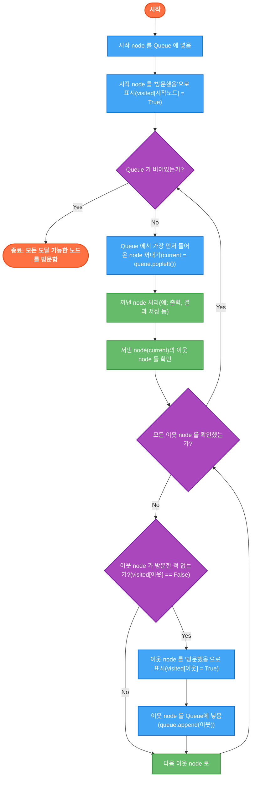

## 🚀 TL;DR
- w.i.p

## 📓 실습 Jupyter Notebook
- [notebook](https://github.com/yuiyeong/notebooks/blob/main/graph/basic_graph.ipynb)

## 🌐 그래프 (Graph) 란?
- 여러 개의 **점(정점 Vertex 또는 노드 Node)** 들이 서로 **선(간선 Edge 또는 링크 Link)** 으로 연결된 관계를 표현하는 자료구조
- 데이터들이 순서대로 나열된 리스트와 달리, 그래프는 **데이터 간의 관계 중심**으로 얽혀있는 비선형 구조

### 그래프의 구성 요소
- **정점 (Vertex / Node)**: 데이터를 나타내는 '점'
    - 예: 사람, 도시, 웹페이지 등
- **간선 (Edge / Link)**: 정점 사이의 '관계'를 나타내는 '선'
    - 예: 친구 관계, 도로, 웹 링크 등


### 왜 그래프를 사용할까?

세상의 많은 것들이 **서로 연결된 관계**를 가지고 있다. 이런 복잡한 연결 구조를 표현하고 분석하는 데 그래프가 아주 유용하다!
- **소셜 네트워크**: 카카오톡 친구 목록, 페이스북 인맥 관계
- **지도 및 네비게이션**: 지하철 노선도, 도로망, GPS 내비게이션의 경로 탐색
- **웹**: 인터넷 웹페이지 간의 하이퍼링크 연결
- **추천 시스템**: 사용자-상품 관계 분석을 통한 추천 알고리즘

> 💡 그래프는 관계를 중심으로 데이터를 표현하기 때문에, 연결 패턴을 분석하거나 최단 경로를 찾는 등의 작업에 최적화된 자료구조이다.

## 🔍 그래프의 종류
### 방향성에 따른 분류
- **무방향 그래프 (Undirected Graph)**
    - 간선에 방향이 없다.
    - A와 B가 연결되면, B도 A와 연결됨
    - 예: 친구 관계 (A가 B의 친구면, B도 A의 친구)
- **방향 그래프 (Directed Graph)**
    - 간선에 화살표처럼 방향이 있다.
    - A에서 B로 가는 간선이 있다고 해서, B에서 A로 가는 간선이 있는 것은 아님
    - 예: 웹페이지 링크 (A가 B를 링크해도, B가 A를 링크할 필요는 없음)


### 가중치 유무에 따른 분류
- **가중치 그래프 (Weighted Graph)**
    - 간선마다 숫자 값(가중치/비용)이 있음
    - 예: 도시 간 거리, 도로 통행료, 네트워크 대역폭
- **비가중치 그래프 (Unweighted Graph)**
    - 간선에 별도 값이 없음 (모든 연결이 동일한 중요도)
    - 예: 단순 친구 관계망 (연결 여부만 중요)


> 참고! 방향이 있으면서, 가중치가 있을 수 있다. 즉, 방향성 유무와 가중치 유무가 겹칠 수 있다.
{: prompt-tip}

## 📝 그래프를 코드로 표현하는 방법: 인접 리스트(Adjacency List)!


- 그래프의 연결 정보를 컴퓨터가 처리할 수 있도록 저장하는데 여러 방법이 있지만, 가장 많이 사용되는 **인접 리스트(Adjacency List)** 방식
### 인접 리스트 (Adjacency List) - dict 활용

- **아이디어**: "각 정점마다, 그 정점과 직접 연결된 이웃(인접 정점)들의 목록을 유지하자!"
- **파이썬 구현**: **dict**를 사용하는 것이 가장 편리함
    - **Key**: 각 정점 (예: 'A', 'B', 0, 1 등)
    - **Value**: 해당 정점과 직접 연결된 **이웃 정점들의 리스트 (또는 세트)**

아래 그래프는,

```
  A -- B
  |    |
  C -- D

```
다음과 같은 인접 리스트로 표현할 수 있다.
```python
graph = {
    "A": ["B", "C"],
    "B": ["A", "D"],
    "C": ["A", "D"],
    "D": ["B", "C"]
}
```

이렇게 표현하면 'A'의 이웃은 'B'와 'C'라는 것을 바로 알 수 있다!
### 인접 리스트의 장점
- **메모리 효율**: 딱 필요한 연결 정보만 저장해서, 특히 연결선(간선)이 많지 않은 **희소 그래프(Sparse Graph)** 에 좋음
- **이웃 찾기 빠름**: 특정 정점의 이웃들을 바로 리스트에서 꺼내볼 수 있음
- **구현 간단**: 파이썬 딕셔너리를 사용하면 직관적으로 구현 가능

> ❗ 인접 행렬(Adjacency Matrix)이라는 표(2차원 배열)를 이용하는 방법도 있지만, 연결이 적은 그래프에서는 메모리 낭비가 심해서 인접 리스트를 더 많이 사용한다.
> {: width="250"}
{: prompt-tip}

### 파이썬 구현 예시 (defaultdict 활용)

```python
from collections import defaultdict

# 무방향 그래프 생성 함수
def create_undirected_graph():
    """
    그래프 형태
	    A -> ['B', 'C']
		B -> ['A', 'D']
		C -> ['A', 'D']
		D -> ['B', 'C']
    """
    graph = defaultdict(list)

    # 간선 추가 함수
    def add_edge(u, v):
        graph[u].append(v)
        graph[v].append(u)  # 무방향이므로 양쪽에 추가

    # 간선 정보 추가
	add_edge("A", "B")
	add_edge("A", "C")
	add_edge("B", "D")
	add_edge("C", "D")

    return graph

# 방향 그래프 생성 함수
def create_directed_graph():
    """
    그래프 형태
	    A -> ['B', 'C']
		B -> ['D']
		C -> ['D']
    """
    graph = defaultdict(list)

    # 간선 추가 함수 (단방향)
    def add_edge(u, v):
        graph[u].append(v)  # u에서 v로 가는 간선만 추가

    # 간선 정보 추가
	add_edge("A", "B")
	add_edge("A", "C")
	add_edge("B", "D")
	add_edge("C", "D")

    return graph

# 가중치 그래프 생성 함수
def create_weighted_graph():
    """
    그래프 형태
	    A -> [('B', 10), ('C', 5)]
		B -> [('A', 10), ('D', 7)]
		C -> [('A', 5), ('D', 15)]
		D -> [('B', 7), ('C', 15)]
    """
    graph = defaultdict(list)

    # 가중치 간선 추가 함수
    def add_edge(u, v, weight):
        # (목적지, 가중치) 튜플 저장
        graph[u].append((v, weight))
        graph[v].append((u, weight))

    # 간선 정보 추가
	add_edge("A", "B", 10)
	add_edge("A", "C", 5)
	add_edge("B", "D", 7)
	add_edge("C", "D", 15)

    return graph
```

## 🔄 그래프 탐색 기본: BFS vs DFS

이렇게 만들어진 다양한 종류의 그래프는 그 데이터를 어떻게 읽어야(탐색) 할까?


### BFS (너비 우선 탐색, Breadth-First Search)

- **핵심 컨셉**: "가까운 곳부터 차근차근, 옆으로 넓게!"
- **동작 방식**
    - 시작점에서 가까운 순서(레벨 1 -> 레벨 2 -> ...)대로 탐색
    - 마치 물결이 퍼져나가는 모습과 같음
- **구현**: 큐(Queue) 자료구조 사용
- **주요 용도**: **최단 거리** 찾기에 유리
### DFS (깊이 우선 탐색, Depth-First Search)

- **핵심 컨셉**: "한 길로 끝까지 파고들어 보자!"
- **동작 방식**
    - 한 방향으로 갈 수 있는 데까지 깊숙이 들어갔다가, 막히면 돌아나와 다른 길로 탐색
    - 마치 미로 찾기 할 때 한쪽 벽만 따라가는 느낌
- **구현**: 스택(Stack) 또는 재귀 함수 사용
- **주요 용도**: **경로의 존재 여부** 확인 등에 활용
## 🌊 너비 우선 탐색 (BFS) 란?

너비 우선 탐색(Breadth-First Search, BFS)은 그래프 탐색 알고리즘 중 하나로, 시작 정점(노드)에서 **가까운 정점부터** 순서대로, 즉 **넓게(너비 우선)** 탐색하는 방법입니다.

### 핵심 아이디어
BFS는 시작 노드에서 출발하여 **거리가 1인 이웃**들을 모두 방문하고, 그 다음 **거리가 2인 이웃**들을 모두 방문하는 방식으로, 마치 물결이 퍼져나가듯 탐색을 진행합니다.


### 주요 특징
- **큐(Queue)** 자료구조를 사용하여 구현 (FIFO: First-In, First-Out)
- **최단 경로 보장** (가중치 없는 그래프): 시작 노드에서 특정 노드까지의 가장 적은 간선 수를 거치는 경로를 찾을 수 있다.
- 재귀적으로 동작하지 않음 (반복문과 queue 사용)

> 💡 BFS 는 마치 연못에 돌을 던졌을 때 물결이 동심원으로 퍼져나가는 것처럼, 시작점으로부터 거리가 가까운 순서대로 노드들을 방문합니다.

## ⚙️ BFS 동작 원리: 큐(Queue)가 핵심!
- BFS가 레벨 별 탐색을 할 수 있는 비결은 바로 **큐(Queue)** 자료구조를 사용하기 때문이다. 
- 바로, Queue 의 **먼저 들어온 것이 먼저 나가는(FIFO)** 특징이 그 핵심이다.
### 알고리즘 단계
1. **시작**
    - 탐색 **시작 node**를 **Queue** 에 넣는다.
    - "이미 방문했다"는 표시를 남긴다. (`visited` 데이터) => 재방문을 하지 않기위해
2. **탐색 (Queue 가 빌 때까지 반복)**:
    - Queue 에서 **가장 먼저 들어왔던 노드**를 꺼낸다. (`popleft`)
    - 꺼낸 노드를 **처리**한다 (예: 화면에 출력)
    - 꺼낸 노드의 **연결된 이웃 노드**들을 살펴본다.
    - 이웃 노드 중 **아직 방문 안 한 노드**가 있다면,
        - "방문했다"고 **표시**하고,
        - **Queue 에 넣는다.** (다음 레벨 탐색 대상)
3. **종료**: Queue 가 비면, 시작 node 에서 갈 수 있는 모든 node 를 방문한 것이다!



> 💡 핵심: queue 에 먼저 들어간 node (가까운 node )가 먼저 나오고, 그 이웃들이 queue 의 뒤쪽에 추가된다. 따라서 자연스럽게 같은 레벨부터 탐색하게 되는 것이다!

## 💻 BFS 파이썬 구현 (기본)

- 그래프를 인접 리스트로 만든다.
- `collections.deque` 를 사용하는 이유 
	- **양쪽에서 효율적인 삽입과 삭제**를 지원하기 때문이다. 
	- 일반 list 로 queue 를 구현하면 pop(0) 가 O(n) 시간 복잡도를 가져 비효율적

```python
from collections import deque

def bfs(graph, start_node):
    """
    그래프에서 시작 노드부터 BFS 탐색을 수행하는 함수

    Parameters:
        graph: 인접 리스트로 표현된 그래프 (딕셔너리)
        start_node: 탐색을 시작할 노드

    Returns:
        방문한 노드들의 리스트 (방문 순서대로)
    """
    # 방문 기록용 세트
    visited = set()
    # 방문 순서 저장용 리스트
    traversal_order = []
    # 큐 생성 및 시작 노드 추가
    queue = deque([start_node])
    # 시작 노드 방문 표시
    visited.add(start_node)

    # 큐가 빌 때까지 반복
    while queue:
        # 큐에서 노드 하나를 꺼냄
        current_node = queue.popleft()
        # 방문 순서에 추가
        traversal_order.append(current_node)

        # 현재 노드의 이웃들을 확인
        for neighbor in graph.get(current_node, []):
            # 아직 방문하지 않은 이웃만 처리
            if neighbor not in visited:
                # 방문 표시
                visited.add(neighbor)
                # 큐에 추가
                queue.append(neighbor)

    return traversal_order

# 사용 예시
if __name__ == "__main__":
    # 무방향 그래프 예시
    graph = {
        'A': ['B', 'C'],
        'B': ['A', 'D', 'E'],
        'C': ['A', 'F'],
        'D': ['B'],
        'E': ['B', 'F'],
        'F': ['C', 'E']
    }

    # A에서 시작하는 BFS 수행
    traversal = bfs(graph, 'A')
    print("BFS 방문 순서:", traversal)
    # 출력: BFS 방문 순서: ['A', 'B', 'C', 'D', 'E', 'F']

```
## 📍 최단 경로 찾기 (BFS 응용)

BFS의 가장 유용한 특징 중 하나는 **가중치 없는 그래프**에서 두 노드 사이의 **최단 경로**를 찾을 수 있다는 것입니다.

```python
def find_shortest_path(graph, start_node, end_node):
    """
    시작 노드에서 목표 노드까지의 최단 경로를 찾는 BFS 함수

    Parameters:
        graph: 인접 리스트로 표현된 그래프
        start_node: 시작 노드
        end_node: 목표 노드

    Returns:
        최단 경로 리스트 (경로가 없으면 빈 리스트)
    """
    # 특수 케이스: 시작과 목표가 같은 경우
    if start_node == end_node:
        return [start_node]

    # 방문 기록 및 부모 노드 저장 (경로 재구성용)
    visited = {start_node}
    queue = deque([(start_node, [start_node])])  # (노드, 경로) 튜플

    while queue:
        current, path = queue.popleft()

        # 현재 노드의 모든 이웃 확인
        for neighbor in graph.get(current, []):
            if neighbor == end_node:
                # 목표 도달! 경로 반환
                return path + [neighbor]

            if neighbor not in visited:
                visited.add(neighbor)
                # 현재까지의 경로에 이웃을 추가하여 큐에 저장
                queue.append((neighbor, path + [neighbor]))

    # 목표에 도달하지 못함
    return []

# 사용 예시
shortest_path = find_shortest_path(graph, 'A', 'F')
print("A에서 F까지의 최단 경로:", shortest_path)
# 출력: A에서 F까지의 최단 경로: ['A', 'C', 'F']

```

이 구현에서는 각 노드에 도달하는 경로를 큐에 함께 저장하여, 목표 노드에 도달했을 때 바로 경로를 반환할 수 있도록 했습니다.

## 🔢 노드 간 최단 거리 계산

노드 간의 최단 거리(간선 수)만 필요한 경우, 다음과 같이 구현할 수 있습니다:

```python
def find_shortest_distance(graph, start_node, end_node):
    """
    시작 노드에서 목표 노드까지의 최단 거리(간선 수)를 찾는 함수

    Returns:
        최단 거리 (경로가 없으면 -1)
    """
    if start_node == end_node:
        return 0

    # 방문 노드와 각 노드까지의 거리를 저장
    distances = {start_node: 0}
    queue = deque([start_node])

    while queue:
        current = queue.popleft()
        current_distance = distances[current]

        for neighbor in graph.get(current, []):
            if neighbor == end_node:
                # 목표 도달!
                return current_distance + 1

            if neighbor not in distances:
                distances[neighbor] = current_distance + 1
                queue.append(neighbor)

    # 목표에 도달하지 못함
    return -1

# 사용 예시
distance = find_shortest_distance(graph, 'A', 'F')
print("A에서 F까지의 최단 거리:", distance)
# 출력: A에서 F까지의 최단 거리: 2

```

> 💡 이 구현에서는 distances 딕셔너리가 방문 여부 체크와 거리 저장의 두 가지 역할을 동시에 수행합니다.

## ⏱️ BFS 시간 및 공간 복잡도

BFS의 성능을 이해하는 것은 실제 문제 해결 시 중요합니다.

### 시간 복잡도: O(V + E)

- V: 노드(정점) 개수, E: 간선 개수
- 모든 노드를 정확히 한 번씩 방문: O(V)
- 모든 간선을 한 번씩 검사: O(E)
- 인접 리스트 사용 시 위 두 작업이 주요 비용이므로 총 O(V + E)

### 공간 복잡도: O(V)

- 큐에 최악의 경우 모든 노드가 동시에 들어갈 수 있음: O(V)
- 방문 기록(`visited`)도 모든 노드 정보를 저장: O(V)

> 💡 BFS는 그래프의 크기에 비례하는 매우 효율적인 알고리즘입니다. 특히 간선보다 노드가 훨씬 많은 희소 그래프에서도 좋은 성능을 보입니다.

## 🗺️ BFS 활용 사례

BFS는 다양한 문제 해결에 활용됩니다:

### 1. 최단 경로 찾기 (가중치 없는 그래프)

- 미로 찾기, 퍼즐 게임의 최소 이동 횟수
- 소셜 네트워크에서 "몇 다리 건너" 관계 찾기

```python
# 미로에서 출발점에서 도착점까지의 최단 경로 찾기
def solve_maze(maze, start, end):
    rows, cols = len(maze), len(maze[0])
    # 상하좌우 이동
    directions = [(-1, 0), (1, 0), (0, -1), (0, 1)]

    visited = set([start])
    queue = deque([(start, [start])])

    while queue:
        (r, c), path = queue.popleft()

        if (r, c) == end:
            return path

        for dr, dc in directions:
            nr, nc = r + dr, c + dc

            # 유효한 이동인지 확인
            if (0 <= nr < rows and 0 <= nc < cols and
                maze[nr][nc] == 0 and (nr, nc) not in visited):
                visited.add((nr, nc))
                queue.append(((nr, nc), path + [(nr, nc)]))

    return []  # 경로 없음

```

### 2. 연결 요소 (Connected Components) 찾기

- 무방향 그래프에서 서로 연결된 노드 집합들을 식별

```python
def find_connected_components(graph):
    components = []
    visited = set()

    for node in graph:
        if node not in visited:
            # 새로운 연결 요소 발견
            component = []
            queue = deque([node])
            visited.add(node)

            while queue:
                current = queue.popleft()
                component.append(current)

                for neighbor in graph.get(current, []):
                    if neighbor not in visited:
                        visited.add(neighbor)
                        queue.append(neighbor)

            components.append(component)

    return components

```

### 3. 이분 그래프 (Bipartite Graph) 검사

- 그래프의 노드를 두 집합으로 나눠서, 같은 집합 내 노드들 사이에는 간선이 없는지 확인

```python
def is_bipartite(graph):
    # 노드별 색상 저장 (0: 미방문, 1: 집합1, -1: 집합2)
    colors = {}

    # 모든 노드에 대해 검사 (연결되지 않은 부분도 처리)
    for start_node in graph:
        if start_node not in colors:
            queue = deque([start_node])
            colors[start_node] = 1  # 첫 노드는 집합1에 배정

            while queue:
                current = queue.popleft()
                current_color = colors[current]

                for neighbor in graph.get(current, []):
                    if neighbor not in colors:
                        # 인접 노드는 반대 색상으로 지정
                        colors[neighbor] = -current_color
                        queue.append(neighbor)
                    elif colors[neighbor] == current_color:
                        # 인접 노드가 같은 색상이면 이분 그래프가 아님
                        return False

    return True

```

### 4. 레벨별 순회 (Level Order Traversal)

- 트리나 그래프를 레벨별로 순회하여 처리

```python
def level_order_traversal(graph, start_node):
    visited = set([start_node])
    queue = deque([(start_node, 0)])  # (노드, 레벨)
    result = []

    while queue:
        node, level = queue.popleft()

        # 새 레벨 시작시 빈 리스트 추가
        if level == len(result):
            result.append([])

        # 현재 레벨에 노드 추가
        result[level].append(node)

        for neighbor in graph.get(node, []):
            if neighbor not in visited:
                visited.add(neighbor)
                queue.append((neighbor, level + 1))

    return result

```

## 💻 완전한 BFS 예제: 미로 탐색 구현

다음 미로에서 (0,0)에서 (4,4)까지의 최단 경로를 찾아봅시다:

```
0 1 0 0 0
0 1 0 1 0
0 0 0 1 0
1 1 0 1 0
0 0 0 0 0

```

여기서 0은 이동 가능한 경로, 1은 벽입니다.

```python
from collections import deque

def solve_maze_with_visualization(maze, start, end):
    rows, cols = len(maze), len(maze[0])
    directions = [(-1, 0), (1, 0), (0, -1), (0, 1)]
    dir_names = ["↑", "↓", "←", "→"]

    visited = set([start])
    queue = deque([(start, [])])  # (위치, 이동 방향)

    while queue:
        (r, c), path = queue.popleft()

        if (r, c) == end:
            # 최단 경로 발견!
            result_maze = [row[:] for row in maze]  # 미로 복사

            # 시작점과 끝점 표시
            result_maze[start[0]][start[1]] = 'S'
            result_maze[end[0]][end[1]] = 'E'

            # 경로 표시
            current = start
            for direction in path:
                dr, dc = directions[dir_names.index(direction)]
                current = (current[0] + dr, current[1] + dc)
                if current != end:  # 끝점이 아니면 경로 표시
                    result_maze[current[0]][current[1]] = '*'

            # 결과 미로 출력
            print("탐색된 최단 경로:")
            for row in result_maze:
                print(" ".join(str(cell) for cell in row))

            return path

        for i, (dr, dc) in enumerate(directions):
            nr, nc = r + dr, c + dc

            if (0 <= nr < rows and 0 <= nc < cols and
                maze[nr][nc] == 0 and (nr, nc) not in visited):
                visited.add((nr, nc))
                queue.append(((nr, nc), path + [dir_names[i]]))

    print("경로를 찾을 수 없습니다.")
    return []

# 미로 정의
maze = [
    [0, 1, 0, 0, 0],
    [0, 1, 0, 1, 0],
    [0, 0, 0, 1, 0],
    [1, 1, 0, 1, 0],
    [0, 0, 0, 0, 0]
]

# 미로 탐색 실행
path = solve_maze_with_visualization(maze, (0, 0), (4, 4))
print("최단 경로 방향:", " → ".join(path))

```


## 📊 성능 최적화 팁

대규모 그래프에서 BFS를 사용할 때 고려할 최적화 기법들:

- **양방향 BFS (Bidirectional BFS)**: 시작점과 목표점 양쪽에서 동시에 BFS를 실행하여 중간에서 만나면 종료
- _휴리스틱 BFS (A_ 알고리즘)**: 목표까지의 예상 거리를 고려하여 탐색 방향을 가이드
- **메모리 최적화**: 노드를 객체 대신 간단한 ID로 표현하여 메모리 사용량 감소
- **방문 노드 기록 최적화**: 큰 그래프에서는 세트 대신 비트벡터나 해시 테이블 사용 고려
## 🌲 깊이 우선 탐색 (DFS) 이란?

깊이 우선 탐색(Depth-First Search, DFS)은 그래프 탐색 알고리즘 중 하나로, 시작 정점에서 출발하여 **한 방향으로 갈 수 있을 때까지 최대한 깊게** 들어간 후, 더 이상 갈 곳이 없으면 **되돌아 나와(backtrack)** 다른 방향으로 탐색을 계속하는 방법입니다.

### 핵심 아이디어

DFS는 현재 경로에서 갈 수 있는 가장 깊은 곳까지 우선적으로 탐색하고, 막히면 이전 갈림길로 돌아와 다른 경로를 시도합니다. 이 과정을 모든 노드를 방문할 때까지 반복합니다.


### 특징

- **스택(Stack)** 자료구조 또는 **재귀 함수(Recursion)** 를 사용하여 구현 (LIFO: Last-In, First-Out)
- 최단 경로를 보장하지 않음 (BFS와의 주요 차이점)
- 메모리 사용이 BFS에 비해 효율적일 수 있음 (특히 깊은 그래프에서)

> 💡 DFS는 미로 찾기에 비유할 수 있습니다. 한쪽 길을 계속 따라가다가 막다른 길에 도달하면, 마지막 갈림길로 돌아와 다른 길을 시도하는 방식과 유사합니다.

## ⚙️ DFS 알고리즘 동작 과정

DFS는 스택 또는 재귀를 사용하여 구현할 수 있습니다. 두 가지 방식 모두 본질적으로 같은 과정을 따르지만, 구현 방법이 다릅니다.

### 1. 스택(Stack) 기반 반복적(Iterative) DFS

스택을 활용한 DFS 구현은 다음과 같은 단계로 이루어집니다:

1. **초기화**:
    
    - 빈 스택 생성
    - 방문 여부를 기록할 자료구조(예: `set`) 생성
    - 시작 노드를 스택에 추가
2. **반복 (스택이 빌 때까지)**:
    
    - 스택에서 노드 하나를 꺼냄
    - 아직 방문하지 않았다면:
        - 방문 표시 및 처리
        - 이웃 노드들을 스택에 추가
3. **종료**: 스택이 비면 탐색 완료
    

```python
from collections import deque

def dfs_iterative(graph, start_node):
    """
    스택을 사용한 반복적 DFS 구현
    
    Args:
        graph: 인접 리스트로 표현된 그래프
        start_node: 탐색 시작 노드
        
    Returns:
        방문 순서를 담은 리스트
    """
    visited = set()  # 방문 기록
    stack = deque([start_node])  # 스택 (deque를 스택으로 사용)
    traversal = []  # 방문 순서 기록
    
    while stack:
        # 스택에서 노드 꺼내기
        current = stack.pop()  # pop()은 마지막 요소 제거 (LIFO)
        
        # 아직 방문하지 않은 노드라면
        if current not in visited:
            # 방문 표시
            visited.add(current)
            # 방문 순서에 추가
            traversal.append(current)
            
            # 인접 노드 확인 (알파벳 역순으로 추가하면 알파벳 순 방문)
            neighbors = sorted(graph.get(current, []), reverse=True)
            for neighbor in neighbors:
                if neighbor not in visited:
                    stack.append(neighbor)
    
    return traversal
```

> ❗ 이웃 노드를 스택에 넣는 순서에 따라 실제 방문 순서가 달라질 수 있습니다. 알파벳 순서로 방문하고 싶다면, 이웃 노드들을 역순으로 스택에 추가해야 합니다.

### 2. 재귀(Recursion) 기반 DFS

재귀를 활용한 DFS 구현은 함수가 자기 자신을 호출하는 방식으로 이루어집니다:

1. **현재 노드 처리**:
    
    - 현재 노드를 방문 표시
    - 필요한 작업 수행
2. **이웃 노드 탐색**:
    
    - 현재 노드의 모든 이웃 확인
    - 방문하지 않은 이웃에 대해 재귀적으로 DFS 호출

```python
def dfs_recursive(graph, start_node):
    """
    재귀를 사용한 DFS 구현
    
    Args:
        graph: 인접 리스트로 표현된 그래프
        start_node: 탐색 시작 노드
        
    Returns:
        방문 순서를 담은 리스트
    """
    visited = set()  # 방문 기록
    traversal = []  # 방문 순서 기록
    
    def dfs_helper(node):
        # 방문 표시
        visited.add(node)
        # 방문 순서에 추가
        traversal.append(node)
        
        # 인접 노드 확인 (알파벳 순서로 방문)
        neighbors = sorted(graph.get(node, []))
        for neighbor in neighbors:
            if neighbor not in visited:
                dfs_helper(neighbor)
    
    # 재귀 시작
    dfs_helper(start_node)
    return traversal
```

> 💡 재귀 방식은 코드가 더 간결하고 직관적입니다. 시스템 호출 스택이 자동으로 노드의 방문 경로를 기억해주기 때문입니다.

## 🔍 DFS 동작 방식 시각화

간단한 그래프에서 DFS가 어떻게 동작하는지 시각적으로 살펴보겠습니다:

```
    A --- B --- C
    |     |
    D --- E
```

시작 노드 A에서 스택 기반 DFS를 수행하면, 이웃 노드를 알파벳 순서로 방문하고자 할 때:

1. 스택에 A 추가: `[A]`
2. A 꺼내고 방문 표시, 이웃 B, D 역순으로 스택에 추가: `[D, B]`
3. B 꺼내고 방문 표시, 이웃 C, E 역순으로 스택에 추가: `[D, E, C]`
4. C 꺼내고 방문 표시, 이웃 없음: `[D, E]`
5. E 꺼내고 방문 표시, 이웃 D(이미 스택에 있음): `[D]`
6. D 꺼내고 방문 표시, 이웃 없음: `[]`
7. 스택이 비어서 종료

방문 순서: **A, B, C, E, D**

## ⏱️ DFS 시간 및 공간 복잡도

DFS의 성능을 정확히 이해하는 것은 실제 문제 해결에 중요합니다.

### 시간 복잡도: O(V + E)

- V: 노드(정점) 개수, E: 간선 개수
- 모든 노드와 간선을 한 번씩 방문하므로 O(V + E)
- 인접 리스트 표현 방식 기준

### 공간 복잡도: O(V)

- 스택(또는 재귀 호출 스택)에 최악의 경우 모든 노드가 쌓일 수 있음: O(V)
- 방문 기록을 위한 공간도 O(V) 필요

> 💡 BFS와 DFS는 동일한 시간/공간 복잡도를 가지지만, 그래프의 특성과 문제 유형에 따라 실제 성능 차이가 있을 수 있습니다.

## 🛤️ DFS 활용 사례

DFS는 다양한 문제 해결에 활용됩니다:

### 1. 경로 존재 확인 (Path Finding)

두 노드 사이에 경로가 존재하는지 확인하는 데 사용할 수 있습니다.

```python
def path_exists_dfs(graph, start_node, end_node):
    """경로 존재 여부 확인 함수"""
    visited = set()
    
    def dfs_helper(current):
        # 현재 노드가 목표 노드인지 확인
        if current == end_node:
            return True
        
        # 방문 표시
        visited.add(current)
        
        # 이웃 노드 확인
        for neighbor in graph.get(current, []):
            if neighbor not in visited:
                if dfs_helper(neighbor):
                    return True
        
        return False
    
    return dfs_helper(start_node)
```

### 2. 사이클 탐지 (Cycle Detection)

그래프 내에 사이클이 존재하는지 확인할 수 있습니다.

```python
def has_cycle(graph):
    """무방향 그래프의 사이클 탐지 함수"""
    visited = set()
    
    def dfs_helper(current, parent):
        visited.add(current)
        
        for neighbor in graph.get(current, []):
            # 부모 노드가 아닌데 이미 방문한 노드라면 사이클 존재
            if neighbor != parent:
                if neighbor in visited:
                    return True
                elif dfs_helper(neighbor, current):
                    return True
        
        return False
    
    # 모든 노드에서 확인 (연결되지 않은 컴포넌트 처리)
    for node in graph:
        if node not in visited:
            if dfs_helper(node, None):
                return True
    
    return False
```

### 3. 위상 정렬 (Topological Sort)

방향 비순환 그래프(DAG)에서 노드들의 선후 관계를 유지하며 정렬합니다.

```python
def topological_sort(graph):
    """위상 정렬 함수"""
    visited = set()
    temp_mark = set()  # 임시 방문 표시 (사이클 탐지용)
    result = []
    
    def dfs_helper(node):
        # 사이클 감지
        if node in temp_mark:
            raise ValueError("Graph has a cycle, topological sort not possible")
        
        # 이미 방문했다면 스킵
        if node in visited:
            return
        
        # 임시 방문 표시
        temp_mark.add(node)
        
        # 이웃 노드 방문
        for neighbor in graph.get(node, []):
            dfs_helper(neighbor)
        
        # 방문 완료 표시
        temp_mark.remove(node)
        visited.add(node)
        
        # 결과에 추가 (역순)
        result.insert(0, node)
    
    # 모든 노드에 대해 DFS 수행
    for node in graph:
        if node not in visited:
            dfs_helper(node)
    
    return result
```

### 4. 연결 요소 찾기 (Connected Components)

그래프의 연결된 부분 집합들을 식별합니다.

```python
def find_connected_components(graph):
    """연결 요소 찾기 함수"""
    visited = set()
    components = []
    
    def dfs_helper(node, component):
        visited.add(node)
        component.append(node)
        
        for neighbor in graph.get(node, []):
            if neighbor not in visited:
                dfs_helper(neighbor, component)
    
    for node in graph:
        if node not in visited:
            component = []
            dfs_helper(node, component)
            components.append(component)
    
    return components
```

## 🔄 BFS vs DFS 비교 및 선택 가이드

BFS와 DFS는 그래프 탐색의 두 가지 기본 방법으로, 각각 장단점이 있습니다:

|특징|BFS (너비 우선 탐색)|DFS (깊이 우선 탐색)|
|---|---|---|
|**탐색 방식**|가까운(넓은) 순서 (레벨별)|한 방향으로 최대한 깊게 탐색 후 백트래킹|
|**자료구조**|큐 (Queue) - FIFO|스택 (Stack) 또는 재귀 (Recursion) - LIFO|
|**최단 경로**|보장 (가중치 없는 그래프)|보장 안 함|
|**메모리 사용**|넓은 그래프에서 메모리 많이 사용|깊은 그래프에서 메모리 효율적|
|**주요 활용**|최단 경로, 레벨별 탐색|경로 존재 확인, 사이클 탐지, 위상 정렬|

### 언제 DFS를 선택해야 할까?

- **경로의 존재 여부만 확인**할 때 (빠른 결과가 필요한 경우)
- **깊이가 중요한 문제**에서 (예: 게임 트리 탐색, 퍼즐 솔버)
- **메모리가 제한적**이고 그래프가 넓을 때
- **사이클 탐지** 또는 **위상 정렬**이 필요할 때
- **백트래킹** 전략이 필요한 문제 (예: 모든 가능한 조합 탐색)

### 언제 BFS를 선택해야 할까?

- **최단 경로**를 찾아야 할 때 (가중치 없는 그래프)
- **레벨별 탐색**이 필요할 때 (예: 소셜 네트워크의 친구 추천)
- **해답이 얕은 깊이**에 있을 가능성이 높을 때
- **탐색 깊이가 매우 깊어질 가능성**이 있고 스택 오버플로우가 우려될 때

> 💡 실제 문제 해결 시 알고리즘 선택은 그래프의 특성, 문제의 요구사항, 효율성 고려 등을 종합적으로 판단해야 합니다.

## 🚧 DFS 구현 시 주의사항

### 재귀적 DFS의 스택 오버플로우 문제

재귀 함수를 사용한 DFS 구현은 간결하고 이해하기 쉽지만, 그래프가 매우 깊은 경우 스택 오버플로우가 발생할 수 있습니다.

#### 해결 방법:

1. **반복적 구현 사용**: 명시적인 스택을 사용하는 반복적 DFS 구현으로 전환

```python
def dfs_safe(graph, start_node):
    """스택 오버플로우를 방지하는 반복적 DFS"""
    visited = set()
    stack = [start_node]
    result = []
    
    while stack:
        current = stack.pop()
        if current not in visited:
            visited.add(current)
            result.append(current)
            
            for neighbor in graph.get(current, []):
                if neighbor not in visited:
                    stack.append(neighbor)
    
    return result
```

2. **재귀 깊이 제한 늘리기**: 파이썬에서는 `sys` 모듈을 사용하여 재귀 제한을 조정할 수 있음

```python
import sys

# 재귀 제한 늘리기 (주의해서 사용)
sys.setrecursionlimit(10000)  # 기본값은 보통 1000

def dfs_recursive_extended(graph, start_node):
    # 기존 재귀적 DFS 코드
    ...
```

> ❗ 재귀 제한을 늘리는 것은 임시 해결책일 뿐, 근본적인 해결책은 아닙니다. 너무 큰 값으로 설정하면 시스템 리소스 문제가 발생할 수 있으니 주의하세요.

### 이웃 노드 처리 순서

이웃 노드를 스택에 추가하는 순서가 실제 방문 순서를 결정합니다. 원하는 방문 순서가 있다면 이웃 노드 목록을 적절히 정렬해야 합니다.

```python
# 알파벳 순서로 방문하고 싶은 경우
neighbors = sorted(graph.get(current, []), reverse=True)  # 역순으로 스택에 추가

# 특정 가중치나 속성에 따라 방문하고 싶은 경우
neighbors = sorted(graph.get(current, []), key=lambda x: some_property(x), reverse=True)
```

## 💻 완전한 DFS 예제: 경로 존재 확인 구현

두 노드 사이에 경로가 존재하는지 확인하는 문제를 DFS로 해결해봅시다:

### 1. 스택 기반 구현

```python
from collections import deque

def path_exists_dfs_iterative(graph, start_node, end_node):
    """
    스택 기반 DFS로 두 노드 간 경로 존재 여부 확인
    
    Args:
        graph: 인접 리스트로 표현된 그래프
        start_node: 시작 노드
        end_node: 목표 노드
        
    Returns:
        경로 존재 여부 (True/False)
    """
    # 시작과 끝이 같은 경우
    if start_node == end_node:
        return True
    
    # 방문 기록
    visited = set()
    
    # 스택 초기화
    stack = deque([start_node])
    
    while stack:
        # 현재 노드 처리
        current = stack.pop()
        
        # 방문 처리
        if current not in visited:
            visited.add(current)
            
            # 목표 노드에 도달했는지 확인
            if current == end_node:
                return True
            
            # 이웃 노드 확인
            for neighbor in graph.get(current, []):
                if neighbor not in visited:
                    stack.append(neighbor)
    
    # 경로 없음
    return False
```

### 2. 재귀 기반 구현

```python
def path_exists_dfs_recursive(graph, start_node, end_node):
    """
    재귀 기반 DFS로 두 노드 간 경로 존재 여부 확인
    
    Args:
        graph: 인접 리스트로 표현된 그래프
        start_node: 시작 노드
        end_node: 목표 노드
        
    Returns:
        경로 존재 여부 (True/False)
    """
    # 시작과 끝이 같은 경우
    if start_node == end_node:
        return True
    
    # 방문 기록
    visited = set()
    
    def dfs_helper(current):
        # 방문 처리
        visited.add(current)
        
        # 목표 도달했는지 확인
        if current == end_node:
            return True
        
        # 이웃 노드 확인
        for neighbor in graph.get(current, []):
            if neighbor not in visited:
                if dfs_helper(neighbor):
                    return True
        
        # 현재 경로에서 목표 노드 못 찾음
        return False
    
    # 재귀 DFS 시작
    return dfs_helper(start_node)
```

### 테스트 코드

```python
# 예제 그래프
graph = {
    0: [1, 2],
    1: [0, 3, 4],
    2: [0, 4],
    3: [1, 5],
    4: [1, 2, 5],
    5: [3, 4],
    6: [7],  # 연결되지 않은 컴포넌트
    7: [6]
}

# 테스트
print("스택 기반 DFS:")
print("0에서 5까지 경로 존재?", path_exists_dfs_iterative(graph, 0, 5))  # True
print("0에서 6까지 경로 존재?", path_exists_dfs_iterative(graph, 0, 6))  # False
print("6에서 7까지 경로 존재?", path_exists_dfs_iterative(graph, 6, 7))  # True

print("\n재귀 기반 DFS:")
print("0에서 5까지 경로 존재?", path_exists_dfs_recursive(graph, 0, 5))  # True
print("0에서 6까지 경로 존재?", path_exists_dfs_recursive(graph, 0, 6))  # False
print("6에서 7까지 경로 존재?", path_exists_dfs_recursive(graph, 6, 7))  # True
```

## 📊 고급 DFS 응용: 위상 정렬 구현

위상 정렬(Topological Sort)은 방향 비순환 그래프(DAG)에서 노드들을 선후 관계에 따라 정렬하는 알고리즘입니다. 이는 작업 스케줄링, 선수 과목 계획 등에 활용됩니다.

```python
def topological_sort_dfs(graph):
    """
    DFS를 이용한 위상 정렬 구현
    
    Args:
        graph: 방향 그래프의 인접 리스트
        
    Returns:
        위상 정렬된 노드 리스트 (선후 관계 유지)
    """
    # 방문 상태 추적 (0: 미방문, 1: 임시 방문, 2: 영구 방문)
    visited = {}
    for node in graph:
        visited[node] = 0
    
    # 결과 저장
    topo_order = []
    
    # 사이클 탐지를 위한 플래그
    has_cycle = [False]
    
    def dfs_topo(node):
        # 임시 방문 표시 (현재 경로 추적)
        visited[node] = 1
        
        # 이웃 방문
        for neighbor in graph.get(node, []):
            # 미방문 이웃
            if visited.get(neighbor, 0) == 0:
                dfs_topo(neighbor)
            # 임시 방문 이웃 (사이클 발견)
            elif visited.get(neighbor, 0) == 1:
                has_cycle[0] = True
        
        # 영구 방문 표시
        visited[node] = 2
        # 위상 정렬 순서에 추가 (역순)
        topo_order.insert(0, node)
    
    # 모든 노드에 대해 DFS 실행
    for node in graph:
        if visited[node] == 0:
            dfs_topo(node)
    
    # 사이클이 있으면 위상 정렬 불가능
    if has_cycle[0]:
        return None
    
    return topo_order

# 테스트
dag = {
    'A': ['C'],
    'B': ['C', 'D'],
    'C': ['E'],
    'D': ['F'],
    'E': ['F', 'H'],
    'F': ['G'],
    'G': [],
    'H': []
}

print("위상 정렬 결과:", topological_sort_dfs(dag))
# 가능한 출력: ['B', 'A', 'C', 'D', 'E', 'F', 'H', 'G']
```

## 🧩 그래프 활용 사례

그래프는 정말 다양한 분야에서 활용됩니다:

- **소셜 네트워크 분석**
    - 영향력 있는 사용자 식별
    - 커뮤니티 탐지
- **웹 분석**
    - 웹 크롤링 및 페이지 순위 결정 (PageRank)
    - 컨텐츠 추천 시스템
- **네트워크 라우팅**
    - 최적 경로 찾기
    - 네트워크 흐름 분석
- **생물정보학**
    - 단백질 상호작용 네트워크
    - 유전자 조절 네트워크
- **인공지능**
    - 지식 그래프
    - 의사결정 시스템

## 🌐 그래프와 머신러닝

최근에는 그래프 구조를 활용한 머신러닝 방법론이 각광받고 있습니다:

- **그래프 임베딩 (Graph Embedding)**
    - 노드나 그래프 전체를 벡터 공간에 매핑
    - 노드 간 유사성 계산 및 예측에 활용
- **그래프 신경망 (Graph Neural Networks, GNN)**
    - 그래프 구조의 데이터에서 특징을 추출하는 딥러닝 모델
    - 분자 구조 분석, 추천 시스템 등에 활용
- **지식 그래프 (Knowledge Graph)**
    - 실세계 개체와 그들 간의 관계를 표현하는 그래프
    - 검색 엔진, 챗봇, 질의응답 시스템 등에 활용

## ✨ AI 분야에서의 BFS 응용

BFS는 AI와 기계학습의 여러 분야에서도 활용됩니다:

### 이미지 세그멘테이션 (Image Segmentation)

- 이미지 내에서 특정 픽셀과 비슷한 속성을 가진 인접 영역을 찾는데 활용
- Flood fill 알고리즘은 BFS의 대표적인 응용 사례

```python
def flood_fill(image, sr, sc, new_color):
    rows, cols = len(image), len(image[0])
    original_color = image[sr][sc]

    # 이미 새 색상이면 변경 불필요
    if original_color == new_color:
        return image

    directions = [(-1, 0), (1, 0), (0, -1), (0, 1)]
    queue = deque([(sr, sc)])

    while queue:
        r, c = queue.popleft()
        image[r][c] = new_color

        for dr, dc in directions:
            nr, nc = r + dr, c + dc
            if (0 <= nr < rows and 0 <= nc < cols and
                image[nr][nc] == original_color):
                queue.append((nr, nc))

    return image

```

### 추천 시스템 (Recommendation Systems)

- 사용자-아이템 관계 그래프에서 특정 사용자와 유사한 취향을 가진 사용자 찾기
- BFS를 활용하여 "친구의 친구" 관계를 탐색하는 협업 필터링

### 상태 공간 탐색 (State-Space Search)

- 게임이나 퍼즐 문제에서 현재 상태에서 목표 상태까지의 최단 해결 경로 찾기
- 루빅스 큐브 해법, 8-퍼즐 문제, 체스 게임 등에 활용

### 로봇 경로 계획 (Path Planning)

- 로봇이 장애물을 피해 목적지까지 이동하는 최적 경로 탐색
- 격자(grid) 기반 지도에서 자주 활용됨

> 💡 BFS는 가장 가까운 관계 또는 최단 거리(단계)가 중요한 문제 상황에서 유용하게 적용될 수 있는 기본적인 탐색 도구입니다.


그래프 구조와 그래프 임베딩은 매우 밀접한 관련이 있습니다. 제가 작성한 글에서 소개한 그래프 자료구조의 개념이 AI 분야에서 사용되는 그래프 임베딩의 기초가 됩니다.

그래프 자료구조는 노드(정점)와 엣지(간선)로 구성된 관계 중심의 데이터 구조로, 소셜 네트워크, 분자 구조, 지식 그래프 등 다양한 실제 세계의 관계를 표현합니다. 이런 그래프 구조를 머신러닝 알고리즘에 직접 입력하기는 어렵습니다.

그래프 임베딩은 이러한 복잡한 그래프 구조를 벡터 공간의 저차원 벡터(임베딩)로 변환하는 기술입니다. 이를 통해 그래프의 구조적 정보와 특성을 보존하면서도 머신러닝 모델이 처리할 수 있는 형태로 변환합니다.

구체적인 연관성은 다음과 같습니다:

1. **그래프 표현의 확장**: 기본 그래프 자료구조(인접 리스트, 인접 행렬 등)는 그래프 임베딩의 입력 데이터가 됩니다.
2. **그래프 탐색 알고리즘의 활용**: BFS, DFS와 같은 그래프 탐색 알고리즘은 많은 그래프 임베딩 기법(Node2Vec, DeepWalk 등)에서 노드 간 관계를 학습하기 위한 무작위 워크(random walk) 생성에 활용됩니다.
3. **특성 추출**: 그래프의 구조적 특성(중심성 지표, 군집 계수 등)은 그래프 임베딩 과정에서 보존해야 할 중요한 정보입니다.
4. **그래프 신경망(GNN)**: 최신 그래프 임베딩 기법인 GNN은 그래프 구조를 직접 학습하여 노드, 엣지, 또는 그래프 전체의 임베딩을 생성합니다. 이때 메시지 패싱 메커니즘은 그래프 탐색의 개념을 확장한 것으로 볼 수 있습니다.

예를 들어, Node2Vec 알고리즘은 그래프에서 BFS와 DFS의 특성을 조합한 편향된 무작위 워크(biased random walk)를 수행하여 노드 시퀀스를 생성한 후, Word2Vec과 유사한 방식으로 노드 임베딩을 학습합니다.

결국, 그래프 자료구조와 알고리즘에 대한 기본적인 이해는 그래프 임베딩과 같은 고급 AI 기술을 개발하고 적용하는 데 필수적인 기초 지식이 됩니다. 그래프 구조의 특성을 효과적으로 벡터 공간에 투영하는 것이 그래프 임베딩의 핵심이며, 이는 기본 그래프 이론에 대한 탄탄한 이해를 바탕으로 합니다.