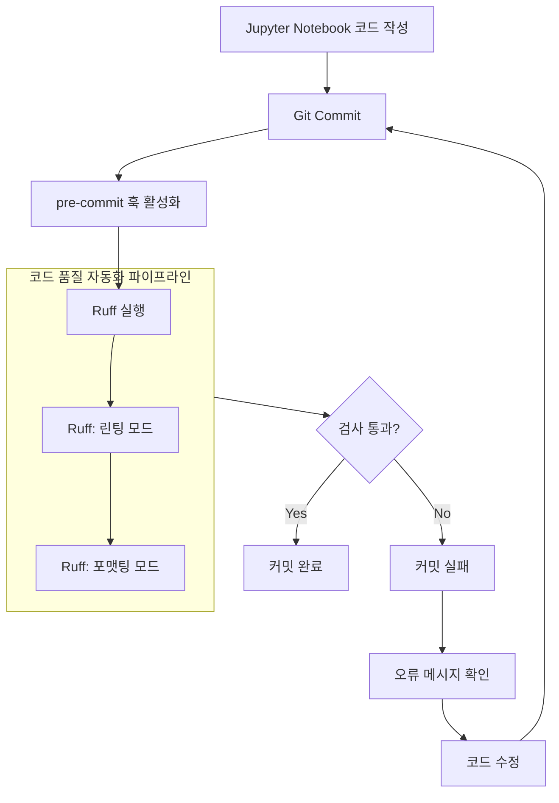

Jupyter Notebook 에서 일관된 코드 스타일을 자동으로 유지하고 싶어 작성한 글이다.

Python 은 [PEP8](https://peps.python.org/pep-0008/)을 통해 *pythonic* 한 코드를 작성하도록 권장한다.

하지만 저 문서의 규칙을 다 외울 수는 없다!

이전에는 `black`, `flake8`, `isort` 등 여러 도구를 같이 사용해야 했지만, 이제 `Ruff`라는 도구 하나로 모든 코드 품질 관리를 할 수 있게 되었다.

Jupyter Notebook 파일(.ipynb)도 `Ruff` 만으로 직접 지원되어 별도의 브릿지 도구 없이 코드 품질을 관리할 수 있게 되었다.

## 🚀 TL;DR

- `pre-commit`과 `Ruff` 만 설치하면 Jupyter Notebook의 코드 스타일을 완전 자동화할 수 있음
- Ruff 하나로 `black`, `isort`, `autoflake`, `autopep8`, `pyupgrade`, `flake8` 등의 기능을 모두 대체 가능
- Ruff는 Jupyter Notebook(.ipynb) 파일을 직접 지원하여 별도의 브릿지 도구가 필요 없음
- Git 커밋 전에 자동으로 코드 스타일 검사와 수정이 이루어짐
- 최소한의 패키지 설치로 최대한의 자동 수정 기능 구현
- Mac 과 Windows 각각에서 작동하는 간단한 설정 [스크립트](#-mac에서-원클릭-설정-스크립트)

> 다 귀찮다면 위 스크립트만 실행하면 된다!
{: .prompt-tip}

## 📦 사용하는 python package

- python==3.12.7
- pre-commit==4.2.0
- ruff==0.11.6

**Ruff로 대체되는 도구들**

- black (코드 포맷터)
- isort (import 정렬)
- autoflake (사용하지 않는 import 및 변수 제거)
- autopep8 (PEP8 자동 수정)
- pyupgrade (최신 Python 문법 적용)
- flake8 (코드 린터)

## 🔄 코드 스타일 파이프라인 작동 방식



`Ruff` 기반 파이프라인은 다음과 같은 순서로 작동한다.

1. 개발자가 Jupyter Notebook 파일을 수정하고 `git commit` 명령어 실행
2. `pre-commit hook`이 활성화되어 `Ruff`를 실행
    - `ruff check`: 코드 품질 검사 및 자동 수정 (import 정리, 미사용 변수 제거 등)
    - `ruff format`: 코드 형식 자동 정리 (black과 유사한 포맷팅)
3. 모든 검사를 통과하면 commit 진행, 실패하면 commit 중단

> 이 순서는 중요하다. 먼저 `ruff check`로 대부분의 문제를 자동으로 해결한 후, `ruff format`으로 코드 스타일을 일관되게 만든다. 자동으로 해결할 수 없는 문제는 개발자가 수동으로 수정해야 한다.
{: .prompt-warning}

## 🧩 도구별 역할과 특징

### 🔄 pre-commit: Git Hook 관리자

Git hook 을 관리하는 프레임워크로, commit 전에 다양한 검사를 자동화한다.

- 여러 검사 도구를 쉽게 설정하고 관리
- 커밋 전 자동으로 검사 실행
- YAML 설정 파일을 통한 쉬운 관리
- 필요한 도구들을 자동으로 설치하고 관리
- [공식 문서](https://pre-commit.com/)

### ⚡ Ruff: 초고속 통합 코드 품질 도구

`Ruff`는 `Rust` 로 작성된 매우 빠른 Python 린터 및 포맷터로, 여러 도구의 기능을 하나로 통합했다.

- 기존 여러 도구(`black`, `isort`, `flake8` 등)의 기능을 단일 도구로 통합
- `Rust` 로 작성되어 기존 도구보다 10-100배 빠른 속도
- 코드 검사(lint)와 자동 수정(fix) 모두 지원
- 코드 포맷팅(format) 기능으로 `black` 대체 가능
- 사용하지 않는 `import` 및 변수 자동 제거
- PEP8 규칙 자동 적용
- Jupyter Notebook(.ipynb) 파일 직접 지원
- 다양한 내장 규칙셋과 확장 가능한 플러그인 시스템
- 설정 파일을 통한 세밀한 규칙 조정 가능
- [공식 문서](https://docs.astral.sh/ruff/)

> Ruff는 단일 도구로 여러 도구의 기능을 제공하므로, 설정과 유지 관리가 훨씬 간단해진다. 또한 Rust로 작성되어 실행 속도가 매우 빠르다!
{: .prompt-tip}

## 🛠️ 설치

### 📋 필요한 패키지 설치
> python 버전인 3.12.7 인 가상 환경에서 한다고 가정한다.

```bash
pip install pre-commit==4.2.0 ruff==0.11.6
```

### 📝 설정 파일 생성

- 프로젝트 루트 디렉토리에 `.pre-commit-config.yaml` 파일을 아래의 내용으로 생성한다.

```yaml
repos:  
    -   repo: https://github.com/astral-sh/ruff-pre-commit  
        rev: v0.11.6  
        hooks:  
            -   id: ruff # ruff linter 실행
                args: [ --fix ]
            -   id: ruff-format # ruff formatter 실행
```

- `Ruff` 설정을 위해 `ruff.toml` 파일도 아래의 내용으로 생성한다.

```toml
# 기본 규칙 설정  
target-version = "py312"  
line-length = 120  
exclude = [  
    ".bzr",  
    ".direnv",  
    ".eggs",  
    ".git",  
    ".git-rewrite",  
    ".hg",  
    ".mypy_cache",  
    ".nox",  
    ".pants.d",  
    ".pytype",  
    ".ruff_cache",  
    ".svn",  
    ".tox",  
    ".venv",  
    "__pypackages__",  
    "_build",  
    "buck-out",  
    "build",  
    "dist",  
    "node_modules",  
    "venv",  
]  
  
# 자동 형식 지정 설정  
[format]  
quote-style = "double"  
indent-style = "space"  
line-ending = "auto"  
docstring-code-format = true  
docstring-code-line-length = 120  
skip-magic-trailing-comma = false  
  
# 린트 설정 (이전 최상위 설정에서 옮겨짐)  
[lint]  
# 규칙 활성화  
select = [  
    "E", # pycodestyle 오류  
    "F", # pyflakes  
    "I", # isort  
    "UP", # pyupgrade  
    "N", # pep8-naming  
    "B", # flake8-bugbear  
    "A", # flake8-builtins  
    "COM", # flake8-commas (COM812 제외)  
    "C4", # flake8-comprehensions  
    "ISC", # flake8-implicit-str-concat  
    "ICN", # flake8-import-conventions  
    "PD", # pandas-vet  
    "PGH", # pygrep-hooks  
    "PIE", # flake8-pie  
    "PL", # pylint  
    "PT", # flake8-pytest-style  
    "PTH", # flake8-use-pathlib  
    "Q", # flake8-quotes  
    "RET", # flake8-return  
    "RSE", # flake8-raise  
    "RUF", # Ruff-specific rules  
    "SIM", # flake8-simplify  
    "TID", # flake8-tidy-imports  
    "UP", # pyupgrade  
    "W", # pycodestyle 경고  
]  
  
# 일부 규칙 무시  
ignore = [  
    "E203", # Black 과의 호환성을 위해 콜론 전 공백 관련 규칙 무시  
    "E266", # 여러 개의 '#' 사용 허용 (docstring 스타일)  
    "E501", # line length 는 formatter 에서 관리  
    "COM812", # formatter 와 충돌 가능성이 있는 규칙 무시  
]  
  
# 자동 수정 활성화  
fixable = ["ALL"]  
unfixable = []  
  
# 미사용 import 자동 제거  
[lint.isort]  
known-first-party = ["mypackage", "notebooks"]  
known-third-party = ["numpy", "pandas", "matplotlib", "seaborn", "sklearn"]  
  
force-single-line = false  
force-wrap-aliases = false  
combine-as-imports = true  
  
# 라인 길이 제한  
lines-after-imports = 2  
section-order = ["future", "standard-library", "third-party", "first-party", "local-folder"]  
  
# Jupyter Notebook 관련 특별 설정  
[lint.per-file-ignores]  
"*.ipynb" = [  
    "E402", # 모듈 레벨 임포트가 코드 맨 위에 없어도 됨 (노트북 특성상)  
    "F841", # 할당 후 사용되지 않는 변수 무시  
    "PTH123", # open() 대신 Path.open() 사용 무시  
    "RUF003", # collections.abc 모듈의 타입 사용 권장 무시  
    "PD901", # DataFrame 변수명 관련 경고 무시  
    "N813", # 카멜케이스 변수명 무시  
    "PLR2004", # 매직 넘버 사용 무시  
    "PD003", # .fillna() 사용 무시  
    "PD002", # `inplace=True` 사용 무시  
    "PD004", # .dropna() 사용 무시  
    "PD010",  
]
```

### 🔧 pre-commit hook 설치

```bash
pre-commit install
```

이제 git commit을 실행할 때마다 자동으로 Jupyter Notebook 파일의 코드 스타일이 검사되고 수정된다!

## 🍎 Mac에서 원클릭 설정 스크립트

- Mac 에서는 다음 스크립트를 프로젝트 루트 디렉토리에 작성하여, 실행하면 한 번에 모든 설정을 완료할 수 있다.

```shell
#!/bin/zsh

# 색상 정의
RED='\033[0;31m'
GREEN='\033[0;32m'
YELLOW='\033[1;33m'
NC='\033[0m' # No Color

# 함수 정의: 명령어 실행 및 결과 확인
execute_command() {
	echo -e "${YELLOW}Executing: $1${NC}"
	if eval $1; then
		echo -e "${GREEN}Success: $1${NC}"
	else
		echo -e "${RED}Failed: $1${NC}"
		exit 1
	fi
}

# 필요한 패키지 설치
execute_command "pip install pre-commit==4.2.0 ruff==0.11.6"

# pre-commit 설정 파일 생성
cat << EOF > .pre-commit-config.yaml
repos:  
    -   repo: https://github.com/astral-sh/ruff-pre-commit  
        rev: v0.11.6  
        hooks:  
            -   id: ruff
                args: [ --fix ]  
            -   id: ruff-format
EOF

echo -e "${GREEN}Created .pre-commit-config.yaml${NC}"

# ruff 설정 파일 생성
cat << EOF > ruff.toml
# 기본 규칙 설정  
target-version = "py312"  
line-length = 120  
exclude = [  
    ".bzr",  
    ".direnv",  
    ".eggs",  
    ".git",  
    ".git-rewrite",  
    ".hg",  
    ".mypy_cache",  
    ".nox",  
    ".pants.d",  
    ".pytype",  
    ".ruff_cache",  
    ".svn",  
    ".tox",  
    ".venv",  
    "__pypackages__",  
    "_build",  
    "buck-out",  
    "build",  
    "dist",  
    "node_modules",  
    "venv",  
]  
  
# 자동 형식 지정 설정  
[format]  
quote-style = "double"  
indent-style = "space"  
line-ending = "auto"  
docstring-code-format = true  
docstring-code-line-length = 120  
skip-magic-trailing-comma = false  
  
# 린트 설정 (이전 최상위 설정에서 옮겨짐)  
[lint]  
# 규칙 활성화  
select = [  
    "E", # pycodestyle 오류  
    "F", # pyflakes  
    "I", # isort  
    "UP", # pyupgrade  
    "N", # pep8-naming  
    "B", # flake8-bugbear  
    "A", # flake8-builtins  
    "COM", # flake8-commas (COM812 제외)  
    "C4", # flake8-comprehensions  
    "ISC", # flake8-implicit-str-concat  
    "ICN", # flake8-import-conventions  
    "PD", # pandas-vet  
    "PGH", # pygrep-hooks  
    "PIE", # flake8-pie  
    "PL", # pylint  
    "PT", # flake8-pytest-style  
    "PTH", # flake8-use-pathlib  
    "Q", # flake8-quotes  
    "RET", # flake8-return  
    "RSE", # flake8-raise  
    "RUF", # Ruff-specific rules  
    "SIM", # flake8-simplify  
    "TID", # flake8-tidy-imports  
    "UP", # pyupgrade  
    "W", # pycodestyle 경고  
]  
  
# 일부 규칙 무시  
ignore = [  
    "E203", # Black 과의 호환성을 위해 콜론 전 공백 관련 규칙 무시  
    "E266", # 여러 개의 '#' 사용 허용 (docstring 스타일)  
    "E501", # line length 는 formatter 에서 관리  
    "COM812", # formatter 와 충돌 가능성이 있는 규칙 무시  
]  
  
# 자동 수정 활성화  
fixable = ["ALL"]  
unfixable = []  
  
# 미사용 import 자동 제거  
[lint.isort]  
known-first-party = ["mypackage", "notebooks"]  
known-third-party = ["numpy", "pandas", "matplotlib", "seaborn", "sklearn"]  
  
force-single-line = false  
force-wrap-aliases = false  
combine-as-imports = true  
  
# 라인 길이 제한  
lines-after-imports = 2  
section-order = ["future", "standard-library", "third-party", "first-party", "local-folder"]  
  
# Jupyter Notebook 관련 특별 설정  
[lint.per-file-ignores]  
"*.ipynb" = [  
    "E402", # 모듈 레벨 임포트가 코드 맨 위에 없어도 됨 (노트북 특성상)  
    "F841", # 할당 후 사용되지 않는 변수 무시  
    "PTH123", # open() 대신 Path.open() 사용 무시  
    "RUF003", # collections.abc 모듈의 타입 사용 권장 무시  
    "PD901", # DataFrame 변수명 관련 경고 무시  
    "N813", # 카멜케이스 변수명 무시  
    "PLR2004", # 매직 넘버 사용 무시  
    "PD003", # .fillna() 사용 무시  
    "PD002", # `inplace=True` 사용 무시  
    "PD004", # .dropna() 사용 무시  
    "PD010",  
]
EOF

echo -e "${GREEN}Created ruff.toml${NC}"

# pre-commit 훅 설치
execute_command "pre-commit install"

echo -e "${GREEN}Setup complete!${NC}"
echo -e "${YELLOW}Remember to commit your changes:${NC}"
echo -e "git add ."
echo -e "git commit -m \\"Initial commit\\""
echo -e "git push -u origin main"
```

## 🪟 Windows에서 원클릭 설정 스크립트

> 아래 스크립트는 Mac 용 스크립트를 Windows PowerShell 용으로 converting 한 것이다. 실행 전 검토가 필요할 수 있다.
{: .prompt-danger}

```powershell
# PowerShell script to set up ruff and pre-commit

# Color definitions for PowerShell
$RED = [System.ConsoleColor]::Red
$GREEN = [System.ConsoleColor]::Green
$YELLOW = [System.ConsoleColor]::Yellow

# Function definition: Execute command and check result
function Execute-Command {
    param (
        [string]$Command
    )
    
    Write-Host "Executing: $Command" -ForegroundColor $YELLOW
    try {
        Invoke-Expression $Command | Out-Host
        Write-Host "Success: $Command" -ForegroundColor $GREEN
        return $true
    }
    catch {
        Write-Host "Failed: $Command" -ForegroundColor $RED
        Write-Host $_.Exception.Message -ForegroundColor $RED
        exit 1
    }
}

# Install required packages
Execute-Command "pip install pre-commit==4.2.0 ruff==0.11.6"

# Create pre-commit configuration file
$preCommitConfig = @"
repos:  
    -   repo: https://github.com/astral-sh/ruff-pre-commit  
        rev: v0.11.6  
        hooks:  
            -   id: ruff
                args: [ --fix ]  
            -   id: ruff-format
"@

Set-Content -Path ".pre-commit-config.yaml" -Value $preCommitConfig
Write-Host "Created .pre-commit-config.yaml" -ForegroundColor $GREEN

# Create ruff configuration file
$ruffConfig = @"
# 기본 규칙 설정  
target-version = "py312"  
line-length = 120  
exclude = [  
    ".bzr",  
    ".direnv",  
    ".eggs",  
    ".git",  
    ".git-rewrite",  
    ".hg",  
    ".mypy_cache",  
    ".nox",  
    ".pants.d",  
    ".pytype",  
    ".ruff_cache",  
    ".svn",  
    ".tox",  
    ".venv",  
    "__pypackages__",  
    "_build",  
    "buck-out",  
    "build",  
    "dist",  
    "node_modules",  
    "venv",  
]  
  
# 자동 형식 지정 설정  
[format]  
quote-style = "double"  
indent-style = "space"  
line-ending = "auto"  
docstring-code-format = true  
docstring-code-line-length = 120  
skip-magic-trailing-comma = false  
  
# 린트 설정 (이전 최상위 설정에서 옮겨짐)  
[lint]  
# 규칙 활성화  
select = [  
    "E", # pycodestyle 오류  
    "F", # pyflakes  
    "I", # isort  
    "UP", # pyupgrade  
    "N", # pep8-naming  
    "B", # flake8-bugbear  
    "A", # flake8-builtins  
    "COM", # flake8-commas (COM812 제외)  
    "C4", # flake8-comprehensions  
    "ISC", # flake8-implicit-str-concat  
    "ICN", # flake8-import-conventions  
    "PD", # pandas-vet  
    "PGH", # pygrep-hooks  
    "PIE", # flake8-pie  
    "PL", # pylint  
    "PT", # flake8-pytest-style  
    "PTH", # flake8-use-pathlib  
    "Q", # flake8-quotes  
    "RET", # flake8-return  
    "RSE", # flake8-raise  
    "RUF", # Ruff-specific rules  
    "SIM", # flake8-simplify  
    "TID", # flake8-tidy-imports  
    "UP", # pyupgrade  
    "W", # pycodestyle 경고  
]  
  
# 일부 규칙 무시  
ignore = [  
    "E203", # Black 과의 호환성을 위해 콜론 전 공백 관련 규칙 무시  
    "E266", # 여러 개의 '#' 사용 허용 (docstring 스타일)  
    "E501", # line length 는 formatter 에서 관리  
    "COM812", # formatter 와 충돌 가능성이 있는 규칙 무시  
]  
  
# 자동 수정 활성화  
fixable = ["ALL"]  
unfixable = []  
  
# 미사용 import 자동 제거  
[lint.isort]  
known-first-party = ["mypackage", "notebooks"]  
known-third-party = ["numpy", "pandas", "matplotlib", "seaborn", "sklearn"]  
  
force-single-line = false  
force-wrap-aliases = false  
combine-as-imports = true  
  
# 라인 길이 제한  
lines-after-imports = 2  
section-order = ["future", "standard-library", "third-party", "first-party", "local-folder"]  
  
# Jupyter Notebook 관련 특별 설정  
[lint.per-file-ignores]  
"*.ipynb" = [  
    "E402", # 모듈 레벨 임포트가 코드 맨 위에 없어도 됨 (노트북 특성상)  
    "F841", # 할당 후 사용되지 않는 변수 무시  
    "PTH123", # open() 대신 Path.open() 사용 무시  
    "RUF003", # collections.abc 모듈의 타입 사용 권장 무시  
    "PD901", # DataFrame 변수명 관련 경고 무시  
    "N813", # 카멜케이스 변수명 무시  
    "PLR2004", # 매직 넘버 사용 무시  
    "PD003", # .fillna() 사용 무시  
    "PD002", # `inplace=True` 사용 무시  
    "PD004", # .dropna() 사용 무시  
    "PD010",  
]
"@

Set-Content -Path "ruff.toml" -Value $ruffConfig
Write-Host "Created ruff.toml" -ForegroundColor $GREEN

# Install pre-commit hooks
Execute-Command "pre-commit install"

Write-Host "Setup complete!" -ForegroundColor $GREEN
Write-Host "Remember to commit your changes:" -ForegroundColor $YELLOW
Write-Host "git add ."
Write-Host "git commit -m ""Initial commit"""
Write-Host "git push -u origin main"
```

## 🧪 Jupyter Notebook에서의 적용 예시

### 수정 전 Jupyter Notebook 코드 셀

```python
import numpy as np
from matplotlib import pyplot as plt
import pandas as pd
import sys, os  # 사용하지 않는 import
import seaborn as sns
from sklearn.metrics import accuracy_score, precision_score  # precision_score는 사용하지 않음

def calculate_statistics(data_list,verbose = True):
  """
  데이터 리스트의 통계를 계산합니다.
  """
  mean_val = sum(data_list)/len(data_list)
  min_val=min(data_list)
  max_val= max(data_list)
  unused_var = "이 변수는 사용되지 않습니다"  # 사용하지 않는 변수
  
  if verbose:    print("Mean: {}".format(mean_val))  # 구식 문자열 포맷
  
  return {'mean': mean_val, 'min': min_val, 'max': max_val, 'range': max_val-min_val}
```

### 수정 후 Jupyter Notebook 코드 셀

```python
import numpy as np
import pandas as pd
import seaborn as sns
from matplotlib import pyplot as plt
from sklearn.metrics import accuracy_score


def calculate_statistics(data_list, verbose=True):
    """
    데이터 리스트의 통계를 계산합니다.
    """
    mean_val = sum(data_list) / len(data_list)
    min_val = min(data_list)
    max_val = max(data_list)

    if verbose:
        print(f"Mean: {mean_val}")  # f-string으로 변환됨

    return {"mean": mean_val, "min": min_val, "max": max_val, "range": max_val - min_val}
```

`Ruff` 가 한번에 모든 기능을 수행하여 사용하지 않는 `import` 와 변수가 제거되고, 코드 스타일이 개선되었으며, 구식 문법이 최신 문법으로 대체되었다.

## 🌟 Ruff와 기존 도구들의 비교

Ruff는 다음과 같은 여러 도구의 기능을 하나로 통합했다.

- **black**: 코드 포맷팅 → `ruff format`
- **isort**: import 정렬 → `ruff --select=I`
- **autoflake**: 미사용 import/변수 제거 → `ruff --select=F401,F841`
- **pyupgrade**: 최신 Python 문법 적용 → `ruff --select=UP`
- **flake8**: 코드 품질 검사 → `ruff --select=E,F`
- **plus**: 다양한 flake8 플러그인 기능 → 다양한 규칙 세트로 지원

> `Ruff` 는 `Rust` 로 작성되어 Python으로 작성된 기존 도구들보다 10-100배 빠르다. 대규모 프로젝트에서 특히 차이가 크다.
{: .prompt-tip}

## 🔄 일상적인 사용 방법

설정이 완료된 후에는 평소처럼 Jupyter Notebook 으로 작업하고 commit 하면 된다!

```bash
# Jupyter Notebook 파일 수정 후
git add my_notebook.ipynb
git commit -m "Update analysis notebook"
```

다음 명령어로 수동으로 코드를 점검하고 수정할 수도 있다.

```bash
# 코드 품질 검사만 수행
ruff check my_notebook.ipynb

# 자동 수정 가능한 문제 모두 해결
ruff check --fix my_notebook.ipynb

# 코드 포맷팅 수행
ruff format my_notebook.ipynb
```

## 🌐 Ruff 규칙 참조 가이드

Ruff는 200개 이상의 규칙을 제공하며, 이를 규칙 접두사로 구분한다.

- `E, W`: pycodestyle 오류와 경고 (PEP8)
- `F`: pyflakes (미사용 import, 변수 등)
- `I`: isort (import 정렬)
- `N`: pep8-naming (이름 지정 규칙)
- `UP`: pyupgrade (최신 Python 문법)
- `B`: flake8-bugbear (잠재적 버그)
- `PD`: pandas-vet (pandas 모범 사례)

전체 규칙 목록은 [공식 문서](https://docs.astral.sh/ruff/rules/)에서 확인할 수 있다.

## 📝 마무리

Ruff는 Python 코드 품질 관리 도구의 새로운 표준이 되고 있다. 하나의 도구로 모든 코드 스타일과 품질 관리를 할 수 있어 매우 편리하다.

특히 Jupyter Notebook 파일도 직접 지원하므로 별도의 브릿지 도구 없이 높은 품질의 코드를 쉽게 유지할 수 있다.

> 코드 스타일 관리는 코드 리뷰에서 불필요한 논쟁을 줄이고, 팀원들이 더 중요한 로직과 알고리즘에 집중할 수 있게 해준다. Ruff와 함께 효율적인 코드 품질 관리를 시작해보자!
{: .prompt-tip}