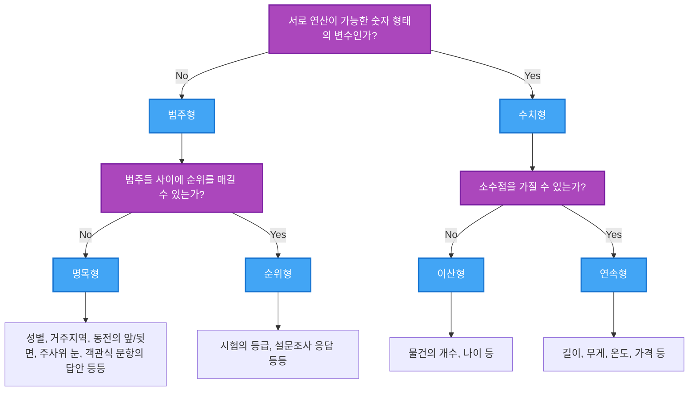

## 🚀 TL;DR

- 인공지능은 인간의 지능을 모방하는 시스템을 만드는 학문으로, 머신러닝과 딥러닝은 그 하위 분야이다.
- 전통적인 소프트웨어 개발 방식으로는 해결하기 어려운 문제들을 머신러닝을 통해 접근할 수 있다.
- 머신러닝은 본질적으로 파라미터화된 함수를 사용하여, 데이터로부터 패턴을 학습하는 과정이다.
- 함수는 수학적으로 정의역에서 공역으로의 매핑으로 표현할 수 있으며, 머신러닝에서는 이러한 함수가 모델이 된다.
- 머신러닝 학습 과정은 오차를 최소화하는 최적의 파라미터를 찾아가는 과정이다.
- 데이터의 품질과 적절한 표현 방식은 머신러닝 모델의 성능에 핵심적인 영향을 미친다.
- 탐색적 데이터 분석(EDA)은 데이터를 이해하고 전처리하는 중요한 단계이다.

## 🧠 인공지능, 머신러닝, 딥러닝

- 인공지능(AI)은 인간의 지능을 모방하는 시스템을 만드는 학문적 분야
- 크게 약 인공지능(Weak AI)과 강 인공지능(Strong AI)으로 구분
    - 약 인공지능: 특정 작업을 수행하도록 설계된 AI (예: 음성인식, 번역)
    - 강 인공지능: 인간 수준의 의식과 사고능력을 갖춘 AI (아직 이론 단계)

{: .w-75 .center}

### 기술적 특이점(Technological Singularity)

인공 지능이 발전해, 인간의 도움 없이도 스스로 발전을 계속할 수있게 되고, 결국 인류 전체를 합친 것 보다 뛰어난 지능을 갖게 되는 가상의 시점을 이르는 말!

그렇다면,
- 대략 언제쯤 이런 일이 일어날까?
- 이런 일이 일어나기는 하는 걸까?
- 특이점이 오면 사회는 어떻게 변할까?
- 특이점이 왔다면, 우는 그것을 어떻게 알 수 있을까?

이 주제에 대해서 요즘 많은 AI 석학들이 의견을 말하고 있다.
- [제프리 힌튼의 인터뷰에 대한 기사](https://m.dongascience.com/news.php?idx=67825)
- [AI 규제안에 대한 다양한 의견](https://www.aitimes.com/news/articleView.html?idxno=163409)
- [제프리 힌튼 vs 얀 르쿤](https://slownews.kr/118771)

현 시점에서는 딱 답이 있는 것도 아니고, 여전히 여러 권위있는 사람들이 토론 중인 사항이다.

개인적으로는 기술적 특이점은 반드시 온다고 생각한다. (이미 벌써 수십년 전부터 컴퓨터가 인간보다 계산을 잘 한다!)

인류는 농업 혁명, 산업 혁명, 정보 혁명을 거쳐 왔고 그때마다 항상 불안해하고, 많은 우려가 있었지만 결국 답을 찾아냈다.

기술의 특이점 역시 인류가 거쳐갈 또 하나의 혁명일 뿐이다.
그것이 인류에게 위협이 될 것인지, 도움이 될 것인지는 결국 인류가 결정할 것이고 결정권이 인류에게 있는 이상 항상 답은 있다고 생각한다.

### 세계적인 AI 석학들의 AI 에 대한 설명

- **요슈아 벤지오(Yoshua Bengio)**: 딥러닝의 3대 권위자 중 한 명, 신경망 기반 언어 모델 연구
    - 주요 공헌: 인공신경망의 학습 알고리즘 개발 및 자연어 처리 발전
    - [AI 에 대한 설명 영상](https://www.kmooc.kr/view/course/detail/10883?tm=20250411212151)

- **제프리 힌튼(Geoffrey Hinton)**: "딥러닝의 대부"로 불리며, 역전파 알고리즘 대중화
    - 주요 공헌: 역전파 알고리즘, RBM(Restricted Boltzmann Machines), 캡슐 네트워크
    - [AI 에 대한 설명 영상](https://www.youtube.com/watch?v=SN-BISKo2lE)

- **얀 르쿤(Yann LeCun)**: CNN(합성곱 신경망) 개발, 컴퓨터 비전 분야 혁신
    - 주요 공헌: LeNet 아키텍처, CNN을 통한 이미지 인식 발전

> 이 석학들의 연구는 현대 딥러닝 프레임워크(TensorFlow, PyTorch 등)의 이론적 기반을 제공했으며, 컴퓨터 비전, 자연어 처리, 음성 인식 등 다양한 분야의 발전에 기여했다.
{: .prompt-tip}


## 🤔 어떻게 복잡한 기능들을 만들까?

- 전통적인 소프트웨어 공학에서는 복잡한 기능(고수준의 기능)을 만들기 위해선,
	- 작은 단위의 작업으로 분해 -> 구현
	- 작은 단위의 구현체 -> 조합
- 하지만 한계가 있다...
	- 이미지가 고양이 이미지인지 맞추는 문제도 잘 풀지 못함

*그런데, 머신러닝으로 이러한 고수준의 기능을 만들 수 있다!*

### "함수"의 구조와 예시

{: .w-50 .center}

소프트웨어를 함수에 비유하자면,
- 일련의 과정을 통해 **입력(Input)** 으로 들어오는 무언가를,
- 특정한 **출력(Output)** 으로 변환해 주는 것 

### 함수 구조와 머신러닝의 동작원리

우리가 원하는 소프트웨어 즉, 함수는 이미지를 받아서, 고양이인지 판별해주는 함수라고 하자.

```python
def determine_which_img_is_cat_or_dog(some_image):
    return "고양이면 1 아니면 0"
```

머신러닝은 다음과 같은 과정을 거쳐서 함수를 만들어 낸다.

{: .w-50 .center}

- `?` 에 *특정 값*들을 넣어 계산 해봄; 출력: 0.2, 오차: `| 1 - 0.2 | = 0.8`
- `?` 에 *특정 값*들을 넣어 계산 해봄; 출력: 0.4, 오차: `| 1 - 0.4 | = 0.4`
	
- ... 계속 반복 ...

- `?` 에 *특정 값*들을 넣어 계산 해봄; 출력: 1.0, 오차: `| 1 - 1.0 | = 0.0` ✨ ✨ ✨
- `?` 에 *특정 값*들을 넣어 계산 해봄; 출력: 1.1, 오차: `| 1 - 1.1 | = 0.1`

위와 같은 과정을 계속 반복하면서 `오차가 0 인 특정 값` 을 찾아내면, 이미지가 고양이 이미지인지 판별하는 함수 만들기 끝!

이것을 고급지게 표현하자면,
1. **파라미터**를 활용해 **함수들의 공간**을 정의
2. **데이터**를 사용해 **얼마나 틀렸는가**를 측정
3. **틀린 정도(오차)**를 **최소화**하는 파라미터 찾아내기

> "함수들의 공간" 이라는 표현을 쓰는 이유는 뭘까?
> 
> "함수들의 공간"이라는 표현은 수학적인 개념에서 비롯된 것으로 공간이라는 용어를 사용하는 이유는,
> 1. 수학적 표현 : 함수는 수학적으로 하나의 점이나 위치로 생각할 수 있다. 서로 다른 파라미터 값을 가진 각각의 함수는 이 "함수 공간"에서 서로 다른 위치를 차지한다.
> 2. 파라미터화된 집합: 머신러닝에서 모델을 만들 때, 우리는 파라미터(가중치와 편향 등)로 정의되는 함수들의 집합을 다룬다. 이 파라미터들이 변함에 따라 다양한 함수가 만들어진다.
> 3. 탐색의 개념: 머신러닝 학습 과정은 이 "함수 공간"을 탐색하며 최적의 함수(최소 오차를 가진)를 찾아가는 과정으로 볼 수 있다.
> 4. 차원의 개념: 각 파라미터는 하나의 차원을 나타낸다. 예를 들어 2개의 파라미터가 있다면, 2차원 공간에서 최적점을 찾는 것과 같다. 실제 딥러닝에서는 수백만 개의 파라미터가 있을 수 있으므로, 그에 해당하는 고차원 공간이 되는 것이다.
> 
> 예를 들어, 간단한 선형 모델 `f(x) = ax + b`를 생각해보면, 여기서 a와 b는 파라미터이다. 가능한 모든 a와 b의 조합은 2차원 공간을 형성하며, 각 점(a, b)은 하나의 특정 함수를 나타낸다!
> 
> 학습 알고리즘은 이 공간에서 데이터에 가장 잘 맞는 지점(최적의 a와 b 값)을 찾는 것이다.
{: .prompt-tip}

## 📐 함수의 수학적 표현법
### 용어 및 개념 정리

{: .w-50 .center}

위 함수를 수식으로 표현하면 아래와 같다.
{: .w-75 .center}

-  $$f_\Theta$$ 를 **모델(Model)** 이라고 지칭한다.
	- 즉, 파라미터에 따라 다르게 정의되는 함수
- $$\Theta$$ 는 **파라미터(Parameter)** 즉, 매개변수 혹은 모수라고 칭한다.
- 함수의 입력을 **정의역(Domain)** 이라고 칭하고, 출력을 **공역(Range)** 라고 칭한다.
	- 그 공간들은 아래와 같은 수식으로 표현한다.
		- 실수들의 집합: $$\mathbb{R}$$
		- 10차원 벡터들의 집합: $$\mathbb{R}^{10}$$
		- 3x4 행렬들의 집합: $$\mathbb{R}^{3\times4}$$

### 평균 값을 구해주는 함수(Average) 의 입출력 수식
$$Average$$ 는 다음과 같이 수식을 적을 수 있다.

$$ \mathbb{R} \times \mathbb{R} \longrightarrow \mathbb{R} $$

$$ [x_1, x_2] \mapsto 0.5 * x_1 + 0.5*x_2 $$

- $$\mathbb{R}$$ 실수 집합을 의미한다.
- $$\mathbb{R} \times \mathbb{R}$$ 은 **두 실수의 순서쌍 공간** 을 의미한다.
- 화살표($$\longrightarrow$$)는 **한 공간에서 다른 공간으로의 매핑**을 나타낸다.
- $$\mapsto$$기호는 "~에 대응한다"는 의미로, **구체적인 함수 규칙**을 나타낸다.
- 즉, 이 함수는 *두 개의 실수를 입력받아 하나의 실수를 출력하는 것*이다.

- **입력**: 임의의 숫자 2개, **출력**: 두 숫자의 평균값

### 가위바위보의 승패를 계산하는 함수(RSP) 의 입출력 수식

$$RockScissorsPaper$$ 는 다음과 같이 수식을 적을 수 있다.

$$\mathbb{Z}_3 \times \mathbb{Z}_3 \longrightarrow \mathbb{Z}_3$$

$$ [x_1, x_2] \mapsto 1 + x_1 - x_2 $$

- 여기서 $$\mathbb{Z}_3$$ 는 3으로 나눈 나머지를 표현한 공간: `{0, 1, 2}`
- 이 함수는 두 개의 $$\mathbb{Z}_3$$ 원소를 입력받아 하나의 $$\mathbb{Z}_3$$ 원소를 출력한다.


- **입력**: A, B 두 사람이 각각 무엇을 냈나? `{0: 가위, 1: 바위, 2: 보}`
- **출력**: 어떤 결과가 나왔다? `{0: A 승리, 1: 비김, 3: B 승리}`

## 🧮 데이터와 모델의 학습

{: .w-75 .center}

### 왜 그냥 y 가 아니라 $$\hat{y}$$ 일까?

위 머신러닝 함수의 수식을 다시보면, 그냥 y 를 사용하지 않고 $$\hat{y}$$ 를 사용하고 있다.

*사실 우리는 이미 y 를 사용하고 있다. 바로 정답을 y 라고 칭하고 있다!*
- 이 정답을 다음과 같이 표현한다.
	- **정답 라벨(Label)**
	- **목표값(Target)**
	- **GT(Ground Truth)**

$$f(5) = 8 = y$$

$$f_7(5) = ... = 12 = \hat{y}$$


보다시피, *특정 파라미터일 때의 함수* 에 입력을 넣어서 나오는 **출력은 정답이 아니다!**


즉, $$\hat{y}$$  은 **모델의 출력(Output)** 또는 **예측값(Prediction)** 인 것이다.

> $$\hat{y}$$ 는 통계학에서 추정값 또는 예측값을 나타내는 기호다. 
{: .prompt-tip}
### 데이터셋

데이터셋이란 함수의 **입력값 x** 와 그에 대응하는 **라벨 y** 의 *순서쌍을 1개 이상 모아둔 집합* 이다. 

이는 마치 문제집과 같다.

문제(x)와 정답(y)이 쌍으로 제공되어, 학습자(모델)가 이를 통해 문제 해결 방법을 배울 수 있다.

예를 들어, 고양이 이미지 분류기를 학습시키기 위한 데이터셋은 다음과 같이 생겼을 수 있다.(1: True, 0: False)

| 이미지(x)   | 라벨(y) |
| -------- | ----- |
| 고양이1.jpg | 1     |
| 강아지1.jpg | 0     |
| 고양이2.jpg | 1     |
| ...      | ...   |


> **라벨링(Labeling)과 애노테이션(Annotation)**
>- 라벨링은 데이터에 정답이나 분류 카테고리를 할당하는 과정이다.
	- 개념: 데이터 샘플 전체에 하나의 정답 값이나 분류를 지정하는 것
	- 예시
	    - 이미지에 "고양이", "개" 등의 카테고리 부여
	    - 텍스트 리뷰에 "긍정", "부정" 감정 분류
	    - 스팸 메일 분류에서 "스팸" 또는 "정상" 표시
> - 애노테이션은 라벨링보다 더 넓은 개념으로, 데이터에 더 상세한 메타데이터나 추가 정보를 부가하는 과정이다.
> 	- 개념: 데이터의 특정 부분이나 특징에 대한 구체적인 정보 제공
> 	- 예시
	    - 이미지 내 객체의 위치를 바운딩 박스로 표시
	    - 의료 영상에서 특정 조직이나 질병 부위 마킹
	    - 자연어 처리에서 문장의 각 단어에 품사 정보 추가
> 
> 최근에는 이러한 일을 하는 직업도 생겼다!
{: .prompt-tip}

### 손실함수


{: .w-75 .center}

손실함수(Loss Function)는 **모델의 예측값과 실제 정답 사이의 차이를 수치화**하는 함수다.

이는 모델이 얼마나 잘 학습하고 있는지 측정하는 지표가 된다.
- 예를 들어, 다음과 같은 모델이 있을 때,

$$ f_\Theta: \mathbb{R} \longrightarrow \mathbb{R} \ x \mapsto x + \Theta $$

- 손실함수는 다음과 같이 정의할 수 있다. 

$$ Loss: \mathbb{R}^2 \longrightarrow \mathbb{R} \ (y, \hat{y}) \mapsto |y-\hat{y}| $$

- 이는 예측값($$\hat{y}$$)과 실제값(y) 사이의 절대 차이를 계산하는 것이다.
- 손실함수의 특징은 다음과 같다.
	- 일반적으로 결과가 스칼라 값(단일 숫자)
	- 데이터셋의 샘플마다 계산한 후 평균값을 사용
	- 예측이 정확할수록(f(x) = y) 손실값은 0에 가까워진다.
	- 미분 가능해야 한다.(학습 과정에서 기울기를 계산하기 위함)
- 손실함수의 여러 이름
	- 로스 함수
	- 코스트(비용) 함수
	- 에러 함수

### 머신러닝에서 학습의 의미

간단히 말해 **데이터로부터 패턴을 찾아 모델의 파라미터를 최적화하는 과정**이다.

이 과정은 다음과 같이 구체화할 수 있다.
1. 정해진 parametric 함수, 즉 **모델**에서
2. **데이터**의 인풋값에 대한 모델 **예측값과 라벨의 차이**로 계산되는 **손실 함수를 최소화**하는
3. **파라미터** $$\Theta$$ 를 찾아내는 것

즉, 다양한 머신러닝 방법론들은 다음 내용에 따라서 나뉜 것이다.
- 어떤 구조의 어떤 파라미터를 가진 모델을 사용하는가? (모델 정의)
- 함수의 input/output 은 어떤 것인가?
- 어던 손실 함수를 사용하는가? (손실 함수 정의)
- 데이터는 어떻게 주어지는가?

## 📊 ML 시스템의 확장성, 그리고 한계
### Universal Approximation Theorem

머신러닝으로 어떤 기능까지 구현할 수 있을까? *무엇이든 가능!*

이 **보편 근사 정리(Universal Approximation Theorem)** 의 핵심은,
- 충분한 뉴런을 가진 단일 은닉층 신경망이 연속 함수를 임의의 정확도로 근사할 수 있다.
- 딥러닝에서 더 많은 층을 사용하면 함수 근사를 더 효율적으로 할 수 있다.
- 즉, 특정 조건에서 *어떤 함수라도 근사할 수 있다.*
	- 그럼 함수가 아니면 잘 안되겠네?!
	- "할 수 있다"라는 것 하기 쉽다는 말은 아니겠네?!

> 이를 일상적인 예로 설명하자면, 충분히 많은 작은 직선 조각들을 이어 붙이면 어떤 곡선이든 표현할 수 있는 것과 같다. 직선 조각들이 더 작아질수록(뉴런이 많아질수록) 원래 곡선에 더 가까워지는 것 처럼 말이다.
{: .prompt-tip}

### Label Noise

라벨 노이즈(Label Noise)는 **데이터셋의 정답 라벨에 오류가 있는 경우** 를 말한다. 이는 머신러닝 모델의 성능을 저하시키는 주요 원인 중 하나이다.

예시)
- 고양이 이미지에 "강아지"라고 잘못 라벨링된 경우
- 스팸 이메일 분류기에서 정상 이메일이 스팸으로 잘못 표시된 경우
- 의료 이미지에서 질병의 유무가 잘못 기록된 경우

라벨 노이즈가 있으면 모델은 잘못된 패턴을 학습할 수 있으며, 이는 일종의 "가짜 정보"를 기반으로 학습하는 것과 같다. 

마치 잘못된 답안지로 공부하는 학생과 같은 상황이다.

### Ambiguity

모호성(Ambiguity)은 **동일한 입력에 대해 여러 개의 유효한 출력이 가능한 상황**을 말한다.

예시)
- 언어 번역: 하나의 문장이 여러 가지 방식으로 번역될 수 있음
- 이미지 생성: "강아지 그림"이라는 요청에 대해 무수히 많은 유효한 이미지가 있음
- 추천 시스템: 동일한 사용자에게 여러 다른 추천이 적절할 수 있음

모호성은 *함수적 관계*(하나의 입력에 하나의 출력)를 학습하는 전통적인 머신러닝 방식에 도전이 된다. 

최근에는 이러한 모호성을 다루기 위해 확률적 모델이나 생성 모델 등 다양한 접근법이 개발되고 있다고 한다.

> 보편 근사 정리는 신경망이 *이론적으로* 어떤 함수든 학습할 수 있음을 보장하지만, 실제로는 최적의 파라미터를 찾는 것이 어려울 수 있다. 또한 이 정리는 *연속 함수*에 대해서만 적용된다는 것을 명심해야 한다. 
{: .prompt-warning}

### 머신러닝을 위한 문제 정의

머신러닝 문제를 정의하는 핵심 단계는 입력과 출력을 숫자로 표현하는 것이다. 

*컴퓨터는 오직 숫자만을 이해하기 때문에!*

효과적인 문제 정의를 위해서 다음과 같은 단계를 따를 수 있다.
1. **해결하고자 하는 문제 명확히 하기**: 예를 들어, "이미지가 고양이인지 판별하기" 또는 "주택 가격 예측하기"
2. **입력 데이터 정의하기**: 입력은 무엇이며, 어떻게 숫자로 표현할 수 있는지
3. **출력 데이터 정의하기**: 원하는 결과는 무엇이며, 어떻게 숫자로 표현할 수 있는지
4. **평가 지표 선정하기**: 모델의 성능을 어떻게 측정할 것인지

예를 들어, 이미지 분류 문제에서는,
- 입력: 이미지 픽셀값의 배열 (예: 224x224x3 픽셀의 RGB 값)
- 출력: 클래스 확률 (예: [0.1, 0.8, 0.1] - 각 클래스에 속할 확률)
- 평가 지표: 정확도, 정밀도, 재현율 등

## 📑 데이터의 종류와 구분

머신러닝에서 사용되는 데이터는 여러 방식으로 분류할 수 있다. 



> 이 내용을 외울 필요는 없다. 그저 이러한 데이터 유형을 알고 적절하게 인코딩하고 전처리할 수 있는 것이 중요하다!
{: .prompt-tip}

## 🔢 다양한 도메인의 데이터 처리

컴퓨터는 숫자만 이해할 수 있고, 숫자만 내뱉는다고 했다.

*그럼 데이터를 "어떻게" 숫자로 표현할 수 있을까?*

### 정형 데이터의 범주형 변수 표현

정형 데이터(Structured Data)는 테이블 형태로 정리된 데이터를 의미한다.

범주형 변수는 다음과 같은 방법으로 숫자로 변환할 수 있다.
1. **인덱싱(Indexing)**: 각 범주의 순서를 임의로 정해, **0번 부터 번호를 부여** 하여 표현하는 방식
	- **레이블 인코딩(Label Encoding)** 이라고도 함
	- 예시) 영어 알파벳: a(0), b(1), … z(25)
	- 텍스트 데이터의 경우 글자별(character-level), 단어별(word-level) 로 인덱싱하기도 함
	- 장점: 단순하고 직관적
    - 단점: 범주 간의 순서가 없는데도 숫자의 크기 관계가 생김
2. **원-핫 인코딩(One-Hot Encoding)**: 각 범주를 0과 1로 이루어진 벡터로 표현
    - 예시) 빨강=[1,0,0], 파랑=[0,1,0], 녹색=[0,0,1]
    - 장점: 범주 간 크기 관계가 형성되지 않음
    - 단점: 범주가 많을 경우 차원이 커짐
3. **임베딩(Embedding)**: 각 범주를 저차원 벡터 공간에 매핑
    - 예시) 빨강=[0.2, 0.5], 파랑=[0.8, 0.1], 녹색=[0.4, 0.9]
    - 장점: 범주 간 의미적 관계를 고려할 수 있음
    - 단점: 학습이 필요하고 복잡함

### 비정형 데이터: 텍스트 데이터의 수치적 표현 방법

1. **BoW(Bag of Words)**: 문서에 등장하는 단어들의 빈도를 벡터로 표현
    - 예: "나는 사과를 좋아한다" → [1, 1, 1, 1, 0, 0, ...] (나, 사과, 를, 좋아한다, ...)
    - 장점: 직관적이고 구현이 쉬움
    - 단점: 단어 순서 정보가 손실되고, 벡터 차원이 매우 커질 수 있음

2. **TF-IDF(Term Frequency-Inverse Document Frequency)**: 단어의 중요도를 고려한 가중치 부여    
    - 장점: 일반적인 단어(예: "the", "a")의 영향력을 줄여줌
    - 단점: 여전히 단어 순서 정보가 손실됨

3. **워드 임베딩(Word Embedding)**: 단어를 의미적으로 유사한 벡터 공간에 매핑
    - 예: Word2Vec, GloVe, FastText
    - 장점: 단어 간 의미적 관계를 보존함
    - 단점: 사전 학습이 필요하고, 문맥 정보가 제한적

4. **문맥 기반 임베딩**: 문맥을 고려한 동적 단어 표현
    - 예: BERT, GPT 등
    - 장점: 다양한 문맥에서 단어의 의미를 포착함
    - 단점: 계산 비용이 높음

### 비정형 데이터: 이미지와 동영상 데이터의 수치적 표현 방법

1. **원시 픽셀 값**: 이미지를 픽셀의 RGB 값 배열로 표현
    - 예: 224x224 컬러 이미지 → [224, 224, 3] 형태의 배열
    - 장점: 원본 정보를 모두 보존
    - 단점: 차원이 매우 크고, 의미적 정보가 명시적이지 않음

2. **특징 추출**: 이미지에서 의미 있는 특징을 추출하여 벡터로 표현
    - 예: SIFT, HOG, 엣지 감지 등
    - 장점: 차원 감소, 의미 있는 특징 포착
    - 단점: 수작업 설계가 필요하고, 모든 특징을 포착하기 어려움

3. **딥러닝 특징**: 합성곱 신경망(CNN) 등을 통해 자동으로 특징 학습    
    - 예: CNN의 중간 레이어 활성화 값
    - 장점: 계층적 특징을 자동으로 학습
    - 단점: 많은 데이터와 계산 자원이 필요

4. **동영상 표현**: 시간적 차원을 고려한 표현
    - 프레임 시퀀스, 움직임 벡터, 3D 합성곱 특징 등
    - 장점: 시간적 정보 포착
    - 단점: 계산 복잡도가 높음

### 비정형 데이터: 소리 데이터의 수치적 표현 방법

1. **파형(Waveform)**: 시간에 따른 진폭 값의 배열
    - 장점: 원본 정보 보존
    - 단점: 차원이 크고, 의미적 패턴 분석이 어려움

2. **스펙트로그램(Spectrogram)**: 시간-주파수 영역에서의 에너지 분포    
    - 장점: 주파수 정보를 시각화하기 좋음
    - 단점: 시간과 주파수 해상도 사이의 트레이드오프

3. **MFCC(Mel-Frequency Cepstral Coefficients)**: 인간 청각 시스템을 모델링한 특징
    - 장점: 음성 인식에 효과적
    - 단점: 일부 정보 손실

4. **Mel-스펙트로그램**: 인간 청각 시스템에 맞춘 스펙트로그램
    - 장점: 인간의 청각 인식 방식에 더 가까움
    - 단점: 원시 데이터보다 정보 손실이 있음

## 👍 좋은 데이터란?

좋은 데이터이기 위해서는,
- 다양한 입력에서 학습할 수 있도록 **다양성**이 크고
- 모델 성능을 떨어뜨리는 **노이즈가 적은** 데이터셋이어야 한다.

데이터셋의 다양성은 전체 데이터 공간을 얼마나 잘 커버하는지를 나타낸다. 만약 데이터가 특정 영역에만 치우쳐 있다면, 그 외 영역에 대한 예측은 부정확할 가능성이 높다.

> 데이터셋 편향(Bias)은 데이터가 실제 분포를 대표하지 못하고 특정 영역에 치우친 경우를 말한다. 이런 편향은 모델이 학습한 패턴의 일반화 능력을 크게 제한한다. 
{: .prompt-tip}

## 💥 다양한 형태의 라벨 노이즈

데이터 노이즈는 머신러닝 모델의 성능을 저하시키는 주요 원인이다!

- **결측치**: NULL, NaN, NA 등으로 표현되는, 데이터 내 비어있는 값
- **이상치**: 데이터의 전반적인 분포에서 크게 벗어나는 값
- **틀린 라벨**: 단순 실수 또는 모호성으로 인해 잘못 라벨링된 경우
    - 예: 데이터 입력 오류, 인간의 실수 등
    - 영향: 전체적인 정확도 감소, 학습 곡선의 수렴 속도 저하
- **중복 샘플**: 동일한 데이터가 여러 번 등장하는 경우
- **도메인 외 샘플**: 다루려는 대상이 아닌 것들이 포함된 경우

이 외에도,
- **체계적 노이즈(Systematic Noise)**: 특정 패턴을 따라 발생하는 라벨 오류
    - 예: 특정 센서의 오작동, 특정 데이터 수집원의 편향
    - 영향: 모델이 잘못된 패턴을 학습하여 특정 유형의 입력에 대해 일관되게 오류 발생
- **불확실성 기반 노이즈(Uncertainty-based Noise)**: 모호한 케이스에서 발생하는 라벨 불일치
    - 예: 의료 진단에서 전문가 간 의견 불일치
    - 영향: 모델이 결정 경계 주변에서 불안정해짐
- **클래스 의존적 노이즈(Class-dependent Noise)**: 특정 클래스에 더 많은 오류가 발생하는 경우
    - 예: 희귀한 질병 케이스에 대한 오진단 비율이 높음
    - 영향: 특정 클래스의 재현율/정밀도가 크게 저하됨

## 🤫 머신러닝 모델의 Silent Failure

Silent Failure(조용한 실패)는 모델 학습 과정에서 코드는 에러 없이 실행되고 손실 함수도 감소하는 것처럼 보이지만, 실제 평가 시 모델 성능이 매우 저조한 현상을 말한다. 😫

이는 *일반적인 에러보다 위험*한데, 문제가 있다는 사실을 파악하는 데 시간이 오래 걸리기 때문이다. 

종종 데이터나 전처리의 문제에서 발생하며, 다음과 같은 이유로도 발생한다.

1. **분포 변화(Distribution Shift)**: 학습 데이터와 실제 사용 환경의 데이터 분포가 다른 경우
    - 예: 실내 사진으로 학습한 모델을 야외에서 사용
    - 대응 방법: 분포 변화 감지 알고리즘, 지속적인 모니터링

2. **과신뢰(Overconfidence)**: 모델이 틀린 예측에도 높은 확신을 보이는 경우    
    - 예: 소프트맥스 출력이 잘못된 클래스에 대해 0.99의 확률을 부여
    - 대응 방법: 불확실성 추정, 앙상블 방법, 온도 스케일링

3. **이상치 처리 부재**: 학습 데이터에 없던 패턴이나 이상치를 감지하지 못하는 경우    
    - 예: 완전히 새로운 유형의 입력에 대해 무의미한 예측
    - 대응 방법: 이상치 감지 알고리즘, OOD(Out-of-Distribution) 감지

4. **편향된 평가 지표**: 평가 지표가 실제 성능을 정확히 반영하지 못하는 경우
    - 예: 불균형 데이터셋에서 정확도만 고려
    - 대응 방법: 다양한 평가 지표 사용, 실제 사용 환경을 반영한 테스트

## 🧐 좋은 데이터셋을 만들기

다음과 같은 방법을 실천함으로써 좋은 데이터셋을 만들 수 있다.

- **노이즈 처리**
    - EDA를 통해 데이터의 노이즈 파악 및 정제
    - 이상치 및 결측치 적절한 처리

- **데이터셋 라벨링 기준 설정**
    - 애매한 샘플에 대한 명확하고 구체적인 라벨링 기준 수립
    - 데이터셋 전체에 일관성 있게 적용

- **데이터 수집 계획**: 목적과 용도에 맞는 데이터 수집 전략 수립
    - 다양한 소스에서 데이터 수집
    - 실제 사용 환경을 반영한 데이터 확보
    - 클래스 간 균형 고려

-  **품질 관리 프로세스**: 데이터 품질을 지속적으로 모니터링하고 개선
    - 중복 제거, 이상치 검출
    - 라벨링 검증 프로세스 구축
    - 교차 검증을 통한 라벨링 품질 향상

-  **데이터 확장(Data Augmentation)**: 기존 데이터를 변형하여 다양성 증가
    - 이미지: 회전, 크기 조정, 색상 변경 등
    - 텍스트: 동의어 대체, 문장 구조 변경 등
    - 시계열: 노이즈 추가, 시간 이동 등

-  **데이터 클리닝**: 잡음과 오류 제거
    - 누락된 값 처리
    - 이상치 식별 및 처리
    - 일관성 검사 및 수정

-  **메타데이터 관리**: 데이터의 출처, 수집 방법, 전처리 과정 등을 문서화
    - 데이터 버전 관리
    - 라벨링 지침 문서화
    - 데이터 변경 이력 추적

> 데이터 수집과 준비에 충분한 시간과 자원을 투자하는 것이 중요하다. 실제 머신러닝 프로젝트에서 모델 개발보다 데이터 준비에 더 많은 시간이 소요되는 경우가 많다. 
{: .prompt-tip}

## 🔍 EDA 의 진행과정

> EDA 는 데이터에 대한 명확한 이해를 통해 정확한 문제 정의와 모델링을 가능하게 하고, 데이터의 노이즈나 편향을 파악하여 해결방법을 모색하는 과정이다.
>
> EDA 를 하기 위한 Pandas 활용 법은 [이 글](https://yuiyeong.github.io/posts/pandas-marathon/)을 참조하면 좋다.
> EDA 를 할 때 마주하는 개념이나 용어는 다음 글을 참조하라.
> - [기술통계량](https://yuiyeong.github.io/posts/basic-mathematics-for-ai-02/#-%EA%B8%B0%EC%88%A0%ED%86%B5%EA%B3%84%EB%9F%89descriptive-statistic)
> - [확률분포](https://yuiyeong.github.io/posts/basic-mathematics-for-ai-04/)
{: .prompt-tip}

필수적인 진행 과정은 아래와 같다.

1. **데이터셋의 기본 정보 파악**
    - 샘플 수, 변수 수와 종류
    - 각 변수의 데이터 타입과 가능한 값의 범위
    - 결측치 및 이상치 확인

2. **변수별 통계량과 분포 확인**    
    - 기술 통계량(평균, 중앙값, 표준편차 등) 계산
    - 히스토그램, 박스플롯 등을 통한 분포 시각화
    - 왜도(skewness)와 첨도(kurtosis) 분석

3. **변수 간 관계 파악**    
    - 상관계수 분석
    - 산점도와 상관행렬 그림(correlation plot) 활용

과정을 보다 세분화 해보자면 아래와 같이 진행할 수 있다.

1.  **데이터 수집 및 로딩**: 필요한 데이터를 수집하고 분석 환경에 로드합니다.
    
2. **기본 탐색**: 데이터의 기본 특성을 파악합니다.
    - 데이터 크기, 변수 유형, 누락된 값
    - 기술 통계량(평균, 중앙값, 표준편차 등)
    - 데이터의 첫 몇 행 확인

3. **단변량 분석(Univariate Analysis)**: 개별 변수의 분포를 분석합니다.    
    - 수치형 변수: 히스토그램, 박스플롯, 밀도 플롯
    - 범주형 변수: 막대 그래프, 파이 차트
    - 중심 경향성, 분산, 왜도, 첨도 등 통계량 확인

4. **이변량 분석(Bivariate Analysis)**: 두 변수 간의 관계를 분석합니다.    
    - 수치형 vs 수치형: 산점도, 상관계수
    - 수치형 vs 범주형: 박스플롯, 바이올린 플롯
    - 범주형 vs 범주형: 열지도, 모자이크 플롯

5. **다변량 분석(Multivariate Analysis)**: 여러 변수 간의 복잡한 관계를 분석합니다.    
    - 산점도 행렬, 상관 행렬
    - 주성분 분석(PCA), t-SNE 등 차원 축소 기법
    - 군집 분석

6. **가설 검증**: 데이터에서 발견한 패턴이나 관계에 대한 가설을 통계적으로 검증합니다.
    
## 🔧 데이터 전처리

EDA 과정에서 발견된 데이터 노이즈를 제거하고, 모델이 잘 학습할 수 있는 형태로 데이터를 변환하는 과정이다.

1. **이상치 및 결측치 처리**
    - 샘플 또는 변수 제거
    - 적절한 값으로 대체(평균, 중앙값, 0 등)

2. **피쳐 스케일 조정**
    - 표준화(Standardization): 평균 0, 표준편차 1로 변환
    - 정규화(Normalization): 최소값 0, 최대값 1로 변환

> EDA와 데이터 전처리는 단순히 절차를 따르는 의례가 아니라, 데이터를 지속적으로 파악하고 문제를 발견하며 해결해나가는 대화형 과정이다.
{: .prompt-tip}
