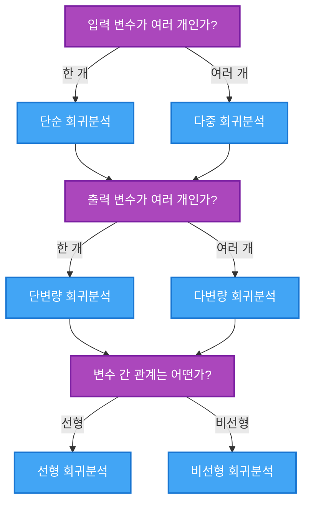

## 🚀 TL;DR

- 회귀 분석은 연속형 출력 변수를 예측하는 머신러닝/통계 분석의 기본 도구다.
- 선형회귀는 가장 널리 사용되며 입력-출력 간 선형 관계를 모델링한다.
- 회귀 모델은 단순/다중, 단변량/다변량, 선형/비선형으로 분류된다.
- 실무에서는 **다중 (단변량) 선형 회귀** 가 가장 흔히 사용된다.
- 선형회귀의 핵심은 **오차(MSE)를 최소화하는 최적의 직선을 찾는 것** 이다.
- 상관관계 분석은 변수 간 관계 강도를 측정하지만 인과관계를 의미하지 않는다.
- 피어슨 상관계수(-1~1)는 관계의 강도와 방향을 나타낸다.
- 회귀와 상관관계 분석은 선형성, 등분산성, 정규성, 독립성 가정을 전제로 한다.
- 공선성과 다중공선성에 주의해야 효과적인 모델을 구축할 수 있다.

## 📓 실습 Jupyter Notebook

- [Linear Regression01.ipynb](https://github.com/yuiyeong/notebooks/blob/main/machine_learning/linear_regression01.ipynb)

## 🧠 머신러닝 방법론의 분류 체계

머신러닝 알고리즘은 다양한 기준으로 분류할 수 있지만, 가장 기본적인 분류 방식은 학습 방법에 따른 것이다. 이번 글에서는 머신러닝의 두 가지 핵심 패러다임인 지도학습과 비지도학습에 대해 살펴본다.

> 머신러닝 알고리즘의 분류는 학습 방식의 차이를 이해하는 기초적인 틀을 제공한다. 
> 
> 머신러닝 방법론은 전통적으로 지도학습과 비지도학습으로 나뉘지만, 현대 머신러닝에서는 이 경계가 점점 모호해지고 있다.
>  
> 하이브리드 접근법, 전이 학습(Transfer Learning), 메타 학습(Meta Learning) 등 다양한 방법론이 등장하면서 문제 해결을 위한 도구가 더욱 풍부해지고 있다.
> 
> 머신러닝 엔지니어나 데이터 과학자는 다양한 방법론의 장단점을 이해하고, 주어진 문제와 데이터에 가장 적합한 접근법을 선택할 수 있어야 한다. 이론적 이해와 함께 실제 적용 경험을 쌓는 것이 중요하다.
{: .prompt-tip}

### Supervision 과 지도학습

지도학습(Supervised Learning)은 입력 데이터(X)와 그에 대응하는 결과값(Y) 또는 레이블이 함께 제공되는 학습 방법이다. 모델은 이 데이터를 통해 입력과 출력 사이의 관계를 학습하고, 새로운 입력에 대한 예측을 수행한다.

#### 개념 소개

지도학습은 "선생님의 지도 아래 학습한다"는 비유로 이해할 수 있다. 모델에게 많은 예시와 정답을 보여주면서 패턴을 학습시키는 것이다. 예를 들어, 주택 가격 예측 모델을 만들기 위해 면적, 방 개수, 위치 등의 특성(features)과 실제 판매 가격을 함께 제공하여 학습시킨다.

#### 수학적 표현

지도학습은 함수 $$f$$를 학습하는 과정으로 볼 수 있다.

$$ f: X \rightarrow Y $$

$$ \hat{y} = f(x) $$

여기서 $$X$$는 입력 데이터 공간, $$Y$$는 출력 공간이며, 학습의 목표는 예측값 $$\hat{y}$$가 실제값 $$y$$에 최대한 가까워지도록 하는 함수 $$f$$를 찾는 것이다.

> [이 글](https://yuiyeong.github.io/posts/what-is-the-machine-learning/#-%EC%96%B4%EB%96%BB%EA%B2%8C-%EB%B3%B5%EC%9E%A1%ED%95%9C-%EA%B8%B0%EB%8A%A5%EB%93%A4%EC%9D%84-%EB%A7%8C%EB%93%A4%EA%B9%8C) 에서 소개한 머신러닝의 학습의 의미가 이 지도학습에 해당한다.
{: .prompt-tip}
### 비지도학습의 개념

비지도학습(Unsupervised Learning)은 레이블이 없는 데이터만을 사용하여 데이터의 구조나 패턴을 발견하는 학습 방법이다. 정답 없이 데이터 자체의 특성을 학습하는 것이다.

#### 개념 소개

비지도학습은 "스스로 패턴을 발견한다"는 개념으로 이해할 수 있다. 예를 들어, 고객 데이터를 분석하여 자연스럽게 형성되는 고객 그룹을 찾거나, 고차원 데이터를 낮은 차원으로 축소하여 데이터의 핵심 특성을 파악하는 데 사용된다.

#### 수학적 표현

비지도학습에서는 데이터 $X$의 구조나 분포를 모델링하는 함수 $f$를 찾는다.

$$ f: X \rightarrow Z $$

여기서 $$Z$$는 데이터의 구조를 나타내는 잠재 공간(latent space)이나 군집 할당(cluster assignment) 등이 될 수 있다.

## 🎯 지도학습의 세부 분류

지도학습은 타깃 변수의 유형에 따라 크게 **회귀(Regression)** 와 **분류(Classification)** 로 나눌 수 있다.

### 회귀 모델

- 회귀는 연속형 변수를 예측하는 문제를 다룬다. 
- 예시) 주택 가격 예측, 온도 예측, 매출액 예측 등의 문제

$$f:\ \mathbb{R}^n \longrightarrow \mathbb{R}$$

$$\ \ \ \ \ \ \bar{x} \mapsto f(x)$$

### 분류 모델

- 분류는 범주형 변수를 예측하는 문제를 다룬다.
- 예시) 이메일 스팸 분류, 질병 진단, 손글씨 숫자 인식 등의 문제

$$f:\ \mathbb{R}^n \longrightarrow \{ 0,1,\ ...,\ k \}$$

$$\bar{x} \mapsto f(x)$$

> 이산형 변수를 회귀 모델로 푸는 것이 더 나은 선택일 때도 있다!
{: .prompt-warning}

## 🔍 비지도학습의 세부 방법론

비지도학습은 주로 **차원 축소** 와 **군집화** 라는 두 가지 주요 접근법으로 나눌 수 있다.
### 차원 축소(Dimensionality Reduction)

차원 축소는 고차원 데이터의 중요한 특성을 유지하면서 차원을 줄이는 기법이다. 데이터 시각화, 계산 효율성 향상, 노이즈 제거 등의 목적으로 사용된다.

- **주성분 분석(PCA)**: 가장 흔히 사용되는 선형 차원 축소 기법이다. 데이터의 분산을 최대한 보존하는 방향(주성분)을 찾아 데이터를 투영한다.
- **t-SNE(t-distributed Stochastic Neighbor Embedding)**: 비선형 차원 축소 기법으로, 고차원 공간에서의 데이터 간 유사성을 저차원에서도 보존하려고 시도한다. 특히 데이터 시각화에 유용하다.
### 군집화(Clustering)

군집화는 데이터를 유사한 특성을 가진 그룹으로 나누는 기법이다. 레이블이 없는 데이터에서 구조를 발견하는 데 유용하다.

## 📚 현대 머신러닝의 발전된 패러다임

지도학습과 비지도학습이라는 기본 패러다임을 넘어, 현대 머신러닝에서는 다양한 학습 방식이 등장하고 있다.

- **준지도학습(Semi-supervised Learning)**: 적은 양의 레이블된 데이터와 많은 양의 레이블되지 않은 데이터를 함께 활용하는 방법이다. 레이블링이 비용이 많이 드는 분야(의료 영상, 자연어 처리 등)에서 유용하다.
- **강화학습(Reinforcement Learning)**: 에이전트가 환경과 상호작용하며 보상을 최대화하는 방향으로 학습하는 방법이다. 로봇 제어, 게임 AI, 자율주행 등의 분야에서 활용된다.
- **자기지도학습(Self-supervised Learning)**: 레이블 없이 데이터 자체에서 감독 신호를 생성하여 학습하는 방법이다. 최근 자연어 처리와 컴퓨터 비전 분야에서 큰 성과를 내고 있다.

## 🤔 회귀 모델 방법론

"회귀"라는 용어는 어디서 왔을까? 이는 프랜시스 골턴(Francis Galton)의 1885년 논문 "Regression toward Mediocrity in Hereditary Stature"(유전에 의한, 평균 신장으로의 회귀)에서 유래했다고 한다.

실제로 회귀 분석에서는 아무것도 "회귀"하지 않는다. 이는 단지 역사적인 명명일 뿐이며, 분석 과정과는 직접적인 관련이 없다.

> 흥미롭게도 "회귀"라는 용어의 유래와 현대 회귀분석 방법론은 직접적인 관련이 없다. 골턴이 관찰한 현상과 우리가 사용하는 통계적 방법은 단지 이름만 공유할 뿐이다. 
{: .prompt-tip}

## ℹ️ 회귀 모델이란, 연속형 변수의 예측

회귀 모델이란 무엇인가? 

간단히 말해서, 회귀 모델은 입력값이 무엇이든 **출력값이 연속형 변수**인 모델을 사용하는 방법론이다.

예를 들어)
- 부모의 키 → 자녀의 키
- 오늘의 기온 → 내일의 기온
- 거주지역과 나이, 성별 → 연간 소득 금액
- 특정 회사의 수익 관련 지표들 → 1주일 후 주식의 가격

입력 변수는 여러 개거나 범주형이라도 상관없다. 또한 출력 변수가 여러 개인 경우도 있다. 예를 들어, 사람 얼굴 이미지에서 눈, 코, 입의 위치 좌표를 예측하는 경우가 이에 해당한다.

## 👩‍👶‍👦 회귀 모델의 세부 구분

- **입력변수의 수에 따라** 
    - 한 개인 경우 → 단순 회귀분석
    - 여러 개인 경우 → 다중 회귀분석
- **출력변수의 수에 따라**
    - 한 개인 경우 → (단변량) 회귀분석
    - 여러 개인 경우 → 다변량 회귀분석
- **모델의 형태에 따라**
    - 선형 회귀분석
    - 비선형 회귀분석

*즉, 조건 3가지에 따라서 총 8가지의 회귀 분석 방법론이 있다.*

### 1. 단순 단변량 선형 회귀분석 ✨

$$y = \beta_0 + \beta_1 x + \varepsilon$$

- **예시**: 공부 시간(x)에 따른 시험 점수(y) 예측
- **응용 분야**: 마케팅 지출과 매출 간의 관계, 키와 체중의 관계 분석
- **활용도**: 높음
	- 기초적인 분석과 교육 목적으로 많이 사용된다.
	- 가장 단순하고 이해하기 쉬우며, 빠른 분석이 가능하다.
	- 초기 데이터 탐색과 두 변수 간의 관계 파악에 유용하다.

### 2. 단순 단변량 비선형 회귀분석

- 다항 회귀의 경우,
$$y = \beta_0 + \beta_1 x^2 + \beta_2 x + \varepsilon$$
- 지수 회귀의 경우,
$$y = \beta_0 e^{\beta_1 x} + \varepsilon$$

- **예시**: 시간(x)에 따른 인구 성장(y)의 지수적 관계 모델링
- **응용 분야**: 생물학적 성장 모델, 화학 반응 속도, 약물 반응 곡선
- **활용도**: 중간~낮음
	- 비선형성이 명확한 특정 도메인에서만 주로 사용
	- 단일 변수만으로는 복잡한 현상을 설명하기 어려움
	- 성장 곡선, 포화 현상 등 비선형 패턴이 명확한 경우에 유용

### 3. 단순 다변량 선형 회귀분석

$$y_1 = \beta_{01} + \beta_{11} x + \varepsilon_1$$

$$y_2 = \beta_{02} + \beta_{12} x + \varepsilon_2$$

$$ ... $$

$$y_m = \beta_{0m} + \beta_{1m} x + \varepsilon_m$$

- **예시**: 주택 면적(x)에 따른 가격, 세금, 관리비(y₁, y₂, y₃) 동시 예측
- **응용 분야**: 한 가지 처치(약물 용량)가 여러 생체 지표에 미치는 영향 분석
- **활용도**: 낮음
    - 하나의 입력으로 여러 출력을 예측하는 것은 정보가 부족한 경우가 많음
    - 예측력이 제한적이고 실용성이 낮음
    - 대부분의 경우 각 출력 변수에 대해 개별 모델을 구축하는 것을 선호

### 4. 단순 다변량 비선형 회귀분석

$$y_1 = \beta_{01} + \beta_{11} x^2 + \beta_{21} x + \varepsilon_1$$

$$y_2 = \beta_{02} e^{\beta_{12} x} + \varepsilon_2$$

$$ ... $$

$$y_m = f_m(x) + \varepsilon_m$$

- **예시**: 운동 시간(x)에 따른 심박수, 칼로리 소모, 체지방률(y₁, y₂, y₃)의 비선형적 변화
- **응용 분야**: 금속 가열 시간과 다양한 금속 특성(강도, 연성, 전도성) 간의 비선형 관계
- **활용도**: 매우 낮음
    - 단순 다변량 선형 회귀의 한계에 비선형성의 복잡성이 더해진 것
    - 특수한 물리적/화학적 시스템에서 간혹 사용되지만, 대부분의 경우 더 복잡한 모델이 선호
    - *현대적 접근법에서는 이런 문제를 다른 방법론으로 해결하는 경우가 많음*

### 5. 다중 단변량 선형 회귀분석 ✨✨✨

$$y = \beta_0 + \beta_1 x_1 + \beta_2 x_2 + ... + \beta_n x_n + \varepsilon$$

- **예시**: 학생의 공부 시간, 수면 시간, 이전 성적(x₁, x₂, x₃)을 통한 시험 점수(y) 예측
- **응용 분야**: 주택 가격 예측(면적, 위치, 방 개수 등 다양한 변수 사용), 질병 위험 요인 분석
- **활용도**: 매우 높음 (가장 많이 사용됨)
    - 해석이 직관적이고, 계산이 효율적이며, 대부분의 소프트웨어/라이브러리에서 기본 지원
    - 다양한 변수를 고려하면서도 단일 목표를 예측하는 상황이 **실무에서 가장 일반적**
    - 주택 가격 예측, 판매량 예측, 의학 연구 등 대부분의 예측 작업에 활용

### 6. 다중 단변량 비선형 회귀분석 ✨

$$y = \beta_0 + \beta_1 x_1^2 + \beta_2 x_1 x_2 + \beta_3 e^{x_3} + ... + \varepsilon$$

- **예시**: 온도, 압력, 촉매 농도(x₁, x₂, x₃)에 따른 화학 반응 수율(y)의 비선형 모델링
- **응용 분야**: 기계 학습의 SVM(커널 적용), 신경망, 날씨 예측 모델
- **활용도**: 중간~높음
    - 복잡한 현상을 모델링할 때 사용
    - 비선형성이 분명한 경우 선형 모델보다 예측력이 우수
    - 화학 반응 모델링, 날씨 예측, 복잡한 생물학적 시스템 분석 등에서 활용
    - *최근에는 머신러닝 기법(랜덤 포레스트, 부스팅 등)으로 대체되는 경향* 이 있습니다.

### 7. 다중 다변량 선형 회귀분석

$$y_1 = \beta_{01} + \beta_{11} x_1 + \beta_{21} x_2 + ... + \beta_{n1} x_n + \varepsilon_1$$

$$y_2 = \beta_{02} + \beta_{12} x_1 + \beta_{22} x_2 + ... + \beta_{n2} x_n + \varepsilon_2$$

$$ ... $$

$$y_m = \beta_{0m} + \beta_{1m} x_1 + \beta_{2m} x_2 + ... + \beta_{nm} x_n + \varepsilon_m$$

- **예시**: 교육 수준, 경력, 직업(x₁, x₂, x₃)에 따른 소득, 부채, 자산(y₁, y₂, y₃) 동시 예측
- **응용 분야**: 경제 지표 예측, 다중 센서 캘리브레이션, 다차원 제어 시스템
- **활용도**: 낮음~중간
    - 여러 출력 변수를 동시에 예측하는 것보다 각각 독립적인 모델을 구축하는 것이 종종 더 효과적
    - 해석이 복잡해지고 각 출력 변수의 최적화가 서로 상충될 수 있음
    - 출력 변수 간 상관관계가 높은 특수한 경우에 유용할 수 있음

### 8. 다중 다변량 비선형 회귀분석

$$y_1 = f_1(x_1, x_2, ..., x_n) + \varepsilon_1$$

$$y_2 = f_2(x_1, x_2, ..., x_n) + \varepsilon_2$$

$$ ... $$

$$y_m = f_m(x_1, x_2, ..., x_n) + \varepsilon_m$$

$$ \text{여기서 각 }f_i \text{는 입력 변수들의 비선형 함수}$$

- **예시**: 다양한 식재료 배합과 조리 시간/온도(x₁, x₂, ..., x_n)에 따른 음식의 맛, 질감, 향(y₁, y₂, y₃)의 복잡한 관계
- **응용 분야**: 복잡한 생물학적 시스템 모델링, 금융 시장 예측, 첨단 재료 특성 분석
- **활용도**: 매우 낮음
    - 가장 복잡한 형태의 회귀분석
    - 계산 비용이 매우 높고, 모델 해석이 어려우며, 과적합 위험이 큼
    - *이러한 복잡한 문제는 요즘에는 딥러닝과 같은 다른 접근법으로 해결하는 경우가 많음*
    - 복잡한 시뮬레이션이나 고도의 과학적 연구에서 간혹 사용

### 실무적 고려사항

실무에서 회귀분석 유형을 선택할 때는 다음과 같은 요소들을 고려해야한다.

1. **데이터의 특성과 양** 
    - 데이터가 적을 경우 더 단순한 모델을 선호
    - 변수 간 관계가 명백히 비선형적이라면 비선형 모델을 고려
2. **해석 가능성의 중요도**    
    - 의사결정에 활용되는 모델은 해석 가능성이 중요
    - 선형 모델이 비선형 모델보다 해석이 용이성이 중요
3. **예측 정확도의 중요도**
    - 순수 예측이 목적이라면 비선형 모델이나 기계학습 방법론이 더 적합할 수 있음
    - 정확도와 해석 가능성 사이의 균형을 고려해야함
4. **계산 효율성**    
    - 대규모 데이터셋이나 실시간 예측에서는 계산 효율성이 중요
    - 복잡한 모델은 훈련과 예측에 더 많은 자원이 필요
5. **도메인 지식**
    - 특정 분야에서는 변수 간의 관계에 대한 사전 지식이 있을 수 있으며, 이는 모델 선택에 영향을 줌

이러한 이유로, 대부분의 실무 환경에서는 **다중 단변량 선형 회귀분석(5번 유형)** 이 가장 널리 활용되며, 필요에 따라 **비선형성을 추가하거나(6번 유형)** **더 단순한 모델(1번 유형)** 을 사용하는 경향이 있다.

***여기서는 다변량 또는 비선형인 경우는 다루지 않는다.***

##  🔥 단순 선형 회귀모델

단순 선형 회귀는 Line Fitting 관점에서 이해할 수 있다. 즉, 직선의 **기울기(a)** 와 **y절편(b)** 을 조절해 데이터(점들)와의 **오차** 가 가장 작아지도록 만드는 과정이다.

{: .w-75 .center}

- 수식으로 표현하면,

$$ f_{a,b}: \mathbb{R} \longrightarrow \mathbb{R} $$

$$ x \longmapsto ax + b $$

- 여기서 오차는 목표값과 출력값 간 차이의 제곱으로 정의되는 **MSE(Mean Squared Error)** *손실함수* 를 사용한다.

$$ Loss_{MSE}: \mathbb{R}, \mathbb{R} \longrightarrow \mathbb{R} $$

$$ y, \hat{y} \longmapsto (y - \hat{y})^2 $$

- 이것은 다시 **최적화 문제** 로 볼 수 있다.
	- "MSE 함수의 값을 최소화하는 a 와 b 의 값을 찾는 문제"
	- 즉, 주어진 조건 하에서 목적 함수의 최솟값(또는 최댓값)을 찾는 것이기 때문이다.
	- 여기서 목적 함수는, 매개변수 a와 b에 따라 오차(MSE)가 결정되는 함수이다!( [참고 링크](https://yuiyeong.github.io/posts/what-is-the-machine-learning/#%ED%95%A8%EC%88%98-%EA%B5%AC%EC%A1%B0%EC%99%80-%EB%A8%B8%EC%8B%A0%EB%9F%AC%EB%8B%9D%EC%9D%98-%EB%8F%99%EC%9E%91%EC%9B%90%EB%A6%AC) )

{: .w-75 .center} [convex 함수 그림 출처](https://math.stackexchange.com/questions/2682688/why-cost-function-for-linear-regression-is-always-a-convex-shaped-function)

- **기울기(a) 와 y절편(b)에 의한 MSE 값의 그래프**

{: .w-75 .center} 

- **기울기(a) 와 y절편(b)에 의한 MSE 값의 등고선 과 최소값**

{: .w-75 .center}

> **Convex 함수(볼록 함수)란?**
> - **정의**: 함수의 임의의 두 점을 직선으로 연결했을 때, 그 직선이 항상 함수의 그래프보다 위에 있거나 함수의 그래프 위에 놓이는 함수
> - **수학적 정의**
> $$\text{모든 }x_1,\ x_2 \text{ 및 } 0 \leq t \leq 1\text{ 에 대해서,}$$
> $$ f(tx_1 + (1 - t)x_2)\ \leq\ tf(x_1) + (1 - t)f(x_2)$$
> - **시각적 이해**: 함수의 그래프가 아래로 볼록한(밥그릇 모양의) 형태를 가진다.
> - **중요한 특성**: Convex 함수의 가장 중요한 특성은 **국소 최소값이 전역 최소값**이라는 점이다.
> 	- 즉, 함수의 값이 감소하다가 증가하기 시작하는 지점이 있다면, 그 지점이 바로 함수의 전체 영역에서의 최소값이다.
{: .prompt-tip}

## 🆚 최적화의 수치적 해법과 해석적 해법

최적화 문제의 해를 구하는 방법은 크게 두 가지로 나눌 수 있다.

1. **해석적 해법(Analytical Solution)**: 수학적인 공식을 통해 직접 정확한 해를 구하는 방법
	- 예를 들어, 2차방정식 $$x^2 + x - 6 = 0$$의 해를 근의 공식이나 인수분해로 구하는 경우
	- 근의 공식으로 2차 방정식은 해를 바로 구할 수도 있다.
$$ x = \frac{-b \pm \sqrt{b^2 - 4ac}}{2a} $$
2. **수치적 해법(Numerical Solution)**: 점진적으로 근사적인 해를 찾는 방법
	- 예를 들어, 뉴턴 방법(Newton's Method)은 함수의 접선을 이용해 함수가 0이 되는 지점(근사적 해)을 반복적으로 찾아가는 방법

{: .w-75 .center}

해석적 해법은 빠르고 정확하지만 복잡한 문제에서는 사용하기 어렵다.
- 2차 방정식의 해는 근의 방정식으로 바로 구한다지만, 3차 방정식, 4차 방정식부터는??

반면 수치적 해법은 근사값을 구하고 시간이 더 걸리지만, 더 다양한 문제에 적용할 수 있다.

> 뉴턴이 17세기에 개발한 원래의 방법, "뉴턴-랩슨 방법(Newton-Raphson method)"으로도 알려져 있다. 이 방법은 수학적 방정식 f(x)=0f(x) = 0 f(x)=0의 근(해)을 찾기 위한 알고리즘이다. 
> 이 방법은 제약 사항이 많았어서 20세기에 들어서 여러 변형과 개선이 이루어졌다.
> - 원래의 뉴턴 방법(뉴턴의 원래 아이디어는 매우 단순하면서도 강력했다.)
> 1. 함수의 근사값 $$ x_0 $$​에서 시작한다.
> 2. 해당 지점에서 함수의 접선을 그린다.
> 3. 이 접선이 x축과 만나는 지점을 다음 근사값 $$ x_1 $$
​으로 사용한다.
> 4. 이 과정을 반복하면 점점 실제 근에 가까워진다.
> 5. 수식으로는 다음과 같이 표현된다.
> $$ x_{n + 1} = x_n - \frac{f(x_n)}{f'(x_n)} $$
{: .prompt-tip}

## 🔢 단순 선형 회귀 분석의 해석적 해법

MSE 손실함수를 사용하는 선형회귀 분석의 경우, 다음과 같은 해석적 해법을 사용해 파라미터를 구할 수 있다.

$$ \theta = (X^T X)^{-1} X^T y $$

여기서 X 는 입력 데이터 행렬, y 는 출력 벡터, θ 는 구하고자 하는 파라미터 벡터이다.

이 공식을 통해 데이터만 입력하면 정확한 최적 파라미터를 바로 계산할 수 있다. 

**하지만 역행렬을 계산하는 과정이 복잡할 수 있어, 이 부분은 종종 수치적 방법으로 해결한다.**

## 🖇 상관 분석과 상관계수

- **상관관계(Correlation)**: 한 변수가 변화할 때 다른 변수가 **함께 변화하는 경향성** 을 의미한다. 
- **인과관계(Causation)**: 한 변수의 변화가 **원인** 이 되어 **다른 변수를 변화** 시키는 관계를 말한다.
- 인과 관계가 있는 변수는 상관관계도 있지만, **역은 성립하지 않는다!**

> 인과관계가 있는 변수는 상관관계도 있지만, 상관관계가 있다고 해서 반드시 인과관계가 있는 것은 아니다. 
> 
> 예시) 아이스크림의 판매량 그래프와 물놀이 사고 발생률 그래프가 비슷한 모습이다!
> 
> 상관관계의 판단은 비교적 쉽지만, 인과관계를 확립하는 것은 훨씬 더 복잡하고 까다롭다.
{: .prompt-tip}

**상관관계 분석(Correlation Analysis)** 은 두 변수 사이의 상관관계를 판단하기 위한 분석 과정이다.

그 결과로 나오는 **피어슨 상관계수(Pearson Correlation Coefficient)** 는 두 변수 사이에 어느 정도로 강한 선형 상관관계가 있는지를 **-1 에서 1 범위** 의 숫자로 나타낸다.

$$ r = \frac{\sum_{i=1}^{n}(x_i - \bar{x})(y_i - \bar{y})}{\sqrt{\sum_{i=1}^{n}(x_i - \bar{x})^2 \sum_{i=1}^{n}(y_i - \bar{y})^2}} $$

- 피어슨 상관계수 별 예시 산점도 그래프

{: .center}

## 💭 상관관계 분석의 가정

**상관관계 분석은 다음의 4가지 기본 가정을 전제로 한다.**

1. **선형성(Linearity)**: 두 변인 X 와 Y 의 관계가 직선적이어야 한다.
	- **선형성** 가정은 특히 중요하다. 
	- 두 변수 사이에 비선형적 관계가 있다면, 선형 분석 방법으로는 이를 제대로 포착할 수 없다. 
	- 예시) U자형 관계를 가진 데이터는 매우 강한 관계가 있지만, 선형 상관계수는 0에 가까울 수 있다.

{: .w-75 .center}

2. **등분산성(Homoscedasticity)**: X 의 값에 관계없이 Y 의 분산이 일정해야 한다.
	- 모든 입력값 범위에서 오차의 분산이 일정해야 함(잔차의 분산이 동일해야함)을 의미
	- 반의어: **이분산성(Heteroscedasticity)**

3. **정규성(Normality)**: 각 변인은 모두 정규분포를 따라야 한다.
	- 일반적으로 분석 전에 표준화(standardization) 방식의 전처리를 진행해준다.
4. **독립성(Independence)**: 각 샘플들은 모두 독립적이어야 한다. 즉, 독립적으로 추출되었어야 한다.

만약 데이터가 이러한 가정을 충족하지 않는다면, 상관계수를 계산해도 그 의미가 크게 감소한다.

## 📐 상관계수 행렬

여러 변수 간의 상관관계를 한눈에 파악하기 위해 **상관행렬(Correlation Matrix)** 을 사용한다. 이는 모든 변수 쌍의 조합에 대한 상관계수를 행렬 형태로 나타낸 것이다.

상관행렬은 일반적으로 히트맵 형태로 시각화되며, 데이터 탐색 단계에서 변수 간의 관계를 파악하는 데 매우 유용하다.
대각선을 기준으로 위 삼각형과 아래 삼각형의 데이터는 같은 값을 나타내므로, 보통 아래 삼각형에 있는 데이터를 시각화한다.

> pandas 의 DataFrame 자료구조를 사용하면, pandas.DataFrame.corr() 함수를 사용해서 상관계수 행렬값을 계산할 수 있다.
{: .prompt-tip}

{: .w-75 .center}

상관행렬을 분석할 때 주의해야 할 개념이 **공선성(Collinearity)** 과 **다중공선성(Multicollinearity)** 이다.

- **공선성**: 두 변수 사이의 상관계수가 1.0이나 -1.0에 매우 가까울 때, 이는 한 변수가 다른 변수와 거의 완벽하게 선형 관계에 있음을 의미한다.
- **다중공선성**: 한 변수가 여러 변수들의 선형 결합으로 표현될 수 있는 경우를 말한다.

이러한 현상이 발견되면, 일반적으로 변수를 제거하거나 변환하는 등의 전처리 작업이 필요하다.

## 🤝 상관 분석과 선형회귀의 관계

상관계수와 회귀계수는 비슷해 보이지만 서로 다른 개념이다.

- **상관계수**: 상관관계의 강도를 나타낸 것으로, 직선의 기울기가 아니다. 직선의 기울기가 변해도 부호가 바뀌지 않는 한 상관계수의 값은 달라지지 않는다.
- **회귀계수(결정계수)**: **직선의 기울기 자체** 를 의미하므로, 데이터의 기울기가 변하면 값도 변한다.

> 흥미롭게도, 데이터가 표준화(평균 0, 표준편차 1)되어 있는 경우에는 상관계수와 회귀계수의 값이 일치하게 된다!
{: .prompt-tip}
