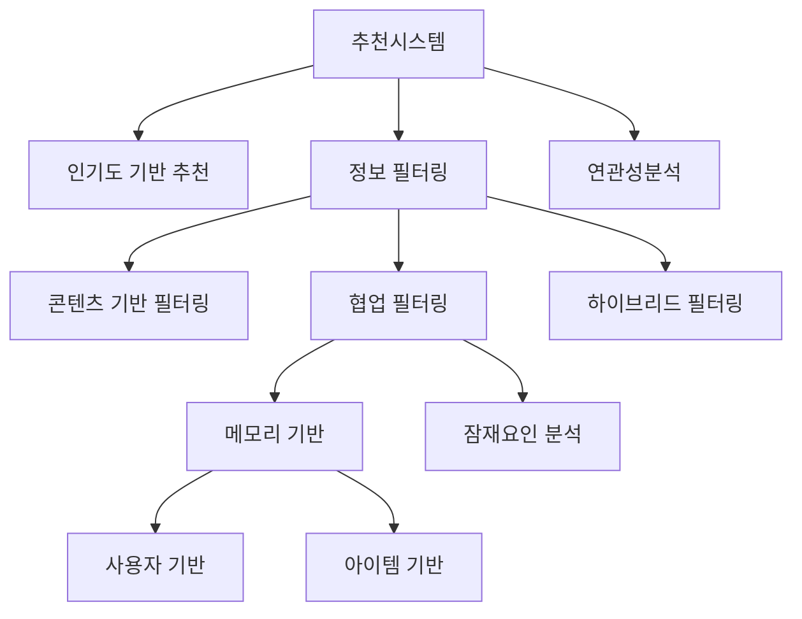

## 🚀 TL;DR

- 추천 시스템은 사용자의 취향을 분석해 방대한 콘텐츠 중 **적합한 아이템**을 찾아주는 **머신러닝 기술**
- **유튜브**, **넷플릭스**, **아마존** 등 다양한 서비스에서 **개인화된 경험**과 **기업 수익 향상**을 위해 활용
- 추천 시스템은 크게 **인기도 기반**, **연관 규칙 분석**, **콘텐츠 기반 필터링**, **협업 필터링**으로 구분
- **협업 필터링**은 **사용자-아이템 선호도 행렬**을 기반으로 유사 사용자나 유사 아이템을 찾아 추천
- **잠재 요인 분석**은 **넷플릭스 대회**에서 주목받은 기법으로 사용자와 아이템을 **저차원 공간**에 매핑
- **콜드 스타트**, **희소성**, **롱테일** 등의 문제를 해결하기 위해 실제로는 **하이브리드 방식**을 주로 활용
- 추천 시스템은 **정형 데이터 활용**, **다양한 학습 패러다임** 적용, **실제 비즈니스 가치** 창출의 좋은 사례

## 📦 사용하는 python package

- numpy==1.26.4
- pandas==2.2.3
- matplotlib==3.10.1

## 📓 실습 Jupyter Notebook

- [Recommender System](https://github.com/yuiyeong/notebooks/blob/main/machine_learning/recommendation_system.ipynb)

## 📚 추천 시스템(Recommender System)이란?

추천 시스템(Recommender System)은 데이터를 활용해 수많은 옵션 중에서 사용자가 원하는 것이 무엇인지 예측하고, 범위를 좁혀 결국 사용자에게 가장 적합한 아이템을 찾아주는 머신러닝의 한 분야다.

쉽게 비유하면, 추천 시스템은 사용자의 취향을 잘 아는 친구나 전문가가 "이거 네 취향일 것 같아"라고 말하는 것과 비슷하다. 

다만 이 '친구'는 수백만 명의 다른 사용자 데이터와 아이템에 대한 방대한 정보를 바탕으로 추천을 하는 알고리즘이다.

유튜브와 넷플릭스의 경우를 생각해보자. 넷플릭스는 약 4200만개의 영상을 보유하고 있으며, 유튜브는 매 분마다 약 400시간 분량의 새로운 영상이 업로드된다. 이렇게 방대한 컨텐츠 중에서 사용자가 좋아할 만한 컨텐츠를 찾아주는 것이 추천시스템의 역할이다.

> 추천 시스템은 정보 일종의 정보 필터링의 한 형태로 볼 수 있기도 하다.
>
> 올바르게 구현된 추천시스템은 , 사용자에게 **개인화된 경험을 제공**하고 **정보 과부하 문제를 해결**하는 데 중요한 역할을 해서, **기업 수익 향상(!)** 으로 이어진다.
{: .prompt-tip}

## 💡 추천 시스템이 왜 ML 기초에?

**기업의 수익과 직접적으로 연관된 기술!**

그렇다 보니 이미 수많은 분야에서, 매우 오래전부터 연구되어 왔다.

그래서 다른 어떤 분야 보다도,
- *다양한 형태의 데이터*를 활용하고
- *다양한 형태의 문제정의*를 통해 접근한다.

거기다가,
- 비정형 데이터를 다룰 기술(딥러닝)이 충분히 발전하기 이전에도 연구되었던 기술
- 수많은 *정형 데이터 활용 기법 예시*가 있다.

그래서 이 추천 시스템을 알아봄으로써 다음과 같은 이점을 얻을 수 있다.
- 머신러닝의 실제 **응용 사례**를 명확하게 볼 수 있다.
- **지도학습**, **비지도학습**, **강화학습** 등 다양한 학습 패러다임을 모두 활용할 수 있다.
- **행렬 분해**, **차원 축소**, **클러스터링** 등 중요한 ML 기법들이 적용된다.
- **대규모 데이터**를 다루는 실전적인 문제를 경험할 수 있다.
- 알고리즘의 **성능 평가**와 **개선**을 위한 다양한 지표와 방법을 학습할 수 있다.

> 추천 시스템은 **이론적 개념**을 **실제 비즈니스 가치**로 **변환하는 과정을 이해**하는 데 매우 유용한 사례이다.
{: .prompt-tip}

## 🔍  추천 시스템의 구성요소

### 사용자(User)

- 추천을 받는 대상으로, 추천 시스템을 이용하는 서비스의 이용자
- 사용자의 특성, 행동 패턴, 선호도 등이 추천에 중요한 요소로 활용

### 아이템(Item)

- 추천 시스템에서 추천되는 대상
- 영화, 음악, 제품 등 서비스에 따라 다양한 형태를 가질 수 있다.

> 기본적인 추천 시스템의 목표는 **(유저)에게 (아이템)을 추천**하는 것이다.
{: .prompt-tip}

### 활동 기록(Transaction Log)

- 아이템 구매, 페이지 조회, 체류시간 등 사용자의 모든 행동에 대한 기록
- 이는 추천 시스템의 중요한 데이터 소스가 된다.

{: .w-75 .center}

### 피드백(Feedback)

- 활동 기록 중에서도 특히 사용자의 선호나 비선호를 나타내는 행동들을 말한다. 
- 피드백은 크게 두 가지로 나눌 수 있다.
	- **직접적(Explicit) 피드백**: 좋아요 버튼, 별점, 리뷰 등 사용자가 직접적으로 아이템에 대한 선호/비선호를 *표현하는 행동*
	-  **간접적(Implicit) 피드백**: 클릭, 구매, 체류 시간 등 선호도를 *간접적으로 유추*할 수 있는 행동

- 예시) 영화에 대한 평점

{: .w-75 .center}

- 예시) 영화를 본 시간과 완료 여부

{: .w-75 .center}

### 유저 프로필(User Profile)

- 여러 활동 기록과 피드백을 통해 수집한 유저에 대한 정보를 모아놓은 데이터
- 사용자의 선호도, 인구통계학적 정보, 행동 패턴 등이 포함될 수 있다.

## 🌐 추천 시스템 활용 예시

### 스트리밍 서비스

스트리밍 서비스는 추천시스템이 가장 두드러지게 활용되는 영역 중 하나다.

- **동영상 스트리밍**: 넷플릭스, 유튜브 등에서 사용자의 시청 기록을 바탕으로 관심 있을 만한 영상 추천
- **음악 스트리밍**: 스포티파이, 멜론 등에서 사용자의 음악 취향에 맞는 곡이나 플레이리스트 추천
- **웹툰/만화**: 네이버 웹툰 등에서 사용자가 좋아할 만한 새로운 웹툰 추천

> 넷플릭스의 경우, 2006년에 개최한 "Netflix Prize" 경진대회는 추천 시스템의 발전에 큰 영향을 미쳤다. 이 대회에서는 영화 평점 예측 정확도를 10% 향상시키는 알고리즘에 100만 달러의 상금을 제공했다.
> 
> [참고 링크](https://en.wikipedia.org/wiki/Netflix_Prize)
{: .prompt-tip}

### 소셜 네트워크 서비스

소셜 미디어에서는 사용자 경험을 향상시키고 참여도를 높이기 위해 추천시스템을 활용한다.

- **콘텐츠 피드**: 페이스북, 인스타그램, 트위터 등에서 무한 스크롤링 형태로 사용자에게 관련성 높은 콘텐츠 제공
- **친구/팔로우 제안**: 사용자가 관심을 가질 만한 새로운 연결을 추천
- **유해 콘텐츠 필터링**: 혐오 표현, 가짜뉴스 등을 필터링하는 네거티브 추천시스템

### 교육 서비스
교육 분야에서는 개인화된 학습 경험을 제공하기 위해 추천시스템이 활용된다.

- 학생이 어려워하는 문제 유형을 파악하여 맞춤형 학습 자료 제공
- 학습 진도와 패턴에 따른 다음 학습 주제 추천
- 학생별 맞춤형 복습 자료 제공
- **코세라**, **유데미**, **칸 아카데미**와 같은 온라인 교육 플랫폼은 학습자의 관심사와 학습 패턴에 맞는 강의를 추천한다.

### 헬스케어 서비스

> 헬스케어 분야의 추천 시스템은 단순한 편의성을 넘어 사용자의 건강 개선과 직결되는 중요한 역할을 한다. 따라서 정확성과 책임성이 특히 중요하다.
{: .prompt-warning}

의료 및 건강 분야에서도 개인화된 서비스를 제공하기 위해 추천시스템이 도입되고 있다.

- 개인의 건강 기록에 기반한 맞춤형 건강 조언
- 특정 연령대나 건강 상태에 맞는 검진 추천
- 식단 선호도와 건강 상태를 고려한 식단 추천
- **핏빗**, **애플 헬스**, **삼성 헬스**와 같은 건강 관리 앱은 사용자의 건강 상태와 활동 패턴에 맞는 운동, 식단, 수면 조언을 추천한다.

### 금융 서비스

> 금융 분야의 추천 시스템은 개인 재무 상황 개선에 도움을 줄 수 있지만, 동시에 민감한 금융 정보를 다루기 때문에 보안과 개인정보 보호가 매우 중요하다.
{: .prompt-warning}

금융 분야에서는 고객 맞춤형 상품 추천과 리스크 관리에 추천시스템을 활용한다.

- 고객의 재정 상태와 목표에 맞는 금융 상품 추천
- 소비 패턴에 기반한 신용카드 추천
- 대출 상환 가능성 예측을 통한 리스크 관리
- **신용카드 회사**, **은행**, **핀테크 앱**은 사용자의 소비 패턴, 소득, 자산 등을 분석하여 맞춤형 금융 상품을 추천한다.

### 광고 플랫폼의 추천 시스템

디지털 광고 시장은 추천시스템의 가장 수익성 높은 활용 분야 중 하나다!

- 사용자의 관심사와 행동 패턴에 맞는 맞춤형 광고 제공
- 실시간 입찰 시스템을 통한 광고 노출 최적화
- 전환율 예측을 통한 광고 효과 극대화
- **구글 애즈**, **페이스북 광고**, **네이버 키워드 광고**와 같은 광고 플랫폼은 사용자의 검색 이력, 관심사, 인구통계학적 정보를 바탕으로 관련성 높은 광고를 추천한다.

## 🎯 추천 시스템은 어떤 입력값을 활용하는가?

### 유저 프로필 기반

- 사용자의 인구통계학적 정보, 선호도, 행동 패턴 등을 활용한다.
- 이는 컨텍스트 정보(Contextual Information) 라고 볼 수 있다.

### 아이템 프로필 기반

- 아이템의 특성, 카테고리, 메타데이터 등을 활용한다.
- 이는 컨텍스트 정보(Contextual Information) 라고 볼 수 있다.

### 피드백 데이터 기반

- 사용자-아이템 상호작용 데이터를 활용한다.
- 명시적 피드백(Explicit Feedback)
    - 사용자가 직접 제공하는 선호도 정보
    - 예: 별점, 좋아요/싫어요, 리뷰, 설문조사 응답

- 암시적 피드백(Implicit Feedback)
    - 사용자의 행동에서 추론되는 선호도 정보
    - 예: 클릭, 시청 시간, 구매 이력, 검색 쿼리, 장바구니 담기

## 🎯 추천 시스템의 문제 정의

추천시스템의 목표에 따라 다양한 형태의 머신러닝 문제로 정의할 수 있다.

### 분류 모델링

- 특정 사용자가 특정 아이템을 클릭할지 예측 (이진 분류)
- 사용자가 아이템을 구매할 확률 예측 (이진 분류)

### 회귀 모델링

- 사용자가 아이템에 부여할 평점 예측 (연속값)
- 시청 시간이나 체류 시간 예측 (연속값)

### 랭킹 기반 모델링(비지도 학습)

- 사용자에게 가장 관련성 높은 아이템 순위 예측
- 관련성 점수나 유사도 기반 정렬

## 🔄 추천 시스템의 세부 분류

추천 시스템은 다양한 방식으로 분류할 수 있지만, 가장 기본적인 분류는 다음과 같다.

## 🔝 인기도 기반 추천 시스템

인기도 기반 추천시스템은 가장 단순하면서도 효과적인 방법이다.

조회수, 평균 평점, 리뷰 개수, 좋아요/싫어요 등 사용자 피드백 정보를 활용해 다른 사용자들에게 가장 인기 있는 아이템을 새로운 사용자에게 추천하는 방식이다.

이 방식은 모든 사용자에게 동일한 추천을 제공하는 **비개인화 추천 방식**이지만, 인기도를 측정하고 비교하는 방법에 따라 고도화할 수 있다.

### 수학적/이론적 표현

기본적인 인기도 점수는 다음과 같이 계산할 수 있다:

$$ \text{Popularity Score} = \alpha \cdot \text{ViewCount} + \beta \cdot \text{AvgRating} + \gamma \cdot \text{ReviewCount} $$

여기서 α, β, γ는 각 요소의 가중치이다.

더 복잡한 인기도 측정 방식으로는 **레딧의 게시글 점수 계산 공식**이 있다.

$$ \text{score} = \log_{10}(\max(|\text{ups} - \text{downs}|, 1)) + \frac{\text{sign}(\text{ups} - \text{downs}) \cdot \text{seconds}}{45000} $$
- 이 인기도는 시간에 따라 패널티를 주고 있다.

### 장점

- 구현이 매우 간단하다
- 새 사용자에게도 추천 가능 (콜드 스타트 문제 해결)
- 계산 비용이 적어 대규모 시스템에 적합

### 단점

- 개인화된 추천이 아니다
- 니치 아이템(틈새 상품)은 거의 추천되지 않는다
- 인기 편향(popularity bias)을 강화한다

### 활용 사례

- **새 사용자를 위한 초기 추천**: 사용자 데이터가 없을 때 시작점으로 활용
- **이커머스의 "베스트셀러" 섹션**: 아마존, 쿠팡 등의 인기 상품 목록
- **뉴스 사이트의 "가장 많이 본 기사"**: 많은 사용자가 읽은 뉴스 추천
- **구글의 "페이지 랭크"**: 각 웹사이트들끼리 상호 참조관계를 바탕으로 참조가 많은 페이지에 가중치를 부여해서 검색히 상위로 나타내는 방법

> 인기도 기반 추천은 단순하지만 효과적인 방법이다. 다만 개인화 수준이 낮아 주로 다른 추천 방식과 함께 하이브리드 형태로 활용된다.
{: .prompt-tip}

## 🖇️ 연관 규칙 추천 시스템

연관규칙 분석(Association Rule Analysis)은 데이터베이스 내에서 동시에 등장하는 빈도가 높은 콘텐츠 조합을 찾아내는 방법론이다.

대표적인 예로는 "이 상품을 구매한 고객이 함께 구매한 상품" 추천이 있다. 특히 장바구니 분석(Market Basket Analysis)에 많이 활용된다.

연관 규칙은 아이템 간의 관계를 발견하기 위해 사용자 트랜잭션 데이터를 분석한다. 

이 접근법의 핵심 아이디어는 **"아이템 A를 선택한 사용자는 아이템 B도 선택할 가능성이 높다"는 패턴을 찾는 것**이다.

- 세부 방법론으로는 다음과 같은 것이 있다.
	- Brute Force
	- Apriori Algorithm
	- FP-Growth Algorithm

### 수학적/이론적 표현

연관 규칙 마이닝에서는 다음과 같은 주요 지표를 사용한다.

- **Support(지지도)**: 전체 트랜잭션 중 아이템 집합 A와 B를 모두 포함하는 트랜잭션의 비율

$$ \text{support}(A \Rightarrow B) = \frac{|{t \in T; A \cup B \subseteq t}|}{|T|} $$

- **Confidence(신뢰도)**: 아이템 A를 포함하는 트랜잭션 중 아이템 B도 포함하는 트랜잭션의 비율

$$ \text{confidence}(A \Rightarrow B) = \frac{\text{support}(A \cup B)}{\text{support}(A)} $$

- **Lift(향상도)**: 우연에 의한 것보다 A와 B가 함께 등장하는 비율

$$ \text{lift}(A \Rightarrow B) = \frac{\text{confidence}(A \Rightarrow B)}{\text{support}(B)} $$

### 장점

- 직관적이고 설명 가능한 추천 제공
- 개별 사용자 프로필 없이도 사용 가능
- 계산이 비교적 간단함

### 단점

- 새로운 아이템이나 구매 이력이 적은 아이템은 추천하기 어려움
- 사용자의 개인 선호도를 고려하지 않음
- 대규모 데이터셋의 경우 계산 복잡도 증가

### 활용 사례

- **이커머스의 "함께 구매한 상품"**: 아마존, 이베이 등의 장바구니 추천
- **온라인 식료품점의 레시피 추천**: 특정 재료를 구매할 때 관련 재료 추천
- **스트리밍 서비스의 "다음 에피소드"**: 시리즈물 콘텐츠의 후속편 추천

> 연관 규칙은 특히 소매업에서 효과적인 추천 방식으로, 다양한 제품 간의 관계를 발견하여 교차 판매(cross-selling)와 상향 판매(up-selling)에 활용된다.
{: .prompt-tip}

## 🎥 콘텐츠 기반의 추천 시스템

콘텐츠 기반 추천 시스템(Content-based Filtering)은 **아이템의 특성**과 **사용자의 선호도**를 기반으로 추천하는 방식이다.

이 방법은 "당신이 좋아했던 것과 비슷한 것을 추천합니다"라는 접근법을 취한다.

예를 들어, 사용자가 스릴러 장르 영화를 선호한다면 다른 스릴러 영화를, 크리스토퍼 놀란 감독의 영화를 좋아한다면 같은 감독의 다른 영화를 추천하는 방식이다.

콘텐츠 기반 필터링은 다음 단계로 작동한다.

1. 각 아이템의 특성(feature)을 벡터로 표현
2. 사용자가 과거에 선호했던 아이템을 기반으로 사용자 프로필 구축
3. 사용자 프로필과 아이템 특성 간의 유사도 계산
4. 유사도가 높은 아이템을 추천

### 수학적/이론적 표현

콘텐츠 기반 필터링의 핵심은 아이템 간의 유사도를 측정하는 것이다. 코사인 유사도는 다음과 같이 계산된다:

$$ \text{Cosine Similarity}(A, B) = \frac{A \cdot B}{||A|| \cdot ||B||} = \frac{\sum_{i=1}^{n} A_i B_i}{\sqrt{\sum_{i=1}^{n} A_i^2} \sqrt{\sum_{i=1}^{n} B_i^2}} $$

사용자 프로필은 사용자가 평가한 아이템의 특성을 가중평균하여 구성할 수 있다:

$$ \text{UserProfile} = \frac{\sum_{i \in \text{RatedItems}} \text{Rating}_i \cdot \text{ItemFeatures}_i}{\sum_{i \in \text{RatedItems}} |\text{Rating}_i|} $$

### 장점

- 개인화된 추천 제공
- 새로운 아이템도 내용 기반으로 즉시 추천 가능
- 다른 사용자 데이터가 필요 없음 (개인정보 보호 유리)
- 틈새 아이템도 추천 가능

### 단점

- 아이템의 특성을 추출하기 어려운 경우가 있음
- 사용자의 관심사가 제한적일 경우 "필터 버블" 형성
- 아이템 특성 엔지니어링에 많은 노력 필요
- 새로운 사용자에게는 충분한 선호도 정보 없음

### 활용 사례

- **뉴스 추천**: 사용자가 읽은 기사와 유사한 주제의 뉴스 추천
- **음악 스트리밍**: 팬데믹와 같은 음악 추천 서비스
- **콘텐츠 큐레이션**: 넷플릭스의 장르 기반 추천

> 콘텐츠 기반 추천은 아이템의 특성을 정확히 표현할 수 있을 때 특히 효과적이다. 텍스트, 이미지, 오디오 등의 데이터에서 특성 추출 기술이 발전함에 따라 이 방식의 성능도 지속적으로 향상되고 있다.
{: .prompt-tip}

## 👥 협업 필터링이란?

협업 필터링(Collaborative Filtering)은 사용자들 사이의 유사성이나 아이템들 사이의 유사성을 기반으로 추천하는 방식이다. 비슷한 취향을 가진 다른 사용자들이 좋아한 아이템을 추천하는 것이 기본 원리다.

즉, **"비슷한 취향을 가진 사람들은 비슷한 아이템을 좋아할 것"** 이라는 아이디어에 기반한 추천 시스템이다.

이 방식은 크게 *메모리 기반 협업 필터링*과 *잠재 요인 분석 협업 필터링*으로 나눌 수 있다.

### 유사도 측정: 코사인 유사도

협업 필터링에서 가장 중요한 개념 중 하나는 사용자 또는 아이템 간 유사도를 측정하는 것이다. 가장 널리 사용되는 방법 중 하나는 코사인 유사도다.

코사인 유사도는 두 벡터 사이의 각도의 코사인 값을 기준으로 유사성을 판단한다:

- -1에서 1 사이의 값으로 나타남
- 두 벡터가 유사할수록 1에 가까운 값
- 정반대 방향이면 -1, 수직이면 0

수학적으로는 두 벡터 사이의 내적을 각 벡터 길이의 곱으로 나눈 값이다:

$$ \text{Cosine Similarity}(A, B) = \frac{A \cdot B}{||A|| \cdot ||B||} $$

> 협업 필터링은 추천 시스템의 가장 널리 사용되는 핵심 기술로, 사용자 데이터만으로 강력한 개인화 추천을 제공할 수 있어 다양한 분야에서 활용된다.
{: .prompt-tip}

## 💾 메모리 기반(Memory-based) 협업 필터링

**사용자-아이템 선호도 행렬**: 모든 사용자-아이템 쌍에 대해서, 사용자의 아이템에 대한 선호도를 수치로 나타낸 행렬

{: .w-75 .center}

> 대부분의 경우, 사용자의 상호작용이 없는 경우가 많아 이 행렬의 경우 희소 행렬(Sparse Matrix) 가 된다.
{: .prompt-tip}

사용자-아이템 선호도 행렬에 대해서, 아래와 같이 2가지 접근법으로 나눌 수 있다.
- **사용자 기반(User-Based)**: 비슷한 사용자들이 좋아한 아이템 추천
- **아이템 기반(Item-Based)**: 사용자가 좋아했던 아이템과 비슷한 아이템 추천

### 사용자 기반(User-Based) 협업 필터링

사용자 $u$와 아이템 $i$에 대한 예측 평점 $\hat{r}_{u,i}$는 다음과 같이 계산될 수 있다.

$$ \hat{r}_{u,i} = \bar{r}_u + \frac{\sum_{v \in N(u)} \text{sim}(u, v) \cdot (r_{v,i} - \bar{r}_v)}{\sum_{v \in N(u)} |\text{sim}(u, v)|} $$

여기서 $N(u)$는 사용자 $u$와 가장 유사한 이웃 사용자 집합, $\text{sim}(u, v)$는 사용자 $u$와 사용자 $v$ 간의 유사도, $\bar{r}_u$는 사용자 $u$의 평균 평점이다.

### 아이템 기반(Item-Based) 협업 필터링

- 사용자 $u$와 아이템 $i$에 대한 예측 평점 $\hat{r}_{u,i}$는 다음과 같이 계산될 수 있다

$$ \hat{r}_{u,i} = \frac{\sum_{j \in N(i)} \text{sim}(i, j) \cdot r_{u,j}}{\sum_{j \in N(i)} |\text{sim}(i, j)|} $$

- 여기서 $N(i)$는 아이템 $i$와 가장 유사한 이웃 아이템 집합, $\text{sim}(i, j)$는 아이템 $i$와 아이템 $j$ 간의 유사도이다.

### 장점

- 구현이 간단하고 직관적
- 아이템 특성 정보 없이도 작동
- 새로운 사용자나 아이템이 추가되면 즉시 적용 가능
- 주로 설명 가능한 추천 제공

### 단점

- 대규모 데이터에서 계산 비용이 높음
- 희소 행렬(sparse matrix) 문제 발생
- 콜드 스타트 문제: 새 사용자/아이템에 대한 초기 추천 어려움
- 인기 있는 아이템에 편향되는 경향

### 활용 사례

- **아마존의 "이 상품을 구매한 사람들이 함께 구매한 상품"**: 아이템 기반 협업 필터링
- **넷플릭스의 초기 추천 시스템**: 이웃 기반 접근법
- **라스트에프엠(Last.fm)의 음악 추천**: 비슷한 취향의 사용자 기반 추천

> 메모리 기반 협업 필터링은 직관적이고 설명하기 쉬운 추천을 제공한다는 장점이 있지만, 대규모 서비스에서는 확장성 문제로 잠재 요인 접근법과 함께 사용되는 경우가 많다.
{: .prompt-tip}

## 🎁 잠재 요인(Latent Vector) 분석을 통한 협업 필터링

> 이 방법은 넷플릭스 상금(Netflix Prize) 경진대회에서 우승한 알고리즘의 핵심 요소이기도 하다!
{: .prompt-tip}

{: .w-50 .center}

- 이 접근법은 **사용자와 아이템을 저차원의 잠재 요인 공간에 매핑**하고, 이들 간의 상호작용을 예측
	- 예시) 아이템 공간의 선호도 벡터, 사용자 공간의 선호도 벡터를 잠재 공간으로 매핑해서, 특정 feature 에 대해 학습하도록 하는 것!
- 비지도 학습의 임베딩(embedding) 과 같은 개념

잠재 요인 분석은 사용자-아이템 평점 행렬을 저차원의 잠재 요인(latent factor) 공간으로 분해하는 기법인데, 이를 좀 더 자세히 살펴보면 아래와 같이 동작한다.

1. 사용자와 아이템을 동일한 잠재 공간에 매핑
2. 이 잠재 공간에서 사용자와 아이템 간의 상호작용 모델링
3. 잠재 요인이 평점 패턴을 설명하는 숨겨진 특성 표현

> 잠재요인 분석은 최신 추천 시스템의 핵심 기술 중 하나로, 행렬 분해의 다양한 변형(ALS, SVD++, NMF 등)이 실제 서비스에서 널리 활용되고 있다.
{: .prompt-tip}

## ⚠️ 협업 필터링의 한계점

협업 필터링은 강력한 추천 방법이지만, 몇 가지 근본적인 한계점을 가지고 있다.

###  콜드 스타트 문제(Cold Start Problem)

콜드 스타트 문제는 새로운 사용자나 아이템에 대한 충분한 상호작용 데이터가 없을 때 발생한다.

- **새 사용자(New User Cold Start)**: 사용자가 시스템에 처음 들어왔을 때 선호도 정보가 없어 개인화된 추천이 어렵다.
- **새 아이템(New Item Cold Start)**: 새로 추가된 아이템은 평가 데이터가 없어 추천되기 어렵다.

### 희소성 문제(Sparsity Problem)

대부분의 사용자는 전체 아이템 중 극히 일부만 평가하기 때문에, 사용자-아이템 행렬은 매우 희소(sparse)하다. 이로 인해 유사도 계산이 부정확해질 수 있다.

**해결 방안**

- 행렬 분해 기법 활용
- 차원 축소(dimensionality reduction)
- 잠재 요인 모델(latent factor models)

### 그레이 쉽(Gray Sheep) 문제

일부 사용자는 일반적인 패턴을 따르지 않아 유사한 사용자를 찾기 어려운 경우가 있다. 이런 사용자를 '그레이 쉽'이라고 한다.

**해결 방안**

- 콘텐츠 기반 필터링과 결합
- 사용자 클러스터링 기법 활용

### 롱테일(Long Tail) 문제

인기 있는 아이템은 많은 평가를 받지만, 대부분의 아이템('롱테일')은 평가가 거의 없다. 이로 인해 틈새 아이템(niche items)은 거의 추천되지 않는다.

### 인기 편향(Popularity Bias)

인기 있는 아이템이 더 자주 추천되는 현상으로, 이는 다양성을 감소시키고 시스템의 편향을 강화한다.

**해결 방안**

- 인기도 패널티 적용
- 다양성 메트릭 최적화
- 새로운 아이템 탐색 기능 추가

> 협업 필터링의 한계를 극복하기 위해 실제 서비스에서는 콘텐츠 기반 필터링, 지식 기반 추천 등 다양한 방법을 결합한 하이브리드 접근법을 주로 사용한다.
{: .prompt-tip}