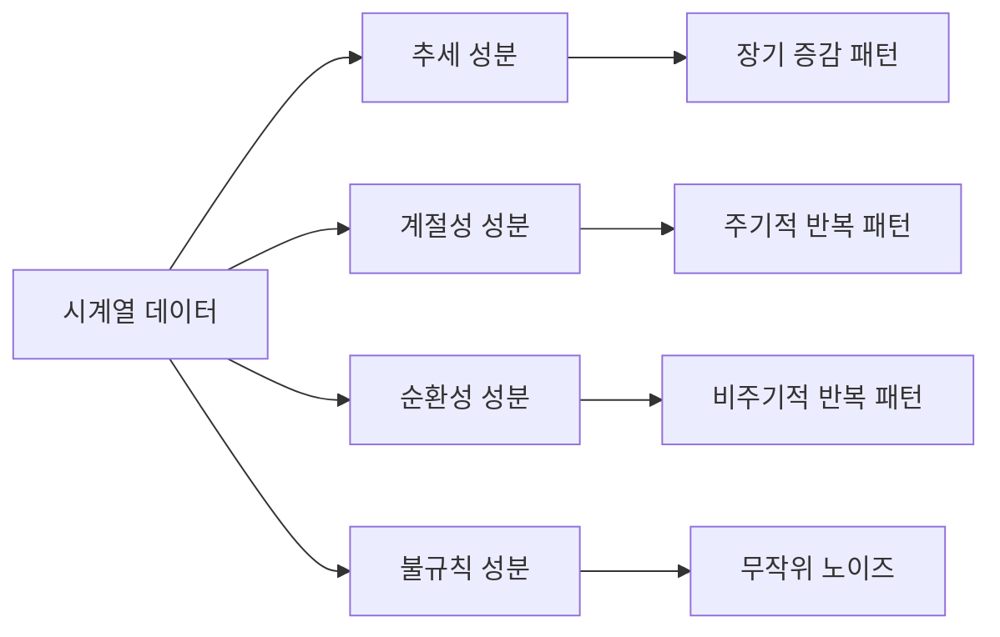
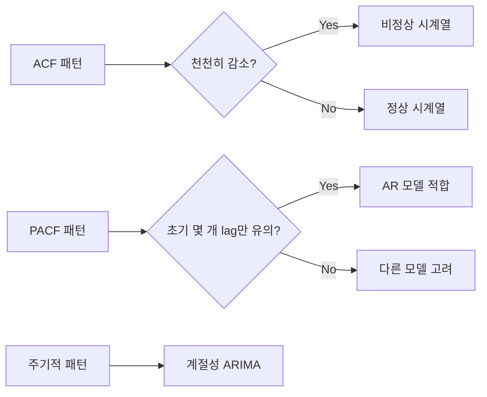
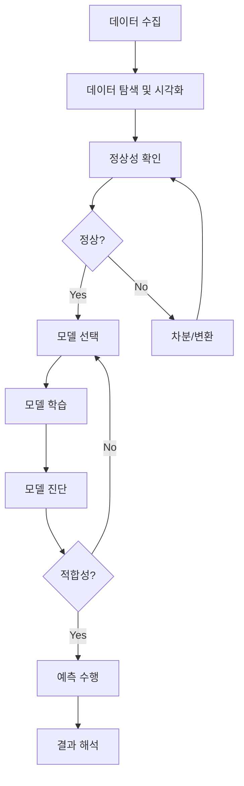

## 🚀 TL;DR

- 시계열 데이터는 시간 순서가 중요한 순차적 데이터로, 추세/계절성/순환성/불규칙성의 4가지 구성 성분을 가짐
- 전통적인 IID 가정을 위반하므로 자기상관(Autocorrelation) 개념과 마르코프 속성이 중요함
- ACF/PACF 분석을 통해 자기상관 패턴을 파악할 수 있으며, 이는 적절한 모델 선택에 핵심적임
- 정상성 확보가 분석의 전제조건이며, 차분/로그변환 등으로 비정상 데이터를 정상화함
- 기술적 분석으로 과거 패턴을 파악하고, 예측적 분석으로 미래를 예측하는 두 가지 접근법 존재
- 불규칙 성분이 큰 금융 데이터의 경우 앙상블 모델과 리스크 관리 전략이 필수적임
- ARIMA/SARIMA 등 통계 모델과 ML/딥러닝 모델을 상황에 맞게 선택하여 활용

## 📦 사용하는 python package

- numpy==1.26.4
- pandas==2.2.3
- matplotlib==3.10.1
- statsmodels==0.14.4

## 📓 실습 Jupyter Notebook

- [Time-series Data](https://github.com/yuiyeong/notebooks/blob/main/machine_learning/time_series_data.ipynb)

## 📈 순차적 데이터와 시계열 데이터

{: .w-75 .center}

### 순차적 데이터(Sequential data)

- 어떠한 순서를 가지는 데이터로, 순서가 바뀌면 의미를 잃는다. 
- 시계열 데이터는 순차적 데이터의 부분집합이다.
### 시계열 데이터(Time-series data)

- 시간 순서로 관측된 일련의 데이터이다.
- 일반적으로 동일한 시간 간격마다 측정된 값들의 시퀀스를 말한다.
- **시간 순서가 중요한 의미**를 가지며, 이를 무시하고 단순히 섞어버리면 중요한 정보를 잃게 된다.
- 주요 특징
	- **시간 의존성**: 하나의 관측값이 앞뒤 관측값과 연관이 있다
	- **순서성**: 데이터의 순서가 바뀌면 의미가 변할 수 있다
	- **패턴 존재**: 추세, 계절성, 주기성 등 반복되는 패턴이 나타난다
- 대표적인 시계열 데이터
	- 시간별 기온
	- 음성 데이터
	- 연도별 전세계 총 인구수
	- 일별 교통사고 건수
	- 주식의 가격 데이터

## 🧩 시계열 데이터의 구성 성분

- 임의로 만들어낸 주식 데이터를 3개(추세, 계절성, 불규칙 성분)의 구성 성분 분석을 해봤을 때 그래프 예시

{: .w-75 .center}

### 불규칙 성분(Irregular Component)

> 대부분의 시계열 데이터는 정도의 차이일 뿐, 모두 불규칙 성분을 가지고 있다! 그러므로 불규칙성을 '제거'하려 하기보다는 '이해하고 활용'하는 것이 효과적인 전략이다.
{: .prompt-tip}

- 불규칙 성분이란, 시간에 따른 규칙적인 움직임과 무관한, 랜덤한 원인에 의한 변동으로 예측이 불가능한 노이즈 성분이다.

**불규칙성이 높은 시계열 데이터 예시**

- **금융 시계열**
	- **주식 가격**: 시장 심리, 뉴스, 경제 지표 등 다양한 요인에 의한 불규칙성
	- **환율**: 중앙은행 개입, 경제 정책 변화 등으로 큰 변동성
	- **암호화폐**: 매우 높은 불확실성과 시장 조작 가능성

- **자연 데이터**
	- **지진 데이터**: 예측 불가능한 발생 시점과 강도
	- **태풍/허리케인 경로**: 복잡한 기상 시스템으로 인한 불확실성
	- **강수량**: 국지적 기상 현상으로 인한 급격한 변화

- **센서 데이터**
	- **IoT 센서 데이터**: 하드웨어 오류, 전파 간섭 등으로 인한 노이즈
	- **생체 신호 (ECG, EEG)**: 개인차와 환경 요인으로 인한 변동성
	- **네트워크 트래픽**: 갑작스러운 사용량 증가, DDoS 공격 등


> 특히, 금융 시계열 데이터가 이런 불규칙 성분이 많고, 또한 어떻게 다룰 것인가가 중요하다!

**주식 데이터의 특별한 고려사항**

- **시장 효율성 가설**: 주식 가격은 이미 모든 정보를 반영하므로 예측이 어려움
- **변동성 클러스터링**: 변동성이 클 때 이어지는 경향
- **팻 테일(Fat Tail)**: 정규분포보다 극단적인 사건이 더 자주 발생
- **비선형성**: 가격 상승과 하락의 비대칭성

**실무에 적용할 때는...**
- **모델 앙상블 활용**: 단일 모델보다는 여러 접근법을 조합
- **리스크 관리**: 불확실성 구간을 항상 제시
- **롤링 재학습**: 주기적으로 모델을 재학습하여 시장 변화에 적응
- **상황별 전략**: 변동성이 높은 시기와 낮은 시기의 다른 접근법 사용

### 규칙 성분(또는 체계적 성분 , Systematic or Regular Component)

- 시간에 따른 데이터의 변동 중에서, 시간에 따라 보이는 **데이터의 패턴이나 경향성**에 의해 설명될 수 있는 **예측 가능한 변동 성분**으로, 다음과 같이 3가지 성분이 있다.
	- **추세(Trend)**
		- 데이터가 장기적으로 증가하거나 감소하는 방향성
		- 예: 인구 증가, 기술 발전에 따른 생산성 향상

	- **계절정(Seasonality)**
		- 일정한 주기로 규칙적으로 반복되는 패턴
		- 예: 계절별 기온 변화, 주중/주말 매출 차이

	- **순환성(Cycle)**
		- 불규칙한 주기로 발생하는 변동(일정한 주기면 계절성이라고 함!)
		- 예: 경제 주기, 태양 흑점 활동





> 시계열의 규칙 성분은 데이터의 전반적인 구조를 이해하고 예측하는 데 핵심적인 역할을 한다. 
> 이러한 성분들을 정확히 파악해야 효과적인 예측 모델을 구축할 수 있다. 
{: .prompt-tip}

## 📊 시계열 데이터의 분석 방법론

### 기술적 분석(Descriptive Analysis)

- 시계열 데이터의 **과거 패턴을 파악**하는 방법이다. 
- 데이터가 가진 패턴, 추세, 주기성 등의 규칙적인 정보를 파악해 데이터의 기본 구조와 패턴을 이해
- 이를 바탕으로, **이상치 탐지** 및 **일반적인 행동을 설명**한다.
- 주로 금융 시장에서 기술적 지표를 통해 매매 시점을 결정하는 데 사용된다.
- 주요 분석 방법
	- 이동 평균선(Moving Average)
	- 볼린저 밴드(Bollinger Bands)
	- RSI(Relative Strength Index)
	- MACD(Moving Average Convergence Divergence)

### 예측적 분석(Predictive Analysis)

 - 과거 데이터를 바탕으로 **미래의 데이터를 예측**하는 방법이다.
 - 미래의 트렌드, 변동성 등을 예측 -> 비즈니스 전략 수립이나 의사결정을 지원하기 위해 사용된다.
 - 시계열 예측에는 다양한 모델이 사용된다.
	- **통계 모델**: ARIMA, SARIMA, 지수 평활법
	- **머신러닝 모델**: XGBoost, Random Forest, LSTM
	- **하이브리드 모델**: 여러 모델을 조합한 앙상블 방법

## 🚨 시계열 데이터는 독립 항등 분포(IID, Independent and Identically Distributed)를 위반한다!

- 시계열 데이터는 과거의 데이터가 미래의 데이터에 영향을 주는 데이터이기 때문에 IID 를 위반한다.
- 즉, 자기 상관으로 인해 데이터 포인트들이 서로 의존적이기 때문이다. 
- 이는 전통적인 통계 방법 대신 시계열 전용 분석 방법을 사용해야 하는 이유이다.

### 독립 항등 분포(IID)

**IID**는 데이터가 서로 독립적이고 동일한 분포를 따른다는 가정이다.

$$ X_1, X_2, ..., X_n \sim IID(F) $$

- 여기서,
	- 독립성: $$P(X_i | X_j) = P(X_i)\text{ for all }i \neq j$$
	- 항등성: $$ X_i \sim F \text{ for all }i $$

## 🧏 자기 상관(Autocorrelation)

- 시계열 데이터에서 현재 값이 과거의 자신의 값과 얼마나 상관관계가 있는지를 나타내는 측도이다.
- 쉽게 말해, "시간을 두고 나 자신과 얼마나 닮았는가?"를 측정하는 것이다.

{: .w-75 .center}

$$\text{Corr}(x_t, x_{t+k})$$
- 여기서 $$k$$ 를 시차라고 함

### 기본 자기 상관 계수

특정 시차(lag) $$k$$에서의 자기 상관 계수 $$\rho_k$$는 다음과 같이 정의된다.

$$ \rho_k = \frac{\gamma_k}{\gamma_0} = \frac{Cov(Y_t, Y_{t-k})}{Var(Y_t)} $$

여기서,
- $$\gamma_k = Cov(Y_t, Y_{t-k})$$: 시차 $$k$$에서의 자기공분산
- $$\gamma_0 = Var(Y_t)$$: 시계열의 분산


- 자기 상관 계수 공식은 쉽게 표현하자면,

$$\rho_k = \frac{\text{(현재와 k시차 전 값의 공분산)}}{\text{(시계열의 분산)}}$$

- 다시 이를 비유로 설명하면,
```
"나와 과거의 나의 관계"를 
"나 자신의 변동성"으로 나눈 값
```

- 말로 풀어 쓴다면,
	1. 현재 값들과 $$k$$기 전 값들을 쌍으로 묶어
	2. 각 쌍이 얼마나 함께 움직이는지 측정하고
	3. 전체 데이터의 변동성으로 정규화

### ACF vs PACF 비교

이 두 함수는 모두 시차(lag)를 입력받아 상관계수를 출력하는 수학적 함수입니다.
#### ACF (Autocorrelation Function)

- **함수의 정의**: $$\rho(k)$$ 또는 $$r_k$$로 표기
- **입력**: 시차(lag) $$k$$
- **출력**: 시차 $$k$$에서의 자기 상관 계수
- **수식**: $$\rho_k = \frac{Cov(Y_t, Y_{t-k})}{Var(Y_t)}$$

#### PACF (Partial Autocorrelation Function)

- **함수의 정의**: $$\phi_{kk}$$로 표기
- **입력**: 시차(lag) $$k$$
- **출력**: 시차 $$k$$에서의 편자기 상관 계수
- **의미**: 중간 시차들의 영향을 제거한 순수한 자기 상관

### 자기 상관의 유형

- 양의 자기 상관 (Positive Autocorrelation)
	- 과거의 높은 값이 현재의 높은 값과 연관
	- 기온, 주가 추세 등에서 흔히 관찰
	- ACF가 양수이고 시차가 증가함에 따라 천천히 감소

- 음의 자기 상관 (Negative Autocorrelation)
	- 과거의 높은 값이 현재의 낮은 값과 연관
	- 오실레이터 패턴, 주기적 변동에서 관찰
	- ACF가 음수이고 진동하는 패턴

- 자기 상관 없음
	- 과거와 현재가 독립적
	- 백색 잡음(White Noise)의 특성
	- ACF가 0에 가까움

> 자기 상관 ≠ 인과관계 : 과거 값이 현재 값과 관련있다는 의미이지, 과거 값이 현재 값을 직접 만든다는 의미가 아니다. 허위 자기 상관의 경우 단순한 추세로 인한 가짜 자기 상관이 발생할 수 있으며, 이는 차분(differencing)을 통해 제거 가능하다.
{: .prompt-warning}

### 구체적인 예시로 이해하기

- 예시 1: 기온 데이터 
	- **자기 상관 O**: 오늘 기온 → 내일 기온

	```
	"오늘이 덥다"면 → "내일도 더울 가능성이 높다"
	→ 양의 자기 상관이 존재!
	```
	
	- **자기 상관 X**: 주사위 굴리기 
	
	```
	"오늘 나온 숫자"는 → "내일 나올 숫자"와 무관
	→ 자기 상관이 없음!
	```

- 예시 2: 주식 가격 시계열
	- 가격 자체는 강한 자기 상관 존재
	- 수익률(변화율)은 약한 자기 상관
	
	```
	가격: 100 → 101 → 102 → 103  (강한 자기상관)
	수익률: 1% → 1% → 1%        (약한 자기상관)
	```

### 시각화한 그래프로 해석해보기

- 임의의 주가 데이터에 대해서 ACF 와 PACF 를 계산하고 그래프로 표현

{: .w-7 .center}

**ACF 그래프 해석**

- **Lag 0**: 당연히 1.0 (자신과의 상관계수)
- **Lag 1**: 약 0.95로 매우 높은 양의 상관관계
- **천천히 감소**: Lag 가 증가함에 따라 점진적으로 감소

> 이는 **강한 양의 자기상관**을 나타내며, 추세 성분이 존재함을 의미한다. 오늘의 주가가 높으면 내일도 높을 가능성이 크다는 것을 보여준다.

- **Lag 13-15 주변**: 강한 음의 상관관계
- **Lag 25-27 주변**: 다시 강한 양의 상관관계

> 이러한 패턴은 계절성(seasonality)의 존재를 나타냅니다.


**PACF 그래프 해석**

- **Lag 1**: 약 0.95로 매우 높음
- **Lag 2-6**: 음의 상관관계를 보이다가 점차 0으로 수렴
- 즉, 처음 몇개 lag 에서만 유의미한 값을 보인다.

> PACF 에서 처음 몇 개 lag에서만 유의미한 값이 나타나는 것은 **AR(Autoregressive) 성분**의 존재를 시사합니다. 특히 Lag 2까지의 유의미한 값은 AR(1) 또는 AR(2) 모델이 적합할 수 있음을 보여준다.
{: .prompt-tip}




## 🕵🏻‍♀️ 마르코프 속성(Markov Property)

- 미래 상태가 현재 상태에만 의존하고 과거 상태에는 직접적으로 의존하지 않는다는 개념이다.

$$ P(X_{t+1} | X_t, X_{t-1}, ..., X_1) = P(X_{t+1} | X_t) $$

이는 시계열 모델링에서 매우 중요한 가정으로, 많은 예측 모델의 기초가 된다.


## ⚖️ 정상성(Stationarity)

**정상 시계열**은 시간에 따라 통계적 특성이 변하지 않는 시계열을 의미한다. 강정상성과 약정상성으로 구분된다.

**약정상성 조건**

1. 평균이 시간에 무관: $$E[Y_t] = \mu$$ (상수)
2. 분산이 시간에 무관: $$Var[Y_t] = \sigma^2$$ (상수)
3. 공분산이 시차에만 의존: $$Cov[Y_t, Y_{t-k}] = \gamma_k$$
비정상성 데이터는 다음과 같은 방법으로 정상화할 수 있다.

- 차분(Differencing): $y_t = x_t - x_{t-1}$
- 로그 변환: $y_t = \log(x_t)$
- 계절차분: $y_t = x_t - x_{t-s}$


> 시계열 분석의 많은 모델들은 정상성을 가정한다. 비정상 시계열의 경우 차분(differencing)이나 변환을 통해 정상화시켜야 한다.
{: .prompt-tip}

## 🔍 시계열 데이터의 분석과정

시계열 데이터 분석은 체계적인 과정을 따른다.



### 1단계: 데이터 탐색

- 데이터의 시간 범위 확인
- 누락값, 이상치 처리
- 기본 통계량 분석

### 2단계: 시각화

- 시계열 플롯으로 전반적인 패턴 파악
- ACF/PACF 플롯으로 자기상관 분석
- 계절-추세 분해 플롯

### 3단계: 전처리

- 정상성 확보를 위한 차분
- 계절성 조정
- 로그 변환 등 안정화 변환

### 4단계: 모델링

- 적절한 모델 선택 (ARIMA, SARIMA 등)
- 파라미터 최적화
- 모델 진단 및 검증

### 5단계: 예측과 평가

- 예측 수행
- 신뢰구간 계산
- 예측 성능 평가 (MAE, RMSE, MAPE)

## 🌊 시계열의 진동수를 활용한 분석

시계열의 진동수를 활용한 분석에는 다음과 같은 것들이 있다.

- 푸리에(Fourier) 분석
- 스펙트럼 밀도(Spectrum Density) 분석
- 웨이브렛(Wavelet) 분석

푸리에 변환(Fourier Transform) 을 통해 시계열의 주파수 성분을 분석할 수 있다. 이는 주기성이 강한 신호 분석에 특히 유용하다.

$$ X(f) = \int_{-\infty}^{\infty} x(t) e^{-j2\pi ft} dt $$

## ⏳ 시간에 따른 변화를 분석

시간에 따른 변화를 분석에는 다음과 같은 것이 있다.

- 자기회귀모델(Autoregressive model)
- 이동평균(Moving Average)
- 추세(trend)분석
- 성분분해(decomposition)


## 🔬 시계열 데이터의 성분 분해

시계열 데이터를 각 성분으로 분해하여 예측이나 계절성에 따른 변화를 조정하는데 활용한다.

### 가법 모델 (Additive Model)

$$ Y_t = T_t + S_t + R_t $$

여기서,
- $$Y_t$$: 관측값
- $$T_t$$: 추세 성분
- $$S_t$$: 계절성 성분
- $$R_t$$: 잔차(불규칙) 성분

### 승법 모델 (Multiplicative Model)

$$ Y_t = T_t \times S_t \times R_t $$

## 📈 이동 평균 모델(Moving Average Model)

이동평균은 시계열 데이터에서 단기적인 변동을 smoothing 하여 제거하고, 장기적인 추세를 더 잘 확인할 수 있게 한다.

또한 이동 평균 모델은 과거의 오차(noise)를 이용해 현재값을 예측하는 모델로 다음과 같이 표현할 수 있다.

$$ Y_t = \mu + \epsilon_t + \theta_1\epsilon_{t-1} + ... + \theta_q\epsilon_{t-q} $$

여기서 $$\epsilon_t$$는 백색 잡음(white noise)이다.

**이동 평균(MA) 모델의 특징**

- 메모리가 제한적 (최대 q 시점까지만 영향)
- ACF가 q차수에서 급격히 감소
- 유한한 기억력 (Finite memory)

## 🔄 자기 회귀 모델(Auto-Regressive Model)

자기 회귀(AR, Auto-Regressive)모델은 과거의 값들을 이용해 현재의 값을 예측하는 모델이다.

다음과 같은 수식으로 표현할 수 있다.

$$ Y_t = c + \phi_1Y_{t-1} + \phi_2Y_{t-2} + ... + \phi_pY_{t-p} + \epsilon_t $$

여기서,
- $$c$$: 상수항
- $$\phi_i$$: 자기 회귀 계수
- $$\epsilon_t$$: 백색 잡음


**AR 모델의 특징**

- PACF가 p차수에서 급격히 감소
- 무한한 기억력 (Infinite memory)
- 안정성을 위해 다음 조건 필요

$$|\phi| < 1$$

