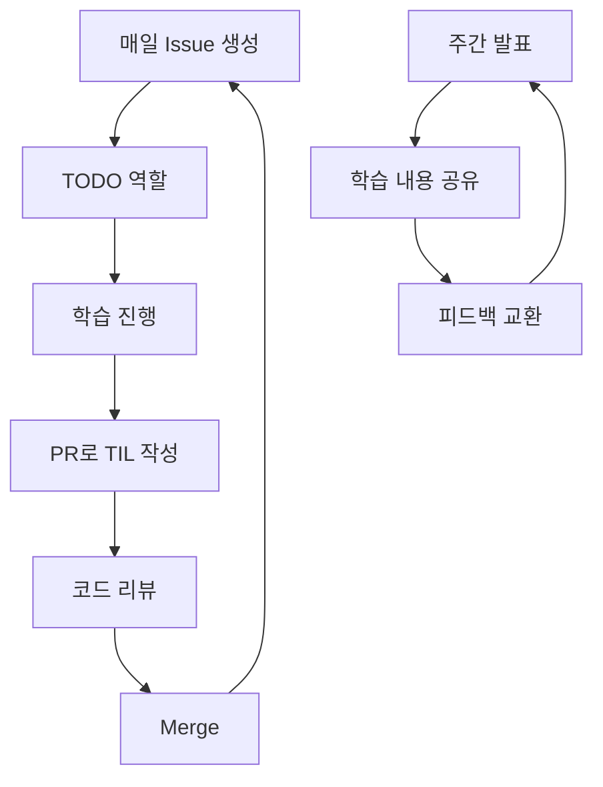

{: .w-75 .center}

## 📚 학습내용 정리

- [🏔️ Deep Learning 기술에는 어떤 것들이 있을까?](https://yuiyeong.github.io/posts/deep-learning-techniques/)
- [🤔 왜 PyTorch 이고, PyTorch 는 어떻게 사용할까?](https://yuiyeong.github.io/posts/why-pytorch-and-how-to-use-it/)

### 🧠 딥러닝 기초 이론 단계

**딥러닝 발전 5단계**를 통해 딥러닝이 어떻게 발전해왔는지 체계적으로 학습했다. 1단계부터 3단계까지는 퍼셉트론에서 다층 신경망까지의 초기 발전 과정을, 4단계와 5단계에서는 현대 딥러닝의 핵심 기술들을 다뤘다.

이론 학습에서 가장 인상 깊었던 부분은 **학습 방식별 딥러닝 구분**이었다. 지도학습, 비지도학습, 강화학습은 물론 최근 주목받는 자기지도학습까지 포괄적으로 다뤄 딥러닝의 전체 지형을 이해할 수 있었다.

> 딥러닝의 발전사를 통해 현재 기술의 맥락을 이해하게 되어, 단순 기법 암기가 아닌 본질적 이해가 가능했다. 
{: .prompt-tip}

### ⚙️ 모델 학습법 심화 학습

**다층 퍼셉트론**부터 시작해 **경사 하강법**, **역전파 알고리즘**, **손실 함수**까지 딥러닝의 핵심 메커니즘을 수학적 원리와 함께 학습했다. 특히 역전파 알고리즘의 경우 기초편과 심화편으로 나누어 단계별로 접근할 수 있어 이해도를 높일 수 있었다.

손실 함수 부분에서는 분류와 회귀 문제별로 적합한 손실 함수를 선택하는 기준을 배웠고, 이는 실제 프로젝트에서 모델 성능에 직접적인 영향을 미치는 중요한 지식이었다.

### 🎯 성능 고도화 방법 마스터

실무에서 가장 중요한 **성능 고도화 방법**을 4단계로 나누어 체계적으로 학습했다.

- **1단계**: 과적합, 편향과 분산, 지역/전역 최소값, 네트워크 안정화
- **2단계**: 가중치 초기화, 규제화, 학습률 조정
- **3단계**: Adam, RMSprop 등 다양한 최적화 알고리즘
- **4단계**: 데이터 증강 및 기타 고급 기법

각 단계별로 이론 설명 후 바로 실습이 이어져 개념을 즉시 적용해볼 수 있었던 점이 특히 좋았다.

> 성능 고도화 방법들은 실제 프로젝트에서 모델 성능을 좌우하는 핵심 기술로, 이론과 실습을 병행한 학습이 매우 효과적이었다.
{: .prompt-tip}

### 🔄 CNN과 RNN 실전 활용

**합성곱 신경망(CNN)** 과 **순환 신경망(RNN)** 을 단순 이론이 아닌 실제 구현 관점에서 학습했다. CNN에서는 이미지 분류 태스크를, RNN에서는 시계열 데이터 처리를 직접 구현해보며 각 아키텍처의 특성과 적용 영역을 명확히 이해할 수 있었다.

### 🔥 파이토치 생태계 완전 정복

파이토치 학습은 단순 문법을 넘어 **실무 활용** 관점에서 접근했다.

**기초 단계**에서는 텐서 조작부터 시작해 딥러닝 구현의 핵심인 자동 미분(autograd)까지 다뤘다. **실습 단계**에서는 DNN, CNN, RNN을 직접 구현하며 파이토치의 활용법을 체득했다.

**고급 단계**에서는 실무에서 필수인 도구들을 학습했다.

- **전이학습**: timm과 Hugging Face 활용
- **모니터링**: TensorBoard와 Wandb
- **디버깅**: 효율적인 디버깅 전략
- **파이토치 라이트닝**: 코드 구조화와 확장성
- **하이드라**: 설정 관리 자동화

```python
# 파이토치 라이트닝을 활용한 모듈화된 코드 예시
import pytorch_lightning as pl

class MyModel(pl.LightningModule):
    def __init__(self, lr=1e-3):
        super().__init__()
        self.model = torch.nn.Linear(784, 10)
        self.lr = lr
    
    def training_step(self, batch, batch_idx):
        x, y = batch
        logits = self.model(x)
        loss = F.cross_entropy(logits, y)
        self.log('train_loss', loss)
        return loss
    
    def configure_optimizers(self):
        return torch.optim.Adam(self.parameters(), lr=self.lr)
```

> 파이토치 라이트닝과 하이드라를 함께 사용하면 실험 관리와 재현성 확보가 훨씬 쉬워진다.
{: .prompt-tip}

## 👥 새로운 스터디 그룹과 협업

강의와 함께 **새로운 스터디 그룹**이 결성되었다. 단순 지식 공유를 넘어 **GitHub Flow**를 활용한 협업 방식을 도입했다.

### 🔄 스터디 운영 방식



- **일일 목표 설정**: Issue를 통한 명확한 TODO 관리
- **학습 기록**: PR을 통한 체계적인 TIL 작성
- **동료 학습**: 코드 리뷰를 통한 상호 피드백
- **GitHub 활용**: 실무에서 필수인 Git/GitHub 숙련도 향상

## 🧠 강의 소감

### 💡 이론과 실습의 완벽한 조화

이번 딥러닝 강의는 이전 수학 강의와는 차원이 달랐다. 가장 큰 차이점은 **이론과 실습의 균형**이었다. 각 개념을 배운 후 바로 코드로 구현해볼 수 있어 추상적인 이론이 구체적인 기술로 체화되는 과정을 경험할 수 있었다.

특히 **파이토치 실습**은 단순 따라하기가 아닌 **실무 중심**으로 구성되어 있어 매우 실용적이었다. timm과 Hugging Face 같은 최신 라이브러리 활용법까지 배울 수 있어 현업에서 바로 활용할 수 있는 기술을 습득했다.

### 🎯 체계적인 커리큘럼의 힘

딥러닝의 **발전사부터 최신 기술**까지 체계적으로 학습할 수 있었던 점이 가장 만족스러웠다. 특히 '왜 이 기술이 등장했는가?'라는 맥락을 이해하고 나니 각 기법의 본질을 더 명확히 파악할 수 있었다.

CNN과 RNN을 배울 때도 단순 사용법이 아닌 **언제, 왜 사용해야 하는지**를 중심으로 설명해주어 실제 프로젝트에서 적절한 아키텍처를 선택하는 안목을 기를 수 있었다.

### 🔧 실무 도구까지 완벽 대비

**파이토치 라이트닝**과 **하이드라** 학습이 특히 인상적이었다. 이전까지는 파이토치를 사용할 때 매번 비슷한 보일러플레이트 코드를 반복 작성했는데, 라이트닝을 통해 코드 구조화와 재사용성을 크게 개선할 수 있었다.

하이드라를 통한 설정 관리는 실험 관리의 혁신이었다. 다양한 하이퍼파라미터 조합을 체계적으로 관리하고 재현할 수 있게 되어 실험 효율성이 크게 향상되었다.

```yaml
# config.yaml 예시
model:
  lr: 0.001
  batch_size: 32
  
data:
  dataset: cifar10
  augmentation: true
  
trainer:
  max_epochs: 100
  gpus: 1
```
