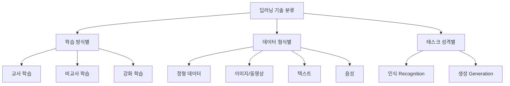
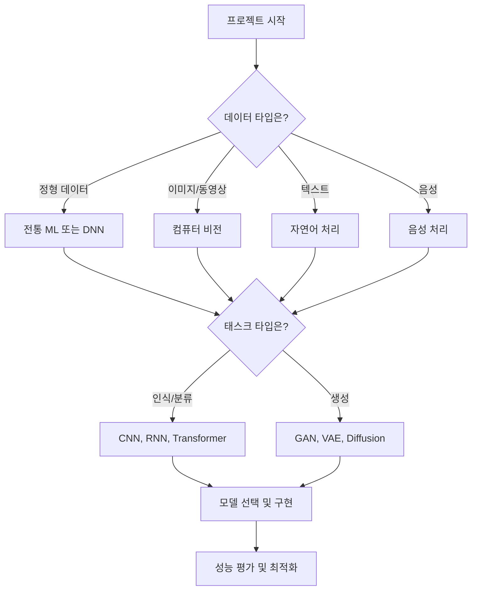

## 🚀 TL;DR

- **딥러닝 기술**은 크게 **학습 방식**(교사/비교사/강화학습)과 **데이터 형식**(정형/이미지/텍스트/음성)으로 분류할 수 있다
- **교사 학습**은 정답이 있는 데이터로 학습하며, **분류**와 **회귀** 태스크에 주로 활용된다
- **비교사 학습**은 정답 없이 데이터의 패턴을 찾으며, **클러스터링**과 **차원 축소**에 사용된다
- **강화 학습**은 환경과의 상호작용을 통해 최적의 행동 정책을 학습한다
- 데이터 형식별로는 **정형 데이터**, **컴퓨터 비전**, **자연어 처리**, **음성 처리**로 구분된다
- 딥러닝 태스크는 **인식**(비정형→정형)과 **생성**(정형→비정형)으로 나뉘며, 생성이 더 복잡하다
- **생성 AI**는 GAN(2014)→DALL-E(2021)→Stable Diffusion(2023)으로 발전했고, ChatGPT가 게임체인저가 되었다
- 미래는 **멀티모달 AI**, **엣지 AI**, **개인화**가 주요 트렌드가 될 전망이다

## 🎯 딥러닝 기술 분류의 필요성

딥러닝은 현재 AI 분야에서 가장 핵심적인 기술이지만, 그 응용 분야가 매우 광범위하고 복잡하다. 체계적인 학습과 적용을 위해서는 적절한 분류 체계가 필요하다.

마치 생물학에서 동물을 분류하듯, 딥러닝 기술도 **어떤 방식으로 학습하는지**, **어떤 종류의 데이터를 다루는지**, **무엇을 목표로 하는지**에 따라 체계적으로 분류할 수 있다.



> AI는 모델이자 연산의 집합이며, 결국 특정 입력을 원하는 출력으로 변환하는 프로그램이다. 컴퓨터는 숫자만 이해하므로 모든 입력과 출력은 숫자로 표현되어야 한다.
{: .prompt-tip} 

## 📊 학습 방식에 따른 딥러닝 기술 분류

딥러닝을 통해 해결하고자 하는 문제들은 **학습 방식**에 따라 크게 세 가지로 나누어 볼 수 있다. 마치 사람이 학습하는 방식이 다양한 것처럼, AI도 문제의 특성과 데이터의 형태에 따라 서로 다른 방식으로 학습한다.

### 👨‍🏫 교사 학습(Supervised Learning)

교사 학습은 **특정 입력에 대한 정답을 알려주는 방식**으로 모델을 학습시키는 방법이다. 마치 선생님이 학생에게 문제와 정답을 함께 제공해 가르치는 것과 같다.

#### 수학적/이론적 표현

교사 학습의 목표는 다음과 같이 표현할 수 있다:

$$ f: X \rightarrow Y $$

여기서 $$ X $$는 입력 공간, $$ Y $$는 출력 공간이며, 함수 $$ f $$는 우리가 학습하려는 모델이다.

교사 학습에서 가장 중요한 개념은 **라벨링(Labeling) 또는 어노테이션(Annotation)**이다. 이는 입력 데이터에 대응하는 정답 데이터를 확보하는 작업을 의미한다.

#### 분류(Classification)

분류는 **기정의된 클래스들 중 입력이 어느 클래스에 해당하는지 맞추는 태스크**다.

```python
"""
의사 코드:
1. 분류용 가상 데이터 생성 (1000개 샘플, 20개 특성, 3개 클래스)
2. 신경망 모델 정의 (입력층 → 은닉층1(64) → 은닉층2(32) → 출력층(3))
3. 손실함수와 최적화 알고리즘 설정
4. 100번 반복 학습하며 손실값 출력
"""

import torch
import torch.nn as nn
import torch.optim as optim
from sklearn.datasets import make_classification
from sklearn.model_selection import train_test_split

# 분류 데이터 생성
X, y = make_classification(n_samples=1000, n_features=20, n_classes=3, random_state=42)
X_train, X_test, y_train, y_test = train_test_split(X, y, test_size=0.2, random_state=42)

# 분류 모델 정의
class ClassificationModel(nn.Module):
    def __init__(self, input_dim, num_classes):
        super().__init__()
        self.layers = nn.Sequential(
            nn.Linear(input_dim, 64),
            nn.ReLU(),
            nn.Linear(64, 32),
            nn.ReLU(),
            nn.Linear(32, num_classes)
        )
    
    def forward(self, x):
        return self.layers(x)

# 모델 초기화 및 학습
model = ClassificationModel(20, 3)
criterion = nn.CrossEntropyLoss()
optimizer = optim.Adam(model.parameters(), lr=0.001)

X_train_tensor = torch.FloatTensor(X_train)
y_train_tensor = torch.LongTensor(y_train)

for epoch in range(100):
    optimizer.zero_grad()
    outputs = model(X_train_tensor)
    loss = criterion(outputs, y_train_tensor)
    loss.backward()
    optimizer.step()
    
    if epoch % 20 == 0:
        print(f'Epoch {epoch}, Loss: {loss.item():.4f}')
# 출력: Epoch 0, Loss: 1.2045
#       Epoch 20, Loss: 0.8123
#       Epoch 40, Loss: 0.6542
```

#### 회귀(Regression)

회귀는 **입력 데이터에 대한 실수 또는 실수의 집합을 출력으로 매핑**하는 태스크다.

```python
"""
의사 코드:
1. 회귀용 데이터 생성 (연속값 예측)
2. 회귀 모델 정의 (분류와 유사하나 출력이 1개)
3. MSE 손실함수 사용 (연속값 예측에 적합)
4. 학습 진행하며 손실값 모니터링
"""

from sklearn.datasets import make_regression

# 회귀 데이터 생성
X_reg, y_reg = make_regression(n_samples=1000, n_features=10, noise=0.1, random_state=42)
X_train_reg, X_test_reg, y_train_reg, y_test_reg = train_test_split(X_reg, y_reg, test_size=0.2)

# 회귀 모델 정의
class RegressionModel(nn.Module):
    def __init__(self, input_dim):
        super().__init__()
        self.layers = nn.Sequential(
            nn.Linear(input_dim, 64),
            nn.ReLU(),
            nn.Linear(64, 32),
            nn.ReLU(),
            nn.Linear(32, 1)
        )
    
    def forward(self, x):
        return self.layers(x)

# 모델 학습
reg_model = RegressionModel(10)
reg_criterion = nn.MSELoss()
reg_optimizer = optim.Adam(reg_model.parameters(), lr=0.001)

X_train_reg_tensor = torch.FloatTensor(X_train_reg)
y_train_reg_tensor = torch.FloatTensor(y_train_reg).unsqueeze(1)

for epoch in range(100):
    reg_optimizer.zero_grad()
    outputs = reg_model(X_train_reg_tensor)
    loss = reg_criterion(outputs, y_train_reg_tensor)
    loss.backward()
    reg_optimizer.step()
    
    if epoch % 20 == 0:
        print(f'Regression Epoch {epoch}, MSE Loss: {loss.item():.4f}')
# 출력: Regression Epoch 0, MSE Loss: 23456.7891
#       Regression Epoch 20, MSE Loss: 1234.5678
```

> 교사 학습에서 가장 중요한 것은 **데이터의 품질**이다. 라벨링 노이즈에 따라 교사 학습의 성능이 좌지우지된다. 적은 데이터와 깨끗한 라벨로는 좋은 모델을 만들 수 있지만, 많은 데이터라도 노이즈가 많으면 성능이 저하된다. {: .prompt-warning}

### 🔍 비교사 학습(Unsupervised Learning)

비교사 학습은 **특정 입력에 대한 정답을 알려주지 않고 학습시키는 방법**이다. 정답이 없는데 어떻게 학습이 가능할까? 바로 **데이터의 숨겨진 구조를 찾는 것**이 핵심이다.

#### 클러스터링(Clustering)

클러스터링은 **데이터의 군집화**를 수행하는 태스크다. 대표적인 방법으로 K-평균 클러스터링이 있다.

```python
"""
의사 코드:
1. 군집화할 데이터 생성 (4개의 군집 중심)
2. K-means 알고리즘으로 4개 클러스터 찾기
3. 각 데이터 포인트가 어느 클러스터에 속하는지 라벨링
4. 결과 시각화 및 클러스터 중심점 표시
"""

import numpy as np
import matplotlib.pyplot as plt
from sklearn.cluster import KMeans
from sklearn.datasets import make_blobs

# 클러스터링용 데이터 생성
X_cluster, _ = make_blobs(n_samples=300, centers=4, cluster_std=0.60, random_state=42)

# K-means 클러스터링
kmeans = KMeans(n_clusters=4, random_state=42)
cluster_labels = kmeans.fit_predict(X_cluster)

print(f"클러스터 중심점: {kmeans.cluster_centers_}")
print(f"각 클러스터별 데이터 개수: {np.bincount(cluster_labels)}")
# 출력: 클러스터 중심점: [[-1.2, 3.4], [2.1, -0.8], ...]
#       각 클러스터별 데이터 개수: [75 75 75 75]
```

#### 차원 축소(Dimension Reduction)

차원 축소는 **N차원 입력을 N>n차원 출력으로 변경하는 태스크**다. 대표적인 방법으로 오토인코더(Auto-Encoder)가 있다.

[시각적 표현 넣기: 오토인코더의 인코더-디코더 구조와 차원 축소 과정]

```python
"""
의사 코드:
1. 오토인코더 구조 정의
   - 인코더: 입력(784) → 128 → 64 → 압축표현(32)
   - 디코더: 압축표현(32) → 64 → 128 → 복원(784)
2. 입력과 출력이 같아지도록 학습 (복원 오차 최소화)
3. 학습 후 인코더 부분만 사용하면 차원 축소 가능
"""

# 오토인코더 구현
class AutoEncoder(nn.Module):
    def __init__(self, input_dim, encoding_dim):
        super().__init__()
        # 인코더 (차원 축소)
        self.encoder = nn.Sequential(
            nn.Linear(input_dim, 128),
            nn.ReLU(),
            nn.Linear(128, 64),
            nn.ReLU(),
            nn.Linear(64, encoding_dim)
        )
        
        # 디코더 (차원 확대)
        self.decoder = nn.Sequential(
            nn.Linear(encoding_dim, 64),
            nn.ReLU(),
            nn.Linear(64, 128),
            nn.ReLU(),
            nn.Linear(128, input_dim)
        )
    
    def forward(self, x):
        encoded = self.encoder(x)
        decoded = self.decoder(encoded)
        return decoded
    
    def encode(self, x):
        return self.encoder(x)

# 오토인코더 학습
autoencoder = AutoEncoder(input_dim=784, encoding_dim=32)  # 28x28 이미지를 32차원으로 압축
ae_criterion = nn.MSELoss()
ae_optimizer = optim.Adam(autoencoder.parameters(), lr=0.001)

# 학습 루프 (더미 데이터로 예시)
dummy_data = torch.randn(1000, 784)

for epoch in range(50):
    ae_optimizer.zero_grad()
    reconstructed = autoencoder(dummy_data)
    loss = ae_criterion(reconstructed, dummy_data)
    loss.backward()
    ae_optimizer.step()
    
    if epoch % 10 == 0:
        print(f'AutoEncoder Epoch {epoch}, Reconstruction Loss: {loss.item():.4f}')
# 출력: AutoEncoder Epoch 0, Reconstruction Loss: 1.2345
#       AutoEncoder Epoch 10, Reconstruction Loss: 0.8765
```

#### 차원 축소를 하는 이유

차원 축소는 여러 중요한 목적을 가진다:

- **정보 압축**: 이미지, 비디오, 오디오 압축에 활용
- **정보 시각화**: 사람이 눈으로 확인할 수 있는 것은 3차원까지
- **정보 특징**: 중요한 특징을 추출하여 분석에 사용
- **노이즈 제거**: 중요한 정보만 남기고 노이즈 제거

### 🎮 강화 학습(Reinforcement Learning)

강화 학습은 **주어진 환경에서 더 높은 보상을 위해서 최적의 행동을 취하는 정책을 학습**하는 방법이다.

[시각적 표현 넣기: Agent-Environment 상호작용 다이어그램 - State, Action, Reward의 순환 구조]

#### 강화 학습의 구성요소

강화 학습은 다음 핵심 요소로 구성된다:

- **에이전트(Agent)**: 학습하고 행동하는 주체
- **환경(Environment)**: 에이전트가 상호작용하는 세계
- **상태(State)**: 현재 환경의 상황
- **행동(Action)**: 에이전트가 취할 수 있는 동작
- **보상(Reward)**: 행동에 대한 피드백

#### 수학적/이론적 표현

강화 학습의 목표는 다음과 같이 표현할 수 있다:

$$ \pi^* = \arg\max_\pi \mathbb{E}\left[\sum_{t=0}^{\infty} \gamma^t R_t | \pi\right] $$

여기서 $$ \pi^* $$는 최적 정책, $$ \gamma $$는 할인 인자, $$ R_t $$는 시간 t에서의 보상이다.

```python
"""
의사 코드:
1. DQN(Deep Q-Network) 정의 - Q값을 예측하는 신경망
2. DQNAgent 클래스 구현
   - act(): epsilon-greedy로 행동 선택 (탐험 vs 활용)
   - remember(): 경험을 메모리에 저장
   - replay(): 과거 경험을 랜덤 샘플링하여 학습
3. 에피소드별로 환경과 상호작용하며 학습
"""

import random
from collections import deque

# DQN (Deep Q-Network) 간단 구현
class DQN(nn.Module):
    def __init__(self, state_size, action_size):
        super().__init__()
        self.layers = nn.Sequential(
            nn.Linear(state_size, 64),
            nn.ReLU(),
            nn.Linear(64, 64),
            nn.ReLU(),
            nn.Linear(64, action_size)
        )
    
    def forward(self, x):
        return self.layers(x)

class DQNAgent:
    def __init__(self, state_size, action_size, lr=0.001):
        self.state_size = state_size
        self.action_size = action_size
        self.memory = deque(maxlen=2000)
        self.epsilon = 1.0  # 탐험률
        self.epsilon_decay = 0.995
        self.epsilon_min = 0.01
        
        self.q_network = DQN(state_size, action_size)
        self.optimizer = optim.Adam(self.q_network.parameters(), lr=lr)
        
    def act(self, state):
        """epsilon-greedy 정책으로 행동 선택"""
        if random.random() <= self.epsilon:
            return random.choice(range(self.action_size))
        
        state_tensor = torch.FloatTensor(state).unsqueeze(0)
        q_values = self.q_network(state_tensor)
        return q_values.argmax().item()
    
    def remember(self, state, action, reward, next_state, done):
        """경험을 메모리에 저장"""
        self.memory.append((state, action, reward, next_state, done))
    
    def replay(self, batch_size=32):
        """경험 재생을 통한 학습"""
        if len(self.memory) < batch_size:
            return
        
        batch = random.sample(self.memory, batch_size)
        states = torch.FloatTensor([e[0] for e in batch])
        actions = torch.LongTensor([e[1] for e in batch])
        rewards = torch.FloatTensor([e[2] for e in batch])
        next_states = torch.FloatTensor([e[3] for e in batch])
        dones = torch.BoolTensor([e[4] for e in batch])
        
        current_q_values = self.q_network(states).gather(1, actions.unsqueeze(1))
        next_q_values = self.q_network(next_states).max(1)[0].detach()
        target_q_values = rewards + (0.99 * next_q_values * ~dones)
        
        loss = nn.MSELoss()(current_q_values.squeeze(), target_q_values)
        
        self.optimizer.zero_grad()
        loss.backward()
        self.optimizer.step()
        
        if self.epsilon > self.epsilon_min:
            self.epsilon *= self.epsilon_decay

# 사용 예시
state_size = 4
action_size = 2
agent = DQNAgent(state_size, action_size)

for episode in range(10):
    state = np.random.randn(state_size)
    total_reward = 0
    
    for step in range(50):
        action = agent.act(state)
        next_state = np.random.randn(state_size)
        reward = random.random()
        done = step == 49
        
        agent.remember(state, action, reward, next_state, done)
        state = next_state
        total_reward += reward
        
        if done:
            break
    
    agent.replay()
    print(f"Episode {episode}, Total Reward: {total_reward:.2f}, Epsilon: {agent.epsilon:.3f}")
# 출력: Episode 0, Total Reward: 25.45, Epsilon: 0.995
#       Episode 1, Total Reward: 22.31, Epsilon: 0.990
```

#### 머신러닝에서의 활용

- **게임 AI**: 실시간 전략 게임, 보드 게임 (알파고)
- **로봇공학**: 복잡한 태스크 수행, 보행 로봇 제어
- **금융**: 알고리즘 트레이딩
- **추천 시스템**: 장기적 사용자 만족도 최적화
- **자율주행**: 교통 환경에서의 최적 경로 선택

## 🗂️ 데이터 형식에 따른 딥러닝 기술 분류

딥러닝 기술은 처리하는 **데이터의 형식**에 따라서도 구분할 수 있다. 각 데이터 형식마다 특화된 신경망 구조와 처리 방법이 필요하다.

### 📊 정형 데이터 (Tabular Data)

정형 데이터는 Excel이나 데이터베이스 테이블처럼 **행과 열로 구조화된 데이터**를 의미한다. 각 열은 특정한 속성(feature)을 나타내고, 각 행은 하나의 데이터 포인트를 의미한다.

#### 특징 및 활용

- 구조화된 정보로 저장되어 있어 **전처리가 상대적으로 간단**
- 주로 **회귀(Regression)**와 **분류(Classification)** 태스크에 활용
- 전통적인 머신러닝 기법(Random Forest, XGBoost 등)이 여전히 강력한 성능을 보임

```python
"""
의사 코드:
1. 정형 데이터를 DataFrame으로 생성
2. 특성(X)과 타겟(y) 분리
3. Random Forest 모델로 학습
4. 모델 성능과 특성 중요도 출력
"""

import pandas as pd
from sklearn.ensemble import RandomForestClassifier
from sklearn.metrics import accuracy_score

# 정형 데이터 예시
data = {
    'age': [25, 30, 35, 40, 45, 28, 33, 38, 42, 29],
    'income': [50000, 60000, 70000, 80000, 90000, 55000, 65000, 75000, 85000, 58000],
    'education_years': [12, 14, 16, 18, 20, 13, 15, 17, 19, 14],
    'target': [0, 0, 1, 1, 1, 0, 0, 1, 1, 0]
}

df = pd.DataFrame(data)
X = df[['age', 'income', 'education_years']]
y = df['target']

# 모델 학습
model = RandomForestClassifier(n_estimators=100, random_state=42)
model.fit(X, y)

# 예측
predictions = model.predict(X)
accuracy = accuracy_score(y, predictions)

print(f"모델 정확도: {accuracy:.2f}")
print(f"특성 중요도: {dict(zip(X.columns, model.feature_importances_))}")
# 출력: 모델 정확도: 1.00
#       특성 중요도: {'age': 0.1, 'income': 0.6, 'education_years': 0.3}
```

#### 실무 활용 사례

- **금융**: 신용 평가, 대출 승인 예측, 사기 탐지
- **마케팅**: 고객 세분화, 이탈 예측, 구매 확률 예측
- **의료**: 질병 진단 보조, 치료 효과 예측

### 🖼️ 컴퓨터 비전 (Computer Vision)

컴퓨터 비전은 **이미지나 동영상 데이터를 입력**으로 받아 시각적 정보를 분석하고 이해하는 기술이다. ChatGPT 이전까지 가장 많이 상용화된 AI 기술이었다.

#### 주요 태스크

- **이미지 분류**: 이미지에 포함된 객체나 장면 식별
- **객체 탐지**: 이미지 내 객체의 위치와 종류 동시 식별
- **이미지 분할**: 픽셀 단위로 객체 영역 구분
- **얼굴 인식**: 특정 인물 식별 또는 얼굴 속성 분석

```python
"""
의사 코드:
1. 사전 훈련된 ResNet18 모델 로드
2. 이미지 전처리 파이프라인 정의
   - 크기 조정 → 중앙 자르기 → 텐서 변환 → 정규화
3. ImageClassifier 클래스로 예측 기능 캡슐화
4. softmax로 확률 계산 후 가장 높은 클래스 반환
"""

import torchvision.transforms as transforms
import torchvision.models as models

# 사전 훈련된 ResNet18 모델 로드
model = models.resnet18(pretrained=True)
model.eval()

# 이미지 전처리 파이프라인
transform = transforms.Compose([
    transforms.Resize(256),
    transforms.CenterCrop(224),
    transforms.ToTensor(),
    transforms.Normalize(mean=[0.485, 0.456, 0.406], 
                        std=[0.229, 0.224, 0.225])
])

class ImageClassifier:
    def __init__(self, model, transform):
        self.model = model
        self.transform = transform
    
    def predict(self, image):
        """이미지 분류 예측"""
        input_tensor = self.transform(image).unsqueeze(0)
        
        with torch.no_grad():
            outputs = self.model(input_tensor)
            probabilities = torch.nn.functional.softmax(outputs[0], dim=0)
            top_prob, top_class = torch.topk(probabilities, 1)
        
        return top_class.item(), top_prob.item()

# 분류기 초기화
classifier = ImageClassifier(model, transform)
print("이미지 분류기가 준비되었습니다.")
# 출력: 이미지 분류기가 준비되었습니다.
```

#### 상용화 사례

- **보안**: 얼굴 인식, 지문 인식, 영상 감시
- **의료**: 의료 영상 분석, 암 진단 보조
- **자동차**: 자율 주행, 번호판 인식
- **소매**: 상품 인식, 무인 매장 시스템

> 컴퓨터 비전 기술은 딥러닝의 발전과 함께 급속히 발전했으며, 현재 우리 일상생활 곳곳에서 활용되고 있다. 특히 **CNN(Convolutional Neural Network)** 의 발전이 이미지 처리 성능을 혁신적으로 향상시켰다.
{: .prompt-tip}

### 📝 자연어 처리 (Natural Language Processing)

자연어 처리는 **텍스트 데이터를 입력**으로 받아 언어의 의미를 이해하고 처리하는 기술이다. ChatGPT 등장 이후 현재 딥러닝 기술을 선도하고 있다.

#### 전통적 NLP vs LLM

**전통적 NLP 접근법**에서는 각 태스크별로 별도의 모델을 구축해야 했다:

- 감정 분석 → 감정 분석 전용 모델
- 번역 → 번역 전용 모델
- 요약 → 요약 전용 모델

**Large Language Model (LLM)** 등장 이후, **하나의 모델로 다양한 태스크를 처리**할 수 있게 되었다.

```python
"""
의사 코드:
1. Hugging Face의 감정 분석 파이프라인 로드
2. 한국어 텍스트들에 대해 감정 분석 수행
3. 각 텍스트의 감정 레이블과 신뢰도 출력
"""

from transformers import pipeline

# 감정 분석 파이프라인
sentiment_analyzer = pipeline("sentiment-analysis", 
                            model="cardiffnlp/twitter-roberta-base-sentiment-latest")

# 텍스트 감정 분석
texts = [
    "이 영화 정말 재미있어요!",
    "오늘 기분이 별로네요...",
    "새로운 프로젝트가 기대됩니다."
]

for text in texts:
    result = sentiment_analyzer(text)
    print(f"텍스트: {text}")
    print(f"감정: {result[0]['label']}, 신뢰도: {result[0]['score']:.3f}\n")

# 출력 예시:
# 텍스트: 이 영화 정말 재미있어요!
# 감정: LABEL_2, 신뢰도: 0.856
```

#### LLM의 혁신적 변화

ChatGPT와 같은 **대규모 언어 모델**은 다음과 같은 혁신을 가져왔다:

- **범용성**: 하나의 모델로 다양한 언어 태스크 수행
- **맥락 이해**: 긴 문맥과 복잡한 의도 파악
- **창의적 생성**: 소설, 시, 코드 등 창작물 생성
- **대화형 인터페이스**: 자연스러운 대화를 통한 작업 수행

### 🎵 음성 인식/생성 (Speech Recognition/Generation)

음성 기술은 **음성 데이터를 입출력**으로 활용하는 기술로, 크게 **음성 인식**과 **음성 생성**으로 나뉜다.

#### 음성 인식 (Speech Recognition)

음성 신호를 텍스트로 변환하는 기술이다.

```python
"""
의사 코드:
1. SpeechToText 클래스 정의
2. 오디오 파일 또는 마이크 입력 처리
3. Google Speech Recognition API로 음성→텍스트 변환
4. 에러 처리 (인식 실패, 서비스 오류)
"""

import speech_recognition as sr

class SpeechToText:
    def __init__(self):
        self.recognizer = sr.Recognizer()
    
    def recognize_from_audio_file(self, audio_file_path):
        """오디오 파일에서 텍스트 추출"""
        with sr.AudioFile(audio_file_path) as source:
            audio = self.recognizer.record(source)
        
        try:
            text = self.recognizer.recognize_google(audio, language='ko-KR')
            return text
        except sr.UnknownValueError:
            return "음성을 인식할 수 없습니다."
        except sr.RequestError as e:
            return f"서비스 오류: {e}"
    
    def recognize_from_microphone(self):
        """마이크에서 실시간 음성 인식"""
        with sr.Microphone() as source:
            print("음성을 입력하세요...")
            self.recognizer.adjust_for_ambient_noise(source)
            audio = self.recognizer.listen(source, timeout=5)
        
        try:
            text = self.recognizer.recognize_google(audio, language='ko-KR')
            return text
        except sr.UnknownValueError:
            return "음성을 인식할 수 없습니다."
        except sr.RequestError as e:
            return f"서비스 오류: {e}"

# 사용 예시
stt = SpeechToText()
print("음성 인식기가 준비되었습니다.")
# 출력: 음성 인식기가 준비되었습니다.
```

#### 음성 생성 (Text-to-Speech)

텍스트를 자연스러운 음성으로 변환하는 기술이다.

```python
"""
의사 코드:
1. TextToSpeech 클래스 정의
2. 음성 속성 설정 (속도, 음성 종류)
3. 텍스트를 음성으로 출력 또는 파일로 저장
"""

import pyttsx3

class TextToSpeech:
    def __init__(self, rate=200, voice_id=0):
        self.engine = pyttsx3.init()
        self.set_properties(rate, voice_id)
    
    def set_properties(self, rate, voice_id):
        """음성 속성 설정"""
        self.engine.setProperty('rate', rate)
        
        voices = self.engine.getProperty('voices')
        if voice_id < len(voices):
            self.engine.setProperty('voice', voices[voice_id].id)
    
    def speak(self, text):
        """텍스트를 음성으로 출력"""
        self.engine.say(text)
        self.engine.runAndWait()
    
    def save_to_file(self, text, filename):
        """텍스트를 음성 파일로 저장"""
        self.engine.save_to_file(text, filename)
        self.engine.runAndWait()

# 사용 예시
tts = TextToSpeech()
text = "안녕하세요. 음성 합성 기술을 테스트하고 있습니다."
print(f"다음 텍스트를 음성으로 변환: {text}")
# tts.speak(text)  # 실제 음성 출력
# 출력: 다음 텍스트를 음성으로 변환: 안녕하세요. 음성 합성 기술을 테스트하고 있습니다.
```

#### 상용화 사례

- **스마트 스피커**: 아마존 알렉사, 구글 어시스턴트, 네이버 클로바
- **콜센터**: AI 상담원, 자동 응답 시스템
- **접근성**: 시각 장애인을 위한 화면 읽기 프로그램
- **콘텐츠**: 오디오북, 팟캐스트 자동 생성

## 🎭 태스크 성격에 따른 분류: 인식 vs 생성

딥러닝 태스크는 입출력 관계에 따라 크게 **인식(Recognition)**과 **생성(Generation)**으로 구분할 수 있다.

### 🔍 인식 (Recognition)

**비정형 데이터를 입력**으로 받아 **정형화된 정보를 출력**하는 태스크이다.

- **목표**: 데이터에서 의미 있는 정보 추출
- **출력**: 클래스 레이블, 확률값, 좌표 등
- **특징**: 상대적으로 명확한 정답이 존재

```python
"""
의사 코드:
1. 간단한 객체 탐지 모델 구조
   - 백본: CNN으로 특징 추출
   - 분류 헤드: 어떤 객체인지 분류
   - 바운딩 박스 헤드: 객체 위치 예측
2. 한 번의 forward pass로 두 가지 출력 생성
"""

class SimpleObjectDetector(nn.Module):
    """간단한 객체 탐지 모델"""
    def __init__(self, num_classes=10):
        super().__init__()
        self.backbone = nn.Sequential(
            nn.Conv2d(3, 64, 3, padding=1),
            nn.ReLU(),
            nn.MaxPool2d(2),
            nn.Conv2d(64, 128, 3, padding=1),
            nn.ReLU(),
            nn.MaxPool2d(2),
            nn.AdaptiveAvgPool2d((7, 7))
        )
        
        # 분류 헤드
        self.classifier = nn.Linear(128 * 7 * 7, num_classes)
        
        # 바운딩 박스 회귀 헤드
        self.bbox_regressor = nn.Linear(128 * 7 * 7, 4)  # x, y, w, h
    
    def forward(self, x):
        features = self.backbone(x)
        features = features.view(features.size(0), -1)
        
        class_logits = self.classifier(features)
        bbox_coords = self.bbox_regressor(features)
        
        return class_logits, bbox_coords

# 모델 초기화
detector = SimpleObjectDetector(num_classes=10)
print(f"객체 탐지 모델 파라미터 수: {sum(p.numel() for p in detector.parameters()):,}")
# 출력: 객체 탐지 모델 파라미터 수: 6,423,098
```

### 🎨 생성 (Generation)

**의도된 정보나 조건을 입력**으로 받아 **비정형 데이터를 출력**하는 태스크이다.

- **목표**: 새로운 데이터 창조
- **출력**: 이미지, 텍스트, 음성 등
- **특징**: 창의성과 다양성이 중요

```python
"""
의사 코드:
1. 이미지 생성 모델 (GAN의 Generator 부분)
2. 노이즈 벡터를 입력받아 이미지 생성
   - Linear로 초기 특징 맵 생성
   - 반복적인 업샘플링과 컨볼루션으로 해상도 증가
   - 최종적으로 64x64 이미지 생성
"""

class SimpleImageGenerator(nn.Module):
    """간단한 이미지 생성 모델 (GAN의 Generator)"""
    def __init__(self, noise_dim=100, output_channels=3, image_size=64):
        super().__init__()
        self.image_size = image_size
        
        # 초기 크기 계산 (4x4에서 시작)
        init_size = image_size // 16  # 4번의 2배 업샘플링
        self.l1 = nn.Sequential(nn.Linear(noise_dim, 512 * init_size ** 2))
        
        self.conv_blocks = nn.Sequential(
            nn.BatchNorm2d(512),
            nn.Upsample(scale_factor=2),
            nn.Conv2d(512, 256, 3, stride=1, padding=1),
            nn.BatchNorm2d(256, 0.8),
            nn.LeakyReLU(0.2, inplace=True),
            nn.Upsample(scale_factor=2),
            nn.Conv2d(256, 128, 3, stride=1, padding=1),
            nn.BatchNorm2d(128, 0.8),
            nn.LeakyReLU(0.2, inplace=True),
            nn.Upsample(scale_factor=2),
            nn.Conv2d(128, 64, 3, stride=1, padding=1),
            nn.BatchNorm2d(64, 0.8),
            nn.LeakyReLU(0.2, inplace=True),
            nn.Upsample(scale_factor=2),
            nn.Conv2d(64, output_channels, 3, stride=1, padding=1),
            nn.Tanh()
        )
    
    def forward(self, noise):
        out = self.l1(noise)
        out = out.view(out.shape[0], 512, self.image_size // 16, self.image_size // 16)
        img = self.conv_blocks(out)
        return img

# 생성 모델 테스트
generator = SimpleImageGenerator(noise_dim=100, image_size=64)
noise = torch.randn(4, 100)  # 배치 크기 4
generated_images = generator(noise)

print(f"생성된 이미지 배치 크기: {generated_images.shape}")
print(f"생성 모델 파라미터 수: {sum(p.numel() for p in generator.parameters()):,}")
# 출력: 생성된 이미지 배치 크기: torch.Size([4, 3, 64, 64])
#       생성 모델 파라미터 수: 8,590,915
```

### 생성 모델의 복잡성

물리학자 Richard Feynman의 명언처럼, **"내가 창조할 수 없는 것은 이해하지 못한 것이다"**라는 관점에서 보면, 생성 기술이 인식 기술보다 더 높은 수준의 이해를 요구한다.

> **생성 모델이 더 어려운 이유**
> 
> - **완전한 이해 필요**: 데이터의 모든 특성과 패턴을 학습해야 함
> - **창의성 요구**: 학습 데이터에 없는 새로운 조합 생성
> - **품질 평가 어려움**: 생성 결과의 품질을 객관적으로 측정하기 복잡
> - **모드 붕괴**: 다양성 부족 문제가 자주 발생
{: .prompt-tip}

## 🚀 생성 AI의 발전과 현재

### 📸 이미지 생성의 진화

#### 2014년: GAN의 등장

**Generative Adversarial Network (GAN)**의 등장으로 이미지 생성이 현실적으로 가능해졌다.

- **특징**: 특정 영역 내에서 랜덤한 이미지 생성
- **한계**: 사용자가 원하는 특정 이미지를 생성하기 어려움
- **응용**: 얼굴 생성, 실내 인테리어 등 제한된 도메인

#### 2021년: DALL-E의 혁신

OpenAI의 **DALL-E**가 텍스트-이미지 생성의 새로운 장을 열었다.

```python
"""
의사 코드:
1. 텍스트 프롬프트를 인코딩
2. 인코딩된 텍스트 특징을 이미지로 변환
3. 사용자가 원하는 창의적인 이미지 생성
   예: "아보카도 모양의 안락의자"
"""

# DALL-E 스타일 텍스트-이미지 생성 개념 코드
def text_to_image_generation(text_prompt):
    """
    텍스트 프롬프트를 이미지로 변환하는 개념적 함수
    실제로는 복잡한 트랜스포머 모델이 필요
    """
    # 1. 텍스트 인코딩
    text_features = encode_text(text_prompt)
    
    # 2. 이미지 생성
    generated_image = decode_to_image(text_features)
    
    return generated_image

# 사용 예시
prompt = "아보카도 모양의 안락의자"
# image = text_to_image_generation(prompt)
```

#### 2023년: Stable Diffusion의 상용화

**Stable Diffusion**의 등장으로 이미지 생성 기술이 완전히 상용화되었다.

- **오픈소스**: 누구나 사용 가능한 개방형 모델
- **고품질**: 상업적 활용이 가능한 수준의 이미지 품질
- **프롬프트 엔지니어링**: 원하는 결과를 위한 정교한 텍스트 작성 기법 발달

```python
"""
의사 코드:
1. Stable Diffusion 파이프라인 로드
2. 복잡한 프롬프트 입력
   - 스타일, 조명, 색상, 구도 등 상세 지정
3. 디퓨전 과정을 통해 노이즈에서 이미지 생성
4. 고품질 이미지 출력
"""

# Stable Diffusion 사용 예시 (Diffusers 라이브러리)
from diffusers import StableDiffusionPipeline
import torch

def generate_image_with_stable_diffusion(prompt, num_inference_steps=50):
    """Stable Diffusion을 사용한 이미지 생성"""
    
    # 모델 로드 (실제 사용시에는 GPU 권장)
    pipe = StableDiffusionPipeline.from_pretrained(
        "stabilityai/stable-diffusion-2-1",
        torch_dtype=torch.float16
    )
    
    # 이미지 생성
    image = pipe(
        prompt,
        num_inference_steps=num_inference_steps,
        guidance_scale=7.5
    ).images[0]
    
    return image

# 복잡한 프롬프트 예시
complex_prompt = """
the woman in the field is dressed for the camera, 
in the style of daria endresen, kris knight, 
scottish landscapes, light navy and dark brown, 
georg jensen, intense close-ups, matte photo
"""

# image = generate_image_with_stable_diffusion(complex_prompt)
```

### 💬 텍스트 생성의 혁명

#### 2018-2022년: GPT 시리즈의 발전

- **GPT-1 (2018)**: 비지도 학습으로 언어 모델링의 가능성 제시
- **GPT-2 (2019)**: 텍스트 생성 품질의 획기적 향상
- **GPT-3 (2020)**: 대규모 모델의 창발적 능력 입증

#### 2023년: ChatGPT의 게임 체인저

ChatGPT는 **AGI(Artificial General Intelligence)**에 가까운 경험을 제공하며 모든 것을 변화시켰다.

```python
"""
의사 코드:
1. OpenAI API를 통해 GPT 모델 호출
2. 시스템 프롬프트로 역할 정의
3. 사용자 프롬프트로 다양한 태스크 수행
   - 코드 생성
   - 설명 작성
   - 창의적 글쓰기
"""

# OpenAI API를 사용한 텍스트 생성 예시
import openai

def generate_text_with_gpt(prompt, max_tokens=150):
    """GPT 모델을 사용한 텍스트 생성"""
    
    response = openai.ChatCompletion.create(
        model="gpt-3.5-turbo",
        messages=[
            {"role": "system", "content": "You are a helpful assistant."},
            {"role": "user", "content": prompt}
        ],
        max_tokens=max_tokens,
        temperature=0.7
    )
    
    return response.choices[0].message.content

# 다양한 태스크 수행 예시
prompts = [
    "Python으로 리스트를 정렬하는 코드를 작성해주세요.",
    "딥러닝의 장단점을 3가지씩 설명해주세요.",
    "창의적인 광고 슬로건을 5개 만들어주세요."
]

for prompt in prompts:
    print(f"프롬프트: {prompt}")
    # response = generate_text_with_gpt(prompt)
    # print(f"응답: {response}\n")
```

## 🔮 미래 전망과 트렌드

### 🌐 멀티모달 AI의 부상

현재 트렌드는 **여러 데이터 형식을 동시에 처리**하는 멀티모달 AI로 향하고 있다.

```python
"""
의사 코드:
1. 멀티모달 AI 시스템 구축
   - 텍스트, 이미지, 음성 인코더 각각 정의
   - 융합 네트워크로 통합 표현 학습
2. 입력 모달리티에 따라 적절한 인코더 선택
3. 모든 모달리티 정보를 융합하여 최종 출력
"""

class MultimodalAI(nn.Module):
    """텍스트, 이미지, 음성을 동시에 처리하는 AI 시스템"""
    
    def __init__(self, text_vocab_size, image_size, audio_features):
        super().__init__()
        
        # 각 모달리티별 인코더
        self.text_encoder = nn.Sequential(
            nn.Embedding(text_vocab_size, 512),
            nn.LSTM(512, 256, batch_first=True),
            nn.Linear(256, 512)
        )
        
        self.image_encoder = nn.Sequential(
            nn.Conv2d(3, 64, 3, padding=1),
            nn.ReLU(),
            nn.AdaptiveAvgPool2d((1, 1)),
            nn.Flatten(),
            nn.Linear(64, 512)
        )
        
        self.audio_encoder = nn.Sequential(
            nn.Linear(audio_features, 256),
            nn.ReLU(),
            nn.Linear(256, 512)
        )
        
        # 융합 네트워크
        self.fusion_network = nn.Sequential(
            nn.Linear(512 * 3, 1024),
            nn.ReLU(),
            nn.Linear(1024, 512),
            nn.ReLU(),
            nn.Linear(512, 256)
        )
    
    def forward(self, text=None, image=None, audio=None):
        features = []
        
        if text is not None:
            text_features = self.text_encoder(text)
            if len(text_features.shape) == 3:  # LSTM 출력의 경우 마지막 타임스텝 사용
                text_features = text_features[:, -1, :]
            features.append(text_features)
        
        if image is not None:
            image_features = self.image_encoder(image)
            features.append(image_features)
        
        if audio is not None:
            audio_features = self.audio_encoder(audio)
            features.append(audio_features)
        
        # 모든 모달리티가 있을 때만 융합
        if len(features) == 3:
            combined_features = torch.cat(features, dim=1)
            output = self.fusion_network(combined_features)
            return output
        else:
            # 단일 모달리티 처리
            return features[0] if features else None

# 멀티모달 모델 초기화
multimodal_model = MultimodalAI(text_vocab_size=30000, image_size=224, audio_features=128)
print(f"멀티모달 AI 파라미터 수: {sum(p.numel() for p in multimodal_model.parameters()):,}")
# 출력: 멀티모달 AI 파라미터 수: 16,278,016
```

### 📱 엣지 AI와 경량화

**모바일 기기와 IoT 환경**에서의 AI 활용을 위한 모델 경량화 기술이 중요해지고 있다.

```python
"""
의사 코드:
1. 모델 최적화 도구 구현
   - 양자화: 32비트 → 8비트로 정밀도 감소
   - 가지치기: 중요도 낮은 가중치 제거
   - 지식 증류: 큰 모델의 지식을 작은 모델로 전달
2. 압축률 계산으로 효과 측정
"""

import torch
import torch.nn.utils.prune as prune

def model_optimization_example():
    """모델 최적화 기법 예시"""
    
    # 원본 모델
    model = create_large_model()
    
    # 1. 양자화 (Quantization)
    quantized_model = torch.quantization.quantize_dynamic(
        model, {torch.nn.Linear}, dtype=torch.qint8
    )
    
    # 2. 프루닝 (Pruning)
    for module in model.modules():
        if isinstance(module, torch.nn.Conv2d):
            prune.l1_unstructured(module, name='weight', amount=0.2)
    
    # 3. 지식 증류 (Knowledge Distillation)
    student_model = create_small_model()
    # distill_knowledge(teacher=model, student=student_model)
    
    return quantized_model, student_model
```

### 🎯 개인화 AI

사용자 개인의 데이터와 선호도를 학습하여 맞춤형 서비스를 제공하는 개인화 AI가 주목받고 있다.

> **미래의 딥러닝 기술**은 더욱 효율적이고, 범용적이며, 접근하기 쉬운 방향으로 발전할 것이다. 특히 **멀티모달 AI**, **경량화**, **개인화**가 주요 트렌드가 될 것으로 예상된다.
{: .prompt-tip}

## 💡 실무 적용을 위한 가이드라인

### 📋 프로젝트별 기술 선택 가이드



### 🛣️ 학습 로드맵 추천

**1단계: 기초 다지기**

- Python 프로그래밍
- 기본 머신러닝 알고리즘
- 데이터 전처리 및 시각화

**2단계: 특화 분야 선택**

- 관심 분야(CV, NLP, 음성) 선택
- 해당 분야 기초 이론 학습
- 간단한 프로젝트 수행

**3단계: 실전 경험**

- 복잡한 프로젝트 도전
- 오픈소스 기여
- 최신 논문 리뷰

### 🔍 기술 선택 체크리스트

```python
"""
의사 코드:
1. 프로젝트 분석기 구현
2. 데이터 타입과 태스크에 따른 기술 추천
3. 추가 고려사항 제공
   - 데이터 크기
   - 성능 요구사항
   - 윤리적 고려사항
"""

class ProjectAnalyzer:
    """프로젝트 분석 및 기술 추천 도구"""
    
    def __init__(self):
        self.tech_recommendations = {
            'tabular': ['Random Forest', 'XGBoost', 'Neural Networks'],
            'image': ['CNN', 'ResNet', 'Vision Transformer'],
            'text': ['BERT', 'GPT', 'T5'],
            'audio': ['RNN', 'WaveNet', 'Transformer'],
            'multimodal': ['CLIP', 'DALL-E', 'Flamingo']
        }
    
    def analyze_project(self, data_type, task_type, data_size, performance_req):
        """프로젝트 분석 및 기술 추천"""
        recommendations = []
        
        # 데이터 타입별 기본 추천
        if data_type in self.tech_recommendations:
            recommendations.extend(self.tech_recommendations[data_type])
        
        # 태스크 타입별 필터링
        if task_type == 'generation':
            recommendations = [tech for tech in recommendations 
                             if tech in ['GPT', 'DALL-E', 'WaveNet']]
        
        # 데이터 크기 고려
        if data_size < 1000:
            recommendations.append('Transfer Learning 권장')
        
        # 성능 요구사항 고려
        if performance_req == 'real-time':
            recommendations.append('모델 경량화 필요')
        
        return {
            'recommended_technologies': recommendations,
            'considerations': self._get_considerations(data_type, task_type)
        }
    
    def _get_considerations(self, data_type, task_type):
        """추가 고려사항 제공"""
        considerations = []
        
        if data_type == 'text' and task_type == 'generation':
            considerations.append('프롬프트 엔지니어링 중요')
            considerations.append('윤리적 사용 고려 필요')
        
        if data_type == 'image':
            considerations.append('데이터 증강 기법 활용')
            considerations.append('전이학습 효과적')
        
        return considerations

# 사용 예시
analyzer = ProjectAnalyzer()
result = analyzer.analyze_project(
    data_type='text',
    task_type='generation',
    data_size=500,
    performance_req='high-quality'
)

print("프로젝트 분석 결과:")
print(f"추천 기술: {result['recommended_technologies']}")
print(f"고려사항: {result['considerations']}")

# 출력: 프로젝트 분석 결과:
#       추천 기술: ['GPT', 'Transfer Learning 권장']
#       고려사항: ['프롬프트 엔지니어링 중요', '윤리적 사용 고려 필요']
```

### ⚡ 성능 최적화 전략

|단계|최적화 기법|적용 시점|예상 효과|
|---|---|---|---|
|**데이터 전처리**|정규화, 증강|학습 전|정확도 5-15% 향상|
|**모델 설계**|적절한 아키텍처 선택|설계 단계|근본적 성능 개선|
|**하이퍼파라미터**|학습률, 배치 크기 조정|학습 중|수렴 속도 2-5배 향상|
|**정규화**|Dropout, BatchNorm|학습 중|과적합 방지|
|**경량화**|Pruning, Quantization|배포 전|모델 크기 50-90% 감소|

> 딥러닝 기술을 효과적으로 활용하려면 **문제 정의**가 가장 중요하다. 어떤 데이터를 가지고 있고, 무엇을 해결하려는지 명확히 한 후 적절한 기술을 선택해야 한다. {: .prompt-warning}

## 🎓 마치며

딥러닝 기술의 분류를 이해하는 것은 AI 여정의 시작점이다. 학습 방식(교사/비교사/강화)과 데이터 형식(정형/이미지/텍스트/음성)이라는 두 축을 통해 딥러닝의 전체 지형도를 그려보았다.

핵심은 **문제에 맞는 도구를 선택하는 것**이다. 만약 고객 이탈을 예측하려면 정형 데이터에 대한 교사 학습을, 이미지에서 새로운 패턴을 발견하려면 컴퓨터 비전의 비교사 학습을, 게임 AI를 만들려면 강화 학습을 선택해야 한다.

앞으로 딥러닝 기술은 더욱 통합되고 범용화될 것이다. 하지만 기본적인 분류 체계를 이해하고 있다면, 새로운 기술이 등장하더라도 그것이 어떤 위치에 있고 어떤 문제를 해결하려는지 빠르게 파악할 수 있을 것이다.

> **다음 단계로 나아가기**
> 
> - 관심 있는 분야를 하나 선택하여 깊이 있게 학습하기
> - 작은 프로젝트부터 시작하여 점진적으로 복잡도 높이기
> - 최신 논문과 오픈소스 프로젝트를 통해 트렌드 따라가기
{: .prompt-tip}