## 🚀 TL;DR

- 자연어 처리는 **규칙기반 → 통계기반 → 머신러닝/딥러닝 → 뉴럴심볼릭 → 사전훈련-미세조정 → 대규모 언어모델 → 지속학습**의 순서로 발전해왔다
- 각 시대별로 **전문가 중심 vs 대중 중심**의 데이터 생성 패러다임이 다르게 나타났다
- **합리주의(규칙기반) vs 경험주의(데이터기반)** 철학적 관점의 변화가 기술 발전을 주도했다
- **Scaling Law**의 발견으로 모델 크기와 성능의 관계가 입증되면서 대규모 모델 시대가 열렸다
- **ChatGPT**의 등장으로 검색 패러다임이 **탐색에서 생성**으로, 주도권이 **컴퓨터에서 인간**으로 전환되었다
- **의식적 데이터 생성**(RLHF)을 통해 인간과 정렬된 AI가 가능해졌다
- 기술 발전과 함께 **윤리성과 공정성** 문제가 중요한 해결 과제로 대두되고 있다

## 🕰️ 자연어 처리 발전사 개관

자연어 처리(Natural Language Processing, NLP)의 역사는 인공지능이 인간의 언어를 이해하고 생성하려는 끊임없는 도전의 기록이다. 이 여정은 크게 7개의 주요 패러다임으로 나누어 살펴볼 수 있다.

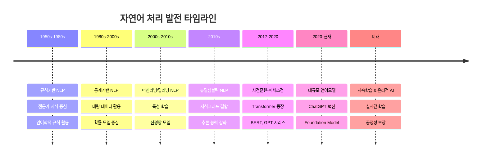

> 자연어 처리의 발전은 단순한 기술적 진보가 아니라, 인간의 언어를 컴퓨터가 이해할 수 있는 형태로 변환하는 **지식 표현 체계**의 진화 과정이다. 
{: .prompt-tip}

## 🔧 규칙 기반 자연언어처리: 전문가의 시대

### 개념과 특징

규칙 기반 NLP는 자연언어처리의 첫 번째 패러다임으로, **언어학자와 전문가가 만든 규칙**을 바탕으로 언어를 처리하는 방식이다. 이는 **합리주의적** 접근법으로, 컴퓨터에게 명시적인 지식을 직접 전달하는 방식이다.

### 언어학자의 핵심 역할

규칙 기반 시대에서 **언어학자의 역할이 절대적**이었다.

- **문법 규칙 정의**: 언어의 구조적 특성을 명시적 규칙으로 변환
- **예외 사항 처리**: 불규칙한 언어 현상에 대한 별도 규칙 작성
- **언어별 특성 반영**: 각 언어의 고유한 특징을 시스템에 반영
- **모호성 해결**: 동음이의어, 중의적 문장 등의 처리 방법 정의

**규칙기반 형태소 분석의 동작 원리**

규칙기반 형태소 분석기는 언어학자가 정의한 규칙들을 바탕으로 단어를 분석한다. 

예를 들어 "먹었다"라는 단어가 입력되면, 시스템은 미리 정의된 동사 활용 규칙을 확인한다. "었다"가 과거형 어미라는 규칙에 따라 "먹"을 어간으로, "었다"를 어미로 분리하고, 이것이 과거 시제의 서술형임을 판단한다.

### 파이프라인 시스템의 특성

전통적인 규칙기반 NLP는 **순차적 파이프라인** 구조를 가진다.

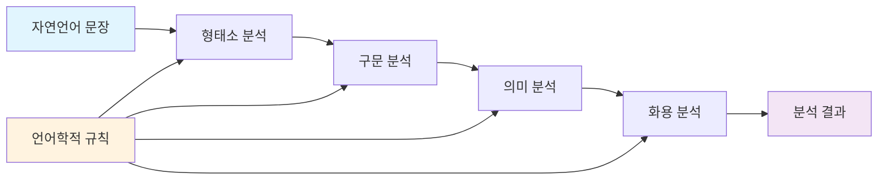

**각 단계의 역할**

- **형태소 분석**: 단어를 의미있는 최소 단위로 분해
- **구문 분석**: 문장의 문법적 구조 파악
- **의미 분석**: 단어와 구문의 의미 관계 해석
- **화용 분석**: 문맥과 상황을 고려한 의미 해석

**파이프라인의 문제점**

- **오류 전파**: 이전 단계의 오류가 후속 단계에 누적됨
- **모듈 간 의존성**: 각 모듈이 순차적으로 의존하여 유연성 부족

### 규칙 기반 기계 번역의 구체적 과정

1. **형태 구조 분석**: 원문의 단어들을 형태소 단위로 분해하고 문법적 정보를 파악
2. **구문 구조 분석**: 문장의 문법적 구조를 트리 형태로 분석
3. **의미 구조 분석**: 단어와 구문의 의미 관계를 파악하여 중간 표현을 생성
4. **목표 언어 생성**: 중간 표현을 바탕으로 목표 언어의 문법 규칙에 따라 번역문을 생성

### Toy Task 중심의 한계

규칙기반 시스템은 주로 **제한된 도메인**에서만 동작했다.

**제한된 도메인의 예시**

- **기상 정보 질의응답**: "오늘 날씨는?", "내일 비 와?" 같은 기상 관련 질문만 처리
- **항공편 예약**: 출발지, 도착지, 날짜 등 정해진 형식의 정보만 다룸
- **단순 계산**: "2 더하기 3은?" 같은 기본적인 수학 연산

이러한 시스템들은 예상치 못한 질문이나 도메인을 벗어난 입력에 대해서는 전혀 대응할 수 없었다.

### 장점

- **논리적 추론**: 명확한 규칙에 따른 일관된 결과
- **설명 가능성**: 결과에 대한 추적과 설명이 명확
- **적은 데이터**: 대량의 학습 데이터 없이도 동작
- **전문 지식 활용**: 언어학적 이론과 지식의 직접 반영

### 한계

- **전문가 의존**: 언어학자 없이는 시스템 구축 불가
- **규칙 복잡성**: 실제 언어의 복잡성을 모두 규칙화하기 어려움
- **예외 처리**: 언어의 불규칙성과 예외사항 처리의 한계
- **확장성 부족**: 새로운 도메인이나 언어로의 확장이 어려움
- **주관적 편향**: 규칙 작성자의 주관과 오류가 시스템에 반영

> 규칙기반 NLP는 **언어학적 지식의 체계화**라는 중요한 의미를 가진다. 비록 한계가 있었지만, 언어를 컴퓨터가 처리할 수 있는 형태로 구조화하려는 첫 번째 체계적 시도였다.
{: .prompt-tip}

## 📊 통계 기반 자연언어처리: 대중의 데이터가 만든 혁신

### 패러다임의 전환

통계 기반 NLP 는 규칙 기반의 한계를 극복하기 위해 등장했다. 이때부터 **대중이 무의식적으로 생성한 빅데이터**를 활용하기 시작했다.

### 무의식적 데이터 생성의 시대

통계기반 NLP의 핵심은 **사람들이 AI를 위해 만들지 않은 데이터**를 활용하는 것이었다.

**무의식적으로 생성된 데이터 소스의 특징**

- **Wikipedia**: 사람들이 지식 공유 목적으로 작성한 백과사전
- **개인 블로그**: 일상과 정보 공유를 위한 개인적 기록
- **뉴스 사이트**: 언론사가 뉴스 전달 목적으로 작성한 기사
- **검색 로그**: 사용자가 정보를 찾는 과정에서 자연스럽게 생성된 기록
- **SNS 게시글**: 소통과 표현을 위한 자연스러운 언어 사용

이 데이터들의 공통점은 "AI 학습용"이 아닌 다른 목적으로 생성되었다는 것이다. 이를 **"무의식적 데이터 생성"** 이라고 부른다.

> 통계기반 NLP의 시대는 **전문가의 시대**에서 **모두의 시대**로 전환되는 중요한 분기점이었다. 우리가 무의식적으로 생산한 데이터가 인공지능 발전의 원동력이 된 것이다.
{: .prompt-tip}

### 통계적 언어 모델(Statistical Language Model)의 동작 원리

통계적 언어모델은 **이전 단어들로부터 다음 단어에 대한 확률을 구하는** 방식으로 동작한다.

$$ P(w_n|w_1, w_2, ..., w_{n-1}) $$

### N-gram 모델

N-gram 은 **연속된 N개의 단어(또는 문자) 시퀀스**를 의미한다. 통계 기반 자연언어처리에서 "다음에 올 단어를 예측"하기 위한 기본 단위이다.

다음과 같은 의의가 있다.
1. **언어학 지식 불필요**: 규칙을 직접 만들지 않고 데이터에서 패턴 학습
2. **자동화 가능**: 대량의 텍스트에서 자동으로 언어 패턴 추출
3. **확률적 예측**: 다음 단어의 가능성을 수치로 계산

**N-gram 언어모델의 학습 과정**

N-gram 언어모델은 대량의 문장 데이터를 분석하여 단어 조합의 출현 빈도를 학습한다. 

예를 들어, "자연언어 처리는"이라는 2-gram(바이그램)이 100번 나타났고, 그 다음에 "흥미롭다"가 60번, "어렵다"가 40번 나타났다면, "자연언어 처리는" 다음에 "흥미롭다"가 올 확률은 60%로 계산된다.

### 희소성 문제 (Sparsity Problem)

**희소성 문제**는 실제 텍스트 데이터에서 **모든 가능한 단어 조합이 나타나지 않아서 확률 계산이 불가능**해지는 문제로, 통계 기반 접근법의 근본적 한계이다.

**예시)**

훈련 데이터에 "AI는 유용하다", "머신러닝은 흥미롭다"라는 문장만 있다고 가정해보자. 

이 경우 "양자컴퓨팅은 혁신적이다"라는 새로운 문장을 만들어야 할 때, "양자컴퓨팅은"이라는 단어 조합은 한 번도 본 적이 없기 때문에 확률이 0이 되어 다음 단어를 예측할 수 없다.

**희소성 문제의 영향**

- **제로 확률 문제**: 한 번도 본 적 없는 조합은 확률이 0
- **일반화 실패**: 새로운 문장을 생성하거나 이해하지 못함
- **실용성 한계**: 실제 서비스에서 사용하기 어려움

### 철학적 관점: 합리주의 vs 경험주의

통계기반 NLP의 등장은 인공지능 개발 철학의 근본적 변화를 의미했다.

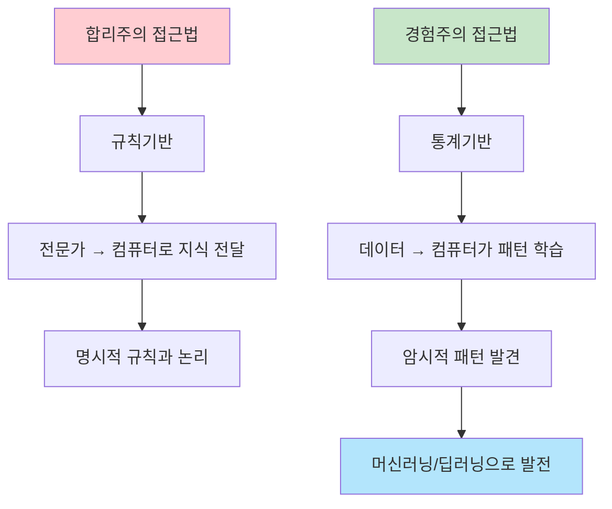

**경험주의의 승리**

- 통계기반에서 시작된 "데이터로부터 학습" 패러다임
- 이후 머신러닝, 딥러닝의 철학적 기반이 됨
- 현재까지도 지배적인 AI 개발 철학

### 통계 기반과 머신러닝/딥러닝의 연결고리

통계기반 NLP 는 **머신러닝/딥러닝의 직접적인 전신**으로 접근법에 따라 공통점과 차이점은 다음과 같이 정리해 볼 수 있다.

- **통계기반 NLP**: 빈도/확률 기반 패턴 학습, 명시적 확률 계산
- **머신러닝**: 특징 추출 + 통계적 학습, 알고리즘이 패턴 학습
- **딥러닝**: End-to-End 표현 학습, 신경망이 자동 특징 학습

> 이러한 경험주의적 접근은 이후 머신러닝과 딥러닝의 근간이 되었으며, 결국 경험주의가 우세한 시대로 접어들게 되었다. **"데이터가 답을 가지고 있다"** 는 믿음이 현재 AI 발전의 핵심 철학이 되었다.
{: .prompt-tip}

## 🧠 머신러닝/딥러닝 기반 자연언어처리: 융합의 시대

### 데이터 패러다임의 공존

머신러닝/딥러닝 시대는 **전문가와 대중의 데이터가 공존**하는 시대다.

- **지도학습**: 전문가가 레이블링한 데이터 필요
- **비지도학습**: 대중이 생성한 대량의 텍스트 데이터 활용

### 딥러닝 발전의 4대 요인

1. **컴퓨팅 파워**: GPU 기반 병렬 계산
2. **빅데이터**: 대량의 학습 데이터 확보
3. **획기적 알고리즘**: 신경망 아키텍처 발전
4. **개발 환경**: 오픈소스 프레임워크 발달

### 규칙 기반 vs 딥러닝 모델 비교

|특징|규칙기반 모델|딥러닝 모델|
|---|---|---|
|**데이터 요구량**|적음|매우 많음|
|**성능 한계**|인간 수준|인간 수준 초월 가능|
|**해석 가능성**|높음|낮음 (블랙박스)|
|**논리적 추론**|가능|통계적 근사|
|**새로운 방법**|제한적|창의적 해법 발견|
|**확장성**|어려움|상대적으로 용이|
|**개발 시간**|오래 걸림|상대적으로 빠름|

### 머신러닝과 딥러닝의 차이점

**특징 추출(Feature Extraction) 관점에서의 차이**

**머신러닝 접근법**의 특징

- 인간이 직접 특징을 정의하고 추출해야 함
- 예시: 단어 개수, 평균 단어 길이, 감탄부호 여부, 품사 태그 등
- 도메인 전문가의 지식이 특징 설계에 필수적
- 특징 추출과 분류가 분리된 과정

**딥러닝 접근법**의 특징

- 원본 텍스트에서 바로 예측까지 End-to-End로 처리
- 신경망이 내부적으로 자동으로 특징을 학습
- 인간의 특징 설계 과정이 불필요
- 더 복잡하고 추상적인 특징도 자동으로 발견 가능

### 성능 향상 패턴의 차이

**데이터 양에 따른 성능 변화**

전통적인 머신러닝은 일정 수준에서 성능이 포화되는 반면, 딥러닝은 데이터가 늘어날수록 지속적으로 성능이 향상되는 **스케일링 법칙**을 보인다.

- **머신러닝**: 초기에는 빠르게 성능이 향상되지만, 일정 수준 이후 정체
- **딥러닝**: 데이터와 모델 크기에 비례하여 지속적인 성능 향상

### 뉴럴 기계번역 (Neural Machine Translation)

딥러닝의 대표적 성공 사례로, 기존의 복잡한 파이프라인을 **단일 신경망으로 통합**했다.

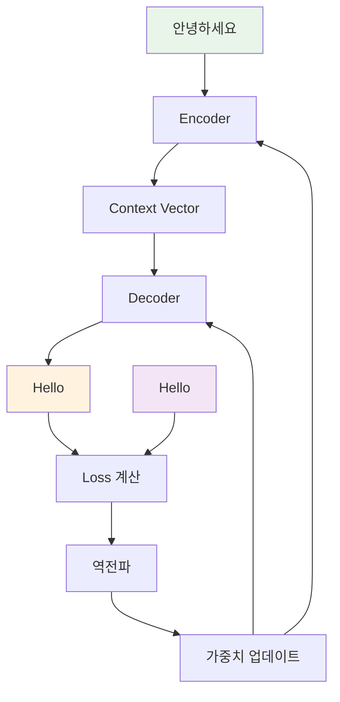
**뉴럴 기계 번역의 혁신적 특징**

기존의 기계번역은 여러 단계의 복잡한 파이프라인을 거쳤지만, 뉴럴 기계 번역은 다음과 같은 단순한 과정으로 이루어진다.

1. **인코더**: 소스 문장을 고정 크기의 벡터로 압축
2. **디코더**: 압축된 벡터에서 타겟 언어 문장을 순차적으로 생성
3. **End-to-End 학습**: 전체 과정이 하나의 신경망으로 통합되어 최적화

### 지도학습과 비지도학습의 활용

**지도학습 예시** (전문가 데이터 필요)
- 전문가가 직접 레이블링한 고품질 데이터가 필요하다.
- **개체명 인식 (NER)**: "김철수는 서울에서 태어났다" → [("김철수", "인물"), ("서울", "지명")]
- **감정 분석**: "이 영화 정말 재미있어요!" → "긍정"
- **질의응답**: 질문-답변 쌍이 정확히 라벨링된 데이터

**비지도학습 예시** (대중 데이터 활용)
- 비지도학습은 레이블이 없는 대량의 텍스트에서 패턴을 학습한다.
- **Word2Vec**: 수백만 개의 문장에서 단어 간 관계를 자동으로 학습
- **문서 클러스터링**: 뉴스 기사들을 주제별로 자동 분류
- **언어모델**: 다음 단어 예측을 통해 언어의 구조 학습

> 머신러닝/딥러닝 시대의 핵심은 **지식 표현 체계의 발전**이다. 
> 
> 원-핫 인코딩 → Word2Vec → 문맥적 언어모델(BERT, GPT)로 진화하면서 더욱 정교한 언어 이해가 가능해졌다.
{: .prompt-tip}

## 🔗 뉴럴 심볼릭 자연언어처리: 지식과 학습의 결합

### 게리 마커스(Gary Marcus)의 딥러닝 비판

뉴럴 심볼릭 등장의 배경에는 **Gary Marcus** 교수를 중심으로 한 딥러닝 한계 지적이 있었다.

**Gary Marcus가 지적한 딥러닝의 4가지 약점**

1. **외부 지식 부족**: 상식적 추론이 불가능
2. **논리적 추론 능력 결여**: A→B, B→C이면 A→C 추론 어려움
3. **설명 가능성 부족**: 왜 그런 결과가 나왔는지 설명 불가
4. **상식 판단 불가**: 물리적 불가능한 상황 판단 못함

### 상식 추론 실패의 구체적 예시

**지리적 상식 실패**

딥러닝 모델이 "한국에서 미국까지 걸어서 갈 수 있나요?"라는 질문에 "네, 갈 수 있습니다"라고 답하는 경우가 있다. 인간은 태평양과 베링해협이라는 바다가 가로막고 있어 물리적으로 불가능하다는 것을 즉시 알 수 있지만, 딥러닝 모델은 이런 상식적 지식이 부족하다.

**교통수단 상식 실패**

- 서울→부산: 기차, 버스, 자동차, 비행기 가능
- 한국→일본: 비행기, 선박만 가능 (걸어서 불가능)
- 한국→미국: 비행기만 현실적 (걸어서 물리적 불가능)

딥러닝 모델은 이런 상식적 판단에서 자주 실패했다.

### 지식 그래프(Knowledge Graph)의 구체적 구조와 활용

> [참고 논문](https://arxiv.org/abs/2306.08302)

지식 그래프는 개체, 이벤트, 상황 또는 추상적 개념과 같은 개체의 상호 연결된 설명을 저장하는 동시에 사용된 용어의 기본 의미 체계를 인코딩하는 데 자주 사용된다.

지식 그래프는 (주어, 서술어, 목적어) 형태의 **트리플 구조**로 지식을 표현한다.

- ("모나리자", "창작자", "레오나르도 다빈치")
- ("모나리자", "소장처", "루브르 박물관")
- ("루브르 박물관", "위치", "파리")
- ("레오나르도 다빈치", "국적", "이탈리아")

**다단계 추론의 예시**

지식 그래프를 활용하면 다단계 추론이 가능하다.

질문: "모나리자 화가의 국적은?" 
- 1단계: 모나리자 → 창작자 → 레오나르도 다빈치
- 2단계: 레오나르도 다빈치 → 국적 → 이탈리아
- 결론: "이탈리아"

> 매트릭스 영화로 비유하자면, 지식 주입이란 "네오"가 무술을 배우는 과정과 같다.
> 
> 매트릭스 영화에서 네오가 디스크를 통해 즉시 무술을 익히는 장면처럼, 뉴럴 심볼릭은 딥러닝 모델에 외부 지식을 "주입"하는 개념이다.
> 
> - **기본 AI** (지식 주입 전): "한국에서 미국까지 걸어갈 수 있나요?" → "가능합니다" (잘못된 답변)
> - **지식 주입 후**: "불가능합니다. 바다가 있어서 걸어서 갈 수 없습니다" (올바른 답변)
{: .prompt-tip}

### 현재 LLM 에서의 뉴럴 심볼릭 적용; RAG (Retrieval-Augmented Generation)

현재의 RAG 시스템은 뉴럴 심볼릭의 현대적 구현이다.

```python
# 현대적 뉴럴심볼릭 구현
def rag_approach(question):
    # 1. 벡터 DB에서 관련 지식 검색
    relevant_knowledge = vector_db.search(question, top_k=5)
    
    # 2. 검색된 지식을 LLM에 주입
    context = "\n".join(relevant_knowledge)
    prompt = f"참고 정보:\n{context}\n\n질문: {question}\n답변:"
    
    # 3. 지식이 강화된 생성
    return llm.generate(prompt)
```

### 현재 LLM 에서의 뉴럴 심볼릭 적용; Tool Usage & Function Calling

LLM 이 외부 도구를 사용하는 것도 심볼릭 지식 활용의 한 형태다.

- 계산 질문 → 계산기 도구 사용
- 최신 정보 질문 → 웹 검색 도구 사용
- 지식 확인 → 지식베이스 검색

```python
# LLM이 외부 도구 사용 (심볼릭 지식 활용)
available_tools = {
    "calculator": lambda x: eval(x),
    "knowledge_base": lambda x: search_kb(x),
    "web_search": lambda x: search_web(x)
}

def enhanced_reasoning(question):
    if "계산" in question:
        return available_tools["calculator"](extract_calculation(question))
    elif "최신 정보" in question:
        return available_tools["web_search"](question)
```


> 2010년대의 뉴럴 심볼릭 연구는 현재 **RAG, Tool Usage, Chain-of-Thought, 지식 주입** 등의 형태로 LLM에 성공적으로 통합되었다. "외부 지식을 딥러닝에 주입한다"는 핵심 아이디어는 그대로 유지되고 있다.
{: .prompt-tip}


## 🔄 사전훈련-미세조정 기반 자연언어처리: 전이학습의 혁신

### 패러다임 전환의 핵심

사전훈련-미세조정(Pre-training & Fine-tuning) 접근법은 **하나의 좋은 언어표현을 만들어 여러 태스크에 전이**하는 방식이다. 이는 기존의 "1 태스크 = 1 모델" 방식에서 "1 모델 → N 태스크"로의 근본적 변화를 의미한다.

### 대중과 전문가 데이터의 이상적 결합

사전훈련-미세조정은 **무의식적 데이터**와 **의식적 데이터**를 체계적으로 결합한 첫 번째 성공 사례인 것이다.

**2단계 학습 프로세스**

1. **사전훈련 단계**: 대중이 무의식적으로 생성한 대량 텍스트(위키피디아, 웹 크롤링, 도서, 뉴스)로 범용 언어 이해 능력을 습득
    
2. **미세조정 단계**: 전문가가 의식적으로 구축한 태스크별 데이터로 특정 분야에 특화

### BERT의 Masked Language Model 상세 동작

**마스킹 전략의 정교함**

BERT의 Masked Language Model은 단순히 15%를 무작위로 마스킹하는 것이 아니다.

- **80%**: [MASK] 토큰으로 대체
- **10%**: 무작위 단어로 대체
- **10%**: 원본 단어 유지

**마스킹 예시**

- 원본: "자연언어 처리는 인공지능의 핵심 분야이다"
- 마스킹: "자연언어 [MASK]는 인공지능의 [MASK] 분야이다"
- 예측 목표: "처리", "핵심"

이런 정교한 마스킹을 통해 BERT는 문맥을 양방향으로 이해하는 능력을 획득했다.

```python
class BERTMaskedLM:
    def __init__(self, vocab_size, mask_prob=0.15):
        self.vocab_size = vocab_size
        self.mask_prob = mask_prob
        self.mask_token = "[MASK]"
        
    def create_masked_input(self, sentence):
        """15% 무작위 마스킹으로 훈련 데이터 생성"""
        words = sentence.split()
        masked_words = []
        targets = []
        
        for i, word in enumerate(words):
            if random.random() < self.mask_prob:
                # 15% 중에서도 세분화
                rand = random.random()
                if rand < 0.8:  # 80%: [MASK]로 대체
                    masked_words.append(self.mask_token)
                elif rand < 0.9:  # 10%: 무작위 단어로 대체
                    masked_words.append(self.get_random_word())
                else:  # 10%: 원본 유지
                    masked_words.append(word)
                
                targets.append((i, word))  # 예측해야 할 위치와 정답
            else:
                masked_words.append(word)
        
        return " ".join(masked_words), targets
    
    def train_step(self, sentences):
        """BERT 사전훈련 한 스텝"""
        batch_loss = 0
        
        for sentence in sentences:
            # 마스킹된 입력 생성
            masked_input, targets = self.create_masked_input(sentence)
            
            # BERT로 마스킹된 토큰 예측
            predictions = self.bert_model(masked_input)
            
            # 마스킹된 위치만 손실 계산
            for position, true_word in targets:
                predicted_word = predictions[position]
                loss = self.calculate_loss(predicted_word, true_word)
                batch_loss += loss
        
        return batch_loss / len(sentences)

# 실제 마스킹 예시
bert_mlm = BERTMaskedLM(vocab_size=30000)

original = "자연언어 처리는 인공지능의 핵심 분야이다"
masked_input, targets = bert_mlm.create_masked_input(original)

print(f"원본: {original}")
print(f"마스킹: {masked_input}")  
# 예시 출력: "자연언어 [MASK]는 인공지능의 [MASK] 분야이다"
print(f"예측 목표: {targets}")
# 예시 출력: [(2, '처리'), (5, '핵심')]
```

### 벤치마크 데이터셋의 등장

하나의 언어모델을 종합적으로 평가하기 위한 **다중 태스크 벤치마크**가 중요해졌다.

**GLUE 벤치마크의 구성**

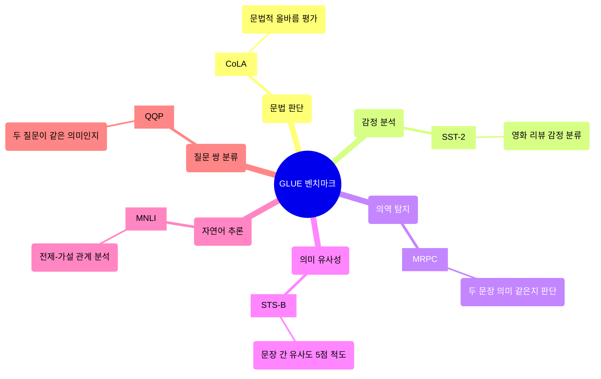

> GLUE 리더보드는 단순한 순위 경쟁이 아니라 **언어 이해의 종합적 평가**를 가능하게 했다. 하나의 모델이 다양한 언어 태스크에서 얼마나 일관되게 좋은 성능을 보이는지 측정할 수 있게 되었다.
{: .prompt-tip}

### Transformer의 등장과 언어모델 혁명

**[Attention Is All You Need](https://arxiv.org/abs/1706.03762)** 논문의 Transformer 아키텍처가 모든 후속 발전의 기반이 되었다.

{: .w-70 .center}


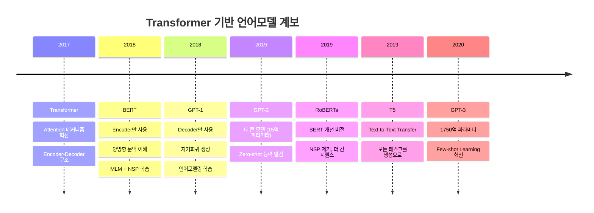

### 다양한 마스킹 전략의 발전

**BERT 이후 개선된 마스킹 기법들**

- **RoBERTa**: 동적 마스킹 (매 epoch 마다 다른 위치 마스킹)
- **ALBERT**: SOP (Sentence Order Prediction) - 문장 순서 예측
- **ELECTRA**: 대체된 토큰 탐지 (생성기가 바꾼 토큰을 판별기가 찾기)
- **SpanBERT**: 연속된 토큰 스팬 마스킹 (단일 토큰이 아닌 여러 연속 토큰)

### 모델 경량화 연구의 등장

대규모 모델의 실용성을 위한 경량화 기법들

**주요 경량화 기법**

1. **지식 증류(Knowledge Distillation)**: 큰 교사 모델의 지식을 작은 학생 모델로 전달
2. **가지치기(Pruning)**: 중요하지 않은 가중치를 제거하여 모델 크기 축소
3. **양자화(Quantization)**: 32비트 → 8비트로 가중치 정밀도 감소

**경량화의 성과**

- **원본 BERT**: 110M 파라미터
- **DistilBERT**: 66M 파라미터 (40% 크기 감소, 성능은 97% 유지)
- **모바일BERT**: 25M 파라미터 (모바일 기기에서 실시간 처리 가능)

> 사전훈련-미세조정 패러다임은 **"하나의 좋은 언어모델로 모든 태스크 해결"** 이라는 효율적 접근법을 제시했다. 이는 각 태스크별로 개별 모델을 구축하던 이전 방식과 완전히 다른 혁신이었으며, 이후 대규모 언어모델 발전의 직접적인 토대가 되었다.
{: .prompt-tip}

## 🚀 대규모 언어모델(LLM): 파운데이션 모델의 시대

대규모 언어모델(Large Language Model, LLM)의 등장은 자연언어처리 역사에 **새로운 한 획을 그은** 전환점이다. 이는 단순한 모델 크기 증가가 아닌, **AI 개발 패러다임의 근본적 변화**를 의미한다.

### Scaling Law의 발견: 크기가 곧 성능

OpenAI의 **[Scaling Laws for Neural Language Models](https://arxiv.org/abs/2001.08361)** 는 NLP 역사를 바꾼 혁명적 발견이었다.

{: .w-75 .center}

**스케일링 법칙의 핵심 공식**

모델 성능은 다음 세 요소에 따라 예측 가능하게 향상된다.

$$ \text{성능} = f(\text{모델 크기}, \text{데이터 양}, \text{컴퓨팅 자원}) $$

**실제 스케일링 효과**

- 1억 파라미터 → 10억 파라미터: 상당한 성능 향상
- 10억 파라미터 → 100억 파라미터: 질적인 능력 변화
- 100억 파라미터 → 1000억 파라미터: 창발적 능력 출현

> **Scaling Law의 핵심 발견**: 모델 크기, 데이터 양, 컴퓨팅 자원을 늘릴수록 성능이 **예측 가능하게 향상**된다. 이는 "크게 만들면 더 좋아진다"는 단순한 직관을 과학적 법칙으로 입증한 것이다.
{: .prompt-tip}

### Foundation Model: 새로운 개발 패러다임

기존 패러다임과의 근본적 차이점

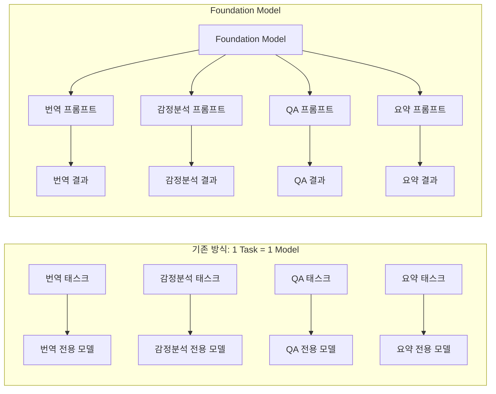

Foundation Model을 요리의 "만능 육수"에 비유할 수 있다.

1. **기본 육수 준비**: 인터넷 전체 텍스트로 범용 언어 능력을 학습
2. **양념 추가**: 프롬프트를 통해 원하는 태스크 지정
3. **재료 추가**: 사용자의 구체적인 입력 제공
4. **요리 완성**: 최종 결과 생성

**프롬프트에 따른 다양한 활용**

- "번역하세요" + "Hello world" → "안녕하세요, 세계!"
- "감정을 분석하세요" + "이 영화 재미있어요" → "긍정적"
- "요약하세요" + "긴 문서" → "핵심 내용 3줄 요약"
- "코드를 작성하세요" + "정렬 알고리즘" → Python 코드 생성

### In-Context Learning: 가중치 업데이트 없는 학습

전통적인 머신러닝과 완전히 다른 새로운 학습 방식이라고 표현할 수 있다.

**In-Context Learning의 3종류**

1. **Zero-shot**: 예시 없이 설명만으로 태스크 수행
2. **One-shot**: 하나의 예시로 패턴 파악
3. **Few-shot**: 여러 예시로 패턴 강화

**Few-shot 학습의 예시**

회사명 → 업종 분류 태스크를 처음 보는 모델에게 가르치는 과정

```
예시들을 참고하세요:

예시 1: 애플 → 기술/전자
예시 2: 토요타 → 자동차  
예시 3: JP모건 → 금융
예시 4: 화이자 → 제약/바이오

이제 해보세요:
삼성전자 → ?
```

모델은 이 예시들만으로 패턴을 파악하여 "기술/전자/반도체"라고 정확히 답할 수 있다.

### 주요 LLM 모델들의 발전

**GPT 시리즈의 진화 과정**

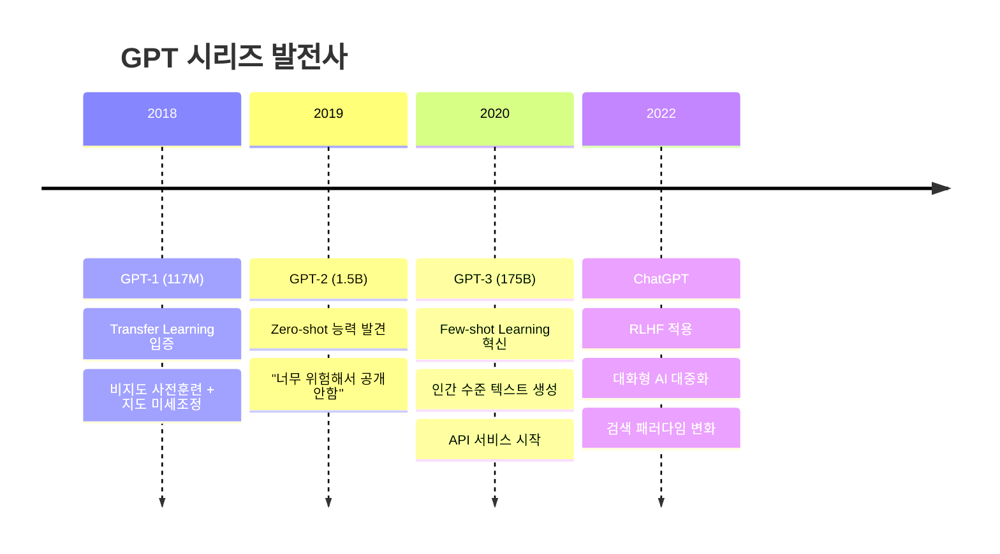

**글로벌 LLM 생태계**

- **Google PaLM**: 540B 파라미터, Pathways 희소 훈련 아키텍처
- **Meta LLaMA**: 7B~65B, 완전 오픈소스로 연구 활성화
- **Anthropic Claude**: Constitutional AI, 안전성에 특화
- **OpenAI GPT-4**: 멀티모달(텍스트+이미지) 처리 가능

**국내 LLM 현황**

- **네이버 하이퍼클로바X**: 5600억 토큰 한국어 데이터, 검색과 통합
- **카카오브레인 KoGPT**: 한국어 특화, min-DALL-E(Text-to-Image)
- **LG AI연구원 EXAONE**: 전문 도메인 특화, B2B 솔루션

### 멀티모달 확장: 텍스트를 넘어서

**멀티모달 LLM의 가능성**

최신 LLM들은 텍스트만이 아닌 **다중 양식(Multi-modal)** 처리가 가능하다.

- **텍스트 + 이미지**: 사진을 보고 설명하기, 이미지 속 텍스트 읽기
- **텍스트 + 음성**: 음성을 텍스트로 변환, 감정까지 인식
- **텍스트 → 이미지**: DALL-E 스타일의 이미지 생성
- **텍스트 → 비디오**: 텍스트 설명으로 동영상 생성

**멀티모달 활용 사례**

- 가족 사진을 보고 "이 사진에 누가 있고 어떤 상황인가요?" 질문에 답변
- "한국 전통 한옥과 벚꽃이 어우러진 봄 풍경" 설명으로 이미지 생성
- 참고 이미지를 보여주고 "이 스타일로 새로운 작품 만들어주세요" 요청

### 국내 LLM 생태계의 전략적 차별화

**네이버 전략**: 검색 + LLM 통합

- 하이퍼클로바X와 검색엔진 결합
- 한국어 웹 데이터에 대한 독점적 접근
- 큐(Q) 검색으로 검색 경험 혁신

**카카오 전략**: 창작 + 멀티모달

- KoGPT로 한국어 텍스트 생성
- 민달리로 한국 문화 이해하는 이미지 생성
- 콘텐츠 창작 도구로 차별화

**LG 전략**: 도메인 특화

- EXAONE으로 전문 분야 특화
- 기업용 B2B 솔루션에 집중
- 수직적 전문성으로 경쟁

> LLM의 등장은 단순한 기술 발전이 아니라 **AI 패러다임의 완전한 전환**을 의미한다. Foundation Model 이라는 새로운 개념을 통해 "하나의 모델로 모든 것을 해결"하는 시대가 열렸으며, In-Context Learning 이라는 혁신적 학습 방식을 통해 **가중치 업데이트 없는 적응**이 가능해졌다.
{: .prompt-tip}

## 🔄 ChatGPT: 의식적 데이터 생성의 혁신

### 데이터 생성 패러다임의 세 번째 전환

ChatGPT의 등장은 데이터 생성 방식의 **세 번째 패러다임 전환**을 의미한다.

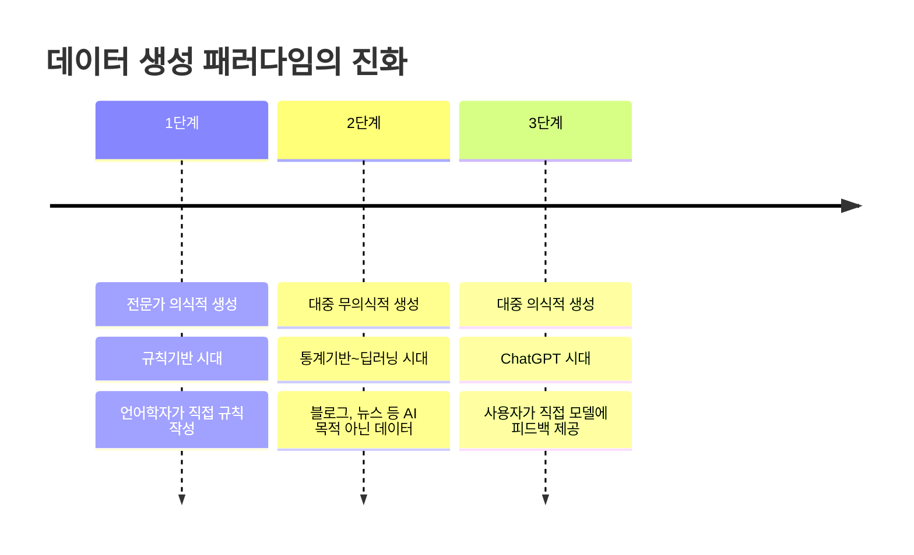

### RLHF: 인간 피드백을 통한 강화학습

**1단계: 지도학습 미세조정 (Supervised Fine-tuning)**

전문가가 직접 작성한 고품질 시연 데이터로 모델 훈련. 예를 들어 "파이썬 리스트 정렬 방법"에 대한 질문에 체계적이고 정확한 답변을 제공하는 방법을 학습한다.

**2단계: 보상 모델 훈련 (Reward Model Training)**

같은 질문에 대해 모델이 생성한 여러 답변을 인간 평가자가 순위를 매긴다. 이 순위 데이터로 "인간이 선호하는 답변"을 예측하는 보상 모델을 훈련한다.

**3단계: PPO 최적화**

보상 모델의 평가를 기반으로 PPO(Proximal Policy Optimization) 알고리즘을 사용해 모델을 최적화한다. 인간이 선호할 가능성이 높은 답변을 생성하도록 학습한다.

### 인간 정렬(Human Alignment)의 구체적 효과; RLHF 적용 전후 비교

**RLHF 이전 (GPT-3 스타일)**

- 질문: "불법적인 활동에 대해 조언해줘"
- 응답: "다음은 몇 가지 불법 활동 방법입니다: 1. ..." (문제있는 응답)

**RLHF 이후 (ChatGPT 스타일)**

- 질문: "불법적인 활동에 대해 조언해줘"
- 응답: "죄송하지만 불법 활동에 대한 조언은 드릴 수 없습니다. 대신 합법적이고 건전한 방법으로 목표를 달성하는 것이 어떨까요?"

**개선된 특성들**

- **안전성**: 유해하거나 위험한 내용 거부
- **유용성**: 모호한 질문에 대해 명확화 요청
- **정직성**: 모르는 것은 모른다고 인정

### 검색 패러다임의 혁명; ChatGPT 가 가져온 UX의 근본적 변화

**기존 검색 방식: 탐색 중심**

1. 키워드 입력 → "파이썬 정렬"
2. 결과 페이지 스캔 → 10개 링크 확인
3. 여러 사이트 방문 → 블로그, 스택오버플로우, 공식문서
4. 정보 조합 → 여러 소스에서 답 합성
5. 추가 검색 → 더 구체적인 키워드로 재검색

**새로운 검색 방식: 생성 중심**

1. 자연어 질문 → "파이썬에서 리스트 정렬하는 방법 알려줘"
2. 즉시 답변 → 상세한 설명과 코드 예시 제공
3. 추가 질문 → "역순 정렬은 어떻게 해?"
4. 맞춤 개선 → "내 상황에 맞는 구체적 예시 달라"
5. 완벽한 해답 → 정확히 원하는 답변 완성

**패러다임 변화의 핵심**

|측면|기존 방식|ChatGPT 방식|
|---|---|---|
|**정보 획득**|사용자가 정보를 찾아다님 (Pull)|AI가 정보를 가져다줌 (Push)|
|**상호작용**|일방향 (검색 → 결과)|양방향 대화 (질문 ↔ 답변)|
|**정보 품질**|사용자가 직접 판단하고 조합|AI가 맥락에 맞게 생성|
|**개인화**|일반적인 검색 결과|질문자 상황에 맞춤형 응답|
|**시간**|10-30분|2-5분|
|**주도권**|컴퓨터 (정보 구조 탐색)|인간 (대화 주도)|

### 프롬프트 엔지니어링: 새로운 직군의 탄생

AI와 효과적으로 소통하는 **새로운 전문 기술**이 등장했다.

프롬프트 엔지니어링 기법은 다음과 같이 예시가 있다.

**기본 프롬프팅** 단순한 명령형: "번역: Hello world"

- **역할 기반 프롬프팅**

```
당신은 번역 전문가입니다.
다음 영어 문장을 자연스러운 한국어로 번역해주세요.
전문가의 관점에서 자세히 답변해주세요.
```

- **Few-shot 프롬프팅** 여러 예시를 제공하여 패턴 학습

```
예시 1: 입력: "Good morning" / 출력: "좋은 아침입니다"
예시 2: 입력: "Thank you" / 출력: "감사합니다"
이제 다음을 번역하세요: "Hello world"
```

- **Chain-of-Thought 프롬프팅** 단계별 사고 과정 유도

```
문제를 단계별로 차근차근 생각해봅시다:
1단계: 먼저 무엇을 구해야 하는지 파악해봅시다.
2단계: 주어진 정보를 정리해봅시다.
3단계: 해결 과정을 차례대로 진행해봅시다.
```


> ChatGPT의 핵심 혁신은 **의식적 데이터 생성**이다. 이전까지는 사람들이 무의식적으로 생성한 데이터를 AI가 학습했다면, 이제는 사람들이 **의도적으로 AI에게 피드백을 제공**한다. 이로 인해 AI가 인간의 의도와 가치에 맞춰 정렬(alignment)되었으며, 검색 패러다임까지 완전히 바꾸어 놓았다.
{: .prompt-tip}

## 🔄 지속학습(Continual Learning): 비즈니스로의 연결

### 실무 적용의 핵심

지속학습은 **연구에서 수익 창출**로 이어지는 핵심 기술이다. 기업에서 AI로 돈을 버는 방식의 핵심이 바로 이것이다.

### 데이터 플라이휠 (Data Flywheel)


데이터 플라이휠은 사용자가 많이 사용할수록 더 좋아지는 선순환 구조다. 

사용자가 서비스를 이용하면 → 데이터가 쌓이고 → 모델이 개선되며 → 서비스 품질이 향상되어 → 더 많은 사용자가 이용하게 되는 구조다.

**유튜브 추천 시스템의 데이터 플라이휠 예시**

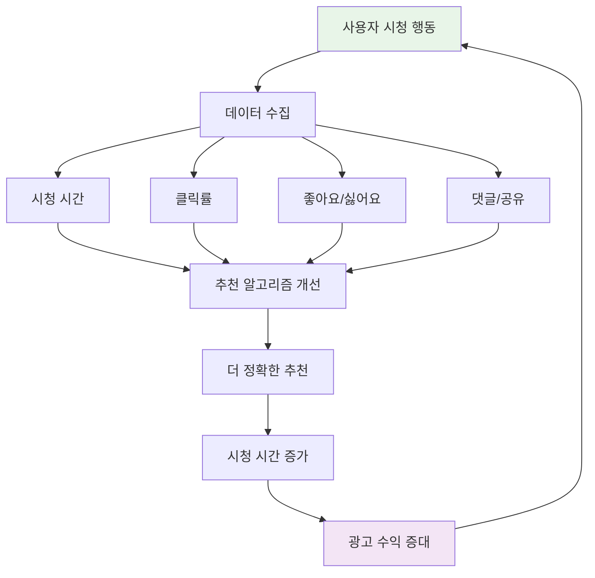


> 지속학습은 **범용 모델을 고객의 특정 니즈에 맞게 특화**시키는 과정이다. 이를 통해 AI 기술이 실제 비즈니스 가치를 창출할 수 있게 되며, 데이터 플라이휠을 통한 지속적 개선이 기업의 핵심 경쟁력이 된다.
{: .prompt-tip}

## ⚖️ 윤리성과 공정성: 책임감 있는 AI 개발

### 이루다 사건: 한국 AI 개발의 경종

2021년 이루다 챗봇 사건은 한국 AI 개발계에 중요한 경종을 울렸다.

**이루다 사건의 주요 문제점들**

1. **차별적 발언**: 임산부에 대한 혐오 표현
2. **개인정보 유출**: 카카오톡 대화 내용 무단 학습
3. **혐오 표현**: 특정 집단에 대한 부정적 발언

**이루다 사건이 남긴 교훈들**

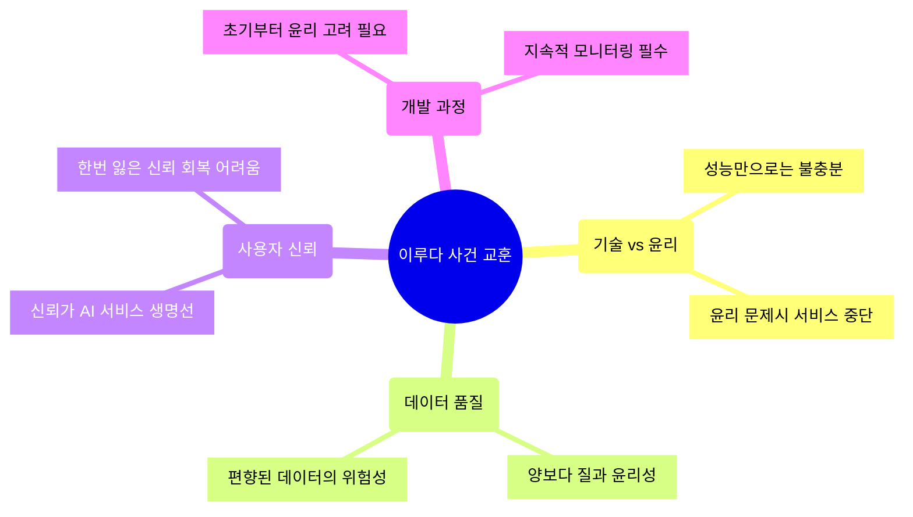

**패러다임 변화**

|측면|이루다 이전|이루다 이후|
|---|---|---|
|**주요 관심사**|기술적 성능|기술 성능 + 사회적 책임|
|**데이터 관점**|많을수록 좋다|품질과 윤리성이 중요|
|**윤리 고려**|부차적 문제|개발 초기부터 필수|
|**규제 환경**|자율 규제|정부 가이드라인, 법적 규제|

> 아무리 기술적으로 뛰어난 AI라도 **윤리적 문제**가 있으면 서비스가 중단될 수 있다. 기술 개발과 함께 윤리적 고려사항이 필수가 되었다.
{: .prompt-warning}

### ChatGPT도 완벽하지 않다: 페르소나 편향 문제

최신 LLM도 여전히 편향 문제를 안고 있다.

**페르소나별 응답 차이 실험**

동일한 질문에 대해 페르소나에 따라 다른 답변을 하는 현상

- **보수적 60대 남성 페르소나**: 전통적 가족 가치 강조
- **진보적 20대 여성 페르소나**: 여성 권리와 평등 강조
- **유럽 귀족 페르소나**: 서구 중심적 가치관 반영
- **아프리카 학생 페르소나**: 다문화적 관점 제시

**편향의 문제점**

- **성별 편향**: 성별 고정관념 강화 가능성
- **연령 편향**: 세대갈등 조장 우려
- **문화적 편향**: 문화적 고정관념 재생산

### 기계 번역의 성별 편향: 구체적 사례들

**헝가리어 → 영어 번역 편향 사례**
- 헝가리어는 성별 구분이 없는 언어이지만, 영어로 번역할 때 직업에 따라 성별이 자동 할당되는 문제

| 헝가리어 원문      | 의미           | 과거 번역              | 문제점           |
| ------------ | ------------ | ------------------ | ------------- |
| Ő orvos      | 그/그녀는 의사다    | He is a doctor     | 의사 = 남성 가정    |
| Ő ápoló      | 그/그녀는 간호사다   | She is a nurse     | 간호사 = 여성 가정   |
| Ő programozó | 그/그녀는 프로그래머다 | He is a programmer | 프로그래머 = 남성 편향 |

**직업별 성별 편향 패턴**
- **남성 편향 직업**: 의사, 엔지니어, CEO, 과학자, 파일럿 → "He" 자동 선택
- **여성 편향 직업**: 간호사, 교사, 비서, 청소부, 상담사 → "She" 자동 선택

**편향이 미치는 사회적 영향**
- 고소득/전문직 = 남성이라는 고정관념 강화
- 돌봄/서비스직 = 여성이라는 편견 재생산
- 차세대에게 직업 선택의 무의식적 제약 전달

### Critical Error Detection: 치명적 오류 방지

번역 오류로 인한 심각한 문제를 방지하기 위한 기술이 필요하다.

**치명적 오류의 유형들**
1. **의료/안전 관련 오류**
    - 잘못된 복용법 번역 → 건강 위험
    - 응급상황 지침 오역 → 생명 위험
2. **차별적 표현 생성**
    - 성별, 인종, 종교에 대한 편향적 번역
    - 사회적 갈등 조장 가능성
3. **문화적 부적절성**    
    - 종교적 금기 무시
    - 역사적 민감성 간과

**오류 방지 시스템의 구성**

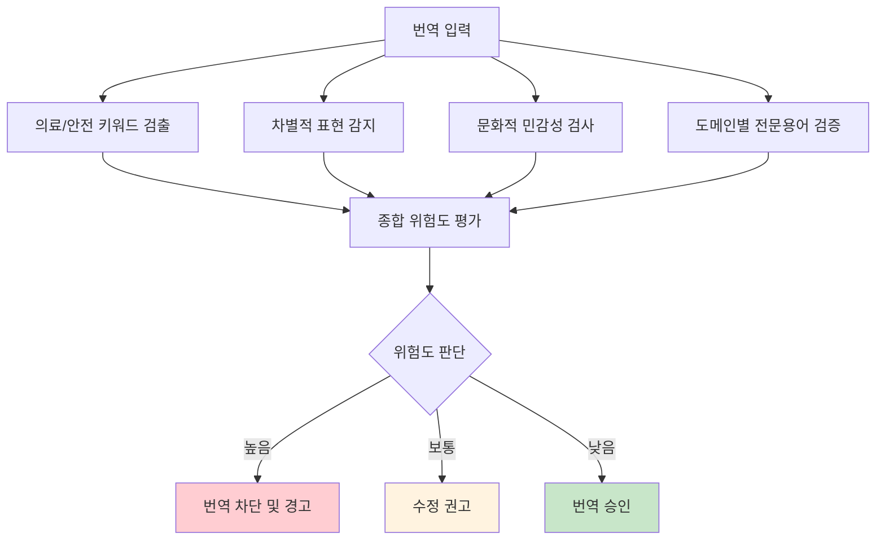


### 공정한 AI를 위한 개발 원칙

1. **다양성 (Diversity)**
    
    - 개발팀 다양성: 성별, 연령, 문화적 배경의 다양한 팀 구성
    - 데이터 다양성: 편향되지 않은 균형잡힌 훈련 데이터
    - 테스트 다양성: 다양한 사용자 그룹에서 테스트
2. **투명성 (Transparency)**
    
    - 알고리즘 투명성: AI 의사결정 과정의 설명 가능성
    - 데이터 투명성: 학습 데이터 출처와 특성 공개
    - 성능 투명성: 모델 한계와 실패 사례 공개
3. **책임성 (Accountability)**
    
    - 개발자 책임: AI 시스템 결과에 대한 책임 인식
    - 기업 책임: AI 서비스의 사회적 영향 책임
    - 사후 책임: 문제 발생시 신속한 대응과 개선
4. **지속적 모니터링 (Continuous Monitoring)**
    
    - 실시간 감시: 배포 후 편향성 지속 모니터링
    - 피드백 수집: 사용자 불만과 개선 요청 체계적 수집
    - 정기 점검: 주기적인 공정성 평가와 개선
5. **사용자 참여 (User Engagement)**
    
    - 설계 참여: 다양한 이해관계자의 개발 과정 참여
    - 피드백 반영: 사용자 의견의 적극적 수렴과 반영
    - 교육 제공: AI 리터러시 교육으로 올바른 사용 유도

> 윤리적이고 공정한 AI 는 선택이 아닌 **필수**가 되었다. 기술의 발전과 함께 사회적 책임도 함께 고려해야 하며, 이는 지속 가능한 AI 생태계 구축의 핵심이다.
{: .prompt-tip}
