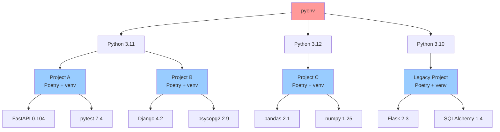

{: .center}

## 📦 사용하는 기술 및 버전

- Poetry 2.1+
- Python 3.11+
- pip 24.0+
- uv 0.4+
- pyenv 2.3+

## 🚀 TL;DR

- **Poetry**는 Python 프로젝트의 **의존성 관리**와 **패키징**을 통합 관리하는 현대적 도구다
- **pyproject.toml** 파일을 중심으로 프로젝트 설정과 의존성을 **선언적으로 관리**한다
- Poetry 2.x는 **PEP 621 표준**을 지원하여 `[project]` 테이블을 기본 형식으로 사용한다
- **의존성 해결(dependency resolution)**과 **가상환경 관리**를 자동화하여 개발 효율성을 높인다
- Poetry 2.x는 **성능 개선**, **플러그인 시스템**, **더 나은 의존성 해결 알고리즘**을 제공한다
- **pip**보다 **의존성 충돌 해결**이 뛰어나고, **uv**와 함께 사용하면 **설치 속도**를 크게 향상시킬 수 있다
- **lock 파일**을 통해 **재현 가능한 빌드**를 보장하고, **프로덕션 배포**의 일관성을 확보한다

## 🎯 Poetry란 무엇인가?

**[Poetry](https://python-poetry.org/docs/)** 는 Python 프로젝트의 의존성 관리와 패키징을 현대적이고 직관적인 방식으로 해결하는 도구다.

전통적인 `requirements.txt`와 `setup.py` 방식의 한계를 극복하고, **선언적 의존성 관리**, **자동 가상환경 생성**, **의존성 잠금(dependency locking)** 등의 기능을 제공한다.

Poetry는 마치 **프로젝트 매니저**와 같은 역할을 한다. 개발자가 "이 프로젝트에는 FastAPI와 pytest가 필요해"라고 말하면, Poetry가 알아서 호환되는 버전을 찾고, 가상환경을 만들고, 모든 의존성을 설치한다.

### Poetry의 핵심 철학

- **표준 준수**: PEP 621 표준을 채택하여 Python 생태계 호환성 강화
- **단일 설정 파일**: `pyproject.toml` 하나로 모든 설정 관리
- **의존성 해결**: 버전 충돌을 자동으로 감지하고 해결
- **재현 가능한 빌드**: `poetry.lock` 파일로 정확한 버전 고정
- **개발자 경험**: 직관적인 CLI 명령어와 명확한 오류 메시지

> Poetry는 Python 생태계의 **패키지 관리 표준화**를 위한 중요한 도구로, **의존성 지옥(dependency hell)** 문제를 해결하는 현대적 접근법을 제공한다.
{: .prompt-tip}

## 📄 TOML 파일 형식 이해하기

Poetry가 사용하는 `pyproject.toml` 파일을 이해하기 위해, 먼저 **TOML(Tom's Obvious, Minimal Language)** 형식에 대해 알아보자.

### TOML이란?

TOML은 **설정 파일**을 위한 **최소한이면서 명확한** 형식으로, JSON이나 YAML보다 **사람이 읽기 쉽고 편집하기 쉽다**.

```toml
# 기본 키-값 쌍
title = "Poetry 프로젝트"
version = "1.0.0"

# 배열
dependencies = ["fastapi", "uvicorn", "pydantic"]

# 테이블 (딕셔너리) - PEP 621 형식
[project]
name = "my-project"
version = "0.1.0"
dependencies = ["fastapi>=0.104.0"]

# 기존 Poetry 형식
[tool.poetry]
name = "my-project"
version = "0.1.0"

[tool.poetry.dependencies]
python = "^3.11"
fastapi = "^0.104.0"
```

### TOML vs JSON vs YAML

|특징|TOML|JSON|YAML|
|---|---|---|---|
|**가독성**|⭐⭐⭐|⭐⭐|⭐⭐⭐|
|**편집 용이성**|⭐⭐⭐|⭐|⭐⭐|
|**주석 지원**|✅|❌|✅|
|**타입 안정성**|⭐⭐⭐|⭐⭐|⭐|

> TOML은 **설정 파일**에 최적화된 형식으로, Python의 `pyproject.toml` 표준으로 채택되어 Poetry뿐만 아니라 Black, Ruff 등 다양한 도구에서 활용된다. 특히 **PEP 621** 표준을 통해 Python 프로젝트 메타데이터의 표준 형식이 되었다.
{: .prompt-tip}

## 🚀 Poetry 설치 및 초기 설정

### Poetry 설치하기

Poetry는 여러 방법으로 설치할 수 있다. **공식 설치 스크립트**를 사용하는 것이 가장 안전하다.

```bash
# 공식 설치 스크립트 (권장)
curl -sSL https://install.python-poetry.org | python3 -

# pipx 사용 (pipx가 설치되어 있는 경우)
pipx install poetry

# Homebrew 사용 (macOS)
brew install poetry

# pip 사용 (권장하지 않음)
pip install poetry
```

### 설치 확인 및 초기 설정

```bash
# 설치 확인
poetry --version
# Poetry (version 2.1.0)

# Poetry 자체 업데이트
poetry self update

# 기본 설정 확인
poetry config --list
```

### 중요한 Poetry 설정

```bash
# 가상환경을 프로젝트 폴더 내에 생성 (권장)
poetry config virtualenvs.in-project true

# 가상환경 경로 확인
poetry config virtualenvs.path

# 캐시 경로 확인
poetry config cache-dir
```

> Poetry를 **시스템 Python에 직접 설치하지 말고, pipx나 공식 설치 스크립트를 사용**하는 것이 좋다. 이는 Poetry와 프로젝트 의존성 간의 충돌을 방지한다.
{: .prompt-warning}

## 🏗️ 새 프로젝트 생성 및 기본 사용법

### 새 프로젝트 생성

```bash
# 새 프로젝트 생성
poetry new my-awesome-project
cd my-awesome-project

# 생성된 프로젝트 구조
tree .
# .
# ├── my_awesome_project/
# │   └── __init__.py
# ├── tests/
# │   └── __init__.py
# ├── pyproject.toml    # PEP 621 형식으로 생성됨
# └── README.md
```

### 실제 생성되는 pyproject.toml 내용

```toml
# Poetry 2.1에서 poetry new 로 생성되는 실제 pyproject.toml 파일
[project]
name = "my-awesome-project"
version = "0.1.0"
description = ""
authors = [
    {name = "Your Name", email = "your.email@example.com"}
]
readme = "README.md"
requires-python = ">=3.11"
dependencies = []

[build-system]
requires = ["poetry-core>=2.0.0,<3.0.0"]
build-backend = "poetry.core.masonry.api"
```

### 기존 프로젝트에 Poetry 적용

```bash
# 기존 프로젝트 폴더에서
poetry init

# 대화형으로 pyproject.toml 생성
# - 프로젝트 이름, 버전, 설명 입력
# - 의존성 추가 여부 선택
# - 개발 의존성 추가 여부 선택
# Poetry 2.x에서는 PEP 621 형식으로 생성됨

# 기존 Poetry 형식을 사용하려면
poetry init --legacy
```

### 생성된 pyproject.toml 파일 구조

Poetry 2.1부터는 **[PEP 621 표준](https://peps.python.org/pep-0621/)** 을 따르는 새로운 형식을 기본으로 사용한다.

```toml
# Poetry 2.1+ 기본 형식 (PEP 621)
[project]
name = "my-awesome-project"
version = "0.1.0"
description = ""
authors = [
    {name = "Your Name", email = "your.email@example.com"}
]
readme = "README.md"
requires-python = ">=3.11"
dependencies = []

[build-system]
requires = ["poetry-core>=2.0.0,<3.0.0"]
build-backend = "poetry.core.masonry.api"
```

#### PEP 621 vs 기존 Poetry 형식 비교

|구분|PEP 621 (신규)|Poetry 기존 형식|
|---|---|---|
|**기본 정보**|`[project]`|`[tool.poetry]`|
|**의존성**|`dependencies = []`|`[tool.poetry.dependencies]`|
|**개발 의존성**|`[project.optional-dependencies]`|`[tool.poetry.group.dev.dependencies]`|
|**Python 버전**|`requires-python = ">=3.11"`|`python = "^3.11"`|
|**작성자**|`authors = [{name = "...", email = "..."}]`|`authors = ["Name <email>"]`|

#### 두 형식 모두 지원

Poetry 2.x는 **하위 호환성**을 위해 두 형식을 모두 지원한다.

```toml
# 기존 Poetry 형식도 여전히 사용 가능
[tool.poetry]
name = "my-awesome-project"
version = "0.1.0"
description = ""
authors = ["Your Name <your.email@example.com>"]
readme = "README.md"

[tool.poetry.dependencies]
python = "^3.11"

[tool.poetry.group.dev.dependencies]
pytest = "^7.4.0"
black = "^23.0.0"
ruff = "^0.1.0"

[build-system]
requires = ["poetry-core"]
build-backend = "poetry.core.masonry.api"
```

### 의존성 추가 및 제거

```bash
# 메인 의존성 추가
poetry add fastapi
poetry add "fastapi>=0.104.0,<0.105.0"
poetry add fastapi@^0.104.0

# 개발 의존성 추가
poetry add --group dev pytest
poetry add --group dev black ruff mypy

# 선택적 의존성 추가
poetry add --optional redis
poetry add --optional psycopg2-binary

# 의존성 제거
poetry remove fastapi
poetry remove --group dev pytest

# 모든 의존성 설치
poetry install

# 개발 의존성 제외하고 설치 (프로덕션용)
poetry install --only main
```

#### PEP 621 형식에서의 의존성 관리

PEP 621 형식을 사용할 때는 pyproject.toml 이 다음과 같이 업데이트된다.

```toml
# poetry add fastapi uvicorn 실행 후
[project]
name = "my-awesome-project"
version = "0.1.0"
description = ""
authors = [
    {name = "Your Name", email = "your.email@example.com"}
]
readme = "README.md"
requires-python = ">=3.11"
dependencies = [
    "fastapi>=0.104.0",
    "uvicorn[standard]>=0.24.0",
]

# 개발 의존성은 optional-dependencies로 관리
[project.optional-dependencies]
dev = [
    "pytest>=7.4.0",
    "black>=23.0.0",
    "ruff>=0.1.0",
]

# 또는 Poetry 그룹 형식 계속 사용 가능
[tool.poetry.group.dev.dependencies]
pytest = "^7.4.0"
black = "^23.0.0"
ruff = "^0.1.0"
```

> Poetry의 **의존성 해결 알고리즘**은 모든 패키지의 버전 요구사항을 분석하여 **호환 가능한 조합**을 찾는다. 충돌이 발생하면 명확한 오류 메시지를 제공한다.
{: .prompt-tip}

## 🔒 의존성 버전 관리와 Lock 파일

### 버전 명세 방식

Poetry 는 **시맨틱 버전(Semantic Versioning)** 을 기반으로 한 유연한 버전 명세를 지원한다.

#### PEP 621 형식 (권장)

```toml
[project]
requires-python = ">=3.11"
dependencies = [
    "fastapi>=0.104.0,<0.105.0",  # 범위 지정
    "uvicorn[standard]>=0.24.0",  # 엑스트라 포함
    "pydantic~=2.5.0",           # 호환 가능한 버전
    "requests==2.31.0",          # 정확한 버전
]

# 선택적 의존성
[project.optional-dependencies]
dev = [
    "pytest>=7.4.0",
    "black>=23.0.0",
    "ruff>=0.1.0",
]
redis = ["redis>=5.0.0"]
```

#### 기존 Poetry 형식 (여전히 지원)

```toml
[tool.poetry.dependencies]
python = "^3.11"
# Caret 요구사항: 호환 가능한 버전 (기본값)
fastapi = "^0.104.0"  # >=0.104.0, <0.105.0

# Tilde 요구사항: 패치 레벨 업데이트만
flask = "~1.1.4"      # >=1.1.4, <1.2.0

# 와일드카드
requests = "2.*"      # >=2.0.0, <3.0.0

# 정확한 버전
django = "4.2.7"      # 정확히 4.2.7

# 범위 지정
numpy = ">=1.20.0,<2.0.0"

# 최신 버전
pillow = "*"

# 특정 브랜치나 태그
my-package = {git = "https://github.com/user/repo.git", branch = "main"}

# 로컬 경로
local-package = {path = "../my-local-package", develop = true}
```

### Poetry.lock 파일의 중요성

`poetry.lock` 파일은 **정확한 의존성 버전**을 기록하여 **재현 가능한 환경**을 보장한다.

```bash
# lock 파일 생성/업데이트
poetry lock

# lock 파일 기반으로 정확한 버전 설치
poetry install

# lock 파일 무시하고 최신 버전으로 업데이트
poetry update

# 특정 패키지만 업데이트
poetry update fastapi

# lock 파일 없이 설치 (권장하지 않음)
poetry install --no-deps
```

### lock 파일의 구조 예시

```toml
# poetry.lock 파일 예시 (자동 생성됨)
[[package]]
name = "fastapi"
version = "0.104.1"
description = "FastAPI framework, high performance, easy to learn..."
category = "main"
optional = false
python-versions = ">=3.8"
files = [
    {file = "fastapi-0.104.1-py3-none-any.whl", hash = "sha256:..."},
    {file = "fastapi-0.104.1.tar.gz", hash = "sha256:..."},
]

[package.dependencies]
pydantic = ">=1.7.4,<3.0.0"
starlette = ">=0.27.0,<0.28.0"
```

> **poetry.lock 파일은 반드시 버전 관리에 포함**해야 한다. 이 파일이 있어야 팀 전체가 동일한 의존성 버전을 사용할 수 있다.
{: .prompt-warning}

## 🏠 가상환경 관리

### Poetry 의 가상환경 관리

기본적으로 Poetry 는 프로젝트별로 **자동으로 가상환경을 생성**하고 관리한다.

```bash
# 가상환경 정보 확인
poetry env info

# 가상환경 경로 확인
poetry env info --path

# 사용 중인 Python 인터프리터 확인
poetry env info --python

# 가상환경 활성화
poetry shell

# 가상환경에서 명령어 실행
poetry run python main.py
poetry run pytest
poetry run black .
poetry run ruff check .

# 가상환경 목록 확인
poetry env list

# 특정 Python 버전으로 가상환경 생성
poetry env use python3.11
poetry env use 3.12
poetry env use /usr/local/bin/python3.11

# 가상환경 제거
poetry env remove python3.11
```

### pyenv 와 Poetry 함께 사용하기

**[pyenv](https://github.com/pyenv/pyenv)** 는 여러 Python 버전을 관리하는 도구이고, **Poetry**는 프로젝트별 가상환경과 의존성을 관리하는 도구다. 이 둘을 함께 사용하면 강력한 Python 환경 관리가 가능하다.



### pyenv 와 Poetry 설정 방법

```bash
# 1. pyenv로 Python 버전 설치
pyenv install 3.11.6
pyenv install 3.12.1

# 2. 프로젝트별 Python 버전 설정
cd my-project
pyenv local 3.11.6  # 이 프로젝트에서만 Python 3.11.6 사용

# 3. Poetry가 pyenv의 Python 사용하도록 설정
poetry env use $(pyenv which python)
# 또는
poetry env use python3.11

# 4. Poetry 가상환경 정보 확인
poetry env info
# Virtualenv
# Python:         3.11.6
# Implementation: CPython
# Path:           /path/to/project/.venv
# Executable:     /path/to/project/.venv/bin/python
```

### pyenv 와 Poetry 워크플로우

```bash
# 새 프로젝트 시작 시 워크플로우
mkdir new-project && cd new-project

# 1. Python 버전 설정 (pyenv)
pyenv local 3.11.6

# 2. Poetry 프로젝트 초기화
poetry init

# 3. Python 버전 명시 (pyproject.toml에 자동 반영)
poetry add python="^3.11"

# 4. 의존성 추가
poetry add fastapi uvicorn

# 5. 개발 의존성 추가
poetry add --group dev pytest black ruff

# 6. 가상환경 확인
poetry env info
```

### 가상환경 설정 옵션

```bash
# 프로젝트 폴더 내에 .venv 생성 (권장)
poetry config virtualenvs.in-project true

# 가상환경 기본 경로 설정
poetry config virtualenvs.path ~/.local/share/pypoetry/virtualenvs

# 기존 가상환경이 있으면 재사용
poetry config virtualenvs.prefer-active-python true

# 시스템 site-packages 접근 허용
poetry config virtualenvs.options.system-site-packages true
```

### 가상환경 활용 예시

```python
# main.py
import fastapi
import uvicorn

app = fastapi.FastAPI()

@app.get("/")
def read_root():
    return {"message": "Hello from Poetry managed environment!"}

if __name__ == "__main__":
    uvicorn.run(app, host="0.0.0.0", port=8000)
```

```bash
# Poetry 가상환경에서 실행
poetry run python main.py

# 또는 가상환경 활성화 후 실행
poetry shell
python main.py
```

> **pyenv는 Python 버전 관리**, **Poetry는 프로젝트별 의존성 관리**를 담당한다. 이 두 도구를 함께 사용하면 **Python 버전과 패키지 의존성을 모두 체계적으로 관리**할 수 있다!
{: .prompt-tip}

## ⚖️ Poetry vs pip vs uv 비교

### 세 도구의 특징 비교

|특징|Poetry|pip|uv|
|---|---|---|---|
|**의존성 해결**|⭐⭐⭐|⭐|⭐⭐⭐|
|**설치 속도**|⭐⭐|⭐⭐|⭐⭐⭐|
|**가상환경 관리**|⭐⭐⭐|❌|⭐⭐|
|**Lock 파일**|⭐⭐⭐|❌|⭐⭐⭐|
|**패키징 지원**|⭐⭐⭐|❌|❌|
|**학습 곡선**|⭐⭐|⭐⭐⭐|⭐⭐|

### Poetry + uv 조합 사용

Poetry 2.x부터는 **uv**를 백엔드로 사용하여 **설치 속도를 크게 향상**시킬 수 있다.

```bash
# uv를 Poetry의 설치 백엔드로 설정
poetry config installer.modern-installation false
poetry config installer.max-workers 10

# uv와 함께 사용하는 방법
poetry config virtualenvs.prefer-active-python true

# uv로 빠른 설치
poetry add fastapi --installer=uv
```

### 마이그레이션 가이드

#### requirements.txt에서 Poetry로

```bash
# 기존 requirements.txt 파일이 있는 경우
cat requirements.txt
# fastapi==0.104.0
# uvicorn[standard]==0.24.0
# pydantic==2.5.0

# Poetry 프로젝트 초기화
poetry init

# requirements.txt에서 의존성 가져오기
poetry add $(cat requirements.txt | grep -v "^#" | tr '\n' ' ')
```

#### pip에서 Poetry로 점진적 마이그레이션

```bash
# 1단계: 현재 환경의 패키지 목록 export
pip freeze > current_requirements.txt

# 2단계: Poetry 프로젝트 초기화
poetry init

# 3단계: 주요 의존성만 선별하여 추가
poetry add fastapi uvicorn pydantic

# 4단계: 개발 의존성 추가
poetry add --group dev pytest black ruff mypy

# 5단계: lock 파일 생성 및 테스트
poetry lock
poetry install
```

### 실제 사용 시나리오별 권장사항

- **새 프로젝트**: Poetry 단독 사용
- **레거시 프로젝트**: Poetry + pip 병행 후 점진적 마이그레이션
- **CI/CD 성능 최적화**: Poetry + uv 조합
- **간단한 스크립트**: pip 또는 uv 단독

> Poetry는 **프로젝트 수준의 의존성 관리**에 특화되어 있고, uv는 **빠른 패키지 설치**에 특화되어 있다. 두 도구를 **조합하여 사용**하면 최적의 개발 경험을 얻을 수 있다. {: .prompt-tip}

## 🔄 Poetry 1.x vs 2.x 주요 차이점

### 아키텍처 변화

Poetry 2.x는 내부 아키텍처를 **대폭 개선**하여 성능과 안정성을 크게 향상시켰다.

#### 의존성 해결 알고리즘 개선

```bash
# Poetry 1.x: 느린 의존성 해결
# 복잡한 의존성 그래프에서 몇 분씩 소요

# Poetry 2.x: 개선된 해결 알고리즘
# 동일한 작업이 수십 초 내로 완료
poetry add tensorflow  # 훨씬 빠른 해결
```

#### 플러그인 시스템 도입

```bash
# Poetry 2.x 플러그인 관리
poetry self add poetry-plugin-export
poetry self add poetry-dotenv-plugin

# 플러그인 목록 확인
poetry self show plugins

# 플러그인 제거
poetry self remove poetry-plugin-export
```

### 새로운 기능들

#### PEP 621 표준 지원

Poetry 2.x의 가장 큰 변화는 **PEP 621 표준** 지원이다.

```toml
# Poetry 2.x: PEP 621 형식 (기본값)
[project]
name = "my-project"
version = "0.1.0"
authors = [
    {name = "Developer", email = "dev@example.com"}
]
dependencies = ["fastapi>=0.104.0"]

# Poetry 1.x: 기존 형식 (여전히 지원)
[tool.poetry]
name = "my-project"
version = "0.1.0"
authors = ["Developer <dev@example.com>"]

[tool.poetry.dependencies]
fastapi = "^0.104.0"
```

#### 의존성 그룹 관리 개선

```toml
# Poetry 2.x의 향상된 그룹 관리
[tool.poetry.group.test.dependencies]
pytest = "^7.4.0"
pytest-cov = "^4.1.0"
pytest-mock = "^3.11.0"

[tool.poetry.group.docs.dependencies]
sphinx = "^7.1.0"
sphinx-rtd-theme = "^1.3.0"

[tool.poetry.group.lint.dependencies]
black = "^23.7.0"
ruff = "^0.0.285"
mypy = "^1.5.0"
```

```bash
# 특정 그룹만 설치
poetry install --with test
poetry install --with test,docs
poetry install --without lint

# 선택적 그룹 설치
poetry install --only test
```

#### 향상된 환경 변수 지원

```bash
# Poetry 2.x 환경 변수 설정
export POETRY_CACHE_DIR=/custom/cache
export POETRY_VIRTUALENVS_PATH=/custom/venvs
export POETRY_REPOSITORIES_TESTPYPI_URL=https://test.pypi.org/simple/

# 프로젝트별 환경 변수
poetry env info
poetry config --local virtualenvs.path ./custom-venvs
```

### 주요 개선사항 비교

|기능|Poetry 1.x|Poetry 2.x|
|---|---|---|
|**설정 형식**|`[tool.poetry]` 전용|**PEP 621 `[project]` 지원**|
|**의존성 해결 속도**|느림|**5-10배 빠름**|
|**플러그인 시스템**|제한적|**완전한 플러그인 아키텍처**|
|**그룹 관리**|기본적|**고급 그룹 관리**|
|**캐싱**|기본적|**지능적 캐싱**|
|**오류 메시지**|불분명|**명확하고 도움이 되는 메시지**|

### 마이그레이션 고려사항

```bash
# Poetry 1.x에서 2.x로 업그레이드
poetry self update

# 기존 프로젝트 호환성 확인
poetry check

# 새로운 lock 파일 형식으로 업데이트
poetry lock --no-update

# 플러그인 재설치 필요할 수 있음
poetry self show plugins

# PEP 621 형식으로 마이그레이션 (선택사항)
# 기존 [tool.poetry] 형식도 계속 지원되므로 즉시 변경할 필요는 없음
```

#### 형식 변환 가이드

```toml
# 기존 [tool.poetry] 형식
[tool.poetry]
name = "my-project"
version = "0.1.0"
authors = ["Name <email@example.com>"]

[tool.poetry.dependencies]
python = "^3.11"
fastapi = "^0.104.0"

# PEP 621 형식으로 변환
[project]
name = "my-project"
version = "0.1.0"
authors = [
    {name = "Name", email = "email@example.com"}
]
requires-python = ">=3.11"
dependencies = ["fastapi>=0.104.0,<0.105.0"]
```

> Poetry 2.x는 **이전 버전과 호환**되지만, **PEP 621 형식이 기본값**으로 변경되었다. 기존 `[tool.poetry]` 형식도 계속 지원되므로 기존 프로젝트는 그대로 사용 가능하다. 일부 플러그인이나 설정은 **재구성이 필요**할 수 있으므로 업그레이드 전에 현재 설정을 백업하는 것이 좋다.
{: .prompt-warning}

## ⚙️ 고급 설정 및 활용법

### 프로젝트별 설정 관리

Poetry는 **글로벌 설정**과 **프로젝트별 설정**을 모두 지원한다. 프로젝트별 설정은 팀 개발에서 환경 일관성을 보장하는 중요한 기능이다.

#### 설정 레벨의 우선순위

1. **프로젝트 로컬 설정** (`poetry.toml` 또는 `--local` 플래그)
2. **환경 변수** (`POETRY_*`)
3. **글로벌 설정** (`~/.config/pypoetry/config.toml`)

#### 프로젝트별 설정 방법

```bash
# 글로벌 설정 (모든 프로젝트에 적용)
poetry config virtualenvs.in-project true
poetry config installer.max-workers 4

# 프로젝트별 설정 (현재 프로젝트에만 적용)
poetry config --local virtualenvs.path ./custom-venvs
poetry config --local installer.max-workers 8
poetry config --local repositories.private-repo.url https://private.repo.com/simple/
```

#### poetry.toml 파일 직접 편집

프로젝트 루트에 `poetry.toml` 파일을 생성하여 팀 전체가 공유할 설정을 관리할 수 있다.

```toml
# poetry.toml (프로젝트 루트에 위치)
[virtualenvs]
in-project = true
prefer-active-python = true

[installer]
max-workers = 4
modern-installation = true

[repositories]
private-repo = "https://private.pypi.org/simple/"
```

#### 설정 확인 및 관리

```bash
# 모든 설정 확인 (글로벌 + 로컬)
poetry config --list

# 로컬 설정만 확인
poetry config --local --list

# 특정 설정값 확인
poetry config virtualenvs.in-project

# 설정 초기화
poetry config --local --unset virtualenvs.path
```

#### 환경 변수를 통한 설정

```bash
# 환경 변수로 설정 override
export POETRY_VIRTUALENVS_IN_PROJECT=true
export POETRY_INSTALLER_MAX_WORKERS=8
export POETRY_CACHE_DIR=/tmp/poetry-cache

# 환경 변수 설정 확인
poetry config --list
```

### 커스텀 리포지토리 설정

Poetry는 PyPI 외에도 **프라이빗 리포지토리**나 **대체 리포지토리**를 사용할 수 있다. 이는 기업 환경에서 내부 패키지를 관리하거나 지역별 미러를 사용할 때 유용하다.

#### 리포지토리 우선순위 설정

```toml
# pyproject.toml에서 리포지토리 설정
[[tool.poetry.source]]
name = "private-repo"
url = "https://private.pypi.org/simple/"
priority = "primary"  # 기본 리포지토리

[[tool.poetry.source]]
name = "backup-repo"
url = "https://backup.pypi.org/simple/"
priority = "supplemental"  # 보조 리포지토리

[[tool.poetry.source]]
name = "testpypi"
url = "https://test.pypi.org/simple/"
priority = "explicit"  # 명시적으로 지정할 때만 사용
```

#### 우선순위 옵션 설명

- **`primary`**: 기본 리포지토리로 설정 (PyPI 대신 사용)
- **`supplemental`**: PyPI와 함께 보조적으로 사용
- **`explicit`**: 패키지별로 명시적으로 지정할 때만 사용

#### 리포지토리별 패키지 설치

```bash
# 특정 리포지토리에서 패키지 설치
poetry add --source private-repo my-company-package
poetry add --source testpypi experimental-package

# 리포지토리 인증 설정
poetry config repositories.private-repo.url https://private.pypi.org/simple/
poetry config http-basic.private-repo username password

# 토큰 기반 인증
poetry config pypi-token.private-repo your-api-token
```

#### 인증 정보 관리

```bash
# HTTP Basic Auth 설정
poetry config http-basic.private-repo myusername mypassword

# API 토큰 설정
poetry config pypi-token.private-repo pypi-AgEIcHlwaS5vcmc...

# 인증 정보 확인
poetry config --list | grep -E "(http-basic|pypi-token)"

# 인증 정보 제거
poetry config --unset http-basic.private-repo
```

#### 환경 변수를 통한 인증

```bash
# 환경 변수로 인증 정보 설정
export POETRY_HTTP_BASIC_PRIVATE_REPO_USERNAME=myuser
export POETRY_HTTP_BASIC_PRIVATE_REPO_PASSWORD=mypass
export POETRY_PYPI_TOKEN_PRIVATE_REPO=pypi-AgEIcHlwaS5vcmc...

# CI/CD에서 안전한 인증
export POETRY_PYPI_TOKEN_PYPI=${{ secrets.PYPI_TOKEN }}
```

### 개발 워크플로우 최적화

효율적인 개발을 위해 Poetry 명령어들을 조합하여 **자동화된 워크플로우**를 구성할 수 있다.

#### 개발 환경 빠른 설정

```bash
# 원라이너로 개발 환경 완전 설정
poetry install --with dev,test,docs && poetry run pre-commit install

# 별칭 설정으로 더 간편하게
alias pdev="poetry install --with dev,test && poetry shell"
alias ptest="poetry run pytest --cov=. --cov-report=html"
alias pformat="poetry run black . && poetry run ruff --fix ."
```

#### 통합 린팅 및 포맷팅

```bash
# 코드 품질 도구들을 순차적으로 실행
poetry run black .                    # 코드 포맷팅
poetry run ruff check . --fix         # 린팅 및 자동 수정
poetry run mypy .                     # 타입 검사
poetry run pytest --cov=.             # 테스트 실행

# 한 번에 실행하는 스크립트
poetry run black . && \
poetry run ruff check . --fix && \
poetry run mypy . && \
poetry run pytest --cov=.
```

#### 스크립트 정의 및 사용

`pyproject.toml`에서 **커스텀 스크립트**를 정의하여 복잡한 명령어를 단순화할 수 있다.

```toml
# pyproject.toml에서 스크립트 정의
[tool.poetry.scripts]
# CLI 진입점 정의
myapp = "myapp.cli:main"
admin = "myapp.admin:run_admin"

# 개발 도구 스크립트
format = "scripts.format:main"
test = "scripts.test:main"
```

```python
# scripts/format.py
import subprocess
import sys

def main():
    """코드 포맷팅 및 린팅 실행"""
    commands = [
        ["black", "."],
        ["ruff", "check", ".", "--fix"],
        ["mypy", "."],
    ]
    
    for cmd in commands:
        print(f"Running: {' '.join(cmd)}")
        result = subprocess.run(cmd)
        if result.returncode != 0:
            sys.exit(result.returncode)
    
    print("All formatting and linting completed successfully!")

if __name__ == "__main__":
    main()
```

```bash
# 정의된 스크립트 실행
poetry run format  # 포맷팅 스크립트 실행
poetry run test    # 테스트 스크립트 실행
```

#### 환경별 의존성 관리

```bash
# 개발 환경: 모든 도구 포함
poetry install --with dev,test,docs,lint

# 테스트 환경: 테스트 도구만 포함
poetry install --with test --without dev,docs

# 프로덕션 환경: 메인 의존성만
poetry install --only main

# 특정 환경 검증
poetry check  # pyproject.toml 문법 검사
poetry lock --check  # lock 파일 일관성 검사
```

#### 성능 최적화 설정

```bash
# 병렬 설치 최적화
poetry config installer.max-workers 8

# 캐시 최적화
poetry config cache-dir /fast-storage/poetry-cache

# 모던 설치 방식 사용
poetry config installer.modern-installation true

# 가상환경 재사용 최적화
poetry config virtualenvs.prefer-active-python true
```

#### 프로젝트 상태 모니터링

```bash
# 의존성 상태 확인
poetry show                           # 설치된 패키지 목록
poetry show --tree                    # 의존성 트리
poetry show --outdated                # 업데이트 가능한 패키지

# 보안 취약점 검사 (플러그인 설치 필요)
poetry self add poetry-audit-plugin
poetry audit                          # 취약점 스캔

# 프로젝트 정보 확인
poetry version                        # 현재 버전
poetry check                          # 설정 유효성 검사
```

> **개발 워크플로우 최적화**는 팀의 생산성을 크게 향상시킨다. 자주 사용하는 명령어 조합을 **스크립트로 정의**하고, **CI/CD 파이프라인**과 연동하여 일관된 개발 환경을 유지하는 것이 중요하다.
{: .prompt-tip}

## 🔌 Poetry 플러그인 생태계

### 주요 플러그인들

Poetry 2.x의 플러그인 시스템을 활용하면 다양한 기능을 확장할 수 있다.

```bash
# 환경 변수 지원 플러그인
poetry self add poetry-dotenv-plugin

# export 기능 플러그인
poetry self add poetry-plugin-export

# 동적 버저닝 플러그인
poetry self add poetry-dynamic-versioning

# 번들 플러그인
poetry self add poetry-plugin-bundle
```

### 플러그인 활용 예시

```bash
# poetry-plugin-export 사용
poetry export -f requirements.txt --output requirements.txt
poetry export -f requirements.txt --dev --output requirements-dev.txt

# poetry-dotenv-plugin 사용 (자동으로 .env 파일 로드)
# .env 파일 생성
echo "DATABASE_URL=postgresql://localhost/mydb" > .env
poetry run python manage.py runserver  # .env 파일이 자동 로드됨
```

### 커스텀 플러그인 개발

```python
# my_poetry_plugin.py
from poetry.plugins.application_plugin import ApplicationPlugin
from poetry.console.commands.command import Command

class MyCustomCommand(Command):
    name = "mycmd"
    description = "My custom Poetry command"
    
    def handle(self) -> int:
        self.line("Hello from my custom command!")
        return 0

class MyPlugin(ApplicationPlugin):
    def activate(self, application):
        application.command_loader.register_factory("mycmd", MyCustomCommand)
```

## 🐳 Docker와 Poetry 통합

### Dockerfile 최적화

```dockerfile
# Poetry와 Docker 최적화 예시
FROM python:3.11-slim as builder

# Poetry 설치
ENV POETRY_VERSION=2.1.0
RUN pip install poetry==$POETRY_VERSION

# Poetry 설정
ENV POETRY_VENV_IN_PROJECT=1 \
    POETRY_CACHE_DIR=/opt/poetry-cache

# 의존성 파일만 먼저 복사 (Docker 레이어 캐싱 최적화)
COPY pyproject.toml poetry.lock ./

# 의존성 설치
RUN poetry install --only=main --no-root && rm -rf $POETRY_CACHE_DIR

# 프로덕션 스테이지
FROM python:3.11-slim as production

# 가상환경 복사
COPY --from=builder /.venv /.venv

# 환경 변수 설정
ENV PATH="/.venv/bin:$PATH"

# 애플리케이션 코드 복사
COPY . .

# 애플리케이션 실행
CMD ["python", "main.py"]
```

### Docker Compose와 함께 사용

```yaml
# docker-compose.yml
version: '3.8'

services:
  app:
    build: .
    volumes:
      - .:/app
      - poetry-cache:/opt/poetry-cache
    environment:
      - POETRY_CACHE_DIR=/opt/poetry-cache
    command: poetry run uvicorn main:app --host 0.0.0.0 --port 8000 --reload

  db:
    image: postgres:15
    environment:
      POSTGRES_DB: myapp
      POSTGRES_USER: user
      POSTGRES_PASSWORD: password

volumes:
  poetry-cache:
```

## 🛠️ 실무 활용 사례와 Best Practice

### 팀 개발 환경 표준화

```bash
# 팀 전체 개발 환경 설정 스크립트 (setup.sh)
#!/bin/bash

# Poetry 설치 확인
if ! command -v poetry &> /dev/null; then
    echo "Installing Poetry..."
    curl -sSL https://install.python-poetry.org | python3 -
fi

# Poetry 설정
poetry config virtualenvs.in-project true
poetry config installer.max-workers 10

# 의존성 설치
poetry install --with dev,test,docs

# pre-commit 훅 설정
poetry run pre-commit install

echo "Development environment setup complete!"
```

### 멀티 환경 배포 전략

```toml
# pyproject.toml - 환경별 의존성 그룹
[tool.poetry.group.dev.dependencies]
pytest = "^7.4.0"
black = "^23.0.0"
ruff = "^0.1.0"
pre-commit = "^3.4.0"

[tool.poetry.group.staging.dependencies]
gunicorn = "^21.2.0"
psycopg2-binary = "^2.9.0"

[tool.poetry.group.prod.dependencies]
gunicorn = "^21.2.0"
psycopg2-binary = "^2.9.0"
redis = "^5.0.0"
sentry-sdk = "^1.32.0"
```

```bash
# 환경별 배포 스크립트
# 개발 환경
poetry install --with dev,test

# 스테이징 환경
poetry install --with staging --without dev

# 프로덕션 환경
poetry install --only main,prod --no-dev
```

### 보안 감사 및 취약점 관리

```bash
# 보안 감사 통합
poetry add --group dev safety bandit

# 의존성 취약점 검사
poetry run safety check

# 코드 보안 검사
poetry run bandit -r src/

# 의존성 라이선스 검사
poetry export -f requirements.txt | pip-licenses --from=mixed
```

## 🐛 문제 해결 및 디버깅

### 일반적인 문제들과 해결법

#### 의존성 충돌 해결

```bash
# 의존성 충돌 발생 시
poetry add package-name
# ERROR: Cannot install package-name and other-package

# 해결 방법 1: 충돌하는 패키지 버전 조정
poetry add "package-name>=1.0,<2.0"
poetry add "other-package>=2.0,<3.0"

# 해결 방법 2: 의존성 트리 분석
poetry show --tree
poetry show package-name  # 특정 패키지의 의존성 확인

# 해결 방법 3: lock 파일 재생성
poetry lock --no-update
```

#### 가상환경 문제 해결

```bash
# 가상환경이 손상된 경우
poetry env info  # 현재 환경 정보 확인
poetry env remove python  # 환경 제거
poetry install  # 환경 재생성

# Python 버전 불일치
poetry env use python3.11  # 특정 Python 버전 사용
poetry env use system  # 시스템 Python 사용
```

#### 캐시 문제 해결

```bash
# Poetry 캐시 정리
poetry cache clear --all pypi
poetry cache clear --all .

# 강제 재설치
poetry install --no-cache
```

### 디버깅 도구 및 명령어

```bash
# 상세한 디버그 정보 출력
poetry -vvv add package-name

# 의존성 해결 과정 확인
poetry lock -vvv

# 설정 확인
poetry config --list
poetry debug info

# 환경 정보 확인
poetry env info
poetry env list
```

### 성능 최적화

```bash
# 병렬 설치 최적화
poetry config installer.max-workers 10

# 캐시 활용 최적화
poetry config cache-dir /fast-storage/poetry-cache

# 가상환경 위치 최적화
poetry config virtualenvs.path /fast-storage/venvs
```

> Poetry 문제 해결 시 **`-vvv` 플래그**를 사용하면 상세한 디버그 정보를 얻을 수 있다. 대부분의 문제는 **의존성 충돌**이나 **환경 설정**과 관련되어 있으므로, 이 부분을 먼저 확인하는 것이 좋다.
{: .prompt-warning}
