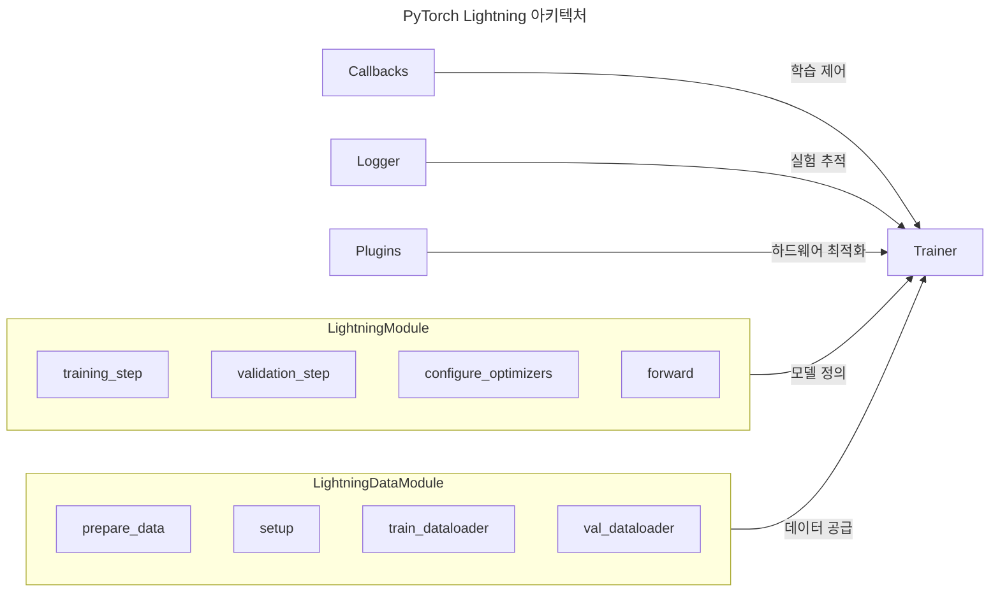
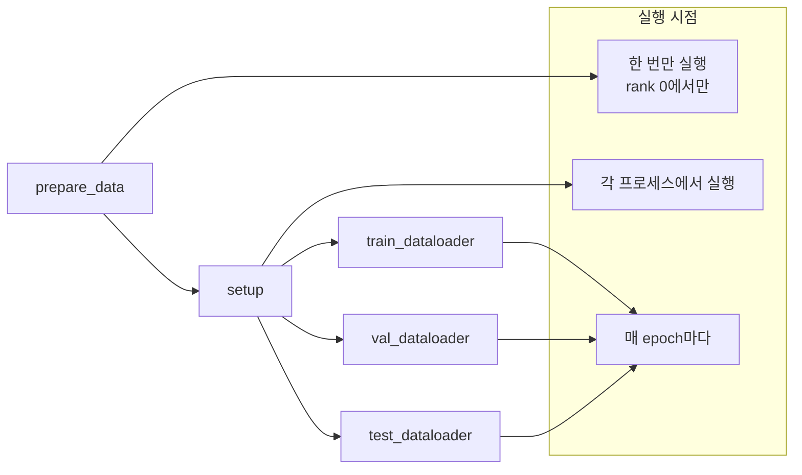
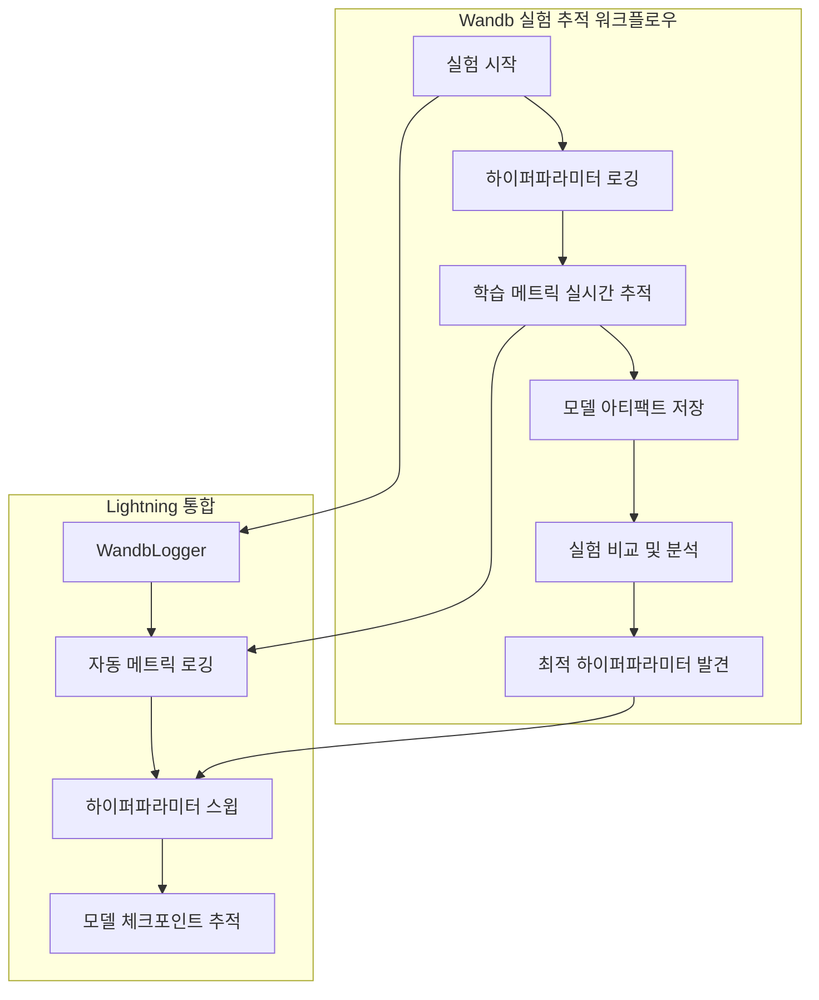
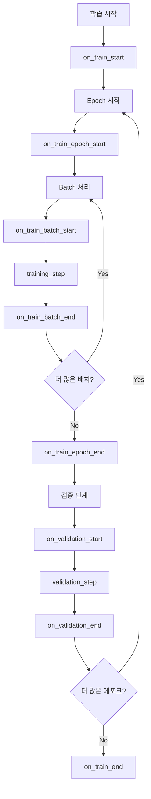

## 📦 사용하는 python package

- torch==2.1.0+
- pytorch-lightning==2.1.0+
- transformers==4.35.0+
- datasets==2.14.0+
- wandb==0.15.0+
- tokenizers==0.14.0+
- accelerate==0.24.0+

## 🚀 TL;DR

- **PyTorch Lightning** 은 복잡한 딥러닝 실험을 체계적으로 관리할 수 있는 고수준 프레임워크로, 보일러플레이트 코드를 대폭 줄여준다
- **LightningModule**, **LightningDataModule**, **Trainer**가 핵심 컴포넌트로, 각각 모델 정의, 데이터 처리, 학습 과정을 담당한다
- **HuggingFace Transformers** 와의 완벽한 호환성으로 사전 훈련된 LLM을 쉽게 활용할 수 있다
- **Wandb 통합**을 통해 실험 추적, 하이퍼파라미터 최적화, 모델 성능 비교를 체계적으로 수행할 수 있다
- **멀티 GPU 분산 학습**, **그래디언트 체크포인팅**, **자동 혼합 정밀도** 등 대규모 LLM 학습에 필수적인 기능들을 간단한 설정으로 활용 가능하다
- **콜백 시스템**과 **플러그인 아키텍처**를 통해 학습 과정을 세밀하게 제어하고 확장할 수 있다

## 📓 실습 Jupyter Notebook

- w.i.p.

## ⚡ PyTorch Lightning 이란?

**[PyTorch Lightning](https://lightning.ai/docs/pytorch/stable/starter/introduction.html)** 은 PyTorch 위에 구축된 고수준 프레임워크로, 연구자와 개발자가 복잡한 딥러닝 실험을 보다 체계적이고 재현 가능하게 수행할 수 있도록 설계된 오픈소스 프로젝트다. Lightning의 핵심 철학은 **"과학적 코드와 엔지니어링 코드의 분리"** 이다.

### PyTorch Lightning 의 핵심 가치

PyTorch Lightning 은 딥러닝 연구와 개발에서 반복적으로 나타나는 문제들을 해결하기 위해 만들어졌다. 순수 PyTorch 로 작업할 때 우리는 종종 다음과 같은 보일러플레이트 코드들을 반복해서 작성하게 된다.

**순수 PyTorch에서 반복되는 코드들**

- GPU/CPU 장치 관리 및 텐서 이동
- 분산 학습을 위한 복잡한 설정
- 학습/검증/테스트 루프의 구현
- 체크포인트 저장 및 로딩
- 로깅 및 메트릭 추적
- 그래디언트 누적 및 클리핑

Lightning 은 이러한 엔지니어링 코드들을 프레임워크 내부로 숨기고, 연구자가 **모델 아키텍처와 학습 로직에만 집중**할 수 있도록 해준다.

> PyTorch Lightning을 사용하면 **95%의 보일러플레이트 코드를 제거**하면서도 **PyTorch의 모든 유연성을 유지**할 수 있다. 특히 LLM과 같은 대규모 모델 학습에서 그 가치가 더욱 빛난다.
{: .prompt-tip}

### Lightning vs 순수 PyTorch 비교


Lightning을 사용하지 않을 때와 사용할 때의 차이를 간단히 비교해보면 다음과 같다.

**순수 PyTorch의 일반적인 학습 루프**

```python
# 수백 줄의 복잡한 학습 루프
for epoch in range(num_epochs):
    model.train()
    for batch in train_loader:
        # 장치 이동, 그래디언트 초기화, 순전파, 역전파, 옵티마이저 스텝...
        inputs = batch['input_ids'].to(device)
        labels = batch['labels'].to(device)
        
        optimizer.zero_grad()
        outputs = model(inputs)
        loss = criterion(outputs, labels)
        loss.backward()
        optimizer.step()
        
    # 검증 루프, 메트릭 계산, 로깅...
```

**PyTorch Lightning을 사용한 경우**

```python
# 단 몇 줄로 동일한 기능 구현
trainer = Trainer(max_epochs=num_epochs)
trainer.fit(model, train_loader, val_loader)
```

이러한 간결함은 단순히 코드 길이를 줄이는 것 이상의 의미를 가진다. **오류 가능성 감소**, **재현성 향상**, **확장성 개선** 등의 실질적인 이점을 제공한다.

## 🏗️ PyTorch Lightning 핵심 컴포넌트

PyTorch Lightning의 아키텍처는 관심사의 분리(Separation of Concerns) 원칙에 따라 설계되었다. 각 컴포넌트는 명확한 역할과 책임을 가지며, 이들이 유기적으로 연결되어 전체 학습 파이프라인을 구성한다.



### LightningModule: 모델의 중심

**LightningModule**은 PyTorch의 `nn.Module`을 확장한 클래스로, 모델 아키텍처뿐만 아니라 학습, 검증, 테스트 로직까지 포함한다. 이는 객체지향 프로그래밍의 캡슐화 원칙을 딥러닝에 적용한 것이다.

**LightningModule의 핵심 메서드들**

- **`training_step`**: 단일 학습 배치에 대한 처리 로직 정의
- **`validation_step`**: 검증 중 각 배치 처리 방법 정의
- **`configure_optimizers`**: 옵티마이저와 스케줄러 설정
- **`forward`**: 순전파 로직 (추론 시 사용)

각 메서드는 특정한 시점에 Trainer에 의해 자동으로 호출되며, 개발자는 해당 시점에서 수행되어야 할 로직만 구현하면 된다.

```python
class LLMLightningModule(pl.LightningModule):
    def __init__(self, model_name: str, learning_rate: float = 1e-4):
        super().__init__()
        # HuggingFace 모델 로드
        self.model = AutoModelForCausalLM.from_pretrained(model_name)
        self.tokenizer = AutoTokenizer.from_pretrained(model_name)
        self.learning_rate = learning_rate
        
        # 하이퍼파라미터 자동 저장
        self.save_hyperparameters()
    
    def training_step(self, batch, batch_idx):
        # 학습 스텝 정의 - Trainer가 자동으로 호출
        outputs = self.model(**batch)
        loss = outputs.loss
        
        # 자동 로깅
        self.log('train_loss', loss, prog_bar=True)
        return loss
    
    def validation_step(self, batch, batch_idx):
        # 검증 스텝 정의
        outputs = self.model(**batch)
        loss = outputs.loss
        
        self.log('val_loss', loss, prog_bar=True)
        return loss
    
    def configure_optimizers(self):
        # 옵티마이저 및 스케줄러 설정
        optimizer = torch.optim.AdamW(self.parameters(), lr=self.learning_rate)
        scheduler = torch.optim.lr_scheduler.CosineAnnealingLR(optimizer, T_max=1000)
        
        return {
            "optimizer": optimizer,
            "lr_scheduler": {
                "scheduler": scheduler,
                "monitor": "val_loss"
            }
        }
```

> LightningModule은 단순한 모델 래퍼가 아니라 **완전한 학습 실험의 캡슐화**이다. 모델 아키텍처, 손실 함수, 옵티마이저, 평가 메트릭이 모두 하나의 클래스 안에서 체계적으로 관리된다.
{: .prompt-tip}

### LightningDataModule: 데이터 파이프라인의 표준화

**LightningDataModule** 은 데이터 처리 로직을 모듈화하고 재사용 가능하게 만드는 컴포넌트이다. 데이터 다운로드부터 전처리, 데이터로더 생성까지의 전체 파이프라인을 하나의 클래스로 관리한다.

**LightningDataModule의 생명주기**



```python
class LLMDataModule(pl.LightningDataModule):
    def __init__(self, dataset_name: str, tokenizer_name: str, batch_size: int = 8):
        super().__init__()
        self.dataset_name = dataset_name
        self.tokenizer = AutoTokenizer.from_pretrained(tokenizer_name)
        self.batch_size = batch_size
    
    def prepare_data(self):
        # 데이터 다운로드 (rank 0에서만 실행)
        datasets.load_dataset(self.dataset_name)
    
    def setup(self, stage: str = None):
        # 각 프로세스에서 데이터셋 로드 및 전처리
        if stage == "fit" or stage is None:
            full_dataset = datasets.load_dataset(self.dataset_name)
            
            # 토크나이징 함수
            def tokenize_function(examples):
                return self.tokenizer(
                    examples["text"], 
                    truncation=True, 
                    padding="max_length",
                    max_length=512,
                    return_tensors="pt"
                )
            
            # 데이터셋 분할
            tokenized_dataset = full_dataset.map(tokenize_function, batched=True)
            self.train_dataset = tokenized_dataset["train"]
            self.val_dataset = tokenized_dataset["validation"]
    
    def train_dataloader(self):
        return DataLoader(
            self.train_dataset, 
            batch_size=self.batch_size, 
            shuffle=True,
            num_workers=4
        )
    
    def val_dataloader(self):
        return DataLoader(
            self.val_dataset, 
            batch_size=self.batch_size,
            num_workers=4
        )
```

### Trainer: 학습 과정의 오케스트레이터

**Trainer** 는 PyTorch Lightning의 핵심 컴포넌트로, 전체 학습 과정을 조율하고 관리한다. 개발자가 복잡한 학습 루프를 직접 구현할 필요 없이, 선언적인 방식으로 학습 설정을 정의할 수 있게 해준다.

**Trainer 의 주요 기능들**

- **자동 GPU/TPU 활용**: 사용 가능한 하드웨어 자동 감지 및 활용
- **분산 학습**: 멀티 GPU, 멀티 노드 학습 간단 설정
- **체크포인팅**: 자동 모델 저장 및 복원
- **로깅**: 다양한 로거와의 통합
- **콜백 시스템**: 학습 과정 커스터마이징

```python
# 기본 학습 설정
trainer = pl.Trainer(
    max_epochs=10,
    accelerator="gpu",
    devices=1,
    precision="16-mixed",  # 자동 혼합 정밀도
    gradient_clip_val=1.0,  # 그래디언트 클리핑
    accumulate_grad_batches=4,  # 그래디언트 누적
    val_check_interval=0.5,  # 검증 주기
    logger=wandb_logger,  # Wandb 로거
    callbacks=[early_stopping, model_checkpoint]  # 콜백 추가
)

# 학습 실행
trainer.fit(model, datamodule)
```

> Trainer는 **100줄 이상의 복잡한 학습 루프를 단 한 줄의 메서드 호출로 대체**한다. 동시에 고급 기능들(분산 학습, 혼합 정밀도, 체크포인팅 등)을 처리한다.
{: .prompt-tip}

### Callbacks: 학습 과정 커스터마이징

**Callback** 은 학습 과정의 특정 시점에 원하는 동작을 추가할 수 있게 해준다. 모델 체크포인트, 조기 종료, 학습률 스케줄링 등이 콜백으로 구현되어 있다.

```python
from pytorch_lightning.callbacks import ModelCheckpoint, EarlyStopping, LearningRateMonitor

# 모델 체크포인트 - 최고 성능 모델 저장
checkpoint_callback = ModelCheckpoint(
    monitor='val_loss',
    dirpath='checkpoints/',
    filename='best-model-{epoch:02d}-{val_loss:.2f}',
    save_top_k=3,
    mode='min'
)

# 조기 종료 - 과적합 방지
early_stop_callback = EarlyStopping(
    monitor='val_loss',
    patience=5,
    mode='min'
)

# 학습률 모니터링
lr_monitor = LearningRateMonitor(logging_interval='step')

# Trainer에 콜백 추가
trainer = Trainer(
    callbacks=[checkpoint_callback, early_stop_callback, lr_monitor]
)
```

### Loggers: 실험 추적

**Logger**는 학습 과정의 메트릭, 하이퍼파라미터, 모델 그래프 등을 기록한다. TensorBoard, WandB, MLflow 등 다양한 로깅 도구를 지원한다.

```python
from pytorch_lightning.loggers import TensorBoardLogger, WandbLogger

# TensorBoard 로거
tb_logger = TensorBoardLogger(
    save_dir='logs/',
    name='my_experiment'
)

# Weights & Biases 로거
wandb_logger = WandbLogger(
    project='my_project',
    name='experiment_1'
)

# 여러 로거 동시 사용
trainer = Trainer(
    logger=[tb_logger, wandb_logger]
)
```


## 🤖 LLM 모델링과 PyTorch Lightning

Large Language Model(LLM) 학습은 일반적인 딥러닝 모델과 비교했을 때 몇 가지 독특한 특성과 도전 과제를 가진다. PyTorch Lightning 은 이러한 LLM 특성에 맞춤화된 기능들을 제공한다.

### LLM 학습의 특수성

**메모리 효율성의 중요성** LLM은 수십억 개의 매개변수를 가지므로 메모리 사용량이 매우 크다. 

이를 위해 다음과 같은 최적화 기법들이 필요하다.

- **그래디언트 체크포인팅**: 메모리 사용량을 줄이기 위해 일부 중간 활성화를 재계산
- **그래디언트 누적**: 작은 배치로 나누어 처리하여 효과적인 배치 크기 달성
- **혼합 정밀도 학습**: FP16 또는 BF16을 사용하여 메모리 사용량 및 학습 시간 단축

**분산 학습의 필수성** 단일 GPU로는 대규모 LLM을 학습하기 어려우므로 분산 학습이 필수적이다.

- **데이터 병렬화**: 여러 GPU에서 동일한 모델로 서로 다른 배치 처리
- **모델 병렬화**: 모델을 여러 GPU에 분할하여 배치
- **파이프라인 병렬화**: 모델을 레이어별로 분할하여 파이프라인 처리

### HuggingFace 와 Lightning 통합

HuggingFace Transformers 라이브러리는 사전 훈련된 LLM 을 쉽게 활용할 수 있게 해주며, PyTorch Lightning 과 완벽하게 호환된다.

```python
class HuggingFaceLLM(pl.LightningModule):
    def __init__(
        self, 
        model_name: str = "gpt2",
        learning_rate: float = 5e-5,
        warmup_steps: int = 1000,
        max_steps: int = 10000
    ):
        super().__init__()
        self.save_hyperparameters()
        
        # HuggingFace 모델 및 토크나이저 로드
        self.model = AutoModelForCausalLM.from_pretrained(
            model_name,
            torch_dtype=torch.float16,  # 메모리 효율성을 위한 FP16
            use_cache=False  # 그래디언트 체크포인팅과 호환성
        )
        self.tokenizer = AutoTokenizer.from_pretrained(model_name)
        
        # 패딩 토큰 설정
        if self.tokenizer.pad_token is None:
            self.tokenizer.pad_token = self.tokenizer.eos_token
    
    def training_step(self, batch, batch_idx):
        # 언어 모델링 손실 계산
        outputs = self.model(
            input_ids=batch['input_ids'],
            attention_mask=batch['attention_mask'],
            labels=batch['input_ids']  # 자기 지도 학습
        )
        
        loss = outputs.loss
        
        # 학습 메트릭 로깅
        self.log('train_loss', loss, on_step=True, on_epoch=True, prog_bar=True)
        self.log('train_ppl', torch.exp(loss), on_step=True, on_epoch=True)
        
        return loss
    
    def validation_step(self, batch, batch_idx):
        # 검증 손실 계산
        outputs = self.model(
            input_ids=batch['input_ids'],
            attention_mask=batch['attention_mask'],
            labels=batch['input_ids']
        )
        
        val_loss = outputs.loss
        
        # 검증 메트릭 로깅
        self.log('val_loss', val_loss, on_step=False, on_epoch=True, prog_bar=True)
        self.log('val_ppl', torch.exp(val_loss), on_step=False, on_epoch=True)
        
        return val_loss
    
    def configure_optimizers(self):
        # AdamW 옵티마이저 설정 (LLM에 효과적)
        optimizer = torch.optim.AdamW(
            self.parameters(),
            lr=self.hparams.learning_rate,
            betas=(0.9, 0.95),  # LLM에 최적화된 베타 값
            weight_decay=0.1
        )
        
        # 선형 워밍업 및 코사인 감쇠 스케줄러
        scheduler = get_cosine_schedule_with_warmup(
            optimizer,
            num_warmup_steps=self.hparams.warmup_steps,
            num_training_steps=self.hparams.max_steps
        )
        
        return {
            "optimizer": optimizer,
            "lr_scheduler": {
                "scheduler": scheduler,
                "interval": "step",
                "frequency": 1
            }
        }
    
    def on_before_optimizer_step(self, optimizer):
        # 그래디언트 노름 로깅 (LLM 학습 모니터링에 중요)
        grad_norm = torch.nn.utils.clip_grad_norm_(self.parameters(), max_norm=1.0)
        self.log('grad_norm', grad_norm, on_step=True)
```

### 메모리 최적화 전략

LLM 학습에서 메모리 효율성은 성공의 핵심 요소이다. PyTorch Lightning 은 이를 위한 다양한 기능을 제공한다.

```python
# 메모리 효율적인 학습 설정
trainer = pl.Trainer(
    # 혼합 정밀도 학습 (메모리 사용량 50% 감소)
    precision="16-mixed",
    
    # 그래디언트 누적 (효과적인 배치 크기 증가)
    accumulate_grad_batches=8,
    
    # 그래디언트 체크포인팅 활성화
    gradient_clip_val=1.0,
    
    # DeepSpeed 전략 사용 (ZeRO 최적화)
    strategy="deepspeed_stage_2",
    
    # 멀티 GPU 활용
    accelerator="gpu",
    devices=4,
    
    # 콜백 설정
    callbacks=[
        ModelCheckpoint(
            save_top_k=2,
            monitor="val_loss",
            mode="min",
            save_last=True
        ),
        EarlyStopping(
            monitor="val_loss",
            patience=3,
            mode="min"
        )
    ]
)
```

> LLM 학습에서 PyTorch Lightning의 진가는 **복잡한 분산 학습과 메모리 최적화를 투명하게 처리**하면서도 **코드의 가독성과 재현성을 유지**한다는 점이다.
{: .prompt-tip}

## 📊 실험 추적과 Wandb 통합

머신러닝 실험에서 체계적인 추적과 비교는 모델 개선의 핵심이다. 특히 LLM과 같은 대규모 모델에서는 실험 비용이 높기 때문에 효율적인 실험 관리가 더욱 중요하다.

**Weights & Biases(Wandb)** 는 머신러닝 실험 추적 플랫폼으로, PyTorch Lightning과 완벽하게 통합되어 강력한 실험 관리 환경을 제공한다.



### Wandb Logger 설정

```python
import wandb
from pytorch_lightning.loggers import WandbLogger

# Wandb 로거 초기화
wandb_logger = WandbLogger(
    project="llm-experiments",
    name="gpt2-finetuning",
    save_dir="./logs",
    config={
        "architecture": "GPT-2",
        "dataset": "custom_text",
        "learning_rate": 5e-5,
        "batch_size": 8,
        "max_length": 512
    }
)

class LLMWithWandbTracking(pl.LightningModule):
    def __init__(self, *args, **kwargs):
        super().__init__()
        # 모델 초기화 코드...
        
    def training_step(self, batch, batch_idx):
        outputs = self.model(**batch)
        loss = outputs.loss
        
        # 자동으로 Wandb에 로깅됨
        self.log('train_loss', loss, on_step=True, on_epoch=True)
        self.log('learning_rate', self.optimizers().param_groups[0]['lr'])
        
        # 커스텀 메트릭 로깅
        if batch_idx % 100 == 0:
            # 생성 샘플 로깅
            sample_text = self.generate_sample()
            wandb.log({"generated_sample": wandb.Html(sample_text)})
        
        return loss
    
    def validation_step(self, batch, batch_idx):
        outputs = self.model(**batch)
        val_loss = outputs.loss
        
        # 검증 메트릭 로깅
        self.log('val_loss', val_loss, on_epoch=True)
        self.log('val_perplexity', torch.exp(val_loss), on_epoch=True)
        
        return val_loss
    
    def on_validation_epoch_end(self):
        # 에포크 종료 시 추가 메트릭 계산
        if hasattr(self, 'val_outputs'):
            avg_val_loss = torch.stack(self.val_outputs).mean()
            
            # 학습 곡선 시각화
            self.logger.experiment.log({
                "epoch": self.current_epoch,
                "validation_loss_trend": avg_val_loss
            })

# 학습 실행
trainer = pl.Trainer(
    logger=wandb_logger,
    max_epochs=10,
    log_every_n_steps=50,
    # 기타 설정...
)

trainer.fit(model, datamodule)
```

### wandb 기본 설정

먼저 wandb를 설치하고 초기화한다.

```python
# 설치
# pip install wandb

import wandb
from pytorch_lightning.loggers import WandbLogger

# wandb 초기화 (처음 사용시 API 키 입력 필요)
wandb.login()

# WandbLogger 생성
wandb_logger = WandbLogger(
    project="my-lightning-project",     # 프로젝트 이름
    name="experiment-1",                # 실행 이름
    save_dir="./wandb",                 # 로컬 저장 디렉토리
    log_model=True,                     # 모델 체크포인트 자동 업로드
    offline=False,                      # 오프라인 모드
    tags=["baseline", "resnet18"],      # 실험 태그
    notes="Initial baseline experiment"  # 실험 설명
)

# Trainer에 로거 연결
trainer = Trainer(
    max_epochs=10,
    logger=wandb_logger
)
```

### 하이퍼파라미터 로깅

wandb는 모델의 하이퍼파라미터를 자동으로 추적하고 비교할 수 있게 해준다.

```python
class MyModel(pl.LightningModule):
    def __init__(self, learning_rate=1e-3, hidden_dim=128, dropout=0.2):
        super().__init__()
        # 하이퍼파라미터 저장 - wandb가 자동으로 로깅
        self.save_hyperparameters()
        
        # 추가 설정 정보 로깅
        wandb.config.update({
            "architecture": "MLP",
            "dataset": "MNIST",
            "optimizer": "Adam"
        })
        
        self.model = nn.Sequential(
            nn.Linear(784, hidden_dim),
            nn.Dropout(dropout),
            nn.ReLU(),
            nn.Linear(hidden_dim, 10)
        )

# wandb에서 하이퍼파라미터 오버라이드
wandb.init(config={
    "learning_rate": 0.001,
    "hidden_dim": 256,
    "dropout": 0.3
})

model = MyModel(**wandb.config)
```

### 메트릭과 시각화

wandb는 다양한 형태의 데이터를 로깅하고 시각화할 수 있다.

```python
class AdvancedModel(pl.LightningModule):
    def training_step(self, batch, batch_idx):
        x, y = batch
        logits = self(x)
        loss = F.cross_entropy(logits, y)
        
        # 기본 메트릭 로깅
        self.log('train_loss', loss)
        
        # wandb 전용 고급 로깅
        if batch_idx % 100 == 0:
            # 히스토그램 로깅
            wandb.log({
                "gradients": wandb.Histogram(self.fc1.weight.grad.cpu().numpy()),
                "weights": wandb.Histogram(self.fc1.weight.data.cpu().numpy())
            })
            
            # 이미지 로깅
            wandb.log({
                "examples": [wandb.Image(x[i]) for i in range(min(4, len(x)))]
            })
        
        return loss
    
    def validation_epoch_end(self, outputs):
        # 혼동 행렬 생성
        all_preds = []
        all_labels = []
        
        for output in outputs:
            all_preds.extend(output['preds'].cpu().numpy())
            all_labels.extend(output['labels'].cpu().numpy())
        
        # wandb에 혼동 행렬 로깅
        wandb.log({
            "conf_mat": wandb.plot.confusion_matrix(
                probs=None,
                y_true=all_labels,
                preds=all_preds,
                class_names=[str(i) for i in range(10)]
            )
        })
        
    def on_train_epoch_end(self):
        # 커스텀 차트 생성
        epoch_data = [[x, y] for x, y in enumerate(self.train_losses)]
        table = wandb.Table(data=epoch_data, columns=["step", "loss"])
        
        wandb.log({
            "loss_chart": wandb.plot.line(
                table, "step", "loss", title="Training Loss Progress"
            )
        })
```

### 아티팩트 관리

wandb Artifacts를 사용하여 데이터셋, 모델, 결과물을 버전 관리할 수 있다.

```python
# 데이터셋 아티팩트 생성
def create_dataset_artifact():
    artifact = wandb.Artifact('mnist-dataset', type='dataset')
    artifact.add_dir('data/mnist/')
    wandb.log_artifact(artifact)

# 모델 아티팩트 자동 저장
class ModelWithArtifacts(pl.LightningModule):
    def on_train_end(self):
        # 최종 모델을 아티팩트로 저장
        model_artifact = wandb.Artifact(
            f'model-{wandb.run.id}', 
            type='model',
            description='Final trained model',
            metadata={
                'accuracy': self.best_val_acc,
                'epoch': self.current_epoch
            }
        )
        model_artifact.add_file('best_model.ckpt')
        wandb.log_artifact(model_artifact)

# 아티팩트 사용
def load_from_artifact(artifact_name):
    artifact = wandb.use_artifact(artifact_name)
    artifact_dir = artifact.download()
    model = MyModel.load_from_checkpoint(f'{artifact_dir}/model.ckpt')
    return model
```

### 하이퍼파라미터 스윕

wandb Sweeps를 사용하여 자동 하이퍼파라미터 튜닝을 수행할 수 있다.

```python
# sweep_config.yaml
sweep_config = {
    'method': 'bayes',  # grid, random, bayes
    'metric': {
        'name': 'val_loss',
        'goal': 'minimize'
    },
    'parameters': {
        'learning_rate': {
            'min': 0.0001,
            'max': 0.1,
            'distribution': 'log_uniform_values'
        },
        'hidden_dim': {
            'values': [64, 128, 256, 512]
        },
        'dropout': {
            'min': 0.1,
            'max': 0.5
        },
        'batch_size': {
            'values': [32, 64, 128]
        }
    }
}

# Sweep 생성
sweep_id = wandb.sweep(sweep_config, project="my-project")

def train_sweep():
    # wandb가 하이퍼파라미터 제공
    wandb.init()
    
    # 하이퍼파라미터로 모델 생성
    model = MyModel(
        learning_rate=wandb.config.learning_rate,
        hidden_dim=wandb.config.hidden_dim,
        dropout=wandb.config.dropout
    )
    
    # 데이터 모듈 생성
    dm = MyDataModule(batch_size=wandb.config.batch_size)
    
    # WandbLogger 자동 생성됨
    trainer = Trainer(
        max_epochs=10,
        logger=WandbLogger()
    )
    
    trainer.fit(model, dm)

# Sweep 실행
wandb.agent(sweep_id, train_sweep, count=50)  # 50개 실험 실행
```

### 실시간 모니터링과 협업

```python
class CollaborativeModel(pl.LightningModule):
    def __init__(self):
        super().__init__()
        # 팀 멤버에게 알림 보내기
        wandb.alert(
            title="Training Started", 
            text=f"New experiment {wandb.run.name} has started"
        )
        
    def on_validation_epoch_end(self):
        # 특정 조건에서 알림
        if self.current_val_acc > 0.95:
            wandb.alert(
                title="High Accuracy Achieved!",
                text=f"Model reached {self.current_val_acc:.2%} accuracy",
                level=wandb.AlertLevel.INFO
            )
            
    def training_step(self, batch, batch_idx):
        # 실시간 메모 추가
        if batch_idx == 0 and self.current_epoch == 5:
            wandb.log({
                "notes": wandb.Html(
                    "<p>Learning rate decay started at epoch 5</p>"
                )
            })
```

### wandb 와 PyTorch Lightning 통합 베스트 프랙티스

```python
class ProductionModel(pl.LightningModule):
    def __init__(self, config):
        super().__init__()
        self.save_hyperparameters()
        
        # 모델 아키텍처 정의
        self.model = self._build_model(config)
        
        # 메트릭 추적을 위한 버퍼
        self.validation_step_outputs = []
        
    def on_fit_start(self):
        # 코드 저장
        wandb.save('*.py')
        
        # 환경 정보 로깅
        wandb.log({
            "pytorch_version": torch.__version__,
            "cuda_available": torch.cuda.is_available(),
            "gpu_count": torch.cuda.device_count()
        })
        
    def training_step(self, batch, batch_idx):
        loss = self._compute_loss(batch)
        
        # 주기적으로 상세 정보 로깅
        if self.global_step % 100 == 0:
            # 학습률 로깅
            lr = self.optimizers().param_groups[0]['lr']
            self.log('learning_rate', lr)
            
            # 메모리 사용량 로깅
            if torch.cuda.is_available():
                self.log('gpu_memory_used', 
                        torch.cuda.memory_allocated() / 1024**3)
                
        return loss
    
    def validation_step(self, batch, batch_idx):
        # 예측 결과 수집
        x, y = batch
        preds = self(x)
        
        # 첫 배치의 예시 저장
        if batch_idx == 0:
            # 예측 시각화
            fig = self._create_prediction_figure(x[:8], y[:8], preds[:8])
            wandb.log({"predictions": wandb.Image(fig)})
            
        self.validation_step_outputs.append({
            'preds': preds,
            'labels': y
        })
        
    def on_validation_epoch_end(self):
        # 에폭 레벨 메트릭 계산
        all_preds = torch.cat([x['preds'] for x in self.validation_step_outputs])
        all_labels = torch.cat([x['labels'] for x in self.validation_step_outputs])
        
        # 다양한 메트릭 계산 및 로깅
        metrics = self._calculate_metrics(all_preds, all_labels)
        wandb.log(metrics)
        
        # 정리
        self.validation_step_outputs.clear()
        
    def configure_optimizers(self):
        # 옵티마이저 설정을 wandb config에서 가져오기
        optimizer = torch.optim.AdamW(
            self.parameters(),
            lr=wandb.config.learning_rate,
            weight_decay=wandb.config.weight_decay
        )
        
        scheduler = torch.optim.lr_scheduler.CosineAnnealingLR(
            optimizer,
            T_max=wandb.config.max_epochs
        )
        
        return {
            'optimizer': optimizer,
            'lr_scheduler': scheduler,
            'monitor': 'val_loss'
        }

# 통합 실행 예시
if __name__ == "__main__":
    # wandb 실행 초기화
    wandb.init(
        project="lightning-wandb-integration",
        config={
            "learning_rate": 0.001,
            "weight_decay": 0.01,
            "max_epochs": 50,
            "batch_size": 64
        }
    )
    
    # 모델과 데이터 준비
    model = ProductionModel(wandb.config)
    datamodule = MyDataModule(batch_size=wandb.config.batch_size)
    
    # Trainer 설정
    trainer = Trainer(
        max_epochs=wandb.config.max_epochs,
        logger=WandbLogger(log_model='all'),  # 모든 체크포인트 저장
        callbacks=[
            ModelCheckpoint(
                monitor='val_loss',
                save_top_k=3,
                mode='min'
            ),
            EarlyStopping(
                monitor='val_loss',
                patience=5
            )
        ]
    )
    
    # 학습 실행
    trainer.fit(model, datamodule)
    
    # 최종 테스트
    trainer.test(model, datamodule)
    
    # wandb 종료
    wandb.finish()
```

> Wandb와 Lightning의 통합은 단순한 로깅을 넘어서 **실험의 전체 생명주기 관리**를 가능하게 한다. 하이퍼파라미터 최적화부터 모델 버전 관리까지 모든 것이 자동화된다.
{: .prompt-tip}

## 🎛️ Callback System

PyTorch Lightning 의 콜백 시스템은 학습 과정의 특정 시점에서 커스텀 로직을 실행할 수 있게 해주는 강력한 메커니즘이다. 이를 통해 모델 저장, 조기 종료, 학습률 스케줄링 등을 세밀하게 제어할 수 있다.

### 콜백 시스템의 동작 원리



### 커스텀 콜백 구현

LLM 학습에 특화된 커스텀 콜백을 구현해보자.

```python
class LLMGenerationCallback(pl.Callback):
    """LLM 학습 중 주기적으로 텍스트 생성 샘플을 확인하는 콜백"""
    
    def __init__(self, prompt_texts: List[str], generation_interval: int = 1000):
        self.prompt_texts = prompt_texts
        self.generation_interval = generation_interval
    
    def on_train_batch_end(self, trainer, pl_module, outputs, batch, batch_idx):
        # 지정된 간격마다 텍스트 생성
        if batch_idx % self.generation_interval == 0:
            pl_module.eval()
            
            with torch.no_grad():
                for i, prompt in enumerate(self.prompt_texts):
                    # 토크나이징
                    inputs = pl_module.tokenizer(
                        prompt, 
                        return_tensors="pt",
                        padding=True
                    ).to(pl_module.device)
                    
                    # 텍스트 생성
                    outputs = pl_module.model.generate(
                        **inputs,
                        max_new_tokens=100,
                        do_sample=True,
                        temperature=0.7,
                        pad_token_id=pl_module.tokenizer.eos_token_id
                    )
                    
                    # 생성된 텍스트 디코딩
                    generated_text = pl_module.tokenizer.decode(
                        outputs[0], skip_special_tokens=True
                    )
                    
                    # Wandb에 로깅
                    if trainer.logger:
                        trainer.logger.experiment.log({
                            f"generated_sample_{i}": wandb.Html(f"<p><strong>Prompt:</strong> {prompt}</p><p><strong>Generated:</strong> {generated_text}</p>"),
                            "global_step": trainer.global_step
                        })
            
            pl_module.train()

class ModelComplexityCallback(pl.Callback):
    """모델의 복잡성과 메모리 사용량을 추적하는 콜백"""
    
    def on_train_start(self, trainer, pl_module):
        # 모델 파라미터 수 계산
        total_params = sum(p.numel() for p in pl_module.parameters())
        trainable_params = sum(p.numel() for p in pl_module.parameters() if p.requires_grad)
        
        print(f"Total parameters: {total_params:,}")
        print(f"Trainable parameters: {trainable_params:,}")
        
        # Wandb에 모델 정보 로깅
        if trainer.logger:
            trainer.logger.experiment.config.update({
                "total_parameters": total_params,
                "trainable_parameters": trainable_params,
                "model_size_mb": total_params * 4 / (1024 * 1024)  # 대략적인 크기 (FP32 기준)
            })
    
    def on_train_batch_end(self, trainer, pl_module, outputs, batch, batch_idx):
        # GPU 메모리 사용량 모니터링
        if batch_idx % 100 == 0 and torch.cuda.is_available():
            memory_allocated = torch.cuda.memory_allocated() / (1024 ** 3)  # GB 단위
            memory_reserved = torch.cuda.memory_reserved() / (1024 ** 3)
            
            if trainer.logger:
                trainer.logger.experiment.log({
                    "gpu_memory_allocated_gb": memory_allocated,
                    "gpu_memory_reserved_gb": memory_reserved,
                    "global_step": trainer.global_step
                })
```

### 고급 체크포인팅 전략

LLM 학습에서는 체크포인팅 전략이 매우 중요하다. 학습 시간이 길고 비용이 높기 때문에 효율적인 모델 저장과 복원이 필요하다.

```python
# 다중 조건 체크포인팅
best_checkpoint = ModelCheckpoint(
    dirpath="checkpoints/best",
    filename="best-{epoch:02d}-{val_loss:.2f}",
    monitor="val_loss",
    mode="min",
    save_top_k=3,
    save_last=True,
    auto_insert_metric_name=False
)

# 주기적 체크포인팅
periodic_checkpoint = ModelCheckpoint(
    dirpath="checkpoints/periodic",
    filename="periodic-{epoch:02d}-{step}",
    every_n_train_steps=5000,  # 5000 스텝마다 저장
    save_top_k=-1  # 모든 체크포인트 보존
)

# 조기 종료 설정
early_stopping = EarlyStopping(
    monitor="val_loss",
    min_delta=0.001,
    patience=5,
    verbose=True,
    mode="min"
)

# 학습률 모니터링
lr_monitor = LearningRateMonitor(logging_interval="step")

# 모든 콜백을 포함한 트레이너 설정
trainer = pl.Trainer(
    max_epochs=50,
    accelerator="gpu",
    devices=4,
    strategy="ddp",  # 분산 데이터 병렬
    precision="16-mixed",
    gradient_clip_val=1.0,
    accumulate_grad_batches=4,
    val_check_interval=0.25,  # 에포크의 1/4마다 검증
    logger=wandb_logger,
    callbacks=[
        best_checkpoint,
        periodic_checkpoint,
        early_stopping,
        lr_monitor,
        LLMGenerationCallback(["Once upon a time", "The future of AI"]),
        ModelComplexityCallback()
    ]
)
```


## 🎯 다양한 학습 시나리오

### 처음부터 모델 학습하기

가장 기본적인 시나리오로, 랜덤 초기화된 가중치에서 시작하여 모델을 학습한다.

```python
import pytorch_lightning as pl
from torchvision import datasets, transforms
from torch.utils.data import DataLoader
import torch.nn as nn
import torch.nn.functional as F

# 1. 모델 정의
class SimpleClassifier(pl.LightningModule):
    def __init__(self, num_classes=10):
        super().__init__()
        self.conv1 = nn.Conv2d(1, 32, 3, 1)
        self.conv2 = nn.Conv2d(32, 64, 3, 1)
        self.dropout1 = nn.Dropout(0.25)
        self.dropout2 = nn.Dropout(0.5)
        self.fc1 = nn.Linear(9216, 128)
        self.fc2 = nn.Linear(128, num_classes)
        
        # 메트릭 저장용
        self.train_acc = []
        self.val_acc = []
        
    def forward(self, x):
        x = self.conv1(x)
        x = F.relu(x)
        x = self.conv2(x)
        x = F.relu(x)
        x = F.max_pool2d(x, 2)
        x = self.dropout1(x)
        x = torch.flatten(x, 1)
        x = self.fc1(x)
        x = F.relu(x)
        x = self.dropout2(x)
        x = self.fc2(x)
        return F.log_softmax(x, dim=1)
    
    def training_step(self, batch, batch_idx):
        x, y = batch
        logits = self(x)
        loss = F.nll_loss(logits, y)
        
        # 정확도 계산
        pred = logits.argmax(dim=1)
        acc = (pred == y).float().mean()
        
        # 로깅
        self.log('train_loss', loss, prog_bar=True)
        self.log('train_acc', acc, prog_bar=True)
        
        return loss
    
    def validation_step(self, batch, batch_idx):
        x, y = batch
        logits = self(x)
        loss = F.nll_loss(logits, y)
        
        # 정확도 계산
        pred = logits.argmax(dim=1)
        acc = (pred == y).float().mean()
        
        # 로깅
        self.log('val_loss', loss, prog_bar=True)
        self.log('val_acc', acc, prog_bar=True)
        
    def configure_optimizers(self):
        optimizer = torch.optim.AdamW(self.parameters(), lr=1e-3, weight_decay=0.01)
        scheduler = torch.optim.lr_scheduler.CosineAnnealingLR(optimizer, T_max=10)
        return {
            'optimizer': optimizer,
            'lr_scheduler': {
                'scheduler': scheduler,
                'monitor': 'val_loss'
            }
        }

# 2. 데이터 준비
transform = transforms.Compose([
    transforms.ToTensor(),
    transforms.Normalize((0.1307,), (0.3081,))
])

train_dataset = datasets.MNIST('data/', train=True, download=True, transform=transform)
val_dataset = datasets.MNIST('data/', train=False, transform=transform)

train_loader = DataLoader(train_dataset, batch_size=64, shuffle=True, num_workers=4)
val_loader = DataLoader(val_dataset, batch_size=64, num_workers=4)

# 3. 학습 실행
model = SimpleClassifier()

trainer = pl.Trainer(
    max_epochs=10,
    accelerator='gpu' if torch.cuda.is_available() else 'cpu',
    callbacks=[
        ModelCheckpoint(monitor='val_acc', mode='max'),
        EarlyStopping(monitor='val_loss', patience=3)
    ]
)

trainer.fit(model, train_loader, val_loader)

# 4. 테스트
test_results = trainer.test(model, val_loader)
print(f"Test Accuracy: {test_results[0]['val_acc']:.4f}")
```

### 사전학습 모델 활용하기 (Transfer Learning)

사전학습된 모델을 가져와서 새로운 태스크에 맞게 파인튜닝하는 방법이다. 특히 데이터가 적을 때 효과적이다.

```python
import torchvision.models as models
from torchmetrics import Accuracy

class PretrainedClassifier(pl.LightningModule):
    def __init__(self, num_classes=10, learning_rate=1e-3):
        super().__init__()
        self.save_hyperparameters()
        
        # 사전학습된 ResNet18 로드
        self.backbone = models.resnet18(pretrained=True)
        
        # 백본 가중치 고정 (선택사항)
        for param in self.backbone.parameters():
            param.requires_grad = False
            
        # 마지막 레이어만 교체
        num_features = self.backbone.fc.in_features
        self.backbone.fc = nn.Linear(num_features, num_classes)
        
        # 메트릭
        self.train_acc = Accuracy(task='multiclass', num_classes=num_classes)
        self.val_acc = Accuracy(task='multiclass', num_classes=num_classes)
        
    def forward(self, x):
        return self.backbone(x)
    
    def training_step(self, batch, batch_idx):
        x, y = batch
        logits = self(x)
        loss = F.cross_entropy(logits, y)
        
        # 메트릭 업데이트
        preds = torch.argmax(logits, dim=1)
        self.train_acc(preds, y)
        
        self.log('train_loss', loss, on_step=True, on_epoch=True)
        self.log('train_acc', self.train_acc, on_step=True, on_epoch=True)
        
        return loss
    
    def validation_step(self, batch, batch_idx):
        x, y = batch
        logits = self(x)
        loss = F.cross_entropy(logits, y)
        
        # 메트릭 업데이트
        preds = torch.argmax(logits, dim=1)
        self.val_acc(preds, y)
        
        self.log('val_loss', loss, on_epoch=True)
        self.log('val_acc', self.val_acc, on_epoch=True)
        
    def configure_optimizers(self):
        # 파인튜닝할 파라미터만 옵티마이저에 전달
        params_to_update = []
        for name, param in self.named_parameters():
            if param.requires_grad:
                params_to_update.append(param)
                
        optimizer = torch.optim.Adam(params_to_update, lr=self.hparams.learning_rate)
        
        # 학습률 스케줄러
        scheduler = torch.optim.lr_scheduler.ReduceLROnPlateau(
            optimizer, 
            mode='min', 
            factor=0.5, 
            patience=2
        )
        
        return {
            'optimizer': optimizer,
            'lr_scheduler': {
                'scheduler': scheduler,
                'monitor': 'val_loss'
            }
        }

# 사용 예시
model = PretrainedClassifier(num_classes=10)
trainer = pl.Trainer(max_epochs=5, accelerator='gpu')
trainer.fit(model, train_loader, val_loader)
```

### 점진적 언프리징 (Gradual Unfreezing)

사전학습 모델을 더 효과적으로 파인튜닝하기 위해 레이어를 점진적으로 언프리징하는 전략이다.

```python
class GradualUnfreezingModel(pl.LightningModule):
    def __init__(self, num_classes=10):
        super().__init__()
        self.backbone = models.resnet50(pretrained=True)
        
        # 초기에는 모든 레이어 고정
        self.freeze_backbone()
        
        # 분류 헤드
        num_features = self.backbone.fc.in_features
        self.backbone.fc = nn.Sequential(
            nn.Linear(num_features, 512),
            nn.ReLU(),
            nn.Dropout(0.5),
            nn.Linear(512, num_classes)
        )
        
        self.unfreeze_epoch = 3  # 3 에폭 후 언프리징 시작
        
    def freeze_backbone(self):
        """백본 네트워크의 모든 파라미터 고정"""
        for param in self.backbone.parameters():
            param.requires_grad = False
            
        # 분류 헤드는 학습 가능하게 유지
        for param in self.backbone.fc.parameters():
            param.requires_grad = True
            
    def unfreeze_layers(self, num_layers):
        """마지막 num_layers개 레이어 언프리징"""
        # ResNet의 레이어 구조: layer1, layer2, layer3, layer4
        layers = [self.backbone.layer4, self.backbone.layer3, 
                 self.backbone.layer2, self.backbone.layer1]
        
        for i in range(min(num_layers, len(layers))):
            for param in layers[i].parameters():
                param.requires_grad = True
                
    def on_train_epoch_start(self):
        """에폭 시작 시 점진적 언프리징"""
        if self.current_epoch == self.unfreeze_epoch:
            print(f"Epoch {self.current_epoch}: Unfreezing layer4")
            self.unfreeze_layers(1)
        elif self.current_epoch == self.unfreeze_epoch + 2:
            print(f"Epoch {self.current_epoch}: Unfreezing layer3")
            self.unfreeze_layers(2)
        elif self.current_epoch == self.unfreeze_epoch + 4:
            print(f"Epoch {self.current_epoch}: Unfreezing all layers")
            for param in self.backbone.parameters():
                param.requires_grad = True
                
    def configure_optimizers(self):
        # 학습 가능한 파라미터만 옵티마이저에 전달
        params = filter(lambda p: p.requires_grad, self.parameters())
        
        optimizer = torch.optim.Adam(params, lr=1e-3)
        scheduler = torch.optim.lr_scheduler.StepLR(optimizer, step_size=5, gamma=0.1)
        
        return [optimizer], [scheduler]
```

### 모델 앙상블 구현

여러 모델을 함께 학습하고 예측을 결합하는 앙상블 방법이다.

```python
class EnsembleModel(pl.LightningModule):
    def __init__(self, model_configs, num_classes=10):
        super().__init__()
        self.models = nn.ModuleList()
        
        # 다양한 아키텍처의 모델들 생성
        for config in model_configs:
            if config['type'] == 'resnet18':
                model = models.resnet18(pretrained=True)
                model.fc = nn.Linear(model.fc.in_features, num_classes)
            elif config['type'] == 'efficientnet':
                model = models.efficientnet_b0(pretrained=True)
                model.classifier[1] = nn.Linear(model.classifier[1].in_features, num_classes)
            elif config['type'] == 'mobilenet':
                model = models.mobilenet_v2(pretrained=True)
                model.classifier[1] = nn.Linear(model.classifier[1].in_features, num_classes)
                
            self.models.append(model)
            
        # 앙상블 가중치 (학습 가능)
        self.ensemble_weights = nn.Parameter(torch.ones(len(self.models)))
        
    def forward(self, x):
        # 각 모델의 예측 수집
        outputs = []
        for model in self.models:
            outputs.append(model(x))
            
        # 가중 평균으로 결합
        weights = F.softmax(self.ensemble_weights, dim=0)
        ensemble_output = torch.zeros_like(outputs[0])
        
        for i, output in enumerate(outputs):
            ensemble_output += weights[i] * output
            
        return ensemble_output
    
    def training_step(self, batch, batch_idx):
        x, y = batch
        
        # 개별 모델 손실 계산
        individual_losses = []
        for model in self.models:
            output = model(x)
            loss = F.cross_entropy(output, y)
            individual_losses.append(loss)
            
        # 앙상블 예측 및 손실
        ensemble_output = self(x)
        ensemble_loss = F.cross_entropy(ensemble_output, y)
        
        # 전체 손실 = 앙상블 손실 + 개별 손실의 평균
        total_loss = ensemble_loss + 0.1 * sum(individual_losses) / len(individual_losses)
        
        # 로깅
        self.log('train_loss', total_loss)
        self.log('ensemble_loss', ensemble_loss)
        
        return total_loss
    
    def configure_optimizers(self):
        # 다른 학습률 적용
        param_groups = [
            {'params': self.ensemble_weights, 'lr': 0.01},
            {'params': self.models.parameters(), 'lr': 0.001}
        ]
        
        optimizer = torch.optim.Adam(param_groups)
        return optimizer

# 사용 예시
model_configs = [
    {'type': 'resnet18'},
    {'type': 'efficientnet'},
    {'type': 'mobilenet'}
]

ensemble = EnsembleModel(model_configs, num_classes=10)
trainer = pl.Trainer(max_epochs=10)
trainer.fit(ensemble, train_loader, val_loader)
```

## 🚀 고급 기능 활용

### 분산 학습 설정

PyTorch Lightning은 다양한 분산 학습 전략을 간단한 설정으로 지원한다.

```python
# 데이터 병렬 처리 (DP)
trainer = Trainer(
    accelerator='gpu',
    devices=4,
    strategy='dp'  # 단일 노드, 다중 GPU
)

# 분산 데이터 병렬 처리 (DDP)
trainer = Trainer(
    accelerator='gpu',
    devices=4,
    strategy='ddp',  # 더 빠르고 확장성 있음
    num_nodes=2      # 멀티 노드 지원
)

# DeepSpeed 통합
trainer = Trainer(
    accelerator='gpu',
    devices=4,
    strategy='deepspeed',
    precision=16
)

# 모델 병렬 처리를 위한 커스텀 설정
class ModelParallelModule(pl.LightningModule):
    def __init__(self):
        super().__init__()
        # 모델을 여러 GPU에 분할
        self.layer1 = nn.Linear(1000, 1000).to('cuda:0')
        self.layer2 = nn.Linear(1000, 1000).to('cuda:1')
        
    def forward(self, x):
        x = self.layer1(x.to('cuda:0'))
        x = self.layer2(x.to('cuda:1'))
        return x
```

### 커스텀 학습 루프

특별한 학습 방법이 필요한 경우 학습 루프를 커스터마이징할 수 있다.

```python
class CustomTrainingLoop(pl.LightningModule):
    def __init__(self):
        super().__init__()
        self.automatic_optimization = False  # 자동 최적화 비활성화
        
    def training_step(self, batch, batch_idx):
        opt = self.optimizers()
        
        # 여러 번의 최적화 스텝
        for i in range(3):
            # Forward pass
            loss = self.compute_loss(batch)
            
            # Manual backward
            self.manual_backward(loss)
            
            # Gradient clipping
            self.clip_gradients(opt, gradient_clip_val=0.5, gradient_clip_algorithm="norm")
            
            # Update
            opt.step()
            opt.zero_grad()
            
        # 로깅
        self.log('train_loss', loss)
```

### 메모리 최적화 기법

대규모 모델 학습 시 메모리를 효율적으로 사용하는 방법이다.

```python
# 그래디언트 체크포인팅
class MemoryEfficientModel(pl.LightningModule):
    def __init__(self):
        super().__init__()
        self.model = models.resnet152()
        
        # 그래디언트 체크포인팅 활성화
        self.model = torch.utils.checkpoint_checkpoint_sequential(
            self.model, 
            segments=4
        )
        
# 혼합 정밀도 학습
trainer = Trainer(
    precision=16,  # FP16 사용
    amp_backend='native'  # PyTorch native AMP
)

# 그래디언트 누적
trainer = Trainer(
    accumulate_grad_batches=4,  # 4배치마다 업데이트
    precision=16
)
```

## 📚 실무 활용 팁

### 실험 관리

```python
# 하이퍼파라미터 저장
class ExperimentModel(pl.LightningModule):
    def __init__(self, learning_rate=1e-3, hidden_dim=128, dropout=0.2):
        super().__init__()
        self.save_hyperparameters()  # 자동으로 하이퍼파라미터 저장
        
        # self.hparams.learning_rate로 접근 가능
        self.model = nn.Sequential(
            nn.Linear(784, self.hparams.hidden_dim),
            nn.Dropout(self.hparams.dropout),
            nn.Linear(self.hparams.hidden_dim, 10)
        )

# 체크포인트에서 모델 로드
model = ExperimentModel.load_from_checkpoint(
    'checkpoints/best_model.ckpt',
    learning_rate=0.001  # 하이퍼파라미터 오버라이드 가능
)
```

### 프로덕션 배포

```python
# 모델을 ONNX로 내보내기
model.to_onnx('model.onnx', dummy_input, export_params=True)

# TorchScript로 변환
script = model.to_torchscript()
torch.jit.save(script, "model.pt")

# 추론 모드
model.eval()
model.freeze()  # 파라미터와 배치정규화 고정

with torch.no_grad():
    predictions = model(input_data)
```

> PyTorch Lightning 을 마스터하면 딥러닝 프로젝트의 개발 속도를 크게 향상시킬 수 있다. 표준화된 구조와 풍부한 기능을 통해 연구에서 프로덕션까지 일관된 워크플로우를 구축할 수 있다.
{: .prompt-tip}