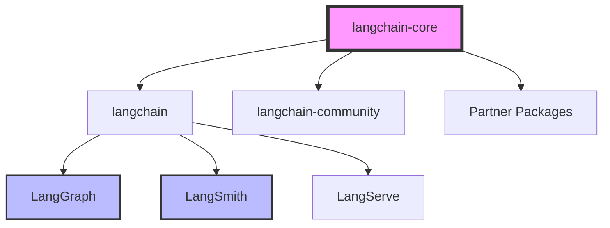
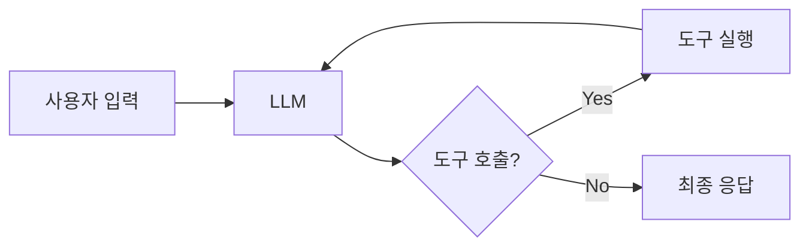

## 📦 사용하는 python package

- W.I.P.

## 🚀 TL;DR

- **LangChain**은 LLM 애플리케이션 개발을 위한 오픈소스 프레임워크로, 복잡한 AI 워크플로우를 체인처럼 연결하는 개념에서 이름이 유래했다
- **LCEL (LangChain Expression Language)**이 핵심으로, 파이프(`|`) 연산자를 통해 컴포넌트를 직관적으로 연결한다
- **Runnable 인터페이스**가 모든 컴포넌트의 기반이 되어 표준화된 방식으로 체인을 구성할 수 있다
- **langchain-core**, **langchain**, **langchain-community**, **partner packages**로 모듈화되어 있어 필요한 것만 선택적으로 사용 가능하다
- **LangGraph**로 복잡한 에이전트와 상태 관리가 필요한 애플리케이션을, **LangSmith**로 모니터링과 디버깅을 수행한다
- 단순한 LLM 호출부터 복잡한 멀티 에이전트 시스템까지, 개발 복잡도에 따라 적절한 도구를 선택하는 것이 중요하다
- 실제 프로덕션에서는 LinkedIn, Uber, Klarna 등 대기업들이 LangChain 생태계를 활용해 AI 애플리케이션을 운영하고 있다

## 📓 실습 Jupyter Notebook

- W.I.P.

## 🎯 LangChain이란 무엇인가?

LangChain은 2022년 10월 Harrison Chase가 만든 **LLM 애플리케이션 개발 프레임워크**다. 이름의 유래는 언어 모델(Language Model)과 체인(Chain)의 합성어로, **여러 컴포넌트를 체인처럼 연결해 복잡한 AI 워크플로우를 구성한다**는 핵심 개념을 담고 있다.

마치 유닉스 파이프라인처럼 각 컴포넌트의 출력이 다음 컴포넌트의 입력이 되는 방식으로, 단순한 구성 요소들을 조합해 복잡한 애플리케이션을 만들 수 있다.

### 왜 LangChain이 필요한가?

LLM을 직접 호출하는 것은 간단하지만, 실제 애플리케이션을 만들려면 다음과 같은 복잡한 작업들이 필요하다:

- **프롬프트 관리와 템플릿화**
- **외부 데이터 소스와의 연동** (RAG)
- **다양한 LLM 제공자 간 전환**
- **메모리와 상태 관리**
- **에러 처리와 재시도 로직**
- **스트리밍과 비동기 처리**
- **모니터링과 디버깅**

LangChain은 이 모든 것을 **표준화된 인터페이스**로 제공해, 개발자가 비즈니스 로직에 집중할 수 있도록 한다.

## 🏗️ LangChain 아키텍처: 모듈화된 생태계

LangChain은 처음에는 단일 패키지였지만, 2024년부터 모듈화된 아키텍처로 진화했다:



### langchain-core: 핵심 추상화 계층

모든 것의 기반이 되는 **핵심 인터페이스와 추상화**를 제공한다:

- **BaseChatModel**: 모든 채팅 모델의 기본 인터페이스
- **Runnable**: LCEL의 기반이 되는 실행 가능한 컴포넌트 인터페이스
- **BasePromptTemplate**: 프롬프트 템플릿의 기본 구조
- **Document**: 텍스트와 메타데이터를 담는 기본 데이터 구조

### langchain: 애플리케이션 로직 계층

범용적으로 사용되는 **체인, 에이전트, 검색 전략**을 구현한다:

- **Chains**: 여러 컴포넌트를 연결한 워크플로우
- **Agents**: 도구를 사용해 동적으로 행동을 결정하는 시스템
- **Retrieval**: RAG를 위한 검색 전략

### langchain-community: 커뮤니티 통합

커뮤니티가 관리하는 **서드파티 통합**들:

- 다양한 LLM 제공자 (로컬 모델, 오픈소스 등)
- 벡터 데이터베이스 통합
- 문서 로더와 텍스트 분할기

### Partner Packages: 공식 통합

주요 제공업체와 공동 관리하는 **공식 통합 패키지**:

- `langchain-openai`: OpenAI와 Azure OpenAI
- `langchain-anthropic`: Claude 모델
- `langchain-google-genai`: Google Gemini
- `langchain-aws`: AWS Bedrock

## ⚡ LCEL (LangChain Expression Language): 선언적 체인 구성

LCEL은 LangChain의 **핵심 혁신**으로, 복잡한 체인을 간단한 파이프 연산자(`|`)로 표현할 수 있게 한다.

### 기본 개념: Runnable 인터페이스

모든 LangChain 컴포넌트는 **Runnable 인터페이스**를 구현한다:

```python
# 전통적인 방식 (deprecated)
from langchain.chains import LLMChain
chain = LLMChain(llm=model, prompt=prompt)
result = chain.run(input="Hello")

# LCEL 방식 (권장)
from langchain_core.prompts import ChatPromptTemplate
from langchain_openai import ChatOpenAI

prompt = ChatPromptTemplate.from_template("Translate to Korean: {text}")
model = ChatOpenAI()
chain = prompt | model | StrOutputParser()
result = chain.invoke({"text": "Hello"})
```

### Runnable의 주요 메서드

모든 Runnable은 다음 메서드를 지원한다:

- **invoke()**: 동기 실행
- **ainvoke()**: 비동기 실행
- **stream()**: 스트리밍 출력
- **astream()**: 비동기 스트리밍
- **batch()**: 배치 처리
- **abatch()**: 비동기 배치 처리

### LCEL의 장점

- **직관적인 구성**: 유닉스 파이프처럼 읽기 쉬운 체인 구성
- **자동 스트리밍**: 첫 토큰까지의 시간 최소화
- **병렬 실행**: RunnableParallel로 자동 병렬화
- **타입 안정성**: 입출력 타입 체크
- **자동 추적**: LangSmith와 자동 통합

## 🔧 핵심 컴포넌트와 사용 패턴

### 1. Chat Models: LLM과의 대화

**역할**: LLM과 메시지 기반으로 상호작용하는 기본 컴포넌트

```python
from langchain_openai import ChatOpenAI

# 모델 초기화
model = ChatOpenAI(model="gpt-4", temperature=0)

# 직접 호출 (단순한 경우)
response = model.invoke("Hello, how are you?")

# 도구 바인딩 (함수 호출)
model_with_tools = model.bind_tools(tools=[my_tool])
```

**현업 활용**:

- 단순 질의응답은 직접 호출
- 복잡한 워크플로우는 LCEL로 체인 구성
- 도구 호출이 필요하면 `bind_tools()` 사용

### 2. Prompt Templates: 동적 프롬프트 생성

**역할**: 재사용 가능한 프롬프트 템플릿 관리

```python
from langchain_core.prompts import ChatPromptTemplate

# 간단한 템플릿
prompt = ChatPromptTemplate.from_template(
    "You are a {role}. Answer: {question}"
)

# 복잡한 멀티턴 템플릿
prompt = ChatPromptTemplate.from_messages([
    ("system", "You are a {role}"),
    ("human", "{question}"),
    ("assistant", "I'll help with that."),
    ("human", "{follow_up}")
])
```

**현업 활용**:

- 프롬프트 버전 관리와 A/B 테스팅
- Few-shot 예제 동적 삽입
- 다국어 지원을 위한 템플릿 분리

### 3. Output Parsers: 구조화된 출력

**역할**: LLM 출력을 구조화된 형식으로 변환

```python
from langchain_core.output_parsers import JsonOutputParser
from pydantic import BaseModel

class Response(BaseModel):
    answer: str
    confidence: float

parser = JsonOutputParser(pydantic_object=Response)
chain = prompt | model | parser
# 출력: {"answer": "...", "confidence": 0.95}
```

**현업 활용**:

- API 응답 형식 표준화
- 데이터베이스 저장을 위한 스키마 검증
- 다운스트림 시스템과의 통합

### 4. Retrievers & Vector Stores: RAG 구현

**역할**: 외부 지식을 검색해 LLM에 제공

```python
from langchain_community.vectorstores import Chroma
from langchain_openai import OpenAIEmbeddings

# 벡터 스토어 생성
vectorstore = Chroma.from_documents(
    documents=docs,
    embedding=OpenAIEmbeddings()
)

# 검색기로 변환
retriever = vectorstore.as_retriever(
    search_type="similarity",
    search_kwargs={"k": 5}
)

# RAG 체인 구성
rag_chain = (
    {"context": retriever, "question": RunnablePassthrough()}
    | prompt
    | model
    | parser
)
```

**현업 활용**:

- 기업 내부 문서 검색 시스템
- 실시간 데이터 증강
- 하이브리드 검색 (키워드 + 시맨틱)

## 🤖 에이전트: 동적 의사결정 시스템

에이전트는 LLM이 **도구를 사용해 동적으로 행동을 결정**하는 시스템이다.

### 에이전트 아키텍처



### 현업에서의 에이전트 사용

**간단한 에이전트 (LangChain)**:

- 도구 2-3개를 사용하는 단순 워크플로우
- 선형적인 의사결정 과정
- 예: 날씨 조회 + 일정 확인

**복잡한 에이전트 (LangGraph)**:

- 상태 관리가 필요한 멀티턴 대화
- 조건부 분기와 루프가 있는 워크플로우
- 멀티 에이전트 협업
- 예: 고객 지원 봇, 코드 생성 및 디버깅

## 🎭 LangGraph: 프로덕션급 에이전트 오케스트레이션

LangGraph는 **그래프 기반의 에이전트 프레임워크**로, 복잡한 상태 관리와 워크플로우를 지원한다.

### 언제 LangGraph를 사용하는가?

- **상태 관리**: 대화 기록, 사용자 컨텍스트 유지
- **Human-in-the-loop**: 중요한 결정에 사람 개입
- **멀티 에이전트**: 여러 에이전트 간 협업
- **장기 실행 워크플로우**: 비동기 작업, 재시도 로직

### LangGraph vs LCEL 선택 기준

|상황|권장 도구|
|---|---|
|단일 LLM 호출|직접 호출|
|프롬프트 → LLM → 파서|LCEL|
|조건부 분기, 루프|LangGraph|
|멀티 에이전트 시스템|LangGraph|
|상태 영속성 필요|LangGraph|

## 📊 LangSmith: 관찰가능성과 평가

LangSmith는 **LLM 애플리케이션의 모니터링과 디버깅** 도구다.

### 주요 기능

- **트레이싱**: 모든 LLM 호출과 중간 단계 추적
- **평가**: 성능 메트릭과 품질 평가
- **디버깅**: 실패한 실행 분석
- **데이터셋 관리**: 테스트 데이터 관리

### 현업 활용 패턴

```python
from langsmith import Client

client = Client()

# 자동 트레이싱 (LCEL 사용 시)
chain.invoke({"input": "test"})  # 자동으로 LangSmith에 기록

# 커스텀 평가
def evaluate_response(output, expected):
    return {"accuracy": calculate_accuracy(output, expected)}

client.run_evaluation(
    dataset_name="my_dataset",
    evaluator=evaluate_response
)
```

## 🚀 실전 활용 가이드

### 프로젝트 규모별 접근법

**POC/프로토타입**:

```python
# 빠른 실험을 위한 최소 구성
from langchain_openai import ChatOpenAI
model = ChatOpenAI()
response = model.invoke("Your question")
```

**소규모 애플리케이션**:

```python
# LCEL로 체인 구성
chain = prompt | model | parser
# 기본 RAG 구현
rag_chain = retriever | prompt | model
```

**프로덕션 시스템**:

```python
# LangGraph로 복잡한 워크플로우
# LangSmith로 모니터링
# 에러 처리와 재시도 로직 추가
```

### 성능 최적화 팁

- **스트리밍 활용**: 사용자 경험 개선
- **병렬 처리**: RunnableParallel로 독립적 작업 병렬화
- **캐싱**: 반복 호출 최소화
- **배치 처리**: 대량 데이터 효율적 처리

## 🎯 마치며: LangChain 생태계의 미래

LangChain은 단순한 프레임워크를 넘어 **LLM 애플리케이션 개발의 표준**이 되고 있다. LinkedIn, Uber, Klarna 같은 대기업들이 프로덕션에서 사용하며 그 가치를 입증하고 있다.

**핵심 원칙**:

- **적절한 도구 선택**: 복잡도에 맞는 도구 사용
- **모듈화**: 필요한 컴포넌트만 선택적 사용
- **표준화**: Runnable 인터페이스로 일관된 개발 경험
- **확장성**: POC에서 프로덕션까지 점진적 확장

LangChain의 이름처럼, 작은 컴포넌트들을 체인으로 연결해 강력한 AI 애플리케이션을 만들 수 있다. 이것이 바로 LangChain이 추구하는 **"reasoning을 하는 애플리케이션을 쉽게 만들기"**라는 비전이다.

> LangChain은 계속 진화하고 있다. 최신 문서와 커뮤니티 리소스를 활용해 변화를 따라가는 것이 중요하다. {: .prompt-tip}