## 🚀 TL;DR

- **Data Centric AI**는 모델보다 **데이터 품질 개선**에 집중하는 새로운 AI 개발 패러다임
- 전체 AI 프로젝트의 **80%가 데이터 관련 작업**으로, 데이터 품질이 모델 성능에 결정적 영향
- **Model Centric AI**가 모델 개선에 집중했다면, **Data Centric AI**는 고품질 소량 데이터로 성능 향상
- **파인튜닝**과 **프롬프트 엔지니어링**의 등장으로 데이터 중심 접근법이 더욱 중요해짐
- 미래 트렌드는 **Multilingual**(다국어), **Multimodal**(다양한 데이터 타입), **Synthetic Data**(합성 데이터)
- MLOps에서 데이터 품질 관리와 자동화가 핵심 경쟁력으로 부상

## 🌊 Data Centric AI 전체 파이프라인

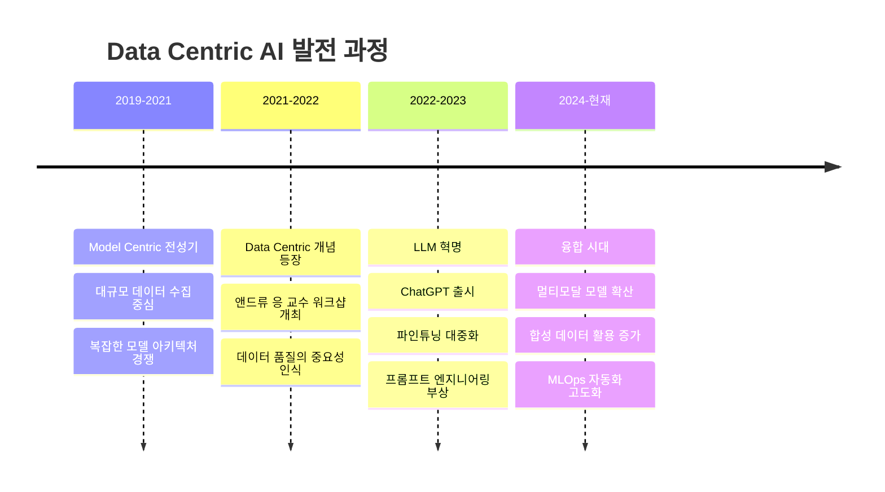

## 🔄 AI 패러다임의 전환: Model Centric에서 Data Centric으로

### AI 시스템의 구성 요소

AI 시스템의 성능을 결정하는 두 가지 핵심 요소가 있다.

- **코드(Code)**: 모델 아키텍처와 알고리즘
- **데이터(Data)**: 학습, 검증, 테스트 데이터

AI 시스템의 성능을 개선하려면 이 두 요소 모두의 개선이 필요하지만, **어떤 요소가 더 큰 영향을 미치는지는 상황에 따라 다르다**.

### 데이터 품질이 모델 성능에 미치는 실제 영향

실제 산업 현장에서 수행된 실험 결과를 살펴보면 데이터의 중요성을 명확히 확인할 수 있다.

|모델 유형|베이스라인 성능|모델 개선 후|데이터 개선 후|데이터 개선 효과|
|---|---|---|---|---|
|철판 결함 탐지|76.2%|76.2% (0%)|93.1% (+16.9%)|**극적 향상**|
|태양전지판 결함 탐지|75.6%|75.64% (+0.04%)|78.6% (+3.0%)|**유의미한 향상**|
|표면 검사|85.05%|85.05% (0%)|85.45% (+0.4%)|포화 상태|

> **핵심 인사이트**: 데이터 품질이 낮을수록 데이터 개선의 효과가 극적으로 나타난다. 이미 고도화된 시스템에서는 데이터와 모델 모두 정교한 최적화가 필요하다.
{: .prompt-tip}

### AI 프로젝트에서 데이터가 차지하는 비중

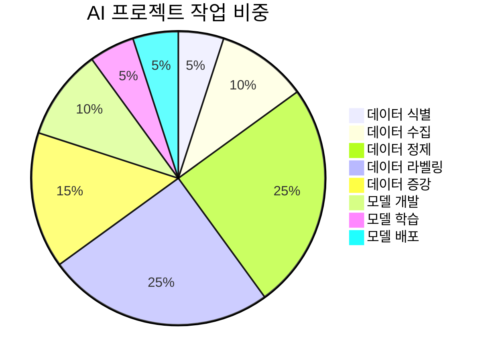

실제 AI 프로젝트에서 **데이터 관련 작업이 전체의 80%** 를 차지한다. 이는 요리에 비유하면 재료 준비와 손질이 실제 요리 시간보다 훨씬 오래 걸리는 것과 같다.

## 🔍 Model Centric AI vs Data Centric AI

### 두 접근법의 핵심 차이점

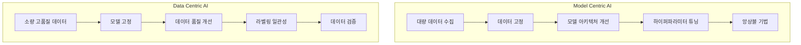

### 학습 방식으로 비유한 차이점

| 구분         | Model Centric AI | Data Centric AI     |
| ---------- | ---------------- | ------------------- |
| **학습 방식**  | 문제은행식 대량 학습      | 고품질 문제 선별 학습        |
| **접근법**    | "많이 풀면 실력이 늘 것"  | "좋은 문제만 풀어서 효율적 학습" |
| **데이터 철학** | 양 > 질            | 질 > 양               |

> 사실 좋은 품질의 데이터를 대량으로 모으려는 것이 실제 현업에서의 접근이지만, 두 접근법을 엄밀히 분리하고자 가장 큰 차이를 이렇게 적었다.
> 
{: .prompt-tip}

### 접근법별 프로세스 비교

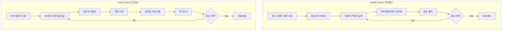

## 🏭 MLOps와 Data Centric AI

### AI 서비스 개발 생명주기

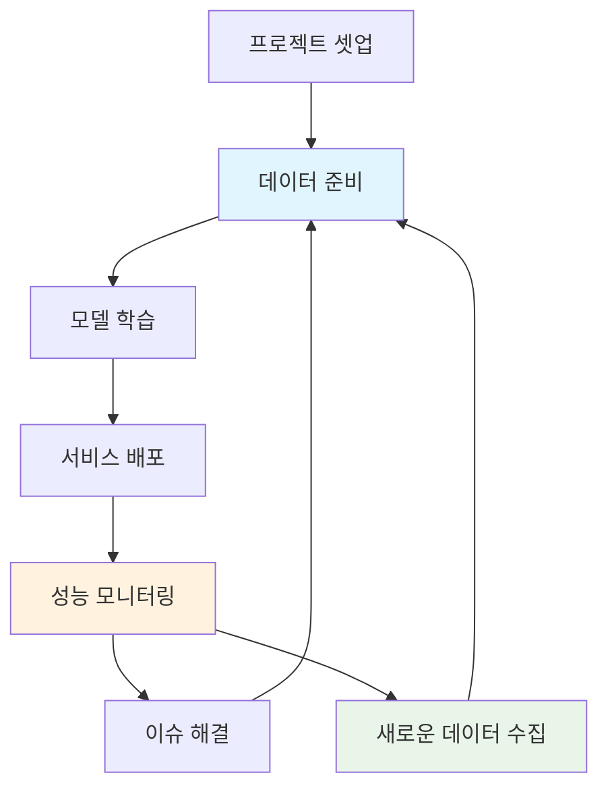

### 서비스 단계별 중요도 변화

|단계|Model Centric|Data Centric|설명|
|---|---|---|---|
|**서비스 출시 전**|50%|50%|모델과 데이터 모두 처음 구축|
|**서비스 출시 후**|20%|80%|기본 요구사항 충족 후 데이터가 더 중요|

> **서비스 출시 후에는 Data Centric AI가 더욱 중요하다**: 이미 최소 요구사항을 만족하는 모델이 배포된 상태에서, 실제 서비스에서 발생하는 엣지 케이스나 성능 이슈는 주로 데이터 개선을 통해 해결된다.
{: .prompt-tip}

### MLOps에서의 데이터 자동화 파이프라인

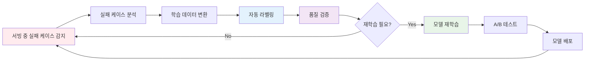

## 🚀 파운데이션 모델 시대의 Data Centric AI

### 대규모 언어모델(LLM)의 등장

2022년 11월 ChatGPT 출시 이후, AI 개발 패러다임에 근본적 변화가 일어났다.

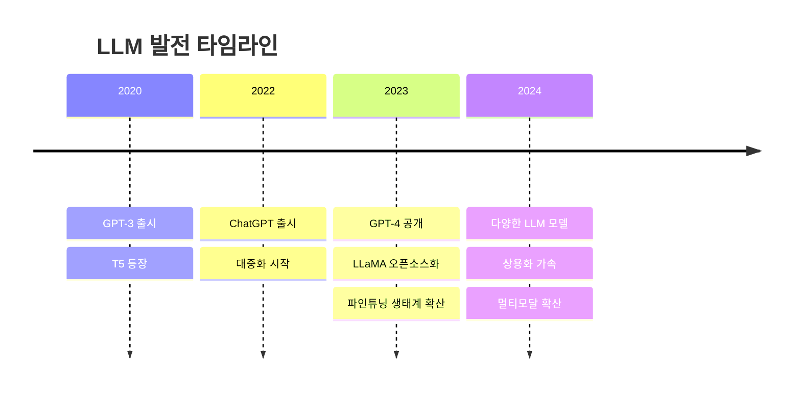

### 파인튜닝 프로세스

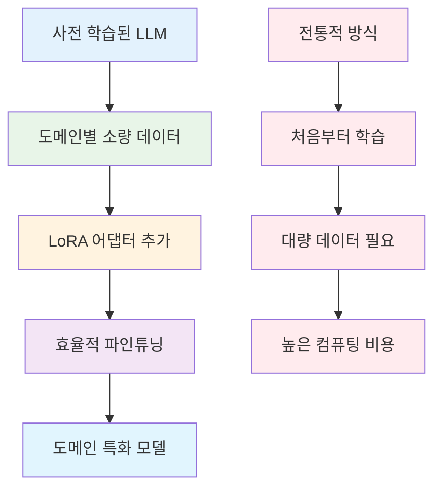

### 프롬프트 엔지니어링의 진화

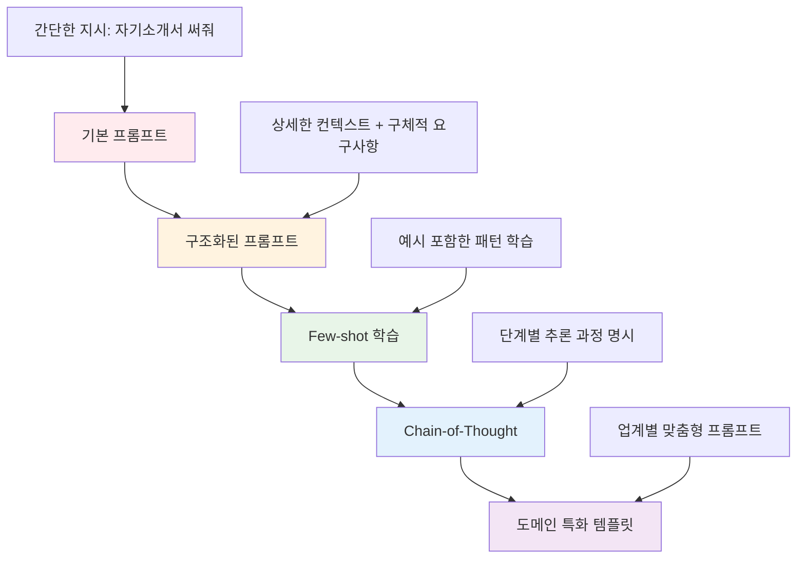

## 🌐 Data Centric AI의 미래 트렌드

### Multilingual 데이터 생태계

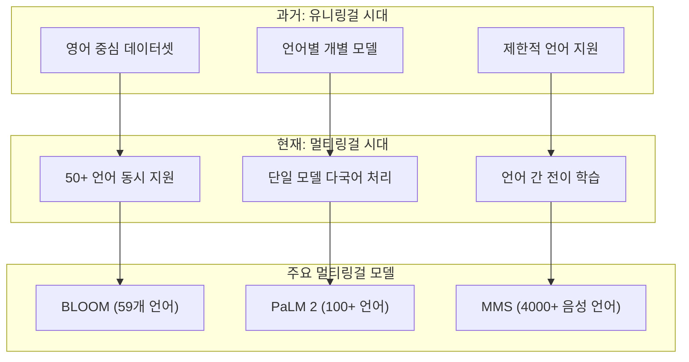

### Multimodal 데이터 처리 파이프라인

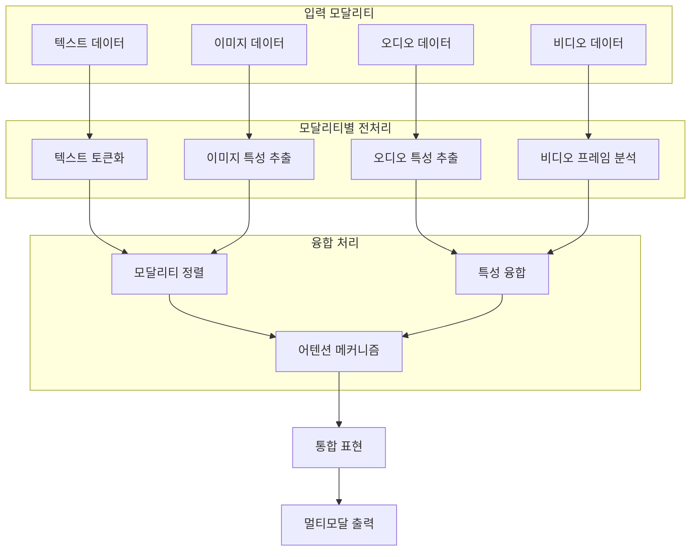

### 합성 데이터(Synthetic Data) 생성 프로세스

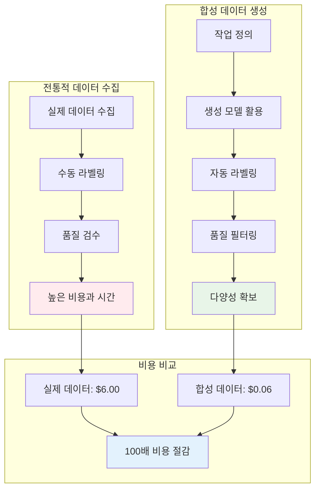

### 합성 데이터 활용 분야

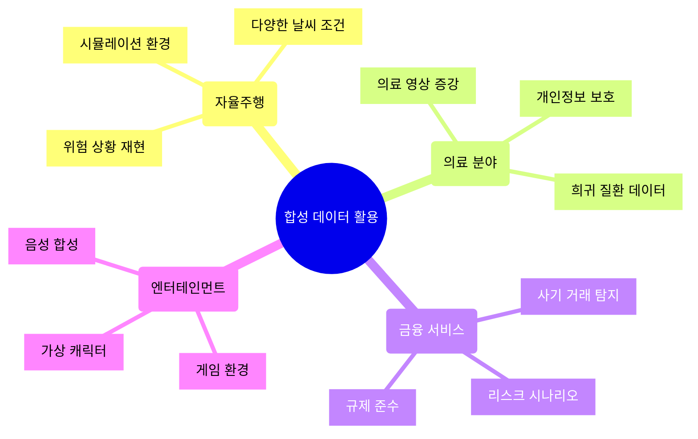

## 🔧 Data Centric AI 핵심 기술들

### 데이터 품질 관리

**데이터 품질 관리**는 원시 데이터를 AI 학습에 적합한 고품질 데이터로 변환하는 체계적인 프로세스다. 이상치 탐지, 중복 제거, 라벨 일관성 검증 등을 통해 데이터의 신뢰성을 확보한다.

- **이상탐지**: 통계적 방법이나 머신러닝을 활용해 정상 분포에서 벗어난 데이터 식별
- **중복 제거**: 동일하거나 유사한 데이터를 찾아 제거하여 학습 편향 방지
- **라벨 일관성**: 여러 작업자가 수행한 라벨링의 일관성을 검증하고 표준화
- **편향성 검사**: 인구통계학적, 지역적, 언어적 편향을 감지하고 균형 조정

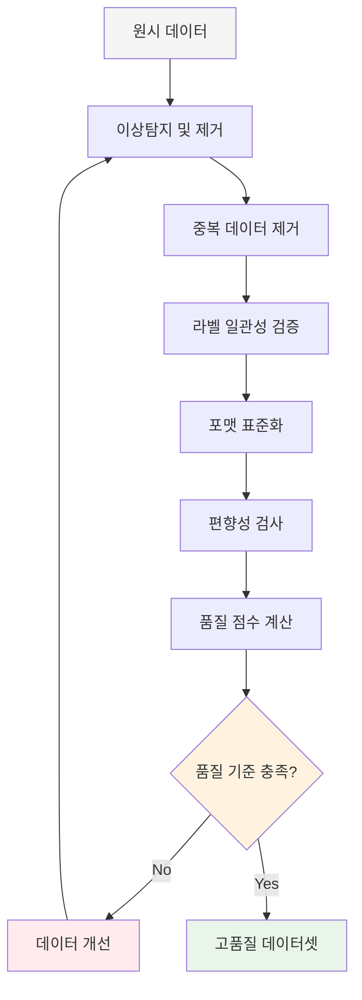

### 액티브 러닝(Active Learning)

**액티브 러닝**은 모델이 가장 학습하기 어려워하는 데이터를 우선적으로 라벨링하여 효율적으로 학습하는 기법이다. 제한된 라벨링 예산으로 최대 성능 향상을 달성할 수 있다.

- **불확실성 기반 선택**: 모델이 가장 확신하지 못하는 샘플을 우선 라벨링
- **엔트로피 방법**: 예측 확률 분포의 엔트로피가 높은 샘플 선택
- **마진 방법**: 1위와 2위 예측 확률 차이가 작은 샘플 선택
- **앙상블 기반**: 여러 모델의 예측 분산이 큰 샘플 선택

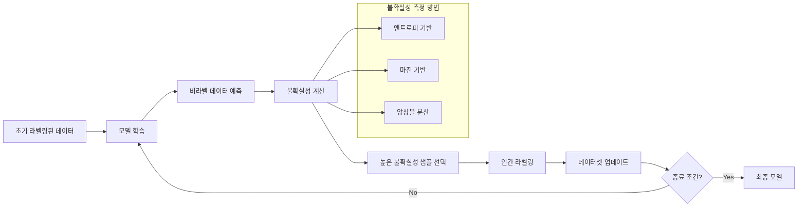

### 커리큘럼 학습(Curriculum Learning)

**커리큘럼 학습**은 인간의 학습 과정을 모방하여 쉬운 데이터부터 어려운 데이터 순으로 점진적으로 학습시키는 방법이다. 학습 안정성과 최종 성능 모두를 향상시킬 수 있다.

- **난이도 측정**: 데이터의 복잡성, 모델 신뢰도, 라벨 품질 등을 종합적으로 평가
- **단계적 학습**: 난이도별로 데이터를 분할하여 순차적으로 학습 진행
- **적응적 조정**: 모델 성능에 따라 다음 단계로의 전환 시점을 동적으로 결정
- **수렴 안정성**: 초기 학습의 안정성을 확보하여 지역 최소값 회피

## 🎯 Data Centric AI 실무 적용 가이드

### 데이터 품질 진단 체크리스트

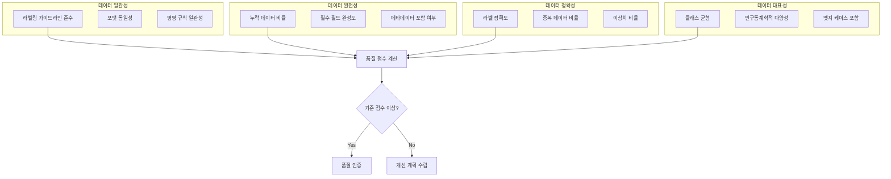

### 단계별 Data Centric AI 도입 전략

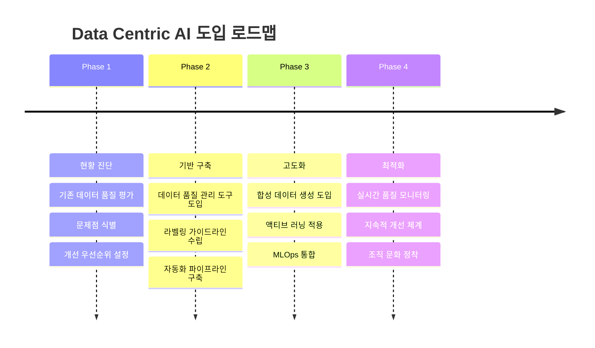

## 🚀 결론: Data Centric AI의 미래

### Data Centric AI 완전 워크플로우

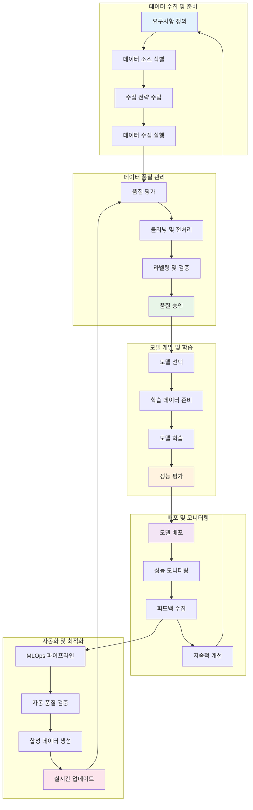

Data Centric AI는 단순한 트렌드가 아닌 **AI 개발의 새로운 표준**이 되고 있다. 

특히 다음과 같은 이유로 그 중요성이 더욱 커지고 있다.

### 핵심 성공 요인들

**1. 품질 중심 사고의 전환**

- 많은 데이터 → 좋은 데이터
- 복잡한 모델 → 검증된 모델 + 고품질 데이터

**2. 자동화와 효율성**

- MLOps를 통한 데이터 파이프라인 자동화
- 합성 데이터를 통한 비용 절감

**3. 개인화와 맞춤화**

- 멀티링걸, 멀티모달 데이터로 글로벌 서비스 지원
- 사용자별 맞춤형 데이터 큐레이션

> **Data Centric AI의 핵심은 "더 많은 데이터"가 아닌 "더 나은 데이터"다.** 앞으로는 데이터의 품질을 체계적으로 관리하고 개선할 수 있는 역량이 AI 프로젝트 성공의 핵심 요소가 될 것이다.
{: .prompt-tip}

### 실무진을 위한 액션 아이템

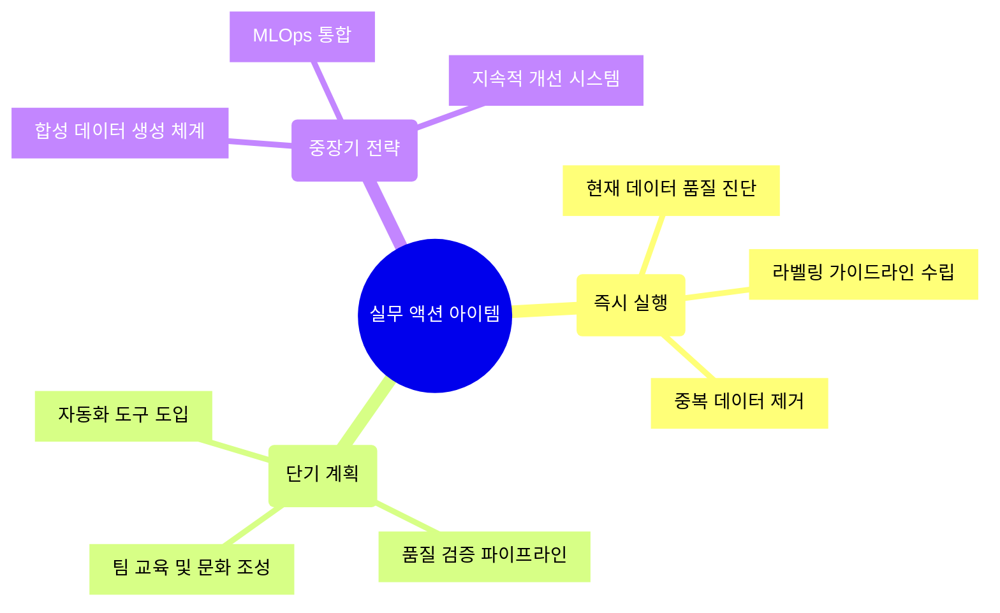

Data Centric AI는 AI의 민주화를 가속화하고, 더 적은 자원으로도 높은 성능의 AI 시스템을 구축할 수 있게 해주는 혁신적 접근법이다. 이제는 선택이 아닌 필수가 된 이 패러다임을 적극적으로 받아들이고 실무에 적용해나가는 것이 중요하다.

> **미래는 데이터를 가장 잘 다루는 조직이 AI 경쟁에서 승리할 것이다.** Data Centric AI는 그 경쟁력의 핵심이며, 지금 시작해야 할 필수 전략이다.
> {: .prompt-warning}