## 🚀 TL;DR

- **데이터 구축 프로세스**는 수집-전처리-라벨링-클렌징-스플릿-릴리즈의 6단계로 구성된다
- **원시 데이터(Raw Data)** → **원천 데이터(Source Data)** → **라벨링 데이터(Labeled Data)** 로 점진적 품질 향상이 핵심이다
- **데이터 스키마 설계**에서 자동화 가능한 부분과 인간이 직접 작업해야 하는 부분을 명확히 구분해야 한다
- **IAA(Inter Annotator Agreement)** 지표를 통해 라벨링 품질을 정량적으로 평가할 수 있다
- 데이터 구축은 **직렬적이지 않은 유연한 프로세스**로, 필요에 따라 이전 단계로 돌아갈 수 있다
- **폭포수 모형**은 대규모 안정적 프로젝트에, **나선형 모형**은 고품질 소량 데이터의 반복적 개선에 적합하다
- 실제 AI 프로젝트에서 **데이터 관련 작업이 전체의 80%** 를 차지하므로 체계적 접근이 필수다

## 🔄 데이터 구축 프로세스 개요

**데이터 구축 프로세스**는 AI 모델 학습을 위한 고품질 데이터셋을 체계적으로 만들어가는 과정이다. 이는 단순히 데이터를 수집하고 정리하는 것을 넘어서, AI 시스템의 성능을 결정하는 핵심 요소가 된다.

### 데이터 구축 파이프라인의 6단계

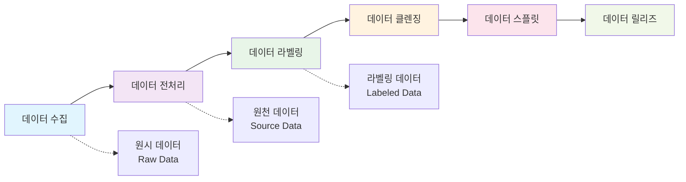
```mermaid
flowchart LR
    A[데이터 수집] --> B[데이터 전처리]
    B --> C[데이터 라벨링]
    C --> D[데이터 클렌징]
    D --> E[데이터 스플릿]
    E --> F[데이터 릴리즈]
    
    A -.-> G[원시 데이터<br/>Raw Data]
    B -.-> H[원천 데이터<br/>Source Data]
    C -.-> I[라벨링 데이터<br/>Labeled Data]
    
    style A fill:#e1f5fe
    style B fill:#f3e5f5
    style C fill:#e8f5e8
    style D fill:#fff3e0
    style E fill:#fce4ec
    style F fill:#f1f8e9
```

각 단계는 데이터의 품질을 점진적으로 향상시키며, 최종적으로 AI 모델이 학습할 수 있는 고품질 데이터셋을 생성한다.

## 📥 데이터 수집 (Data Collection)

**데이터 수집**은 구축 목적에 맞는 데이터를 획득하는 첫 번째 단계다. 이 단계에서 수집된 데이터를 **원시 데이터(Raw Data)** 라고 부른다.

### 데이터 수집 방법과 고려사항

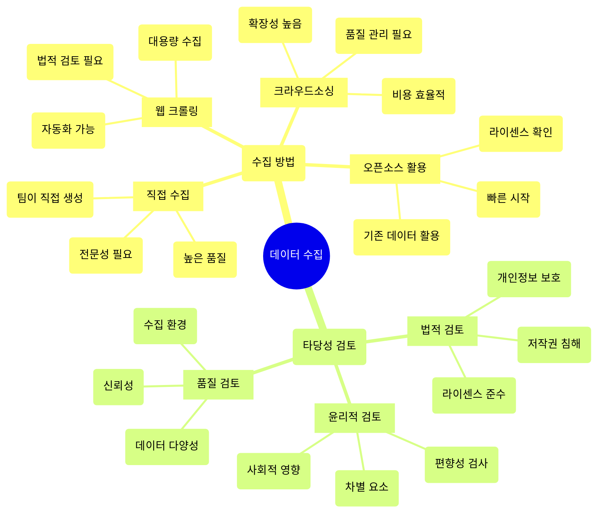
```mermaid
mindmap
  root((데이터 수집))
    (수집 방법)
      [직접 수집]
        (팀이 직접 생성)
        (전문성 필요)
        (높은 품질)
      [웹 크롤링]
        (자동화 가능)
        (대용량 수집)
        (법적 검토 필요)
      [오픈소스 활용]
        (라이센스 확인)
        (기존 데이터 활용)
        (빠른 시작)
      [크라우드소싱]
        (확장성 높음)
        (품질 관리 필요)
        (비용 효율적)
    (타당성 검토)
      [법적 검토]
        (저작권 침해)
        (개인정보 보호)
        (라이센스 준수)
      [윤리적 검토]
        (편향성 검사)
        (차별 요소)
        (사회적 영향)
      [품질 검토]
        (데이터 다양성)
        (수집 환경)
        (신뢰성)
```

### 간단한 수집 검증 예시

```python
# 수집된 데이터의 기본 품질 체크
def basic_quality_check(data):
    """수집된 데이터의 기본 품질 검사"""
    print(f"총 샘플 수: {len(data)}")
    print(f"중복 데이터: {data.duplicated().sum()}개")
    print(f"결측치: {data.isnull().sum().sum()}개")
    
    # 기본 통계
    print("\n기본 통계:")
    print(data.describe())
    
    return len(data) > 0 and data.duplicated().sum() < len(data) * 0.1
```

## 🔧 데이터 전처리 (Data Preprocessing)

**데이터 전처리**는 원시 데이터를 **원천 데이터(Source Data)**로 변환하는 과정이다. 이 단계에서는 데이터 품질 확보와 데이터 스키마 설계가 핵심이다.

### 데이터 품질 확보 프로세스

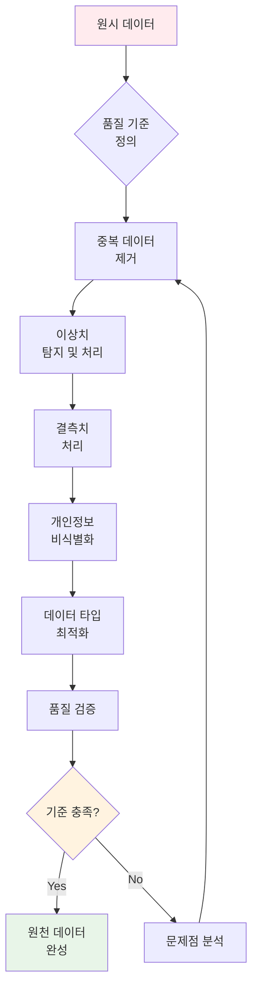
```mermaid
flowchart TD
    A[원시 데이터] --> B{품질 기준<br/>정의}
    B --> C[중복 데이터<br/>제거]
    C --> D[이상치<br/>탐지 및 처리]
    D --> E[결측치<br/>처리]
    E --> F[개인정보<br/>비식별화]
    F --> G[데이터 타입<br/>최적화]
    G --> H[품질 검증]
    H --> I{기준 충족?}
    I -->|Yes| J[원천 데이터<br/>완성]
    I -->|No| K[문제점 분석]
    K --> C
    
    style A fill:#ffebee
    style J fill:#e8f5e8
    style I fill:#fff3e0
```

### 데이터 스키마 설계

**데이터 스키마 설계**는 데이터가 어떻게 구조화될지, 어떤 라벨링이 필요한지를 미리 계획하는 과정이다.

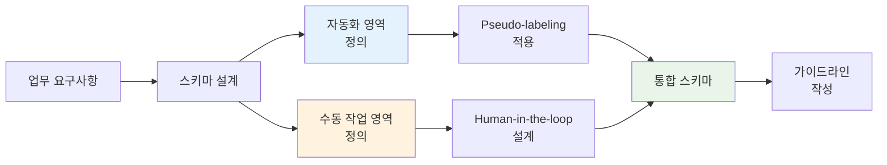
```mermaid
graph LR
    A[업무 요구사항] --> B[스키마 설계]
    B --> C[자동화 영역<br/>정의]
    B --> D[수동 작업 영역<br/>정의]
    C --> E[Pseudo-labeling<br/>적용]
    D --> F[Human-in-the-loop<br/>설계]
    E --> G[통합 스키마]
    F --> G
    G --> H[가이드라인<br/>작성]
    
    style C fill:#e3f2fd
    style D fill:#fff3e0
    style G fill:#e8f5e8
```

#### 문서 요약 태스크 스키마 예시

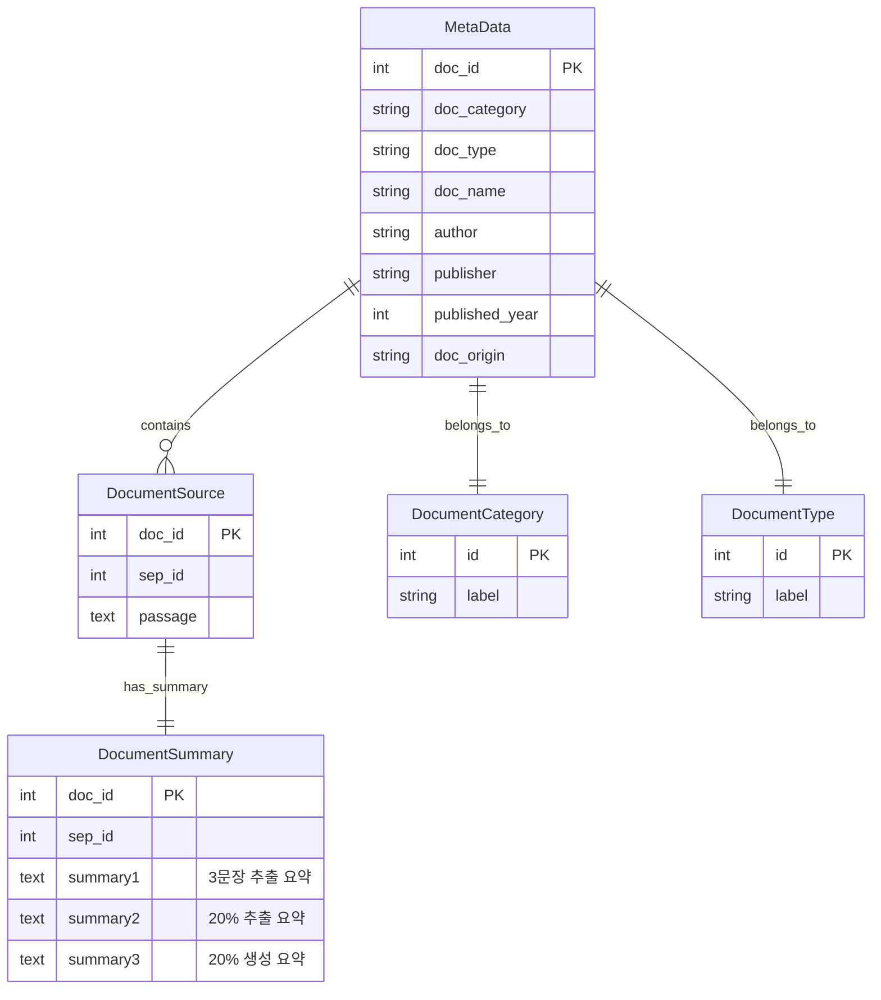
```mermaid
erDiagram
    MetaData {
        int doc_id PK
        string doc_category
        string doc_type
        string doc_name
        string author
        string publisher
        int published_year
        string doc_origin
    }
    
    DocumentSource {
        int doc_id PK
        int sep_id
        text passage
    }
    
    DocumentCategory {
        int id PK
        string label
    }
    
    DocumentType {
        int id PK
        string label
    }
    
    DocumentSummary {
        int doc_id PK
        int sep_id
        text summary1 "3문장 추출 요약"
        text summary2 "20% 추출 요약"
        text summary3 "20% 생성 요약"
    }
    
    MetaData ||--o{ DocumentSource : contains
    MetaData ||--|| DocumentCategory : belongs_to
    MetaData ||--|| DocumentType : belongs_to
    DocumentSource ||--|| DocumentSummary : has_summary
```

> **스키마 설계 핵심 원칙**
> 
> - 자동화 가능한 부분과 인간 작업이 필요한 부분을 명확히 구분
> - 라벨링 작업의 복잡도와 작업 시간을 고려한 설계
> - 품질 검증을 위한 명확한 기준 수립
> - 버전 관리와 변경 사항 추적 체계 구축
{: .prompt-tip}

## 🏷️ 데이터 라벨링 (Data Labeling)

**데이터 라벨링**은 원천 데이터에 정답 레이블을 부여하여 **라벨링 데이터(Labeled Data)** 를 생성하는 과정이다.

### 라벨링 워크플로우

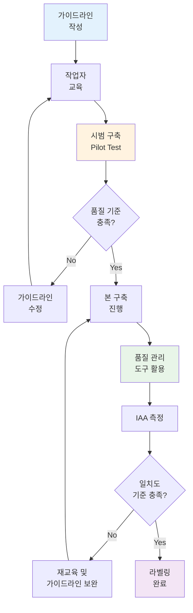
```mermaid
flowchart TD
    A[가이드라인<br/>작성] --> B[작업자<br/>교육]
    B --> C[시범 구축<br/>Pilot Test]
    C --> D{품질 기준<br/>충족?}
    D -->|No| E[가이드라인<br/>수정]
    E --> B
    D -->|Yes| F[본 구축<br/>진행]
    F --> G[품질 관리<br/>도구 활용]
    G --> H[IAA 측정]
    H --> I{일치도<br/>기준 충족?}
    I -->|No| J[재교육 및<br/>가이드라인 보완]
    J --> F
    I -->|Yes| K[라벨링<br/>완료]
    
    style A fill:#e3f2fd
    style C fill:#fff3e0
    style G fill:#e8f5e8
    style K fill:#f3e5f5
```

### 라벨링 품질 관리 체계

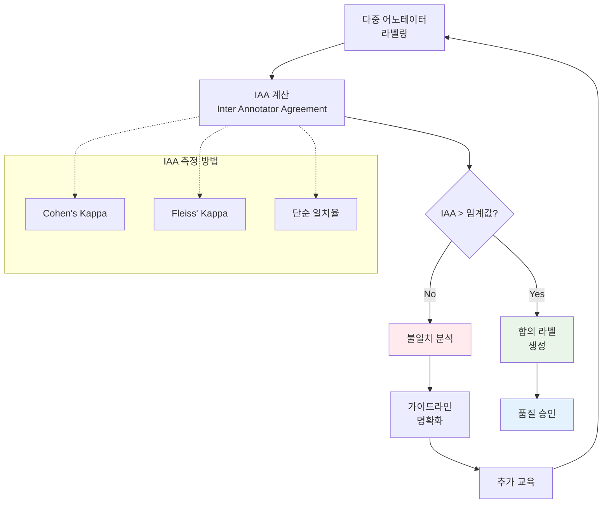
```mermaid
graph TD
    A[다중 어노테이터<br/>라벨링] --> B[IAA 계산<br/>Inter Annotator Agreement]
    B --> C{IAA > 임계값?}
    C -->|Yes| D[합의 라벨<br/>생성]
    C -->|No| E[불일치 분석]
    E --> F[가이드라인<br/>명확화]
    F --> G[추가 교육]
    G --> A
    D --> H[품질 승인]
    
    subgraph "IAA 측정 방법"
        I[Cohen's Kappa]
        J[Fleiss' Kappa]
        K[단순 일치율]
    end
    
    B -.-> I
    B -.-> J
    B -.-> K
    
    style D fill:#e8f5e8
    style E fill:#ffebee
    style H fill:#e3f2fd
```

#### 라벨링 도구의 핵심 요소

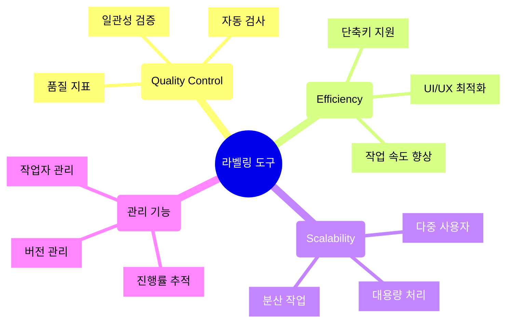
```mermaid
mindmap
  root((라벨링 도구))
    (Quality Control)
      [일관성 검증]
      [자동 검사]
      [품질 지표]
    (Efficiency)
      [단축키 지원]
      [UI/UX 최적화]
      [작업 속도 향상]
    (Scalability)
      [다중 사용자]
      [대용량 처리]
      [분산 작업]
    (관리 기능)
      [진행률 추적]
      [작업자 관리]
      [버전 관리]
```

## 🧹 데이터 클렌징 (Data Cleansing)

**데이터 클렌징**은 라벨링된 데이터의 품질을 최종적으로 검수하고 정제하는 단계다.

### 내재적 요소 검수

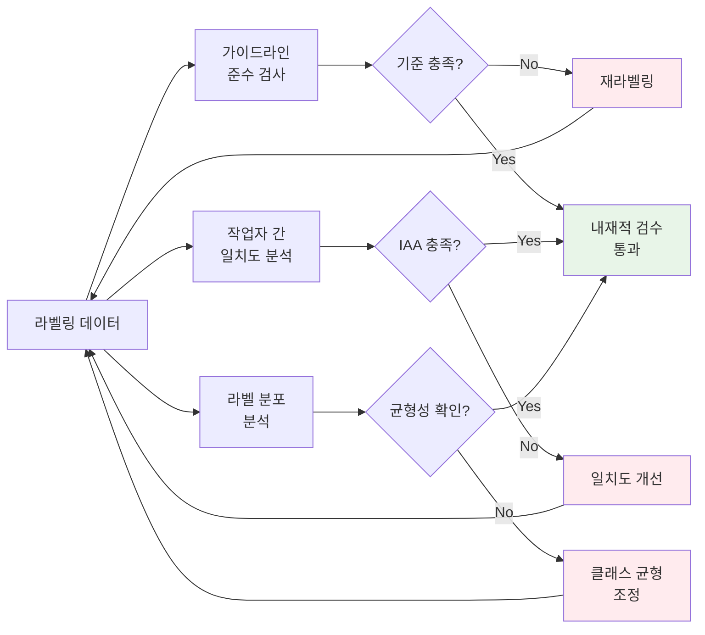
```mermaid
flowchart LR
    A[라벨링 데이터] --> B[가이드라인<br/>준수 검사]
    A --> C[작업자 간<br/>일치도 분석]
    A --> D[라벨 분포<br/>분석]
    
    B --> E{기준 충족?}
    C --> F{IAA 충족?}
    D --> G{균형성 확인?}
    
    E -->|No| H[재라벨링]
    F -->|No| I[일치도 개선]
    G -->|No| J[클래스 균형<br/>조정]
    
    E -->|Yes| K[내재적 검수<br/>통과]
    F -->|Yes| K
    G -->|Yes| K
    
    H --> A
    I --> A
    J --> A
    
    style K fill:#e8f5e8
    style H fill:#ffebee
    style I fill:#ffebee
    style J fill:#ffebee
```

### 외재적 요소 검수

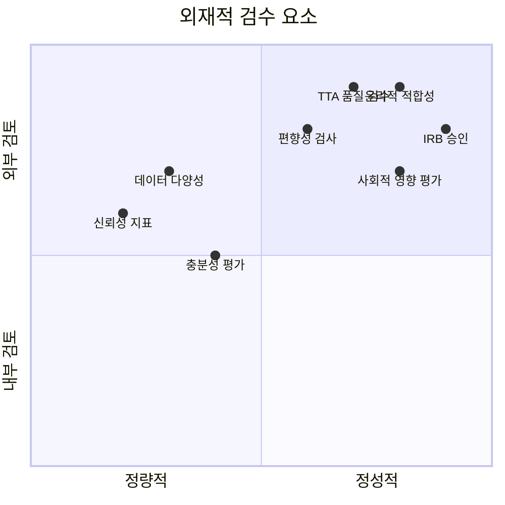
```mermaid
quadrantChart
    title 외재적 검수 요소
    x-axis 정량적 --> 정성적
    y-axis 내부 검토 --> 외부 검토
    
    데이터 다양성: [0.3, 0.7]
    신뢰성 지표: [0.2, 0.6]
    윤리적 적합성: [0.8, 0.9]
    IRB 승인: [0.9, 0.8]
    TTA 품질 검수: [0.7, 0.9]
    사회적 영향 평가: [0.8, 0.7]
    편향성 검사: [0.6, 0.8]
    충분성 평가: [0.4, 0.5]
```

#### 외부 검수 기관과 절차

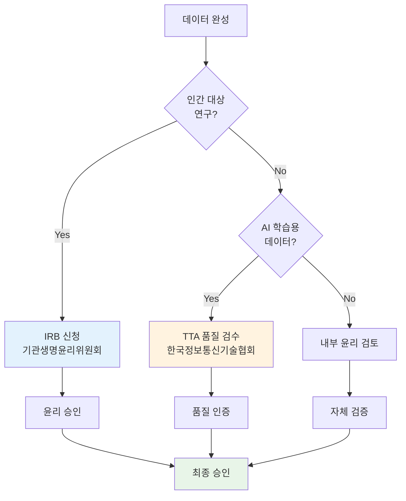
```mermaid
graph TD
    A[데이터 완성] --> B{인간 대상<br/>연구?}
    B -->|Yes| C[IRB 신청<br/>기관생명윤리위원회]
    B -->|No| D{AI 학습용<br/>데이터?}
    D -->|Yes| E[TTA 품질 검수<br/>한국정보통신기술협회]
    D -->|No| F[내부 윤리 검토]
    
    C --> G[윤리 승인]
    E --> H[품질 인증]
    F --> I[자체 검증]
    
    G --> J[최종 승인]
    H --> J
    I --> J
    
    style C fill:#e3f2fd
    style E fill:#fff3e0
    style J fill:#e8f5e8
```

## 📊 데이터 스플릿 (Data Split)

**데이터 스플릿**은 완성된 데이터셋을 학습-검증-테스트용으로 분할하는 과정이다.

### 데이터 분할 전략

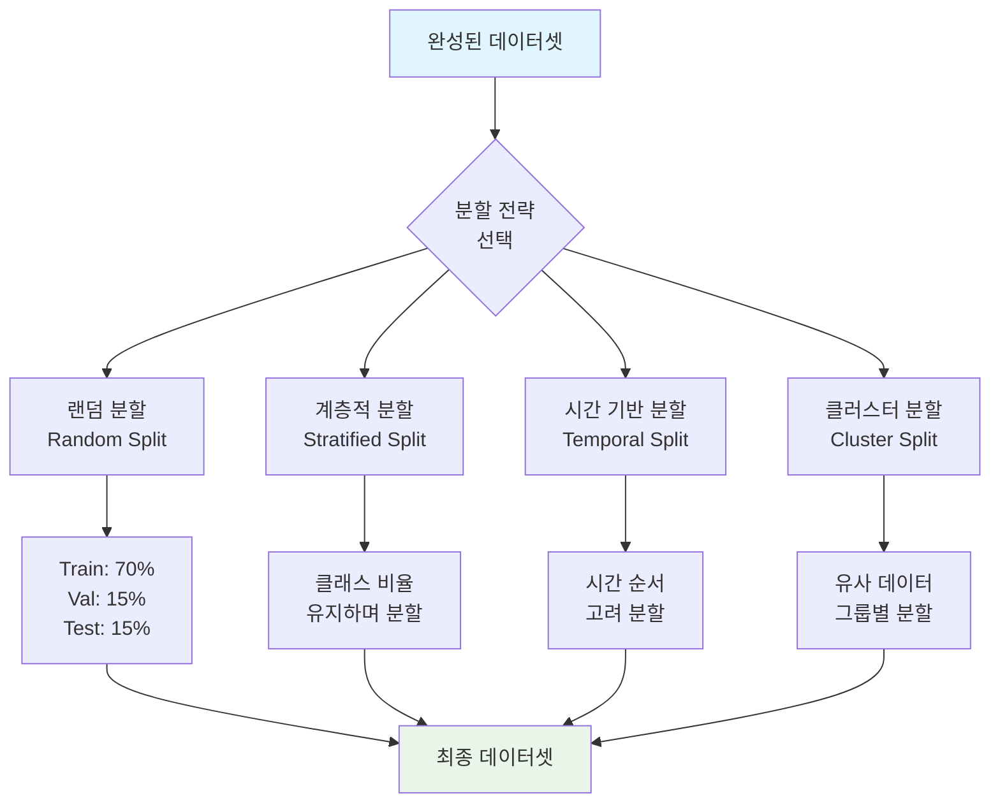
```mermaid
flowchart TD
    A[완성된 데이터셋] --> B{분할 전략<br/>선택}
    
    B --> C[랜덤 분할<br/>Random Split]
    B --> D[계층적 분할<br/>Stratified Split]
    B --> E[시간 기반 분할<br/>Temporal Split]
    B --> F[클러스터 분할<br/>Cluster Split]
    
    C --> G[Train: 70%<br/>Val: 15%<br/>Test: 15%]
    D --> H[클래스 비율<br/>유지하며 분할]
    E --> I[시간 순서<br/>고려 분할]
    F --> J[유사 데이터<br/>그룹별 분할]
    
    G --> K[최종 데이터셋]
    H --> K
    I --> K
    J --> K
    
    style A fill:#e1f5fe
    style K fill:#e8f5e8
```

### 분할 방법별 특징과 선택 기준

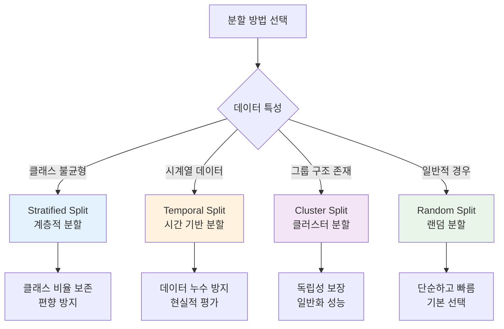
```mermaid
graph TD
    A[분할 방법 선택] --> B{데이터 특성}
    
    B -->|클래스 불균형| C[Stratified Split<br/>계층적 분할]
    B -->|시계열 데이터| D[Temporal Split<br/>시간 기반 분할]
    B -->|그룹 구조 존재| E[Cluster Split<br/>클러스터 분할]
    B -->|일반적 경우| F[Random Split<br/>랜덤 분할]
    
    C --> G[클래스 비율 보존<br/>편향 방지]
    D --> H[데이터 누수 방지<br/>현실적 평가]
    E --> I[독립성 보장<br/>일반화 성능]
    F --> J[단순하고 빠름<br/>기본 선택]
    
    style C fill:#e3f2fd
    style D fill:#fff3e0
    style E fill:#f3e5f5
    style F fill:#e8f5e8
```

## 🚀 데이터 릴리즈 (Data Release)

**데이터 릴리즈**는 완성된 데이터셋을 실제 사용할 수 있도록 배포하는 최종 단계다.

### 릴리즈 패키지 구성요소

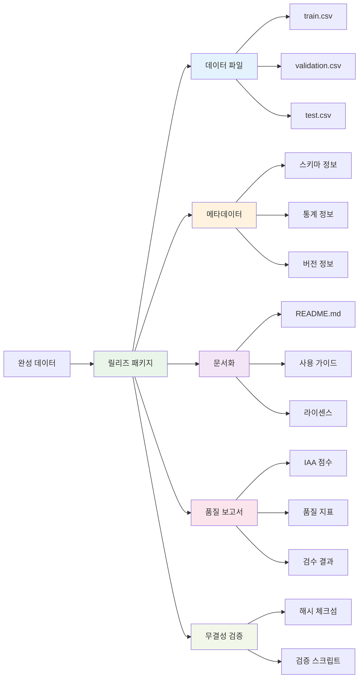
```mermaid
flowchart LR
    A[완성 데이터] --> B[릴리즈 패키지]
    
    B --> C[데이터 파일]
    B --> D[메타데이터]
    B --> E[문서화]
    B --> F[품질 보고서]
    B --> G[무결성 검증]
    
    C --> C1[train.csv]
    C --> C2[validation.csv]
    C --> C3[test.csv]
    
    D --> D1[스키마 정보]
    D --> D2[통계 정보]
    D --> D3[버전 정보]
    
    E --> E1[README.md]
    E --> E2[사용 가이드]
    E --> E3[라이센스]
    
    F --> F1[IAA 점수]
    F --> F2[품질 지표]
    F --> F3[검수 결과]
    
    G --> G1[해시 체크섬]
    G --> G2[검증 스크립트]
    
    style B fill:#e8f5e8
    style C fill:#e3f2fd
    style D fill:#fff3e0
    style E fill:#f3e5f5
    style F fill:#fce4ec
    style G fill:#f1f8e9
```

### 배포 플랫폼별 고려사항

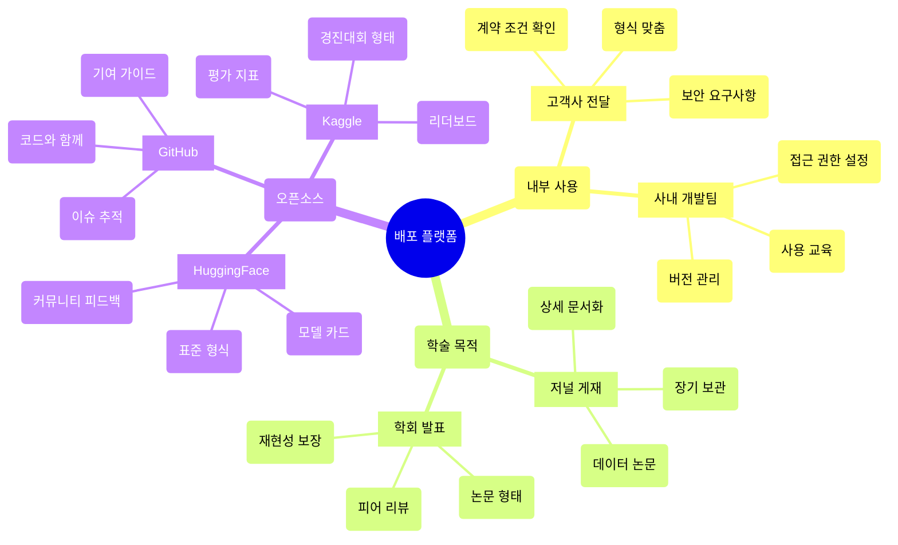
```mermaid
mindmap
  root((배포 플랫폼))
    (내부 사용)
      [고객사 전달]
        (계약 조건 확인)
        (보안 요구사항)
        (형식 맞춤)
      [사내 개발팀]
        (접근 권한 설정)
        (버전 관리)
        (사용 교육)
    (학술 목적)
      [학회 발표]
        (논문 형태)
        (피어 리뷰)
        (재현성 보장)
      [저널 게재]
        (데이터 논문)
        (상세 문서화)
        (장기 보관)
    (오픈소스)
      [HuggingFace]
        (표준 형식)
        (모델 카드)
        (커뮤니티 피드백)
      [Kaggle]
        (경진대회 형태)
        (평가 지표)
        (리더보드)
      [GitHub]
        (코드와 함께)
        (이슈 추적)
        (기여 가이드)
```

## 🔄 데이터 구축 패러다임

실제 데이터 구축 프로젝트에서는 프로젝트의 특성에 따라 다른 접근 방식을 선택해야 한다.

### 폭포수 모형 vs 나선형 모형

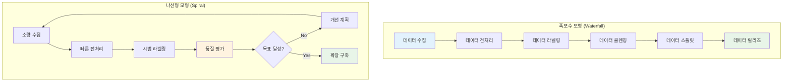
```mermaid
graph TD
    subgraph "폭포수 모형 (Waterfall)"
        A1[데이터 수집] --> A2[데이터 전처리]
        A2 --> A3[데이터 라벨링]
        A3 --> A4[데이터 클렌징]
        A4 --> A5[데이터 스플릿]
        A5 --> A6[데이터 릴리즈]
    end
    
    subgraph "나선형 모형 (Spiral)"
        B1[소량 수집] --> B2[빠른 전처리]
        B2 --> B3[시범 라벨링]
        B3 --> B4[품질 평가]
        B4 --> B5{목표 달성?}
        B5 -->|No| B6[개선 계획]
        B6 --> B1
        B5 -->|Yes| B7[확장 구축]
    end
    
    style A1 fill:#e3f2fd
    style A6 fill:#e8f5e8
    style B4 fill:#fff3e0
    style B7 fill:#e8f5e8
```

### 패러다임 선택 가이드

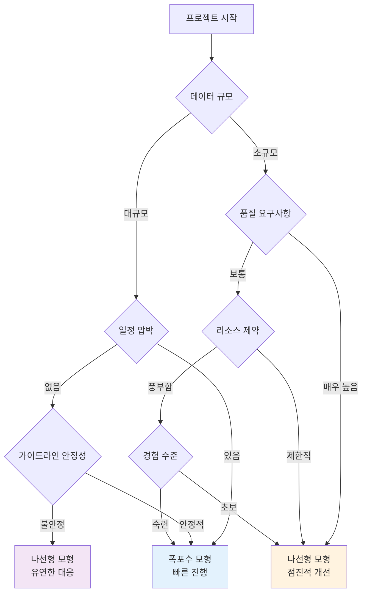
```mermaid
flowchart TD
    A[프로젝트 시작] --> B{데이터 규모}
    
    B -->|대규모| C{일정 압박}
    B -->|소규모| D{품질 요구사항}
    
    C -->|있음| E[폭포수 모형<br/>빠른 진행]
    C -->|없음| F{가이드라인 안정성}
    
    D -->|매우 높음| G[나선형 모형<br/>점진적 개선]
    D -->|보통| H{리소스 제약}
    
    F -->|안정적| E
    F -->|불안정| I[나선형 모형<br/>유연한 대응]
    
    H -->|제한적| G
    H -->|풍부함| J{경험 수준}
    
    J -->|초보| G
    J -->|숙련| E
    
    style E fill:#e3f2fd
    style G fill:#fff3e0
    style I fill:#f3e5f5
```

### 프로세스 진행시 주의사항

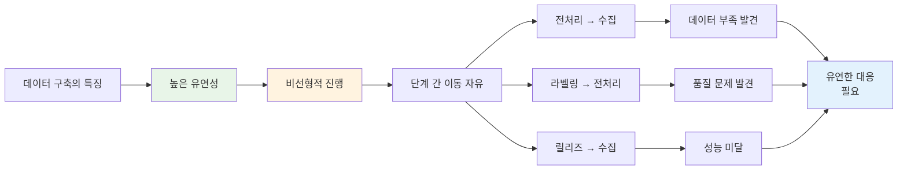
```mermaid
graph LR
    A[데이터 구축의 특징] --> B[높은 유연성]
    B --> C[비선형적 진행]
    C --> D[단계 간 이동 자유]
    
    D --> E[전처리 → 수집]
    D --> F[라벨링 → 전처리]
    D --> G[릴리즈 → 수집]
    
    E --> H[데이터 부족 발견]
    F --> I[품질 문제 발견]
    G --> J[성능 미달]
    
    H --> K[유연한 대응<br/>필요]
    I --> K
    J --> K
    
    style B fill:#e8f5e8
    style C fill:#fff3e0
    style K fill:#e3f2fd
```

> **데이터 구축 프로세스 성공 요인**
> 
> - **명확한 목표 설정**: 구축하려는 데이터의 목적과 품질 기준을 명확히 정의
> - **단계별 검증**: 각 단계마다 품질을 검증하고 다음 단계로 진행
> - **유연한 접근**: 문제 발견 시 이전 단계로 돌아갈 수 있는 유연성 확보
> - **지속적 개선**: 피드백을 반영한 지속적인 프로세스 개선
> - **자동화 도입**: 반복적인 작업은 최대한 자동화하여 효율성 증대
{: .prompt-tip}

## 🎯 실무 적용을 위한 체크리스트

### 프로젝트 시작 전 준비사항

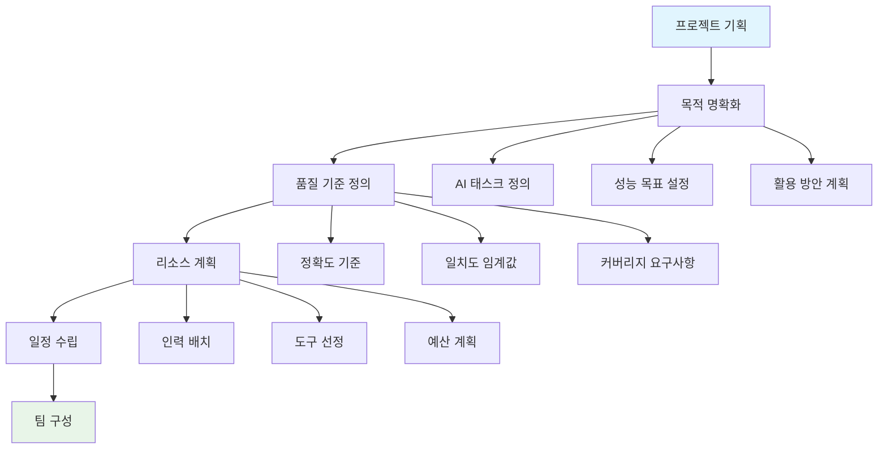
```mermaid
flowchart TD
    A[프로젝트 기획] --> B[목적 명확화]
    B --> C[품질 기준 정의]
    C --> D[리소스 계획]
    D --> E[일정 수립]
    E --> F[팀 구성]
    
    B --> B1[AI 태스크 정의]
    B --> B2[성능 목표 설정]
    B --> B3[활용 방안 계획]
    
    C --> C1[정확도 기준]
    C --> C2[일치도 임계값]
    C --> C3[커버리지 요구사항]
    
    D --> D1[인력 배치]
    D --> D2[도구 선정]
    D --> D3[예산 계획]
    
    style A fill:#e1f5fe
    style F fill:#e8f5e8
```

### 품질 관리 핵심 지표

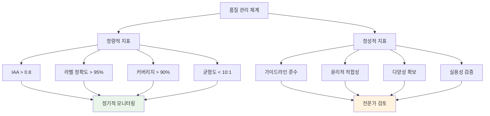
```mermaid
graph TB
    A[품질 관리 체계] --> B[정량적 지표]
    A --> C[정성적 지표]
    
    B --> B1[IAA > 0.8]
    B --> B2[라벨 정확도 > 95%]
    B --> B3[커버리지 > 90%]
    B --> B4[균형도 < 10:1]
    
    C --> C1[가이드라인 준수]
    C --> C2[윤리적 적합성]
    C --> C3[다양성 확보]
    C --> C4[실용성 검증]
    
    B1 --> D[정기적 모니터링]
    B2 --> D
    B3 --> D
    B4 --> D
    
    C1 --> E[전문가 검토]
    C2 --> E
    C3 --> E
    C4 --> E
    
    style D fill:#e8f5e8
    style E fill:#fff3e0
```

데이터 구축 프로세스는 AI 시스템의 성능을 결정하는 핵심 요소다. 

체계적인 접근과 적절한 품질 관리를 통해 고품질 데이터셋을 구축할 수 있으며, 이는 결국 더 나은 AI 모델로 이어진다.

각 프로젝트의 특성에 맞는 적절한 패러다임을 선택하고, 지속적인 품질 개선을 통해 Data-Centric AI의 진정한 가치를 실현할 수 있다.