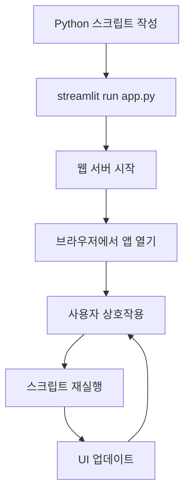

## 📦 사용하는 python package

- streamlit==1.49.1
- python==3.12

## 🚀 TL;DR

- **Streamlit**은 Python 스크립트를 웹 애플리케이션으로 변환하는 오픈소스 프레임워크다
- HTML, CSS, JavaScript 지식 없이도 **순수 Python만으로** 인터랙티브한 데이터 앱을 만들 수 있다
- 데이터 시각화, 머신러닝 모델 데모, 대시보드 구축에 최적화되어 있다
- **위젯 상태 관리**, **캐싱**, **실시간 업데이트** 기능으로 프로덕션 레벨 앱 구현이 가능하다
- 코드 변경 시 자동으로 앱이 재실행되는 **핫 리로딩** 기능으로 개발 속도가 빠르다
- Streamlit Community Cloud를 통해 무료로 앱을 배포할 수 있다
- 데이터 과학자, ML 엔지니어, 분석가들이 빠르게 프로토타입을 만들고 공유하는 데 이상적이다

## 📓 실습 Jupyter Notebook

- w.i.p.

## 🎯 Streamlit이란 무엇인가?

Streamlit은 데이터 앱을 만드는 과정을 **"데이터 스크립트 작성하기"** 만큼 간단하게 만들어주는 프레임워크다. 복잡한 웹 개발 지식 없이도 Python 코드 몇 줄로 인터랙티브한 웹 애플리케이션을 구축할 수 있다.

### 핵심 컨셉

**선언적 프로그래밍(Declarative Programming)**

- 무엇을 표시할지만 선언하면, 어떻게 표시할지는 Streamlit이 처리한다
- React의 컴포넌트 기반 접근법과 유사하지만, 더 간단한 Python 문법을 사용한다

```python
import streamlit as st
import pandas as pd

# 이 한 줄로 인터랙티브한 데이터프레임이 생성된다
df = pd.DataFrame({'col1': [1, 2, 3], 'col2': [4, 5, 6]})
st.dataframe(df)  # 출력: 정렬, 필터링 가능한 인터랙티브 테이블
```

**스크립트 실행 모델**

- 앱은 위에서 아래로 실행되는 Python 스크립트다
- 사용자 상호작용이 있을 때마다 전체 스크립트가 재실행된다
- 상태 관리와 캐싱으로 효율적인 재실행을 보장한다



### 언제 Streamlit을 사용해야 할까?

**적합한 경우**

- 데이터 분석 결과를 빠르게 공유하고 싶을 때
- ML 모델의 프로토타입이나 데모를 만들 때
- 실시간 대시보드나 모니터링 도구가 필요할 때
- 내부 도구나 관리자 패널을 구축할 때
- 데이터 탐색 도구를 만들 때

**부적합한 경우**

- 복잡한 사용자 인증이나 권한 관리가 필요한 경우
- 대규모 동시 사용자를 지원해야 하는 경우
- 모바일 앱이나 네이티브 앱이 필요한 경우
- 세밀한 UI/UX 커스터마이징이 필요한 경우

## 🧩 주요 컴포넌트와 기본 사용법

### 텍스트 출력 컴포넌트

Streamlit의 텍스트 출력은 마크다운부터 LaTeX까지 다양한 형식을 지원한다.

```python
import streamlit as st

# 제목과 헤더
st.title("🚀 나의 첫 Streamlit 앱")  # 출력: 큰 제목
st.header("1. 헤더 레벨")  # 출력: 중간 크기 헤더
st.subheader("1.1 서브헤더")  # 출력: 작은 헤더

# 일반 텍스트와 마크다운
st.text("일반 텍스트입니다")  # 출력: 고정폭 폰트 텍스트
st.markdown("**굵은 글씨**와 *이탤릭*")  # 출력: 마크다운 형식 텍스트

# 코드와 수식
st.code("print('Hello, Streamlit!')", language='python')  # 출력: 구문 강조된 코드
st.latex(r"\int_0^1 x^2 dx = \frac{1}{3}")  # 출력: LaTeX 수식

# 정보 메시지
st.info("정보 메시지입니다")  # 출력: 파란색 정보 박스
st.success("성공!")  # 출력: 초록색 성공 박스
st.warning("경고 메시지")  # 출력: 노란색 경고 박스
st.error("에러 발생!")  # 출력: 빨간색 에러 박스
```

### 데이터 표시 컴포넌트

데이터프레임과 차트를 손쉽게 표시할 수 있다.

```python
import pandas as pd
import numpy as np
import streamlit as st

# 데이터프레임 생성
df = pd.DataFrame(
    np.random.randn(10, 5),
    columns=['A', 'B', 'C', 'D', 'E']
)

# 인터랙티브 데이터프레임
st.dataframe(df, use_container_width=True)  # 출력: 정렬/필터 가능한 테이블

# 정적 테이블
st.table(df.head())  # 출력: 정적 HTML 테이블

# 메트릭 표시
col1, col2, col3 = st.columns(3)
with col1:
    st.metric("매출", "1.2억", "+12%")  # 출력: 메트릭 카드
with col2:
    st.metric("사용자", "1,234", "-2.3%")
with col3:
    st.metric("전환율", "3.2%", "0.1%")

# JSON 표시
json_data = {"name": "홍길동", "age": 30, "city": "서울"}
st.json(json_data)  # 출력: 포맷팅된 JSON
```

### 차트와 시각화

Streamlit은 여러 차트 라이브러리를 네이티브로 지원한다.

```python
import streamlit as st
import pandas as pd
import numpy as np
import plotly.express as px

# 샘플 데이터 생성
chart_data = pd.DataFrame(
    np.random.randn(20, 3),
    columns=['A', 'B', 'C']
)

# Streamlit 네이티브 차트
st.line_chart(chart_data)  # 출력: 인터랙티브 라인 차트
st.area_chart(chart_data)  # 출력: 영역 차트
st.bar_chart(chart_data)  # 출력: 막대 차트

# Plotly 차트
fig = px.scatter(chart_data, x='A', y='B', size='C')
st.plotly_chart(fig, use_container_width=True)  # 출력: Plotly 산점도

# Matplotlib/Seaborn
import matplotlib.pyplot as plt
fig, ax = plt.subplots()
ax.hist(chart_data['A'], bins=20)
st.pyplot(fig)  # 출력: Matplotlib 히스토그램

# 지도 시각화
map_data = pd.DataFrame(
    np.random.randn(100, 2) / [50, 50] + [37.76, -122.4],
    columns=['lat', 'lon']
)
st.map(map_data)  # 출력: 인터랙티브 지도
```

### 입력 위젯

사용자 입력을 받는 다양한 위젯을 제공한다.

```python
import streamlit as st
from datetime import datetime, date, time

# 텍스트 입력
name = st.text_input("이름을 입력하세요")  # 반환: 문자열
bio = st.text_area("자기소개를 작성하세요")  # 반환: 여러 줄 문자열

# 숫자 입력
age = st.number_input("나이", min_value=0, max_value=120)  # 반환: 숫자
rating = st.slider("평점", 0, 5, 3)  # 반환: 슬라이더 값

# 선택 입력
gender = st.selectbox("성별", ["남성", "여성", "기타"])  # 반환: 선택된 옵션
hobbies = st.multiselect("취미", ["독서", "운동", "여행", "요리"])  # 반환: 리스트
agree = st.checkbox("동의합니다")  # 반환: boolean
choice = st.radio("선택하세요", ["옵션1", "옵션2", "옵션3"])  # 반환: 선택된 값

# 날짜/시간
birthday = st.date_input("생일", date(2000, 1, 1))  # 반환: date 객체
appointment = st.time_input("약속 시간", time(9, 0))  # 반환: time 객체

# 파일 업로드
uploaded_file = st.file_uploader("파일 선택", type=['csv', 'txt'])  # 반환: 파일 객체
if uploaded_file:
    df = pd.read_csv(uploaded_file)
    st.dataframe(df)

# 버튼과 액션
if st.button("클릭하세요"):  # 반환: boolean
    st.write("버튼이 클릭되었습니다!")

# 색상 선택
color = st.color_picker("색상 선택", "#00f900")  # 반환: HEX 색상 코드
```

## 🎨 레이아웃과 컨테이너

### 컬럼 레이아웃

화면을 여러 컬럼으로 분할하여 콘텐츠를 배치할 수 있다.

```python
import streamlit as st

# 동일한 너비의 컬럼
col1, col2, col3 = st.columns(3)

with col1:
    st.header("첫 번째 컬럼")
    st.write("컬럼 1의 내용")

with col2:
    st.header("두 번째 컬럼")
    st.write("컬럼 2의 내용")

with col3:
    st.header("세 번째 컬럼")
    st.write("컬럼 3의 내용")

# 다른 너비의 컬럼
col1, col2 = st.columns([2, 1])  # 2:1 비율

with col1:
    st.write("넓은 컬럼")
    
with col2:
    st.write("좁은 컬럼")
```

### 컨테이너와 확장 가능한 요소

```python
import streamlit as st

# 컨테이너
container = st.container()
container.write("컨테이너 안의 내용")

# 확장 가능한 섹션
with st.expander("더 보기"):
    st.write("숨겨진 내용입니다")
    st.image("https://via.placeholder.com/150")

# 탭
tab1, tab2, tab3 = st.tabs(["📈 차트", "📊 데이터", "📝 설명"])

with tab1:
    st.header("차트 탭")
    st.line_chart([1, 2, 3, 4, 5])

with tab2:
    st.header("데이터 탭")
    st.dataframe({"col1": [1, 2], "col2": [3, 4]})

with tab3:
    st.header("설명 탭")
    st.write("이것은 설명입니다")

# 사이드바
with st.sidebar:
    st.header("사이드바")
    option = st.selectbox("옵션 선택", ["A", "B", "C"])
    st.write(f"선택된 옵션: {option}")
```

## 💾 세션 상태 관리

Streamlit의 **세션 상태(Session State)** 는 스크립트 재실행 간에 데이터를 유지하는 메커니즘이다.

```python
import streamlit as st

# 세션 상태 초기화
if 'counter' not in st.session_state:
    st.session_state.counter = 0

# 카운터 증가 함수
def increment_counter():
    st.session_state.counter += 1

# UI
st.header(f"카운터: {st.session_state.counter}")
st.button("증가", on_click=increment_counter)

# 콜백을 사용한 양방향 바인딩
def update_text():
    st.session_state.output = st.session_state.input_text.upper()

st.text_input("텍스트 입력", key="input_text", on_change=update_text)

if 'output' in st.session_state:
    st.write(f"대문자 변환: {st.session_state.output}")

# 복잡한 상태 관리 예시
if 'todos' not in st.session_state:
    st.session_state.todos = []

def add_todo():
    if st.session_state.new_todo:
        st.session_state.todos.append(st.session_state.new_todo)
        st.session_state.new_todo = ""

st.text_input("할 일 추가", key="new_todo", on_change=add_todo)

for i, todo in enumerate(st.session_state.todos):
    col1, col2 = st.columns([4, 1])
    with col1:
        st.write(f"✅ {todo}")
    with col2:
        if st.button("삭제", key=f"delete_{i}"):
            st.session_state.todos.pop(i)
            st.rerun()
```

> 세션 상태는 각 사용자 세션마다 독립적으로 유지된다. 브라우저를 새로고침하면 초기화되지만, 앱이 재실행되어도 유지된다.
{: .prompt-tip}

## ⚡ 캐싱과 성능 최적화

### st.cache_data 데코레이터

데이터 로딩과 변환 작업을 캐싱하여 성능을 향상시킨다.

```python
import streamlit as st
import pandas as pd
import time

@st.cache_data  # 결과를 캐싱
def load_data(file_path):
    """대용량 데이터 로딩 (캐싱됨)"""
    time.sleep(2)  # 시뮬레이션: 느린 작업
    return pd.read_csv(file_path)

@st.cache_data(ttl=3600)  # 1시간 TTL
def fetch_api_data(endpoint):
    """API 데이터 가져오기 (1시간 캐싱)"""
    # API 호출 시뮬레이션
    return {"data": "API 결과", "timestamp": time.time()}

@st.cache_data
def process_dataframe(df):
    """데이터프레임 처리 (캐싱됨)"""
    # 복잡한 처리 로직
    return df.groupby('category').sum()

# 캐싱된 함수 사용
df = load_data("data.csv")  # 첫 호출은 느림, 이후는 빠름
processed = process_dataframe(df)  # 동일한 df로 호출하면 캐싱된 결과 반환
```

### st.cache_resource 데코레이터

전역 리소스(데이터베이스 연결, ML 모델 등)를 캐싱한다.

```python
import streamlit as st
import pickle

@st.cache_resource
def init_database_connection():
    """데이터베이스 연결 초기화 (한 번만 실행)"""
    # 실제로는 데이터베이스 연결 코드
    return {"connection": "DB 연결 객체"}

@st.cache_resource
def load_ml_model(model_path):
    """머신러닝 모델 로딩 (한 번만 실행)"""
    with open(model_path, 'rb') as f:
        model = pickle.load(f)
    return model

# 캐싱된 리소스 사용
db = init_database_connection()  # 앱 생명주기 동안 유지
model = load_ml_model("model.pkl")  # 모든 사용자가 공유

# 캐시 초기화
if st.button("캐시 초기화"):
    st.cache_data.clear()  # 모든 데이터 캐시 삭제
    st.cache_resource.clear()  # 모든 리소스 캐시 삭제
```

> st.cache_data는 데이터 중심 작업에, st.cache_resource는 싱글톤 객체에 사용한다. 캐싱은 앱 성능의 핵심이다!
{: .prompt-warning}

## 🔄 고급 기능과 패턴

### 동적 UI 업데이트

```python
import streamlit as st
import time

# 프로그레스 바와 상태 메시지
def long_running_task():
    progress_bar = st.progress(0)
    status_text = st.empty()
    
    for i in range(100):
        progress_bar.progress(i + 1)
        status_text.text(f"처리 중... {i+1}%")
        time.sleep(0.01)
    
    status_text.text("완료!")
    st.balloons()  # 축하 애니메이션

# 실시간 업데이트
placeholder = st.empty()

for i in range(10):
    with placeholder.container():
        st.metric("실시간 카운터", i)
    time.sleep(0.5)

# 동적 컴포넌트 추가
if 'components' not in st.session_state:
    st.session_state.components = []

def add_component():
    st.session_state.components.append(len(st.session_state.components))

st.button("컴포넌트 추가", on_click=add_component)

for idx in st.session_state.components:
    st.write(f"동적 컴포넌트 {idx}")
```

### 폼(Forms)과 배치 처리

```python
import streamlit as st

# 폼을 사용한 배치 입력
with st.form("my_form"):
    st.write("사용자 정보 입력")
    
    name = st.text_input("이름")
    age = st.number_input("나이", min_value=0, max_value=120)
    email = st.text_input("이메일")
    
    col1, col2 = st.columns(2)
    with col1:
        gender = st.selectbox("성별", ["남성", "여성", "기타"])
    with col2:
        country = st.selectbox("국가", ["한국", "미국", "일본", "기타"])
    
    # 폼 제출 버튼 (폼 안에서만 동작)
    submitted = st.form_submit_button("제출")
    
    if submitted:
        st.write("제출된 정보:")
        st.json({
            "name": name,
            "age": age,
            "email": email,
            "gender": gender,
            "country": country
        })
```

### 멀티페이지 앱 구조

```python
# pages/1_📊_Dashboard.py
import streamlit as st

st.set_page_config(page_title="대시보드", page_icon="📊")
st.title("대시보드 페이지")
st.write("여기는 대시보드입니다")

# pages/2_📈_Analytics.py
import streamlit as st

st.set_page_config(page_title="분석", page_icon="📈")
st.title("분석 페이지")
st.write("여기는 분석 페이지입니다")

# main.py (메인 앱)
import streamlit as st

st.set_page_config(
    page_title="멀티페이지 앱",
    page_icon="🏠",
    layout="wide",
    initial_sidebar_state="expanded"
)

st.title("홈 페이지")
st.write("왼쪽 사이드바에서 페이지를 선택하세요")

# 페이지 네비게이션은 자동으로 생성됨
```

### 커스텀 컴포넌트와 HTML/CSS

```python
import streamlit as st
import streamlit.components.v1 as components

# HTML/CSS 직접 삽입
st.markdown("""
<style>
    .custom-box {
        background-color: #f0f2f6;
        padding: 20px;
        border-radius: 10px;
        margin: 10px 0;
    }
    .highlight {
        color: #ff4b4b;
        font-weight: bold;
    }
</style>
""", unsafe_allow_html=True)

st.markdown("""
<div class="custom-box">
    <h3>커스텀 스타일 박스</h3>
    <p>이것은 <span class="highlight">커스텀 CSS</span>가 적용된 HTML입니다.</p>
</div>
""", unsafe_allow_html=True)

# JavaScript 실행
components.html("""
<script>
    console.log("Streamlit에서 JavaScript 실행!");
    const now = new Date();
    document.getElementById('time').innerHTML = now.toLocaleString();
</script>
<div id="time"></div>
""", height=50)

# iframe 임베딩
components.iframe("https://www.example.com", height=400)
```

## 🌐 배포와 공유

### Streamlit Community Cloud 배포

**1. GitHub 저장소 준비**

```bash
# 프로젝트 구조
my-streamlit-app/
├── app.py              # 메인 앱 파일
├── requirements.txt    # 의존성 목록
├── .gitignore         # Git 제외 파일
└── README.md          # 프로젝트 설명
```

**2. requirements.txt 작성**

```txt
streamlit==1.49.1
pandas==2.2.3
numpy==1.26.4
plotly==5.24.1
scikit-learn==1.5.2
```

**3. 배포 프로세스**

- [share.streamlit.io](https://share.streamlit.io/) 접속
- GitHub 계정 연동
- 저장소와 브랜치 선택
- 메인 파일 경로 지정
- Deploy 클릭

### 로컬 개발 팁

```bash
# 개발 모드로 실행 (자동 리로드)
streamlit run app.py --server.runOnSave true

# 포트 지정
streamlit run app.py --server.port 8080

# 브라우저 자동 열기 비활성화
streamlit run app.py --server.headless true

# 설정 파일 (.streamlit/config.toml)
[theme]
primaryColor = "#FF4B4B"
backgroundColor = "#FFFFFF"
secondaryBackgroundColor = "#F0F2F6"
textColor = "#262730"

[server]
maxUploadSize = 200
enableCORS = false
```

## 🎯 Best Practices와 성능 팁

### 성능 최적화 체크리스트

- **캐싱 적극 활용**: 데이터 로딩, API 호출, 모델 로딩에 캐싱 사용
- **세션 상태 관리**: 불필요한 재계산 방지를 위해 세션 상태 활용
- **효율적인 데이터 처리**: 대용량 데이터는 페이지네이션이나 샘플링 고려
- **비동기 처리**: 장시간 작업은 프로그레스 바와 함께 처리
- **리소스 정리**: 파일 핸들러나 데이터베이스 연결 적절히 관리

### 코드 구조화 패턴

```python
# utils.py - 유틸리티 함수
def load_config():
    """설정 파일 로딩"""
    pass

# data.py - 데이터 처리
@st.cache_data
def load_dataset(path):
    """데이터셋 로딩"""
    pass

# models.py - 모델 관련
@st.cache_resource  
def load_model(model_path):
    """모델 로딩"""
    pass

# app.py - 메인 앱
import streamlit as st
from utils import load_config
from data import load_dataset
from models import load_model

def main():
    st.title("구조화된 Streamlit 앱")
    # 앱 로직

if __name__ == "__main__":
    main()
```

### 일반적인 문제 해결

**문제: 앱이 느림**

- 해결: `@st.cache_data` 데코레이터 사용
- 대용량 데이터는 샘플링이나 페이지네이션 적용

**문제: 위젯 상태가 초기화됨**

- 해결: `st.session_state` 사용하여 상태 유지
- 위젯에 고유한 `key` 파라미터 지정

**문제: 파일 업로드 크기 제한**

- 해결: `config.toml`에서 `maxUploadSize` 조정
- 서버 메모리 한계 고려

> Streamlit은 빠른 프로토타이핑에 최적화되어 있지만, 적절한 최적화를 통해 프로덕션 레벨 앱도 구축할 수 있다!
{: .prompt-tip}

## 🔮 마치며

Streamlit은 데이터 과학자와 개발자가 복잡한 웹 개발 지식 없이도 강력한 데이터 앱을 만들 수 있게 해주는 혁신적인 도구다.

**핵심 강점**

- Python만으로 풀스택 웹 앱 개발
- 빠른 프로토타이핑과 반복 개발
- 인터랙티브한 데이터 시각화
- 간단한 배포와 공유

**활용 분야**

- 머신러닝 모델 데모와 POC
- 실시간 대시보드와 모니터링
- 데이터 탐색 도구
- 내부 관리 도구

Streamlit의 선언적 API와 자동 리렌더링 시스템은 개발 생산성을 극대화하며, 지속적으로 발전하는 생태계는 더 많은 가능성을 열어주고 있다. 데이터를 다루는 모든 이들에게 Streamlit은 아이디어를 현실로 만드는 가장 빠른 길이 될 것이다.