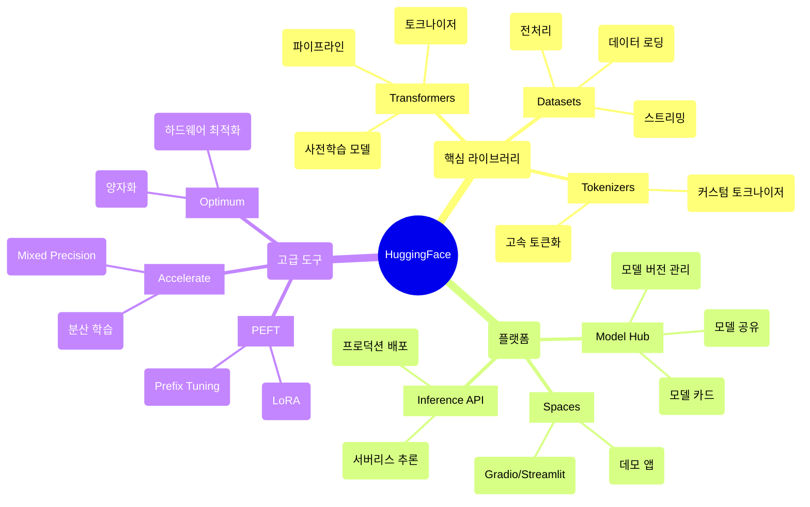
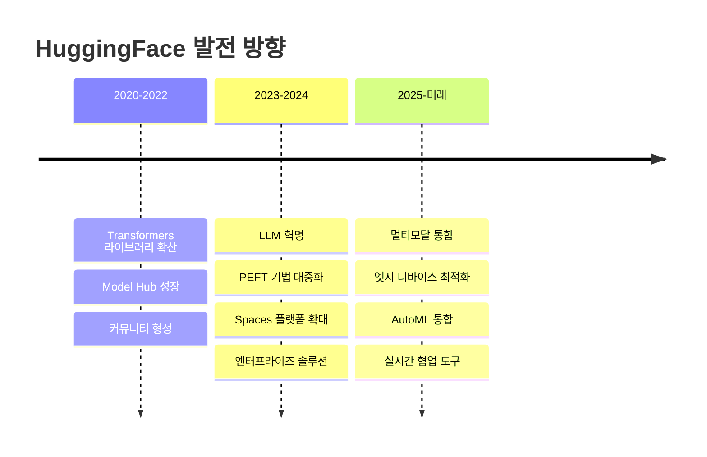

## 📦 사용하는 python package

- transformers==4.46.3
- datasets==3.2.0
- accelerate==1.2.1
- peft==0.14.0
- torch==2.5.1
- tokenizers==0.21.0
- evaluate==0.4.3
- huggingface-hub==0.27.0

## 🚀 TL;DR

- **HuggingFace**는 최신 NLP/AI 모델을 쉽게 사용할 수 있게 해주는 오픈소스 플랫폼이다
- **Transformers 라이브러리**로 3줄의 코드만으로 GPT, BERT 등 최신 모델을 사용할 수 있다
- **Model Hub**에는 100만개 이상의 사전학습된 모델이 공개되어 있으며, 바로 다운로드해서 사용 가능하다
- **AutoClass**를 통해 모델 아키텍처를 자동으로 감지하고 로드할 수 있다
- **Pipeline API**는 복잡한 전처리/후처리를 자동화하여 즉시 추론이 가능하게 한다
- **Trainer API**로 파인튜닝을 단순화하고, **PEFT**로 효율적인 파라미터 튜닝이 가능하다
- **Datasets 라이브러리**로 대규모 데이터셋을 효율적으로 처리하고 스트리밍할 수 있다
- **Accelerate**를 사용하면 분산 학습과 mixed precision 학습을 쉽게 구현할 수 있다

## 📓 실습 Jupyter Notebook

- w.i.p.

## 🎯 HuggingFace 생태계 이해하기

HuggingFace는 단순한 라이브러리가 아닌 **AI 민주화를 위한 완전한 생태계**다. 연구자들이 만든 최신 모델을 누구나 쉽게 사용할 수 있도록 만드는 것이 목표다.



### HuggingFace가 해결하는 문제들

- **복잡한 모델 구현**: 논문의 모델을 직접 구현하는 대신, 검증된 구현체 사용
- **호환성 문제**: 다양한 모델들을 통일된 인터페이스로 사용
- **컴퓨팅 자원**: 이미 학습된 모델을 활용하여 처음부터 학습할 필요 없음
- **재현성**: 모델과 토크나이저를 함께 공유하여 완벽한 재현 가능

## 🏗️ 기초: Transformers 라이브러리 시작하기

### 설치와 기본 설정

```python
# 기본 설치
pip install transformers

# PyTorch와 함께 설치 (권장)
pip install transformers[torch]

# 모든 의존성과 함께 설치
pip install transformers[torch,sentencepiece,tokenizers]
```

### Pipeline API: 3줄로 시작하는 AI

**Pipeline API**는 HuggingFace의 가장 간단한 인터페이스다. 전처리, 모델 추론, 후처리를 자동으로 처리한다.

```python
from transformers import pipeline

# 감정 분석 파이프라인 생성
classifier = pipeline("sentiment-analysis")

# 추론 수행
result = classifier("I love using HuggingFace transformers!")
print(result)
# [{'label': 'POSITIVE', 'score': 0.9998}]

# 여러 텍스트 동시 처리
texts = [
    "This library is amazing!",
    "I'm having issues with the installation.",
    "The documentation could be better."
]
results = classifier(texts)
for text, result in zip(texts, results):
    print(f"{text[:30]}: {result['label']} ({result['score']:.3f})")
# This library is amazing!: POSITIVE (0.999)
# I'm having issues with the in: NEGATIVE (0.998)
# The documentation could be bet: NEGATIVE (0.994)
```

### 다양한 Pipeline 태스크

```python
# 텍스트 생성
generator = pipeline("text-generation", model="gpt2")
result = generator(
    "The future of AI is",
    max_length=50,
    num_return_sequences=2,
    temperature=0.8
)
for idx, item in enumerate(result):
    print(f"Generation {idx+1}: {item['generated_text']}")
# Generation 1: The future of AI is bright and full of possibilities...
# Generation 2: The future of AI is uncertain but exciting as we explore...

# 질의응답
qa_pipeline = pipeline("question-answering")
context = """
HuggingFace was founded in 2016 as a chatbot company. 
The company pivoted to focus on NLP and released the Transformers library in 2019.
Today, it hosts over 1 million models on its platform.
"""
question = "When was the Transformers library released?"
answer = qa_pipeline(question=question, context=context)
print(f"Answer: {answer['answer']}")
print(f"Confidence: {answer['score']:.3f}")
# Answer: 2019
# Confidence: 0.985

# 번역
translator = pipeline("translation", model="Helsinki-NLP/opus-mt-en-ko")
result = translator("Hello, how are you today?")
print(result[0]['translation_text'])
# 안녕하세요, 오늘 어떻게 지내세요?
```

> Pipeline API는 빠른 프로토타이핑에 완벽하지만, 세밀한 제어가 필요한 경우에는 하위 레벨 API를 사용해야 한다.
{: .prompt-tip}

## 🔧 모델과 토크나이저 다루기

### AutoClass: 자동 모델 로딩

**AutoClass**는 모델 아키텍처를 자동으로 감지하고 적절한 클래스를 로드한다.

```python
from transformers import AutoTokenizer, AutoModel, AutoModelForSequenceClassification

# 토크나이저와 모델 자동 로드
model_name = "bert-base-uncased"
tokenizer = AutoTokenizer.from_pretrained(model_name)
model = AutoModel.from_pretrained(model_name)

# 텍스트 토큰화
text = "HuggingFace makes NLP easy!"
inputs = tokenizer(text, return_tensors="pt")
print(f"Input IDs: {inputs['input_ids'][0][:10].tolist()}...")
print(f"Attention Mask: {inputs['attention_mask'][0][:10].tolist()}...")
# Input IDs: [101, 17662, 15066, 2227, 17953, 2968, 4228, 999, 102]...
# Attention Mask: [1, 1, 1, 1, 1, 1, 1, 1, 1]...

# 모델 추론
outputs = model(**inputs)
print(f"Output shape: {outputs.last_hidden_state.shape}")
# Output shape: torch.Size([1, 9, 768])
```

### 토크나이저 심화 이해

토크나이저는 텍스트를 모델이 이해할 수 있는 숫자로 변환하는 핵심 컴포넌트다.

```python
from transformers import AutoTokenizer

tokenizer = AutoTokenizer.from_pretrained("bert-base-uncased")

# 토큰화 과정 상세 분석
text = "I'm learning tokenization!"

# 1. 토큰화만 수행
tokens = tokenizer.tokenize(text)
print(f"Tokens: {tokens}")
# Tokens: ['i', "'", 'm', 'learning', 'token', '##ization', '!']

# 2. 토큰을 ID로 변환
token_ids = tokenizer.convert_tokens_to_ids(tokens)
print(f"Token IDs: {token_ids}")
# Token IDs: [1045, 1005, 1049, 4083, 19204, 3989, 999]

# 3. 한번에 처리 (패딩과 특수 토큰 포함)
encoded = tokenizer(
    text,
    padding="max_length",
    max_length=15,
    truncation=True,
    return_tensors="pt"
)
print(f"Encoded shape: {encoded['input_ids'].shape}")
print(f"Encoded IDs: {encoded['input_ids'][0].tolist()}")
# Encoded shape: torch.Size([1, 15])
# Encoded IDs: [101, 1045, 1005, 1049, 4083, 19204, 3989, 999, 102, 0, 0, 0, 0, 0, 0]

# 4. 디코딩 (ID를 텍스트로)
decoded = tokenizer.decode(encoded['input_ids'][0])
print(f"Decoded: {decoded}")
# Decoded: [CLS] i'm learning tokenization! [SEP] [PAD] [PAD] [PAD] [PAD] [PAD] [PAD]
```

### 특수 토큰과 토크나이저 커스터마이징

```python
# 특수 토큰 확인
print(f"Special tokens: {tokenizer.special_tokens_map}")
# Special tokens: {'unk_token': '[UNK]', 'sep_token': '[SEP]', 'pad_token': '[PAD]', 'cls_token': '[CLS]', 'mask_token': '[MASK]'}

# 새로운 토큰 추가
new_tokens = ["<COMPANY>", "<PERSON>", "<LOCATION>"]
num_added = tokenizer.add_tokens(new_tokens)
print(f"Added {num_added} tokens")

# 모델의 임베딩 레이어 크기 조정 필요
model.resize_token_embeddings(len(tokenizer))

# 커스텀 토큰 사용
text_with_custom = "The <COMPANY> was founded by <PERSON> in <LOCATION>"
encoded = tokenizer(text_with_custom)
decoded = tokenizer.decode(encoded['input_ids'])
print(f"Text with custom tokens: {decoded}")
```

## 🎨 태스크별 모델 활용

### 텍스트 분류

```python
from transformers import AutoModelForSequenceClassification, AutoTokenizer
import torch

# 감정 분석 모델 로드
model_name = "distilbert-base-uncased-finetuned-sst-2-english"
model = AutoModelForSequenceClassification.from_pretrained(model_name)
tokenizer = AutoTokenizer.from_pretrained(model_name)

def classify_sentiment(text):
    # 토큰화
    inputs = tokenizer(text, return_tensors="pt", truncation=True, padding=True)
    
    # 추론
    with torch.no_grad():
        outputs = model(**inputs)
        predictions = torch.nn.functional.softmax(outputs.logits, dim=-1)
    
    # 결과 해석
    label_ids = torch.argmax(predictions, dim=-1)
    scores = predictions[0].tolist()
    
    labels = ["NEGATIVE", "POSITIVE"]
    result = {
        "label": labels[label_ids[0]],
        "scores": {label: score for label, score in zip(labels, scores)}
    }
    return result

# 사용 예시
texts = [
    "This product exceeded my expectations!",
    "Terrible experience, would not recommend.",
    "It's okay, nothing special."
]

for text in texts:
    result = classify_sentiment(text)
    print(f"Text: {text}")
    print(f"Label: {result['label']}")
    print(f"Scores: {result['scores']}")
    print("-" * 50)
```

### 개체명 인식 (NER)

```python
from transformers import AutoModelForTokenClassification, AutoTokenizer
import torch

# NER 모델 로드
model_name = "dbmdz/bert-large-cased-finetuned-conll03-english"
model = AutoModelForTokenClassification.from_pretrained(model_name)
tokenizer = AutoTokenizer.from_pretrained(model_name)

def extract_entities(text):
    # 토큰화 (단어 단위 정렬을 위해 return_offsets_mapping 사용)
    inputs = tokenizer(
        text, 
        return_tensors="pt", 
        truncation=True,
        return_offsets_mapping=True
    )
    
    # 오프셋 맵핑 저장 후 제거 (모델 입력에는 불필요)
    offset_mapping = inputs.pop("offset_mapping")
    
    # 추론
    with torch.no_grad():
        outputs = model(**inputs)
        predictions = torch.argmax(outputs.logits, dim=2)
    
    # 라벨 디코딩
    tokens = tokenizer.convert_ids_to_tokens(inputs["input_ids"][0])
    labels = [model.config.id2label[p.item()] for p in predictions[0]]
    
    # 엔티티 추출
    entities = []
    current_entity = None
    
    for token, label, (start, end) in zip(tokens, labels, offset_mapping[0]):
        if label != "O":  # O는 엔티티가 아님
            if label.startswith("B-"):  # 새로운 엔티티 시작
                if current_entity:
                    entities.append(current_entity)
                current_entity = {
                    "text": text[start:end],
                    "label": label[2:],
                    "start": start.item(),
                    "end": end.item()
                }
            elif label.startswith("I-") and current_entity:  # 엔티티 계속
                current_entity["text"] = text[current_entity["start"]:end]
                current_entity["end"] = end.item()
        else:
            if current_entity:
                entities.append(current_entity)
                current_entity = None
    
    if current_entity:
        entities.append(current_entity)
    
    return entities

# 사용 예시
text = "Apple Inc. was founded by Steve Jobs in Cupertino, California."
entities = extract_entities(text)
for entity in entities:
    print(f"Entity: {entity['text']} - Type: {entity['label']}")
# Entity: Apple Inc. - Type: ORG
# Entity: Steve Jobs - Type: PER
# Entity: Cupertino - Type: LOC
# Entity: California - Type: LOC
```

## 🚄 파인튜닝: 나만의 모델 만들기

### Trainer API를 사용한 파인튜닝

**Trainer API**는 학습 루프를 추상화하여 파인튜닝을 간단하게 만든다.

```python
from transformers import (
    AutoModelForSequenceClassification,
    AutoTokenizer,
    Trainer,
    TrainingArguments,
    DataCollatorWithPadding
)
from datasets import load_dataset
import numpy as np
import evaluate

# 데이터셋 로드
dataset = load_dataset("imdb", split="train[:1000]")  # 데모용으로 일부만 사용
dataset = dataset.train_test_split(test_size=0.2)

# 모델과 토크나이저 로드
model_name = "distilbert-base-uncased"
model = AutoModelForSequenceClassification.from_pretrained(model_name, num_labels=2)
tokenizer = AutoTokenizer.from_pretrained(model_name)

# 데이터 전처리
def tokenize_function(examples):
    return tokenizer(examples["text"], padding="max_length", truncation=True)

tokenized_datasets = dataset.map(tokenize_function, batched=True)

# 평가 메트릭 설정
accuracy = evaluate.load("accuracy")

def compute_metrics(eval_pred):
    predictions, labels = eval_pred
    predictions = np.argmax(predictions, axis=1)
    return accuracy.compute(predictions=predictions, references=labels)

# 학습 설정
training_args = TrainingArguments(
    output_dir="./results",
    evaluation_strategy="epoch",
    save_strategy="epoch",
    learning_rate=2e-5,
    per_device_train_batch_size=16,
    per_device_eval_batch_size=16,
    num_train_epochs=3,
    weight_decay=0.01,
    load_best_model_at_end=True,
    logging_dir="./logs",
    logging_steps=10,
    push_to_hub=False,  # HuggingFace Hub에 업로드하려면 True
)

# 데이터 콜레이터 (동적 패딩)
data_collator = DataCollatorWithPadding(tokenizer=tokenizer)

# Trainer 생성
trainer = Trainer(
    model=model,
    args=training_args,
    train_dataset=tokenized_datasets["train"],
    eval_dataset=tokenized_datasets["test"],
    tokenizer=tokenizer,
    data_collator=data_collator,
    compute_metrics=compute_metrics,
)

# 학습 시작
trainer.train()

# 평가
eval_results = trainer.evaluate()
print(f"Evaluation results: {eval_results}")
# Evaluation results: {'eval_loss': 0.325, 'eval_accuracy': 0.875, ...}

# 모델 저장
trainer.save_model("./my-finetuned-model")
tokenizer.save_pretrained("./my-finetuned-model")
```

### 커스텀 학습 루프

더 세밀한 제어가 필요한 경우 직접 학습 루프를 작성할 수 있다.

```python
import torch
from torch.utils.data import DataLoader
from transformers import AdamW, get_linear_schedule_with_warmup
from tqdm import tqdm

# 데이터로더 생성
train_dataloader = DataLoader(
    tokenized_datasets["train"],
    batch_size=16,
    shuffle=True,
    collate_fn=data_collator
)

# 옵티마이저와 스케줄러 설정
optimizer = AdamW(model.parameters(), lr=2e-5)
num_epochs = 3
num_training_steps = num_epochs * len(train_dataloader)
lr_scheduler = get_linear_schedule_with_warmup(
    optimizer,
    num_warmup_steps=0,
    num_training_steps=num_training_steps
)

# 디바이스 설정
device = torch.device("cuda" if torch.cuda.is_available() else "cpu")
model.to(device)

# 학습 루프
model.train()
for epoch in range(num_epochs):
    total_loss = 0
    progress_bar = tqdm(train_dataloader, desc=f"Epoch {epoch+1}")
    
    for batch in progress_bar:
        # 배치를 디바이스로 이동
        batch = {k: v.to(device) for k, v in batch.items()}
        
        # 순전파
        outputs = model(**batch)
        loss = outputs.loss
        total_loss += loss.item()
        
        # 역전파
        loss.backward()
        
        # 그래디언트 클리핑
        torch.nn.utils.clip_grad_norm_(model.parameters(), 1.0)
        
        # 옵티마이저 스텝
        optimizer.step()
        lr_scheduler.step()
        optimizer.zero_grad()
        
        # 진행 표시
        progress_bar.set_postfix({"loss": loss.item()})
    
    avg_loss = total_loss / len(train_dataloader)
    print(f"Epoch {epoch+1} - Average loss: {avg_loss:.4f}")
```

## 💾 Datasets 라이브러리 활용

### 데이터셋 로딩과 전처리

**Datasets 라이브러리**는 대규모 데이터셋을 효율적으로 처리할 수 있게 해준다.

```python
from datasets import load_dataset, Dataset
import pandas as pd

# HuggingFace Hub에서 데이터셋 로드
dataset = load_dataset("squad", split="train[:1000]")
print(f"Dataset features: {dataset.features}")
print(f"Dataset size: {len(dataset)}")
# Dataset features: {'id': Value(dtype='string'), 'title': Value(dtype='string'), ...}
# Dataset size: 1000

# 데이터셋 필터링
filtered = dataset.filter(lambda x: len(x["context"]) > 100)
print(f"Filtered size: {len(filtered)}")
# Filtered size: 998

# 데이터셋 매핑 (전처리)
def preprocess(examples):
    # 컨텍스트를 소문자로 변환
    examples["context_lower"] = examples["context"].lower()
    # 질문 길이 추가
    examples["question_length"] = len(examples["question"].split())
    return examples

processed = dataset.map(preprocess)
print(f"New columns: {processed.column_names}")
# New columns: ['id', 'title', 'context', 'question', 'answers', 'context_lower', 'question_length']

# 판다스 DataFrame으로/에서 변환
df = dataset.to_pandas()
print(f"DataFrame shape: {df.shape}")
# DataFrame shape: (1000, 5)

# 커스텀 데이터 생성
custom_data = {
    "text": ["Example 1", "Example 2", "Example 3"],
    "label": [0, 1, 0]
}
custom_dataset = Dataset.from_dict(custom_data)
print(f"Custom dataset: {custom_dataset}")
# Custom dataset: Dataset({features: ['text', 'label'], num_rows: 3})
```

### 데이터셋 스트리밍

대용량 데이터셋을 메모리에 모두 로드하지 않고 처리할 수 있다.

```python
# 스트리밍 모드로 데이터셋 로드
dataset = load_dataset("c4", "en", split="train", streaming=True)

# 처음 5개 샘플만 확인
for i, example in enumerate(dataset):
    if i >= 5:
        break
    print(f"Sample {i}: {example['text'][:100]}...")
    
# 배치 처리
def process_batch(batch):
    # 배치 단위 전처리
    batch["text_length"] = [len(text) for text in batch["text"]]
    return batch

# 스트리밍 데이터셋에 map 적용
processed_dataset = dataset.map(process_batch, batched=True, batch_size=100)

# 필터링 (스트리밍 모드에서도 작동)
filtered_dataset = processed_dataset.filter(lambda x: x["text_length"] > 100)
```

## ⚡ PEFT: 효율적인 파인튜닝

**PEFT (Parameter-Efficient Fine-Tuning)** 는 모델의 일부 파라미터만 학습하여 효율적으로 파인튜닝하는 기법이다.

### LoRA를 사용한 효율적 파인튜닝

```python
from peft import LoraConfig, get_peft_model, TaskType
from transformers import AutoModelForCausalLM, AutoTokenizer

# 기본 모델 로드
model_name = "gpt2"
model = AutoModelForCausalLM.from_pretrained(model_name)
tokenizer = AutoTokenizer.from_pretrained(model_name)

# 학습 가능한 파라미터 수 확인 (LoRA 적용 전)
def print_trainable_parameters(model):
    trainable_params = 0
    all_param = 0
    for _, param in model.named_parameters():
        all_param += param.numel()
        if param.requires_grad:
            trainable_params += param.numel()
    print(f"Trainable params: {trainable_params:,} || All params: {all_param:,} || Trainable%: {100 * trainable_params / all_param:.2f}")

print("Before LoRA:")
print_trainable_parameters(model)
# Before LoRA:
# Trainable params: 124,439,808 || All params: 124,439,808 || Trainable%: 100.00

# LoRA 설정
peft_config = LoraConfig(
    task_type=TaskType.CAUSAL_LM,
    inference_mode=False,
    r=8,  # LoRA rank
    lora_alpha=32,  # LoRA scaling parameter
    lora_dropout=0.1,  # LoRA dropout
    target_modules=["c_attn", "c_proj"],  # 적용할 모듈
)

# PEFT 모델 생성
model = get_peft_model(model, peft_config)

print("\nAfter LoRA:")
print_trainable_parameters(model)
# After LoRA:
# Trainable params: 294,912 || All params: 124,734,720 || Trainable%: 0.24

# 학습 가능한 파라미터가 0.24%로 크게 감소!

# 파인튜닝 수행
from transformers import Trainer, TrainingArguments

training_args = TrainingArguments(
    output_dir="./lora-gpt2",
    num_train_epochs=3,
    per_device_train_batch_size=4,
    gradient_accumulation_steps=2,
    warmup_steps=100,
    logging_steps=10,
    save_strategy="epoch",
    evaluation_strategy="epoch",
)

# Trainer로 학습 (일반 파인튜닝과 동일)
trainer = Trainer(
    model=model,
    args=training_args,
    train_dataset=train_dataset,
    eval_dataset=eval_dataset,
    tokenizer=tokenizer,
)

trainer.train()

# 학습된 LoRA 가중치만 저장 (매우 작은 용량)
model.save_pretrained("./lora-weights")
```

### Prefix Tuning과 Prompt Tuning

```python
from peft import PrefixTuningConfig, PromptTuningConfig, get_peft_model

# Prefix Tuning 설정
prefix_config = PrefixTuningConfig(
    task_type=TaskType.CAUSAL_LM,
    num_virtual_tokens=20,  # 가상 토큰 개수
    prefix_projection=True,
)

# 모델에 적용
prefix_model = get_peft_model(model, prefix_config)
print_trainable_parameters(prefix_model)

# Prompt Tuning 설정
prompt_config = PromptTuningConfig(
    task_type=TaskType.CAUSAL_LM,
    num_virtual_tokens=10,
    prompt_tuning_init="TEXT",  # 초기화 방법
    prompt_tuning_init_text="Classify the following text:",
    tokenizer_name_or_path=model_name,
)

# 모델에 적용
prompt_model = get_peft_model(model, prompt_config)
print_trainable_parameters(prompt_model)
```

> PEFT 기법들은 대규모 모델을 제한된 리소스로 파인튜닝할 때 필수적이다. 특히 LoRA는 성능 저하 없이 학습 가능한 파라미터를 99% 이상 줄일 수 있다.
{: .prompt-tip}

## 🚀 Accelerate: 분산 학습과 최적화

**Accelerate**는 분산 학습, mixed precision, 그리고 다양한 하드웨어 설정을 쉽게 처리할 수 있게 해준다.

```python
from accelerate import Accelerator
from torch.utils.data import DataLoader
import torch

# Accelerator 초기화
accelerator = Accelerator(
    mixed_precision="fp16",  # Mixed precision 학습
    gradient_accumulation_steps=4,
)

# 모델, 옵티마이저, 데이터로더 준비
model = AutoModelForSequenceClassification.from_pretrained(model_name)
optimizer = torch.optim.AdamW(model.parameters(), lr=2e-5)
train_dataloader = DataLoader(train_dataset, batch_size=16, shuffle=True)

# Accelerator로 래핑
model, optimizer, train_dataloader = accelerator.prepare(
    model, optimizer, train_dataloader
)

# 학습 루프 (일반 PyTorch와 거의 동일)
for epoch in range(num_epochs):
    model.train()
    for batch in train_dataloader:
        outputs = model(**batch)
        loss = outputs.loss
        
        # Accelerator가 gradient accumulation을 자동 처리
        accelerator.backward(loss)
        
        # Gradient accumulation이 완료되면 옵티마이저 스텝
        if accelerator.sync_gradients:
            accelerator.clip_grad_norm_(model.parameters(), 1.0)
            optimizer.step()
            optimizer.zero_grad()
    
    # 모든 프로세스 동기화
    accelerator.wait_for_everyone()
    
    # 메인 프로세스에서만 저장
    if accelerator.is_main_process:
        accelerator.save_model(model, f"checkpoint-epoch-{epoch}")
```

### DeepSpeed 통합

```python
# accelerate config 파일 생성
accelerate_config = {
    "deepspeed_config": {
        "zero_stage": 2,  # ZeRO optimization stage
        "offload_optimizer_device": "cpu",
        "offload_param_device": "cpu",
        "zero3_init_flag": True,
        "gradient_accumulation_steps": 4,
        "gradient_clipping": 1.0,
        "fp16": {
            "enabled": True,
            "loss_scale": 0,
            "loss_scale_window": 1000,
        }
    }
}

# DeepSpeed로 Accelerator 초기화
accelerator = Accelerator(
    deepspeed_plugin=DeepSpeedPlugin(hf_ds_config=accelerate_config),
)
```

## 🌐 Model Hub와 커뮤니티 활용

### 모델 업로드와 공유

````python
from huggingface_hub import HfApi, create_repo, upload_folder

# Hub API 초기화
api = HfApi()

# 리포지토리 생성
repo_id = "username/my-awesome-model"
create_repo(repo_id, token="your_token", private=False)

# 모델과 토크나이저 저장
model.save_pretrained("./my-model")
tokenizer.save_pretrained("./my-model")

# Model Card 작성
model_card = """
---
language: en
tags:
- text-classification
- sentiment-analysis
datasets:
- imdb
metrics:
- accuracy
---

# My Awesome Model

This model is fine-tuned for sentiment analysis on movie reviews.

## Training Data
The model was trained on the IMDB dataset.

## Performance
- Accuracy: 92.5%
- F1 Score: 0.92

## Usage

```python
from transformers import pipeline
classifier = pipeline("sentiment-analysis", model="username/my-awesome-model")
result = classifier("This movie is fantastic!")
```
"""

with open("./my-model/README.md", "w") as f: f.write(model_card)

# Hub에 업로드

upload_folder( folder_path="./my-model", repo_id=repo_id, token="your_token" )

````

### Model Card와 메타데이터

```python
from transformers import AutoModel

# 모델 로드 시 revision 지정
model = AutoModel.from_pretrained(
    "username/my-model",
    revision="v1.0.0",  # 특정 버전
)

# 모델 정보 가져오기
from huggingface_hub import model_info

info = model_info("bert-base-uncased")
print(f"Model downloads: {info.downloads}")
print(f"Model likes: {info.likes}")
print(f"Model tags: {info.tags}")
````

## 🔬 고급 기법과 최적화

### 양자화(Quantization)

모델 크기를 줄이고 추론 속도를 향상시키는 양자화 기법이다.

```python
from transformers import AutoModelForCausalLM, BitsAndBytesConfig
import torch

# 8-bit 양자화 설정
quantization_config = BitsAndBytesConfig(
    load_in_8bit=True,
    bnb_8bit_compute_dtype=torch.float16,
)

# 양자화된 모델 로드
model = AutoModelForCausalLM.from_pretrained(
    "facebook/opt-6.7b",
    quantization_config=quantization_config,
    device_map="auto",
)

# 모델 크기 비교
def get_model_size(model):
    param_size = 0
    for param in model.parameters():
        param_size += param.nelement() * param.element_size()
    buffer_size = 0
    for buffer in model.buffers():
        buffer_size += buffer.nelement() * buffer.element_size()
    size_mb = (param_size + buffer_size) / 1024 / 1024
    return size_mb

print(f"Quantized model size: {get_model_size(model):.2f} MB")
# 원본 대비 약 75% 크기 감소
```

### 모델 병합과 앙상블

```python
from transformers import AutoModelForSequenceClassification
import torch
import numpy as np

# 여러 모델 로드
model_names = [
    "distilbert-base-uncased-finetuned-sst-2-english",
    "bert-base-uncased-finetuned-sst-2",
    "roberta-base-finetuned-sst-2"
]

models = []
tokenizers = []
for name in model_names:
    models.append(AutoModelForSequenceClassification.from_pretrained(name))
    tokenizers.append(AutoTokenizer.from_pretrained(name))

def ensemble_predict(text, models, tokenizers):
    all_predictions = []
    
    for model, tokenizer in zip(models, tokenizers):
        inputs = tokenizer(text, return_tensors="pt", truncation=True, padding=True)
        with torch.no_grad():
            outputs = model(**inputs)
            probs = torch.nn.functional.softmax(outputs.logits, dim=-1)
            all_predictions.append(probs.numpy())
    
    # 평균 앙상블
    avg_prediction = np.mean(all_predictions, axis=0)
    final_class = np.argmax(avg_prediction)
    confidence = np.max(avg_prediction)
    
    return {
        "class": final_class,
        "confidence": confidence,
        "all_predictions": all_predictions
    }

# 앙상블 예측
text = "This movie is absolutely wonderful!"
result = ensemble_predict(text, models, tokenizers)
print(f"Ensemble prediction: Class {result['class']} with {result['confidence']:.3f} confidence")
```

### 커스텀 모델 아키텍처

```python
from transformers import PreTrainedModel, PretrainedConfig
import torch.nn as nn

# 커스텀 설정 클래스
class CustomModelConfig(PretrainedConfig):
    model_type = "custom_model"
    
    def __init__(
        self,
        vocab_size=30522,
        hidden_size=768,
        num_classes=2,
        dropout=0.1,
        **kwargs
    ):
        super().__init__(**kwargs)
        self.vocab_size = vocab_size
        self.hidden_size = hidden_size
        self.num_classes = num_classes
        self.dropout = dropout

# 커스텀 모델 클래스
class CustomModel(PreTrainedModel):
    config_class = CustomModelConfig
    
    def __init__(self, config):
        super().__init__(config)
        self.embeddings = nn.Embedding(config.vocab_size, config.hidden_size)
        self.lstm = nn.LSTM(
            config.hidden_size, 
            config.hidden_size, 
            batch_first=True,
            bidirectional=True
        )
        self.dropout = nn.Dropout(config.dropout)
        self.classifier = nn.Linear(config.hidden_size * 2, config.num_classes)
        
        # 가중치 초기화
        self.init_weights()
    
    def forward(self, input_ids, attention_mask=None, labels=None):
        # 임베딩
        embeddings = self.embeddings(input_ids)
        
        # LSTM
        lstm_out, _ = self.lstm(embeddings)
        
        # 마지막 은닉 상태 사용
        pooled_output = lstm_out[:, -1, :]
        pooled_output = self.dropout(pooled_output)
        
        # 분류
        logits = self.classifier(pooled_output)
        
        loss = None
        if labels is not None:
            loss_fct = nn.CrossEntropyLoss()
            loss = loss_fct(logits, labels)
        
        return {"loss": loss, "logits": logits}

# 커스텀 모델 사용
config = CustomModelConfig()
model = CustomModel(config)

# HuggingFace 생태계와 완벽 호환
model.save_pretrained("./my-custom-model")
loaded_model = CustomModel.from_pretrained("./my-custom-model")
```

## 🎯 실전 팁과 베스트 프랙티스

### 메모리 최적화 전략

```python
# Gradient Checkpointing으로 메모리 절약
model.gradient_checkpointing_enable()

# Mixed Precision Training
from torch.cuda.amp import autocast, GradScaler

scaler = GradScaler()

for batch in dataloader:
    with autocast():
        outputs = model(**batch)
        loss = outputs.loss
    
    scaler.scale(loss).backward()
    scaler.step(optimizer)
    scaler.update()

# 배치 크기 동적 조정
def find_optimal_batch_size(model, initial_batch_size=32):
    batch_size = initial_batch_size
    while batch_size > 1:
        try:
            # 테스트 배치 실행
            dummy_input = torch.randn(batch_size, 512).to(device)
            _ = model(dummy_input)
            torch.cuda.empty_cache()
            return batch_size
        except RuntimeError as e:
            if "out of memory" in str(e):
                batch_size //= 2
                torch.cuda.empty_cache()
            else:
                raise e
    return 1
```

### 캐싱과 성능 최적화

```python
from functools import lru_cache
from transformers import AutoTokenizer

# 토크나이저 캐싱
@lru_cache(maxsize=None)
def get_cached_tokenizer(model_name):
    return AutoTokenizer.from_pretrained(model_name)

# 모델 출력 캐싱
from transformers import AutoModel
import hashlib

class CachedModel:
    def __init__(self, model_name):
        self.model = AutoModel.from_pretrained(model_name)
        self.cache = {}
    
    def get_embeddings(self, text):
        # 텍스트 해시를 캐시 키로 사용
        text_hash = hashlib.md5(text.encode()).hexdigest()
        
        if text_hash in self.cache:
            return self.cache[text_hash]
        
        # 캐시 미스 시 계산
        inputs = tokenizer(text, return_tensors="pt")
        with torch.no_grad():
            outputs = self.model(**inputs)
        
        embeddings = outputs.last_hidden_state.mean(dim=1)
        self.cache[text_hash] = embeddings
        
        return embeddings
```

### 디버깅과 모니터링

```python
from transformers import TrainerCallback
import wandb

class CustomCallback(TrainerCallback):
    def on_log(self, args, state, control, logs=None, **kwargs):
        # 커스텀 로깅
        if logs:
            print(f"Step {state.global_step}: Loss = {logs.get('loss', 'N/A')}")
            
            # Weights & Biases 로깅
            if wandb.run is not None:
                wandb.log(logs, step=state.global_step)
    
    def on_epoch_end(self, args, state, control, **kwargs):
        # 에폭 종료 시 체크포인트
        print(f"Epoch {state.epoch} completed!")
        
    def on_train_end(self, args, state, control, **kwargs):
        # 학습 종료 시 최종 메트릭
        print("Training completed!")
        print(f"Best metric: {state.best_metric}")

# Trainer에 콜백 추가
trainer = Trainer(
    model=model,
    args=training_args,
    callbacks=[CustomCallback()],
    # ...
)
```

## 🌟 핵심 포인트 정리

HuggingFace는 단순한 라이브러리를 넘어 **AI 민주화의 핵심 플랫폼**으로 자리잡았다. 앞으로도 다음과 같은 발전이 예상된다.



- **Pipeline API**로 3줄 만에 AI 모델 사용 가능
- **AutoClass**로 모든 모델을 통일된 인터페이스로 활용
- **Trainer API**로 복잡한 학습 과정 간소화
- **PEFT**로 대규모 모델도 효율적으로 파인튜닝
- **Model Hub**를 통한 지식 공유와 협업

> HuggingFace를 마스터하는 것은 현대 AI 개발의 필수 역량이다. 기초부터 차근차근 학습하되, 실제 프로젝트에 적용하면서 경험을 쌓는 것이 중요하다.
{: .prompt-tip}