## 📦 사용하는 패키지/기술 버전 정보

- numpy==1.26.4
- pandas==2.0.3
- scikit-learn==1.3.0
- matplotlib==3.7.2
- seaborn==0.12.2
- torch==2.0.1

## 🚀 TL;DR

- **추천 시스템**은 개인화를 위한 AI/ML의 핵심 분야로, 사용자와 아이템 간의 상호작용을 모델링하여 비즈니스 가치를 창출한다
- **개인화 AI/ML(PML)** 의 특징은 **주관적(Subjective)** 태스크이며 **사용자 상호작용 시스템**으로 시간에 따라 동적으로 변화한다
- 템포럴 다이나믹스는 **트렌드, 시즈널리티, 사이클, 디스터벤스 이레귤러리티** 4가지 요소로 구성된다
- 추천 시스템의 핵심 문제는 **Top-K 랭킹**(암시적 피드백 기반)과 **평점 예측**(명시적 피드백 기반)으로 구분된다
- 전통적 분류는 **콘텐츠 기반**, **협업 필터링**, **맥락 인식** 방법으로 사용하는 데이터 형태에 따라 구분된다
- 빅테크 기업들의 전체 상품/콘텐츠 노출에서 추천 시스템이 차지하는 비율은 35~75%에 이른다
- **LLM의 등장**으로 기존의 **표현 학습 + 호환성 함수** 패러다임에서 **모든 데이터를 자연어로 변환**하는 새로운 패러다임으로 전환되고 있다

## 📓 실습 Jupyter Notebook

- w.i.p.

## 🎯 개인화를 위한 AI/ML과 추천 시스템 예시

### 개인화의 정의와 중요성

**개인화(Personalization)** 는 서비스 제공자가 개인에 대한 정보를 바탕으로 콘텐츠 제공 및 소통 등의 사용자 경험을 조정하는 행위를 의미한다.

**개인화 AI/ML의 주요 서브 도메인들**

- **추천 시스템 및 개인화 광고**: 사용자의 선호도 모델링을 통한 비즈니스 목표 달성
- **개인화 학습 및 교육**: 개인의 지식 수준을 고려한 맞춤형 커리큘럼 제공
- **퍼스널라이즈드 헬스케어**: 환자의 질병 진단 및 약품 처방 이력을 바탕으로 미래 질병 위험도 예측 및 개인화된 치료

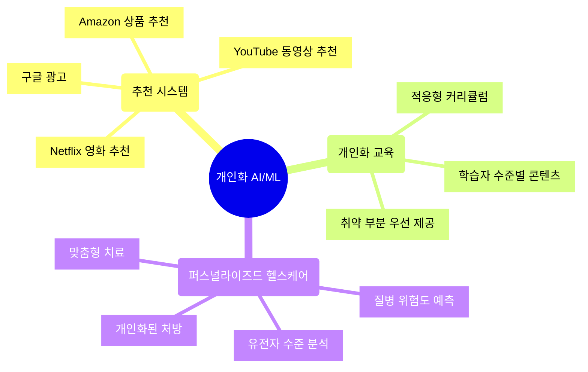

### 개인화 교육의 혁신

**기존 교육 방식의 한계**

- 학생의 성취도와 관계없이 **선형적인 커리큘럼**으로 진행
- 개인의 학습 수준을 고려하지 않는 일률적 교육

**AI/ML 기반 개인화 교육**

- 머신러닝을 활용하여 **학생의 개인 지식 수준을 파악**
- **적응형 커리큘럼**을 통해 학생에게 취약한 부분을 우선적으로 제공
- 더 나은 학업 성취도 기대 가능

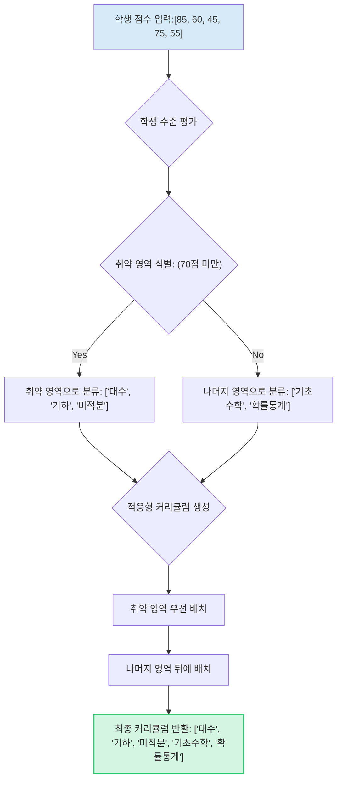

### 퍼스널라이즈드 헬스케어의 응용

**진단 예측(Diagnosis Prediction)**

- 환자의 질병 진단 이력을 바탕으로 미래의 질병을 예측

**유전자 수준의 개인화 치료**

- 유전자 수준의 분석을 통해 **맞춤형 질병 치료** 제공
- 환자의 개인 특성 및 건강 상태를 고려한 **개인화된 처방**

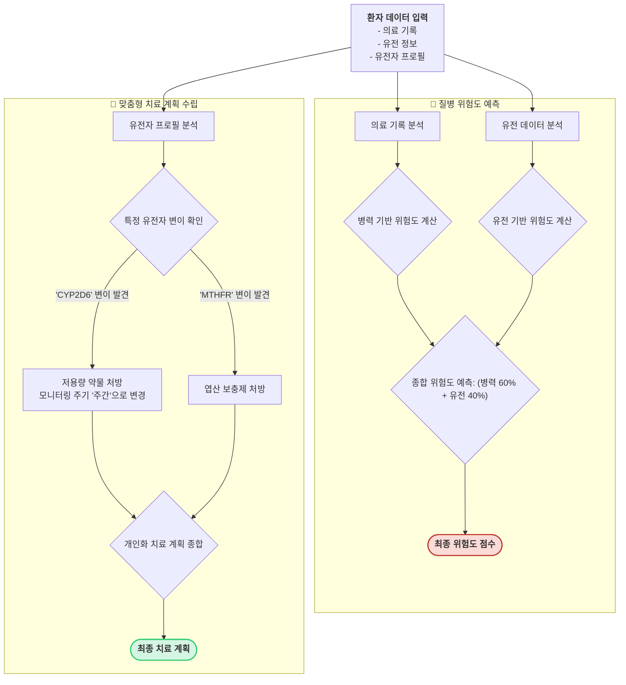

## 🧠 퍼스널라이즈드 머신러닝(PML)의 특징

개인화 AI의 중심에는 **퍼스널라이즈드 머신러닝(Personalized Machine Learning, PML)** 이 있다. PML은 기존의 컴퓨터 비전이나 자연어처리 분야와 구별되는 고유한 특징을 가진다.

### 1. 주관적(Subjective) AI

태스크의 객관성/주관성 스펙트럼

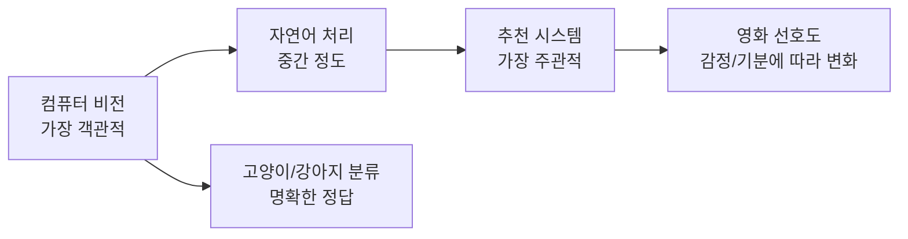

**컴퓨터 비전의 객관성**

- 사람의 감정이나 기분 상태와 관계없이 명확한 정답 레이블 존재
- 외부 요인이나 시간의 흐름과 관계없이 일정하고 객관적인 정답

**추천 시스템의 주관성**

- 사람의 감정이나 기분과 명확한 연관성
- 그때그때 상태에 따라 실제 피드백이 상이할 수 있음
- 사용자의 특정 아이템에 대한 선호도는 순간의 감정이나 기분에 따라 달라짐

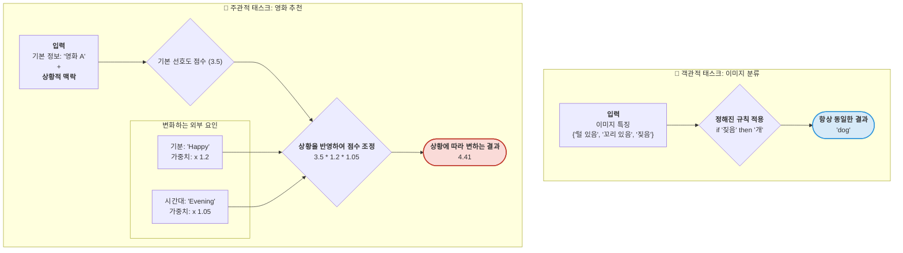

### 2. 사용자 상호작용 시스템

추천 시스템의 핵심적인 특징

**피드백 루프(Feedback Loop)**

- 생성된 추천 결과가 사용자의 선호도에 영향을 미침
- 사용자의 이력이 데이터셋으로 들어가서 모델 학습에 사용됨

**템포럴 다이나믹스(Temporal Dynamics)**: 시간의 흐름에 따라 사용자의 선호도 및 아이템 특성이 변할 수 있으며, 다음 4가지 시계열 요소로 표현된다.

1. **트렌드(Trend)**: 장기적인 증감 패턴
2. **시즈널리티(Seasonality)**: 주기적인 패턴 (계절성)
3. **사이클(Cycle)**: 불규칙한 주기적 변동
4. **디스터번스 이레귤러리티(Disturbance Irregularity)**: 예측 불가능한 무작위 변동


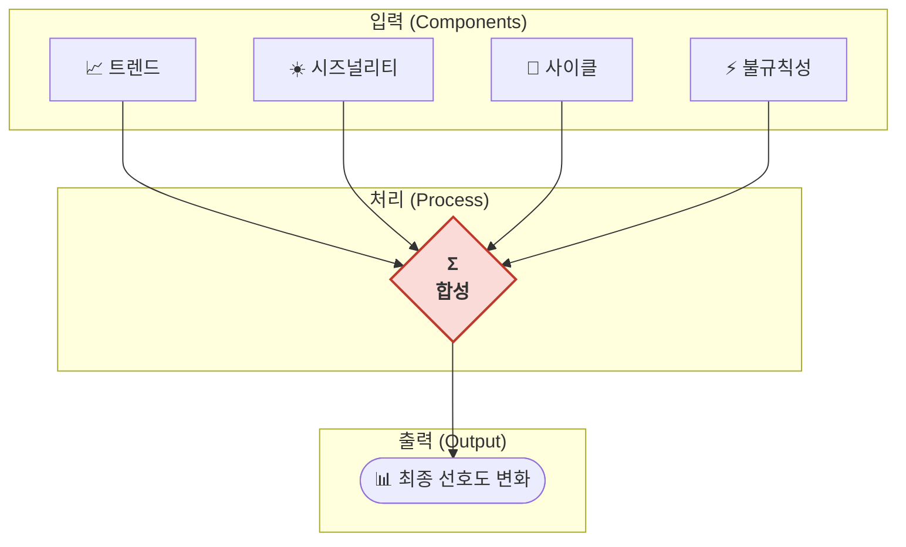

> 지난주까지 즐겨 들었던 음악이 오늘 갑자기 지루하게 느껴지거나, 잘 팔리던 패션 상품이 계절성이나 유행으로 인해 인기가 시들해지는 현상이 템포럴 다이나믹스의 대표적 예시이다.
{: .prompt-tip}

## 📚 추천 시스템의 정의와 목적

### 추천 시스템 정의

다양한 문헌에서 제시하는 추천 시스템 정의

- **위키피디아**: 특정 사용자와 가장 관련성이 높은 항목에 대한 제안을 제공하는 정보 필터링 시스템의 하위 태스크
- **2010년 교재**: 사용자에게 유용한 항목을 제안하는 소프트웨어 도구 및 기술
- **2022년 최신 교재**: 사용자와 아이템 간의 상호작용을 모델링하는 기본적인 도구

> **통합된 정의**: 추천 시스템은 사용자와 아이템 그리고 그것들 간의 상호작용을 다루는 응용 과학(Applied Science)의 일종으로, 웹 또는 모바일을 통해 수집되는 대용량 데이터를 활용해서 비즈니스 가치를 창출하는 중요한 도구이다. 
{: .prompt-tip}

### 추천 시스템의 목적

- **새로운 경험 제공**: 사용자에게 새로운 콘텐츠나 좋아할 만한 콘텐츠 제공
- **개인화된 경험**: 사용자의 서비스 체류 시간 증가
- **비즈니스 목표 달성**: 사용자의 아이템에 대한 선호도 모델링을 통한 수익 창출

## 🎯 추천 시스템의 핵심 문제 정의

### 1. Top-K 랭킹 문제

**Top-K 랭킹**은 사용자에게 적합한 Top-K개의 아이템을 추천하는 태스크이다.

**특징**

- **암시적 피드백(Implicit Feedback)** 기반
- 올바른 선호도 순서로 정렬이 중요 (정확한 수치값은 불필요)
- 사용자의 클릭, 구매, 조회 이력 등을 활용

**예시**: 사용자의 아이템 클릭 이력을 바탕으로 새로운 아이템을 구매할 확률 예측

```mermaid
graph TD
    subgraph "데이터 수집 및 기록"
        A[사용자 행동 감지: 클릭, 구매, 조회 등] --> B{"record_interaction()"}
        B --> C[사용자 상호작용 DB 업데이트]
    end

    subgraph "Top-K 아이템 추천 (predict_top_k_items())"
        D[추천 요청: User_ID, K] --> E[User_ID의 기존 상호작용 아이템 조회]
        E --> F{제외 대상 아이템 필터링}
        F --> G["추천 후보 아이템 목록 생성 (미상호작용 아이템)"]

        G --> H{후보 아이템별 '점수' 계산}
        H -- "예: Random Score (실제: ML 모델 예측)" --> I[아이템별 점수 목록]
        I --> J[점수 기준 내림차순 정렬]
        J --> K[상위 K개 아이템 선택]
        K --> L[Top-K 추천 목록 반환]
    end

    subgraph "추천 성능 평가 (evaluate_precision_at_k())"
        M[추천 목록] --> N{Precision@K 계산}
        O["실제 관련 아이템 목록 (Ground Truth)"] --> N
        N -- "겹치는 아이템 수 / K" --> P[Precision@K 결과]
    end

    A -- "시작" --> D
    L -- "평가 필요 시" --> M
```

**평가 지표**

- **Precision@K**: 추천된 K개 중 실제로 관련 있는 아이템 비율
- **Recall@K**: 관련 있는 전체 아이템 중 추천된 아이템 비율
- **NDCG@K**: 순서를 고려한 정규화된 할인 누적 이득

### 2. 평점 예측 문제

**Rating Prediction**은 사용자가 아이템에 가진 선호도 값을 정확하게 예측하는 태스크이다.

**특징**

- **명시적 피드백(Explicit Feedback)** 기반
- 평점, 별점, 좋아요/싫어요 등의 직접적 선호도 표현
- MovieLens 데이터셋이 대표적 사례

**예시**: 사용자가 영화 '아이언맨'에 매길 평점을 1점에서 5점 사이의 값으로 예측

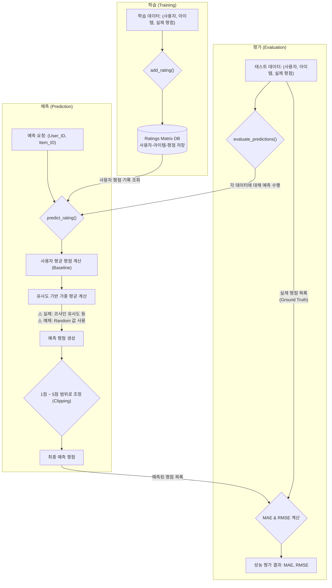


**평가 지표**

- **MAE (Mean Absolute Error)**: 평균 절대 오차
- **RMSE (Root Mean Square Error)**: 평균 제곱근 오차

### 3. 예외 케이스: CTR 예측

**CTR Prediction Task**: 암시적 피드백을 바탕으로 클릭률(Click Through Rate)을 예측하는 태스크

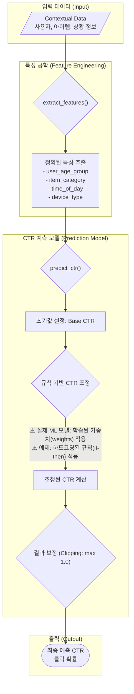

## 🔄 전통적인 추천 시스템 분류

### 복잡한 전통적 분류의 한계

기존의 추천 시스템 분류는 다음과 같이 복잡하게 구성되어 있었다.

- **인기도 기반 추천**: 아이템의 인기도, 구매 횟수 등 카운트에 기반한 **비개인화 추천**으로, 개인화 추천이라 보기 어려운 방법
- **연관석 분석**: 과거에 많이 사용되던 기법
- **정보 필터링**: 콘텐츠 기반 필터링, 협업 필터링, 하이브리드 필터링 등으로 복잡하게 세분화

### 간략화된 분류 체계

추천 시스템을 **사용하는 데이터의 형태**에 따라 크게 세 가지로 분류할 수 있다.

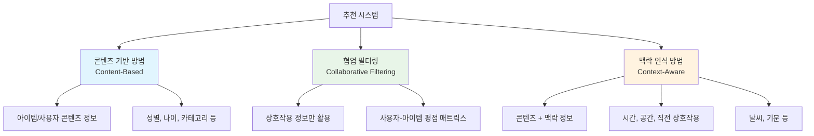

### 데이터 사용 패턴

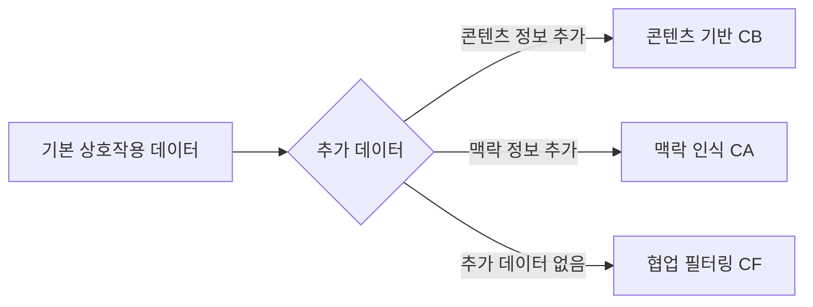

> 기본적으로는 상호작용 데이터가 모든 방법론에서 사용되며, 여기에 어떤 추가 데이터를 사용하느냐에 따라 방법론이 구분된다.
{: .prompt-tip}

### 1. 콘텐츠 기반 방법(Content-Based)

**아이템과 사용자의 콘텐츠 정보**를 주로 활용하는 방법

사용 데이터

- 사용자: 성별, 나이, 직업, 거주지역 등
- 아이템: 카테고리, 장르, 가격, 브랜드 등

**전체 흐름**

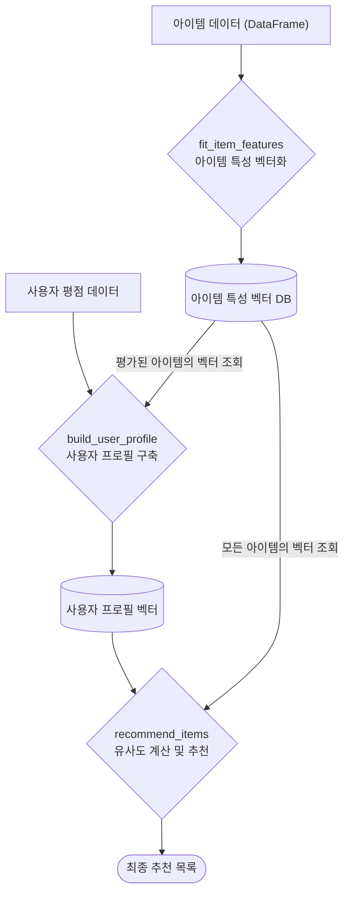


**아이템 특성 벡터화 (`fit_item_features`) 구조**

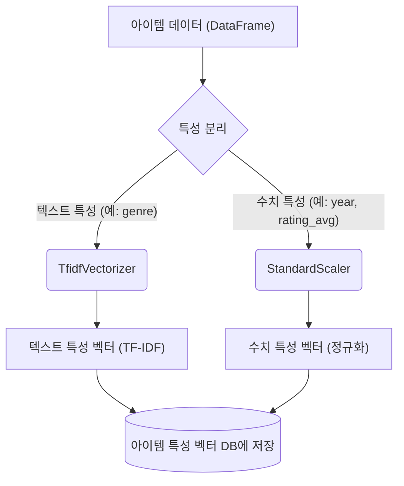

**사용자 프로필 구축 및 추천 (`build_user_profile` & `recommend_items`) 구조**

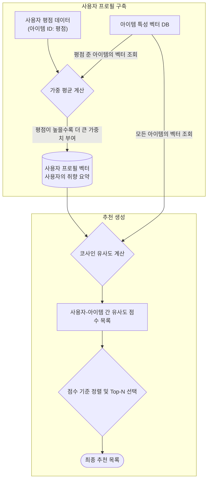

### 2. 협업 필터링(Collaborative Filtering)

**상호작용 정보만**을 활용하는 방법으로, 추천 시스템의 핵심 방법론이다.

**핵심 아이디어**: "비슷한 취향을 가진 사용자들은 미래에도 비슷한 아이템을 좋아할 것이다"

**전체 흐름**

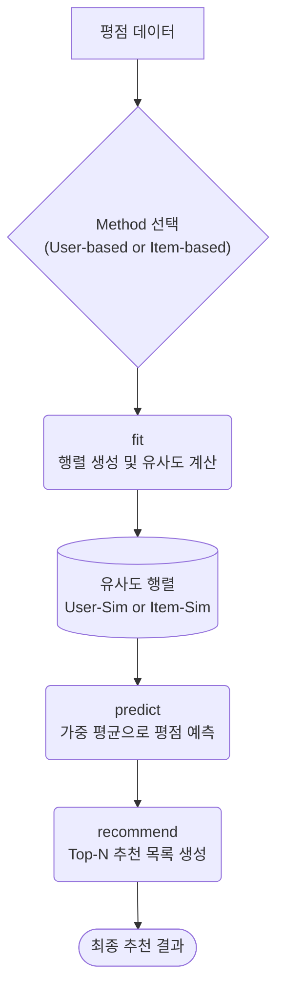

**`fit` 단계 상세 흐름도: 유사도 행렬 계산하기**

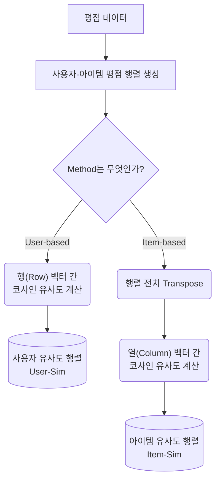

**`predict` 단계 비교 흐름도: 두 방식의 예측 로직**

```mermaid
graph TD
    subgraph "사용자 기반 (User-based) 예측"
        A["Target: (User A, Item X)"] --> B(Item X를 평가한<br>다른 사용자 찾기);
        B --> C(User-Sim 행렬에서<br>User A와의 유사도 조회);
        C --> D(유사도 Top-K 사용자 선택);
        D --> E(선택된 사용자의 'Item X 평점'을<br><b>사용자 유사도</b>로 가중 평균);
        E --> F([예측 평점]);
    end

    subgraph "아이템 기반 (Item-based) 예측"
        G["Target: (User A, Item X)"] --> H(User A가 평가한<br>다른 아이템 찾기);
        H --> I(Item-Sim 행렬에서<br>Item X와의 유사도 조회);
        I --> J(유사도 Top-K 아이템 선택);
        J --> K(선택된 아이템에 대한 'User A의 평점'을<br><b>아이템 유사도</b>로 가중 평균);
        K --> L([예측 평점]);
    end
```


### 3. 맥락 인식 방법(Context-Aware)

**콘텐츠 정보 + 시간, 공간, 상황 등의 맥락 정보**를 함께 활용하는 방법

맥락 정보 예시

- **시간**: 시간대, 요일, 계절
- **공간**: 위치, 날씨
- **상황**: 직전 상호작용 아이템, 기분, 동반자


**전체 흐름**

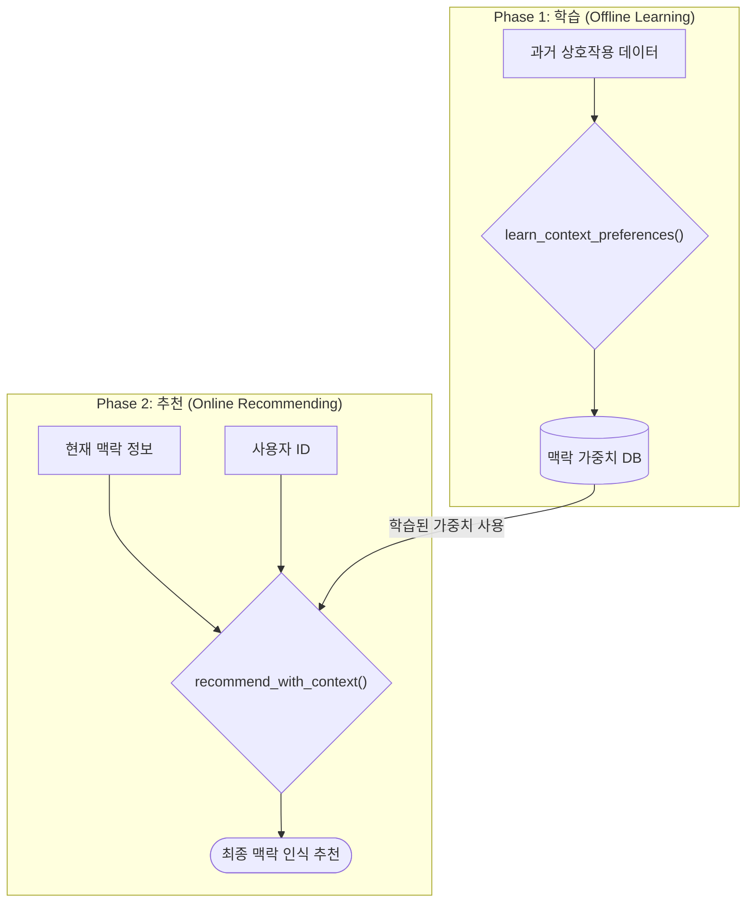

`learn_context_preferences` 상세 흐름도: 맥락 학습하기

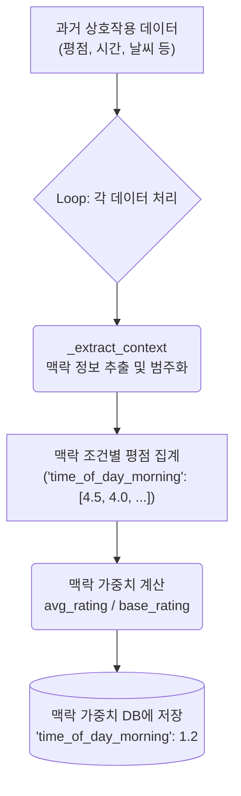

**`recommend_with_context` 상세 흐름도: 맥락으로 추천하기**

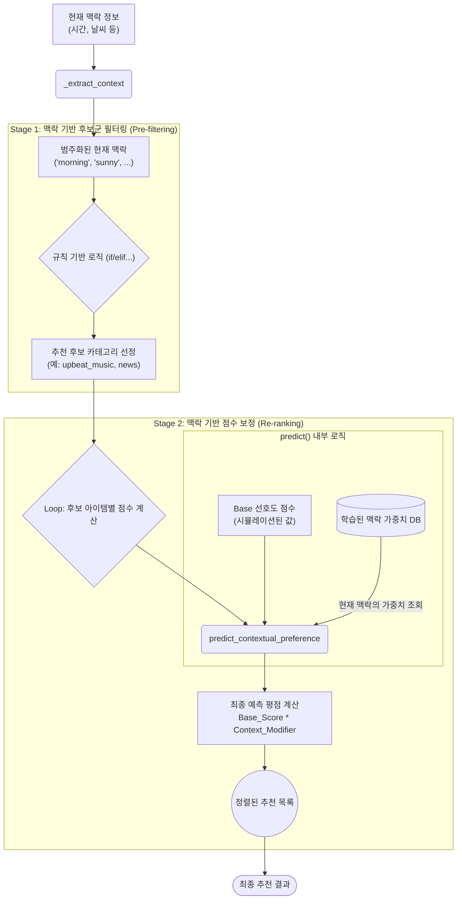

## 📈 추천 알고리즘의 발전 과정

```mermaid
timeline
    title 추천 알고리즘 발전사
    
    2000년대 초 : 메모리 기반 CF
                : 아이템 기반 CF
                : 사용자 기반 CF
                
    2006-2009 : 넷플릭스 프라이즈
              : 모델 기반 CF 등장
              : SVD, NMF 활용
              : 컨텍스트 어웨어 추천
              
    2010-2014 : 다양한 모델 등장
              : 비딥러닝 기반 모델 연구
              
    2015 : AutoRec 등장
         : 오토인코더 기반 모델 시초
         
    2016 : GRU4Rec 등장
         : RNN을 시퀀셜 추천에 적용
         : 딥러닝 기반 모델 주류화
         
    2017 : 트랜스포머 등장
         : Neural CF 등장
         : 딥러닝 기반 CF 확산
         
    2018 : 딥러닝 연구 다양화
         : Multi-VAE, SASRec, KGAT 등장
         
    2019-2021 : GNN, 오토인코더, 트랜스포머
              : 다양한 딥러닝 구조 적용
              
    2022-현재 : LLM 기반 추천
              : ChatGPT, LLaMA 등장
              : 자연어 처리 통합
```

### 비즈니스 임팩트

**맥킨지 보고서**에 따르면,

- 빅테크 기업에서 전체 상품/콘텐츠 노출의 **35~75%** 가 추천 시스템을 통해 이루어진다고 한다.
- 딥러닝 도입 기업들의 성능 향상: **9~40%**
- 넷플릭스, 유튜브뿐만 아니라 **월마트** 같은 전통 리테일에서도 긍정적 효과

{: .width-75 .center}

## 🚀 LLM 시대의 패러다임 전환

### 기존 패러다임: 표현 학습 + 호환성 함수

**전통적인 추천 시스템 모델링**은 두 가지 요소의 조합으로 구성되었다.

#### 1. 표현 학습(Representation Learning)

사용자, 아이템, 컨텍스트를 어떻게 표현할 것인가에 대한 고민하게 되었다.

- **원핫 인코딩** 또는 **저차원 표현**(임베딩 벡터) 학습
- 아이템 이미지 표현을 위한 **CNN 구조** 활용
- 아이템 시퀀스 활용을 위한 **RNN** 활용
- 주어진 데이터로부터 알맞은 정보를 추출하고 표현하기 위한 일련의 고려사항

#### 2. 호환성 함수(Compatibility Function)

표현 학습으로 얻어진 정보를 활용하여 사용자와 아이템의 일치 정도(선호도)를 나타내는 함수

- **내적(Dot Product)**: $f(u, i) = u^T \cdot i$
- **코사인 유사도**: $f(u, i) = \frac{u^T \cdot i}{||u|| \cdot ||i||}$
- **MLP**: $f(u, i) = MLP([u; i])$
- **어텐션 메커니즘**: $f(u, i) = \text{Attention}(u, i)$

### 모델링 과정의 도식화

```mermaid
flowchart TD
    A[로우 데이터<br/>사용자-아이템 로그] --> B[데이터 변환<br/>U-I 페어 또는 U-I-C 페어]
    B --> C[표현 학습<br/>Representation Learning]
    C --> D[호환성 모델링<br/>Compatibility Function]
    D --> E[개인화된 예측<br/>Personalized Prediction]
    
    C --> C1[사용자 임베딩]
    C --> C2[아이템 임베딩]
    C --> C3[컨텍스트 표현]
    
    D --> D1[내적]
    D --> D2[코사인 유사도]  
    D --> D3[MLP]
    D --> D4[어텐션]
    
    style A fill:#f9f9f9
    style E fill:#e8f5e8
```

### CF 분야의 표현 학습 분류

협업 필터링에서 활용되는 다양한 표현 학습 방법론들

```mermaid
mindmap
  root((현대 추천 시스템<br>구성 요소))
    ::icon(fa fa-cogs)
    🧩 표현 학습 (Representation Learning)
      ::icon(fa fa-brain)
      전통적 방법 (Traditional)
        Matrix Factorization
          ::icon(fa fa-table-cells)
          SVD
          NMF
          PMF
        Neighborhood
          ::icon(fa fa-users)
          UserKNN
          ItemKNN
      딥러닝 기반 (Deep Learning)
        Autoencoder
          ::icon(fa fa-arrows-left-right-to-line)
          AutoRec
          Multi-VAE
        Neural CF
          ::icon(fa fa-network-wired)
          NCF
          DeepFM
        Sequential
          ::icon(fa fa-timeline)
          GRU4Rec
          BERT4Rec
        Graph Neural
          ::icon(fa fa-share-nodes)
          NGCF
          LightGCN
    🤝 호환성 함수 (Compatibility Function)
      ::icon(fa fa-handshake)
      선형 함수 (Linear)
        ::icon(fa fa-ruler-combined)
        내적 (Dot Product)
        코사인 유사도 (Cosine Similarity)
      비선형 함수 (Non-linear)
        ::icon(fa fa-wave-square)
        MLP
        Attention
```


**구성 요소들의 시스템 아키텍쳐**

```mermaid
graph TD
    A["입력 데이터<br>(사용자-아이템 상호작용)"];

    subgraph "🧩 1. 표현 학습 (Representation Learning)"
        B["다양한 학습 모델<br>(예: NCF, LightGCN, SVD...)"];
    end

    C[(생성된 임베딩<br>사용자 벡터 & 아이템 벡터)];

    subgraph "🤝 2. 호환성 함수 (Compatibility Function)"
        D["궁합 측정 함수<br>(예: 내적, MLP...)"];
    end

    E(["최종 예측 점수<br>(평점, 클릭 확률 등)"]);

    A --> B;
    B --> C;
    C --> D;
    D --> E;

    style B fill:#e3f2fd,stroke:#333
    style D fill:#e8f5e9,stroke:#333
```


### 기존 패러다임의 한계

기존 모델링 패러다임에는 다음과 같은 **두 가지 한계(Limitation)** 가 존재한다.

#### 1. 광범위한 응용 시나리오

- 추천 시스템이 적용되는 시나리오들이 너무 다양함
- 각 시나리오에 맞는 **알맞은 형태의 입력 포맷들**과 **태스크들**을 각각 고려해야 함
- 시나리오별로 다른 모델 아키텍처와 학습 방법 필요

#### 2. 매뉴얼 엔지니어링 요구

- **표현 학습**과 **호환성 함수** 부분의 **수작업(Manual Engineering)** 이 필요
- 모델러가 **태스크별 모델 아키텍처** 설계 필요
- **알맞은 목적 함수** 고민 필요
- **도메인별 특성 공학(Feature Engineering)** 수행 필요

> 과거에는 이러한 수작업이 일반적인 AI 연구의 일환이었지만, 점차 이에 드는 시간과 비용을 줄이고 통합된 프레임워크 안에서 수행할 수 없을까 하는 의문들이 제기되었다.
{: .prompt-warning}

### LLM 기반 새로운 패러다임

**거대 언어 모델(LLM)** 의 등장으로 추천 시스템의 모델링 패러다임 전환이 일어났다.

#### 핵심 아이디어: 자연어 변환

LLM은 앞선 패러다임의 한계들을 **모든 데이터를 자연어로 변환**함으로써 극복하고자 한다.

- **표현 학습**과 **호환성 함수**에 대한 수작업을 하지 않음
- **대용량 데이터를 자연어 형태로 변환**
- **LLM의 학습 스킴**으로 여러 개인화 태스크를 한 번에 수행

```mermaid
flowchart TD
    A[로우 데이터] --> B[자연어 템플릿 변환]
    B --> C[Large Language Model]
    C --> D[자연어 출력]
    
    B --> B1[슬롯 필링 방식]
    B --> B2[템플릿 기반 변환]
    
    D --> D1[순차적 추천]
    D --> D2[평점 예측]
    D --> D3[리뷰 요약]  
    D --> D4[직접 추천]
    
    style A fill:#f9f9f9
    style C fill:#e1f5fe
    style D fill:#e8f5e8
```

#### LLM 기반 추천의 슬롯 필링(Slot Filling) 방식

**슬롯 필링**은 정해진 자연어 템플릿에 빈칸을 채워넣는 형태로 데이터를 변환하는 방식이다.
```mermaid
graph TD
    subgraph "입력: 다양한 추천 Task 데이터"
        A1["평점 예측 데이터<br>(User, Item, History...)"];
        A2["순차 추천 데이터<br>(User, Sequence...)"];
        A3["직접 추천 데이터<br>(User, Profile...)"];
        A4[...]
    end

    subgraph "📜 데이터 → 자연어 변환 모듈 (Python Code)"
        B["프롬프트 템플릿<br>'{user_id}가... {rating}점'"];
        C{"슬롯 필링 (Slot Filling)<br>convert_to_natural_language()"};
        B --> C;
    end

    A1 --> C;
    A2 --> C;
    A3 --> C;
    A4 --> C;
    
    C --> D["생성된 자연어 프롬프트<br>'사용자 user_123가... 예상 평점: ?점'"];

    D --> E{"🤖 거대 언어 모델 (LLM)"};

    subgraph "LLM의 역할"
      E --> F{작업 목적?};
      F -- "추론 (Inference)" --> G["'?'에 대한 답변 생성<br>(예: '4.8')"];
      F -- "학습 (Fine-tuning)" --> H["모델 가중치 업데이트"];
    end
    
    G --> I[결과 파싱];
    I --> J(["최종 추천 결과<br>(예측 평점, 추천 아이템)"]);

    style A1 fill:#fff3e0
    style A2 fill:#e3f2fd
    style A3 fill:#e8f5e9
    style A4 fill:#f3e5f5
```
#### 통합 프레임워크의 장점

LLM 기반 추천 시스템의 핵심 장점은 다음과 같다.

- **통합된 처리**: 여러 개별 추천 모델로 대응해야 했던 다양한 태스크들을 하나의 프레임워크에서 처리
- **자연어 인터페이스**: 복잡한 특성 공학 없이 자연어 템플릿으로 다양한 태스크 표현
- **확장성**: 새로운 태스크 추가 시 템플릿만 수정하면 됨
- **설명 가능성**: 자연어 기반으로 추천 이유를 직관적으로 제공

## 🔮 추천 시스템의 미래 전망

### LLM 발전과 추천 시스템

**ChatGPT 등장 이후**의 변화

- **LLaMA**와 같은 **오픈소스 LLM**의 발전
- LLM 기반 추천 시스템의 함께 발전
- 전통적인 추천 시스템과 LLM의 융합 연구 활발

{: .width-75 .center}
### 미래 방향성

> **핵심 트렌드**: 기존의 수치적 데이터 처리 방식에서 자연어 기반 통합 프레임워크로의 패러다임 전환이 가속화되고 있다. 이는 추천 시스템 개발의 복잡성을 크게 줄이고, 더 직관적이고 설명 가능한 추천을 가능하게 한다.
{: .prompt-warning}

**주요 발전 방향**

- **통합 프레임워크**: 다양한 추천 태스크를 하나의 모델로 처리
- **자연어 인터페이스**: 사용자와 시스템 간의 직관적 소통
- **설명 가능성**: 추천 이유를 자연어로 제공
- **적응성**: 새로운 도메인과 태스크에 빠른 적응
