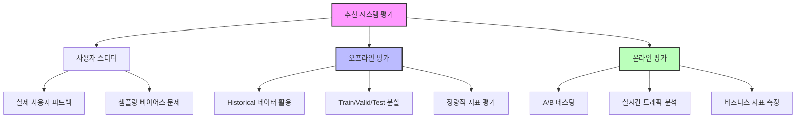
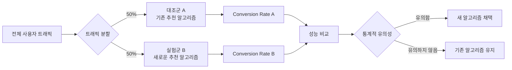
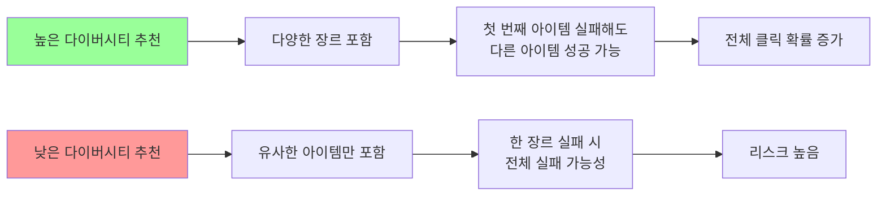
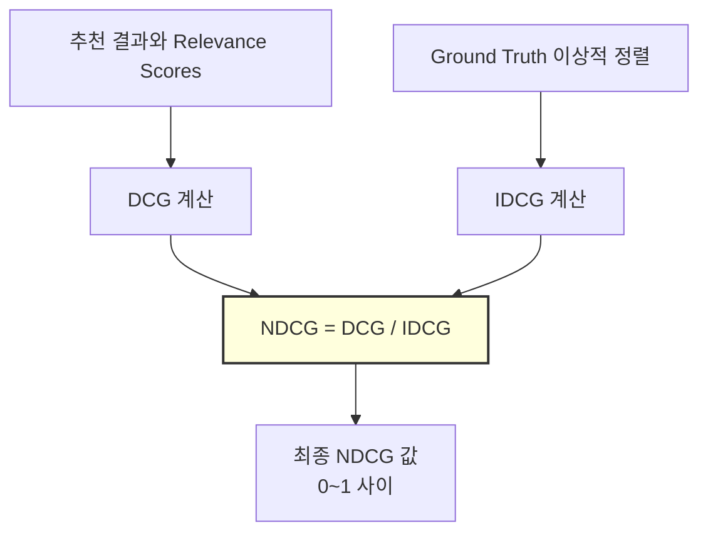
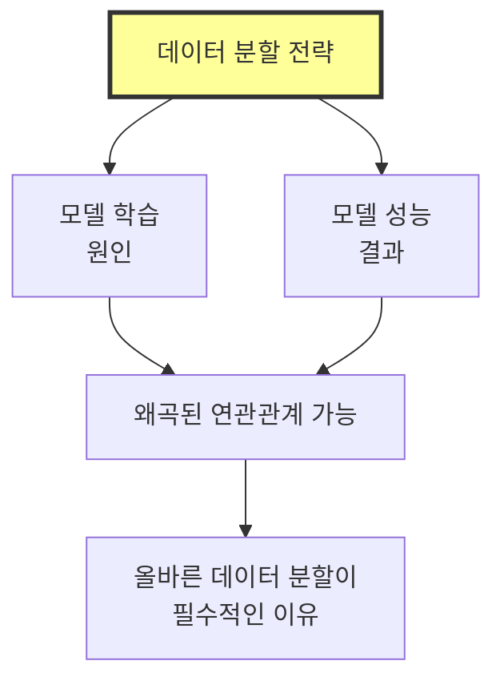
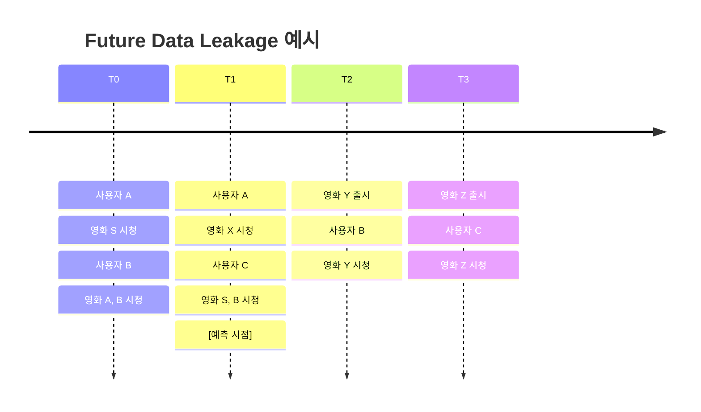
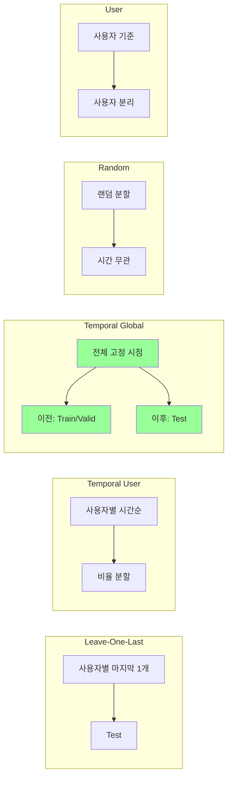

## 📦 사용하는 패키지/기술 버전 정보

- numpy==1.26.4
- pandas==2.2.0
- scikit-learn==1.4.0
- scipy==1.12.0

## 🚀 TL;DR

- 추천 시스템 평가는 **사용자 스터디, 오프라인 평가, 온라인 평가** 세 가지 패러다임으로 구분된다
- 평가 기준에는 **정확성(Accuracy), 커버리지(Coverage), 노블티(Novelty), 세렌디피티(Serendipity), 다이버시티(Diversity)** 등이 있다
- **Top-K 랭킹 평가**는 실제 사용자 경험과 밀접하며, Recall@K, Precision@K, NDCG, MRR 등의 메트릭을 사용한다
- **데이터 분할 전략**은 모델의 일반화 성능에 결정적인 영향을 미치며, 시간 정보를 고려한 Temporal Split이 권장된다
- Future Data Leakage를 방지하는 것이 올바른 평가의 핵심이며, **Temporal Global Split**이 가장 현실적인 평가 환경을 제공한다
- 오프라인 평가와 온라인 평가 간의 **미스얼라인먼트 현상**을 인지하고, 단계적 검증 프로세스가 필요하다

## 📓 실습 Jupyter Notebook

- w.i.p.

## 📊 추천 시스템 평가 패러다임

추천 시스템을 평가하는 방법은 크게 세 가지 패러다임으로 나뉜다. 각 방법은 고유한 장단점을 가지며, 상황에 따라 적절히 선택해야 한다.



### 사용자 스터디 (User Study)

사용자 스터디는 **실제 사용자를 모집하여 추천 시스템을 사용하게 한 후 피드백을 수집**하는 방식이다. 이 방법은 활발한 사용자 피드백을 기반으로 하지만, 오히려 이것이 편향(bias)으로 작용할 수 있다.

**장점**

- 실제 사용자의 직접적인 피드백 수집 가능
- 정성적인 인사이트 획득

**단점**

- 활발한 사용자들이 대다수 사용자를 대표하지 못할 수 있음
- 균일한 집단 구성과 실험 설계에 많은 노력 필요
- 높은 비용과 시간 소요

### 오프라인 평가 (Offline Evaluation)

오프라인 평가는 **새로운 추천 모델을 검증하기 위해 가장 먼저 수행되는 단계**다. 
이미 수집된 historical 데이터를 train/validation/test로 나누어 모델의 성능을 객관적으로 평가한다.

**장점**

- 정량적 지표로 객관적 평가 가능
- 반복 실험이 쉽고 비용이 적음

**단점**

- **Temporal Dynamics 반영 어려움**: 시간에 따른 사용자 선호도 변화 반영 곤란
- **온라인 성능과의 불일치**: 오프라인-온라인 미스얼라인먼트(misalignment) 현상 발생 가능

### 온라인 평가 (Online Evaluation / A-B Testing)

온라인 평가는 주로 **A-B 테스팅** 형태로 이루어진다. 실시간으로 들어오는 트래픽을 대조군(A)과 실험군(B)으로 나누어 성능을 평가한다.



**사용되는 비즈니스 지표**

- **매출 (Revenue)**
- **PV (Page View)**: 페이지 조회수
- **CTR (Click-Through Rate)**: 클릭률
- **CVR (Conversion Rate)**: 전환율

**장점**

- 실제 서비스 환경에서의 정확한 성능 측정
- 샘플링 바이어스에 덜 민감
- 장기적 성과를 직접 평가 가능

**단점**

- 시스템 개발과 배포에 오랜 시간 소요
- 통계적으로 유의미한 샘플 수집을 위해 많은 트래픽 필요
- 오프라인 평가에서 검증된 모델만 테스트 가능

## 🎯 추천 시스템의 평가 기준 (Evaluation Criteria)

추천 시스템의 성능을 다각적으로 평가하기 위해 여러 기준이 적용된다.

### 정확성 (Accuracy)

**정확성**은 가장 널리 활용되는 직관적인 평가 기준으로, unseen test set을 얼마나 정확히 예측할 수 있는지를 나타낸다.

### 커버리지 (Coverage)

**커버리지**는 추천 시스템이 전체 사용자나 전체 아이템 중에서 얼마나를 커버하고 있는지를 나타낸다.

```python
def calculate_coverage(recommendations, total_items, total_users):
    """
    추천 시스템의 커버리지 계산
    
    Args:
        recommendations: 사용자별 추천 결과
        total_items: 전체 아이템 수
        total_users: 전체 사용자 수
    """
    # 아이템 커버리지
    recommended_items = set()
    for user_recs in recommendations.values():
        recommended_items.update(user_recs)
    item_coverage = len(recommended_items) / total_items
    
    # 사용자 커버리지
    users_with_recs = len(recommendations)
    user_coverage = users_with_recs / total_users
    
    return item_coverage, user_coverage

# 예시: 100명 중 90명에게 추천 생성 → 커버리지 0.9
```

> **커버리지와 정확성의 트레이드오프**: 커버리지를 높이면 정확성이 떨어지고, 정확성을 높이면 커버리지가 떨어지는 상충 관계가 존재한다.
{: .prompt-warning}

### 노블티 (Novelty)

**노블티**는 사용자가 알지 못하거나 본 적 없는 새로운 추천을 제공할 가능성을 의미한다. 노블티가 높은 추천은 사용자가 이전에 알지 못했던 취향에 대한 새로운 발견을 제공한다. 반대로 노블티가 낮은 추천은 "뻔한 추천"으로 여겨진다.

### 세렌디피티 (Serendipity)

**세렌디피티**는 "lucky discovery"를 의미하며, 성공적인 추천 결과로부터 사용자가 느끼는 놀라움의 정도를 나타낸다.

> 세렌디피티 = 노블티 + 관련성(Relevance) + 의외성(Unexpectedness)
{: .prompt-tip}

**대표 사례**: Spotify의 Discover Weekly 같은 서비스가 세렌디피티를 강조하는 추천이다.

### 다이버시티 (Diversity)

**다이버시티**는 추천 결과가 얼마나 다양한 아이템들로 이루어졌는지를 의미한다. "네가 뭘 좋아할지 몰라서 이것저것 다 준비해봤어"라는 접근법이다.



높은 다이버시티를 제공하는 추천은 일반적으로,

- 노블티가 높음
- 세렌디피티가 높음
- 커버리지가 높음

## 📈 정확도 기반 평가 지표

### Explicit Feedback 기반 Rating Prediction

**Rating Prediction**은 사용자가 아직 평가하지 않은 unseen item에 대한 예상 평점을 예측하는 태스크다.
영화 평점과 같은 명시적인 선호도 정보를 다룬다.

```python
import numpy as np

def rating_prediction_evaluation(true_ratings, predicted_ratings):
    """
    Rating Prediction 평가를 위한 에러 메트릭 계산
    
    Args:
        true_ratings: 실제 평점
        predicted_ratings: 예측 평점
    """
    # RMSE (Root Mean Squared Error)
    rmse = np.sqrt(np.mean((true_ratings - predicted_ratings) ** 2))
    
    # MAE (Mean Absolute Error)
    mae = np.mean(np.abs(true_ratings - predicted_ratings))
    
    return rmse, mae

# 예시: 5점 척도에서의 평점 예측
true = np.array([5, 4, 1, 3, 5])
pred = np.array([4.5, 3.8, 1.2, 3.3, 4.8])

rmse, mae = rating_prediction_evaluation(true, pred)
print(f"RMSE: {rmse:.3f}, MAE: {mae:.3f}")
# 출력: RMSE: 0.283, MAE: 0.260
```

**특징**

- Regression 기반 접근
- 학습 목적 함수와 평가 메트릭이 동일 (RMSE, MAE)
- 추천 시스템의 가장 기본적인 평가 방법

### Implicit Feedback 기반 Top-K Ranking

**Top-K Ranking**은 실제 사용자 경험과 더 밀접하게 연관된 평가 방식이다. 평점을 정확하게 예측하는 것보다 **다음에 구매할 확률이 높은 상품을 제공하는 것**이 비즈니스 관점에서 더 합리적이다.

```python
def generate_topk_recommendations(user, model, k=10):
    """
    사용자별 Top-K 추천 리스트 생성
    
    Args:
        user: 사용자 ID
        model: 추천 모델
        k: 추천할 아이템 개수
    """
    # 모든 아이템에 대한 점수 계산
    all_scores = model.predict_scores(user)
    
    # 이미 상호작용한 아이템 제거
    user_history = get_user_history(user)
    candidate_scores = {item: score for item, score in all_scores.items() 
                       if item not in user_history}
    
    # Top-K 아이템 선택
    topk_items = sorted(candidate_scores.items(), 
                       key=lambda x: x[1], 
                       reverse=True)[:k]
    
    return [item for item, _ in topk_items]
```

**특징**

- Binary value (0/1)의 implicit feedback 처리
- "One-class collaborative filtering"이라고도 불림
- 클릭, 구매 여부만으로는 실제 선호도 파악 어려움

## 📊 Top-K Ranking 평가 메트릭

### Recall@K

**Recall@K**는 사용자가 관심 있는 아이템(ground truth) 중 추천한 K개 아이템의 비율이다.

```python
def recall_at_k(recommended_items, ground_truth_items, k):
    """
    Recall@K 계산
    
    Args:
        recommended_items: 추천된 상위 K개 아이템
        ground_truth_items: 실제 사용자가 상호작용한 아이템
        k: 추천 개수
    """
    recommended_k = recommended_items[:k]
    
    # 추천 결과와 ground truth의 교집합
    hits = len(set(recommended_k) & set(ground_truth_items))
    
    # Recall@K = hits / |ground_truth|
    recall = hits / len(ground_truth_items) if ground_truth_items else 0
    
    return recall

# 예시
predicted = ['A', 'B', 'C', 'D', 'E']
ground_truth = ['A', 'D', 'E', 'F', 'G', 'H', 'I', 'J']
recall = recall_at_k(predicted, ground_truth, 5)
print(f"Recall@5: {recall:.3f}")  # 출력: Recall@5: 0.375 (3/8)
```

### Precision@K

**Precision@K**는 추천한 K개 아이템 중에서 사용자가 실제로 관심 있는 아이템의 비율이다.

```python
def precision_at_k(recommended_items, ground_truth_items, k):
    """
    Precision@K 계산
    
    Args:
        recommended_items: 추천된 상위 K개 아이템
        ground_truth_items: 실제 사용자가 상호작용한 아이템
        k: 추천 개수
    """
    recommended_k = recommended_items[:k]
    
    # 추천 결과와 ground truth의 교집합
    hits = len(set(recommended_k) & set(ground_truth_items))
    
    # Precision@K = hits / K
    precision = hits / k
    
    return precision

# 예시
predicted = ['A', 'B', 'C', 'D', 'E']
ground_truth = ['A', 'D', 'E', 'F', 'G', 'H', 'I', 'J']
precision = precision_at_k(predicted, ground_truth, 5)
print(f"Precision@5: {precision:.3f}")  # 출력: Precision@5: 0.600 (3/5)
```

### NDCG (Normalized Discounted Cumulative Gain)

**NDCG**는 검색 엔진에서 널리 활용되던 지표로, Top-K 결과 중 관련 있는 아이템의 순서와 연관도를 고려한다. 연관도가 높은 아이템이 높은 순위에 오면 더 큰 가중치를 받는다.

```python
import numpy as np

def ndcg_at_k(recommended_items, ground_truth_items, relevance_scores, k):
    """
    NDCG@K 계산
    
    Args:
        recommended_items: 추천된 아이템 리스트
        ground_truth_items: ground truth 아이템 리스트
        relevance_scores: 각 아이템의 relevance score
        k: 추천 개수
    """
    def dcg_at_k(relevances, k):
        """Discounted Cumulative Gain 계산"""
        relevances = np.array(relevances)[:k]
        if relevances.size:
            # DCG = sum(rel_i / log2(i+1))
            discounts = np.log2(np.arange(2, relevances.size + 2))
            return np.sum(relevances / discounts)
        return 0.0
    
    # 추천 결과의 relevance scores
    recommended_relevances = [relevance_scores.get(item, 0) 
                            for item in recommended_items[:k]]
    
    # 이상적인 순서의 relevance scores (내림차순 정렬)
    ideal_relevances = sorted([relevance_scores.get(item, 0) 
                              for item in ground_truth_items], 
                             reverse=True)
    
    # DCG와 IDCG 계산
    dcg = dcg_at_k(recommended_relevances, k)
    idcg = dcg_at_k(ideal_relevances, k)
    
    # NDCG = DCG / IDCG
    ndcg = dcg / idcg if idcg > 0 else 0.0
    
    return ndcg

# 예시: relevance가 있는 경우
recommended = ['C', 'B', 'A']
ground_truth = ['B', 'C', 'A']
relevances = {'A': 3, 'B': 4, 'C': 3}

# DCG 계산: 3/log2(2) + 4/log2(3) + 3/log2(4) = 3 + 2.52 + 1.5 = 7.02
# IDCG 계산: 4/log2(2) + 3/log2(3) + 3/log2(4) = 4 + 1.89 + 1.5 = 7.39
# NDCG = 7.02 / 7.39 = 0.95

ndcg = ndcg_at_k(recommended, ground_truth, relevances, 3)
print(f"NDCG@3: {ndcg:.3f}")
```

**NDCG 계산 과정**



### MRR (Mean Reciprocal Rank)

**MRR**은 추천 결과에서 긍정적인 아이템이 높은 순위에 오는지를 평가하는 지표다. 추천 결과의 크기와 상관없이 관련 아이템을 리스트 상단에 배치하는 것에 집중한다.

```python
def reciprocal_rank(recommended_items, ground_truth_item):
    """
    단일 사용자의 Reciprocal Rank 계산
    
    Args:
        recommended_items: 추천된 아이템 리스트
        ground_truth_item: 사용자의 실제 선택 아이템
    """
    for rank, item in enumerate(recommended_items, 1):
        if item == ground_truth_item:
            return 1.0 / rank
    return 0.0

def mean_reciprocal_rank(all_recommendations, all_ground_truths):
    """
    전체 사용자의 MRR 계산
    """
    rr_sum = 0.0
    for user_recs, user_truth in zip(all_recommendations, all_ground_truths):
        rr_sum += reciprocal_rank(user_recs, user_truth)
    
    mrr = rr_sum / len(all_recommendations)
    return mrr
```

### Sample-based Ranking Evaluation

실제 평가에서는 모든 아이템에 대해 스코어링하는 것이 시간이 오래 걸리므로, **Sample-based Ranking Evaluation**을 사용한다.

```python
def sample_based_evaluation(user, ground_truth_items, num_negatives=99):
    """
    샘플 기반 랭킹 평가
    - Positive 아이템 1개
    - Negative 아이템 99개
    - 총 100개 아이템만 평가
    """
    # Ground truth에서 positive 아이템 1개 선택
    positive_item = random.choice(ground_truth_items)
    
    # 랜덤하게 negative 아이템 99개 선택
    all_items = get_all_items()
    user_history = get_user_history(user)
    negative_candidates = [item for item in all_items 
                          if item not in user_history]
    negative_items = random.sample(negative_candidates, num_negatives)
    
    # 평가할 100개 아이템
    test_items = [positive_item] + negative_items
    
    return test_items, positive_item
```

> **Full Ranking Evaluation vs Sample-based Evaluation**: Full ranking은 모든 아이템에 대해 평가하므로 정확하지만 계산 비용이 높다. Sample-based는 빠르지만 근사적인 평가다.
{: .prompt-tip}

## 🔀 데이터 분할 전략

데이터 분할은 모델의 일반화(generalization) 성능을 높이기 위해 전체 데이터셋을 train/validation/test로 나누는 작업이다. 이 세 집합은 서로 겹치지 않는 disjoint set이어야 한다.



데이터 분할은 **Confounding Variable**로서 모델의 학습(원인)과 성능(결과)에 모두 영향을 미친다. 적절히 통제하지 않으면 왜곡된 연관관계가 도출될 수 있다.

### Future Data Leakage 문제

추천 시스템의 목표는 **미래에 사용자가 사용할 아이템을 예측**하는 것이다. 따라서 시간 정보를 고려하지 않으면 **Future Data Leakage**가 발생할 수 있다.



T1 시점에 사용자 A에게 추천할 때, T2와 T3에 출시된 영화 Y, Z가 추천되면 안 된다. 이것이 Future Data Leakage다.

### Leave-One-Last

각 사용자의 상호작용을 시간 순서대로 나열한 뒤, 가장 최근 이력을 test set으로, 그 직전 이력을 validation set으로 사용한다.

```python
def leave_one_last_split(user_interactions):
    """
    Leave-One-Last 분할 전략
    
    각 사용자의 마지막 상호작용 → Test
    마지막에서 두 번째 → Validation
    나머지 → Train
    """
    train, valid, test = [], [], []
    
    for user, items in user_interactions.items():
        # 시간순 정렬
        sorted_items = sorted(items, key=lambda x: x['timestamp'])
        
        if len(sorted_items) >= 3:
            train.extend(sorted_items[:-2])
            valid.append(sorted_items[-2])
            test.append(sorted_items[-1])
        elif len(sorted_items) == 2:
            train.append(sorted_items[0])
            test.append(sorted_items[1])
        else:
            train.extend(sorted_items)
    
    return train, valid, test
```

**장점**

- 학습 시 비교적 많은 데이터 사용 가능

**단점**

- 사용자당 마지막 상호작용만으로 평가하여 전체 성능을 충분히 반영하지 못할 수 있음
- 사용자별 타임라인 차이로 Future Data Leakage 가능

### Temporal Split

시간 정보를 고려한 분할 전략으로, **Temporal User Split**과 **Temporal Global Split**으로 구분된다.

#### Temporal User Split

사용자별로 시간 순서에 따라 일정 비율로 데이터를 분할한다.

```python
def temporal_user_split(user_interactions, ratios=[0.8, 0.1, 0.1]):
    """
    Temporal User Split
    사용자별로 시간순 정렬 후 비율로 분할
    """
    train, valid, test = [], [], []
    
    for user, items in user_interactions.items():
        # 시간순 정렬
        sorted_items = sorted(items, key=lambda x: x['timestamp'])
        n = len(sorted_items)
        
        # 비율에 따른 분할
        train_size = int(n * ratios[0])
        valid_size = int(n * ratios[1])
        
        train.extend(sorted_items[:train_size])
        valid.extend(sorted_items[train_size:train_size+valid_size])
        test.extend(sorted_items[train_size+valid_size:])
    
    return train, valid, test
```

#### Temporal Global Split

모든 사용자에 대해 **동일한 시간점(fixed time point)**을 기준으로 분할한다. 이는 가장 현실적인 평가 환경을 제공한다.

```python
def temporal_global_split(all_interactions, split_timestamp):
    """
    Temporal Global Split
    글로벌 타임스탬프 기준으로 모든 사용자 데이터 분할
    """
    train_valid = []
    test = []
    
    for interaction in all_interactions:
        if interaction['timestamp'] <= split_timestamp:
            train_valid.append(interaction)
        else:
            test.append(interaction)
    
    # train_valid를 다시 90:10으로 분할
    split_point = int(len(train_valid) * 0.9)
    train = train_valid[:split_point]
    valid = train_valid[split_point:]
    
    return train, valid, test
```

**장점**

- 현실과 유사한 평가 환경 제공
- Future Data Leakage 완전 방지

**단점**

- 학습 데이터가 상대적으로 적음

### Random Split

시간 순서와 관계없이 랜덤하게 데이터를 분할한다.

```python
def random_split(user_interactions, ratios=[0.8, 0.1, 0.1], seed=42):
    """
    Random Split
    시간 정보 무시하고 랜덤 분할
    """
    np.random.seed(seed)
    all_interactions = []
    
    for user, items in user_interactions.items():
        for item in items:
            all_interactions.append((user, item))
    
    # 랜덤 셔플
    np.random.shuffle(all_interactions)
    
    n = len(all_interactions)
    train_size = int(n * ratios[0])
    valid_size = int(n * ratios[1])
    
    train = all_interactions[:train_size]
    valid = all_interactions[train_size:train_size+valid_size]
    test = all_interactions[train_size+valid_size:]
    
    return train, valid, test
```

**장점**

- 구현이 간단하고 많은 학습 데이터 확보 가능

**단점**

- Future Data Leakage 발생 가능
- 재현성이 떨어질 수 있음

### User Split

Cold Start Problem에 대응하기 위한 전략으로, **Strong Generalization** 성능을 평가한다.

```python
def user_split(all_users, interactions, ratios=[0.8, 0.1, 0.1]):
    """
    User Split
    사용자를 기준으로 분할 (사용자 간 겹침 없음)
    """
    np.random.shuffle(all_users)
    n = len(all_users)
    
    train_size = int(n * ratios[0])
    valid_size = int(n * ratios[1])
    
    train_users = set(all_users[:train_size])
    valid_users = set(all_users[train_size:train_size+valid_size])
    test_users = set(all_users[train_size+valid_size:])
    
    train = [i for i in interactions if i['user'] in train_users]
    valid = [i for i in interactions if i['user'] in valid_users]
    test = [i for i in interactions if i['user'] in test_users]
    
    return train, valid, test
```

**특징**

- Train/Valid/Test의 사용자가 완전히 분리됨
- 새로운 사용자에 대한 추천 능력 평가
- 단순 CF 모델은 평가 불가능

## 📊 데이터 분할 전략 비교



### 전략별 특성 요약

|분할 전략|Future Leakage|학습 데이터량|현실성|재현성|적용 상황|
|---|---|---|---|---|---|
|Leave-One-Last|가능|많음|보통|높음|빠른 실험|
|Temporal User|가능|보통|보통|높음|사용자별 패턴 학습|
|**Temporal Global**|**없음**|적음|**높음**|높음|**실제 서비스 시뮬레이션**|
|Random|가능|많음|낮음|보통|초기 실험|
|User Split|가능|보통|특수|높음|Cold Start 평가|

> **권장사항**: 데이터가 충분하다면 **Temporal Global Split**을 사용하는 것이 가장 현실적이고 신뢰할 수 있는 평가를 제공한다.
{: .prompt-tip}

### 동일 모델, 다른 분할 전략의 성능 차이

동일한 추천 모델이라도 데이터 분할 전략에 따라 성능 순위가 달라질 수 있다. 이는 올바른 데이터 분할 전략 선택의 중요성을 보여준다.

```python
# 예시: 분할 전략에 따른 성능 변화
def compare_split_strategies(model, data):
    """
    동일 모델, 다른 분할 전략의 성능 비교
    """
    results = {}
    
    # Leave-One-Last
    train_l, valid_l, test_l = leave_one_last_split(data)
    model_l = train_model(model, train_l, valid_l)
    results['leave_one_last'] = evaluate(model_l, test_l)
    
    # Temporal Global
    train_t, valid_t, test_t = temporal_global_split(data, '2024-01-01')
    model_t = train_model(model, train_t, valid_t)
    results['temporal_global'] = evaluate(model_t, test_t)
    
    # Random Split
    train_r, valid_r, test_r = random_split(data)
    model_r = train_model(model, train_r, valid_r)
    results['random'] = evaluate(model_r, test_r)
    
    return results

# 결과: 같은 모델이지만 분할 전략에 따라 성능이 다르게 나타남
# leave_one_last: 0.85
# temporal_global: 0.72  (더 현실적이지만 더 어려운 평가)
# random: 0.91  (Future Leakage로 과대평가)
```

## 🎯 실무 적용 가이드

추천 시스템 평가를 실무에 적용할 때는 다음과 같은 단계적 접근이 필요하다:

1. **오프라인 평가로 시작**
    
    - Temporal Global Split 사용
    - 다양한 메트릭으로 다각도 평가
    - Future Data Leakage 방지
2. **평가 메트릭 선택**
    
    - 비즈니스 목표와 일치하는 메트릭 선택
    - 정확성과 다양성의 균형 고려
    - Sample-based evaluation으로 빠른 iteration
3. **온라인 평가로 검증**
    
    - 오프라인에서 검증된 모델만 A-B 테스트
    - 충분한 트래픽 확보 후 진행
    - 통계적 유의성 확인
4. **지속적 모니터링**
    
    - 온라인 메트릭 실시간 추적
    - Temporal Dynamics 반영
    - 정기적인 재학습 및 평가

> 추천 시스템의 평가는 단순히 정확도만을 측정하는 것이 아니라, 사용자 경험과 비즈니스 가치를 종합적으로 고려해야 한다. 올바른 평가 전략 없이는 좋은 추천 시스템을 만들 수 없다.
{: .prompt-warning}