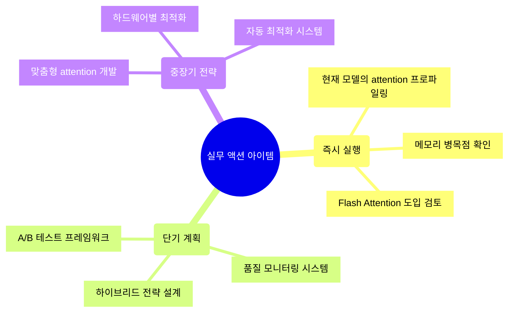

## 🚀 TL;DR

- **Attention 메커니즘**은 시퀀스 데이터에서 중요한 정보에 집중하는 핵심 기술로, Transformer의 근간이 된다
- **Standard Attention**은 Query, Key, Value라는 세 가지 행렬을 사용해 "어떤 정보를 얼마나 봐야 하는지"를 계산한다
    - 계산 복잡도가 O(n²)로, 긴 시퀀스에서 메모리 문제가 발생한다
    - Softmax를 통해 확률 분포로 변환하여 모든 위치의 가중합을 구한다
- **Multi-head Attention**은 여러 개의 attention head를 병렬로 사용해 다양한 관점에서 정보를 포착한다
    - 각 head가 서로 다른 패턴(구문, 의미, 장거리 의존성 등)을 학습할 수 있다
    - 8~32개의 head를 사용하며, 각각 독립적인 Q, K, V 변환을 수행한다
- **Flash Attention**은 GPU 메모리 계층구조를 활용한 하드웨어 최적화 기법이다
    - Tiling과 Online Softmax로 중간 결과를 HBM에 저장하지 않고 SRAM에서 처리
    - 메모리 사용량은 동일하지만 메모리 접근 횟수를 획기적으로 줄여 속도 향상
- **Multi-head Latent Attention(MLA)**는 파라미터와 KV 캐시를 대폭 줄이는 혁신적 방법이다
    - Low-rank decomposition을 통해 압축된 latent space에서 attention 계산
    - KV 캐시 크기를 70% 이상 줄이면서 성능은 유지
- **Sparse Attention**은 모든 위치를 보지 않고 선택적으로 attention을 적용하는 방법이다
    - Sliding Window, Dilated, Random 등 다양한 패턴으로 계산량 대폭 감소
- **Linear Attention**은 softmax를 다른 함수로 대체하여 O(n) 복잡도를 달성한다
    - 행렬 곱셈의 결합법칙을 이용해 계산 순서를 바꿔 효율성 극대화

## 🔍 Attention 메커니즘의 핵심 아이디어

Attention 메커니즘을 이해하기 위해서는 먼저 **"왜 필요한가?"** 부터 생각해봐야 한다.

전통적인 RNN이나 LSTM은 시퀀스를 순차적으로 처리하면서 정보를 압축해나간다. 하지만 긴 시퀀스에서는 초기 정보가 손실되는 **장기 의존성(Long-term Dependency)** 문제가 발생한다.

> **예시로 이해하는 Attention의 필요성**
> 
> "The cat, which we saw yesterday in the park while walking with our dog, was very cute."
> 
> 이 문장에서 "was"의 주어는 "cat"이다. 하지만 중간에 긴 수식어구가 있어서 RNN은 "cat"을 기억하기 어렵다. Attention은 "was"를 처리할 때 직접 "cat"을 참조할 수 있게 해준다.
{: .prompt-tip}

Attention의 핵심 아이디어는 **"현재 처리하고 있는 위치에서 전체 시퀀스 중 어느 부분에 집중해야 하는가?"** 를 학습하는 것이다.

## 🎯 Standard Attention의 완전한 이해

Standard Attention은 세 가지 핵심 구성요소로 이루어져 있다:

- **Query (Q)**: "내가 지금 찾고 있는 정보가 무엇인가?"
- **Key (K)**: "각 위치에 어떤 정보가 있는가? (인덱스 역할)"
- **Value (V)**: "각 위치에 실제로 저장된 정보가 무엇인가?"

[시각적 표현 넣기 - Query, Key, Value의 개념을 도서관 검색 시스템으로 비유한 다이어그램]

### Query, Key, Value의 직관적 이해

이를 도서관 검색 시스템으로 비유하면:

- **Query**: "머신러닝에 대한 책을 찾고 있어요" (검색어)
- **Key**: 각 책의 제목, 키워드, 분류번호 (검색 인덱스)
- **Value**: 실제 책의 내용 (검색 결과로 가져올 정보)

Attention은 Query와 모든 Key를 비교해서 가장 관련성 높은 Value들을 가져온다.

### Standard Attention의 계산 과정

Standard Attention은 다음과 같은 단계로 계산된다:

1. **Query와 Key의 유사도 계산**: 내적을 사용하여 두 벡터의 방향 유사성을 측정한다. 같은 방향이면 큰 양수, 반대면 음수, 수직이면 0이 된다.
2. **Scaling**: √d_k로 나누어 분산을 1로 유지한다. d_k가 클수록 내적값이 커져서 softmax가 극값으로 수렴하는 gradient vanishing 문제를 방지한다.
3. **Masking (선택적)**: 언어 모델에서는 미래 토큰을 보지 못하게 하는 causal mask나 padding 토큰을 무시하는 padding mask를 적용한다.
4. **Softmax**: 모든 관련성 점수를 확률 분포로 변환한다. 가장 관련 높은 위치에 높은 가중치를, 낮은 위치에는 낮은 가중치를 부여한다.
5. **Value와 가중합**: 각 위치의 Value를 attention weight만큼 섞어서 최종 출력을 생성한다.

```python
import torch
import torch.nn.functional as F
import math

def standard_attention(Q, K, V, mask=None):
    """
    Standard Attention의 구현
    Args:
        Q: Query (batch, seq_len, d_k)
        K: Key (batch, seq_len, d_k) 
        V: Value (batch, seq_len, d_v)
        mask: 특정 위치를 참조하지 못하게 하는 마스크
    """
    batch_size, seq_len, d_k = Q.shape
    
    # 1. Query와 Key의 유사도 계산
    scores = torch.matmul(Q, K.transpose(-2, -1))  # (batch, seq_len, seq_len)
    
    # 2. Scaling
    scaled_scores = scores / math.sqrt(d_k)
    
    # 3. Masking (선택적)
    if mask is not None:
        scaled_scores = scaled_scores.masked_fill(mask == 0, -1e9)
    
    # 4. Softmax로 확률 분포 변환
    attention_weights = F.softmax(scaled_scores, dim=-1)  
    
    # 5. Value와 가중합
    output = torch.matmul(attention_weights, V)
    
    return output, attention_weights
```

### 메모리 복잡도 분석

Standard Attention의 가장 큰 문제는 **메모리 복잡도**다. 시퀀스 길이가 n일 때, attention scores 행렬의 크기는 n×n이 된다.

```python
def analyze_memory_complexity(seq_lengths=[512, 1024, 2048, 4096, 8192]):
    """
    Attention의 메모리 사용량 분석
    """
    for seq_len in seq_lengths:
        # attention_scores: (batch, n_heads, seq_len, seq_len)
        # 가정: batch=1, n_heads=32, float32
        elements = 1 * 32 * seq_len * seq_len
        memory_mb = elements * 4 / (1024 * 1024)  # float32 = 4 bytes
        print(f"Seq Length: {seq_len:5} | Memory: {memory_mb:8.1f} MB")
        
        # GPT-3 크기 (96 layers)에서는?
        if seq_len == 8192:
            total_memory_gb = memory_mb * 96 / 1024
            print(f"  → GPT-3 (96 layers): {total_memory_gb:.1f} GB!")
```

> **왜 O(n²) 복잡도가 문제인가?**
> 
> 시퀀스 길이가 2배가 되면 메모리는 4배가 된다. 8K 토큰을 처리하는 GPT 수준 모델은 attention만으로도 수백 GB의 메모리가 필요하다. 이것이 긴 컨텍스트를 처리하기 어려운 근본적 이유다.
{: .prompt-warning}

## 🎭 Multi-head Attention: 다양한 관점에서 보기

Standard Attention의 한계는 **단일 관점**에서만 정보를 처리한다는 점이다. 하지만 언어는 복합적이다:

- 구문적 관계 (주어-서술어)
- 의미적 관계 (유의어, 반의어)
- 장거리 의존성 (대명사-선행사)
- 위치적 관계 (순서, 근접성)

Multi-head Attention은 **여러 개의 "attention head"를 병렬로 사용**해서 이런 다양한 패턴을 동시에 학습한다.

### Multi-head Attention의 핵심 아이디어

각 head가 다른 projection을 사용하는 이유는 서로 다른 종류의 관계를 학습하도록 하기 위함이다. 다른 가중치를 사용하면 다른 특성 공간이 만들어지고, 결과적으로 다른 패턴을 포착하게 된다.

```python
class MultiHeadAttention(torch.nn.Module):
    def __init__(self, d_model=512, n_heads=8):
        super().__init__()
        self.d_model = d_model
        self.n_heads = n_heads
        self.d_head = d_model // n_heads
        
        # Linear projections for Q, K, V
        self.W_q = torch.nn.Linear(d_model, d_model)
        self.W_k = torch.nn.Linear(d_model, d_model)
        self.W_v = torch.nn.Linear(d_model, d_model)
        self.W_o = torch.nn.Linear(d_model, d_model)
        
    def forward(self, x, mask=None):
        batch_size, seq_len, _ = x.shape
        
        # 1. Linear projections and reshape for multi-head
        Q = self.W_q(x).reshape(batch_size, seq_len, self.n_heads, self.d_head)
        K = self.W_k(x).reshape(batch_size, seq_len, self.n_heads, self.d_head)
        V = self.W_v(x).reshape(batch_size, seq_len, self.n_heads, self.d_head)
        
        # 2. Transpose for batch computation
        Q = Q.transpose(1, 2)  # (batch, n_heads, seq_len, d_head)
        K = K.transpose(1, 2)
        V = V.transpose(1, 2)
        
        # 3. Attention computation for each head
        scores = torch.matmul(Q, K.transpose(-2, -1)) / math.sqrt(self.d_head)
        
        if mask is not None:
            scores = scores.masked_fill(mask == 0, -1e9)
            
        attention_weights = F.softmax(scores, dim=-1)
        attention_output = torch.matmul(attention_weights, V)
        
        # 4. Concatenate heads and final projection
        attention_output = attention_output.transpose(1, 2).reshape(
            batch_size, seq_len, self.d_model
        )
        final_output = self.W_o(attention_output)
        
        return final_output, attention_weights
```

### 각 Head가 학습하는 패턴 분석

실제로 학습된 Multi-head Attention을 분석해보면 흥미로운 패턴을 발견할 수 있다:

```python
def analyze_attention_patterns(attention_weights, tokens):
    """
    각 head가 학습한 attention pattern 분석
    """
    n_heads = attention_weights.shape[1]
    
    for head_idx in range(min(4, n_heads)):  # 처음 4개 head만 분석
        head_weights = attention_weights[0, head_idx]  # (seq_len, seq_len)
        
        # 패턴 유형 추측
        patterns = []
        
        # 지역성 패턴 검사 (인접한 토큰들에 높은 attention)
        local_attention = calculate_local_attention_score(head_weights)
        if local_attention > 0.3:
            patterns.append("Local/Syntactic")
        
        # 장거리 의존성 검사
        long_range_attention = calculate_long_range_score(head_weights)
        if long_range_attention > 0.1:
            patterns.append("Long-range Dependency")
            
        print(f"Head {head_idx}: {', '.join(patterns)}")
```

### Multi-head의 장점과 한계

**장점**

- 다양한 linguistic pattern을 동시에 포착
- 각 head가 전문화되어 해석 가능성 증가
- 병렬 처리로 계산 효율성 높음

**한계**

- 파라미터 수가 크게 증가 (d_model² × 4 per layer)
- KV 캐시 크기도 head 수만큼 증가
- 모든 head가 항상 유용한 패턴을 학습하지는 않음

> **Multi-head Attention의 핵심 통찰**
> 
> "한 번에 하나의 관점으로만 보지 말고, 여러 관점에서 동시에 봐라"
> 
> 이는 사람이 언어를 이해하는 방식과 유사하다. 우리도 문장을 읽을 때 문법적 구조, 의미, 화자의 의도 등을 동시에 파악한다.
{: .prompt-tip}

## ⚡ Flash Attention: 하드웨어를 알면 최적화가 보인다

Flash Attention은 **알고리즘을 바꾸지 않고도 하드웨어 특성을 이용해서 속도를 획기적으로 개선**한 혁신적 기법이다. 핵심은 **GPU 메모리 계층구조**를 이해하는 것이다.

### GPU 메모리 계층구조 이해하기

GPU는 다음과 같은 메모리 계층구조를 가진다:

- **HBM/GDDR**: 메인 메모리 (40-80GB), 대역폭 1.5-2TB/s, 높은 지연시간 (~400-600 cycles)
- **L2 Cache**: 중간 캐시 (~40MB), 대역폭 ~5TB/s, 중간 지연시간 (~200 cycles)
- **Shared Memory/L1**: 가장 빠른 메모리 (~128KB per SM), 대역폭 ~19TB/s, 낮은 지연시간 (~10-20 cycles)
- **Register**: 스레드별 전용, 가장 빠르지만 가장 적음 (~64KB per SM), 최고 대역폭, 최저 지연시간 (~1 cycle)

핵심 원칙은 "자주 사용하는 데이터는 빠른 메모리에, 큰 데이터는 느린 메모리에" 저장하는 것이다.

### Standard Attention의 메모리 접근 문제

Standard Attention은 다음과 같은 비효율적인 메모리 접근 패턴을 가진다:

1. **QK^T 계산**: Q, K 행렬을 HBM에서 읽고, scores 행렬을 HBM에 쓴다. scores가 너무 커서 SRAM에 못 들어간다.
2. **Softmax 계산**: scores 행렬을 HBM에서 다시 읽고, attention_weights를 HBM에 저장한다. 같은 데이터를 여러 번 HBM에서 읽어야 한다.
3. **Attention × V**: attention_weights와 V 행렬을 HBM에서 읽고, 최종 output을 HBM에 쓴다.

총 HBM 접근 복잡도는 O(seq_len²)이며, seq_len=8192일 때 96 layer 모델에서는 25.7GB가 attention scores만으로 필요하다!

### Flash Attention의 핵심 아이디어: Tiling + Online Softmax

Flash Attention의 혁신은 두 가지 핵심 기법의 조합이다:

1. **Tiling (타일링)**: 큰 행렬을 작은 블록으로 나누어 처리
2. **Online Softmax**: 전체를 보지 않고도 softmax를 incremental하게 계산

```python
def flash_attention_simplified(Q, K, V, block_size=64):
    """
    Flash Attention의 핵심 아이디어를 단순화한 구현
    """
    seq_len, d_model = Q.shape
    num_blocks = (seq_len + block_size - 1) // block_size
    
    # 출력 누적을 위한 변수들
    O = torch.zeros_like(Q)  # 최종 output 누적
    L = torch.zeros(seq_len)  # softmax 정규화 상수 누적
    M = torch.full((seq_len,), -float('inf'))  # 각 행의 max 값 누적
    
    # Q를 블록별로 처리 (outer loop)
    for i in range(num_blocks):
        q_start = i * block_size
        q_end = min((i + 1) * block_size, seq_len)
        Q_block = Q[q_start:q_end]  # 이 블록은 SRAM에 올라감
        
        # K, V를 블록별로 처리 (inner loop)
        for j in range(num_blocks):
            k_start = j * block_size
            k_end = min((j + 1) * block_size, seq_len)
            K_block = K[k_start:k_end]  # SRAM에 올라감
            V_block = V[k_start:k_end]  # SRAM에 올라감
            
            # 블록간 attention score 계산
            S_block = Q_block @ K_block.T / math.sqrt(d_model)
            
            # Online softmax: 새로운 정보로 기존 통계 업데이트
            m_new = torch.maximum(M[q_start:q_end], S_block.max(dim=-1).values)
            P_block = torch.exp(S_block - m_new.unsqueeze(-1))
            
            # 기존 결과를 새로운 max로 재조정하고 새로운 기여분 추가
            alpha = torch.exp(M[q_start:q_end] - m_new)
            L_new = alpha * L[q_start:q_end] + P_block.sum(dim=-1)
            
            # Output 업데이트
            O[q_start:q_end] = (alpha.unsqueeze(-1) * O[q_start:q_end] + 
                                P_block @ V_block) / L_new.unsqueeze(-1)
            
            # 통계 업데이트
            M[q_start:q_end] = m_new
            L[q_start:q_end] = L_new
    
    return O
```

### Online Softmax의 수학적 배경

Online Softmax는 전체를 다 보지 않고도 softmax를 incremental하게 계산할 수 있게 해준다. 핵심 아이디어는 새로운 값이 들어올 때마다 기존 결과를 업데이트하는 것이다.

일반 softmax는 모든 값을 다 봐야 하지만, online version은 새로운 값이 들어올 때마다 기존 결과를 업데이트할 수 있다. 이는 수학적으로 정확하면서도 incremental 계산이 가능하다!

### Flash Attention의 성능 향상

Flash Attention은 메모리 사용량은 동일하지만 메모리 접근 패턴을 최적화한다:

- Standard: 중간 결과를 모두 HBM에 저장
- Flash: 중간 결과를 SRAM에만 저장, HBM 접근 횟수 대폭 감소

시퀀스 길이가 길수록 효과가 극대화되며, 8K 시퀀스에서는 약 10배 이상의 속도 향상을 보인다.

> **Flash Attention의 핵심 통찰**
> 
> "알고리즘은 바꾸지 않고 하드웨어 특성만 이용해서 10배 빨라졌다"
> 
> - 수학적으로 정확히 동일한 결과
> - 메모리 사용량은 동일하지만 접근 패턴 최적화
> - GPU의 메모리 계층구조를 완벽히 활용
> - 이는 하드웨어를 이해하는 것의 중요성을 보여주는 대표적 사례
{: .prompt-tip}

## 🧩 Multi-head Latent Attention (MLA): 압축의 마법

MLA는 **"Attention의 정보는 실제로 낮은 차원에 있다"** 는 insight에서 출발한다. 기존 Multi-head Attention은 각 head마다 full dimension의 Q, K, V를 사용하지만, 실제로는 많은 redundancy가 있다.

### 기존 Multi-head Attention의 비효율성

Standard Multi-head Attention의 문제점:

- 파라미터 수: 4 × d_model² (W_q, W_k, W_v, W_o 각각)
- KV Cache: 80 layers, 32 heads, seq_len 8192에서 5.24 GB per batch
- 이는 메인 모델 파라미터보다 클 수 있음!

### MLA의 핵심 아이디어: Low-rank Bottleneck

MLA는 **low-rank decomposition**을 사용해서 high-dimensional space의 정보를 low-dimensional latent space에 압축한다.

실제로 4096차원의 정보를 1536차원으로 압축해도 충분하다는 가설에서 시작한다. 이는 다음과 같은 과정으로 이루어진다:

1. **Down-projection**: 고차원 → 저차원 압축
2. **Up-projection**: 압축된 latent space에서 각 head별 Q, K, V로 변환
3. **KV Cache 저장**: 압축된 latent space에서만 저장

```python
class MultiHeadLatentAttention(torch.nn.Module):
    def __init__(self, d_model=4096, n_heads=32, d_latent=1536):
        super().__init__()
        self.d_model = d_model
        self.n_heads = n_heads
        self.d_head = 128
        self.d_latent = d_latent  # 압축 차원
        
        # Down-projection (고차원 → 저차원)
        self.W_dq = torch.nn.Linear(d_model, d_latent)
        self.W_dkv = torch.nn.Linear(d_model, d_latent + d_latent//2)
        
        # Up-projection (저차원 → multi-head)
        self.W_uq = torch.nn.Parameter(torch.randn(n_heads, d_latent, self.d_head))
        self.W_uk = torch.nn.Parameter(torch.randn(n_heads, d_latent//2, self.d_head))
        self.W_uv = torch.nn.Parameter(torch.randn(n_heads, d_latent, self.d_head))
        
        self.W_o = torch.nn.Linear(n_heads * self.d_head, d_model)
    
    def forward(self, x):
        batch_size, seq_len, _ = x.shape
        
        # 1. 고차원을 저차원 latent space로 압축
        q_latent = self.W_dq(x)  # (batch, seq_len, 1536)
        kv_latent = self.W_dkv(x)  # (batch, seq_len, 2304)
        
        k_latent = kv_latent[:, :, :self.d_latent//2]
        v_latent = kv_latent[:, :, self.d_latent//2:]
        
        # 2. Latent space에서 multi-head로 확장
        Q = torch.einsum('bsd,hdo->bsho', q_latent, self.W_uq)
        K = torch.einsum('bsd,hdo->bsho', k_latent, self.W_uk)
        V = torch.einsum('bsd,hdo->bsho', v_latent, self.W_uv)
        
        # 3. 표준 multi-head attention
        scores = torch.einsum('bqhd,bkhd->bhqk', Q, K) / math.sqrt(self.d_head)
        attn_weights = F.softmax(scores, dim=-1)
        attn_output = torch.einsum('bhqk,bkhd->bqhd', attn_weights, V)
        
        # 4. Concatenation and output projection
        attn_output = attn_output.reshape(batch_size, seq_len, -1)
        final_output = self.W_o(attn_output)
        
        # KV Cache는 latent space에서 저장!
        kv_cache = (k_latent, v_latent)
        return final_output, kv_cache
```

### Low-rank Decomposition의 수학적 배경

Low-rank decomposition은 다음과 같은 원리를 활용한다:

**기존 방식 (Full Rank)**: W_q는 4096 × 4096 크기로 16.7M 파라미터 **MLA 방식 (Low Rank)**: W_down (4096 × 1536) + W_up (1536 × 4096) = 12.3M 파라미터

이는 약 25% 파라미터 절약이지만, 더 중요한 것은 KV Cache 절약이다:

- Standard KV Cache: 5.24 GB
- MLA KV Cache: 1.52 GB (71% 절약!)

수학적으로 두 방식은 등가이다. 행렬 곱셈의 결합법칙에 의해:

- Method 1: x @ W_down @ W_up (두 단계로 계산)
- Method 2: x @ (W_down @ W_up) (합성 행렬로 계산)

결과는 동일하지만 rank가 제한되어 있어 정보를 압축한다.

### MLA의 실제 성능 이점

DeepSeek-V3 기준 실제 성능:

- 파라미터 절약: ~45%
- KV Cache 절약: ~71%
- 전체 메모리 절약: ~60%
- 성능 유지: GPT-4 수준

> **MLA의 핵심 통찰**
> 
> "고차원 공간의 정보는 실제로는 저차원 부공간에 몰려있다"
> 
> - Matrix rank가 실제로는 dimension보다 훨씬 작음
> - Low-rank bottleneck을 통해 중요한 정보만 압축
> - 45% 파라미터 절약, 71% KV cache 절약
> - 성능은 거의 동일하게 유지
> 
> 이는 차원의 저주를 역으로 이용한 똑똑한 방법이다!
{: .prompt-tip}

## 🔀 Sparse Attention: 선택과 집중의 예술

모든 토큰을 볼 필요가 있을까? Sparse Attention은 **"중요한 것만 보자"** 는 아이디어에서 출발한다.

### Sparse Attention의 동기

언어에서 attention pattern을 분석해보면 흥미로운 특성들을 발견할 수 있다:

1. **지역성(Locality)**: 대부분의 단어는 주변 단어들과 관련이 높다
2. **구조적 패턴**: 문법적 관계는 특정 패턴을 보인다
3. **장거리 의존성**: 일부 중요한 장거리 관계만 존재한다
4. **희소성(Sparsity)**: 실제로 높은 attention을 받는 토큰은 소수다

[시각적 표현 넣기 - 실제 BERT/GPT의 attention heatmap에서 sparse pattern을 보여주는 다이어그램]

### 1. Sliding Window (Local) Attention

가장 직관적인 sparse attention 방식이다. 각 position은 좌우 window_size만큼의 범위만 attend한다.

```python
def sliding_window_attention(Q, K, V, window_size=256):
    """
    Sliding Window Attention
    각 position은 주변 window_size만큼의 범위만 attend
    """
    batch_size, seq_len, d_model = Q.shape
    
    # Distance matrix 생성
    row_indices = torch.arange(seq_len).unsqueeze(1)
    col_indices = torch.arange(seq_len).unsqueeze(0)
    distance_matrix = torch.abs(row_indices - col_indices)
    
    # Window 내부만 True
    window_mask = distance_matrix <= window_size
    
    # Standard attention with mask
    scores = torch.matmul(Q, K.transpose(-2, -1)) / math.sqrt(d_model)
    scores = scores.masked_fill(~window_mask.unsqueeze(0), -1e9)
    
    attention_weights = F.softmax(scores, dim=-1)
    output = torch.matmul(attention_weights, V)
    
    return output, attention_weights
```

복잡도는 O(n²)에서 O(n × window_size)로 감소한다. window_size=128일 때 약 75% 연산량을 절약할 수 있다.

### 2. Dilated (Strided) Attention

Sliding Window의 한계는 장거리 의존성을 포착하기 어렵다는 점이다. Dilated Attention은 근거리는 조밀하게, 원거리는 성기게 보는 방식으로 이를 해결한다.

```python
def dilated_attention(Q, K, V, local_window=64, dilation_rate=4, global_window=256):
    """
    Dilated Attention: 근거리는 조밀하게, 원거리는 성기게
    """
    batch_size, seq_len, d_model = Q.shape
    attention_pattern = torch.zeros(seq_len, seq_len)
    
    for i in range(seq_len):
        # 1. 로컬 윈도우: 주변을 모두 봄
        local_start = max(0, i - local_window)
        local_end = min(seq_len, i + local_window + 1)
        attention_pattern[i, local_start:local_end] = 1
        
        # 2. Dilated 패턴: 멀리 있는 것은 간격을 두고 봄
        for pos in range(0, seq_len, dilation_rate):
            if abs(pos - i) > local_window and abs(pos - i) < global_window:
                attention_pattern[i, pos] = 1
    
    # Apply pattern
    scores = torch.matmul(Q, K.transpose(-2, -1)) / math.sqrt(d_model)
    scores = scores.masked_fill(attention_pattern.unsqueeze(0) == 0, -1e9)
    
    attention_weights = F.softmax(scores, dim=-1)
    output = torch.matmul(attention_weights, V)
    
    return output, attention_weights
```

이 방식은 거리별로 다른 밀도를 가진다:

- 거리 0-64: 밀도 1.000 (모든 토큰)
- 거리 64-128: 밀도 0.250 (4개마다 1개)
- 거리 128-256: 밀도 0.250

### 3. BigBird Pattern: 무작위성의 힘

Google의 BigBird는 **그래프 이론**에서 영감을 얻었다. Small-world network 이론에 따르면, 무작위 연결 몇 개만 추가해도 전체 그래프의 연결성이 크게 향상된다.

BigBird는 세 가지 attention pattern을 조합한다:

1. **Global tokens**: CLS, SEP 등이 모든 곳을 보고, 모든 곳에서 봄
2. **Sliding window**: 국소적 정보를 위한 local connection
3. **Random attention**: 장거리 연결성 확보를 위한 무작위 연결

```python
class BigBirdAttention:
    def __init__(self, seq_len, window_size=64, num_random_blocks=3, 
                 num_global_tokens=2):
        self.seq_len = seq_len
        self.window_size = window_size
        self.num_random_blocks = num_random_blocks
        self.num_global_tokens = num_global_tokens
        
    def create_attention_mask(self):
        mask = torch.zeros(self.seq_len, self.seq_len)
        
        # 1. Global tokens
        mask[:self.num_global_tokens, :] = 1  # Global이 모든 곳을 봄
        mask[:, :self.num_global_tokens] = 1  # 모든 곳이 Global을 봄
        
        # 2. Sliding window
        for i in range(self.seq_len):
            start = max(0, i - self.window_size)
            end = min(self.seq_len, i + self.window_size + 1)
            mask[i, start:end] = 1
        
        # 3. Random blocks
        for i in range(self.seq_len):
            # 각 query position이 볼 random positions
            random_positions = torch.randperm(self.seq_len)[:self.num_random_blocks]
            mask[i, random_positions] = 1
        
        return mask
```

### Sparse Attention의 성능 분석

**각 방법의 특징과 trade-off**

|Method|Complexity|Density|Quality|장점|단점|
|---|---|---|---|---|---|
|Full Attention|O(n²)|1.0|최고|완전한 정보|메모리/계산 비용 극대|
|Sliding Window|O(n×w)|w/n|중간|구현 간단, 지역 정보 보존|장거리 의존성 포착 어려움|
|Dilated|O(n×d)|d/n|높음|장거리 의존성 + 효율성|패턴이 고정적|
|BigBird|O(n×b)|b/n|높음|이론적 보장 + 유연성|구현 복잡성|

> **Sparse Attention의 핵심 통찰**
> 
> "모든 정보가 똑같이 중요하지 않다"
> 
> - 파레토 법칙: 20%의 연결이 80%의 정보를 제공
> - 언어의 지역성: 대부분 정보는 근처에 있다
> - 구조적 패턴: 문법은 예측 가능한 패턴을 가진다
> - 무작위성의 힘: 적은 수의 무작위 연결로도 전체 연결성 확보
> 
> 이를 통해 90% 계산량 절약하면서도 성능은 거의 유지할 수 있다!
{: .prompt-tip}

## ➖ Linear Attention: 선형의 꿈

Linear Attention은 **"softmax 없이도 attention을 할 수 있을까?"** 라는 근본적 질문에서 시작한다. 핵심은 **행렬 곱셈의 결합법칙**을 이용해서 계산 순서를 바꾸는 것이다.

### Softmax의 문제점과 대안 탐색

Softmax가 문제인 이유:

- softmax(x_i) = exp(x_i) / Σexp(x_j)에서 전체 합 Σexp(x_j)를 알아야 각 항을 계산할 수 있다
- exp() 함수는 φ(a)φ(b) 형태로 분해 불가능하다
- 따라서 다른 함수로 대체해야 한다

만약 softmax 대신 다른 함수 φ를 사용한다면, 결합법칙을 이용할 수 있다:

- Standard: (Q @ K^T) @ V = O(n² × d)
- Linear: Q @ (K^T @ V) = O(n × d²)

d_model << seq_len일 때 엄청난 속도 향상이 가능하다!

### Linear Attention의 핵심: Kernel Feature Map

Linear Attention의 핵심은 **kernel feature map φ(x)** 를 설계하는 것이다. 이 함수는 φ(x) ≥ 0이어야 확률적 해석이 가능하다.

```python
class LinearAttention(torch.nn.Module):
    def __init__(self, d_model=512, feature_map_type='elu'):
        super().__init__()
        self.d_model = d_model
        self.feature_map_type = feature_map_type
        
    def feature_map(self, x):
        """
        다양한 feature map 구현
        """
        if self.feature_map_type == 'elu':
            return F.elu(x) + 1  # 가장 안정적
        elif self.feature_map_type == 'relu':
            return F.relu(x)  # 가장 간단
        elif self.feature_map_type == 'squared_relu':
            return F.relu(x) ** 2  # 더 부드러운 특성
        
    def forward(self, Q, K, V):
        batch_size, seq_len, d_model = Q.shape
        
        # 1. Feature map 적용
        Q_phi = self.feature_map(Q)
        K_phi = self.feature_map(K)
        
        # 2. 핵심! 계산 순서 변경으로 복잡도 감소
        # K^T @ V 먼저 계산: O(seq_len × d_model²)
        KV = torch.matmul(K_phi.transpose(-2, -1), V)  # (d_model, d_model)
        
        # Q @ (K^T @ V) 계산: O(seq_len × d_model²)
        numerator = torch.matmul(Q_phi, KV)  # (seq_len, d_model)
        
        # 3. 정규화 (attention weights의 합이 1이 되도록)
        K_sum = K_phi.sum(dim=1, keepdim=True)  # (1, d_model)
        denominator = torch.matmul(Q_phi, K_sum.transpose(-2, -1)) + 1e-6
        
        output = numerator / denominator
        return output
```

### Causal Linear Attention: RNN처럼 만들기

자기회귀 모델(GPT 스타일)에서는 미래 토큰을 볼 수 없어야 한다. Linear Attention을 causal하게 만들면 **RNN과 같은 특성**을 얻을 수 있다.

```python
def causal_linear_attention(Q, K, V, feature_map):
    """
    Causal Linear Attention: RNN처럼 sequential processing
    """
    batch_size, seq_len, d_model = Q.shape
    
    Q_phi = feature_map(Q)
    K_phi = feature_map(K)
    
    # RNN-style 상태 변수들
    outputs = []
    KV_state = torch.zeros(batch_size, d_model, d_model)  # 누적 정보
    K_sum_state = torch.zeros(batch_size, d_model, 1)     # 정규화용
    
    for t in range(seq_len):
        # 현재 time step의 K, V로 상태 업데이트
        k_t = K_phi[:, t:t+1, :].transpose(-2, -1)
        v_t = V[:, t:t+1, :]
        
        # Outer product으로 정보 누적 (incremental K^T @ V)
        KV_state += torch.matmul(k_t, v_t)
        K_sum_state += k_t
        
        # 현재 query로 출력 계산
        q_t = Q_phi[:, t:t+1, :]
        numerator = torch.matmul(q_t, KV_state)
        denominator = torch.matmul(q_t, K_sum_state).transpose(-2, -1) + 1e-6
        
        output_t = numerator / denominator
        outputs.append(output_t)
    
    return torch.cat(outputs, dim=1)
```

**이 방식의 특징**

- Hidden state: KV_state (d_model × d_model)
- Sequential processing: O(1) memory per step
- Causal: 미래 정보 사용 안함
- 병렬화 불가: RNN처럼 sequential

### Linear Attention의 장단점 분석

**장점**

- O(n) 복잡도: 긴 시퀀스에서 획기적 효율성
- 메모리 효율: 중간 attention matrix 저장 불필요
- RNN 특성: Causal version에서 상태 기반 처리
- 이론적 보장: 수학적으로 well-defined
- 하드웨어 친화: 단순한 행렬 곱셈만 사용

**단점**

- 성능 하락: Softmax 대비 품질 손실 존재
- Feature map 설계: 최적 φ(x) 찾기 어려움
- 표현력 제한: Softmax의 sharp attention 못함
- 실험적 단계: 아직 대규모 모델에서 검증 부족
- 디버깅 어려움: Attention pattern 해석 복잡

**성능 비교 (근사치)**

- Short sequences (<1K): Standard가 우수 (100% vs 95-98%)
- Medium sequences (1K-4K): Trade-off 영역
- Long sequences (8K+): Linear가 필수 (10x+ 속도, 85-90% 성능)

> **Linear Attention의 핵심 통찰**
> 
> "수학적 등가변환으로 계산 복잡도를 바꿀 수 있다"
> 
> - 결합법칙: (AB)C = A(BC) → 계산 순서 변경
> - Kernel trick의 역방향: 고차원에서 저차원으로
> - RNN과 Transformer의 결합: 장점들을 동시에 활용
> - 트레이드오프: 정확도 vs 효율성의 균형점 찾기
> 
> 이는 알고리즘 설계에서 수학적 통찰의 힘을 보여주는 사례다!
{: .prompt-tip}

## 🔧 실전 최적화 전략: 상황별 Best Practice

실제 프로덕션 환경에서는 **하나의 attention 방식으로 모든 것을 해결하려 하지 않는다**. 대신 상황과 요구사항에 맞게 **적절한 조합**을 사용한다.

### 계층별 Attention 전략

각 레이어의 역할에 맞는 attention을 사용하는 것이 효과적이다.

```python
class HybridTransformer(torch.nn.Module):
    def __init__(self, num_layers=24, d_model=4096, max_seq_len=8192):
        super().__init__()
        self.layers = torch.nn.ModuleList()
        
        for i in range(num_layers):
            layer_type = self._determine_layer_type(i, num_layers)
            self.layers.append(self._create_attention_layer(layer_type))
    
    def _determine_layer_type(self, layer_idx, total_layers):
        ratio = layer_idx / total_layers
        
        if ratio < 0.3:  # 하위 30% 레이어
            return "SlidingWindow"  # 토큰-레벨 지역 정보
        elif ratio < 0.6:  # 중간 30% 레이어
            return "FlashAttention"  # 문장-레벨 의미 파악
        elif ratio < 0.8:  # 상위 20% 레이어
            return "BigBird"  # 문서-레벨 맥락
        else:  # 최상위 20% 레이어
            return "MLA"  # 추상적 표현
```

언어학적 처리 단계에 맞춰 설계한다.

- **하위 레이어 (형태소, 구문)**: 지역적 패턴이 중요하므로 Sliding Window
- **중간 레이어 (의미, 주제)**: 문장 전체를 봐야 하므로 Flash Attention
- **상위 레이어 (추론, 장거리)**: 문서 전체 맥락이 필요하므로 BigBird
- **최상위 레이어 (최종 결정)**: 효율적 표현이 중요하므로 MLA

### 동적 Attention 선택

실행 시점에 입력 특성에 따라 attention 방식을 동적으로 선택한다.

```python
class AdaptiveAttentionRouter:
    def __init__(self):
        self.thresholds = {
            "quality_first": 512,
            "balanced": 2048,
            "efficiency_first": 8192,
            "memory_limit": 16384
        }
        
    def select_attention_strategy(self, seq_len, available_memory_gb, 
                                 quality_requirement="balanced"):
        # 메모리 요구사항 계산
        memory_requirements = self._calculate_memory_requirements(seq_len)
        
        # 가능한 옵션들 필터링
        feasible_options = [
            method for method, memory in memory_requirements.items()
            if memory <= available_memory_gb
        ]
        
        # 품질-효율성 balance에 따른 선택
        if not feasible_options:
            return "linear_attention"  # 최후의 수단
            
        return self._select_by_requirements(
            seq_len, feasible_options, quality_requirement
        )
```

**선택 기준**

- **시퀀스 길이 < 512**: Standard/Flash Attention 권장
- **512-2048**: Flash Attention 또는 MLA 고려
- **2048-8192**: MLA + Sparse 조합
- **> 8192**: Linear 또는 극도 Sparse 필수

### 실시간 Attention 품질 모니터링

Attention 품질을 실시간으로 모니터링하고 동적으로 조정한다.

```python
class AttentionQualityMonitor:
    def monitor_attention_quality(self, attention_weights):
        metrics = {}
        
        # Entropy: 다양성 측정 (높으면 분산, 낮으면 집중)
        entropy = -torch.sum(
            attention_weights * torch.log(attention_weights + 1e-8), 
            dim=-1
        ).mean()
        metrics['entropy'] = entropy.item()
        
        # Sparsity: 희소성 측정
        sparsity = (attention_weights < 0.01).float().mean()
        metrics['sparsity'] = sparsity.item()
        
        # Average attention distance: 평균 attend 거리
        seq_len = attention_weights.shape[-1]
        positions = torch.arange(seq_len).float()
        avg_distance = calculate_average_attention_distance(
            attention_weights, positions
        )
        metrics['avg_distance'] = avg_distance
        
        return metrics
    
    def suggest_adaptation(self, metrics):
        suggestions = []
        
        if metrics['entropy'] > 4.0:
            suggestions.append("attention이 너무 분산됨 → sliding_window 고려")
        elif metrics['entropy'] < 1.0:
            suggestions.append("attention이 너무 집중됨 → standard 고려")
            
        if metrics['sparsity'] > 0.9:
            suggestions.append("attention이 너무 희소함 → dense 방식 고려")
            
        if metrics['avg_distance'] < 5:
            suggestions.append("장거리 의존성 부족 → BigBird/Linear 고려")
            
        return suggestions
```

### 실무 체크리스트

실제 프로젝트에서 attention 최적화를 위한 단계:

1. ✓ 프로토타입은 Standard/Flash로 시작
2. ✓ 메모리 프로파일링으로 병목점 확인
3. ✓ A/B 테스트로 품질-효율성 균형점 찾기
4. ✓ 하이브리드 접근법으로 점진적 최적화
5. ✓ 실시간 모니터링 시스템 구축

### Attention 선택 의사결정 가이드

```python
def attention_decision_guide(seq_len, memory_gb, priority):
    """
    실무에서 attention 방식을 선택하는 의사결정 가이드
    """
    if seq_len < 512:
        return "Standard/Flash Attention 권장"
    elif seq_len < 2048:
        if memory_gb > 16:
            return "Flash Attention 또는 MLA 고려"
        else:
            return "MLA 권장"
    elif seq_len < 8192:
        if priority == "quality":
            return "MLA + Sparse 조합"
        else:
            return "Sparse 또는 Linear"
    else:  # seq_len >= 8192
        return "Linear 또는 극도 Sparse 필수"
```

> **실전 최적화의 핵심 원칙**
> 
> 1. **One size doesn't fit all**: 하나의 방식으로 모든 상황을 해결할 수 없다
> 2. **Layer-wise specialization**: 각 레이어의 역할에 맞는 attention 사용
> 3. **Dynamic adaptation**: 실행 시점의 조건에 따른 동적 선택
> 4. **Quality monitoring**: 실시간 품질 모니터링과 적응
> 5. **Trade-off awareness**: 품질-효율성-메모리 트레이드오프 이해
> 
> 최적화는 기술이 아니라 **예술**이다. 데이터, 하드웨어, 요구사항을 모두 고려한 균형잡힌 접근이 필요하다.
{: .prompt-warning}

## 🎯 마무리: Attention의 미래와 실무 적용

Attention 메커니즘은 단순한 기술을 넘어서 **AI가 정보를 처리하는 방식의 패러다임**을 바꾼 혁신이다.

### Attention 메커니즘 종합 비교

각 기법의 핵심 특징과 적용 상황

|기법|핵심 아이디어|복잡도|장점|단점|적용 상황|
|---|---|---|---|---|---|
|**Standard Attention**|Query-Key-Value로 관련성 계산|O(n²)|완벽한 정보, 이론적 최적|메모리 폭발, 긴 시퀀스 불가|짧은 시퀀스, 품질 최우선|
|**Multi-head Attention**|여러 관점에서 동시에 attention|O(n²)×h|다양한 패턴 포착, 해석 가능성|파라미터 증가, KV 캐시 증가|복합적 언어 이해 필요시|
|**Flash Attention**|하드웨어 최적화 + Online Softmax|O(n²) but 메모리 효율|수학적 정확성 + 하드웨어 효율|구현 복잡성|GPU 메모리 한계가 있을 때|
|**MLA**|Low-rank로 정보 압축|O(n²) but 파라미터/캐시 절약|대폭 메모리 절약, 성능 유지|압축으로 인한 미미한 품질 손실|대규모 모델, 메모리 제약|
|**Sparse Attention**|중요한 것만 선별해서 attention|O(n×s) (s<<n)|극적 효율 향상, 패턴별 특화|정보 손실 가능성|초장문, 특정 패턴이 명확한 경우|
|**Linear Attention**|Softmax 대신 다른 함수 사용|O(n)|진정한 선형 복잡도|성능 하락, 표현력 제한|극초장문, RNN-like 처리|

### 미래 전망

Attention 메커니즘의 발전 방향

1. **하이브리드 접근법**: 레이어별, 상황별 다른 방식 조합
2. **하드웨어 특화**: TPU, 뉴로모픽 칩에 최적화된 attention
3. **적응형 attention**: 실시간으로 전략 변경
4. **멀티모달 attention**: 텍스트-이미지-오디오 통합
5. **생물학적 영감**: 뇌과학 기반 새로운 attention 메커니즘

### 실무진을 위한 액션 아이템



Attention 메커니즘은 이제 **기본 소양**이 되었다. 웹 개발자라도 AI와 협업하거나 AI 기능을 통합하는 시대에, 이러한 내부 원리를 이해하는 것은 더 이상 선택이 아닌 **필수**다.

가장 중요한 것은 **"상황에 맞는 최적 선택"** 이다. 만능 해결책은 없다. 데이터의 특성, 하드웨어 환경, 품질 요구사항, 비용 제약을 모두 고려한 **균형잡힌 접근**이 진정한 전문성이다.

미래의 AI는 더욱 효율적이고 강력한 attention 메커니즘을 가질 것이다. 하지만 그 기반에는 항상 여기서 다룬 핵심 원리들이 있을 것이다. **수학적 통찰, 하드웨어 이해, 실용적 트레이드오프** - 이것이 Attention의 진정한 힘이다.