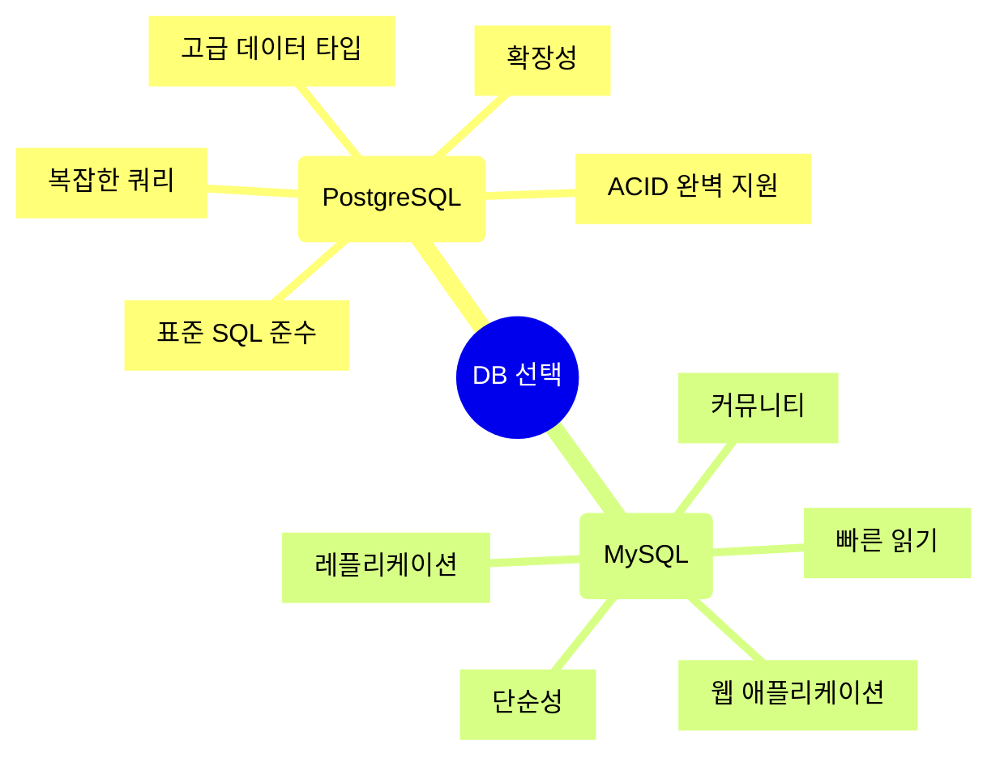

## 📦 사용하는 패키지/기술 버전 정보

- Docker Engine 27.0+
- PostgreSQL 16.0
- psycopg2-binary==2.9.9 (Python PostgreSQL 어댑터)
- pgvector==0.3.6 (벡터 유사도 검색 확장)
- numpy==1.26.4
- python-dotenv==1.1.0

## 🚀 TL;DR

- PostgreSQL은 강력한 오픈소스 관계형 데이터베이스로, MySQL보다 **표준 SQL 준수**와 **고급 기능**에 강점이 있다
- MySQL은 **읽기 성능**과 **단순성**이 우수하며, PostgreSQL은 **복잡한 쿼리**와 **확장성**에서 뛰어나다
- Docker를 활용하면 PostgreSQL 환경을 **빠르게 구축**하고 **격리된 환경**에서 실습할 수 있다
- 기본 CRUD 작업은 표준 SQL과 유사하지만, PostgreSQL 특유의 **고급 데이터 타입**과 **함수**를 활용할 수 있다
- **pgvector 확장**을 통해 PostgreSQL을 Vector DB로 활용하여 임베딩 기반 유사도 검색이 가능하다
- 벡터 검색은 RAG(Retrieval-Augmented Generation), 추천 시스템, 이미지 검색 등에 활용된다
- PostgreSQL의 **트랜잭션**, **동시성 제어**, **JSON 지원** 등은 복잡한 애플리케이션에 적합하다

## 📓 실습 Jupyter Notebook

- w.i.p.

## 🆚 PostgreSQL vs MySQL: 어떤 것을 선택할까?

### PostgreSQL이란?

**PostgreSQL**은 1986년부터 개발된 객체-관계형 데이터베이스 관리 시스템(ORDBMS)이다. "세계에서 가장 진보한 오픈소스 관계형 데이터베이스"라는 슬로건처럼, 표준 SQL을 충실히 따르면서도 강력한 확장 기능을 제공한다.

### MySQL과의 주요 차이점



|특성|PostgreSQL|MySQL|
|---|---|---|
|**SQL 표준 준수**|매우 높음|중간|
|**고급 데이터 타입**|JSON, Array, UUID 등|제한적|
|**복잡한 쿼리 성능**|우수|보통|
|**단순 읽기 성능**|보통|우수|
|**동시성 제어**|MVCC (우수)|락 기반|
|**확장 기능**|풍부 (pgvector 등)|제한적|
|**트랜잭션 지원**|완벽한 ACID|스토리지 엔진 의존|
|**학습 곡선**|가파름|완만함|
|**레플리케이션**|다양한 방식|간단하고 성숙|

### 언제 PostgreSQL을 선택해야 할까?

**PostgreSQL이 적합한 경우**

- 복잡한 비즈니스 로직과 쿼리가 필요한 경우
- 데이터 무결성이 매우 중요한 금융, 의료 시스템
- JSON, 배열 등 고급 데이터 타입을 활용해야 하는 경우
- 지리정보시스템(GIS) 기능이 필요한 경우
- 벡터 검색, 전문 검색 등 확장 기능이 필요한 경우

**MySQL이 적합한 경우**

- 단순한 읽기 중심의 웹 애플리케이션
- 빠른 개발과 간단한 설정이 중요한 경우
- 레플리케이션 구성이 중요한 고가용성 환경
- MySQL 전문 인력이 있는 조직

> PostgreSQL과 MySQL은 경쟁 관계가 아니라 **서로 다른 강점**을 가진 도구다. 프로젝트의 요구사항에 맞는 데이터베이스를 선택하는 것이 중요하다.
{: .prompt-tip}

## 🐳 Docker로 PostgreSQL 환경 구축하기

### Docker 컨테이너 실행

```bash
# PostgreSQL 16 공식 이미지 다운로드 및 실행
docker run --name postgres-lab \
  -e POSTGRES_PASSWORD=mysecretpassword \
  -e POSTGRES_USER=postgres \
  -e POSTGRES_DB=testdb \
  -p 5432:5432 \
  -d postgres:16

# 컨테이너 상태 확인
docker ps

# 컨테이너 로그 확인
docker logs postgres-lab
```

**주요 환경 변수 설명**

- `POSTGRES_PASSWORD`: 슈퍼유저 비밀번호 (필수)
- `POSTGRES_USER`: 슈퍼유저 이름 (기본값: postgres)
- `POSTGRES_DB`: 초기 데이터베이스 이름
- `-p 5432:5432`: 호스트 포트:컨테이너 포트 매핑

### Python에서 PostgreSQL 연결

```python
import psycopg2
from psycopg2 import sql
import os
from dotenv import load_dotenv

# 환경 변수 로드
load_dotenv()

# 연결 설정
conn = psycopg2.connect(
    host="localhost",
    port=5432,
    database="testdb",
    user="postgres",
    password=os.getenv("DB_PASSWORD", "mysecretpassword")
)

# 커서 생성
cur = conn.cursor()

# 연결 테스트
cur.execute("SELECT version();")
version = cur.fetchone()
print(f"PostgreSQL 버전: {version[0]}")

# 연결 종료
cur.close()
conn.close()
```

> Docker를 사용하면 로컬 환경을 오염시키지 않고 여러 버전의 PostgreSQL을 동시에 테스트할 수 있다. 실습이 끝나면 `docker stop postgres-lab && docker rm postgres-lab` 명령으로 깔끔하게 정리할 수 있다.
{: .prompt-tip}

## 📝 기본 CRUD 작업

### 테이블 생성 (Create Table)

```python
import psycopg2

conn = psycopg2.connect(
    host="localhost",
    database="testdb",
    user="postgres",
    password="mysecretpassword"
)
cur = conn.cursor()

# 사용자 테이블 생성
cur.execute("""
    CREATE TABLE IF NOT EXISTS users (
        id SERIAL PRIMARY KEY,
        username VARCHAR(50) UNIQUE NOT NULL,
        email VARCHAR(100) UNIQUE NOT NULL,
        created_at TIMESTAMP DEFAULT CURRENT_TIMESTAMP,
        metadata JSONB
    )
""")

conn.commit()
print("테이블 생성 완료")

cur.close()
conn.close()
```

**PostgreSQL 특징**

- `SERIAL`: 자동 증가 정수 (MySQL의 AUTO_INCREMENT와 유사)
- `JSONB`: 이진 JSON 타입으로 인덱싱과 검색이 빠름
- `TIMESTAMP`: 시간대 정보 없는 타임스탬프 (TIMESTAMPTZ는 시간대 포함)

### 데이터 삽입 (Create)

```python
conn = psycopg2.connect(
    host="localhost",
    database="testdb",
    user="postgres",
    password="mysecretpassword"
)
cur = conn.cursor()

# 단일 레코드 삽입
cur.execute("""
    INSERT INTO users (username, email, metadata)
    VALUES (%s, %s, %s)
    RETURNING id
""", ("alice", "alice@example.com", '{"role": "admin", "age": 30}'))

user_id = cur.fetchone()[0]
print(f"삽입된 사용자 ID: {user_id}")

# 여러 레코드 일괄 삽입
users_data = [
    ("bob", "bob@example.com", '{"role": "user", "age": 25}'),
    ("charlie", "charlie@example.com", '{"role": "moderator", "age": 28}')
]

cur.executemany("""
    INSERT INTO users (username, email, metadata)
    VALUES (%s, %s, %s)
""", users_data)

conn.commit()
print(f"{cur.rowcount}개 레코드 삽입 완료")

cur.close()
conn.close()
```

> `RETURNING` 절은 PostgreSQL의 강력한 기능이다. INSERT, UPDATE, DELETE 후 영향받은 행의 특정 컬럼 값을 즉시 반환받을 수 있다. {: .prompt-tip}

### 데이터 조회 (Read)

```python
conn = psycopg2.connect(
    host="localhost",
    database="testdb",
    user="postgres",
    password="mysecretpassword"
)
cur = conn.cursor()

# 모든 사용자 조회
cur.execute("SELECT * FROM users")
rows = cur.fetchall()

for row in rows:
    print(f"ID: {row[0]}, 이름: {row[1]}, 이메일: {row[2]}")

# 조건부 조회 (JSON 필드 검색)
cur.execute("""
    SELECT username, email, metadata->>'role' as role
    FROM users
    WHERE metadata->>'role' = 'admin'
""")

admin_users = cur.fetchall()
print("\n관리자 사용자:")
for user in admin_users:
    print(f"이름: {user[0]}, 역할: {user[2]}")

# 집계 쿼리
cur.execute("""
    SELECT metadata->>'role' as role, COUNT(*) as count
    FROM users
    GROUP BY metadata->>'role'
""")

role_counts = cur.fetchall()
print("\n역할별 사용자 수:")
for role, count in role_counts:
    print(f"{role}: {count}명")

cur.close()
conn.close()
```

**PostgreSQL의 JSON 연산자**

- `->`: JSON 객체에서 키로 값 추출 (JSON 타입 반환)
- `->>`: JSON 객체에서 키로 값 추출 (텍스트 타입 반환)
- `@>`: JSON 포함 여부 확인
- `?`: 키 존재 여부 확인

### 데이터 수정 (Update)

```python
conn = psycopg2.connect(
    host="localhost",
    database="testdb",
    user="postgres",
    password="mysecretpassword"
)
cur = conn.cursor()

# 특정 사용자 정보 수정
cur.execute("""
    UPDATE users
    SET email = %s,
        metadata = jsonb_set(metadata, '{age}', '31')
    WHERE username = %s
    RETURNING id, username, metadata
""", ("alice_new@example.com", "alice"))

updated_user = cur.fetchone()
print(f"수정된 사용자: ID={updated_user[0]}, 이름={updated_user[1]}")

# 조건부 대량 수정
cur.execute("""
    UPDATE users
    SET metadata = jsonb_set(
        metadata,
        '{verified}',
        'true'
    )
    WHERE metadata->>'age' > '25'
""")

conn.commit()
print(f"{cur.rowcount}개 레코드 수정 완료")

cur.close()
conn.close()
```

**jsonb_set 함수**

- 첫 번째 인자: 대상 JSONB 컬럼
- 두 번째 인자: 수정할 경로 (배열 형태)
- 세 번째 인자: 새로운 값 (JSON 형태)

### 데이터 삭제 (Delete)

```python
conn = psycopg2.connect(
    host="localhost",
    database="testdb",
    user="postgres",
    password="mysecretpassword"
)
cur = conn.cursor()

# 특정 사용자 삭제
cur.execute("""
    DELETE FROM users
    WHERE username = %s
    RETURNING id, username
""", ("bob",))

deleted_user = cur.fetchone()
if deleted_user:
    print(f"삭제된 사용자: ID={deleted_user[0]}, 이름={deleted_user[1]}")

# 조건부 대량 삭제
cur.execute("""
    DELETE FROM users
    WHERE created_at < NOW() - INTERVAL '30 days'
""")

conn.commit()
print(f"{cur.rowcount}개 레코드 삭제 완료")

cur.close()
conn.close()
```

> PostgreSQL의 `INTERVAL` 타입은 시간 계산을 직관적으로 만든다. `NOW() - INTERVAL '30 days'`, `NOW() + INTERVAL '1 hour'` 등 자연어처럼 표현할 수 있다. {: .prompt-tip}

## 🎯 트랜잭션과 동시성 제어

### 트랜잭션 기본

```python
conn = psycopg2.connect(
    host="localhost",
    database="testdb",
    user="postgres",
    password="mysecretpassword"
)

try:
    cur = conn.cursor()
    
    # 트랜잭션 시작 (기본적으로 자동 시작)
    cur.execute("BEGIN")
    
    # 계좌 이체 시뮬레이션
    cur.execute("""
        UPDATE accounts
        SET balance = balance - 100
        WHERE user_id = 1
    """)
    
    cur.execute("""
        UPDATE accounts
        SET balance = balance + 100
        WHERE user_id = 2
    """)
    
    # 모든 작업 성공 시 커밋
    conn.commit()
    print("트랜잭션 성공")
    
except Exception as e:
    # 오류 발생 시 롤백
    conn.rollback()
    print(f"트랜잭션 실패: {e}")
    
finally:
    cur.close()
    conn.close()
```

### MVCC (Multi-Version Concurrency Control)

PostgreSQL은 **MVCC**를 사용하여 읽기와 쓰기가 서로를 블로킹하지 않는다.

```python
import psycopg2
from psycopg2 import sql
import threading
import time

def reader_transaction():
    """읽기 트랜잭션"""
    conn = psycopg2.connect(
        host="localhost",
        database="testdb",
        user="postgres",
        password="mysecretpassword"
    )
    cur = conn.cursor()
    
    # 반복 읽기 격리 수준
    cur.execute("SET TRANSACTION ISOLATION LEVEL REPEATABLE READ")
    cur.execute("BEGIN")
    
    # 첫 번째 읽기
    cur.execute("SELECT balance FROM accounts WHERE user_id = 1")
    balance1 = cur.fetchone()[0]
    print(f"Reader - 첫 번째 읽기: {balance1}")
    
    time.sleep(2)  # 대기
    
    # 두 번째 읽기 (동일한 트랜잭션 내)
    cur.execute("SELECT balance FROM accounts WHERE user_id = 1")
    balance2 = cur.fetchone()[0]
    print(f"Reader - 두 번째 읽기: {balance2}")
    
    conn.commit()
    cur.close()
    conn.close()

def writer_transaction():
    """쓰기 트랜잭션"""
    time.sleep(1)  # 읽기가 먼저 시작하도록 대기
    
    conn = psycopg2.connect(
        host="localhost",
        database="testdb",
        user="postgres",
        password="mysecretpassword"
    )
    cur = conn.cursor()
    
    # 잔액 업데이트
    cur.execute("""
        UPDATE accounts
        SET balance = balance + 100
        WHERE user_id = 1
    """)
    
    conn.commit()
    print("Writer - 업데이트 완료")
    
    cur.close()
    conn.close()

# 동시 실행
reader = threading.Thread(target=reader_transaction)
writer = threading.Thread(target=writer_transaction)

reader.start()
writer.start()

reader.join()
writer.join()

# 출력:
# Reader - 첫 번째 읽기: 1000
# Writer - 업데이트 완료
# Reader - 두 번째 읽기: 1000  <- 동일한 값 (REPEATABLE READ)
```

> MVCC 덕분에 PostgreSQL은 읽기 작업이 쓰기를 기다리지 않는다. 이는 높은 동시성 환경에서 큰 장점이다. {: .prompt-tip}

## 🔍 Vector DB로 PostgreSQL 활용하기

### pgvector 확장 설치

```bash
# Docker 컨테이너 내부에 접속
docker exec -it postgres-lab bash

# psql로 데이터베이스 접속
psql -U postgres -d testdb

-- pgvector 확장 생성
CREATE EXTENSION vector;

-- 확장 확인
\dx
```

또는 Python에서:

```python
import psycopg2

conn = psycopg2.connect(
    host="localhost",
    database="testdb",
    user="postgres",
    password="mysecretpassword"
)
cur = conn.cursor()

# pgvector 확장 생성
cur.execute("CREATE EXTENSION IF NOT EXISTS vector")
conn.commit()

# 확장 확인
cur.execute("""
    SELECT * FROM pg_extension
    WHERE extname = 'vector'
""")

if cur.fetchone():
    print("pgvector 확장 설치 완료")
    
cur.close()
conn.close()
```

### 벡터 테이블 생성

```python
import psycopg2
import numpy as np

conn = psycopg2.connect(
    host="localhost",
    database="testdb",
    user="postgres",
    password="mysecretpassword"
)
cur = conn.cursor()

# 문서 임베딩 테이블 생성
cur.execute("""
    CREATE TABLE IF NOT EXISTS documents (
        id SERIAL PRIMARY KEY,
        content TEXT NOT NULL,
        embedding vector(384),  -- 384차원 벡터
        created_at TIMESTAMP DEFAULT CURRENT_TIMESTAMP
    )
""")

# 벡터 유사도 검색을 위한 인덱스 생성
cur.execute("""
    CREATE INDEX ON documents
    USING ivfflat (embedding vector_cosine_ops)
    WITH (lists = 100)
""")

conn.commit()
print("벡터 테이블 및 인덱스 생성 완료")

cur.close()
conn.close()
```

**인덱스 타입**

- `ivfflat`: 근사 최근접 이웃 검색 (빠르지만 약간 부정확)
- `hnsw`: 계층적 네비게이블 소월드 (더 정확하지만 메모리 사용량 높음)

**거리 연산자**

- `vector_cosine_ops`: 코사인 유사도 (기본값, 가장 많이 사용)
- `vector_l2_ops`: 유클리디안 거리
- `vector_ip_ops`: 내적

### 벡터 데이터 삽입

```python
import psycopg2
import numpy as np
from typing import List

def get_dummy_embedding(text: str, dim: int = 384) -> List[float]:
    """
    실제로는 Sentence Transformers 등을 사용하지만,
    예시를 위한 더미 임베딩 생성 함수
    """
    np.random.seed(hash(text) % 2**32)
    embedding = np.random.rand(dim).astype(np.float32)
    # 정규화
    embedding = embedding / np.linalg.norm(embedding)
    return embedding.tolist()

conn = psycopg2.connect(
    host="localhost",
    database="testdb",
    user="postgres",
    password="mysecretpassword"
)
cur = conn.cursor()

# 샘플 문서
documents = [
    "머신러닝은 데이터로부터 패턴을 학습하는 기술이다",
    "딥러닝은 신경망을 사용한 머신러닝의 한 분야이다",
    "자연어 처리는 컴퓨터가 인간의 언어를 이해하도록 하는 기술이다",
    "컴퓨터 비전은 이미지와 비디오를 분석하는 AI 분야이다",
    "강화학습은 에이전트가 환경과 상호작용하며 학습하는 방법이다"
]

# 문서와 임베딩 삽입
for doc in documents:
    embedding = get_dummy_embedding(doc)
    cur.execute("""
        INSERT INTO documents (content, embedding)
        VALUES (%s, %s)
    """, (doc, embedding))

conn.commit()
print(f"{len(documents)}개 문서 삽입 완료")

cur.close()
conn.close()
```

> 실제 프로덕션 환경에서는 OpenAI Embeddings, Sentence Transformers, Cohere 등의 임베딩 모델을 사용해야 한다. {: .prompt-warning}

### 벡터 유사도 검색

```python
import psycopg2
import numpy as np

def search_similar_documents(query: str, top_k: int = 3):
    """쿼리와 유사한 문서 검색"""
    conn = psycopg2.connect(
        host="localhost",
        database="testdb",
        user="postgres",
        password="mysecretpassword"
    )
    cur = conn.cursor()
    
    # 쿼리 임베딩 생성
    query_embedding = get_dummy_embedding(query)
    
    # 코사인 유사도 기반 검색
    cur.execute("""
        SELECT 
            id,
            content,
            1 - (embedding <=> %s::vector) as similarity
        FROM documents
        ORDER BY embedding <=> %s::vector
        LIMIT %s
    """, (query_embedding, query_embedding, top_k))
    
    results = cur.fetchall()
    
    print(f"\n쿼리: '{query}'")
    print(f"상위 {top_k}개 유사 문서:")
    for i, (doc_id, content, similarity) in enumerate(results, 1):
        print(f"{i}. [유사도: {similarity:.4f}] {content}")
    
    cur.close()
    conn.close()
    
    return results

# 검색 예시
search_similar_documents("신경망과 딥러닝에 대해 알려줘")
search_similar_documents("이미지 인식 기술")

# 출력 예시:
# 쿼리: '신경망과 딥러닝에 대해 알려줘'
# 상위 3개 유사 문서:
# 1. [유사도: 0.9234] 딥러닝은 신경망을 사용한 머신러닝의 한 분야이다
# 2. [유사도: 0.8756] 머신러닝은 데이터로부터 패턴을 학습하는 기술이다
# 3. [유사도: 0.7892] 자연어 처리는 컴퓨터가 인간의 언어를 이해하도록 하는 기술이다
```

**연산자 설명**

- `<=>`: 코사인 거리 (1 - 코사인 유사도)
- `<->`: 유클리디안 거리 (L2 distance)
- `<#>`: 내적의 음수값

### 실전 예시: RAG 시스템 구축

```python
import psycopg2
from typing import List, Tuple
import numpy as np

class VectorDatabase:
    """PostgreSQL + pgvector 기반 벡터 데이터베이스 래퍼"""
    
    def __init__(self, host: str, database: str, user: str, password: str):
        self.conn_params = {
            "host": host,
            "database": database,
            "user": user,
            "password": password
        }
    
    def _get_connection(self):
        return psycopg2.connect(**self.conn_params)
    
    def add_document(self, content: str, metadata: dict = None):
        """문서 추가"""
        conn = self._get_connection()
        cur = conn.cursor()
        
        embedding = get_dummy_embedding(content)
        
        cur.execute("""
            INSERT INTO documents (content, embedding, metadata)
            VALUES (%s, %s, %s)
            RETURNING id
        """, (content, embedding, metadata))
        
        doc_id = cur.fetchone()[0]
        conn.commit()
        
        cur.close()
        conn.close()
        
        return doc_id
    
    def search(
        self, 
        query: str, 
        top_k: int = 5,
        threshold: float = 0.7
    ) -> List[Tuple[int, str, float]]:
        """유사도 검색"""
        conn = self._get_connection()
        cur = conn.cursor()
        
        query_embedding = get_dummy_embedding(query)
        
        cur.execute("""
            SELECT 
                id,
                content,
                1 - (embedding <=> %s::vector) as similarity
            FROM documents
            WHERE 1 - (embedding <=> %s::vector) > %s
            ORDER BY embedding <=> %s::vector
            LIMIT %s
        """, (query_embedding, query_embedding, threshold, query_embedding, top_k))
        
        results = cur.fetchall()
        
        cur.close()
        conn.close()
        
        return results
    
    def delete_document(self, doc_id: int):
        """문서 삭제"""
        conn = self._get_connection()
        cur = conn.cursor()
        
        cur.execute("DELETE FROM documents WHERE id = %s", (doc_id,))
        conn.commit()
        
        cur.close()
        conn.close()

# 사용 예시
db = VectorDatabase(
    host="localhost",
    database="testdb",
    user="postgres",
    password="mysecretpassword"
)

# 문서 추가
doc_id = db.add_document(
    "PostgreSQL은 강력한 오픈소스 데이터베이스다",
    metadata={"category": "database", "source": "tutorial"}
)
print(f"문서 추가 완료: ID={doc_id}")

# 검색
results = db.search("데이터베이스 추천", top_k=3)
for doc_id, content, similarity in results:
    print(f"[{similarity:.4f}] {content}")
```

## 🔧 고급 기능

### 배열 타입 활용

```python
import psycopg2

conn = psycopg2.connect(
    host="localhost",
    database="testdb",
    user="postgres",
    password="mysecretpassword"
)
cur = conn.cursor()

# 배열 컬럼을 가진 테이블 생성
cur.execute("""
    CREATE TABLE IF NOT EXISTS articles (
        id SERIAL PRIMARY KEY,
        title TEXT,
        tags TEXT[],  -- 문자열 배열
        scores INTEGER[]  -- 정수 배열
    )
""")

# 배열 데이터 삽입
cur.execute("""
    INSERT INTO articles (title, tags, scores)
    VALUES (%s, %s, %s)
""", (
    "PostgreSQL 튜토리얼",
    ["database", "sql", "postgres"],
    [5, 4, 5, 3, 4]
))

# 배열 검색
cur.execute("""
    SELECT title, tags
    FROM articles
    WHERE 'postgres' = ANY(tags)
""")

results = cur.fetchall()
for title, tags in results:
    print(f"제목: {title}, 태그: {tags}")

# 배열 집계
cur.execute("""
    SELECT 
        title,
        array_length(tags, 1) as tag_count,
        round(avg(x)) as avg_score
    FROM articles, unnest(scores) as x
    GROUP BY id, title
""")

conn.commit()
cur.close()
conn.close()
```

### 전문 검색 (Full-Text Search)

```python
import psycopg2

conn = psycopg2.connect(
    host="localhost",
    database="testdb",
    user="postgres",
    password="mysecretpassword"
)
cur = conn.cursor()

# 전문 검색을 위한 테이블
cur.execute("""
    CREATE TABLE IF NOT EXISTS posts (
        id SERIAL PRIMARY KEY,
        title TEXT,
        content TEXT,
        search_vector tsvector
    )
""")

# 검색 벡터 자동 생성 트리거
cur.execute("""
    CREATE OR REPLACE FUNCTION posts_search_trigger()
    RETURNS trigger AS $$
    BEGIN
        NEW.search_vector :=
            setweight(to_tsvector('english', COALESCE(NEW.title, '')), 'A') ||
            setweight(to_tsvector('english', COALESCE(NEW.content, '')), 'B');
        RETURN NEW;
    END;
    $$ LANGUAGE plpgsql;
    
    CREATE TRIGGER posts_search_update
    BEFORE INSERT OR UPDATE ON posts
    FOR EACH ROW EXECUTE FUNCTION posts_search_trigger();
""")

# 검색 인덱스 생성
cur.execute("""
    CREATE INDEX posts_search_idx ON posts
    USING GIN (search_vector)
""")

# 데이터 삽입
cur.execute("""
    INSERT INTO posts (title, content)
    VALUES 
        ('PostgreSQL Tutorial', 'Learn how to use PostgreSQL database'),
        ('Python Programming', 'Introduction to Python programming language')
""")

# 전문 검색 실행
cur.execute("""
    SELECT title, content,
           ts_rank(search_vector, query) as rank
    FROM posts,
         to_tsquery('english', 'PostgreSQL | database') as query
    WHERE search_vector @@ query
    ORDER BY rank DESC
""")

results = cur.fetchall()
for title, content, rank in results:
    print(f"[순위: {rank:.4f}] {title}")

conn.commit()
cur.close()
conn.close()
```

## 🎓 실무 활용 팁

### 연결 풀링 (Connection Pooling)

```python
from psycopg2 import pool
import contextlib

# 연결 풀 생성
connection_pool = pool.SimpleConnectionPool(
    minconn=1,
    maxconn=10,
    host="localhost",
    database="testdb",
    user="postgres",
    password="mysecretpassword"
)

@contextlib.contextmanager
def get_db_connection():
    """컨텍스트 매니저로 연결 관리"""
    conn = connection_pool.getconn()
    try:
        yield conn
    finally:
        connection_pool.putconn(conn)

# 사용 예시
with get_db_connection() as conn:
    cur = conn.cursor()
    cur.execute("SELECT COUNT(*) FROM users")
    count = cur.fetchone()[0]
    print(f"총 사용자 수: {count}")
    cur.close()
```

> 연결 풀링은 데이터베이스 연결을 재사용하여 성능을 크게 향상시킨다. 웹 애플리케이션에서는 필수적이다. {: .prompt-tip}

### 대량 데이터 처리

```python
import psycopg2
from psycopg2.extras import execute_values
import numpy as np

conn = psycopg2.connect(
    host="localhost",
    database="testdb",
    user="postgres",
    password="mysecretpassword"
)
cur = conn.cursor()

# execute_values로 대량 삽입 (executemany보다 훨씬 빠름)
data = [(f"user_{i}", f"user{i}@example.com") for i in range(10000)]

execute_values(
    cur,
    "INSERT INTO users (username, email) VALUES %s",
    data,
    template="(%s, %s)"
)

conn.commit()
print(f"{len(data)}개 레코드 삽입 완료")

# COPY 명령으로 초고속 삽입
with open('/tmp/users.csv', 'w') as f:
    for i in range(10000):
        f.write(f"user_{i},user{i}@example.com\n")

with open('/tmp/users.csv', 'r') as f:
    cur.copy_from(
        f,
        'users',
        columns=('username', 'email'),
        sep=','
    )

conn.commit()
print("COPY로 대량 삽입 완료")

cur.close()
conn.close()
```

### 성능 모니터링

```python
import psycopg2

conn = psycopg2.connect(
    host="localhost",
    database="testdb",
    user="postgres",
    password="mysecretpassword"
)
cur = conn.cursor()

# 느린 쿼리 확인
cur.execute("""
    SELECT 
        query,
        calls,
        total_time,
        mean_time,
        rows
    FROM pg_stat_statements
    ORDER BY mean_time DESC
    LIMIT 10
""")

# 테이블 크기 확인
cur.execute("""
    SELECT 
        schemaname,
        tablename,
        pg_size_pretty(pg_total_relation_size(schemaname||'.'||tablename))
    FROM pg_tables
    WHERE schemaname = 'public'
    ORDER BY pg_total_relation_size(schemaname||'.'||tablename) DESC
""")

# 인덱스 사용률 확인
cur.execute("""
    SELECT 
        schemaname,
        tablename,
        indexname,
        idx_scan,
        idx_tup_read
    FROM pg_stat_user_indexes
    WHERE idx_scan = 0
    ORDER BY pg_relation_size(indexrelid) DESC
""")

cur.close()
conn.close()
```

## 📚 마치며

PostgreSQL은 단순한 데이터베이스를 넘어 **강력한 데이터 플랫폼**이다. 표준 SQL을 충실히 따르면서도 JSON, 배열, 벡터 등 현대적인 데이터 타입을 지원하고, pgvector 같은 확장으로 AI/ML 워크로드까지 처리할 수 있다.

**핵심 포인트**

- MySQL과 비교했을 때, 복잡한 쿼리와 데이터 무결성이 중요하다면 PostgreSQL 선택
- Docker를 활용하면 격리된 환경에서 안전하게 실습 가능
- 기본 CRUD는 표준 SQL과 유사하지만 JSONB, 배열 등 고급 타입 활용 가능
- pgvector로 Vector DB 기능을 구현하여 RAG, 추천 시스템 등에 활용
- 트랜잭션과 MVCC로 높은 동시성 환경에서도 안정적 운영
- 연결 풀링과 COPY 명령으로 성능 최적화

> PostgreSQL은 학습 곡선이 가파르지만, 그만큼 강력한 기능을 제공한다. 프로젝트의 요구사항을 정확히 파악하고 적절한 데이터베이스를 선택하는 것이 중요하다.
{: .prompt-tip}
