## 📦 사용하는 패키지/기술

- rdflib==7.1.1
- owlready2==0.46
- networkx==3.4.2
- matplotlib==3.10.1
- pandas==2.2.3

## 🚀 TL;DR

- **데이터 온톨로지(Data Ontology)** 는 특정 도메인의 개념과 그 관계를 형식적으로 정의한 지식 표현 체계다
- 온톨로지는 **클래스(Class)**, **속성(Property)**, **개체(Instance)**, **관계(Relationship)** 로 구성된다
- **RDF**, **RDFS**, **OWL** 은 온톨로지를 표현하는 표준 언어이며, 각각 다른 수준의 표현력을 제공한다
- 온톨로지는 지식 그래프, 시맨틱 검색, 추론 시스템 등에 활용되어 데이터에 의미를 부여한다
- Python의 `rdflib`과 `owlready2` 라이브러리로 온톨로지를 생성하고 조작할 수 있다
- 머신러닝에서는 특성 공학, 지식 기반 추천, 도메인 제약 조건 적용 등에 온톨로지가 활용된다
- 온톨로지는 데이터베이스의 스키마보다 더 풍부한 의미론적 정보를 표현할 수 있다

## 🎯 데이터 온톨로지란?

**데이터 온톨로지(Data Ontology)** 는 특정 도메인에 존재하는 **개념(Concept)** 과 그들 사이의 **관계(Relationship)** 를 명시적으로 정의한 형식적인 지식 표현 체계다.

쉽게 말해서, 온톨로지는 "어떤 것이 무엇이고, 무엇과 어떤 관계를 가지는지"를 컴퓨터가 이해할 수 있는 형태로 표현한 것이다.

### 일상적 비유로 이해하기

온톨로지를 가족 관계도에 비유할 수 있다.

- **클래스(Class)**: "사람", "남자", "여자" 같은 범주
- **개체(Instance)**: "홍길동", "김영희" 같은 구체적인 사람
- **속성(Property)**: "나이", "직업", "주소" 같은 특징
- **관계(Relationship)**: "부모", "자녀", "배우자" 같은 연결

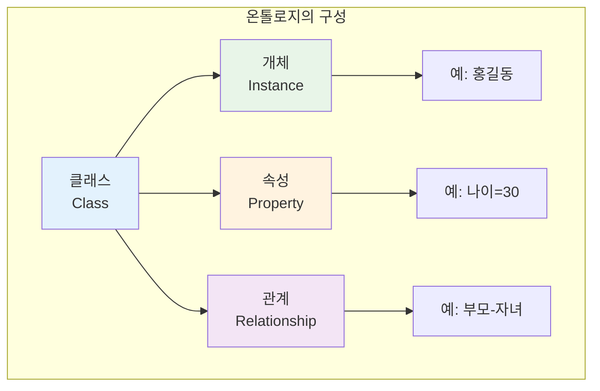

### 데이터베이스 스키마 vs 온톨로지

|특성|데이터베이스 스키마|온톨로지|
|---|---|---|
|**목적**|데이터 저장 구조 정의|지식과 의미 표현|
|**표현력**|테이블, 컬럼, 키|클래스, 속성, 관계, 제약조건|
|**추론**|제한적 (쿼리 기반)|논리 추론 가능|
|**유연성**|고정된 구조|확장 가능한 계층|
|**상호운용성**|시스템 종속적|표준 기반 (RDF, OWL)|

> **핵심 차이점**: 데이터베이스 스키마는 "데이터를 어떻게 저장할 것인가"에 초점을 맞추지만, 온톨로지는 "데이터가 무엇을 의미하는가"에 초점을 맞춘다.
{: .prompt-tip}

## 🏗️ 온톨로지의 핵심 구성요소

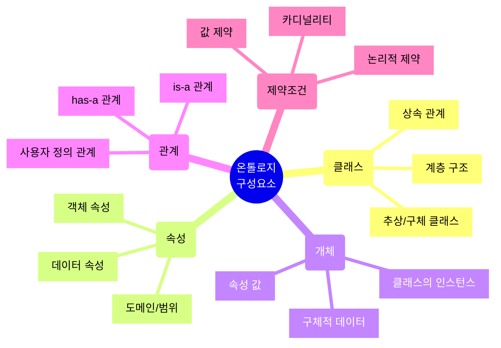

### 1. 클래스(Class)

클래스는 **비슷한 특성을 가진 개체들의 집합** 을 나타낸다. 객체지향 프로그래밍의 클래스 개념과 유사하지만, 더 풍부한 의미론적 정보를 포함한다.

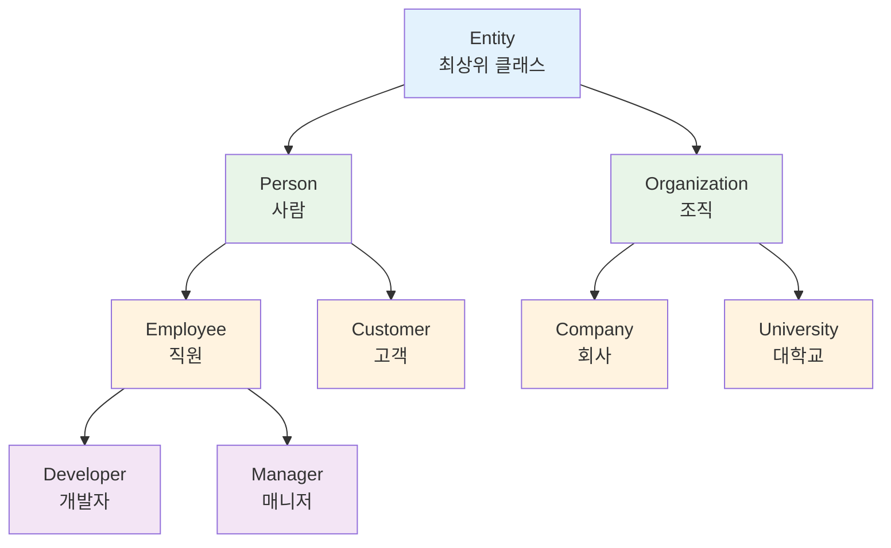

**클래스의 특징**

- **계층 구조**: 상위 클래스(superclass)와 하위 클래스(subclass) 관계
- **상속**: 하위 클래스는 상위 클래스의 모든 속성과 관계를 상속
- **다중 상속**: 하나의 클래스가 여러 상위 클래스를 가질 수 있음

### 2. 속성(Property)

속성은 클래스나 개체의 **특징이나 특성** 을 나타낸다. 두 가지 주요 유형이 있다.

#### 데이터 속성(Datatype Property)

리터럴 값(문자열, 숫자, 날짜 등)을 가지는 속성

```python
# 예시
person.name = "홍길동"  # 문자열
person.age = 30  # 정수
person.birthDate = "1994-01-01"  # 날짜
person.height = 175.5  # 실수
```

#### 객체 속성(Object Property)

다른 개체와의 관계를 나타내는 속성

```python
# 예시
person.worksFor = company  # 회사 개체와의 관계
person.hasFriend = another_person  # 다른 사람 개체와의 관계
```

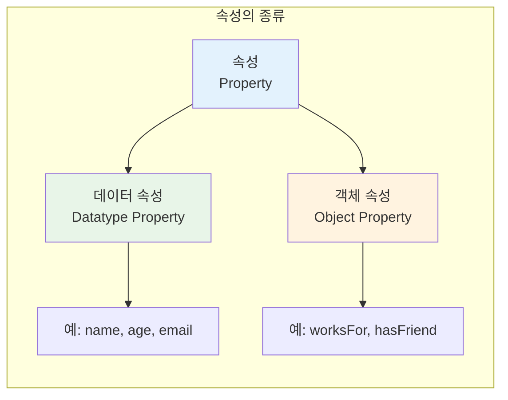

### 3. 개체(Instance)

개체는 **클래스의 구체적인 실현** 이다. 실제 데이터를 담고 있는 개별 항목이다.

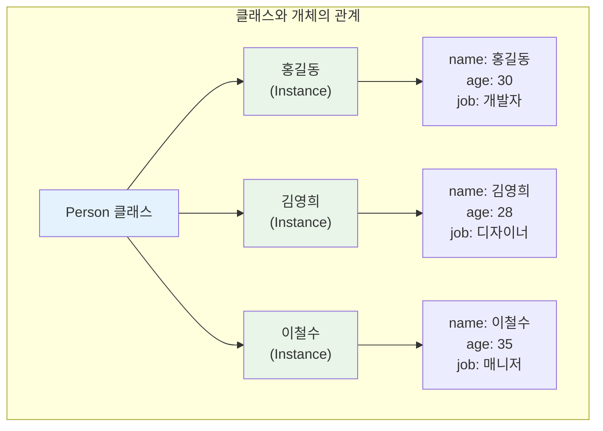

### 4. 관계(Relationship)

관계는 **개체들 사이의 연결** 을 나타낸다. 온톨로지의 핵심적인 부분이다.

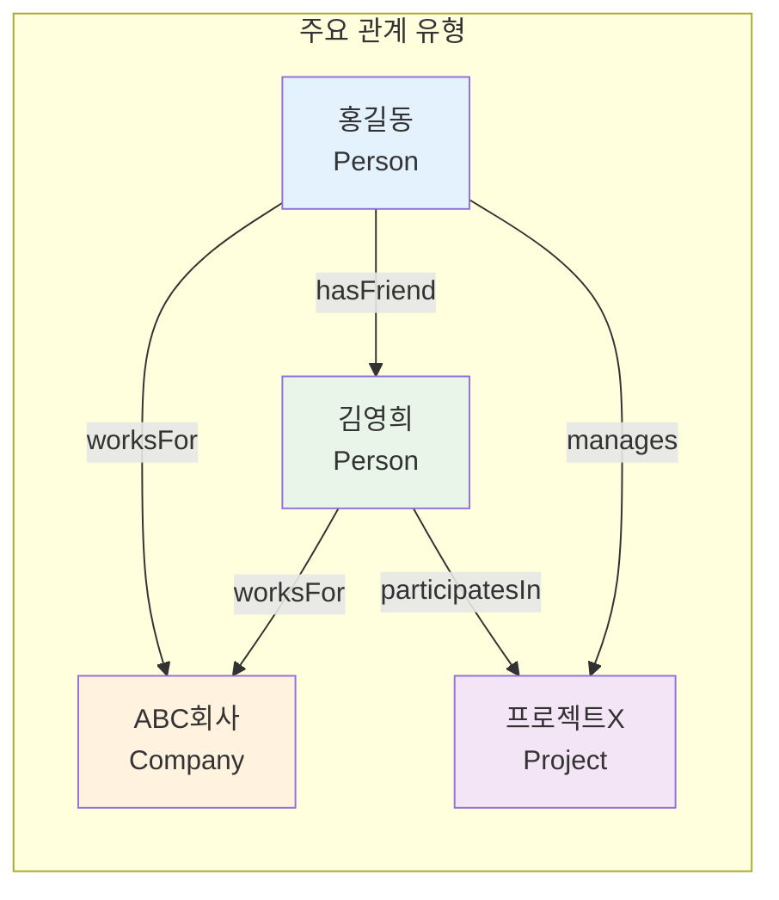

**관계의 특성**

- **방향성**: 단방향 또는 양방향
- **카디널리티**: 일대일, 일대다, 다대다
- **대칭성**: 대칭 관계(예: hasFriend) vs 비대칭 관계(예: isParentOf)
- **전이성**: 전이적 관계(예: isAncestorOf)

### 5. 제약조건(Constraints)

제약조건은 온톨로지의 **논리적 규칙과 제한** 을 정의한다.

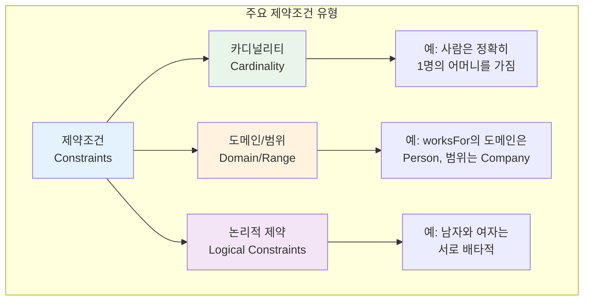

## 🔤 온톨로지 표준 언어

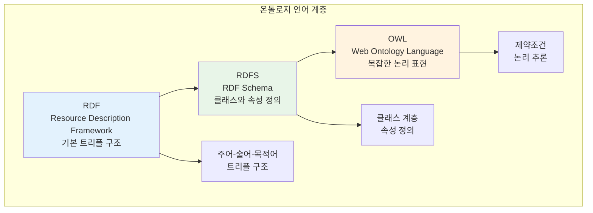

### RDF (Resource Description Framework)

**RDF** 는 웹상의 리소스를 기술하기 위한 기본 프레임워크다. 모든 정보를 **주어(Subject) - 술어(Predicate) - 목적어(Object)** 형태의 **트리플(Triple)** 로 표현한다.

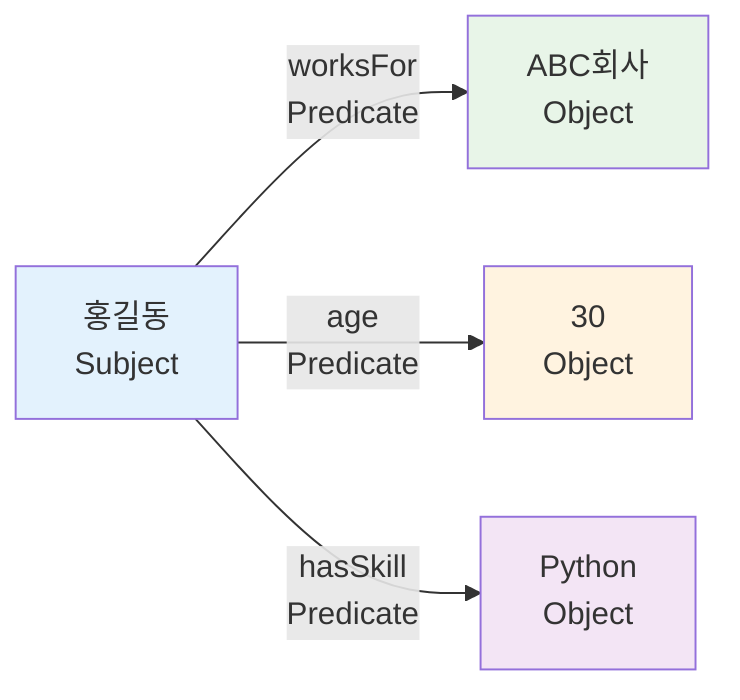

**RDF의 기본 구조**

```python
from rdflib import Graph, Namespace, Literal, URIRef
from rdflib.namespace import RDF, RDFS, XSD

# 그래프 생성
g = Graph()

# 네임스페이스 정의
ex = Namespace("http://example.org/")

# 트리플 추가
hong = URIRef(ex.HongGildong)
abc_company = URIRef(ex.ABCCompany)

# "홍길동은 ABC회사에서 일한다"
g.add((hong, ex.worksFor, abc_company))

# "홍길동의 나이는 30이다"
g.add((hong, ex.age, Literal(30, datatype=XSD.integer)))

# "홍길동은 Python 스킬을 가지고 있다"
g.add((hong, ex.hasSkill, Literal("Python")))

# 그래프 출력
for subject, predicate, obj in g:
    print(f"{subject} {predicate} {obj}")
# 출력:
# http://example.org/HongGildong http://example.org/worksFor http://example.org/ABCCompany
# http://example.org/HongGildong http://example.org/age 30
# http://example.org/HongGildong http://example.org/hasSkill Python
```

### RDFS (RDF Schema)

**RDFS** 는 RDF를 확장하여 **클래스와 속성을 정의** 할 수 있게 한다. 간단한 온톨로지 구축에 사용된다.

```python
from rdflib import Graph, Namespace, Literal, URIRef
from rdflib.namespace import RDF, RDFS

g = Graph()
ex = Namespace("http://example.org/")

# 클래스 정의
person_class = URIRef(ex.Person)
company_class = URIRef(ex.Company)

g.add((person_class, RDF.type, RDFS.Class))
g.add((company_class, RDF.type, RDFS.Class))

# 속성 정의
works_for = URIRef(ex.worksFor)
g.add((works_for, RDF.type, RDF.Property))
g.add((works_for, RDFS.domain, person_class))  # 주어는 Person
g.add((works_for, RDFS.range, company_class))  # 목적어는 Company

# 개체 생성
hong = URIRef(ex.HongGildong)
g.add((hong, RDF.type, person_class))

abc = URIRef(ex.ABCCompany)
g.add((abc, RDF.type, company_class))

# 관계 설정
g.add((hong, works_for, abc))

# 쿼리: Person 클래스의 모든 인스턴스 찾기
print("Person 클래스의 인스턴스:")
for s in g.subjects(RDF.type, person_class):
    print(f"  - {s}")
# 출력: http://example.org/HongGildong
```

### OWL (Web Ontology Language)

**OWL** 은 가장 표현력이 풍부한 온톨로지 언어로, 복잡한 논리적 관계와 제약조건을 표현할 수 있다.

```python
from owlready2 import *

# 온톨로지 생성
onto = get_ontology("http://example.org/company.owl")

with onto:
    # 클래스 정의
    class Person(Thing):
        pass
    
    class Company(Thing):
        pass
    
    class Developer(Person):
        pass
    
    # 속성 정의
    class worksFor(ObjectProperty):
        domain = [Person]
        range = [Company]
    
    class hasSkill(DataProperty):
        domain = [Developer]
        range = [str]
    
    class age(DataProperty):
        domain = [Person]
        range = [int]
    
    # 제약조건: 개발자는 최소 1개의 스킬을 가져야 함
    class Developer(Developer):
        is_a = [Person, hasSkill.min(1, str)]
    
    # 개체 생성
    hong = Developer("HongGildong")
    hong.age = [30]
    hong.hasSkill = ["Python", "Django", "FastAPI"]
    
    abc = Company("ABCCompany")
    hong.worksFor = [abc]

# 추론 실행
with onto:
    sync_reasoner()

# 결과 출력
print(f"Hong's skills: {hong.hasSkill}")
print(f"Hong works for: {hong.worksFor}")
# 출력:
# Hong's skills: ['Python', 'Django', 'FastAPI']
# Hong works for: [company.ABCCompany]
```

## 🎨 온톨로지 설계 과정

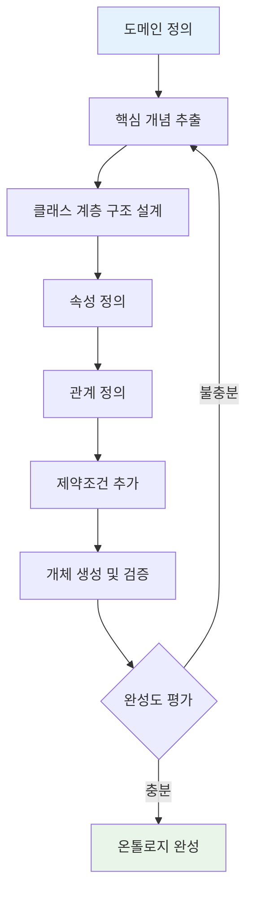

### 실제 예시: 회사 조직 온톨로지

회사 조직을 모델링하는 온톨로지를 단계별로 구축해보자.

#### 1단계: 도메인 정의

"회사 조직의 인사 관리 시스템"

#### 2단계: 핵심 개념 추출

- 사람(Person), 직원(Employee), 부서(Department)
- 프로젝트(Project), 기술(Skill), 역할(Role)

#### 3단계: 클래스 계층 구조

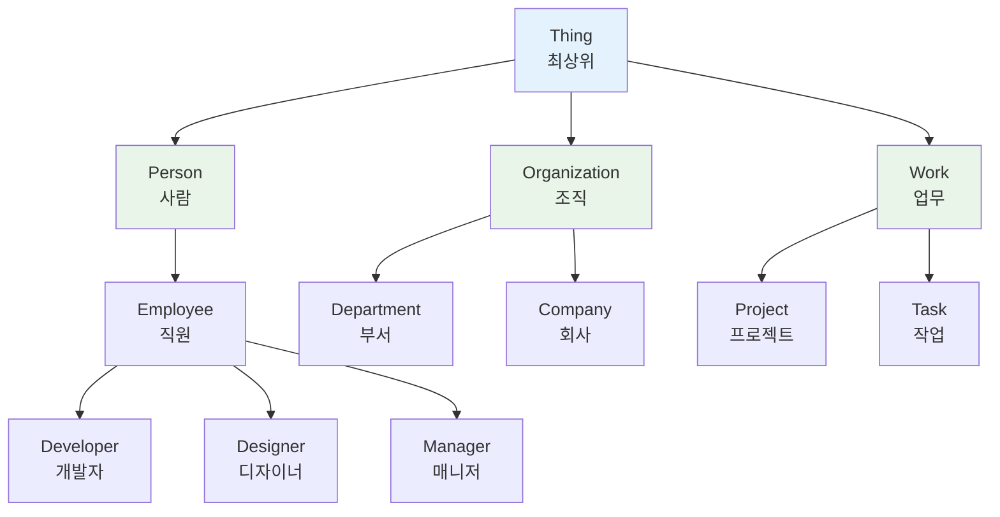

#### 4-5단계: 속성과 관계 정의

```python
from owlready2 import *

onto = get_ontology("http://example.org/organization.owl")

with onto:
    # 클래스 정의
    class Person(Thing):
        pass
    
    class Employee(Person):
        pass
    
    class Developer(Employee):
        pass
    
    class Manager(Employee):
        pass
    
    class Department(Thing):
        pass
    
    class Project(Thing):
        pass
    
    # 데이터 속성
    class name(DataProperty, FunctionalProperty):
        domain = [Person]
        range = [str]
    
    class employeeID(DataProperty, FunctionalProperty):
        domain = [Employee]
        range = [str]
    
    class salary(DataProperty):
        domain = [Employee]
        range = [int]
    
    class startDate(DataProperty):
        domain = [Employee]
        range = [str]
    
    # 객체 속성 (관계)
    class worksIn(ObjectProperty):
        domain = [Employee]
        range = [Department]
    
    class manages(ObjectProperty):
        domain = [Manager]
        range = [Department | Project]
    
    class worksOn(ObjectProperty):
        domain = [Employee]
        range = [Project]
    
    class hasMember(ObjectProperty):
        domain = [Department]
        range = [Employee]
        inverse_property = worksIn
    
    # 제약조건
    class Employee(Employee):
        is_a = [worksIn.exactly(1, Department)]  # 정확히 1개 부서에 소속
    
    class Manager(Manager):
        is_a = [manages.min(1)]  # 최소 1개 이상 관리
```

#### 6단계: 실제 데이터 생성

```python
with onto:
    # 부서 생성
    dev_dept = Department("DevelopmentDepartment")
    dev_dept.name = ["개발팀"]
    
    design_dept = Department("DesignDepartment")
    design_dept.name = ["디자인팀"]
    
    # 프로젝트 생성
    project_a = Project("ProjectA")
    project_a.name = ["모바일 앱 개발"]
    
    # 직원 생성
    hong = Developer("HongGildong")
    hong.name = ["홍길동"]
    hong.employeeID = ["EMP001"]
    hong.salary = [70000000]
    hong.worksIn = [dev_dept]
    hong.worksOn = [project_a]
    
    kim = Designer("KimYounghee")
    kim.name = ["김영희"]
    kim.employeeID = ["EMP002"]
    kim.salary = [65000000]
    kim.worksIn = [design_dept]
    kim.worksOn = [project_a]
    
    lee = Manager("LeeCheolsu")
    lee.name = ["이철수"]
    lee.employeeID = ["MGR001"]
    lee.salary = [90000000]
    lee.worksIn = [dev_dept]
    lee.manages = [dev_dept, project_a]

# 추론 실행
sync_reasoner()

# 쿼리: 개발팀의 모든 직원 찾기
print("개발팀 직원:")
for emp in dev_dept.hasMember:
    print(f"  - {emp.name[0]} ({emp.employeeID[0]})")
# 출력:
# 개발팀 직원:
#   - 홍길동 (EMP001)
#   - 이철수 (MGR001)

# 쿼리: ProjectA에 참여하는 모든 직원
print("\nProjectA 참여자:")
for emp in onto.Employee.instances():
    if project_a in emp.worksOn:
        print(f"  - {emp.name[0]}")
# 출력:
# ProjectA 참여자:
#   - 홍길동
#   - 김영희
```

## 🔍 온톨로지 쿼리: SPARQL

**SPARQL** 은 RDF 그래프를 쿼리하기 위한 표준 쿼리 언어다. SQL과 유사한 문법을 가지고 있다.

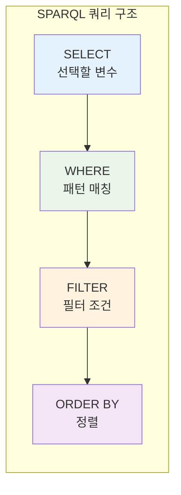

### 기본 SPARQL 쿼리

```python
from rdflib import Graph, Namespace, Literal
from rdflib.namespace import RDF, RDFS

# 그래프 생성 및 데이터 추가
g = Graph()
ex = Namespace("http://example.org/")

# 클래스와 개체 정의 (이전 예시와 동일)
# ... (생략)

# SPARQL 쿼리 1: 모든 직원과 그들의 부서 찾기
query1 = """
PREFIX ex: <http://example.org/>
PREFIX rdf: <http://www.w3.org/1999/02/22-rdf-syntax-ns#>

SELECT ?employee ?department
WHERE {
    ?employee rdf:type ex:Employee .
    ?employee ex:worksIn ?department .
}
"""

print("직원과 부서:")
for row in g.query(query1):
    print(f"  {row.employee} works in {row.department}")

# SPARQL 쿼리 2: 급여가 70,000,000 이상인 직원
query2 = """
PREFIX ex: <http://example.org/>

SELECT ?employee ?salary
WHERE {
    ?employee ex:salary ?salary .
    FILTER (?salary >= 70000000)
}
ORDER BY DESC(?salary)
"""

print("\n고액 연봉자:")
for row in g.query(query2):
    print(f"  {row.employee}: {row.salary}")
```

### 복잡한 SPARQL 쿼리

```python
# 쿼리 3: 프로젝트에 참여하는 직원 수 계산
query3 = """
PREFIX ex: <http://example.org/>

SELECT ?project (COUNT(?employee) as ?count)
WHERE {
    ?employee ex:worksOn ?project .
}
GROUP BY ?project
"""

print("\n프로젝트별 참여 인원:")
for row in g.query(query3):
    print(f"  {row.project}: {row.count}명")

# 쿼리 4: 매니저가 관리하는 프로젝트와 그 프로젝트의 팀원
query4 = """
PREFIX ex: <http://example.org/>
PREFIX rdf: <http://www.w3.org/1999/02/22-rdf-syntax-ns#>

SELECT ?manager ?project ?employee
WHERE {
    ?manager rdf:type ex:Manager .
    ?manager ex:manages ?project .
    ?employee ex:worksOn ?project .
    FILTER (?manager != ?employee)
}
"""

print("\n매니저-프로젝트-팀원 관계:")
for row in g.query(query4):
    print(f"  {row.manager} manages {row.project}, team member: {row.employee}")
```

## 🧠 온톨로지 추론(Reasoning)

온톨로지의 강력한 기능 중 하나는 **자동 추론** 이다. 명시적으로 정의되지 않은 관계도 논리적 규칙에 따라 추론할 수 있다.

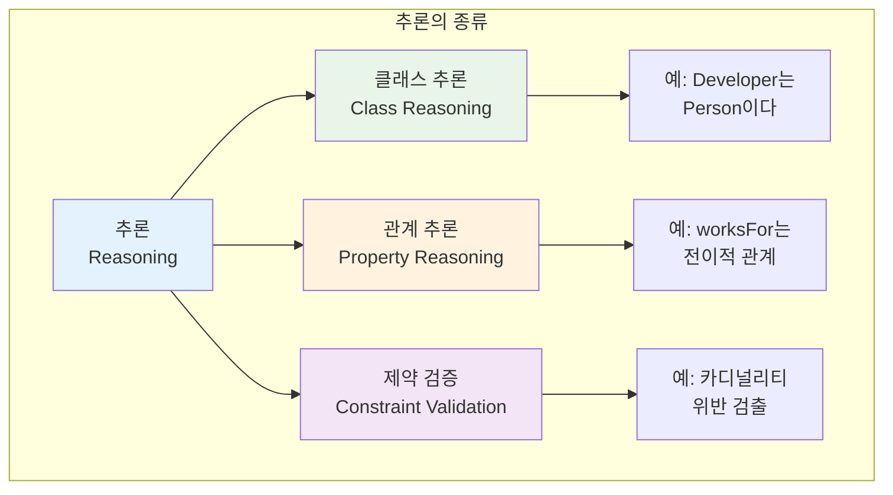

### 추론 예시

```python
from owlready2 import *

onto = get_ontology("http://example.org/inference.owl")

with onto:
    # 클래스와 관계 정의
    class Animal(Thing):
        pass
    
    class Mammal(Animal):
        pass
    
    class Dog(Mammal):
        pass
    
    class hasParent(ObjectProperty, TransitiveProperty):
        domain = [Animal]
        range = [Animal]
    
    class isAncestorOf(ObjectProperty, TransitiveProperty):
        domain = [Animal]
        range = [Animal]
        inverse_property = hasParent
    
    # 개체 생성
    grandparent = Dog("Grandparent")
    parent = Dog("Parent")
    child = Dog("Child")
    
    child.hasParent = [parent]
    parent.hasParent = [grandparent]

# 추론 실행 전
print("추론 전:")
print(f"Child의 조상: {child.INDIRECT_hasParent}")  # 직접 부모만 표시

# 추론 실행
sync_reasoner()

# 추론 실행 후
print("\n추론 후:")
print(f"Child의 조상: {child.INDIRECT_hasParent}")  # 조부모까지 추론됨
# 출력:
# 추론 후:
# Child의 조상: [inference.Parent, inference.Grandparent]

# 클래스 계층 추론
print(f"\nChild는 Animal인가? {Animal in child.is_a}")  # True (추론됨)
```

## 🎯 실무 활용 사례

### 1. 지식 그래프(Knowledge Graph)

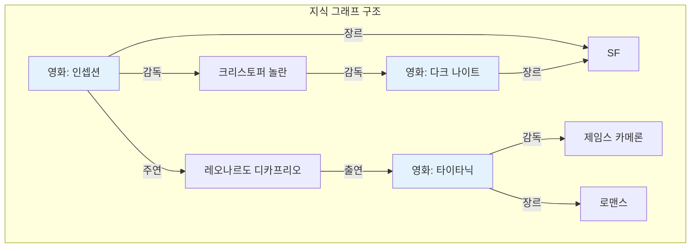

```python
from owlready2 import *

onto = get_ontology("http://example.org/movies.owl")

with onto:
    class Movie(Thing):
        pass
    
    class Person(Thing):
        pass
    
    class Director(Person):
        pass
    
    class Actor(Person):
        pass
    
    class Genre(Thing):
        pass
    
    # 관계 정의
    class directedBy(ObjectProperty):
        domain = [Movie]
        range = [Director]
    
    class starring(ObjectProperty):
        domain = [Movie]
        range = [Actor]
    
    class hasGenre(ObjectProperty):
        domain = [Movie]
        range = [Genre]
    
    # 데이터 입력
    inception = Movie("Inception")
    nolan = Director("ChristopherNolan")
    dicaprio = Actor("LeonardoDiCaprio")
    sf = Genre("SF")
    
    inception.directedBy = [nolan]
    inception.starring = [dicaprio]
    inception.hasGenre = [sf]

# 추천 쿼리: DiCaprio가 출연한 SF 영화
print("DiCaprio의 SF 영화:")
for movie in onto.Movie.instances():
    if dicaprio in movie.starring and sf in movie.hasGenre:
        print(f"  - {movie.name}")
```

### 2. 의료 온톨로지

```python
with onto:
    class Disease(Thing):
        pass
    
    class Symptom(Thing):
        pass
    
    class Treatment(Thing):
        pass
    
    class hasSymptom(ObjectProperty):
        domain = [Disease]
        range = [Symptom]
    
    class treatedBy(ObjectProperty):
        domain = [Disease]
        range = [Treatment]
    
    # 질병 정의
    flu = Disease("Flu")
    fever = Symptom("Fever")
    cough = Symptom("Cough")
    rest = Treatment("Rest")
    medication = Treatment("Medication")
    
    flu.hasSymptom = [fever, cough]
    flu.treatedBy = [rest, medication]

# 진단 보조: 증상으로 질병 찾기
def diagnose(symptoms):
    possible_diseases = []
    for disease in onto.Disease.instances():
        if all(s in disease.hasSymptom for s in symptoms):
            possible_diseases.append(disease)
    return possible_diseases

patient_symptoms = [fever, cough]
print(f"가능한 질병: {diagnose(patient_symptoms)}")
# 출력: 가능한 질병: [medical.Flu]
```

### 3. 머신러닝과의 통합

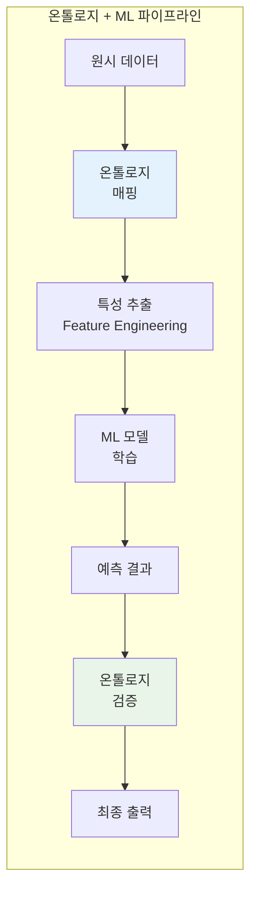

```python
import pandas as pd
from sklearn.ensemble import RandomForestClassifier
from owlready2 import *

# 온톨로지 기반 특성 추출
onto = get_ontology("http://example.org/hr.owl")

with onto:
    class Employee(Thing):
        pass
    
    class hasSkill(DataProperty):
        domain = [Employee]
        range = [str]
    
    class yearsOfExperience(DataProperty):
        domain = [Employee]
        range = [int]

# 데이터 준비
def extract_features_from_ontology(employee):
    skills = employee.hasSkill
    experience = employee.yearsOfExperience[0] if employee.yearsOfExperience else 0
    
    # 온톨로지 지식 활용: 스킬 카테고리화
    programming_skills = ["Python", "Java", "C++"]
    web_skills = ["HTML", "CSS", "JavaScript"]
    
    features = {
        'programming_count': sum(1 for s in skills if s in programming_skills),
        'web_count': sum(1 for s in skills if s in web_skills),
        'experience': experience,
    }
    return features

# ML 모델 학습
# ... (생략)

# 예측 결과 온톨로지 검증
def validate_prediction(employee, predicted_role):
    # 온톨로지 규칙으로 예측 검증
    if predicted_role == "Senior Developer":
        if employee.yearsOfExperience[0] < 5:
            return False, "경험 부족"
    return True, "검증 통과"
```

## 📊 온톨로지 시각화

```python
import networkx as nx
import matplotlib.pyplot as plt
from rdflib import Graph
from rdflib.namespace import RDF, RDFS

# RDF 그래프를 NetworkX 그래프로 변환
def rdf_to_networkx(rdf_graph):
    G = nx.DiGraph()
    
    for s, p, o in rdf_graph:
        # 노드 추가
        s_label = s.split('/')[-1]
        o_label = str(o).split('/')[-1] if hasattr(o, 'split') else str(o)
        
        G.add_node(s_label)
        if not isinstance(o, Literal):
            G.add_node(o_label)
        
        # 엣지 추가
        p_label = p.split('/')[-1] if hasattr(p, 'split') else str(p)
        G.add_edge(s_label, o_label, label=p_label)
    
    return G

# 시각화
def visualize_ontology(G):
    plt.figure(figsize=(12, 8))
    pos = nx.spring_layout(G, k=2, iterations=50)
    
    nx.draw_networkx_nodes(G, pos, node_color='lightblue', 
                          node_size=3000, alpha=0.9)
    nx.draw_networkx_labels(G, pos, font_size=10)
    
    edge_labels = nx.get_edge_attributes(G, 'label')
    nx.draw_networkx_edges(G, pos, arrows=True, 
                          arrowsize=20, alpha=0.6)
    nx.draw_networkx_edge_labels(G, pos, edge_labels, font_size=8)
    
    plt.title("Ontology Visualization")
    plt.axis('off')
    plt.tight_layout()
    plt.show()

# 사용 예시
rdf_g = Graph()
# ... (RDF 데이터 추가)

nx_g = rdf_to_networkx(rdf_g)
visualize_ontology(nx_g)
```

## 🔧 온톨로지 개발 도구

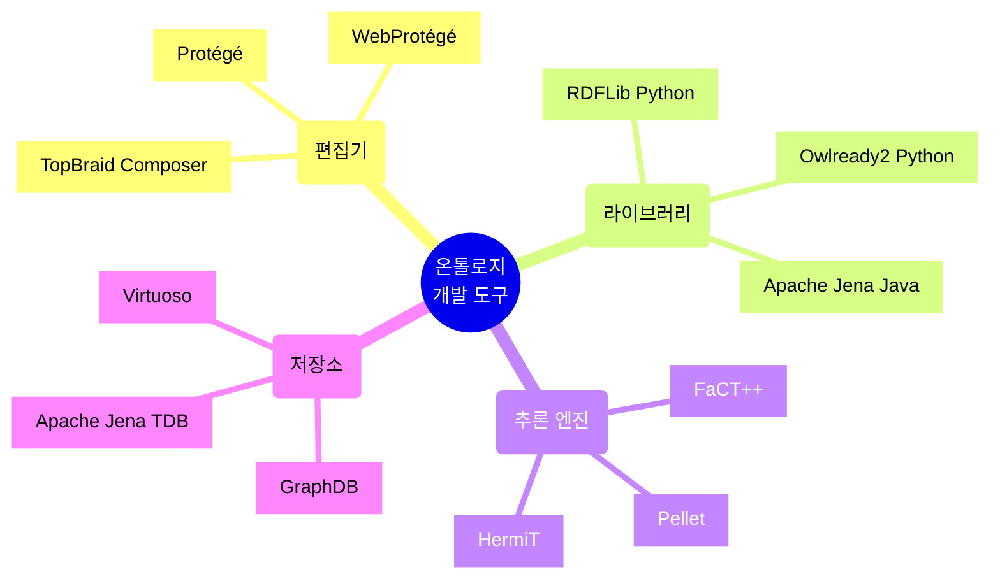

### Protégé 사용 예시

**Protégé** 는 가장 널리 사용되는 온톨로지 편집기다.

1. 클래스 계층 시각화
2. 속성 정의 및 제약조건 설정
3. 개체 생성 및 관계 매핑
4. 추론 엔진 실행
5. SPARQL 쿼리 테스트

> **실무 팁**: Protégé로 온톨로지를 설계하고, Python 코드로 자동화된 데이터 입력 및 쿼리를 구현하는 하이브리드 접근이 효과적이다.
{: .prompt-tip}

## 🎓 온톨로지 설계 모범 사례

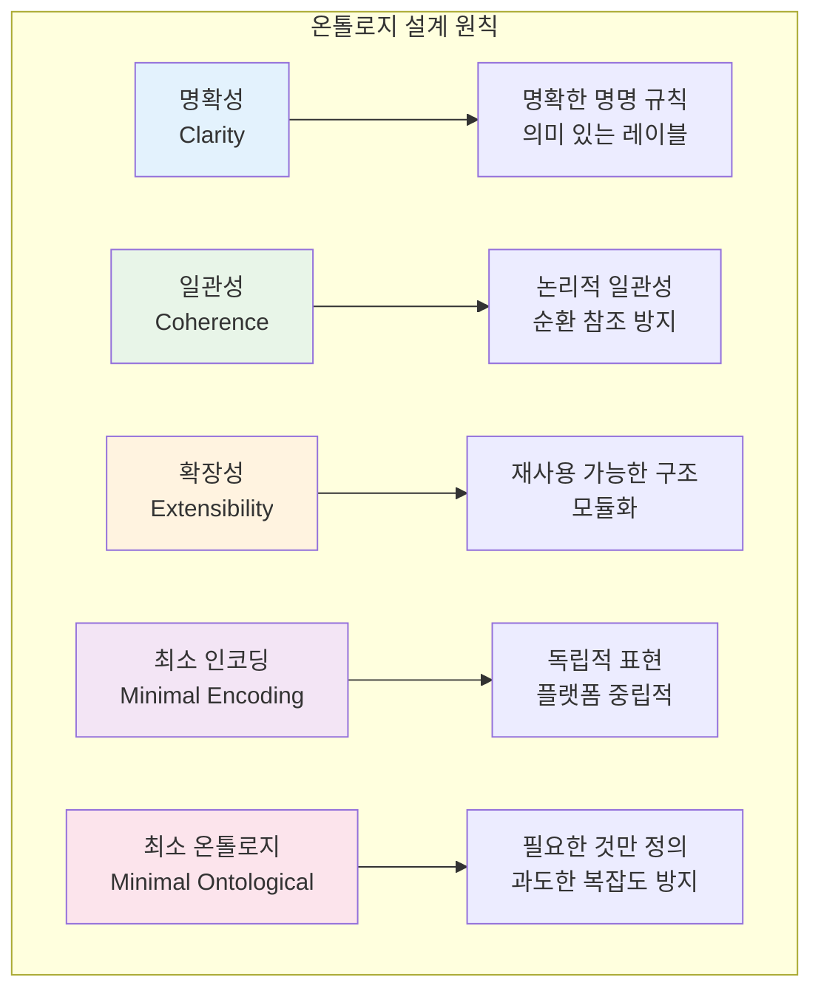

### 좋은 온톨로지 vs 나쁜 온톨로지

|측면|좋은 예시|나쁜 예시|
|---|---|---|
|**명명**|`Person`, `worksFor`|`P1`, `rel_2`|
|**계층**|명확한 is-a 관계|순환 상속|
|**속성**|명확한 도메인/범위|모호한 정의|
|**문서화**|레이블, 주석 포함|설명 없음|
|**재사용**|표준 온톨로지 확장|처음부터 새로 작성|

## 🚀 온톨로지의 미래와 활용 전망

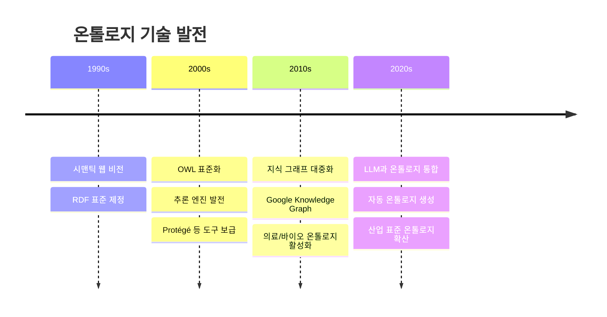

### 주요 활용 분야

- **지식 그래프**: Google, Microsoft, Facebook의 검색 엔진
- **의료 정보학**: 질병 분류, 약물 상호작용
- **바이오인포매틱스**: 유전자 온톨로지(Gene Ontology)
- **IoT**: 디바이스와 센서 의미론
- **금융**: 규제 준수, 리스크 관리

> **미래 전망**: LLM(대규모 언어 모델)과 온톨로지의 결합으로, 더 정확하고 신뢰할 수 있는 AI 시스템이 구축될 것이다. 온톨로지는 LLM의 환각(hallucination) 문제를 완화하는 데 중요한 역할을 할 것이다.
{: .prompt-warning}

## 🎯 결론

데이터 온톨로지는 단순한 데이터 구조를 넘어 **의미(Semantics)** 를 표현하는 강력한 도구다.

**핵심 요점**

- 온톨로지는 도메인 지식을 형식화하여 컴퓨터가 이해할 수 있게 만든다
- RDF, RDFS, OWL은 온톨로지 표현의 표준이며, 각각 다른 표현력을 제공한다
- Python의 rdflib과 owlready2로 온톨로지를 프로그래밍적으로 다룰 수 있다
- 추론 기능을 통해 명시되지 않은 지식도 자동으로 도출할 수 있다
- 지식 그래프, 추천 시스템, 의료 정보학 등 다양한 분야에서 활용된다

**실무 적용 팁**

1. 작게 시작하라: 핵심 개념부터 점진적으로 확장
2. 표준을 활용하라: 기존 온톨로지(FOAF, Dublin Core 등)를 재사용
3. 도구를 활용하라: Protégé로 설계, Python으로 자동화
4. 지속적으로 개선하라: 도메인 전문가와 협력하여 정제

> 온톨로지는 데이터에 **지능** 을 부여하는 기술이다. 단순히 데이터를 저장하는 것을 넘어, 데이터가 무엇을 의미하고 어떻게 연결되는지를 표현함으로써, 더 똑똑한 시스템을 구축할 수 있다.
{: .prompt-tip}